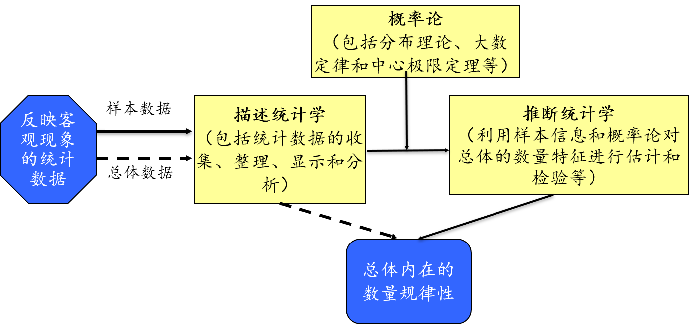

background-image: url("pic/slide-front-page.jpg")
class: center,middle

# 统计学原理(Statistic)

### 胡华平

### 西北农林科技大学

### 经济管理学院数量经济教研室

### huhuaping01@hotmail.com

### `r Sys.Date()`

```{r global_options, echo=F,message=FALSE,warning=F}
source("R/set-global.R")

```

```{r ex-math-eq}
source("R/external-math-equation.R")
```

<style type="text/css">
.remark-slide-content {
    font-size: 24px;
    padding: 1em 4em 1em 4em;
}
</style>

---
class: inverse, center, middle, duke-softblue

# 为什么学习统计学

---
## 辛普森悖论的警示


```{r}
simpson <- data.frame("部门"=c("A", "B", "C", "D", "E", "F"), 
                 "男性申请数"=c(825,560,325,417,191,272), 
                 "男性录用率"=c(.62,.63,.37,.33,.28,.06),
                 "女性申请数"= c(108,25,593,375,393,341),
                 "女性录用率"=c(.82,.68,.34,.35,.24,.07))

list_name <- names(simpson)

simpson_long <- simpson %>%
  gather(key = "vars", value = "value", -`部门`) %>%
  mutate(gender = if_else(str_detect(vars, "^男性"), "男性", "女性"),
         cat = if_else(str_detect(vars, "申请数$"), "申请数", "录用率")) %>%
  select(`部门`,gender, cat, value) 
  
smry_ratio <- simpson_long  %>% 
  spread(key = cat, value=value) %>%
  group_by(gender) %>%
  summarise("录用率" = weighted.mean(`录用率`,`申请数` ))

smry_count <- simpson_long  %>% 
  spread(key = cat, value=value) %>%
  group_by(gender) %>%
  summarise("申请数" = sum(`申请数` ))

smry <- left_join(smry_count,smry_ratio, by="gender") %>%
  gather(key = "cat", value = "value", -gender) %>%
  add_column("部门"="合计") %>%
  select(one_of(names(simpson_long)))

detail_long <- rbind(simpson_long, smry)

```


故事是这么说的：

```{r}
smry %>%
  spread(key=cat,value=value) %>%
  select(gender, `申请数`, `录用率`) %>%
  datatable(caption = "录用女性的六大部门") %>%
  formatPercentage(c(3), 0)

```


---
## 辛普森悖论的警示

但故事背后却另有蹊跷：

```{r simpsontable, echo=FALSE, warning = FALSE}

simpson %>% 
  datatable(caption = "录用女性的六大部门") %>%
  formatPercentage(c(3,5), 0)

```

---
## 辛普森悖论的警示

事情的“真相”是：

```{r}
detail_long %>%
  unite("vars", gender,cat,sep = "") %>%
  spread(key=vars, value = value) %>%
  select(one_of(names(simpson))) %>%
  datatable(caption = "录用女性的六大部门") %>%
  formatPercentage(c(3,5), 0)
```

---
## 辛普森悖论的警示

对比一下

.pull-left[

```{r}
smry_weight <- simpson_long  %>% 
  spread(key = cat, value=value) %>% 
  mutate("录用数"= `录用率`*`申请数`) 

smry_weight%>%
  filter(gender =="男性") %>%
  arrange(desc(`录用数`)) %>%
  datatable(caption = "男性最喜欢的部门排序") %>%
  formatPercentage(3,0) %>%
  formatRound(5,0)

```

]


.pull-right[

```{r}
smry_weight%>%
  filter(gender =="女性") %>%
  arrange(desc(`录用数`)) %>%
  datatable(caption = "女性最喜欢的部门排序") %>%
  formatPercentage(3,0) %>%
  formatRound(5,0)

```
]


---
## 辛普森悖论的警示

更加细节的数据：


```{r}
load("data-analysis//berkeley.Rdata")

berkeley %>%
  rename("女性申请数" ="women.apply" ,
         "总录用率"= "total.admit"   , 
         "总申请数" ="number.apply") %>%
  add_column("部门"=1:dim(.)[1], .before = "女性申请数") %>%
  datatable(caption = "39个部门的录用情况",
            options = list(dom = "tip", pageLength=5
                           ))

```


---
## 辛普森悖论的警示

令人吃惊的对称性分布：

```{r}
plot.new()
xlu <- 80
plot.window(  xlim = c(0,100),
              ylim = c(0,100)  
)
symbols( x = berkeley$women.apply, 
         y = berkeley$total.admit,
         circles = sqrt( berkeley$number.apply ),
         inches = .3,
         fg= "blue",
         add = TRUE
)

lines( x = berkeley.small$women.apply,
       y = berkeley.small$total.admit,
       type = "p",
       pch = 3,
       col = "gray50",
       cex = 1
)

axis(side = 1)
axis(side = 2)
title(   xlab = "女性申请者百分比",
         ylab = "录用率(包括所有性别)"
)
#title( main = "The Berkeley admissions data", font.main = 1)

coef <- lm( formula = total.admit ~ women.apply,
            data = berkeley,
            weights = number.apply
)$coefficients
lines( x = c(0,xlu), y = coef[1]+c(0,xlu)*coef[2]) 
```


**说明**：圆圈表示总申请数大于40人的部门，叉叉表示总申请数小于40人的部门


---
## 信念偏见诅咒 

**信念偏见效应**：如果你让人们决定一个特定的论点是否在逻辑上是有效的，我们往往会受到结论可信度的影响，即使我们不应该这样做。

这是一个有效的**论据**，其**结论**是可信的：：

- 没有香烟很便宜（前提1）

- 有些令人上瘾的东西很便宜（前提2）

- 因此，有些令人上瘾的东西不是香烟（结论）

这是一个有效的**论据**，但其**结论**是不可信的：

- 没有令人上瘾的东西很便宜（前提1）

- 有些香烟很便宜（前提2）

- 因此，有些香烟不会上瘾（结论）

---
## 信念偏见诅咒 

```{r}
include_graphics("pic/chpt01-believe-bias.png")
```


---
## 信念偏见诅咒：持枪和控枪的美国现象

**素材1**：

- 美国宪法规定，人民持有和携带武器的权利不受侵犯，这是宪法权利。美国历史上地广人稀，一旦发生暴力事件，警察没办法及时赶到现场，所以美国人民应该有枪支自卫。

**观点**：

A. 宪法很大程度考虑到了公民个人私人持枪的选择权

B. 菜刀在坏人手里会成为凶器，私人持枪以保护自己和身边的人不受侵害也同样重要

C. 其他观点


---
## 信念偏见诅咒：持枪和控枪的美国现象

**素材2**：

- 1968年美国人口2亿，拥有枪支1.1亿；今天美国人口3.2亿，拥有枪支3.6亿！50年前是两人一支，现在是几乎一人一支。

- 2016年美国枪支产业雇佣了30多万人，对美国经济的贡献是500亿。美国枪支市场巨大，提供了几十万个工作机会，也养活了很多利益集团，他们不答应禁枪等等。


**观点**：

A. 军火产业虽然提供了一些就业，但也助长了枪击事件的发生

B. 军火市场根深蒂固，进而让私人禁枪的提案或修宪变得困难

C. 其他观点

---
## 信念偏见诅咒：持枪和控枪的美国现象

**素材3**：

- 美国有三亿多支枪，每年被枪杀的人3万多。2014年美国有4万人自杀，其中超过一半选择用枪；70岁以上自杀的老人，选择用枪的比例最高，74%。

- 美国虽然总发生枪击案，但发生的概率仅有千分之0.1。过去23年美国枪杀案的比例整整下降了1倍！

**观点**：

A. 枪击事件很大程度上是因为影响恶劣而被社会过度关注和解读

B. 引发死亡率的主因很多，私人持枪造成的社会伤害并没有愈演愈烈

C. 其他观点

---
## 信念偏见诅咒：持枪和控枪的美国现象

**素材4**：

- 美国枪支管理法律不是越来越严，而是越来越松。

- 正反观点针锋相对：“美国游泳淹死的人是5倍于被枪走火打死的”。“我亲戚三岁的小姑娘被他爸枪走火打死。如果这个小孩是你的，你愿意她成为你玩枪的社会成本吗？”

- 如果不发生这次拉斯维加斯枪击案，美国又会出台一个放宽枪支管制的议案，要讨论允许私人购买枪支消声器的议案，就是可以公开卖无声枪了。在美国，要自杀的人没枪也会用别的方式死，美国人对死亡的观念：毒药、安乐死与尊严

**观点**：

A. 控枪政策日趋放松尽管有其可解释之处，但并不是长远明智之举

B. 持枪派，控枪派和中立派或许都无可厚非，各方相互制衡最为重要

C. 其他观点


---
class: center, middle, inverse

# 关于统计学


---
## 统计学的方法论

用**样本**.red[描述]或.red[推断]**总体**。**概率论**在其中发挥着重要作用，也是方法论的分水岭。

```{r}

```

---
## 描述性统计(descriptive statistics)

- **定义**：研究数据收集、处理、汇总、图表描述、概括与分析等统计方法 

- **内容**：
    - 搜集数据
    - 整理数据
    - 展示数据
    - 描述性分析

- **目的**：描述数据特征；找出数据的基本规律

---
## 描述性统计(descriptive statistics)

```{r}
include_graphics("pic/chpt01-descriptive-stat.jpg", dpi = 100)
```


---
## 推断性统计(inferential statistics)

- **定义**：研究如何利用样本数据来推断总体特征的统计方法

- **内容**：
    - 参数估计
    - 假设检验

- **目的**：对总体特征作出推断

---
## 推断性统计(inferential statistics)

```{r}
include_graphics("pic/chpt01-inferential-stat.png", dpi = 100)
```

---
## 推断性统计(inferential statistics)

```{r}
include_graphics("pic/chpt01-inferential-stat-sampling.png", dpi = 140)
```

---
## 总体和样本

**总体(population)**：

- **定义**：所研究的全部个体(数据) 的集合，其中的每一个个体也称为元素

- **分类**：分为有限总体和无限总体

    - 有限总体的范围能够明确确定，且元素的数目是有限的
    - 无限总体所包括的元素是无限的，不可数的

**样本 (sample)**

- **定义**：从总体中抽取的一部分元素的集合

- **样本容量**：构成样本的元素的数目称为样本容量或样本量 (sample size)

---
## 参数和统计量

**参数(parameter)**:

- **定义**：描述总体特征的概括性数字度量，是研究者想要了解的总体的某种特征值

- **重要统计量**：所关心的参数主要有总体均值(
$\mu$)、方差(
$\sigma^2$) 等

- **记号**：总体参数通常用希腊字母表示
$\mu,\sigma^2,\Phi,\gamma,\cdots$

**统计量(statistic)**:

- **定义**：用来描述样本特征的概括性数字度量，它是根据样本数据计算出来的一些量，是样本的函数

- **重要统计量**：所关心的样本统计量有样本均值(
$\bar{x}$)、样本方差(
$s^2$) 等

- **记号**：样本统计量通常用小写英文字母来表示
$\bar{x},s^2,w,v,\cdots$


---
class: center, middle, inverse

# 统计分析的基本过程

---
## 统计分析的基本过程

- 实际问题：发现问题

- 收集数据：取得数据

- 处理数据：整理与图表展示 

- 分析数据：利用统计方法分析数据

- 解释数据:	结果的说明

- 得到结论：从数据分析中得出客观结论


---
class: center, middle, inverse

# 变量和数据

---
## 变量


```{r, fig.height=4, eval=FALSE}
#install.packages("DiagrammeR")
library(DiagrammeR)
library(DiagrammeRsvg)
library(magrittr)
library(svglite)
library(rsvg)
library(png)
g <- grViz("digraph flowchart {
      # node definitions with substituted label text
      node [fontname = Helvetica, shape = rectangle]        
      tab1 [label = '@@1']
      tab2 [label = '@@2']
      tab3 [label = '@@3']
      tab4 [label = '@@4']
      tab5 [label = '@@5']

      # edge definitions with the node IDs
      tab1 -> tab2 ;
      tab1 -> tab3 -> tab4 ;
      tab3 -> tab5;
      }

      [1]: '变量\\n(Variable)'
      [2]: '定性变量\\n(Qualitative variable)'
      [3]: '定量变量\\n(Quantitative variable)'
      [4]: '离散变量\\n(Discrete variable)'
      [5]: '连续变量\\n(Continuous variable)'
      ")
g %>% export_svg %>% charToRaw %>% rsvg %>% png::writePNG("pic/flowchart-variables.pdf")
```

.pull-left[

]

--

.pull-right[
- 变量：描述事物或现象的变化特征。


- 定性变量：非数值化的变量。

- 定量变量：数值化的变量。


- 离散变量：可能的取值比较有限、并能轻松列示的一类定量变量。

- 连续变量：可能的取值较多、以特定微小数值间隔的一类定量变量。
]

---
## 变量

- 按变量是否随机：

    - 随机变量
    
    - 非随机变量

- 按变量是否抽象化：

    - 经验变量：经验变量所描述的是我们周围可以观察到的事物

    - 理论变量：理论变量则是由统计学家用数学方法所构造出来的一些变量，比如z 统计量、t 统计量、
$\chi^2$统计量、F 统计量等。


---
## 数据


```{r, fig.height=4, eval=FALSE}
g <- grViz("digraph flowchart {
      # node definitions with substituted label text
      node [fontname = Helvetica, shape = rectangle]        
      tab1 [label = '@@1']
      tab2 [label = '@@2']
      tab3 [label = '@@3']
      tab4 [label = '@@4']
      tab5 [label = '@@5']

      # edge definitions with the node IDs
      tab1 -> tab2 ;
      tab1 -> tab3 -> tab4 ;
      tab3 -> tab5;
      }

      [1]: '数据\\n(Data)'
      [2]: '定性数据\\n(Qualitative data)'
      [3]: '定量数据\\n(Quantitative data)'
      [4]: '离散数据\\n(Discrete data)'
      [5]: '连续数据\\n(Continuous data)'
      ")
g %>% export_svg %>% charToRaw %>% rsvg %>% png::writePNG("pic/flowchart-data.pdf")
```

.pull-left[

]

--

.pull-right[
- 数据：变量的取值。


- 定性数据：定性变量的取值。

- 定量数据：定量变量的取值。

- 离散数据：离散变量的取值。

- 连续数据：连续变量的取值。
]

---
class: middle, center, duke-orange


## SPSS统计软件下的变量和数据
## show time！

---
class: middle,center
background-size: cover
background-image: url("pic/chpt01-spss-data-view.png")

## .red[SPSS软件的数据视图]

---
class: middle,center
background-size: cover
background-image: url("pic/chpt01-spss-var-view.png")
## .red[SPSS软件的变量视图]

---
class: middle, center, duke-orange


## R统计软件下的变量和数据
## show time！


---
## 纽约机场数据库：变量视图

只看2013年1月的数据。

```{r,comment="", echo=TRUE}
require("nycflights13") 
data(flights)                     # 导入数据集
flights_jan <- flights %>%
  filter(month == 1)              # 只看2013年1月的数据
str(flights_jan, max.level =5, list.len =10)
```

---
## 纽约机场数据库：数据视图

只看2013年1月数据集的前500条数据。

```{r,comment="", echo=F}
head(flights_jan,500) %>%    # 只看前500条数据
  datatable(extensions = 'FixedColumns',
            options = list(pageLength =4,dom="tip",
                           scrollX = TRUE,
                           fixedColumns = TRUE))
```

---
class: center, middle, inverse

# 数据的计量层次

```{r, fig.height=4, eval=F}
g <- grViz("digraph flowchart {
      # node definitions with substituted label text
      node [fontname = Helvetica, shape = rectangle]        
      tab1 [label = '@@1']
      tab2 [label = '@@2']
      tab3 [label = '@@3']
      tab4 [label = '@@4']
      tab5 [label = '@@5']

      # edge definitions with the node IDs
      tab1 -> tab2 ;
      tab1 -> tab3 ;
      tab1 -> tab4 ;
      tab1 -> tab5
      }

      [1]: '数据层次\\n(scale)'
      [2]: '名义数据\\n(nominal data)'
      [3]: '序数数据\\n(ordinal data)'
      [4]: '区间数据\\n(interval data)'
      [5]: '比率数据\\n(ratio data)'
      ")
g
#g %>% export_svg %>% charToRaw %>% rsvg %>% png::writePNG("pic/flowchart-data-scale.pdf")
```


---
## 名义数据(nominal data)

- 取值只用于区分所属类别的定性数据。

- 对事物进行分类的结果，数据表现为类别，一般用文字来表述。

    - 例如，性别(男、女）和婚姻状况(已婚、未婚、离婚、分居）之类的变量。

--

```{r}
include_graphics("pic/nominal-show.png")
```

---
## 序数数据(ordinal data)

- 变量的不同取值有顺序差异，即存在自然顺序

- 变量的不同取值的差值，没有实际意义

    - 五分量表、无差异曲线


--

```{r}
include_graphics("pic/ordinal-show.png")
```

---
## 序数数据(ordinal data)

无差异曲线：

.pull-right[
```{r}
include_graphics("pic/ordinal-show2.png", dpi=50)
```

]

---

## 区间数据( interval data) ：

区间数据( interval data) 的数值存在自然顺序、可以比较大小（加减）、但乘除比率没有意义。

- 变量的不同取值有顺序差异，即存在自然顺序

- 变量的不同取值的差值，也具有实际意义

- 但不同取值的比率是没有实际意义的

--
    - 两个时期之内的距离(如2000 – 1995) 是有意义的，但两个时期的比率(2000/1995) 就没有什么意义。

--
    - 2013年8 月11 日上午11 点天气预报说杨凌的温度是华氏60 度，而长沙达到华氏90 度。长沙比杨凌温度高30华氏度(90-60)，是可以的。但说长沙比杨凌暖和1.5倍(90/60)，是没有意义。

---
## 比率数据(ratio data)：

比率数据(ratio data)的取值存在自然顺序、可以比较大小（加减）、乘除比率有实际意义。

- 变量存在真实“零点”

- 变量的不同取值存在自然顺序（
$X_2 \leq X_1$或
$X_2 \geq X_1$）

- 变量的不同取值之差是有实际意义的(
$X_2-X_1$) 

- 变量的不同取值的乘除都是有意义的（
$X_1/X_2$）

    - 如：GDP(亿元)、个人收入(元)等

---
## 数据层次小结

数据层次与数据运算可能性存在一定联系：

```{r}
scale_smry <- read.xlsx2("data-analysis/chpt01-scale-variable.xlsx",1,startRow = 2) %>%
  as_tibble()
scale_smry %>%
  datatable(options = list(pageLength =9))

```


---
class: inverse, middle, center
# 数据的时间状态

---

## Type1：时间序列数据(time series data)：

**时间序列数据**：对一个变量在不同时间取值的一组观测结果。按取值间隔可分为**高频数据**和**低频数据**。

--

- 实时牌价：如股票价格

- 每日(daily）：如天气预报

- 每周(weekly）：如货币供给数字

--

- 每月(monthly）：如失业率和消费者价格指数

- 每季度(quarterly）：如GDP

- 每年(annually）：如政府预算

- 每5 年(quinquennially）：如制造业普查资料

- 每10 年( decennially）：如人口普查资料

---

## Type1：时间序列数据(time series data)：

平稳性(stationary)：如果一个时间序列的均值和方差不随时间而系统地变化，那它就是平稳的(stationary) 。

```{r, fig.cap="1951年1月-1999年9月美国的M1货币供给"}
include_graphics("pic/chpt01-1-data-series-M1.png", dpi=120)
```

---
## Type2：截面数据(cross-section data)：

横截面数据：对一个或多个变量在同一时间点上收集的数据

异质性(heterogeneity) ：当我们的统计分析包含有异质的单位时，我们必须考虑尺度(size)或规模效应(scale effect) 以避免造成混乱。

---

### 案例：鸡蛋价格与鸡蛋产量

```{r}
eggs <- as_tibble(read.xlsx("data/Table-1-1-eggs.xlsx"))
eggs %>%
  select(STATE, Y1, X1) %>%
  datatable(options = list(pageLength=5, dom="tip"),
            caption = "美国50个州的蛋类生产和价格数据")
```

其中，
$Y_1$代表1990年鸡蛋产量(百万个)；
$X_1$代表1990年每打鸡蛋的价格(美分/打)。

---

### 案例：鸡蛋价格与鸡蛋产量


```{r, fig.cap= "1990年蛋产量与价格的关系",fig.height=6, fig.width=10}
eggs %>%
  select(STATE, X1, Y1) %>%
  ggplot(aes(x=Y1, y=X1)) +
  geom_point(color="blue", size=2) +
  theme(text = element_text(size=16)) +
  labs(x="鸡蛋产量(百万个)", y="鸡蛋价格(美分/打)")

```

.content-box-blue[思考提问：]

???

- 图中特征符合经济学理论么？为什么？

- 图中反映了数据可能存在哪些潜在问题？


---
## Type3：面板数据(Panel Data)

**面板数据**：是兼有时间序列和横截面数据两种成份，指对相同的横截面单元在时间轴上进行跟踪调查的数据。

- 平衡面板(balanced panel)：所有截面单元都具有相同的观测次数

- 非平衡面板(unbalanced panel)：并非所有截面单元都具有相同的观测次数

**数据点**（观测数）
$n$：

- 数据点（观测数）=截面单元数*时期数，也即：
$n=q\ast t$。

可能存在的问题：

- “平稳性”问题：

- “异方差”问题：

---

### 案例：钢铁公司

两家钢铁公式的数据案例：

- 公司：GE=通用公司；US=美国钢铁

- I=真实总投资（百万美元）

- F=前一年的企业真实价值 （百万美元）

- C=前一年的真实资本存量（百万美元）


```{r}
steel <- as.tibble(read.xlsx("data/Table-1-2-steel.xlsx"))
steel_wide <-steel %>%
  filter(company =="US"| company =="GE") %>%
  gather(key= "var", value="value",I:C) %>%
  unite(col="var", company, var, sep=".") %>%
  spread(key=var, value= value, sep= "_") 

names(steel_wide)<- c("year",
                           "GE.C", "GE.F", "GE.I", 
                           "US.C", "US.F", "US.I")
steel_long <-steel %>%
  filter(company =="US"| company =="GE") 
  
```

---

### 案例：钢铁公司

扁数据形式：

```{r}
datatable(steel_wide, 
          options = list(pageLength=7, dom="tip"),
          caption = "1935-1954年间美国两大钢铁公司的数据(扁数据)")
```

---

### 案例：钢铁公司

```{r, fig.cap="两家公司的企业投资情况"}
ggplot(data = steel_long, 
       aes(x=year, y=I, group=company,color=company)) +
  geom_line()+
  geom_point() +
  labs(x="年份", y="企业投资（百万美元）")
```

---

### 案例：钢铁公司

长数据形式：

```{r}
datatable(steel_long, 
          options = list(pageLength=7, dom="tip"),
          caption = "1935-1954年间美国两大钢铁公司的数据(长数据)")
```


---

### 案例：钢铁公司

缺失部分数据：

```{r}
steel_wide %>%
  mutate(US.C=ifelse(year %in% c(1940,1953), NA, US.C),
         US.F=ifelse(year %in% c(1940,1953), NA, US.F),
         US.I=ifelse(year %in% c(1940,1953), NA, US.I)) %>%
  datatable(options = list(pageLength=7, dom="tip"),
          caption = "1935-1954年间美国两大钢铁公司的数据(缺失部分数据)")
```

.content-box-blue[课堂测试：]

???

- 问1：平衡面板还是非平衡面板？

- 问2：多少数据点？

- 问3：两个公司投资函数是否相同？
