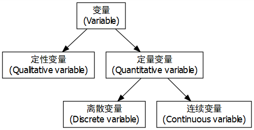
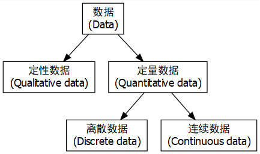

background-image: url("pic/slide-front-page.jpg")
class: center,middle

# 统计学原理(Statistic)

### 胡华平

### 西北农林科技大学

### 经济管理学院数量经济教研室

### huhuaping01@hotmail.com

### `r Sys.Date()`

```{r global_options, echo=F,message=FALSE,warning=F}
source("R/set-global.R")

```

```{r ex-math-eq}
source("R/external-math-equation.R")
```

<style type="text/css">
.remark-slide-content {
    font-size: 24px;
    padding: 1em 4em 1em 4em;
}
</style>

---
class: inverse, center, middle, duke-softblue

# 为什么学习统计学

---
## 辛普森悖论的警示


```{r}
simpson <- data.frame("部门"=c("A", "B", "C", "D", "E", "F"), 
                 "男性申请数"=c(825,560,325,417,191,272), 
                 "男性录用率"=c(.62,.63,.37,.33,.28,.06),
                 "女性申请数"= c(108,25,593,375,393,341),
                 "女性录用率"=c(.82,.68,.34,.35,.24,.07))

list_name <- names(simpson)

simpson_long <- simpson %>%
  gather(key = "vars", value = "value", -`部门`) %>%
  mutate(gender = if_else(str_detect(vars, "^男性"), "男性", "女性"),
         cat = if_else(str_detect(vars, "申请数$"), "申请数", "录用率")) %>%
  select(`部门`,gender, cat, value) 
  
smry_ratio <- simpson_long  %>% 
  spread(key = cat, value=value) %>%
  group_by(gender) %>%
  summarise("录用率" = weighted.mean(`录用率`,`申请数` ))

smry_count <- simpson_long  %>% 
  spread(key = cat, value=value) %>%
  group_by(gender) %>%
  summarise("申请数" = sum(`申请数` ))

smry <- left_join(smry_count,smry_ratio, by="gender") %>%
  gather(key = "cat", value = "value", -gender) %>%
  add_column("部门"="合计") %>%
  select(one_of(names(simpson_long)))

detail_long <- rbind(simpson_long, smry)

```


故事是这么说的：

```{r}
smry %>%
  spread(key=cat,value=value) %>%
  select(gender, `申请数`, `录用率`) %>%
  datatable(caption = "录用女性的六大部门") %>%
  formatPercentage(c(3), 0)

```


---
## 辛普森悖论的警示

但故事背后却另有蹊跷：

```{r simpsontable, echo=FALSE, warning = FALSE}

simpson %>% 
  datatable(caption = "录用女性的六大部门") %>%
  formatPercentage(c(3,5), 0)

```

---
## 辛普森悖论的警示

事情的“真相”是：

```{r}
detail_long %>%
  unite("vars", gender,cat,sep = "") %>%
  spread(key=vars, value = value) %>%
  select(one_of(names(simpson))) %>%
  datatable(caption = "录用女性的六大部门") %>%
  formatPercentage(c(3,5), 0)
```

---
## 辛普森悖论的警示

对比一下

.pull-left[

```{r}
smry_weight <- simpson_long  %>% 
  spread(key = cat, value=value) %>% 
  mutate("录用数"= `录用率`*`申请数`) 

smry_weight%>%
  filter(gender =="男性") %>%
  arrange(desc(`录用数`)) %>%
  datatable(caption = "男性最喜欢的部门排序") %>%
  formatPercentage(3,0) %>%
  formatRound(5,0)

```

]


.pull-right[

```{r}
smry_weight%>%
  filter(gender =="女性") %>%
  arrange(desc(`录用数`)) %>%
  datatable(caption = "女性最喜欢的部门排序") %>%
  formatPercentage(3,0) %>%
  formatRound(5,0)

```
]


---
## 辛普森悖论的警示

更加细节的数据：


```{r}
load("data-analysis//berkeley.Rdata")

berkeley %>%
  rename("女性申请数" ="women.apply" ,
         "总录用率"= "total.admit"   , 
         "总申请数" ="number.apply") %>%
  add_column("部门"=1:dim(.)[1], .before = "女性申请数") %>%
  datatable(caption = "39个部门的录用情况",
            options = list(dom = "tip", pageLength=5
                           ))

```


---
## 辛普森悖论的警示

令人吃惊的对称性分布：

```{r}
plot.new()
xlu <- 80
plot.window(  xlim = c(0,100),
              ylim = c(0,100)  
)
symbols( x = berkeley$women.apply, 
         y = berkeley$total.admit,
         circles = sqrt( berkeley$number.apply ),
         inches = .3,
         fg= "blue",
         add = TRUE
)

lines( x = berkeley.small$women.apply,
       y = berkeley.small$total.admit,
       type = "p",
       pch = 3,
       col = "gray50",
       cex = 1
)

axis(side = 1)
axis(side = 2)
title(   xlab = "女性申请者百分比",
         ylab = "录用率(包括所有性别)"
)
#title( main = "The Berkeley admissions data", font.main = 1)

coef <- lm( formula = total.admit ~ women.apply,
            data = berkeley,
            weights = number.apply
)$coefficients
lines( x = c(0,xlu), y = coef[1]+c(0,xlu)*coef[2]) 
```


**说明**：圆圈表示总申请数大于40人的部门，叉叉表示总申请数小于40人的部门


---
## 信念偏见诅咒 

**信念偏见效应**：如果你让人们决定一个特定的论点是否在逻辑上是有效的，我们往往会受到结论可信度的影响，即使我们不应该这样做。

这是一个有效的**论据**，其**结论**是可信的：：

- 没有香烟很便宜（前提1）

- 有些令人上瘾的东西很便宜（前提2）

- 因此，有些令人上瘾的东西不是香烟（结论）

这是一个有效的**论据**，但其**结论**是不可信的：

- 没有令人上瘾的东西很便宜（前提1）

- 有些香烟很便宜（前提2）

- 因此，有些香烟不会上瘾（结论）

---
class: center, middle, inverse

# 变量和数据

---
## 变量


```{r, fig.height=4, eval=FALSE}
#install.packages("DiagrammeR")
library(DiagrammeR)
library(DiagrammeRsvg)
library(magrittr)
library(svglite)
library(rsvg)
library(png)
g <- grViz("digraph flowchart {
      # node definitions with substituted label text
      node [fontname = Helvetica, shape = rectangle]        
      tab1 [label = '@@1']
      tab2 [label = '@@2']
      tab3 [label = '@@3']
      tab4 [label = '@@4']
      tab5 [label = '@@5']

      # edge definitions with the node IDs
      tab1 -> tab2 ;
      tab1 -> tab3 -> tab4 ;
      tab3 -> tab5;
      }

      [1]: '变量\\n(Variable)'
      [2]: '定性变量\\n(Qualitative variable)'
      [3]: '定量变量\\n(Quantitative variable)'
      [4]: '离散变量\\n(Discrete variable)'
      [5]: '连续变量\\n(Continuous variable)'
      ")
g %>% export_svg %>% charToRaw %>% rsvg %>% png::writePNG("pic/flowchart-variables.pdf")
```

.pull-left[

]

--

.pull-right[
- 变量：描述事物或现象的变化特征。


- 定性变量：非数值化的变量。

- 定量变量：数值化的变量。


- 离散变量：可能的取值比较有限、并能轻松列示的一类定量变量。

- 连续变量：可能的取值较多、以特定微小数值间隔的一类定量变量。
]

---
## 数据


```{r, fig.height=4, eval=FALSE}
#install.packages("DiagrammeR")
library(DiagrammeR)
library(DiagrammeRsvg)
library(magrittr)
library(svglite)
library(rsvg)
library(png)
g <- grViz("digraph flowchart {
      # node definitions with substituted label text
      node [fontname = Helvetica, shape = rectangle]        
      tab1 [label = '@@1']
      tab2 [label = '@@2']
      tab3 [label = '@@3']
      tab4 [label = '@@4']
      tab5 [label = '@@5']

      # edge definitions with the node IDs
      tab1 -> tab2 ;
      tab1 -> tab3 -> tab4 ;
      tab3 -> tab5;
      }

      [1]: '数据\\n(Data)'
      [2]: '定性数据\\n(Qualitative data)'
      [3]: '定量数据\\n(Quantitative data)'
      [4]: '离散数据\\n(Discrete data)'
      [5]: '连续数据\\n(Continuous data)'
      ")
g %>% export_svg %>% charToRaw %>% rsvg %>% png::writePNG("pic/flowchart-data.pdf")
```

.pull-left[

]

--

.pull-right[
- 数据：变量的取值。


- 定性数据：定性变量的取值。

- 定量数据：定量变量的取值。

- 离散数据：离散变量的取值。

- 连续数据：连续变量的取值。
]
