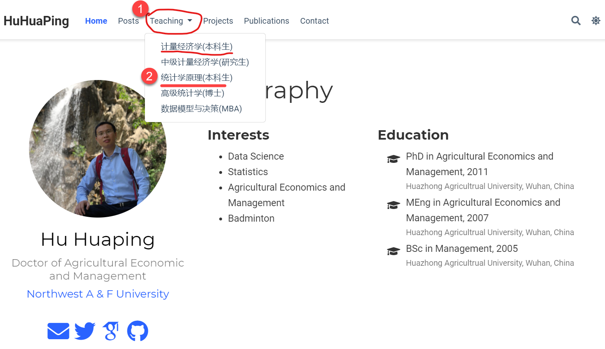
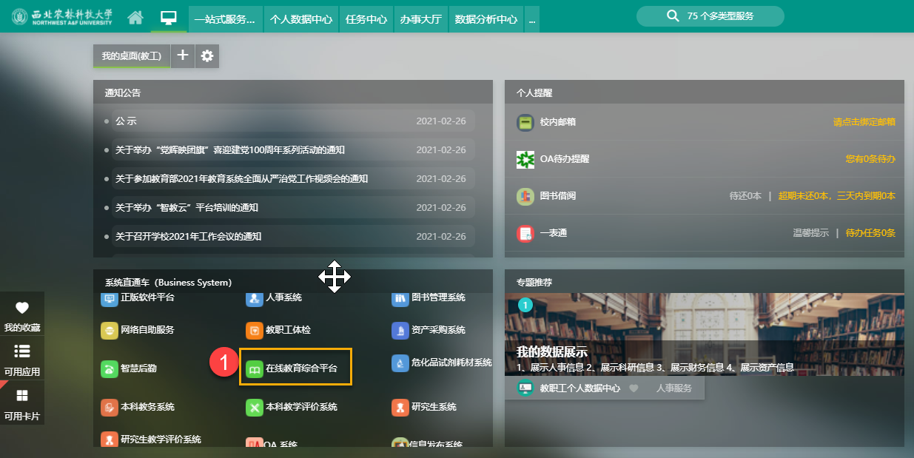
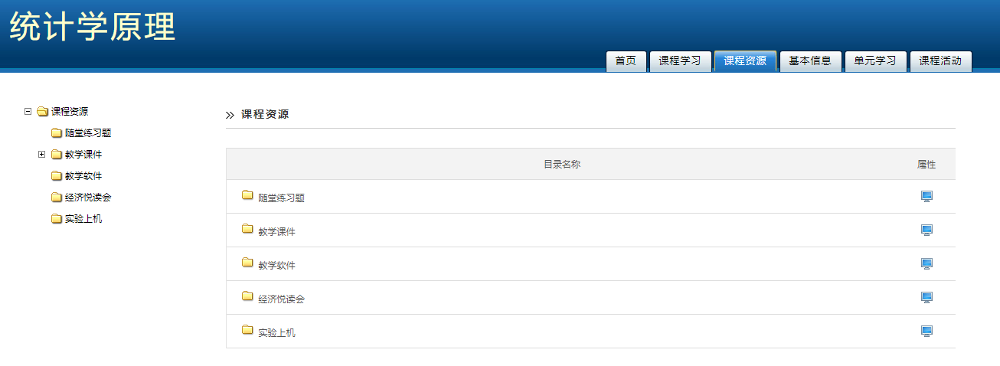
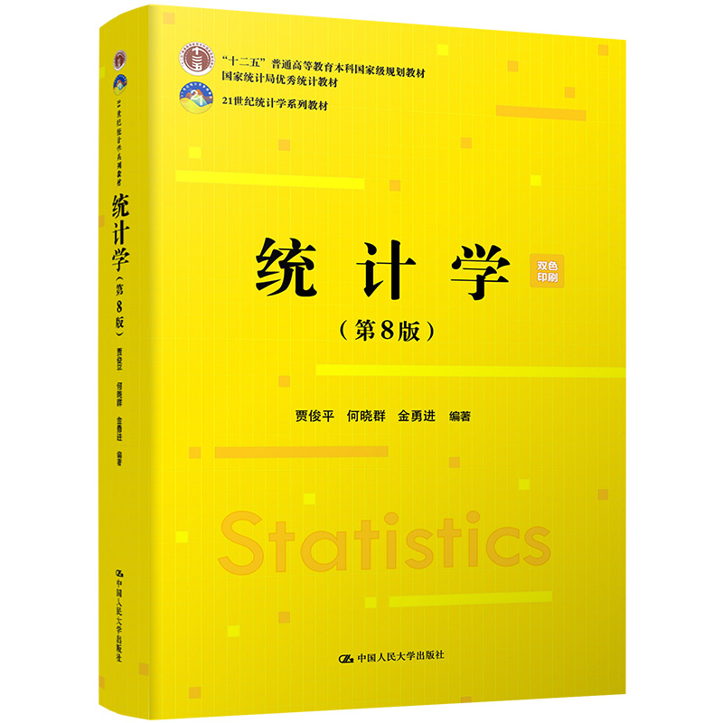

---
params:
  hideslide: FALSE
output:
  xaringan::moon_reader:
    seal: false
    lib_dir: libs
    css:
      - default
      - ../mycss/my-theme.css 
      - ../mycss/my-font.css
      - ../mycss/my-custom-for-video-roomy.css
      - ../mycss/text-box.css
      - duke-blue
      - hygge-duke
    nature:
      highlightStyle: github
      highlightLines: true
      countIncrementalSlides: false
      ratio: "16:9"
---
background-image: url("../pic/slide-front-page.jpg")
class: center,middle
exclude: `r params$hideslide`

# 统计学原理(Statistic)

<!---    chakra: libs/remark-latest.min.js --->

### 胡华平

### 西北农林科技大学

### 经济管理学院数量经济教研室

### huhuaping01@hotmail.com

### `r Sys.Date()`


```{r , echo=F,message=FALSE,warning=F, eval=!params$hideslide}
source("../R/set-global.R")
source("../R/xfun.R", encoding = "UTF-8")
source("../R/external-math-equation.R")
options(width = 70)
#source("../R/xaringan-chromote-print.R")
```

```{r xaringan-logo, echo=FALSE}
require('xaringanExtra')

xaringanExtra::use_tachyons()

xaringanExtra::use_panelset()

xaringanExtra::use_logo(
  image_url = "../pic/logo/nwafu-logo-circle-wb.png",
  height = '70px',
  position = xaringanExtra::css_position(top='0.2em',left="1em")
)
```

---
class: center, middle, duke-orange,hide_logo
name:chapter

# 第00章：课程说明

### [0.1 师生互动](#comu)

### [0.2 教材资料](#text)

### [0.3 软件材料](#software)

### [0.4 考核方式](#eval)

### [0.5 理论课内容](#theory)

### [0.6 实验课内容](#lab)

---
layout: false
class: center, middle, duke-orange,hide_logo
name: comu

# 0.1 师生互动

### 在线平台

### 在线资源

---
layout: true

<div class="my-header-h2"></div>

<div class="watermark1"></div>

<div class="watermark2"></div>

<div class="watermark3"></div>

<div class="my-footer"><span>huhuaping@  &emsp;&emsp; <a href="#chapter"> 第00章 课程说明 </a>
&emsp;&emsp;&emsp;&emsp;&emsp;&emsp;&emsp;&emsp;&emsp;&emsp;&emsp;&emsp;&emsp;&emsp;&emsp;&emsp;&emsp;&emsp;&emsp;&emsp;&emsp;&emsp;&emsp;&emsp;&emsp;&emsp;
<a href="#comu"> 0.1 师生互动 </a> </span></div> 

---

## 在线平台1：胡华平的个人网站

- 使用浏览器（chrome或360极速浏览器）登陆胡华平个人网站<sup>*</sup>。

> [https://www.huhuaping.com/](https://www.huhuaping.com/)。


.footnote[.red[**说明**：<sup>*</sup> 
- 个人开发的独立网站，应用R编程语言和Rmarkdown语言开发建设；

- 只要设备能联网，就等浏览课程资源（建议使用chrome浏览器）；

- 连接速度根据你的电信供应商而定。]
]

---

## 在线平台1：胡华平的个人网站

- 点击首页导航栏**Teaching**，然后点击**统计学原理（本科）**。

```{r, out.height='500px'}

```


---

## 在线平台1：胡华平的个人网站

手机视图界面下，需要点击网站导航.red[**三道杠**]。

```{r, out.width= "450px"}

```

---

## 在线平台2：学校平台

西北农林科技大学**在线教育综合平台**，我的课程**《统计学原理》（胡华平）**在平台上运行多年。[链接](https://eol.nwafu.edu.cn/meol/jpk/course/layout/newpage/index.jsp?courseId=42427)


```{r}
include_graphics("../pic/chpt00-course-university-stat.png",dpi = 220)
```

.footnote[.red[**说明**：1.外网可以访问；2.手机端暂时不支持]]

---

## 在线平台2：学校平台

西北农林科技大学**在线教育综合平台**，登陆方式：

- 门户登陆（**建议**）：西农首页
$\Rightarrow$（登陆）信息综合服务平台
$\Rightarrow$（点击进入）在线教育综合平台
$\Rightarrow$（选择课程）《统计学原理》（胡华平）


```{r,out.width='750px'}

```

---

## 在线资源


```{r, out.width='800px', fig.align='left'}

```

.pull-left[

**课程资源**：

- 教学课件（课堂ppt、实验指导书...）
- 统计软件（SPSS、mathtype、office...）
- 参考图书

]

.pull-right[

**教学活动**：

- 实验上机作业
- 实验指导视频...
- 教学答疑
]


---
layout: false
class: center, middle, duke-orange,hide_logo
name: text

# 0.2 教材资料

---
layout: true

<div class="my-header-h2"></div>

<div class="watermark1"></div>

<div class="watermark2"></div>

<div class="watermark3"></div>

<div class="my-footer"><span>huhuaping@  &emsp;&emsp; <a href="#chapter"> 第00章 课程说明 </a>
&emsp;&emsp;&emsp;&emsp;&emsp;&emsp;&emsp;&emsp;&emsp;&emsp;&emsp;&emsp;&emsp;&emsp;&emsp;&emsp;&emsp;&emsp;&emsp;&emsp;&emsp;&emsp;&emsp;&emsp;&emsp;&emsp;
<a href="#text"> 0.2 教材资料 </a> </span></div> 

---

## 使用教材：

- 贾俊平.统计学(第8版).北京:中国人民大学出版社,2021. **ISBN:9787300293103**


```{r, out.width='400px'}

```

.footnote[**提示**：贾俊平出版了很多系列和不同版本的各类教材和指导书，购买时务必以ISBN书号为准！！]

---

## 参考教材：

国内参考教材：

- 李洁明, 祁新娥.统计学原理（第8版）.上海：复旦大学出版社，2021. (ISBN: 9787309158434). 

- 田海霞，景刚. 统计学——原理与EXCEL应用,机械工业出版社，2016.1. (ISBN: 9787111521907). [京东链接](https://item.jd.com/67768425181.html)

国外参考教材：

- Lind D A, Marchal W G, Wathen S A. Statistical techniques in business and economics[M]. 第19版. Nueva York: MCGRAW-HILL EDUCATION, 2023.

- Anderson D R, Sweeney D J, Williams T A. Statistics for Business & Economics[M]. 第14版. Cengage, 2019. 

- Newbold P, Carlson W, Thorne B. Statistics for Business and Economics[M]. 第10th版. Harlow, United Kingdom: Pearson Education Limited, 2022.


---
layout: false
class: center, middle, duke-orange,hide_logo
name: software

# 0.3 软件材料

---
layout: true

<div class="my-header-h2"></div>

<div class="watermark1"></div>

<div class="watermark2"></div>

<div class="watermark3"></div>

<div class="my-footer"><span>huhuaping@  &emsp;&emsp; <a href="#chapter"> 第00章 课程说明 </a>
&emsp;&emsp;&emsp;&emsp;&emsp;&emsp;&emsp;&emsp;&emsp;&emsp;&emsp;&emsp;&emsp;&emsp;&emsp;&emsp;&emsp;&emsp;&emsp;&emsp;&emsp;&emsp;&emsp;&emsp;&emsp;&emsp;
<a href="#software"> 0.3 软件材料 </a> </span></div> 


---

## 熟练掌握一门统计软件


课程指定软件：**Microsoft Excel**

- 实验室版本：Excel 2013版以上

- 软件参考使用书：
 
> Excel入门应试，可参考国内贾俊平或田海霞教材。
 
> Excel精通掌握，可参考：
- Glyn, Davis, Branko, Pecar.Statistics for Business Students: A Guide to Using Excel & IBM SPSS Statistics [M].2021. ISBN:9781637957622
- Alexander, M. Excel Dashboards and Reports for Dummies 3rd [M], Wiley, 2016.
 

---

## 熟练掌握一门统计软件

自学编程语言1：开源**R软件**（选用，自学）

- Tilman, Davies.The book of R: a first course in programming and statistics[M]. 	San Francisco : No Starch Press, 2016.

- Adler. R in a Nutshell (2ed)  [M], Reilly, 2012.

- Crawley. The R Book (2nd) [M], Wiley,2013.

自学编程语言2：开源**Python**（选用，自学）

自学编程语言3：商业**stata软件**（选用，自学）：

- [陈强：《计量经济学及Stata应用》，高等教育出版社，2015.7](https://item.jd.com/12245551.html)


---
layout: false
class: center, middle, duke-orange,hide_logo
name: eval

# 0.4 考核方式

---
layout: true

<div class="my-header-h2"></div>

<div class="watermark1"></div>

<div class="watermark2"></div>

<div class="watermark3"></div>

<div class="my-footer"><span>huhuaping@  &emsp;&emsp; <a href="#chapter"> 第00章 课程说明 </a>
&emsp;&emsp;&emsp;&emsp;&emsp;&emsp;&emsp;&emsp;&emsp;&emsp;&emsp;&emsp;&emsp;&emsp;&emsp;&emsp;&emsp;&emsp;&emsp;&emsp;&emsp;&emsp;&emsp;&emsp;&emsp;&emsp;
<a href="#eval"> 0.4 考核方式 </a> </span></div> 

---

## 成绩构成

- 期末成绩（60%）：闭卷考试（务必带上**科学计算器**）

- 平时成绩（10%）：考勤+随堂提问

- 上机实验（30%）：6次实验作业

---
layout: false
class: center, middle, duke-orange,hide_logo
name: theory

# 0.5 理论课内容

---
layout: true

<div class="my-header-h2"></div>

<div class="watermark1"></div>

<div class="watermark2"></div>

<div class="watermark3"></div>

<div class="my-footer"><span>huhuaping@  &emsp;&emsp; <a href="#chapter"> 第00章 课程说明 </a>
&emsp;&emsp;&emsp;&emsp;&emsp;&emsp;&emsp;&emsp;&emsp;&emsp;&emsp;&emsp;&emsp;&emsp;&emsp;&emsp;&emsp;&emsp;&emsp;&emsp;&emsp;&emsp;&emsp;&emsp;&emsp;&emsp;
<a href="#theory"> 0.5 理论课内容 </a> </span></div> 

---

## 理论课章节（48学时）


.pull-left[
- 第1章导论

- 第2章 数据的搜集

- 第3章 数据的图表展示

- 第4章 数据的概括性度量

- 第6章 统计量及其抽样分布（.red[选讲]）

]

.pull-right[
- 第9章 分类数据分析（.red[选讲]）

- 第10章 方差分析（.red[选讲]）

- 第11章 一元线性回归

- 第13章 时间序列分析和预测（.red[选讲]）

- 第14章 指数
]

---
layout: false
class: center, middle, duke-orange,hide_logo
name: lab

# 0.6 实验课安排

---
layout: true

<div class="my-header-h2"></div>

<div class="watermark1"></div>

<div class="watermark2"></div>

<div class="watermark3"></div>

<div class="my-footer"><span>huhuaping@  &emsp;&emsp; <a href="#chapter"> 第00章 课程说明 </a>
&emsp;&emsp;&emsp;&emsp;&emsp;&emsp;&emsp;&emsp;&emsp;&emsp;&emsp;&emsp;&emsp;&emsp;&emsp;&emsp;&emsp;&emsp;&emsp;&emsp;&emsp;&emsp;&emsp;&emsp;&emsp;&emsp;
<a href="#lab"> 0.6 实验课安排 </a> </span></div> 

---


## 实验课内容（16学时）

```{r lab-arrange}
lab <- tribble(~"实验主题",
"Excel 基础",
"数据收集和整理",
"图表制作进阶1",
"图表制作进阶2",
"相关和回归分析",
"综合统计分析报告")
lab <- lab %>% 
  add_column("序号"=paste("Lab",1:6),
             .before = "实验主题")  %>%
  add_column("学时"=c(rep(3,4), rep(2,2))) %>%
  add_column("周次"=str_c("第",11:16, "周"))
  
#kable(lab, caption = "实验课（32学时）内容安排")

```

```{r}
DT::datatable(lab)
```

.footnote[.red[**注意**：<sup>*</sup> 
- 实验作业发布和提交全部在学校**在线教育综合平台**完成！请尽快登陆课程网站，确认自己登陆进去。
- 每次作业发布都会有开始和截至时间，系统会自动记录，过期不候，不交作业则没有相应实验成绩（实验成绩占最终课程成绩的30%）。]
]

---
layout:false
background-image: url("../pic/thank-you-gif-funny-fan.gif")
class: inverse, center

# 本章结束
