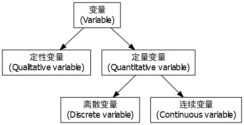
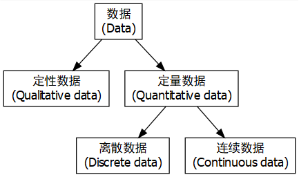
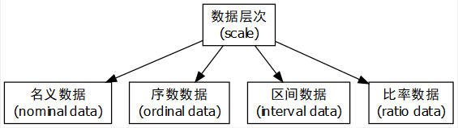
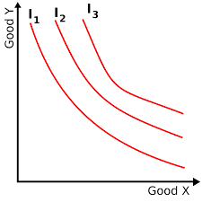

---
output:
  xaringan::moon_reader:
    seal: false
    lib_dir: libs
    css: 
      - default
      - default-fonts
      - duke-blue
      - hygge-duke
      - ../mycss/my-custom-for-video.css
    nature:
      highlightStyle: github
      highlightLines: true
      countIncrementalSlides: false
      ratio: "16:9"
---
background-image: url("../pic/slide-front-page.jpg")
class: center,middle

# 统计学原理(Statistic)

<!---    chakra: libs/remark-latest.min.js --->

### 胡华平

### 西北农林科技大学

### 经济管理学院数量经济教研室

### huhuaping01@hotmail.com

### `r Sys.Date()`

```{r global_options, echo=F,message=FALSE,warning=F}
source("../R/set-global.R")

```


```{r ex-math-eq}
source("../R/external-math-equation.R")
```

<style type="text/css">
.remark-slide-content {
    font-size: 24px;
    padding: 1em 4em 1em 4em;
}
</style>

---
class: center, middle, inverse
name: chapter01


# 第1章 导论


[1.1 为什么学习统计学](#why)

[1.2 变量和数据](#vars)

[1.3 数据的计量层次](#scale)

[1.4 数据的时间状态](#time)

[1.5 统计学的体系](#system)

[1.6 统计分析的基本过程](#workflow)


---
class: inverse, center, middle, duke-softblue
name: why

# 1.1 为什么学习统计学

---
layout: true

<div class="my-header-h2"></div>

<div class="watermark1"></div>

<div class="watermark2"></div>

<div class="watermark3"></div>

<div class="my-footer"><span>huhuaping@  &emsp;&emsp; <a href="#chapter01"> 第01章 导论</a>
&emsp;&emsp;&emsp;&emsp;&emsp;&emsp;&emsp;&emsp;&emsp;&emsp;&emsp;&emsp;&emsp;
&emsp;&emsp;&emsp;&emsp;&emsp;&emsp;&emsp;&emsp;&emsp;&emsp;&emsp;&emsp;&emsp;
<a href="#why">1.1 为什么学习统计学</a> </span></div> 

---

## 辛普森悖论的警示


```{r}
simpson <- data.frame("部门"=c("A", "B", "C", "D", "E", "F"), 
                 "男性申请数"=c(825,560,325,417,191,272), 
                 "男性录用率"=c(.62,.63,.37,.33,.28,.06),
                 "女性申请数"= c(108,25,593,375,393,341),
                 "女性录用率"=c(.82,.68,.34,.35,.24,.07))

list_name <- names(simpson)

simpson_long <- simpson %>%
  gather(key = "vars", value = "value", -`部门`) %>%
  mutate(gender = if_else(str_detect(vars, "^男性"), "男性", "女性"),
         cat = if_else(str_detect(vars, "申请数$"), "申请数", "录用率")) %>%
  select(`部门`,gender, cat, value) 
  
smry_ratio <- simpson_long  %>% 
  spread(key = cat, value=value) %>%
  group_by(gender) %>%
  summarise("录用率" = weighted.mean(`录用率`,`申请数` ))

smry_count <- simpson_long  %>% 
  spread(key = cat, value=value) %>%
  group_by(gender) %>%
  summarise("申请数" = sum(`申请数` ))

smry <- left_join(smry_count,smry_ratio, by="gender") %>%
  gather(key = "cat", value = "value", -gender) %>%
  add_column("部门"="合计") %>%
  select(one_of(names(simpson_long)))

detail_long <- rbind(simpson_long, smry)

```


故事是这么说的：

```{r}
smry %>%
  spread(key=cat,value=value) %>%
  select(gender, `申请数`, `录用率`) %>%
  datatable(caption = "录用女性的六大部门") %>%
  formatPercentage(c(3), digits = 2)

```


---

## 辛普森悖论的警示

但故事背后却另有蹊跷：

```{r simpsontable, echo=FALSE, warning = FALSE}

simpson %>% 
  datatable(caption = "录用女性的六大部门") %>%
  formatPercentage(c(3,5), 0)

```

---

## 辛普森悖论的警示

事情的“真相”是：

```{r}
detail_long %>%
  unite("vars", gender,cat,sep = "") %>%
  spread(key=vars, value = value) %>%
  select(one_of(names(simpson))) %>%
  datatable(caption = "录用女性的六大部门") %>%
  formatPercentage(c(3,5), 0)
```

---

## 辛普森悖论的警示

对比一下

.pull-left[

```{r}
smry_weight <- simpson_long  %>% 
  spread(key = cat, value=value) %>% 
  mutate("录用数"= `录用率`*`申请数`) 

smry_weight%>%
  filter(gender =="男性") %>%
  arrange(desc(`录用数`)) %>%
  datatable(caption = "男性最喜欢的部门排序") %>%
  formatPercentage(3,0) %>%
  formatRound(5,0)

```

]


.pull-right[

```{r}
smry_weight%>%
  filter(gender =="女性") %>%
  arrange(desc(`录用数`)) %>%
  datatable(caption = "女性最喜欢的部门排序") %>%
  formatPercentage(3,0) %>%
  formatRound(5,0)

```
]


---

## 辛普森悖论的警示

更加细节的数据：


```{r}
load("../data-analysis//berkeley.Rdata")

berkeley %>%
  rename("女性申请数" ="women.apply" ,
         "总录用率"= "total.admit"   , 
         "总申请数" ="number.apply") %>%
  add_column("部门"=1:dim(.)[1], .before = "女性申请数") %>%
  datatable(caption = "39个部门的录用情况",
            options = list(dom = "tip", pageLength=5
                           ))

```


---

## 辛普森悖论的警示

令人吃惊的对称性分布(圆圈表示总申请数大于40人的部门，叉叉表示总申请数小于40人的部门)：

```{r, fig.height=6}
plot.new()
xlu <- 80
plot.window(  xlim = c(0,100),
              ylim = c(0,100)  
)
symbols( x = berkeley$women.apply, 
         y = berkeley$total.admit,
         circles = sqrt( berkeley$number.apply ),
         inches = .3,
         fg= "blue",
         add = TRUE
)

lines( x = berkeley.small$women.apply,
       y = berkeley.small$total.admit,
       type = "p",
       pch = 3,
       col = "gray50",
       cex = 1
)

axis(side = 1)
axis(side = 2)
title(   xlab = "女性申请者百分比",
         ylab = "录用率(包括所有性别)"
)
#title( main = "The Berkeley admissions data", font.main = 1)

coef <- lm( formula = total.admit ~ women.apply,
            data = berkeley,
            weights = number.apply
)$coefficients
lines( x = c(0,xlu), y = coef[1]+c(0,xlu)*coef[2]) 
```


---

## 信念偏见诅咒 

**信念偏见效应**：如果你让人们决定一个特定的论点是否在逻辑上是有效的，我们往往会受到结论可信度的影响，即使我们不应该这样做。

这是一个有效的**论据**，其**结论**是可信的：：

- 没有香烟很便宜（前提1）

- 有些令人上瘾的东西很便宜（前提2）

- 因此，有些令人上瘾的东西不是香烟（结论）

这是一个有效的**论据**，但其**结论**是不可信的：

- 没有令人上瘾的东西很便宜（前提1）

- 有些香烟很便宜（前提2）

- 因此，有些香烟不会上瘾（结论）

---

## 信念偏见诅咒 

```{r}

```


---

## 信念偏见诅咒：持枪和控枪的美国现象

**素材1**：

- 美国宪法规定，人民持有和携带武器的权利不受侵犯，这是宪法权利。美国历史上地广人稀，一旦发生暴力事件，警察没办法及时赶到现场，所以美国人民应该有枪支自卫。

**观点**：

A. 宪法很大程度考虑到了公民个人私人持枪的选择权

B. 菜刀在坏人手里会成为凶器，私人持枪以保护自己和身边的人不受侵害也同样重要

C. 其他观点


---

## 信念偏见诅咒：持枪和控枪的美国现象

**素材2**：

- 1968年美国人口2亿，拥有枪支1.1亿；今天美国人口3.2亿，拥有枪支3.6亿！50年前是两人一支，现在是几乎一人一支。

- 2016年美国枪支产业雇佣了30多万人，对美国经济的贡献是500亿。美国枪支市场巨大，提供了几十万个工作机会，也养活了很多利益集团，他们不答应禁枪等等。


**观点**：

A. 军火产业虽然提供了一些就业，但也助长了枪击事件的发生

B. 军火市场根深蒂固，进而让私人禁枪的提案或修宪变得困难

C. 其他观点

---

## 信念偏见诅咒：持枪和控枪的美国现象

**素材3**：

- 美国有三亿多支枪，每年被枪杀的人3万多。2014年美国有4万人自杀，其中超过一半选择用枪；70岁以上自杀的老人，选择用枪的比例最高，74%。

- 美国虽然总发生枪击案，但发生的概率仅有千分之0.1。过去23年美国枪杀案的比例整整下降了1倍！

**观点**：

A. 枪击事件很大程度上是因为影响恶劣而被社会过度关注和解读

B. 引发死亡率的主因很多，私人持枪造成的社会伤害并没有愈演愈烈

C. 其他观点

---

## 信念偏见诅咒：持枪和控枪的美国现象

**素材4**：

- 美国枪支管理法律不是越来越严，而是越来越松。

- 正反观点针锋相对：“美国游泳淹死的人是5倍于被枪走火打死的”。“我亲戚三岁的小姑娘被他爸枪走火打死。如果这个小孩是你的，你愿意她成为你玩枪的社会成本吗？”

- 如果不发生这次拉斯维加斯枪击案，美国又会出台一个放宽枪支管制的议案，要讨论允许私人购买枪支消声器的议案，就是可以公开卖无声枪了。在美国，要自杀的人没枪也会用别的方式死，美国人对死亡的观念：毒药、安乐死与尊严

**观点**：

A. 控枪政策日趋放松尽管有其可解释之处，但并不是长远明智之举

B. 持枪派，控枪派和中立派或许都无可厚非，各方相互制衡最为重要

C. 其他观点

---
layout: false
class: center, middle, inverse
name: vars

# 1.2 变量和数据

---
layout: true

<div class="my-header-h2"></div>

<div class="watermark1"></div>

<div class="watermark2"></div>

<div class="watermark3"></div>

<div class="my-footer"><span>huhuaping@  &emsp;&emsp; <a href="#chapter01"> 第01章 导论</a>
&emsp;&emsp;&emsp;&emsp;&emsp;&emsp;&emsp;&emsp;&emsp;&emsp;&emsp;&emsp;&emsp;
&emsp;&emsp;&emsp;&emsp;&emsp;&emsp;&emsp;&emsp;&emsp;&emsp;&emsp;&emsp;&emsp;
<a href="#vars">1.2 变量和数据</a> </span></div> 

---

## 变量及其类型A


```{r, fig.height=4, eval=FALSE}
#install.packages("DiagrammeR")
library(DiagrammeR)
library(DiagrammeRsvg)
library(magrittr)
library(svglite)
library(rsvg)
library(png)
g <- grViz("digraph flowchart {
      # node definitions with substituted label text
      node [fontname = Helvetica, shape = rectangle]        
      tab1 [label = '@@1']
      tab2 [label = '@@2']
      tab3 [label = '@@3']
      tab4 [label = '@@4']
      tab5 [label = '@@5']

      # edge definitions with the node IDs
      tab1 -> tab2 ;
      tab1 -> tab3 -> tab4 ;
      tab3 -> tab5;
      }

      [1]: '变量\\n(Variable)'
      [2]: '定性变量\\n(Qualitative variable)'
      [3]: '定量变量\\n(Quantitative variable)'
      [4]: '离散变量\\n(Discrete variable)'
      [5]: '连续变量\\n(Continuous variable)'
      ")
g %>% export_svg %>% charToRaw %>% rsvg %>% png::writePNG("../pic/flowchart-variables.pdf")
```

**变量**：描述事物或现象的变化特征。

--

.pull-left[

]

--

.pull-right[
A.按性质不同可分为：

- **定性变量**：非数值化的变量。

- **定量变量**：数值化的变量。

    - **离散变量**：可能的取值比较有限、并能轻松列示的一类定量变量。
    
    - **连续变量**：可能的取值较多、以特定微小数值间隔的一类定量变量。
]

---
class: duke-softblue
### 随堂测验（2min）

请分别说出如下情形分别属于那种变量类型？

--

- 教育程度（可能取值为：文盲、非文盲）

--

- 教育程度（可能取值为：小学及以下、初中、高中、大学、研究生及以上）

--

- 教育程度（可能取值为：1=小学及以下、2=初中、3=高中、4=大学、5=研究生及以上）

--

- 教育程度（单位为年，可能取值为：6、9、12、15、18、21、24、...）

--

- 教育程度（单位为年，可能取值为：6、7、8、9、12、14.5、15、18、20、21、...）


---

## 变量及其类型B

B.按变量是否**随机**：

- 随机变量（random variable）：在事件集合上的一个特定函数的**随机分布**状态。

- 非随机变量（non-random variable）：也称为**确定性变量**（Deterministic variable）。


**100天降雨量记录**(mm)：下面只列出了前50天

```{r,comment=""}
set.seed(123)
rainfall <- as_tibble(list(rain=50*abs(rnorm(100)),day=str_c("day",1:100)))
rainfall_show <- rainfall$rain
names(rainfall_show) <- rainfall$day
rainfall_show[1:50]
```


---
class: duke-softblue
### 课堂讨论（2min）：

非随机变量（non-random variable）实际存在么？

--
.pull-left[

.orange[**正方**：存在!

- 有随机变量就自然有非随机变量，它取值的产生是经过特意安排的，也即**非随机**的。
]
]

--

.pull-right[

.red[**反方**：不存在!

- 非随机变量是杜撰的，如果是变量则都应该是随机的。非随机变量其实就是**常数**（constant），当然不能称为变量，也就不能叫做非随机变量。
]

]

???
参考资料：https://www.quora.com/What-is-a-non-random-variable

---

## 变量及其类型C

C.按变量是否**抽象化**：

- 经验变量：经验变量所描述的是我们周围可以观察到的事物。

- 理论变量：理论变量则是由统计学家用数学方法所构造出来的一些变量，比如z 统计量、t 统计量、
$\chi^2$统计量、F 统计量等。

```{r}
p1 <- rainfall %>%
  ggplot(aes(x=rain)) +
  #geom_histogram(bins=7,position = "identity",
  #               color = "black", fill = "gray") +
  geom_histogram(aes(y=..density..),bins = 10, color = "black", fill = "gray") +
  geom_density(alpha=.2, fill="#FF6666") +
  labs(x="降雨量（mm）",y ='概率密度')

p2 <- ggplot(data = data.frame(x = c(-3, 3)), aes(x)) +
  stat_function(fun = dnorm, n = 101, args = list(mean = 0, sd = 1)) + ylab("") 
```

--

.pull-left[

```{r, fig.cap= "降雨量记录数据的分布图n=100"}
p1
```

]

--

.pull-right[

```{r, fig.cap= "理论正态分布图"}
p2
```

]


---

## 数据及其类型


```{r, fig.height=4, eval=FALSE}
g <- grViz("digraph flowchart {
      # node definitions with substituted label text
      node [fontname = Helvetica, shape = rectangle]        
      tab1 [label = '@@1']
      tab2 [label = '@@2']
      tab3 [label = '@@3']
      tab4 [label = '@@4']
      tab5 [label = '@@5']

      # edge definitions with the node IDs
      tab1 -> tab2 ;
      tab1 -> tab3 -> tab4 ;
      tab3 -> tab5;
      }

      [1]: '数据\\n(Data)'
      [2]: '定性数据\\n(Qualitative data)'
      [3]: '定量数据\\n(Quantitative data)'
      [4]: '离散数据\\n(Discrete data)'
      [5]: '连续数据\\n(Continuous data)'
      ")
g %>% export_svg %>% charToRaw %>% rsvg %>% png::writePNG("../pic/flowchart-data.pdf")
```

**数据**：变量的实际具体取值组成的集合。

--

.pull-left[

]


.pull-right[

A.按数据取值的性质分：

- **定性数据**：定性变量的取值。

- **定量数据**：定量变量的取值。

  - **离散数据**：离散变量的取值。
  
  - **连续数据**：连续变量的取值。
]

---

### 观察性数据和实验性数据

**观察性数据**（observational data）：人们在观察性研究中被动性记录下来的数据。

- 选择性偏差难以避免 [Bias in Observational Studies – Sensitivity Analysis with R package episensr](https://www.r-bloggers.com/bias-in-observational-studies-sensitivity-analysis-with-r-package-episensr/)

(https://homerhanumat.github.io/elemStats/design-of-studies.html)


**实验性数据**（experimental data）：人们通过主动控制和改变实验条件获得并记录的数据。


---

## 数据与变量的关系

- 变量是数据存身之所，而数据是变量的现实表达。

- 变量是一个抽象概念，而数据是实体概念。

- 数据和变量是相互依存的关系，如同一个硬币的两面。

- 数据和变量可以进一步共同描述或表达事物或现象的**信息**（information）。

---
## SPSS统计软件下的变量和数据

下面给大家展示传统商业（收费）统计分析软件`SPSS`的变量和数据视窗：

---
background-size: contain
background-image: url("../pic/chpt01-spss-data-view.png")

## SPSS软件的数据视图

---
background-size: contain
background-image: url("../pic/chpt01-spss-var-view.png")

## SPSS软件的变量视图

---

## R统计软件下的变量和数据

下面给大家展示开源（免费）统计分析软件`R`的变量和数据视窗：


---

### 纽约机场数据库：变量视图

只看2013年1月的数据。

```{r,comment="", echo=TRUE}
require("nycflights13") 
data(flights)                     # 导入数据集
flights_jan <- flights %>%
  filter(month == 1)              # 只看2013年1月的数据
str(flights_jan, max.level =5, list.len =10)
```

---

### 纽约机场数据库：数据视图

只看2013年1月数据集的前500条数据。

```{r,comment="", echo=F}
head(flights_jan,500) %>%    # 只看前500条数据
  datatable(extensions = 'FixedColumns',
            options = list(pageLength =4,dom="tip",
                           scrollX = TRUE,
                           fixedColumns = TRUE))
```

---
class:duke-softblue

## 数据和信息的关系

数据和信息有何联系与不同？

> "The numbers have no way of speaking for themselves. We speak for them. We imbue them with meaning." 
> —Statistician Nate Silver in the book The Signal and the Noise

```{r, fig.cap= "DIKW"}
include_graphics("../pic/chpt01-data-info-DIKW.png",dpi ="120")
```


???
参考资料：https://www.guru99.com/difference-information-data.html

---
class: duke-softblue

## 数据与信息的关系

**大数据**（big data）是不是一定好？

- 优点：可能包含更多信息；

- 缺点：信息量太大以至于无法处理。

.pull-left[

大数据的[四大特征（4V）](https://www.dummies.com/careers/find-a-job/the-4-vs-of-big-data/)：

- Volume（数据量大）

- Variety（变异性大）

- Veracity（精确记录）

- Velocity（迅疾变化）

]

.pull-right[

]

???
大数据证相关，小数据证因果。
- 大数据只是扩展了观察和抽象世界的研究手段与数据实验工具。
- 统计学理论也需要新突破和创新。


---
class: duke-softblue

## 数据与信息的关系

.pull-left[

- 天体运行规律：第谷的海量天文数据VS开普勒筛选分析。


]

--

.pull-right[

- 总统选举预测：《文学文摘》240万人大调查VS盖洛普5000人调查。


]

???

每年的1月1日，地球在什么位置，土星在什么位置，太阳在什么位置，等等。这样20年的观测数据筛选之后，每一颗行星的数据就只有20个了。开普勒知道，地球每隔365天会回到同一个位置，然后他把地球的位置固定，再分析其他行星跟地球的相对位置。开普勒通过固定地球的位置，对其他行星位置20年的数据进行分析，就成功得到了其他行星的运行轨迹。

---
layout: false
class: center, middle, inverse
name: scale

# 1.3 数据的计量层次

```{r, fig.height=4, eval=F}
g <- grViz("digraph flowchart {
      # node definitions with substituted label text
      node [fontname = Helvetica, shape = rectangle]        
      tab1 [label = '@@1']
      tab2 [label = '@@2']
      tab3 [label = '@@3']
      tab4 [label = '@@4']
      tab5 [label = '@@5']

      # edge definitions with the node IDs
      tab1 -> tab2 ;
      tab1 -> tab3 ;
      tab1 -> tab4 ;
      tab1 -> tab5
      }

      [1]: '数据层次\\n(scale)'
      [2]: '名义数据\\n(nominal data)'
      [3]: '序数数据\\n(ordinal data)'
      [4]: '区间数据\\n(interval data)'
      [5]: '比率数据\\n(ratio data)'
      ")
g
#g %>% export_svg %>% charToRaw %>% rsvg %>% png::writePNG("../pic/flowchart-data-scale.pdf")
```





---
layout: true

<div class="my-header-h2"></div>

<div class="watermark1"></div>

<div class="watermark2"></div>

<div class="watermark3"></div>

<div class="my-footer"><span>huhuaping@  &emsp;&emsp; <a href="#chapter01"> 第01章 导论</a>
&emsp;&emsp;&emsp;&emsp;&emsp;&emsp;&emsp;&emsp;&emsp;&emsp;&emsp;&emsp;&emsp;
&emsp;&emsp;&emsp;&emsp;&emsp;&emsp;&emsp;&emsp;&emsp;&emsp;&emsp;&emsp;&emsp;
<a href="#scale">1.3 数据的计量层次</a> </span></div> 

---

## 名义数据(nominal data)

- 取值只用于区分所属类别的定性数据。

- 对事物进行分类的结果，数据表现为类别，一般用文字来表述。

    - 性别(男、女）
    
    - 婚姻状况(已婚、未婚、离婚、分居）

---
class: duke-softblue
### 名义数据举例

变量及可能取值VS数据集

--

```{r,fig.cap=""}
include_graphics("../pic/nominal-show.png")
```
--

```{r}
nominal <- as_tibble(list(name= c("tom","jenny","lilei", "hanmeimei"),
                          gender= c("M","F", "M", "F"),
                          color =c("brown", "blonde", "black","black"),
                          area = c("North", "south", "North","Neither")))

nominal %>%
  datatable(caption ="") %>%
  formatStyle(columns = 1:4, target = "cell",Color = "black")
```


---

## 序数数据(ordinal data)

- 变量的不同取值有顺序差异，即存在自然顺序

- 变量的不同取值的差值，没有实际意义


--

.pull-left[

- 常用的五分量表

```{r, fig.cap= ""}

```

]

--

.pull-right[

- 经济学中的无差异曲线

```{r, fig.cap= ""}

```

]

---
class: duke-green
### 序数数据举例

.pull-left[

```{r}
temperature <- as_tibble(list(temp=c("High", "Low", "High", "Low", "Medium"),
                              weekday = c("Mon", "Tue", "Wen", "Thu","Fri"),
                              feel =c("VU", "VH", "UH", "OK","H"))) %>%
  select(weekday, temp,feel) %>%
  mutate(temp= factor(temp, levels = c("Low", "Medium", "High")),
         feel =factor(feel, levels = c("VH", "H", "OK","UH","VU")))

temperature %>%
  datatable(caption = "原始数据（按工作日）")
```

]

--

.pull-right[

```{r}
temperature %>%
  arrange(feel) %>%
  datatable(caption = "排序后数据（按feel）")

```

]

.red[**课堂思考**]：序数数据如何排序？如果数据量超级大，怎样快速排序(
数据概览如下)：

```{r,comment="",echo= F}
glimpse(temperature)
```


---

## 区间数据( interval data) ：

区间数据( interval data) 的数值存在自然顺序、可以比较大小（加减）、但乘除比率没有意义。

- 变量的不同取值有顺序差异，即存在自然顺序

- 变量的不同取值的差值，也具有实际意义

- 但不同取值的比率是没有实际意义的

--
    - 两个时期之内的距离(如2000 – 1995) 是有意义的，但两个时期的比率(2000/1995) 就没有什么意义。

--
    - 2013年8 月11 日上午11 点天气预报说杨凌的温度是华氏60 度，而长沙达到华氏90 度。长沙比杨凌温度高30华氏度(90-60)，是可以的。但说长沙比杨凌暖和1.5倍(90/60)，是没有意义。
    
    
---
class: duke-orange
### 区间数据举例：起飞延误时长与星期几有关系么？

```{r}
flights_jfk <-
  nycflights13::flights %>% 
  filter(origin == "JFK",month==1) %>% 
  mutate(hh = round(sched_dep_time / 100, 0) - 1) %>% 
  mutate(ymd = lubridate::ymd(sprintf("%04.0f-%02.0f-%02.0f", year, month, day))) %>% 
  mutate(wd = lubridate::wday(ymd, label = TRUE)) %>%
  select(year:day,dep_time, sched_dep_time,dep_delay,wd)  %>%
  mutate(delay_cat = cut(dep_delay, 
                         breaks = c(-Inf, seq(0,600,by=60),Inf),
                         labels = c("提前起飞", 
                                    str_c("延误",seq(0,9,1),"-",
                                          seq(1,10,1),"小时内"),
                                    "延误10小时以上")
                         )
         )  %>%
  mutate(delay_cat=forcats::fct_explicit_na(delay_cat, na_level = "取消航班"))


smry_delay <- flights_jfk %>%
  group_by(wd,delay_cat) %>%
  summarise(n=n()) %>%
  ungroup() %>%
  spread(key = wd, value = n)

```

.pull-left[

```{r}
flights_jfk %>%
  select(day,wd,dep_time,sched_dep_time) %>%
  datatable(caption = "2013年1月jfk机场起飞情况（原始）",
            options = list(dom ="tip",
                           pageLength = 7))
```
]

.pull-right[

纽约JKF机场在2013年1月起飞航班数据集：

- 计划起飞时间（`sched_dep_time`）和实际起飞时间（`dep_time`）能直接相减么？

- 如果延误超过一天，该怎么计算起飞延误时长？

- 如果取消航班了，该怎么计算起飞延误时长？

]


---
class: duke-orange
### 区间数据举例：起飞延误时长与星期几有关系么？


```{r}
flights_jfk %>%
  select(day,wd,dep_time,sched_dep_time,dep_delay,delay_cat) %>%
  datatable(caption = "2013年1月jfk机场起飞情况（计算并分类）",
            options = list(dom ="tip",
                           pageLength = 7))
```


???
参考资料：https://www.r-bloggers.com/dealing-with-interval-data-and-the-nycflights13-package-using-r/


---
class: duke-orange
### 区间数据举例：起飞延误时长与星期几有关系么？


```{r}
total_delay <- smry_delay %>%
  summarise_if(is.numeric, sum, na.rm = TRUE) %>%
  add_column(delay_cat = "合计", .before = "周日")
  
smry_delay %>%
  mutate(delay_cat = as.character(delay_cat)) %>%
  bind_rows(total_delay, .) %>%
  datatable(caption = "",
            options = list(pageLength = 8, dom= "tip"))
```


---

## 比率数据(ratio data)：

比率数据(ratio data)的取值存在自然顺序、可以比较大小（加减）、乘除比率有实际意义。

- 变量存在真实“零点”

- 变量的不同取值存在自然顺序（
$X_2 \leq X_1$或
$X_2 \geq X_1$）

- 变量的不同取值之差是有实际意义的(
$X_2-X_1$) 

- 变量的不同取值的乘除都是有意义的（
$X_1/X_2$）

    - 如：GDP(亿元)、个人收入(元)等

---

## 数据层次小结:数据运算可能性


```{r}
scale_smry <- read.xlsx2("../data-analysis/chpt01-scale-variable.xlsx",1,startRow = 2) %>%
  as_tibble()
scale_smry %>%
  datatable(options = list(pageLength =9))

```


???
数据层次与数据运算可能性存在一定联系!

---
layout: false
class: inverse, middle, center
name: time

# 1.4 数据的时间状态

---
layout: true

<div class="my-header-h2"></div>

<div class="watermark1"></div>

<div class="watermark2"></div>

<div class="watermark3"></div>

<div class="my-footer"><span>huhuaping@  &emsp;&emsp; <a href="#chapter01"> 第01章 导论</a>
&emsp;&emsp;&emsp;&emsp;&emsp;&emsp;&emsp;&emsp;&emsp;&emsp;&emsp;&emsp;&emsp;
&emsp;&emsp;&emsp;&emsp;&emsp;&emsp;&emsp;&emsp;&emsp;&emsp;&emsp;&emsp;&emsp;
<a href="#time">1.4 数据的时间状态</a> </span></div> 

---

## Type1：时间序列数据(time series data)：

**时间序列数据**：对一个变量在不同时间取值的一组观测结果。按取值间隔可分为**高频数据**和**低频数据**。

--

- 实时牌价：如股票价格

- 每日(daily）：如天气预报

- 每周(weekly）：如货币供给数字

--

- 每月(monthly）：如失业率和消费者价格指数

- 每季度(quarterly）：如GDP

- 每年(annually）：如政府预算

- 每5 年(quinquennially）：如制造业普查资料

- 每10 年( decennially）：如人口普查资料

---

## Type1：时间序列数据(time series data)：

平稳性(stationary)：如果一个时间序列的均值和方差不随时间而系统地变化，那它就是平稳的(stationary) 。

```{r, fig.cap="1951年1月-1999年9月美国的M1货币供给"}
include_graphics("../pic/chpt01-1-data-series-M1.png", dpi=120)
```

---

## Type2：截面数据(cross-section data)：

横截面数据：对一个或多个变量在同一时间点上收集的数据

异质性(heterogeneity) ：当我们的统计分析包含有异质的单位时，我们必须考虑尺度(size)或规模效应(scale effect) 以避免造成混乱。

---

### 案例：鸡蛋价格与鸡蛋产量

```{r}
eggs <- as_tibble(read.xlsx("../data/Table-1-1-eggs.xlsx"))
eggs %>%
  select(STATE, Y1, X1) %>%
  datatable(options = list(pageLength=5, dom="tip"),
            caption = "美国50个州的蛋类生产和价格数据")
```

其中，
$Y_1$代表1990年鸡蛋产量(百万个)；
$X_1$代表1990年每打鸡蛋的价格(美分/打)。

???
美国50个州的蛋类生产和价格数据

---

### 案例：鸡蛋价格与鸡蛋产量


```{r, fig.cap= "",fig.height=6, fig.width=10}
eggs %>%
  select(STATE, X1, Y1) %>%
  ggplot(aes(x=Y1, y=X1)) +
  geom_point(color="blue", size=2) +
  theme(text = element_text(size=16)) +
  labs(x="鸡蛋产量(百万个)", y="鸡蛋价格(美分/打)")

```

**思考提问**：图中特征符合经济学理论么？为什么？图中反映了数据可能存在哪些潜在问题？


---

## Type3：面板数据(Panel Data)

**面板数据**：是兼有时间序列和横截面数据两种成份，指对相同的横截面单元在时间轴上进行跟踪调查的数据。

- 平衡面板(balanced panel)：所有截面单元都具有相同的观测次数

- 非平衡面板(unbalanced panel)：并非所有截面单元都具有相同的观测次数

**数据点**（观测数）
$n$：

- 数据点（观测数）=截面单元数*时期数，也即：
$n=q\ast t$。

可能存在的问题：

- “平稳性”问题：

- “异方差”问题：

---

### 案例：钢铁公司

两家钢铁公式的数据案例：

- 公司：GE=通用公司；US=美国钢铁

- I=真实总投资（百万美元）

- F=前一年的企业真实价值 （百万美元）

- C=前一年的真实资本存量（百万美元）


```{r}
steel <- as.tibble(read.xlsx("../data/Table-1-2-steel.xlsx"))
steel_wide <-steel %>%
  filter(company =="US"| company =="GE") %>%
  gather(key= "var", value="value",I:C) %>%
  unite(col="var", company, var, sep=".") %>%
  spread(key=var, value= value, sep= "_") 

names(steel_wide)<- c("year",
                           "GE.C", "GE.F", "GE.I", 
                           "US.C", "US.F", "US.I")
steel_long <-steel %>%
  filter(company =="US"| company =="GE") 
  
```

---

### 案例：钢铁公司

扁数据形式：

```{r}
datatable(steel_wide, 
          options = list(pageLength=7, dom="tip"),
          caption = "1935-1954年间美国两大钢铁公司的数据(扁数据)")
```

---

### 案例：钢铁公司

```{r, fig.cap="两家公司的企业投资情况"}
ggplot(data = steel_long, 
       aes(x=year, y=I, group=company,color=company)) +
  geom_line()+
  geom_point() +
  labs(x="年份", y="企业投资（百万美元）")
```

---

### 案例：钢铁公司

长数据形式：

```{r}
datatable(steel_long, 
          options = list(pageLength=7, dom="tip"),
          caption = "1935-1954年间美国两大钢铁公司的数据(长数据)")
```


---

### 案例：钢铁公司

```{r}
steel_wide %>%
  mutate(US.C=ifelse(year %in% c(1940,1953), NA, US.C),
         US.F=ifelse(year %in% c(1940,1953), NA, US.F),
         US.I=ifelse(year %in% c(1940,1953), NA, US.I)) %>%
  datatable(options = list(pageLength=7, dom="tip"),
          caption = "1935-1954年间美国两大钢铁公司的数据(缺失部分数据)")
```

**课堂测试**： 问1：平衡面板还是非平衡面板？问2：多少数据点？问3：两个公司投资函数是否相同？


---
layout: false
class: center, middle, inverse
name: system

# 1.5 统计学的体系

---
layout: true

<div class="my-header-h2"></div>

<div class="watermark1"></div>

<div class="watermark2"></div>

<div class="watermark3"></div>

<div class="my-footer"><span>huhuaping@  &emsp;&emsp; <a href="#chapter01"> 第01章 导论</a>
&emsp;&emsp;&emsp;&emsp;&emsp;&emsp;&emsp;&emsp;&emsp;&emsp;&emsp;&emsp;&emsp;
&emsp;&emsp;&emsp;&emsp;&emsp;&emsp;&emsp;&emsp;&emsp;&emsp;&emsp;&emsp;&emsp;
<a href="#system">1.5 统计学的体系</a> </span></div> 

---

## 统计学的方法论

**方法论**：用**样本**.red[描述]或.red[推断]**总体**。

**主要途径**：**概率论**在其中发挥着重要作用，也是方法论的分水岭。

```{r}
include_graphics("../pic/chpt01-stat-methology.png",dpi=150)
```

---

## 描述性统计(descriptive statistics)

- **定义**：研究数据收集、处理、汇总、图表描述、概括与分析等统计方法 

--

- **目的**：描述数据特征；找出数据的基本规律

- **内容**：
    - 搜集数据
    - 整理数据
    - 展示数据
    - 描述性分析


---

## 描述性统计(descriptive statistics)

```{r}
include_graphics("../pic/chpt01-descriptive-stat.jpg", dpi = 100)
```


---

## 推断性统计(inferential statistics)

- **定义**：研究如何利用样本数据来推断总体特征的统计方法

--

- **目的**：对总体特征作出推断

- **内容**：
    - 参数估计
    - 假设检验

---

## 推断性统计(inferential statistics)

```{r}
include_graphics("../pic/chpt01-inferential-stat.png", dpi = 100)
```

---

### 总体和样本

**总体(population)**：

- **定义**：所研究的全部个体(数据) 的集合，其中的每一个个体也称为元素

- **分类**：分为有限总体和无限总体

    - 有限总体的范围能够明确确定，且元素的数目是有限的
    - 无限总体所包括的元素是无限的，不可数的

**样本 (sample)**

- **定义**：从总体中抽取的一部分元素的集合

- **样本容量**：构成样本的元素的数目称为样本容量或样本量 (sample size)

---

### 参数和统计量

**参数(parameter)**:

- **定义**：描述总体特征的概括性数字度量，是研究者想要了解的总体的某种特征值

- **重要统计量**：所关心的参数主要有总体均值(
$\mu$)、方差(
$\sigma^2$) 等

- **记号**：总体参数通常用希腊字母表示
$\mu,\sigma^2,\Phi,\gamma,\cdots$

**统计量(statistic)**:

- **定义**：用来描述样本特征的概括性数字度量，它是根据样本数据计算出来的一些量，是样本的函数

- **重要统计量**：所关心的样本统计量有样本均值(
$\bar{x}$)、样本方差(
$s^2$) 等

- **记号**：样本统计量通常用小写英文字母来表示
$\bar{x},s^2,w,v,\cdots$

---

### 参数和统计量

```{r}

tab_cmpr <- as_tibble(list(  "参数" = c("数据元", "总体期望", '总体比率', '总体方差', '总体标准差','总体容量',"总体相关系数"),
                          "par" = c("X", "\\( \\mu \\)", 'P', '\\( \\sigma^2 \\)', '\\( \\sigma \\)','N',"\\( \\rho \\)"),
       
         "统计量" = c("数据元", "样本均值", '样本比率', '样本方差', '样本标准差','样本观测数',"样本相关系数"),
                   "stat" = c("x", "\\( \\bar{x} \\)", 'p', '\\( s^2 \\)', 's','n',"r"))) 

datatable(tab_cmpr)
          
  

```


---

### 参数和统计量

```{r}
include_graphics("../pic/chpt01-inferential-stat-sampling.png",dpi =160)
```

---

### 参数和统计量(实验演示)

.pull-left[
- 总体（
$[Y_i, X_i],N$）

- 总体参数？？？

- 变量的总体关系？？？
]

.pull-right[

- 样本（
$[y_i, x_i],n$）

- 样本统计量？？？

- 怎么透过样本数据来窥探总体关系的秘密？

]

---

### 参数和统计量(实验演示)

总共162名同学参与随机抽样；每个同学都随机抽取
$n=10$个数据点。
因此共有162份样本数据（每份含10个观测数）。
--

.pull-left[


]

--

.pull-right[


]

---

### 参数和统计量(实验演示)


总体参数有哪些？

样本统计量又有哪些？


--
.pull-left[

总体：

$Y_i = \beta_0+ \beta_1 X_i + u_i$


$Y_i = 25+ 0.5 X_i + u_i$

]

--

.pull-right[

样本：

$Y_i = \hat{\beta}_0+ \hat{\beta}_1 X_i + e_i$

]

---
layout: false
class: center, middle, inverse
name: workflow

# 1.6 统计分析的基本过程

---
layout: true

<div class="my-header-h2"></div>

<div class="watermark1"></div>

<div class="watermark2"></div>

<div class="watermark3"></div>

<div class="my-footer"><span>huhuaping@  &emsp;&emsp; <a href="#chapter01"> 第01章 导论</a>
&emsp;&emsp;&emsp;&emsp;&emsp;&emsp;&emsp;&emsp;&emsp;&emsp;&emsp;&emsp;&emsp;
&emsp;&emsp;&emsp;&emsp;&emsp;&emsp;&emsp;&emsp;&emsp;&emsp;&emsp;&emsp;&emsp;
<a href="#workflow">1.6 统计分析的基本过程</a> </span></div> 

---

## 统计分析的基本过程

- 实际问题：发现问题

- 收集数据：取得数据

- 处理数据：整理与图表展示 

- 分析数据：利用统计方法分析数据

- 解释数据:	结果的说明

- 得到结论：从数据分析中得出客观结论


---

## 统计分析过程：纽约案例

航班延误背后的故事：纽约繁忙的天空

[数据来源nycflights13](https://github.com/hadley/nycflights13)

This package contains information about all flights that departed from NYC (e.g. EWR, JFK and LGA) in 2013: 336,776 flights in total. To help understand what causes delays, it also includes a number of other useful datasets. This package provides the following data tables.

- flights: all flights that departed from NYC in 2013

- weather: hourly meterological data for each airport

- planes: construction information about each plane

- airports: airport names and locations

- airlines: translation between two letter carrier codes and names


---
### 实际问题：航班延误有规律可循么？变量情况


从`r min(nycflights13::flights$time_hour)`到`r max(nycflights13::flights$time_hour)`期间，纽约市三个机场`r str_c(levels(factor(flights$origin)),collapse="、")`，起落航班总数有`r dim(nycflights13::flights)[1]`架次。

```{r, echo=FALSE, comment= ""}
data(flights)
str(nycflights13::flights, list.len =10, max.level=8)

```

---

### 分析数据：描述性统计1——1天的航班情况

```{r}
data(flights)
show_flights <- as_tibble(flights) %>%
  #select(year:day,carrier:dest,distance) %>%
  filter(year==2013,month==1,day==1)
  #sample_n(50)
#kable(show_flights[1:10,1:5],caption = "航班信息",format = 'html') %>%
#  kable_styling(full_width = T)
```

2013年1月1日这一天的航班总数为`r nrow(show_flights)`架次。从这样的**数据表**能看出什么规律？


```{r, echo=FALSE}

datatable(show_flights, 
          extensions = 'FixedColumns',
          options = list(pageLength =5, dom = 'tip',
                         scrollX = TRUE,
                         fixedColumns = TRUE))
```

---

### 分析数据：描述性统计2——每天的航班数和平均延误时长

这样的统计分析，能不能看出任何蛛丝马迹呢？

```{r}
day_count<-flights %>%
  mutate(date=ymd(str_c(year,month,day,sep = "-"))) %>%
  group_by(date)  %>%
  summarise(n_flight=n(),
            mean_dep_delay=mean(dep_delay,na.rm = T),
            mean_dep_arr=mean(arr_delay,na.rm = T))

datatable(day_count,
          options = list(pageLength =7, dom = 'tip'),
          caption="")%>%
  formatRound(c(3:4), 1)
```

---

### 分析数据：描述性统计3(每天航班数)

按时间轴查看每天航班数的全貌图，是不是会更轻松一点？

```{r}
ggplot(day_count,aes(x=date,y=n_flight)) +
  geom_line() +
  geom_point(color="blue") +
  labs(x="日期", y = "航班数")
```

---

### 分析数据：描述性统计4(航班数和平均延误时长)

星期几与航班数和平均延误时长有关系？童鞋们，咱先上一个表：

```{r}
day_count_wday <- day_count %>% 
  mutate(wday = wday(date, label = TRUE)) %>%
  select(date,wday,everything())
datatable(day_count_wday,
          options = list(pageLength =7, dom = 'tip'),
          caption="")%>%
  formatRound(c(4:5), 1)
```

---

### 分析数据：描述性统计5(星期几matter?)

小伙伴们，那咱们再上个图（**多批箱线图**）瞧一瞧吧

```{r,fig.width= 15, fig.height= 7}
ggplot(day_count_wday, aes(wday, n_flight,color=wday)) + 
  geom_boxplot() +
  labs(x="星期几", y = "航班数")
```

---

### 分析数据：描述性统计6(幸运星期六)

星期六会更适合坐飞机么？星期六好像航班很少耶！！ 扣扣鼻子问，WHY？ 具体是怎样呢？？

```{r}
day_count_wday %>% 
  filter(wday == "周六") %>%
  datatable( options = list(pageLength =6, dom = 'tip'),
          caption="每天(星期)的航班数和平均延误时长")%>%
  formatRound(c(4:5), 1)
```

---

### 分析数据：描述性统计7(全年的周六)

全年只看星期六的航班数是怎样的赶脚？惊讶的小伙伴们，看看星期六的表现吧！

```{r}
day_count_wday %>% 
  filter(wday == "周六")%>% 
  ggplot(aes(date, n_flight)) + 
    geom_point(col="blue") + 
    geom_line(col="green") +
    scale_x_date(NULL, date_breaks = "1 month", date_labels = "%b") +
  labs(x="日期", y ="航班数")
```

---

### 分析数据：描述性统计8(机场matter?)

选择起飞机场是不是能避免延误？


```{r}
airport_count<-flights %>%
  mutate(date=ymd(str_c(year,month,day,sep = "-"))) %>%
  group_by(origin,month)  %>%
  summarise(n_flight=n(),
            mean_dep_delay=mean(dep_delay,na.rm = T),
            mean_dep_arr=mean(arr_delay,na.rm = T))

datatable(airport_count,
          options = list(pageLength =6, dom = 'tip',digits=1),
          caption="三大机场每月航班数和月平均延误时长") %>%
  formatRound(c(4:5), 1)
```

---

### 分析数据：描述性统计9(机场matter?2)

选择起飞机场是不是能避免延误？


```{r}

airport_count %>%
  group_by(origin) %>%
  summarise(n_flight=sum(n_flight),
            mean_dep_delay=mean(mean_dep_delay,na.rm = T),
            mean_dep_arr=mean(mean_dep_arr,na.rm = T)) %>%
  datatable(caption="三大机场每月航班数和月平均延误时长") %>%
    formatRound(c(3:4), 1)
```

---

### 分析数据：描述性统计9(机场matter?3)

下面看看美国所有机场信息(airport):变量情况


```{r}
data("airports")
airports %>%
  datatable(options = list(pageLength =5, dom = 'tip',digits=1),
          caption="") %>%
  formatRound(c(3:4), 1)
```

美国总共有`r nrow(airports)`个机场。

---

### 分析数据：描述性统计10(机场matter?4)

概括地来看看机场数据吧：

```{r, echo=FALSE}
glimpse(nycflights13::airports)

```

---

### 分析数据：描述性统计11(机场matter?5)

[来一个炫酷一点的可视化直观地图吧](Flight connection map with Rhttps://www.gis-blog.com/flight-connection-map-with-r/)

```{r}
# install.packages("maps")
# install.packages("geosphere")
require("maps")
require("geosphere")

usairports <- filter(airports, lat < 48.5)
usairports <- filter(usairports, lon > -130)
usairports <- filter(usairports, faa!="JFK") #filter out jfk
jfk <- filter(airports, faa=="JFK") #separate df for jfk
#create basemap
map("world", regions=c("usa"), fill=T, col="grey8", bg="grey15", ylim=c(21.0,50.0), xlim=c(-130.0,-65.0))
#overlay airports
points(usairports$lon,usairports$lat, pch=3, cex=0.1, col="chocolate1")

```

---

### 分析数据：描述性统计12(机场matter?6)

 机场信息(airport):可视化

```{r }

#create basemap
map("world", regions=c("usa"), fill=T, col="grey8", bg="grey15", ylim=c(21.0,50.0), xlim=c(-130.0,-65.0))
#overlay airports
points(usairports$lon,usairports$lat, pch=3, cex=0.1, col="chocolate1")
for (i in (1:dim(usairports)[1])) { 
inter <- geosphere::gcIntermediate(c(jfk$lon[1], jfk$lat[1]), c(usairports$lon[i], usairports$lat[i]), n=200)
lines(inter, lwd=1, col="turquoise2")    
}

```

---

### 分析数据：描述性统计(JFK机场的热力图)

下面重点看看纽约JFK机场全年的起飞延误情况（热力图`heat map plot`），日期和星期几确实影响起飞延误么？

```{r}
flights_jfk <-
  nycflights13::flights %>% 
  filter(origin == "JFK") %>% 
  mutate(hh = round(sched_dep_time / 100, 0) - 1) %>% 
  mutate(ymd = lubridate::ymd(sprintf("%04.0f-%02.0f-%02.0f", year, month, day))) %>% 
  mutate(wd = lubridate::wday(ymd, label = TRUE))

flights_jfk %>%
  filter(!is.na(hh)) %>%
  filter(!is.na(dep_delay)) %>%
  filter(dep_delay < quantile(dep_delay, 0.90)) %>%
  ggplot( aes(hh, wd)) + 
    geom_tile(aes(fill = dep_delay),colour = "white") + 
    scale_fill_gradient(low = "white",high = "red") +
    labs(x ="24h时段", y ="星期几", fill = "起飞延误m") +
    scale_x_continuous(limits = c(0,24), breaks = seq(0,24,2))

```

---

### 分析数据：推断性统计(JFK机场ANOVA分析1)


```{r, echo=T, comment= ""}
# 起飞延误时长VS星期几
summary(aov(dep_delay ~ wd, data = flights_jfk))
```

---

### 分析数据：推断性统计(JFK机场ANOVA分析2)


```{r, echo=T, comment= ""}
# 起飞延误时长VS24h时间段
summary(aov(dep_delay ~ hh, data = flights_jfk))
```


---

### 分析数据：推断性统计(JFK机场回归分析)


$$\begin{align}
dep\_delay &= \beta_0  +\beta_1 Mon +\beta_1 Tue + \beta_1 Wen+ \beta_1 Thu+ \beta_1 Fri + \beta_1 Sta +  \beta_1 hh  +u_i
\end{align}$$


.scroll-box-18[

```{r, comment= ""}
lm_both <- lm(dep_delay ~ wd + hh, data = flights_jfk)
summary(lm_both)
```

]


---

### 得到结论：


---
layout:false
background-image: url("../pic/thank-you-gif-funny-little-yellow.gif")
class: inverse,center
# 本章结束
