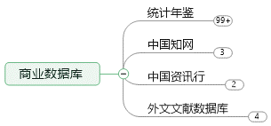
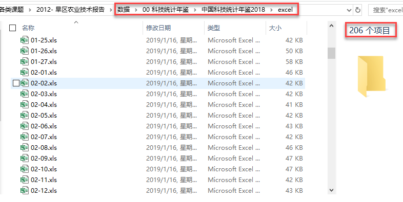
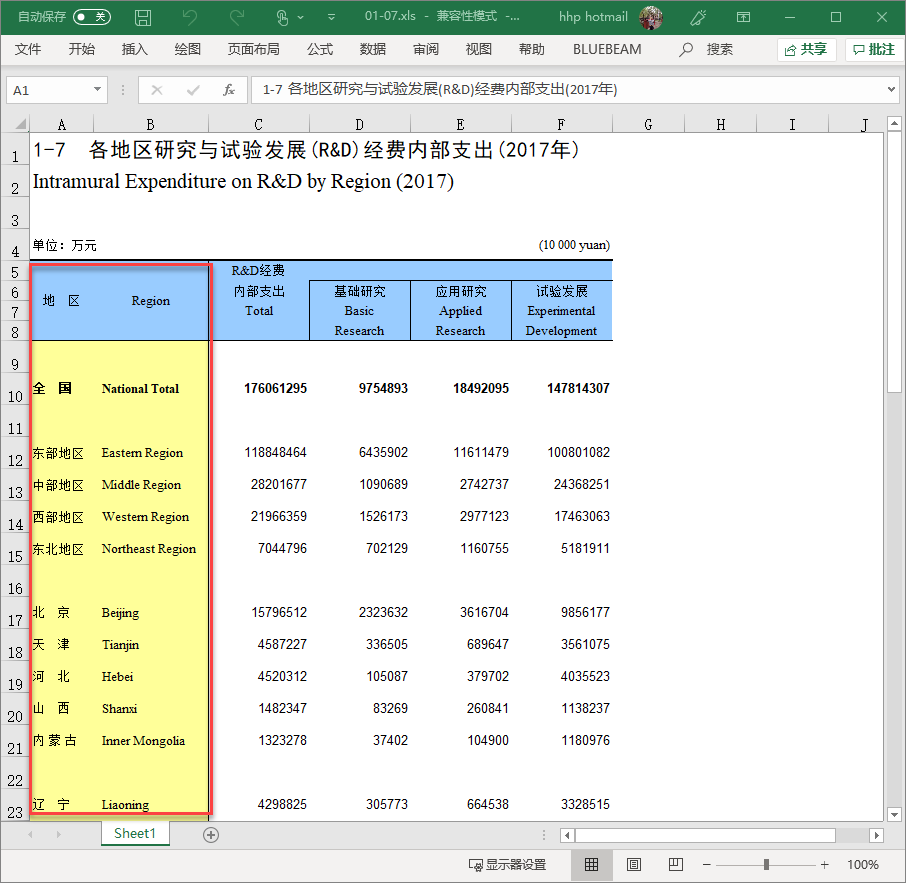
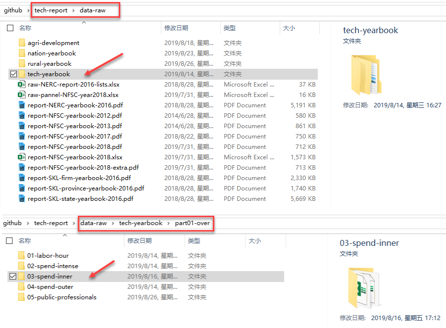

---
output:
  xaringan::moon_reader:
    seal: false
    lib_dir: libs
    css: 
      - default
      - default-fonts
      - duke-blue
      - hygge-duke
      - ../mycss/my-custom-for-video.css
    nature:
      highlightStyle: github
      highlightLines: true
      countIncrementalSlides: false
      ratio: "16:9"
---
background-image: url("../pic/slide-front-page.jpg")
class: center,middle

# 统计学原理(Statistic)

<!---    chakra: libs/remark-latest.min.js --->

### 胡华平

### 西北农林科技大学

### 经济管理学院数量经济教研室

### huhuaping01@hotmail.com

### `r Sys.Date()`

```{r global_options, echo=F,message=FALSE,warning=F}
source("../R/set-global.R")

```


```{r ex-math-eq}
source("../R/external-math-equation.R")
```


---
class: inverse, center, middle
name: chapter02

# 第二章 数据收集、整理和清洗


[2.1 数据来源与形式](#sources)

[2.2 数据收集](#collection)

[2.3 抽样设计](#sampling)


[2.4 数据整理](#tidy)

[2.5 数据清洗](#clean)

[2.6 数据的数据库化](#database)

[2.7 数据质量](#quality)


---
layout: false
class: inverse, center, middle, duke-softblue
name: sources

# 2.1 数据来源与形式

---
layout: true

<div class="my-header-h2"></div>

<div class="watermark1"></div>

<div class="watermark2"></div>

<div class="watermark3"></div>

<div class="my-footer"><span>huhuaping@  &emsp;&emsp; <a href="#chapter02"> 第02章 数据收集、整理和清洗 </a>
&emsp;&emsp;&emsp;&emsp;&emsp;&emsp;&emsp;&emsp;&emsp;&emsp;&emsp;&emsp;&emsp;&emsp;&emsp;&emsp;&emsp;&emsp;&emsp;&emsp;&emsp;
<a href="#sources"> 2.1 数据来源与形式 </a> </span></div> 

---

## 数据来源

不同研究方法会产生不同类型数据：

- 观察数据

- 调查数据

- 实验数据


---

## 数据来源

从产生数据的方式方法上又可以有：

- 问卷数据

- 访谈数据

- 文献数据

- 痕迹数据：大数据。（注意不是**痕迹证据**！）

在获得数据的同时，  应该还有一份数据，是记录数据获得过程的，通常称之为日志，  它要记录数据是从哪里来的、什么情况下得到的、数据的基本特征又是什么，  比如文字数据有多少页、图片数据有多少张，这就是日志数据


---

## 数据载体和形态


从是否数字化来看：

- 数字化的数据

- 非数字化的数据


从是否数值化来看：

- 数值数据

- 非数值数据

---

## 数据载体和形态

从具体形态来看：

- 文本数据：
    
    - 访问、观察中的文字记录
    - 数字化的字符形态的数据
    - 任何文字加载体的数据，比如文字加载于纸张、羊皮卷等

- 图片数据：

    - 访谈时拍的照片、搜集到的图片、照片的底片等等
    - 数字化为像素点形态的图片数据
    - 任何图形加载体的数据，比如图形加载于纸张、胶片、计算机存储等

---

## 数据载体和形态

- 音频数据：
    - 访问录音、观察中的语音日志、搜集到的音频记录等。 
    - 数字化为波形形态的音频数据。
    - 任何音频加上载体，比如音频加载于钢丝、胶片、磁带、光碟、磁碟、闪存盘、硬盘等

- 视频数据：
    - 访谈时的全程录像、搜集到的各种各样视频。
    - 数字化为像素点加上波形形态的视频数据
    - 视频加上载体，比如比如视频加载于胶片、光碟、闪存盘、硬盘等
    
- 实物数据

    - 任何有实物才可以完整保存信息的实物载体数据
    - 访谈中搜集到的实物、观察中观察到的实物，比如出土文物、建筑等

???

数据的类型主要依据来源和载体形态有不同的划。

对数据整理而言，载体形态是最基本的分类，不同载体形态的整理方式会有不同。 

---
class: duke-orange
### 课堂思考


以上关于数据来源与形式的分类是完全是互斥的吗？

以调查问卷为例：

- 传统纸版问卷，主要是文字、图片形态的数据。

- 新媒体电子问卷，不管是哪一个类型的电子问卷，主要是数据形态的数据，当然也会有图片的、音频的、视频的数据。 


以上的分类并不完全是互斥的，只是根据显性的特征来做一些划分，其实我们很难找到一个标准把数据的形态类型区分得非常清楚。 

???

有同学可能会说：“老师，问卷上不是有数吗？”数在数字化里有两个定义的，一个是字符型的，一个是数值型的，有不同的含义；在纸版上不管是数还是字，都是文字形，在纸版问卷中，除了数还有图片，或者是图画，只有这两个形态的数据。  


---
class: duke-orange
### 课堂思考

数字与数值是一个意思吗？

图片、音频、视频看起来的确是数字的，但数字不等于数值！

- 传统照片不是数字的。

- 数码照片的数字指的是像素点的数字

- 音频、视频是同样的道理。


---
class: duke-orange
### 课堂思考

>“老师，不管什么时候我都要用计算机做笔记的。” 

信息化时代，传统手写记录的文本数据是不是越来越没有价值？

- 用计算机或各类终端设备来做电子化记录。

- 用笔和本子做传统记录。 

---
layout: false
class: inverse, center, middle, duke-softblue
name: collection

# 2.2 数据收集

---
layout: true

<div class="my-header-h2"></div>

<div class="watermark1"></div>

<div class="watermark2"></div>

<div class="watermark3"></div>

<div class="my-footer"><span>huhuaping@  &emsp;&emsp; <a href="#chapter02"> 第02章 数据收集、整理和清洗 </a>
&emsp;&emsp;&emsp;&emsp;&emsp;&emsp;&emsp;&emsp;&emsp;&emsp;&emsp;&emsp;&emsp;&emsp;&emsp;&emsp;&emsp;&emsp;&emsp;&emsp;&emsp;
<a href="#collection"> 2.2 数据收集 </a> </span></div> 

---

## 研究数据怎么来？

> “老师，我要做一个研究”

> “你的数据从哪里来？” 

**原始数据**：一般不能直接用于研究。

**研究数据**：是处理为结构化的、有变量、数值、变量、属性标签的数据。


根据研究数据的持续性，来源有：

1. 已经存在的数据。公开数据、正式出版数据、发布的数据，都可以直接使用。

    - 政府各类统计数据。包括经济、就业、人口、健康、教育、产业等等数据。
    - 上市公司公开数据。根据相关法律，公司的财务数据、生产数据应该公开。
    - 研究机构或者研究者个人公开的数据。

2. 将要产生的数据。是系统采集的、不断在推进补充的数据。


---

## 研究数据怎么来？

根据研究数据是否为研究者产生，来源有：

**一手数据**：是指自己调查获取的数据。自己调查数据是一个不得已的选择，对任何研究者而言，都应该是第二选择而不是第一选择。

**二手数据**：是指已经被使用过的数据，拿来再做分析。如果你的研究能够使用已经存在的数据，尤其是很多人用过的数据，那么最好用这样的数据(为什么呢？)。

--

- 数据的可靠性已经被检验过

- 研究的成果具有可比性

- 通过调查来获取数据，需要专门的能力，包括组织能力、获取数据的能力、评估数据质量的能力、有效运用数据的能力，还需要一定要有资源。

---

## 研究数据的获取权限

研究数据的**获取权限**一般有如下情形：

- 无需授权就可以使用的数据。正式出版物提供的数据只需要在使用说明中正式说明出处，就不需要授权。

- 需要申请授权的、公开的数据。大多数的学术研究数据，如果你要使用，是需要申请并且被授权。

- 需要通过授权的、未公开的数据。行为痕迹管理机构的数据，包括政府数据、赢利和非赢利服务机构的数据，都属于这类数据。

    - 政府数据：几乎任何一笔收入，都是经过机构管理的，都有痕迹数据。
    - 银行数据：每个人都有银行账号，只要是经过银行卡的，都会留下数据。
    - 电信数据：只要是通过网络通信的数据，都会留下数据记录。

> “老师，他们保存多久呀？”

???

关于网上行为和行为痕迹数据，推荐一本书《删除》，作者Schonberger。

---

## 典型的学术数据来源（国外）

几个主要的数据来源：

- 美国大学联盟[数据集成中心(ICPSR)](https://www.icpsr.umich.edu/icpsrweb/)。机构在密歇根，是世界上最大的学术数据源。

- 美国芝加哥大学-[广泛社会调查(GSS)](https://gss.norc.org/)

- 美国芝加哥大学-[收入动态调查面板数据(PSID)](https://psidonline.isr.umich.edu/)

- 美国密歇根大学-[健康和退休调查数据(HRS)](http://hrsonline.isr.umich.edu/)，公开自1990年

- 英国艾塞克斯大学-[认识社会调查数据库(Understanding Society)](https://www.understandingsociety.ac.uk/)。

---

## 典型的学术数据来源（国内）

- 北京大学[中国社会科学调查中心(ISSS)](http://www.isss.pku.edu.cn/)。主要的中国家庭追踪调查（CFPS）、中国健康与养老追踪调查（CHARLS）

- 中国人民大学[中国调查与数据中心(NSRC)](http://nsrc.ruc.edu.cn/)。主要的数据源有中国综合社会调查（CGSS）、中国教育追踪调查（CEPS）、中国老年社会追踪调查（CLASS）

- 中国疾病控制中心[(CDC)](http://www.phsciencedata.cn/Share/)。主要的数据源包括了慢病、流行病、艾滋病等多种涉及健康与疾病的调查。

---

## 学术数据使用的几个问题


- 二手数据可以进行的反复多次的再分析。

    - 同样的数据集，使用不同的方法，可以进行检验或者商榷；
    - 同样的数据集，用于不同的研究主题和研究目的，则可以用于不同的研究目的。
    - 不同的数据集，不同的方法，可以以达成特定的研究目的。

- 使用二手数据，应按照学术规范说明数据来源。（千万别忘记！）

- 使用二手数据，往往面临数据处理、转换、加工等技术性的问题。

    - 参考哈佛大学和MIT联合建立的[定量社会科学研究中心IQSS](https://www.iq.harvard.edu/)。


- 使用**综合性数据库**还是**专门性数据库**，这是个问题！

    - 综合性数据不一定能够满足专业兴趣的要求和需求。
    - 专业性数据库可能比较专业，难以与你的研究目标一致。


???

入学机会不平等研究。需要用到地区性的当年高中毕业生人数、地区性的当年的经济收入数据、地区性的当年城乡户籍人口数据。

如果用综合数据，这些专题数据显然就找不着。在政府数据中，倒是可以找到一些，但是，需要根据专题去清理、去加工。除此以外，考入北京大学的学生人数和地区，北京大学的招办就有。


---

## 收集数据的几点忠告

> 学生：“既然有这么多的数据，这门课是不是可以不学了？” 

> 回答：“这门课你不仅要学，而且要认认真真地学”


掌握数据采集的知识与能力，是用好数据的基础。如果不了解数据是怎么获得的，就没有能力甄别已有的数据到底可不可靠、可不可用，甚至都不知道上哪儿去找数据。

- 第一，研究数据有多种、多重的来源，好好运用既有的数据是研究者的第一选择；

- 第二，获取已经存在的数据有很多个方法，也有多种途径 

- 第三，万一没有办法获取需要的研究数据，那就只好自己动手。


---

## 收集二手数据(搜索引擎类)

搜索引擎：

- [谷歌搜索](https://www.google.com/)（需VPN）

- [谷歌学术](http://scholar.google.com/)（需VPN）

- [谷歌图书](http://books.google.com)（需VPN）

- [必应搜索](http://cn.bing.com/#)（可直接访问）

---
layout: false
class: middle,right
background-size: contain
background-image: url("../pic/chpt02-search-google.png")

## .red[大宝！谷歌搜索]

---
layout: false
class: middle,left
background-size: contain
background-image: url("../pic/chpt02-search-google-scholar.png")


## .red[二宝！谷歌学术]

---
layout: false
class: center,top
background-size: contain
background-image: url("../pic/chpt02-search-google-book.png")


## .red[三宝！谷歌图书]


---

layout: true
  
<div class="my-header"></div>

<div class="my-footer"><span>huhuaping@   第02章 数据收集、整理和清洗   
&emsp;&emsp;&emsp;&emsp;&emsp;&emsp;&emsp;&emsp;&emsp;&emsp;&emsp;&emsp;&emsp;
&emsp;&emsp;&emsp;&emsp;&emsp;&emsp;&emsp;&emsp;&emsp;&emsp;&emsp;&emsp;&emsp;
2.2 数据收集</span></div> 

---

## 收集二手数据(国内文献和统计数据)

国内文献和统计数据：

- 中国知网（内含统计年鉴资源）——[学校图书馆网站](http://lib.nwsuaf.edu.cn/)

    - CNKI中国知网－[CNKI中国期刊全文数据库](http://fjour.blyun.com/dbguide?go=dbinfo&id=490)
    - 中国知网-[统计年鉴数据库](http://nianjian.cnki.net/)

- 搜数网——学校购买暂时无访问权限

    - [新版搜数网- 中国资讯行](http://www.soshoo.com/index.do)

- [人大经济论坛](http://www.pinggu.org/bbs/index.asp)：论坛币下载

---

## 收集二手数据(国外文献和统计数据)

国外文献和统计数据：

- 电子期刊：[SpringerLink电子期刊及电子图书](http://fjour.blyun.com/dbguide?go=dbinfo&id=319)


- 电子期刊：[Wiley Online Library](http://fjour.blyun.com/dbguide?go=dbinfo&id=358)


- 电子期刊：[ScienceDirect](http://fjour.blyun.com/dbguide?go=dbinfo&id=131)


- 电子期刊：[Emerald](http://fjour.blyun.com/dbguide?go=dbinfo&id=133)


- 学位论文：[ProQuest 学位论文全文库](http://fjour.blyun.com/dbguide?go=dbinfo&id=284)

---

## 收集二手数据(一个小项目1)

.left-column[
- **中国旱区农业科技资源配置研究**
]

.right-column[

```{r}
include_graphics("../pic/chpt02-second-projects.png",dpi=110)
```
]

---

## 收集二手数据(一个小项目2)

.pull-left[

```{r}

```

]

.pull-right[

```{r}
include_graphics("../pic/chpt02-second-projects3.png", dpi = 110)
```

]

---

## 收集调查数据1：自填式问卷调查


**自填式问卷调查**：没有调查员协助的情况下由被调查者自己完成调查问卷
问卷递送方法：调查员分发、邮寄、网络、媒体

**优点**：要求调查问卷结构严谨，有清楚的说明

**缺点**：

- 问卷的返回率比较低
- 不适合结构复杂的问卷
- 调查周期比较长 
- 数据搜集过程中出现的问题难于及时采取调改措施 


---

## 收集调查数据2：面访式问卷调查

**面访式问卷调查**：调查员与被调查者面对面提问、被调查者回答的一种调查方式。

**优点**：
- 可提高调查的回答率
- 可提高调查数据的质量
- 能调节数据搜集所花费的时间

**缺点**：
- 调查的成本较高
- 调查过程的质量控制有一定难度

---

## 收集调查数据3：电话式问卷调查

**电话式问卷调查**：通过电话向被调查者实施调查。

**特点**：
- 速度快，能在短时间内完成调查
- 适合于样本单位十分分散的情况

**局限性**：

- 如果被调查者没有电话，调查将无法实施
- 访问的时间不能太长
- 使用的问卷需要简单
- 被访者不愿意接受调查时，难以说服

---

## 收集调查数据：总结

```{r}
investigation <- read.xlsx("../data/investigation.xlsx")

investigation %>%
  datatable(options = list(pageLength =8))
```

<br>

> 有时间大家可以先看看“调查问卷设计”和“市场调研”相关图书！

---

## 收集实验数据

此处略！

---
layout: false
class: inverse, center, middle, duke-softblue
name: sampling

# 2.3 抽样设计

---
layout: true

<div class="my-header-h2"></div>

<div class="watermark1"></div>

<div class="watermark2"></div>

<div class="watermark3"></div>

<div class="my-footer"><span>huhuaping@  &emsp;&emsp; <a href="#chapter02"> 第02章 数据收集、整理和清洗 </a>
&emsp;&emsp;&emsp;&emsp;&emsp;&emsp;&emsp;&emsp;&emsp;&emsp;&emsp;&emsp;&emsp;&emsp;&emsp;&emsp;&emsp;&emsp;&emsp;&emsp;&emsp;
<a href="#sampling"> 2.3 抽样设计 </a> </span></div> 

---

## 什么是抽样

假设我们希望通过自己调查来获得一手数据，就需要回答一系列问题：

1. 抽样的基本原理是什么？

2. 抽样的基本要素有哪些？

3. 抽样的逻辑是什么？

4. 什么条件该要采用概率抽样方法？怎么样做概率抽样设计？

5. 什么条件下要采用非概率抽样方法？又如何做非概率抽样？

6. 一个抽样方案应该包括哪些内容？

7. 怎么样去实施抽样工作？

???
我们从抽样的基本原理入手， 理解抽样的原理，对理解抽样的方法及其适用的情境，非常重要。
讲枯燥的原理是同学们反对的，我也觉得很无聊，我们还是用例子吧。
还记得我们的课题吗？北京大学本科生入学机会的地区不平等研究。
这个题我们已经做到哪一步啦？我们已经把研究问题操作化了，记得不？
地区经济发展水平与进入北京大学的机会。
相关的概念我们也操作化了，对吗？ 地区，我们可以根据经济发展水平，把省级单位作为地区区分的基本单位，
依据经济发展水平，区分为高、中、低三个类型。
有同学可能会问：“老师，怎么划分高、中、低呢？"。
在方法上可能比较简单，如果有数据，有31个省、市、自治区的数据，
我们就可以看各省级单位的人均GDP，
人均GDP，是可以比较的参数，对吧？我们就用这个参数， 用各省级单位人均GDP进行排序，
由高到低，由低到高都行，但要有相同的规则。
根据变量值分布的相对集中程度吧，我们可以把 31个省级单位分为人均GDP的
高、中、低三个组。
当然还有比较复杂的方法，比如说用多个经济指标进行聚类，
根据多个经济指标对教育的影响计算权重，再分类等等。
这里呢，我们采用最简单的方法，也可能是最有效的，同学们能够做的方法。
再看城乡的区分。
城乡的区分比较简单，我们已经讨论过了，由于学生的 受教育机会主要是受户籍特征的影响，
所以，按照农业户籍和非农业户籍进行划分就好了。
这里我提醒同学们，如果想了解中国的户籍制度，以及户籍制度对人们社会经济生活所带来- 的影响，
建议大家找一些文献进行阅读，做社会研究， 不了解中国社会，是很难做研究的。接着看入学机会，
用某地区当年被北京大学录取的学生数， 除以该地区当年高中毕业生的总数，再乘以100%。
大家还记得这里采用的是能力不平等，对吗？ 是否平等，是我们的因变量，
我们要比较的正是6类地区的入学机会，据此判断入学机会 是否与经济发展水平有关。
从这儿的操作化来看，我们并没有用到超出我们知识水平和能力范围的内容，对吧？
为下一步操作的方便，有一些问题，还需要
进一步地推敲，比如经济发展水平，虽然采用了人均DGP， 虽然已经做了很强的假设，大家还记得我们假设
不同地区的经济发展水平是同质的， 可我们还是不放心，我们知道一个省内不同地区的经济发展水平是有差异的，
因此会犹豫，是只考虑省级之间的差异呢？ 还是降低层级，比如说，也考虑地市级之间的差异呢？
如果考虑地市级之间的差异，那么在一个省级单位内，
是把所有的地市级都纳入呢，还是在抽取了省级单位以后， 再把抽到的省级单位的所有地区纳入？
还是说在抽取省级单位之前，就考虑地市级之间的差距，用地市级单位
进行排队，直接抽取地市级单位呢？ 不管是采用省级单位，还是采用地市级单位，
另一个需要考虑的问题就是，在划分时，要不要把毕业生数量作为一个影响因素？
再看毕业生，要把31个省级单位的全部高中毕业生都纳入搜集数据的范围吗？ 还是只搜集其中的一部分就够了？
如果只搜集其中的一部分，我们怎么选高中呢？这一些 都是在调查实施之前要推敲的问题，
之所以要推敲，是因为关系到研究的误差。
在进一步推敲之前，我们先看一些事实，北京大学的本科生， 不是以县级单位为基本单位录取的，
也不是以地市级为基本单位录取的，而是以省级为基本单位录取的，不仅如此，
初等教育的资源配置也是以省级为基本单位的，因此呢，第一个问题似乎就解决了。
那么是否调查全部的高中毕业生呢？还记得我们曾经假设地区内部
具有高度的同质性？事实上同质性是人类社会普遍存在的现象，
对我们的调查而言，同质性意味着变量属性的相似 或者相等，意味着我们无需调查全部的高中毕业生。


我们举一个例子，比如说我们买了100支同样的铅笔， 结账的时候，到底是用乘法，还是用加法？
可能同学们马上会说：“老师，这个问题是不是有点2啊？” 不，对抽样而言，这的确是一个问题，
看起来是生活中一个不需要想的问题，在这儿，却真的要想清楚， 到底是使用乘法，还是使用加法？
大家都会说：“当然使用乘法了！” 的确，如果使用加法，就意味着要对全部的毕业生进行调查；
使用乘法呢，就意味着可以对同类学生中的一位进行调查，
再乘以同类学生的数量。

可是为什么要使用乘法？ 是因为尽管两者的结果是一样的，
使用乘法要快得多。快， 在调查上就意味着节省，省时间、省金钱、
省人力、省物力。这是人类社会行为的动力， 

某个变量属性在人群中的分布，有异质性，也有同质性，
前面我们假设同质性，在实践中是很冒险的做法，我们知道有些地区的中学
考上北京大学的人每年都有，另一些地区的中学呢？ 多少年都没有一位，也就是说，在一个省级单位内部，
地区之间就考上北京大学的毕业生而言，是 异质性的，如此，就不能用一位来代表全部的学生，而
需要用不同数量的毕业生来代表不同类型的毕业生，抽样问题也就出现了。
在群体中，抽选代表性群体的做法，
在调查中，就是“抽样”。

我们知道在一个群体中，既有同质性的，也有异质性的，
抽取一个代表不了，那么就地区经济发展水平而言，虽然已经区分了高、中、低三类，
每一类中，其实也存在着很大的异质性。
接下来的问题就是在每一类中抽选多少，才可以代表这一类内部的异质性呢？
这就是抽样、抽样设计、抽样方法要探讨的问题了。
有同学可能会说：“既然存在异质性，干脆把全部高中毕业生都纳入不就得了？”
问题是任何一项研究都会面对资源的约束，
假设这是博士研究生自己的项目，不是教育部委托的，你们认为他有资源调查全部的毕业生吗？


一方面，资源有限，迫使研究者采用抽样的方法，而不是普查的方法，
从研究对象那里去获得数据；

另一方面呢，在研究对象中，事实上存在着同质性，也迫使普查不仅浪费资源，
也毫无必要。还有，即使你有资源，甚至愿意做普查，也不是想普查就能普查的，
有时候一些研究对象也不可及呀，你不忙人家还忙着呢！


在这种情况下，采用同质性代表的方法甚至比普查还要靠谱。


当然抽样也有局限性，

如果研究对象的分布非常广泛，对调查而言，
就是很麻烦的事，比如CFPS， 在抽样设计中就受到了研究对象分布太广的影响，
理论上，CFPS要代表的是中国大陆的所有家庭，
可是在新疆西藏的牧区，调查对象的分布实在太广了，在那儿调查一户人家所花费的资源可能是在城镇地区的多少倍，我实在没有这些资源，就只好放弃。还有，


如果研究对象的数量非常稀少，比如说铊中毒， 大家可能比较熟悉，假设我们希望研究铊中毒人群的分布，
由于对象的数量实在太少，采用抽样的方法几乎就不可能
获得研究对象，这时候，采用抽样方法就不管用了。

我做吸毒者研究，做性工作者研究的时候，虽然 研究对象的数量比铊中毒病患的数量要大得多，依然无法采用抽样方法。
还有一种特殊情形，假设是教育部委托博士生在做我们的题，
有足够的时间，也有足够的资源，中国大陆高中毕业生的数量， 考上北京大学的数量，也很容易获得，这个时候，就不需要节省了。
如果我们坚持采用抽样方法，坚持节省，就有可能因此而产生误差，
误差我们一再提到过，不过呢，现在还不是讲误差的时候，大家先记住这个概念。
讲了半天，到底什么是抽样呢？下边，我们对这一节的内容做一个小结，小结中
你就知道答案了。抽样就是用代表来代表同类的做法，注意，这不是科学的定义，是操作定义，
这里并没有在抽样两个字的前面加上任何的定语。
如果讲概率抽样，这个定义就不准确了。概率 抽样我们接下来会讨论，这里大家只需要记住

抽样就是用代表来代表同类。之所以要抽样，是为了节省资源，进而节省成本，也是为了效率，抽样不是无聊的行为。

---

## 抽样的要素（总体）

**总体**：是研究问题指涉对象的集合体，也就是研究问题涉及的全部对象。

- CFPS的总体是中国所有的家庭户
- CGSS的总体是中国所有的个体
- 入学机会的地区不平等研究的总体，就是某年所有的高中毕业生。

--

.pull-left[

- 什么叫中国所有的家庭户，中国所有的个体？
- 什么叫所有，台湾算不算？香港和澳门算不算？
- 住在中国的还是有中国户籍的？住在中国的外国人算不算？ 
- 长期出国却依然有着中国户籍的人算不算？

]

--

.pull-right[

- 什么叫家庭户？没有生活在一起，户口在一起算不算？生活在一起，
- 户口不在一起的，算不算？怎么才算是某个地方的家庭户？
- 户口在甲地，却很少在甲地居住，算不算甲地的家庭户？ 
- 什么叫所有高中毕业生？没有参加高考的算不算？
- 因非主观原因有参加高考的算不算？

]

---

## 抽样的要素（研究总体）


**研究总体**，是指可操作的研究对象，或称为**可及总体**。

CFPS把总体定义为中国的家庭户，是指有中国户籍的家庭户，指住在一起的，不管户籍是不是在一起的家庭户。

--

- CFPS中，家庭户指居住在二十五个省级单位内的家庭户吗？
- 户籍不在本地的算不算？
- 住又是什么意思呢？
- 住多长算是住？
- 一个人打工住在本地算是一户吗？

---

## 抽样的要素（抽样框和抽样单位）


**抽样框**：又叫抽样总体、框总体，是从研究总体中获得的用于抽取样本的研究对象的集合。

- CFPS的**总体**是中国所有的家庭户；

CFPS的**研究总体**是二十五个省、市、自治区的常住户；

CFPS的 **抽样框**是二十五个省、市、自治区在一个地方连续居住六个月或以上常住户。

- 从覆盖面和覆盖的对象数量出发，**总体**大于或等于**研究总体**，
**研究总体**，大于或等于**抽样框**。


---

## 抽样的要素（抽样单位和样本）

**抽样单位**：是抽样指涉的基本单位，或包括基本单位的单位集合体。

- CFPS在抽到家庭户之前还要抽样本区县，样本村居。每一次抽样面对的基本单位
就是抽样单位。


**样本**：是从抽样框中运用抽样策略和抽样方法获取的样本单位的集合。

- CFPS的样本是，从25个省市自治区抽取的160个区县样本，从160区县样本中抽取的640村居样本，从640村居样本中抽取的16000个家庭户样本。


---

## 抽样的逻辑（样本代表性）

**抽样的基本逻辑1**：选择一定数量的样本，来拟合总体中个体变异性的分布，进而代表总体。

**抽样的基本逻辑2**：用尽量少的样本，在可接受的误差范围内，来代表总体的研究特征。

柯西的思想：用代表性的样本就可以估计总体的研究特征。


> 柯西曾去美国国会作证，他反对在美国实施人口普查，认为每十年一次的人口普查，耗费太多的资源，实在没有必要。
 
如果个体在总体的分布是随机的，根据随机性原则抽取的样本就能代表总体，就是**代表性样本**。

在研究实践中，样本与总体之间总是有差异的。即时在随机条件下，尽管每个抽样单位被抽中的概率是相等的。由**样本特征**与**总体特征**之间，总是有差距的。

---

## 抽样的逻辑（抽样误差）

**抽样误差**：是样本研究特征与总体研究特征之间的差异。误差的大小一般取决于样本的代表性。样本对总体的代表性越好，误差就越小，否则误差就会越大。

依据误差的来源环节，可分为：

1. **随机误差**：误差就是由抽样环节造成的误差。随机误差是希望**尽量**避免的误差。

2. **系统误差**：误差具有规律性，主要是由抽样设计造成的。系统误差是我们**最应当**避免的。因为一旦出现的系统误差，几乎就没有补救的余地，

    - 假设希望知道性别与成就之间的关系。严格按照抽样方案完成的抽样，抽到的样本却都是男性的，没有女性。


---

## 抽样的逻辑（抽样误差）

依据抽样活动涉及的对象，可以把误差来源分为：

1. **覆盖性误差**：是抽样活动没有正确的覆盖需要覆盖的总体，要么对总体覆盖过度，要么覆盖不住，过度和不足都会导致误差。

    - 假设界定的**总体**为参加高考的高中毕业生
    - 如果在抽样中把自愿或者是因为其他原因没有参加高考的毕业生都纳入到了抽样的范围，这就是覆盖过度。
    - 如果我们把复读并参加了高考的学生排除在了抽样的范围， 这就是覆盖不足。

2. **选择性偏差**：在设计与执行中，因偏好或者抽样活动而导致某个特定类型的样本的分布出现问题。
    - 某一类人群过多或者过少或者缺失。
    - 某个人群不在抽样框，被选机会就没了。

---

## 抽样的逻辑（样本分布）

**抽样的逻辑3**：利用重复多次抽样，提高抽样代表性，减小抽样误差。


**抽样分布**：又称统计量分布，指样本估计值的分布。抽样分布可以用来测量抽样方法的稳定性。


**总体分布**：是指总体特征值的分布。总体分布并不总是可得的，即使可得，也不满足经济性原则。


---

## 样本分布

本学期稍后学习！

（千呼万唤、望穿秋水你们的《概率论与数理统计》啊！！！）

---

## 抽样方式（总览）

**概率抽样**：就是运用等概率原则进行抽样的总称。**等概率原则**，是指总体中每一个研究对象被抽中的概率是相等的。包括：简单随机抽样、系统抽样、整群抽样、与规模成比例的概率抽样、分层抽样以及隐含的分层抽样、多阶段混合抽样。

**非概率抽样**：抽取样本时不是依据随机原则，而是根据研究目的对数据的要求，采用某种方式从总体中抽出部分单位对其实施调查。包括：方便抽样、判断抽样、自愿样本、滚雪球抽样、配额抽样。

从抽样方式的具体运用，又可分为：

- **直接抽样**：一次抽样或独立抽样。简单随机抽样、系统抽样和整群抽样都是直接抽样

- **半截抽样**：通常不可以独立地用，要结合前直接抽样来使用。规模成比例的概率抽样、分层抽样以及隐含的分层抽样、多阶段混合抽样都属于半截抽样。

---

## 概率抽样1：简单随机抽样（步骤方法）

**简单随机抽样(simple random sampling)**：从总体N个单位中随机地抽取n个单位作为样本，每个单位入抽样本的概率是相等的。它是最基本的抽样方法，也是其它抽样方法的基础。

.pull-left[

**实施方法**：
- 第一步，制备抽样框
- 第二步，对要素进行编码
- 第三步，根据抽样的要求抽取样本。

    - 直接抽选法
    - 抽签法
    - 随机数码表法（或kish table）
    - 软件抽取法

]


---

## 概率抽样1：简单随机抽样（优缺点）


**优点**：

- 简单、直观，在抽样框完整时，可直接从中抽取样本

- 用样本统计量对目标量进行估计比较方便


**缺点**：

- 当N很大时，不易构造抽样框

- 抽出的单位很分散，给实施调查增加困难

- 没有利用其它辅助信息以提高估计的效率

- 使用随机数表抽样的效率往往比较低下，即使用到，也会使用随机数表的一些变体如kish table


---

## 概率抽样1：简单随机抽样（kish table）

> Kish, L. (1949). A Procedure for Objective Respondent Selection Within the Household,Journal of the American Statistical Association, 380-387.

- 第一步，制备末端抽样框，将样本家户所有符合要素资格的成员，按照规则顺序编号，依据性别也好，年龄也好，逆序也好，顺序也好，怎么排都行，要求是不重，不漏。

- 第二步，拿出事先准备好的kish表，根据指引，抽取样本。抽样的约定是不管家里有几个要素，只抽取其中的一个要素作为样本。

---

## 概率抽样1：简单随机抽样（kish table）

```{r}
include_graphics("../pic/chpt02-kish-table.png", dpi = 140)
```


???
我们把家庭人口数量常见的状态都纳入了考量，这就是我们在表左列看到的情况，家庭要素从一到五有不同的抽选方案。比如，家里有四个要素，如果选择a表作为抽选方案，则抽选编号为一的作为样本，同样，如果选中b1表作为抽样方案，也选择编号为一的
作为样本。如果选择e2表作为抽样方案，则选择编号为四的作为样本。
如果选择f表作为抽样方案，同样，也选择编号为四的作为样本。

有的同学可能会问了，老师，到底选择哪个表作为抽样方案呢？ 是怎么确定的？很简单，操作指南中，就已经说明了使用方法。

有的就是随机选择起始表号，按照规则继续和循环，有的呢，直接指定了从哪个表号开始，按照什么规则继续。

---

## 概率抽样1：简单随机抽样（软件实现）

利用**统计软件**能快速实现简单随机抽样:

- SPSS

- excel

- R


简单随机抽样的两点忠告：

- 简单随机抽样是不得已的办法，不是最先选用的办法

- 只有在总体的信息所知甚少的情况下，才用它。

---

## 概率抽样1：简单随机抽样（R示例）

```{r}
files <- dir("../data/student-list/")
dir_list <- str_c("../data/student-list/", files)

students <- NULL
 for (i in seq_along(dir_list) ){
  data_tem <- openxlsx::read.xlsx(dir_list[i], startRow = 3, cols = 1:4, colNames = T) %>%mutate(class =str_extract(`班级`, "([^\\d]+)"),
      grade = str_extract(`班级`, "(\\d.*)"))
  
  students <- bind_rows(students, data_tem) %>%
    mutate(`序号`=1:nrow(.))
}
n <- nrow(students)

```

**任务**：从教学班上随机抽取6人。

- 第一步，确认当前的班级是样本班级，制作抽样框。

- 第二步，对班级的`r n`位同学从1到`r n`实行顺序编码。编码顺序可以按学号、按座位等，只要是有规则，并且保证每一位同学只有一个唯一的编号就行。

- 第三步，选择一个随机数表，大家可以找到很多的随机数表（教材附录）。在查阅随机数表之前，说出第一个样本的行列位置作为起点。

- 第四步，在随机数表上找到上面的起点，然后取一组随机数的固定位置，按照事先制定的规则，依次选中随机数字中的一位。

---

## 概率抽样1：简单随机抽样（R示例）


全体学生名单（按班级和学号排序）：共`r n`人。

```{r}
students%>%
  select(-class, -grade) %>%
  datatable(options = list(pageLength = 5, dom ="tip")) 
```

---

## 概率抽样1：简单随机抽样（R示例）

不放回-简单随机抽样：

从1-`r n`中产生6个随机数：

```{r, echo= TRUE, comment= ''}
choice <- base::sample(1:n, size = 6, replace = FALSE )
choice
```

---

## 概率抽样1：简单随机抽样（R示例）

不放回-简单随机抽样：

抽取到的6个学生：
```{r}
students%>%
  select(-class, -grade) %>%
  filter(`序号` %in% choice) %>%
  datatable(options = list(pageLength = 6)) 
```


---

## 概率抽样1：简单随机抽样（kish table）R示例1


下面是一张kish随机数表：

```{r}
kish <- read.xlsx("../data/kish-table.xlsx")

kish %>%
  datatable(caption = "一份kish 随机数表")
```

---

## 概率抽样1：简单随机抽样（kish table）R示例2


```{r}
set.seed(123)

household <- as_tibble(list(id=1:30, adults.num = sample(1:8, size=30, replace = T))) %>%
  mutate(adults = if_else(adults.num >=6, ">=6", as.character(adults.num))) %>%
  left_join(., kish, by ="adults")
n_household <- nrow(household)
```

假设需要调查共`r n_household`户家庭，并对每户的成年人进行了编号：

```{r}
household %>%
  select(1:2) %>%
  datatable(options = list(pageLength = 6, dom ="tip"))
```

---

## 概率抽样1：简单随机抽样（kish table）R示例3

按家庭成年人总数做分类，结合kish表可以得到：

```{r}
household %>%
  #select(1:2) %>%
  datatable(options = list(pageLength = 6, dom ="tip"))
```

---

## 概率抽样1：简单随机抽样（kish table）R示例4

进一步地，每户都可以在8张表（A-F）中做出随机选择：

```{r}

household %>%
  gather(key = "table", value = "select", A:`F`) %>%
  arrange(id,table) %>%
  datatable(options = list(pageLength = 6, dom ="tip"))

  
```

---

## 概率抽样1：简单随机抽样（kish table）R示例5

最后随机抽取kish表的结果如下

```{r}
set.seed(234)
household %>%
  gather(key = "table", value = "select", A:`F`) %>%
  arrange(id,table) %>%
  group_by(id) %>%
  sample_n(size = 1)%>%
  datatable(options = list(pageLength = 6, dom ="tip"))

  
```


---

## 概率抽样2：系统抽样（实施方法）

**系统抽样(systematic sampling)**：将总体中的所有单位按一定顺序排列（变量要素），在规定的范围内随机地抽取一个单位作为初始单位，然后按事先规定好的规则确定其它样本单位。**系统抽样**也称为等距抽样。

.pull-left[

**应用情景**：

- 总体要素与抽样对象一致

- 总体通常规模也不大

- 变量异质性没有大到需要分层处理的程度

- 要素的特征在排列中没有**周期性**变化

]


.pull-right[

**实施方法**是：


1. 把抽样框的要素按照规则进行**编码**。

3. 用要素总体数除以样本数，得到**抽样距**（不是整数怎么办）。

4. 选择任何一个**随机起点**，依照抽样距或者顺序抽样或者循环抽样。

]

--

> 假设一个班级有50个人，男生25位，女生25位，在排列时，每位男生的后面或者前面都是女生。这样男生跟女生之间的排列就是周期性的排列。万一要素的排列的周期，与抽样距吻合了。抽到的就只有一类样本。从而引起选择性偏差。


---

## 概率抽样2：系统抽样（示例）


**任务**：用**系统抽样**方法从16名学生中随机抽取3人：

- 第一步，把班内所有的的学生名单按照按照学号进行排列。

- 第二步，把排列好的学号，从1开始顺序编号。

- 第三步，假设我们要在16位学生中，抽出3个样本，抽样距为5，样本量为3。

- 第四步，假设我们把要素排列成一个循环圈，选择一个随机起点为编号8，编号8就是第一个样本。顺时针数第5个也就是编号11，就是第二个样本，以此类推。

--

</br>

> 在排列要素的时候，我们不仅可以排列成循环圈，也可以排列为直线。

> 数到16不够测量距了怎么办？回头接着数到编号2，就是第三个样本。


---

## 概率抽样2：系统抽样（优缺点）


**优点**：

- 操作简便，可提高估计的精度

**缺点**：

- 系统抽样的框不能太大。太大了就很费事，仅就要素编号 就比较费事，

- 要素的排列特征不能呈现周期性变化。


---

## 概率抽样3：整群抽样（应用情景）


**整群抽样(cluster sampling)**：将总体中若干个单位合并为组(群)，抽样时直接抽取群，然后对中选群中的所有单位全部实施调查。

**应用情景**：

- 是群内具有异质性，不过异质性还没有还没有大到需要专门处理的程度。

- 群之间具有差异性，但也没有大到需要专门处理的程度。

- 通常不作为独立抽样的方法使用，而是用于多阶段、多层次抽样的末端。


---

## 概率抽样3：整群抽样（步骤方法）

.pull-left[

**实施步骤**：

1. 确定抽样框

1. 根据变量或辅助变量把总体分成若干子群

3. 确定样本容量和样本子群数

4. 依照简单随机抽样方法随机抽取子群

]

.pull-right[

```{r}
include_graphics("../pic/chpt02-cluster-sampling.png", dpi=300)
```

]

---

## 概率抽样3：整群抽样（示例）

**任务**：为了分析教学法在16个班级上的效果，请按照**整群抽样法**，抽取90个学生。

--

**注意**：

- 采用整群抽样法，是假设了班与班之间特征的差异不大。每个班级同学的学习成绩有一个分布，在班与班之间，具有相似性。


- 整群抽样法实施中，分群过程非常重要。分群的基本原则是：

    - 在选择研究变量或者辅助变量时，让它在群间具有相似性，在群内具有异质性。
    - 如果群内同质群间非常异质，那就不适合用整群抽样了。


- 相似的可以用做分群标准的辅助变量，比如说行政区划、组织、行业、班级、年龄 、性别等等之类。


---

## 概率抽样3：整群抽样（优缺点）


**优点**：

- 抽样时只需群的抽样框，可简化工作量

- 调查的地点相对集中，节省调查费用，方便调查的实施


**缺点**：

- 估计的精度较差

- 在分群中有一点需要注意，群的规模不宜过大，否则就有可能出现内部同质性。影响抽样的效率，操作起来也很麻烦。


---

## 概率抽样4：成比例抽样（原理）

**成比例的概率抽样(Probability Proportionate to Size Sampling)**：又称按规模大小成比例的概率抽样或PPS抽样。


**原理**：

- 如果总体的要素之间在研究变量上有异质性，不同规模要素群体之间异质性的分布不是随机的。在这样的条件下，就要考虑把规模因素纳入抽样的考量了。


- PPS抽样理论上运用了等概率原理，希望让每一个抽样单位被抽中的概率 与抽样单位的规模成比例。


---

## 概率抽样4：成比例抽样（实施方案）

**实施方案**：

- **PPS抽样**是一种按概率的比例抽样，在多阶段抽样中，尤其是二阶段抽样中，初级抽样单位被抽中的机率取决于其初级抽样单位的规模大小

- 初级抽样单位规模越大，被抽中机会就越大，初级抽样单位规模越小，被抽中机率就越小。

- PPS抽样也可以运用软件工具执行

    -  Stata工具下ADO模块的gsample或者samplepps。

---

## 概率抽样4：成比例抽样（示例）

海淀区西北旺乡有100个社区，4万户。假设抽样要求是，要抽取10个社区，每个样本社区抽取20户，一共抽200户。假设针对海淀区西北旺乡A、B两个社区抽样，其中A社区有2000户，B社区只有500户。

--

.pull-left[

**在社区层次来看**：
- A社区的总户数占西北旺乡的总户数的比例为
$2000/40000=0.05$。
- B社区被抽中的概率为
$500/40000=0.0125$。

]

.pull-right[

**从社区家户来看**：
- A社区家户的被选概率就是
$20/2000=0.01$；
- B社区家户的被选概率为
$20/500=0.04$。

]

--

**从整个西北旺乡来看**：
- A社区家庭户在西北旺乡的被选概率就是
$0.05 \ast 0.01 = 0.0005$。
- B社区家庭户的被选概率是
$0.0125 \ast 0.04 = 0.0005$。


---

## 概率抽样4：成比例抽样（规模度量）

概率抽样基本的条件是具有抽样大小规模的辅助变量，又叫**规模度量**。

规模度量如何选择：

- 主要是是代表规模的，比如说社区的家庭户数。

- 规模量度的变量可以有多个，最常用的方法是依据研究变量相关程度来挑选。

- 选择规模度量的影响因素还有获取资料的难易程度、可靠程度等。

- 在两阶段/多阶段抽样中，每一阶段使用的规模度量一定要相同。


> 西北旺乡案例中：第一阶段是社区抽样，被选概率计算还是采用了家庭户数。
第二阶段是家庭户抽样，备选概率的计算也采用了家庭户数。

---

## 概率抽样4：成比例抽样（特点）

成比例抽样PPS的特点：

- 第一，PPS抽样常常会考虑抽样面对的现实，一般是进行多阶段抽样，不是抽一回。

- 第二，有些信息，抽样时并不知道，常常要步步为营，充分利用已经知道的信息。

- 第三，每一个阶段的抽样概率不一定相等。

- 第四，总的原则是总体要素的被选概率一定要相等。


---

## 概率抽样5：分层抽样（实施步骤）

**分层抽样(stratified sampling)**：将抽样单位按某种特征或某种规则划分为不同的层，然后从不同的层中独立、随机地抽取样本。

**实施步骤**：

1. 把研究总体按照研究特征变量进行分层。

2. 在每一层采用合适的方法来抽样
    - 简单随机抽样或者等距抽样、整群抽样
    - 等比例或者不等比例的抽样，甚至pps抽样都行。

3. 把每个层的样本合起来加总，计算得到对总体进行推断的样本容量。

---

## 概率抽样5：分层抽样（应用情景）

决定是否采用分层抽样，需要：

- 对研究总体同质性程度有一定了解， 知道总体的同质性、异质性如何。

- 了解了总体的异质性的程度是不是大到了必须分层的程度。总体在研究变量上的同质性越高，对分层的要求就越低。

- 分层抽样通常不会独立使用，通常用来构造子抽样框、子总体，它不是独立抽样的方法，也不是末端抽样的方法。

- 对研究变量了解越充分，采用合适的分层方式，就越有利于降低抽样误差。

---

## 概率抽样5：分层抽样（示例）


**任务**：一项研究拟讨论教育模式对高校学生能力的影响，研究者打算采用分层抽样方法抽取n名学生。

- 从学校到院系，简单起见可以先分文和理两个大类的院系。

- 从院系到班，可以采用任何简单抽样的方法。

- 从班抽到学生呢，就可以采用整群抽样的办法。

- 把文和理两类样本加起来，就是一所学校的样本。

- 如果文理之间学生的数量相差的太大，也可以考虑按学生数量的比例分配样本。


---

## 概率抽样5：分层抽样（分层依据）

分层依据是分层抽样中关键的环节：

- 分层依据的变量通常与研究目标有关，与研究变量有关系。

- **分层**并不就是**分等级**，大多数情况下是**分类别**（提问）。

- 研究目的越复杂，分层变量越多，要区分的层数也就越多。

- 实践中一般希望尽可能地选取**主要的分层变量**，因为分层越多，看起来越精准。

- 在抽样实践中，有些分层明显，有一些分层则不太明显，可能实际上还携带着层变量的分层，称之为**内隐分层** 或者叫**隐含分层**。

---

## 概率抽样5：分层抽样（示例）

学生教育模式对学生能力的影响研究案例。

有的院系一个年级有多个班，如经济管理学院，有的学院只有一个班，如农学院。

如果有多个班的学院用平均能力对班进行排序，再抽取班级样本，则抽到的班样本不仅携带了院系信息，也携带了能力信息。

不仅按文理院系在分层，也在按照能力进行分层，只是按能力分层被隐含在了按文理院系分层之中。


> 大学里的院系，院系之间是平行的，不是层级关系。同一个院系的不同年级之间的分层，实际上是垂直的序列关系，但也叫分层。 

---

## 概率抽样5：分层抽样（优缺点）


- 保证样本的结构与总体的结构比较相近，从而提高估计的精度

- 组织实施调查方便

- 既可以对总体参数进行估计，也可以对各层的目标量进行估计


---

## 概率抽样5：分层抽样（样本分配）


在各层次中**样本量的分配**有两种基本的方法， 

- 等比例分层抽样：各层的样本量与要素的规模成比例。

- 不等比例分层抽样：依据经验或者既有的研究结论减少或增加特定群体的样本量比例。

</br>

```{r}
include_graphics("../pic/chpt02-stratified-sampling.png",dpi=160)
```


---

## 概率抽样5：分层抽样（CFPS分层和样本分配）

**CFPS的分层和分配示例**：

--

- 第一个层：区分大省（5个）和小省（20个）。

--

.pull-left[

- 第二个层1：大省（5个）
    - 子层1：4个省（辽宁、甘肃、河南、广东），各省为一个抽样框，但遵循相同的抽样策略。
    - 子层2：1个省（上海），为一个独立的抽样框
]

.pull-right[

- 第二个层2：小省（20个）
    - 20个省级行政区，按照人均社会经济指标降序排列
    - 每一个省级行政区内，地级市按照人均GDP指标降序排列
    - 地级市内，分为区、县级市和县三个层。层内按人均GDP降序排列。

]

---

## 概率抽样5：分层抽样（CFPS分层和样本分配）

**CFPS的分层和分配示例**：

- 分配样本数。
    - 抽取样本县、区的初级抽样单位（PSU），分配各层样本数。
    - 实现既有发达的，也有不发达的，既有城市，也有县，人多的地区有样本，人少的地区也有样本。


---

## 概率抽样6：多阶段抽样（复习）

--

- 如果总体规模不大，要素在研究变量上的异质性分布具有**随机性**，则我们可以采用**简单随机抽样**、**系统抽样**。

--

- 如果不同群之间的异质性不大，群内的异质性对总体具有代表性，就可以采用**整群抽样**。

--

- 如果总体规模比较大，总体要素的**异质性也比较大**，且与不同特征群体的规模**无关**，研究变量在要素中呈现出某种非随机的分布，则需要采用**分层抽样**。

--

- 如果总体规模比较大，总体要素的**异质性也比较大**，且与不同特征群体的规模**有关**，那么至少要采用两个阶段的抽样，并且采用与群体规模**成比例的概率抽样**。

--

- 如果遇到搜集数据的范围非常大，要素的异质性分布也很复杂，那么采用上述任何一种方法都不足以解决抽样问题，而应该采用**多阶段抽样**。


---

## 概率抽样6：多阶段抽样（实施方案）

**多阶段抽样(multi-stage sampling)**：先抽取子群，但并不是调查群内的所有单位，而是再进行一步抽样，从选中的群中抽取出若干个单位进行调查。在多阶段抽样的每个阶段，采用的**抽样方法**也不一定相同。

**实施方法**：

- 先抽大单位（可用分层抽样）

- 再在大单位中抽小单位（可用成比例抽样）

- 小单位中再抽更小的单位（可用简单随机抽样）

---

## 概率抽样6：多阶段抽样（示例）


CGSS调查中基本要素是家庭中年满18岁或以上的个体。

假设研究者希望一次直接抽到个体，就需要编制一份有18岁或以上中国常住人口的抽样框。一个差不多有10亿人口的列表，这是不可能的

CGSS 2010年的抽样方案：

- 第一阶段，采用了分层抽样（覆盖全国区、县级市、县）。

- 第二阶段，抽到了村居，采用PPS抽样。

- 第三阶段，抽到了家户，采用了简单随机抽样。 

- 末端抽样，抽到个体，采用了Kish表抽样。


---

## 概率抽样6：多阶段抽样（抽样单位）


- **初级抽样单位（PSU）**：初级阶段样本框的抽样单位。

    - CGSS的PSU就有160个区县

- **次级抽样单位（SSU）**：次级阶段样本框的抽样单位。

    - 对于上海，每个PSU只抽两个村居，也就是32乘2等于64，总的SSU的数量与其他大省一致。

- **末端抽样单位（USU）**：最末端阶段样本框的抽样单位。

    - CGSS的末端抽样单位是在样本户中抽到个人，是由调查员去抽取的

---

## 概率抽样6：多阶段抽样（优缺点）

- 具有整群抽样优点，保证样本相对集中，节约调查费用

- 需要包含所有低阶段抽样单位的抽样框；同时由于实行了再抽样，使调查单位在更广泛的范围内展开

- 在大规模的抽样调查中，是经常被采用的方法

---

## 非概率抽样

**非概率抽样**：抽取样本时不是依据随机原则，而是根据研究目的对数据的要求，采用某种方式从总体中抽出部分单位对其实施调查。

1. 方便抽样

2. 判断抽样

3. 自愿样本

4. 滚雪球抽样

5. 配额抽样

---

## 非概率抽样1：方便抽样

**方便抽样**：调查过程中由调查员依据方便的原则，自行确定入抽样本的单位。

- 调查员在街头、公园、商店等公共场所进行拦截调查
- 厂家在出售产品柜台前对路过顾客进行的调查

**优点**：容易实施，调查的成本低

**缺点**：

- 样本单位的确定带有随意性

- 样本无法代表有明确定义的总体

- 调查结果不宜推断总体

---

## 非概率抽样2：判断抽样

**判断抽样**：研究人员根据经验、判断和对研究对象的了解，有目的选择一些单位作为样本。具体方式有：

- 重点抽样
- 典型抽样
- 代表抽样

**缺点**：

- 判断抽样是主观的，样本选择的好坏取决于调研者的判断、经验、专业程度和创造性

- 样本是人为确定的，没有依据随机的原则，调查结果不能用于推断总体

**优点**：抽样成本比较低，容易操作

---

## 非概率抽样3：判断抽样

**自愿样本**：被调查者自愿参加，成为样本中的一分子，向调查人员提供有关信息

- 参与报刊上和互联网上刊登的调查问卷活动
- 向某类节目拨打热线电话等

**特点**：

- 自愿样本与抽样的随机性无关

- 样本是有偏的

- 不能依据样本的信息推断总体

---

## 非概率抽样4：滚雪球抽样

**滚雪球抽样**：先选择一组调查单位，对其实施调查，再请他们提供另外一些属于研究总体的调查对象；调查人员根据所提供的线索，进行此后的调查。
持续这一过程，就会形成滚雪球效应。

**特点**：

- 适合于对稀少群体和特定群体研究

- 容易找到那些属于特定群体的被调查者

- 调查的成本也比较低

---

## 非概率抽样5：配额抽样

**配额抽样**：先将总体中的所有单位按一定的标志(变量)分为若干类，然后在每个类中采用方便抽样或判断抽样的方式选取样本单位。

**特点**：

- 操作简单，可以保证总体中不同类别的单位都能包括在所抽的样本之中，使得样本的结构和总体的结构类似

- 抽取具体样本单位时，不是依据随机原则，属于非概率抽样 


---

## 抽样误差（误差来源1）


抽样方法搜集数据，误差来源可能会有多个：

- 第一，在发起阶段，由研究者带来的误差。理论假设不好，概念界定不清，对样本要求不明确。

- 第二，在设计阶段，由设计者带来的误差。比如测量工具选的不对，实施策略选的不对，抽样设计也有问题。

- 第三，在抽样阶段，由抽样员带来的误差。如果末端抽样框的界定不明确，抽样过程监管也不明确，就有可能产生随机性误差。

- 第四，在访问阶段，由访问员带来的误差。如果访员作弊、作假，轻易地接受拒访，诱导性提问，不规范的提问，也会造成随机误差、应答误差，甚至系统误差。

---

## 抽样误差（误差来源2）


- 第五，在访问阶段，由受访者带来的误差。

    - 如果受访者拒绝访问，或者呢，没有能力作答，作假、作弊、随意作答、回忆误差，也会造成随机误差、应答误差。
    
- 第六，在数据清理阶段，由数据管理者带来的误差。
    
    - 如果数据的管理者编制的数据录入程序有问题，编码有问题，清理程序有问题，管理程序也有问题，也就有可能会前功尽弃，既可能产生随机误差，也可能产生系统误差。

- 第七，在数据分析阶段，由分析者带来的误差。

    - 如果分析者分析工具选择不当，模型建构不当，对数据有误读，也会造成研究误差。

---

## 抽样误差（误差类型）

涉及到调查活动的有三个阶段，也就是设计阶段、抽样阶段和访问阶段。

这三个阶段涉及到的误差主要有：

- 第一，覆盖性误差，与抽样设计和抽样活动有关。

- 第二，抽样性误差，是抽样活动造成的误差。

- 第三，应答性误差，指访问阶段产生的误差。

- 第四，测量性误差，指测量、测量工具产生的误差。

---

## 抽样误差（A覆盖性误差）

**覆盖性误差**，主要指因抽样方制作不当带来的误差。它属于抽样设计和抽样活动有关一类误差。

- 如果抽样方与研究总体不一致，就会产生误差。

    - 假定CGSS使用电话号码作为抽样框，就会出现覆盖性误差。
    - 覆盖不足产生的误差，比如有些人没有电话，就会被抽样方忽略，太穷的、太富的都有可能没有电话，或者呢，有电话，却不在电话簿的列表中。
    - 覆盖过度产生的误差，比如很多人有多部电话，这些人就有可能被过度代表

- 任何抽样方法都不可避免地会带来误差。
    - 忽略样本特征而随意选择抽样方法，就会直接带来误差。
    - 即使让抽样方正确地反映了研究总体，抽样活动不可避免地也会带来误差。
    - 入学机会的地区不平等研究案例。假设我们对高中毕业生采用家户抽样方法，能抽到毕业生，但是却比直接抽取高中毕业生的学校所产生的误差要大得多。

---

## 抽样误差（B主要变量的抽样误差）

 **主要变量的抽样误差**，由变量特征带来的。

- 每一个变量 都有自己的抽样误差

- **主要变量的抽样误差**一般是指的**均值**的误差，用**均值的标准误**
$\sigma_{\bar{x}}$来代表误差。

- **主要变量的抽样误差**也能用相对误差来表示，比如说**均值的变异系数**
$V_{\bar{x}}$。

---

## 抽样误差（C应答性误差）

访问阶段的误差也会涉及到抽样误差，尤其是**应答性误差**。它属于访问阶段活动有关一类误差。


- **样本无应答**：又叫**单人无应答**，是指如果受访者对整个访问无论是问卷，还是访谈，都不回答的情形。简言之，就是无法从样本得到任何应答，比如说受访人拒访， 或者根本联系不上。

- **选项无应答**：又叫访题无应答，指受访者接受了访问，可能对某些访题不提供应答。

看起来这样的误差属于纯粹的访问误差，实际上不一定，也可以被认为是抽样误差的一种，比如，某些访题涉及到**稀有应答**，在抽样设计中，就需要予以考虑。


---

## 误差计算

本学期稍后学习！

（千呼万唤、望穿秋水你们的《概率论与数理统计》啊！！！）

???

我们了解了误差的来源， 也在头脑中有了警醒，在抽样和访问中会努力减少误差来源和误差，
我们也知道了在社会调查与研究中，研究误差指的是具体变量，
由样本值推论到总体值时可能的差距，那么误差怎么计算呢？ 在讨论误差计算之前，我重复一遍，
所有误差来源产生的误差，最后都会反映在样本与总体之间的差距上。
问题是，什么样的差距呢？ 为此，在统计上专门有术语，统计量，用来表达这些差距，
包括偏差、均方误差，还有比如说样本均值，样本方差，样本标准物， 标准差，总体均值，总体方差
等等。注意，这些统计量指的是具体变量的统计量， 要比较的，也是具体变量的统计量。
还有不要忘记了，如果我们把抽样方法也当做是工具， 那么误差的来源只有两类，一类呢，是工具的误差，
一类是既有工具，也有人为因素的误差。
如果我们按照某一抽样方案反复抽样， 用样本估计值的数学期望，与待估参数进行比较，
它们之间的离差就可能是抽样方案造成的误差， 我们称之为偏差，bias，用离差表示。
还记得样本估计量？在抽样的逻辑中讲过，在用同一个抽样方案反复抽样中，
如果把每一次的偏差记下来，就构成了一个分布，样本估计量 的分布，这里算的不是样本分布，是统计量的分布，
就是偏差。
可是如果有各种方案，就会有多种估计值，其中还会有
人为因素的影响，这个时候，就既有偏差又有误差，我们统称之为误差， error，用均方误差来表示。
至于为什么要用离差，为什么要用均方误差，社会科学各学科的统计课程会告诉大家。
在误差中，由抽样活动导致的样本随机性 所造成的样本统计量与总体统计量之间的差异，被叫做
抽样误差。在抽样中呢，抽样误差是一个一般性的概念，包含着不同的统计量， 用于刻画变量变异性的分布。
如果误差不是由样本的随机性带来的，而是由其它的因素带来的，比如说 抽样框误差，测量误差，访问误差等等。
这些误差呢，被统称为非抽样误差。
对抽样而言，我们关注的重点是抽样误差。
我们知道统计量是用来刻画变量变异性分布的， 那么各种统计量的含义究竟指什么呢？
了解各种统计量的含义之前我们先介绍与统计量密切有关的两个概念，第一，参数值。
参数值，专门用来刻画总体某个变量变异性分布的状态，
比如总体均值，总体方差，总体比例，总体比率， 最常用到的是总体均值，总体方差
和总体比例。比例与比率还不一样。
比例，是指总量为一，p与q的之间的关系， 比率呢，又叫占比，指相对份额。第二，估计量。
估计量专门用来刻画样本某个变量变异性分布的状态，
通常也称统计量，统计值，估计量，在不同的场合有不同的说法。
常见的估计量比如说，样本均值，样本方差，样本比例。
这样，大家就要有一个概念，只要是讲参数值， 指的就是对总体的刻画，如果讲估计量呢，指的就是对样本的刻画。
在讨论中我们一再强调刻画的是 变量变异性的分布，那么在一般意义上如何概括变异性的分布呢？
最常见的刻画， 是对集中趋势和离散趋势的刻画，还记得在抽样的逻辑中，讨论收入
分布时候的情形？随着样本量的增加，样本估计量的平均值越来越
向总体平均值收敛，对了，刻画变量变异性集中趋势的
就是均值，分布越集中，同质性也就越强，反之，异质性也就越强。均值代表的是
要素的同质性程度或者异质性程度，这里给出的是总体均值的计算方法。
这个公式呢，应该容易理解，x拔代表均值，n代表总体要素数，
xi呢，代表一个具体的要素，把总体要素的变异值加总， 除以n，就是总体均值。
样本均值的计算方法一样。为了避免小样本条件下样本量对样本均值的影响，
在除法的分母部分，通常还要用样本量减去一，
可是仅仅知道了均值，并不能全面了解变量变异性分布的状态， 我们还需要了解其异质性，也就是离散趋势，
进而检验集中趋势是不是真实的，以及有多集中，这就需要用方差来刻画。
当知道了均值以后，每一个要素的变量值与均值之间都有一个关系值，
在样本中呢，观察值与平均值之间的差，又叫离差。
这个关系值，要么相等， 要么大于或者小于，如果用要素变量值减去变量均值，
可能得到的结果有三类，零，正数， 负数。如果把这些结果加总，关系值
的正负属性就会搅乱真正的关系属性。为了避免这个问题， 我们对每个关系值进行平方，就得到了每个要素与均值之间关系
值的平方，如果把这些关系值加总再除以总体要素n，
是不是就得到了一个要素值与均值之间差距的平方值？
这就是总体方差，表达要素在某个变量上与总体之间距离的程度，
当然方差越大，离散程度也就越大，方差越小呢，离散程度也就越小。同样，
我们也可以计算样本方差，把方差开方，就是每个要素与总体均值之间的距离，无论正负，
无论正负，同理呢，也用于样本， 当然在刻画样品估计量分布的时候，还有一些统计量，
比如说，四分位差，极值等等。不过知道均值、方差和标准差是最重要的。
对抽样而言，重要的是样本估计量方差， 又称之为估计量方差，统计量方差。在抽样的逻辑中，
我们提过，那么这个方差到底是什么意思呢？ 举一个例子，假设有一个总体，由三个人组成，他们的年龄分别是两岁，四岁和六岁，
现在假设从中有放回的随机抽取样本，
里边包含了两个个体，也就是样本容量等于二。假设一共抽了九次，
就得到了九组样本，这九组样本分别是二二，二四，
二六，四二，四四，四六，六二，六四和六六。
其实这是简化至极的例子，不太好。为什么呢？一般抽样不会这么抽，三个抽两个，
同时又是一个极好的例子，很容易告诉我们方差从哪里来。
如果我们按照实践来， 譬如假设有一百八十个人抽三十个人，实践上是相符了，但是
对于方差的说明却复杂了。我们用这个例子是希望让大家知道方差从哪里来， 就好了。我们用图表来看，这边是样本，
我一共抽了九组，这边呢，是样本均值，大家看均值的差异有多大，
这是呢总体均值。是四，如果选两个四组样本，
看看估计量方差，假设第一个选这四组，
那么它们的方差就是0.6667，如果选这四组呢？
这一组的方差就是2.6667，这里大家就知道内部
的差异有多大了。用这个例子我们希望说明，均值与方差， 对理解内部差异性，异质性，是非常重要的估计量。
误差计算，还涉及到其它估计量， 对初学者而言呢，理解均值、方差、标准差也就足够了。
误差计算就讲到这里，谢谢大家。

---

## 必要样本数

本学期稍后学习！

（千呼万唤、望穿秋水你们的《概率论与数理统计》啊！！！）

???

从简单随机抽样开始，同学们可能一直都憋着一个问题： 老师不管采用哪种抽样方法，在哪一层抽样，在哪个阶段抽样，
到底要抽多少样本合适啊？ 坦率地说在我的教学生涯中这个问题是在讨论抽样设计和抽样方法的时候，
被问到的最多的一个问题，当然也不是可以简单回答的问题。
对初学者而言， 大家做类似于CFPS，CGSS这样一类大型的调查抽样设计
机会不多，是因为这一类的调查要花很多的钱。
委托方投资方要把这笔钱给你，心里可能不太放心。作为初学者
开始接触大多数是比较简单的抽样，即使如此 我们还是要理解无论是大型调查还是小规模总体的抽样，
样本量始终是一个问题。还记得我们在讨论简单随机抽样时关于收入的估计？
样本量的大小直接影响到估计误差对吗？ 那么是不是样本量越大误差就越小呢？不一定。
我们考虑了异质性同样还要考虑同质性，还要考虑我们有多少资源。
因此与样本量相关的因素就非常重要。
对与样本量的大小确定除了要素在研究变量上的异质性以外，
主要受到以下因素的影响。第一个因素是对估计精度的要求， 以及估计精度的影响因素。
对估计精度的要求来自两方面。
一是所采用的分析方法，一是对总体推论的误差。
假设所有的操作都没有问题，误差的主要来源就是缺失值。
比如说我做淘宝店主研究时候，发了六万份问卷， 只回收到了2%的应答，这事儿听起来就不大靠谱，
可幸运的是淘宝店主是一类同质性很高的总体，
如果抑制性稍高一些调查也就失败了。第二个影响因素呢是总体规模的大小。
通常小规模总体样本量的大小对估计误差的 影响比较大，会倾向于让样本量要大一些，
大规模的总体呐，样本量的大小对估计误差的影响不大， 通常会运用多种方法尽量采用合理的样本量。
第三个影响因素是应答率，应答率的多少直接影响到 获得数据样本的多少，进而影响到测量效率，
应答率高通常就会采用合理的样本量，应达率低呐通常要增大样本量。
第四个因素还有可用资源的多少。
可用资源多为了保守起见，通常会对样本量做保守估计， 既尽可能增大样本量，反之亦然。
在这些条件约束下到底抽多少样本才能使得代表性又好又经济呢？
我们先依据简单的随机抽样来看，假设估计值为总体均值，
且可接受的误差水平为α，那么均值的
置信区间就是这样的，在这个公式里， X为总体均值，这一值是标准的正态分布值，
也是置信度的临界值，又叫可靠性系数，可以查正态分布表。
之所以用二分之α，是假设误差为双边分布，既可能是正向分布也可能是负向分布。
σ为总体标准物，n为样本量， 用可接受的误差水平的标准正态分布
乘以后面除得的结果就是可接受的误差值， 也就是抽样误差，在这样的条件下简单随机抽样的样本量就是这样的。
其中我们知道分子有两个数，一个呢是可接受的误差水平的
双边Z值的平方，一个呢是总体均值的方差就又叫总体均方差， 分母呢就是抽样误差的平方，
如果不是总体均值而是总体比例，那么抽样误差就是这样的。
样本量呢就是这样的。我强调一遍SRS是最差的抽样方法，
底线的方法，当然也是最简单的抽样方法，也是其他
抽样方法计算样本量的基础。在遇到复杂抽样的时候比如说多阶段抽样，多层抽样
通常会在简单随机抽样的基础上还要考虑设计效率的影响。
样本量就等于设计效应乘上 简单随机抽样条件下的样本量，记住这个就行了，待会儿再讲设计效应。
如果是愈抽样本还要进一步考率应达率的影响。欲抽的样本量等于理论上要抽的样本量除上- 应答率，
抽到的样本量比理论样本量要大，
又叫扩大抽样。到底抽多少样本是一个既经济又准确的抽样呢？
从前面的讨论中我们了解到总体方差，允许误差，可靠性系数都会影响到对样本量的要求，
总体方差越大需要的样本量就越大，反之亦然。允许误差越小，
需要的样本量就越大，反之亦然。可靠性系数越大， 需要的样本量也会越大，反之也亦然。
这样到底抽多少样本量就不是一个简单的科学问题了， 还取决于研究变量与研究对象之间的关系。
对大规模的社会调查与研究而言， 研究变量不是一个而是很多个，如果同质性强，样本量小也可以，
举个例子，在做谁在开网店的研究时， 我只用了2%的应答样本，所以我这里讲的是应答样本。
除了应答样本以外，我还从两百万个合约店家中抽取了六万个店家，
如果仅仅是2%的应答样本对估计而言我是没有把握的，但是有了六万个店家的数据呢，
估计起来就有信心了。如果内部的异质性很大，
那就需要做复杂的考量了。对于小规模的研究而言一般经验上样本量最小的为三十个，
统计上如果n大于三十就被称之为大样本了。
影响样本量需求大小的还有一个因素就是抽样效率， 在等误差要求的条件下，抽样效率越高，
样本量需求就越小，反之如果抽样效率越低呢， 样本量的需求也就越大。
那么什么是抽样效率呢？抽奖效率指
指在等样本量条件下两种抽样方案的抽样方差之比。
假设有a抽样方案和b抽样方案， 如果a方案比b方案的估计量方差大，
那么就认为b方案的抽样效率高。抽样效率的评价是比较得来的，
不过如果估计量是有偏估计就会遇到问题， 这个时候还要考虑到偏差因素，
不能用估计量方差来比较而需要用均方误来比较。
在复杂抽样中与样本量有关的还有设计效应因素。
在讲复杂抽样样本量时候已经讲到了这个概念。
设计效应指的是某种抽样设计估计量方差与等量样本无回访 简单随机抽样方差的比值，
分子是某种抽样方案的估计量方差，分母就是简单随机抽样估计量的方差，
经验上设计效应在二左右就已经是很好的方案了。粗暴的说，如果是二，
表示用现在的抽样方案抽两个样本等于运用简单随机抽样方案抽一个样本，
有同学说那是不是还不如简单随机抽样呢？可问题是简单随机抽样方案
在复杂条件下根本就没有办法应用，到底哪个好哪个差？ 更何况这里还没有将抽样效率纳入考量。
这一节的内容相当的丰富，同学们需要花一定的时间来消化， 建议同学们给自己一些耐心，我们做一个小结。
第一使用等概率原理的概率抽样一般有多种方法， 其中简单随机抽样方法是基础，同时也是底线。
在这个基础上还有系统抽样，整群抽样， 这些都是一次性抽样或者末端抽样所使用的方法。
如果是复杂抽样通常要使用与规模成比例的概率抽样方法 或者分层抽样方法或者多阶段的混合抽样方法，
这些方法通常都是在末端抽样之前的方法。
多阶段抽样通常混合了不同类型的概率抽样方法， 抽样无论是抽象设计还是抽样过程
都是用样本估计总体使得误差来源之一， 尽量的降低由抽样带来的误差，
需要在可用资源与期待结果之间进行策略性的安排需要创造性。
不管怎么抽，样本量是抽样的一个重要考量， 影响样本量的因素主要是总体的异质性程度，
可接受的误差和可靠性系数，抽样效率，设计效应 还有应答率。
如果有同学确实对样本量问题有兴趣可以参考由科学出版社出版的，耿修林的著作
《社会调查中样本容量的确定》。
概率抽样这一节就讲到这里，谢谢大家。

---

## 抽样方案（抽样方法选择）

为了保证抽样过程的严谨，也需要一个文本，用来指导抽样活动，这就是**抽样方案**。

在抽样方案中，抽样方法的选择是核心内容。一般情况下，抽样方法的取舍取决于三个基本因素：要素的同质性、总体的规模、变量的多少。


- 第一，如果总体规模很大，异质性很强，研究变量很多，通常会采用多阶段、分层的PPS抽样。

- 第二，如果总体规模很大，异质性也很强，研究变量很少，通常采用多阶段抽样，末端通常采用整群抽样或者配额抽样。

- 第三，如果总体规模也很大，同质性也很强，这个时候，变量的多少没有太大关系一般的情况下会采用非概率抽样，比如说末端采用就近抽样、判别抽样。

- 第四，如果总体规模很小，异质性很强，变量多少都没关系，通常会采用滚雪球、RDS抽样或者是知情人抽样。

---

## 抽样方案（文本内容1）


抽样方案一般需要说明，采用什么方法，采用哪些步骤，获得用于收集数据的样本。一份抽样方案在内容上至少要有以下的内容，

- 第一，总体。不仅要把总体界定清楚，还要明确地界定研究总体、框总体，或者叫抽样总体。如果采用多阶段抽样、分层抽样的，还要说明每一个阶段、每一层的抽样框。

- 第二，研究对象。包括调查对象或者研究对象，就是收集数据的对象、受访者。比如说CGSS调查对象是家庭中的个人，CFPS调查对象是家庭中的所有成员。

- 第三，样本量。尤其是末端抽样单位的数量要做明确的说明。

- 第四，抽样方法。如果采用复杂设计，例如多阶段混合抽样，那么每一个阶段的抽样方法都要做说明。

---

## 抽样方案（文本内容2）

</br>

- 第五，如果采用多阶段混合抽样，或者多阶段抽样，每一个阶段的抽样单位、抽样框、抽样方法、样本量的配置以及末端抽样的方法也都需要写清楚。否则读者就无法知道每一个阶段的权重。

- 第六，如果不是采用大量熟悉的抽样框，自己在制备抽样框，还需要说明抽样框的制备方法。大型调查中的抽样框制备也是一项复杂的工程。

- 第七，还包括估计量的计算方法。比如说，权重到底怎么算，怎么配权重，如果是多阶段抽样，等概率又怎么保证。


???

我们举两个例子吧，
两个大型调查的例子。大家已经很熟悉了，我们把两个调查的抽样方案的目录都找过来了。
第一个例子是CFPS抽样方案的目录。我们可以看第一，调查对象与
目标样本量，说明调查对象是谁以及抽多少样本。
第二，抽样设计总原则，介绍分层、分阶段抽样的理由与原则。
第三，各阶段的抽样，分第一阶段抽样、第二阶段抽样、第三阶段抽样，依次到末端抽样。
第四呢，还有一个再抽样。CFPS有六个总抽样框、
五个大省各自一个抽样框，二十个小省 是一个抽样框。当把五个大省与其他二十个小省样本结合在一起
在国家层面作推论时，就需要对五个大省的样本再次抽样。
不然，五个大省的样本与二十个小省的样本量比例就不对， 不是等概率的，需要通过再次抽样，
让二十五个省市自治区作为一个总体的备选概率相等。
第五，说明权数。接下来一共还有五个附录，
说明具体的技术性细节。这一份抽样方案虽然只有十七页，却交代了每一个阶段到底怎么操作，
并证明所有操作作为一个整体如何满足了等概率原则。
我们再看看CGSS的抽样方案，虽然写法上有一些不同， 但主要内容是一样的。第一，调查背景，交代调查的重要性和必要性。
第二，调查的目标总体。第三，抽样设计的原则。第四，抽样设计中的
几个问题，涉及到分层、各阶段的抽样单位、样本量的确定与分配。
第五，具体设计，介绍了分层的方法、各层抽样的方法。第六呢，
最终的样本构成。第七，样本权重的确定。第八，估计量的计算。
第九，方差的计算以及附录，
把PSU都列出来了。对总体的说明，对研究对象的说明， 对样本量的说明，对抽样方法的说明，对多阶段的说明，对抽样框制备的说明，都在这，
一个都不少。对于初学者来讲，尽管不需要做的这么复杂，却也需要清除明白。
为此呢，我给大家一些提示。
你们要知道，做抽样方案的人，总希望有一套完美的方案。
我做抽样方案的时候，甚至希望把每一个异质性因素都纳入考量。
不过，任何抽样方案都会受到资源有限的约束，也会受到可及性不足的约束。
因此最终的抽样方案，总是在资源、可及性与完美性之间的一个取舍，
是一个妥协。可以有理论上比较完美的设计方案，却常常不具备操作性。
任何可以操作的方案呢，却总是有瑕疵的方案。这样，抽样方案只能尽力，
尽量做到把研究对象界定清楚，把抽样每一个环节的对象与边界界定清楚，
比如说CFPS的家庭户，CGSS的个人。
尽量地界定总体、研究总体、抽样框。
避免造成覆盖性误差。说到底，抽样其实是一个遗憾的因素，
最后总要做取舍。做完取舍就会遗憾，这个没有想到，那个没有想到。之所以要做抽样方案，- 就是希望通过文本的
形式，梳理抽样的各个环节，尽量使得没有想到的事少一点，影响小一点。
下边，对这一节的内容做一个小结。
抽样方案是抽样工作必备的文件。
抽样方案的内容需要对涉及抽样 各个环节及其工作做出说明。
这一节的内容就到这里。

---

## 抽样实施（工作安排）

即使有很好的抽样方案，如果不落到实处还是没有样本。抽样的实施一般来讲，根据抽样方案按照研究设计做就行了。听起来很简单，不过千万别大意。获得样本真的是一个非常艰难的过程。

- 第一，正确地理解方案，制定每一个环节的实施方案。抽样方案只是指引，指南，索引，在实践中在操作中还需要实施方案。

- 第二，组织资源。比如人力，社会关系，设备，后勤保障等等。稍稍大一点的调查就得请人，请学生，请朋友，怎么计酬，怎么支付这就是后勤问题。后勤对社会调查与研究也非常重要。

- 第三，培训抽样人员，督导人员，后勤人员。把实施中可能遇到的问题讲透彻，把合作与分工讲透彻，让每一个人明确的知道自己到底要干什么。

- 第四，逐步实施。一般来讲，前三步工作做完以后就一步一步地实施，先从制作抽样框开始，再抽样， 最后再做质量检验和误差估计。

???

举一个例子，末端抽样框的例子，CFPS的例子。我在组织CFPS的时候根据中国国情做了一套末端抽样方法，《地图地址抽样框制备手册》。这是我们综合了已有的末端抽样框制作方法创造的一个方法。比如说，我们根据测试阶段遇到的情况，列出了在制做末端抽样框的时候，如果遇到了一宅多户和一户多宅怎么处理？ 边界怎么界定？无法确定是否是住宅时怎么处理？以及大社区如何拆分等等。
在抽样实施中，每一个抽样都有自己的特异性，不过呢？也有一些常见的错误提出来希望大家能够避免。

第一类错误，理解类的错误。
对设计理解不太准确。比如说，CFPS的家户，到底什么是家户？CFPS对家户有很严格的定义，一般情况下，操作人员认真看定义可能还会有不明白的地方。如果按照不明白的理解去做，就会带来误差。更严重的是根本不看定义，按照自己的日常生活中的理解，就一定会带来误差。为了避免误差操作人员一定要认真阅读操作说明，不明白的一定要问，问明白问清楚再操作。

第二类，操作类的误差。如果理解上没有问题，操作中的误差常常有两类。第一，马虎。比如，遗漏了一宅多户中的户；一户多人中的人。第二，作弊。比如由于执行的困难，故意作弊或者臆想。调查点如果很远不想去，就自己随意的想象了。

在制作CFPS末端抽样框的阶段，我在甘肃省核查的时候去了一个村子。这个村子明明有73户人家，结果绘图员在图上只标明了56户。我问还有十多户上哪去了？我到村子里拿着图一步一步地看，发现绘图员把距村子大概有半米路远的一个小聚居给弄丢了，正好是十多户，这就叫作弊。因为执行的困难而作弊。

---

## 抽样实施（经验建议）

在抽样的实施中，多问自己几个问题：

- 第一，总体到底有多大？到底多大范围的调查？

- 第二，研究总体在哪里？有哪些会影响到对调查对象的识别？

- 第三，有没有可用的抽样框？比如说，有没有可能让执行人提供一个抽样框？ 如果没有怎么制备抽样框？

- 第四，选择什么样的抽样方法可以减少误差？

- 第五，执行的难点到底是什么？怎么样去组织资源能够使得花最少的钱最有效地办事？

- 第六，最重要的一条经验就是多沟通。与相关各方尽可能就抽样设计，抽样实施的目标达成一致。


---
layout: false
class: inverse, center, middle, duke-softblue
name: tidy

# 2.4 数据整理

---
layout: true

<div class="my-header-h2"></div>

<div class="watermark1"></div>

<div class="watermark2"></div>

<div class="watermark3"></div>

<div class="my-footer"><span>huhuaping@  &emsp;&emsp; <a href="#chapter02"> 第02章 数据收集、整理和清洗 </a>
&emsp;&emsp;&emsp;&emsp;&emsp;&emsp;&emsp;&emsp;&emsp;&emsp;&emsp;&emsp;&emsp;&emsp;&emsp;&emsp;&emsp;&emsp;&emsp;&emsp;&emsp;
<a href="#tidy"> 2.4 数据整理 </a> </span></div> 

---

## 数据整理的工作流程

在数据收集过程中，重要的是条分缕析。

- 分类存储
    - 依据数据的载体类型、研究的时间需来进行分类，采用合适存放工具进行存放。     
    - 纸版问卷，不能随便堆放，需要按照一定分类标准进行存放，便于后续工作。  

- 建立目录
    - 存放的目的不仅仅只为了存储，更重要的是为了便于使用，建立目录就是便于利用的方式之一。 
    - 目录是用于检索的，对调查获得数据建立目录，也是为了方便检索。  

- 编制索引
    - 对于复杂数据，还需要在目录与存储之间建立关联，这就是索引

---

## 收集整理的工作记录

数据收集和整理中不仅需要核实，还需要记录。主要记录：

--

.pull-left[

- 数据来源信息：
    - 如调查项目，调查人， 采集人，采集时间，地点，对象。

- 数据载体类型信息：
    - 具体是什么载体？ 比如，纸张的、数字的。  

- 数据描述信息：
    - 有多大规模，什么内容，关联什么主题，等等。 

]

--
    
.pull-right[

- 数据分类信息：
    - 无论是按照载体形态分类还是按照其他标准分类，一个大型项目需要对原始数据根据数据使用，建立基本分类。  
    
- 数据存储信息：
    - 数据以什么样的载体，什么样的方式存储在什么位置？ 
    - 与数据安全相关的信息，如存储的版本、份数、时间变化关系等。  
]

---

## 数据化检索和数据安全


>“老师，能把上星期发给我的课件再发一遍吗？我忘记放到哪了？”

>“老师，非常的崩溃！电脑的硬盘坏了，写的东西都没有了！”

上述记录信息要尽可能的保存若干个版本。

- 纸和笔的传统版本。便于在需要的时候翻阅，尤其是使用范围相对较广的数据。 

- 数字化可检索的版本。为什么要做数字化的可检索版本？

    - **目录树法**（相对简单的数据）
    
    - 建立专门的**数据库**（针对异常复杂或庞大的数据）


---

## 数据化检索和数据安全

数字化数据有一些需要特别注意的问题：

--

- 数据存储。随时都有若干个备份！

--
    - 数字化的数据从最初的纸袋到今天的磁盘、硬盘，有各种介质。由于介质的可靠性不同，数据的安全性也不相同。
    - 美国的“911”事件。美国联储会的主席格林斯潘知道这个消息的第一时间，他担心的  不是“911”的伤亡情况，而是美国金融数据的安全。

--

- 数据安全。安全的风险，要么来自于使用者的误操作，要么来自于内部或者外部的有意攻击。

--

    - 离线保存的目的不仅仅是为了应对各种预想不到的不测，更重要的是为了防止数据泄露。
    - **斯诺登事件**：任何在线数据事实上都是不安全的，都有安全隐患。

---

## 数据化检索和数据安全

**文本数据**的安全：

- 文本数据的安全威胁主要来自于不可抗力的一些因素，比如说自然灾害、风蚀等。

- 当然也来源于人为因素。比如说错误的识别，本来是很重要的数据，却被当作了废纸。


**非数字化数据**的安全：

- 图片数据的载体形态比较复杂，胶片、图片由于介质存储特征的差异，不可以混合放置而保管。如胶片就需要防潮，通常要使用防潮器皿。 

- 实物数据的安全具有独特性，应根据实物实物特征进行科学整理和安全管理。比如说兵马俑，那就在兵马俑的原址上盖一个博物馆进行整理。


---
layout: false
class: inverse, center, middle, duke-softblue
name: clean

# 2.5 数据清洗

---
layout: true

<div class="my-header-h2"></div>

<div class="watermark1"></div>

<div class="watermark2"></div>

<div class="watermark3"></div>

<div class="my-footer"><span>huhuaping@  &emsp;&emsp; <a href="#chapter02"> 第02章 数据收集、整理和清洗 </a>
&emsp;&emsp;&emsp;&emsp;&emsp;&emsp;&emsp;&emsp;&emsp;&emsp;&emsp;&emsp;&emsp;&emsp;&emsp;&emsp;&emsp;&emsp;&emsp;&emsp;&emsp;
<a href="#clean"> 2.5 数据清洗 </a> </span></div> 

---

## 数据清洗工作的内容


**数据整理**主要是分类和梳理，**数据清洗**主要讨论的则是检错。通过这两部分的工作减少人为的误差，降低调查误差。数据清洗包括四个工作内容：

- **真实性评估**：确认数据是真实的，不是道听途说，不是张冠李戴，更不是杜撰臆想。
    
    - “假新闻”现象就是调查数据在真实性层面出现的问题。
    - 微信群里“令人发指”的各类长辈转发

- **完整性评估**：数据应与研究工作的目标要求相符，研究不需要的就不应该出现在数据中，研究需要的在数据中就不应该缺少。 

    - 如果需要补值，就应继续补充收集数据。

---

## 数据清洗工作的内容

- **可用性评估**：数据是不是可以用于数据库化了？如果不能，还需要做怎样的数据加工？

    - 比如对图片数据、 音频、视频数据，甚至文本数据是不是还要做数字化工作。
    - 对于**痕迹数据**，尤其是大数据，如果不是直接采用大数据分析，而是应用于单机分析或服务器分析，是不是还要根据数据量进行抽样。
    - **脱敏化**处理。对有可能泄露受访者隐私、泄露传感器使用者隐私的部分，还需要做匿名化工作。 

- **错误性评估**：评估数据可能的错误来源、可能的错误大小，及其对数据质量的影响。 

---

## 数据清洗工作的内容

以**调查问卷数据**的清洗为例：

- 真实性的清洗：要确认数据来自于受访者。 

- 完整性的清洗：主要看样本无应答，也就是一整份问卷没有应答。以及选项无应答，也就是应该应答的访题没有应答。 

- 可用性的清洗：主要是看编码是否完成，权数是否可行，以及缺失值如何标记和处理。

- 错误性的清洗：主要是清洗调查环节的错误，比如样本错误、应答人错误、应答方式错误。


---

## 数据清洗工作的记录

清洗数据工作中的每一项活动都要有记录。记录信息包括：

- 清洗工作的信息记录： 

    - 数据清洗每一个步骤的做法、参与人、时间、地点、过程信息。 

- 与清洗内容相关联的信息记录：

    - 数据真实性信息。比如是否真实？是否存在编造、作弊嫌疑？哪些部分存在不真实？ 怎么样不真实？。
    - 数据完整性信息。比如是否完整？是否有缺失？如果有缺失，哪些部分缺失？缺失哪些数据？
    - 数据可用性信息。比如问卷数据是否加权？痕迹数据是否数据化了？大数据如何处理？是运用云计算策略，还是裁剪为单机计算容量？
    - 数据错误性信息。比如问卷数据中的缺失，文献数据中的差错等。 


---

## 数据清洗记录的备份与安全

数据清洗的记录信息应尽可能地保留若干不同的版本。一般包括纸笔版本和数字化版本。纸笔版本便于随时翻阅，数字化版本，便于交流，也便于检索。 

- **笔记的清洗**。不管是哪一类的笔记，所有的笔记都有私用和公用之别，通常人们做笔记都是做给自己看的（**私用笔记**）。

    - 你把自己的笔记给别人看，别人能看懂吗？
    - 在正式使用之前，需要把笔记数据通过清洗，变成任何使用者都可读的笔记（**公用笔记**），
    - 这就是格式化问题，就是把你个人的笔记清洗为数据笔记。 

---

## 数据清洗记录的备份与安全
 
- **对音频要抄录**：

    - 把语音文档，不管是磁带录音，还是数字录音，抄录为文字，表述为文字或者文字加图片这样的格式。
    - 数字录音还有一个**格式清洗**问题，不同数字设备的录音，可能会 采用不同的格式。
    - 比如olympus的早期设备，采用的就是它自己的格式，DSS格式；如果不是采用它自己的软件就读不出来，最好呢，是转化为通用的格式，比如mp3格式。 
 
- **对视频清洗编码**：
    - 如果是非数字录像，最好先转化为数字格式
    - 如果已经是数字录像，对视频清洗编码需要给出**时间记录码**。

---

## 数据清洗工作的几点忠告

> 哦，已经数字化了，可以扔了，那个没用了，可以扔了。

- 不要轻易地丢弃任何一段看起来没有用处的信息，信息载体。

- 清洗不是仍东西，是清洗数据，让数据清晰化。

- 清洗的目的就是将特异性的数据，转化为公共性的数据、分析研究者都可以读的数据。

- 在清洗的过程中，千万要保留原始观察记录。

    - 一般而言，原始问卷至少要保留十年以上，访谈记录和观察笔记一般要求永久保留。

---

## 数据清洗例举1：观测性数据


以**观察性研究**中数据的清洗为例：

- 观察性数据有一个特点就是差异性，对同一个场景、同一个事件，不同的人去观察，看到的并非完全一致。 

- 每个人的观察记录，都有自己的习惯，有的习惯于采用速写和密写，比如说有些人为了防止别人看他的笔记，长采用密写的方式。 即使是结构式的观察，不同的观察者也会有特异性。 

- 观察性数据的清洗就需要把各类个性化的个人观察数据转变为标准化的观察记录。

---

## 数据清洗例举2：文献数据

以**文献数据**的清洗为例：

- 笔记的清洗。 比如说：研究用的素材如文献的阅读、标注与笔记、摘录，如果希望未来继续使用，那就需要**格式化清洗**，把素材转化为数据。如果有必要，还可以为下一步的数据库化做准备，比如编码。 

- 文献的清洗。对阅读过的文献，如果已经获得了数字版本，就需要与数字版本关联的编目信息、阅读信息关联起来整理，结合后边讨论的数据库化工作，把它们转化为个人档案馆。如果没有数字化的版本， 则需要将文献信息与阅读笔记信息关联，结合后边讨论的数据库化工作，把它们变成个人的档案阅读目录数据馆。 


---

## 数据清洗例举3：痕迹数据


对痕迹数据的“四性”评估和清洗，一般是直接依据数据的来源来确认的。比如，来自于**网络爬取**的数据，和来自于**数据拥有者机构**提供的数据，其它的**平行数据**等等。

一般而言，如果数据来源的渠道没有问题，数据的四性就不会有太大的问题。 清洗痕迹数据最重要的一项工作，就是把**非格式化数据** 清洗为**格式化数据**（Why？至少目前的分析工具还不支持直接分析非格式化的数据）
 

**数据格式化**：把混杂在一堆数据中的各类数据清洗出来，分门别类。比如说日志数据中的用户行为数据，以淘宝数据为例，订单数据、发单数据、物流数据等等，分门别类整理出来。 

**数据结构化**：把各类数据和变量进行多维度关联。比如把以上日志数据中的各个子集关联到用户之下，形成类似于问卷调查数据的每个**样本数据**。 

---

## 数据清洗例举4：大数据

如果**痕迹数据**是**大数据**，情况就有些不同了。

在清洗数据之前，需要把**清洗策略**测试一遍，然后就可以直接采用大数据的清洗模式了。

- 从大数据中抽取数据，或者是从网页上爬取数据，在处理中尽管不一定会用到云计算， 在处理逻辑上还是一致的。 

- 大数据的清洗，目前运用比较普遍的是Hadoop框架下的Map Reduce。

---

## 数据清洗例举4：大数据（以阿里巴巴案例）


>阿里巴巴有淘宝、天猫、一淘等等业务，这些业务每时每刻都在产生数据，这些数据涉及到信用、金融、物流、管理等等业务操作。
所有这些操作的数据都会汇集到数据交换平台，由此构成了阿里巴巴的数据动态。

>2014年的双十一期间，6个小时之内的处理量就已经达到了100个PB。在产生的这些数据中，既有结构化的数据，也有非结构化的数据，进出数据平台的数据不是个，不是匹，而是流。这些数据流，通过数据处理就变成了中间层的数据，可以运用和应用于服务，中间服务，既可以对内，又可以对外。 

---

## 数据清洗例举4：大数据（以阿里巴巴案例）

问题是，这些数据是怎么处理的呢？数据清洗关心的正是[这个问题](https://www.alibabacloud.com/help/zh/doc-detail/27875.htm)。

```{r}
include_graphics("../pic/chpt02-alibaba-map-reduce.jpg",dpi = 80)
```


???

我们来看看同学们初次听到这个概念可能会有些晕，没关系，我们这样理解， Hadoop相当于云计算，或者是分布式并行计算的操作系统，类似于个人电脑的Windows，或者是OS X。

这个操作系统下，有自己的文件系统，类似于Windows上有资源管理器，OS X下有Finder。也有它自己的数据库，比如，Hbase，类似于Windows上的数据库，比如微软的Access。 

不过呢，不管是文件系统还是数据库，与个人电脑最大的不同就在于它不是在一台电脑上，而是在成百上千台电脑上组成的分布式网络上，就像是一个军团。 对我们的数据清洗而言，实时记录的存储的大数据，通过这个框架系统，可以为清洗提供计算接口。其中，Map Reduce就是清洗数据的一个应用。

第一步，map，分布式的分类， 

第二步，reduce，就是分布式的合并同类项。

经过这两个 步骤，原来混杂的非结构化、结构化的数据变得结构化了。 其实呢，在map和reduce之间还有一个步骤，叫shuffling， 

就是通过交换位置的方式归类。我们来看例子，数据平台的 数据流，是什么数据都有的，这幅图呢，从左到右， 平台的数据就是Map Reduce的输入。 

第一步，通过分布式系统在云里分派任务， 

第二步，mapping，就是分类， 

第三步呢，通过交换位置进行归类，

第四步呢，reducing，就是把已经归类好的合并同类项，由此获得的产出是格式化的、结构化的数据， 可以用于分析与研究的数据库化的数据了。 这就是大数据的清洗，这些步骤都是在系统中完成的。 

---

### CGSS数据的清洗：介绍


```{r}
#install.packages("haven")
#install.packages("sjmisc")
require("haven")
require("sjmisc")


CGSS2015 <- read_dta("../data-raw/CGSS2015.dta")  #%>%
  #as_factor(.,  levels = "both")
#CGSS2013 <- read_dta("../data-raw/CGSS2013.dta")

n_obs <- nrow(CGSS2015)

vars_all <- data.frame("name" = names(CGSS2015),
                   "label" = sapply(CGSS2015, function(x) attr(x, "label"))  %>% as.character(),
                   "class" = sapply(CGSS2015, typeof),
                   "format" = sapply(CGSS2015, function(x) attr(x, "format.stata"))  %>% as.character(),
                   "labelled" = sapply(CGSS2015, is.labelled),
                   "labels" = sapply(CGSS2015, function(x) attr(x, "labels"))  %>% as.character()) %>%
  add_column("index"= 1:nrow(.), .before = "name")
n_vars <- nrow(vars_all)


```

```{r, eval=FALSE}
levels(CGSS2015[1:5,"a8a"])

typeof(CGSS2015$a8a)

levels(as_factor(CGSS2015$a8a, levels = "labels"))

vars_all %>%
  filter(name == "a8a") %>%
  #mutate(labels = str_extract(labels, "\(([^\)]+)\)"))
  extract2("labels") %>%
  unlist() %>%
  str_extract("\(([^\)]+)\)")

  levels(vars_all$labels)[1]
vars_all[name=="a8a",]$labels
```


中国综合社会调查（China General Society Survey，**CGSS**）：

- CGSS2013, **CGSS2015**

- 属于**混合截面数据**：也即不同年份的观测单位不是固定的。

- **CGSS2015**一共有样本数`r n_obs`，变量总数有`r n_vars`

---

### CGSS数据的清洗：数据视图

随机抽取300份样本的前20个变量。`r str_c("CGSS2015数据（样本数=", n_obs, "）")`数据如下：

```{r}

CGSS2015  %>%
  sample_n(300) %>%
  arrange(id) %>%
  select(1:20) %>%
  datatable(#caption = ,
            extensions = 'FixedColumns',
            options = list(pageLength = 3,dom= "tip",
                           fixedColumns = TRUE,
                           scrollX=TRUE,scrollY=TRUE))
```

---

### CGSS数据的清洗：变量视图(全景)

```{r}
names_chn <- c("题号","变量名", "题项", "变量类型", "取值格式","是否标签","标签")

vars_all  %>%
  rename_at(names(.), ~names_chn) %>%
  select(-`标签`,-`取值格式`) %>%
  datatable(caption = str_c("CGSS2015变量体系（变量数=", n_vars, "）"),
            options = list(pageLength = 5, dom = "tip"))
```

---

### CGSS数据的清洗：变量视图(局部)

```{r}

vars_all  %>%
  filter(str_detect(.$label,".*收入")) %>%
  rename_at(names(.), ~names_chn) %>%
  select(one_of(names_chn[c(1:3,7)])) %>%
  datatable(caption = str_c("含有“收入”的变量（变量数=", nrow(.), "）"),
            options = list(pageLength = 2, dom = "tip",
                           scrollX=TRUE,scrollY=TRUE,
                           autoWidth = TRUE,
                           columnDefs = list(list(width = '45%', targets =c(2)))))
```


---

### CGSS数据的清洗：缺失值1

挑选出如下几个变量来观测：

```{r}
vars_sel <- c("b8b", "b1011", "a5606") 

vars_all %>%
  filter(name %in% vars_sel) %>%
  rename_at(names(.), ~names_chn) %>%
  select(one_of(names_chn[c(1:3,7)])) %>%
  datatable(#caption = str_c("CGSS2015变量体系（变量数=", n_vars, "）"),
            options = list(pageLenth =3,
                           scrollX=TRUE,
                           autoWidth = TRUE,
                           columnDefs = list(list(width = '30%', targets =c(2)))))
```

---

### CGSS数据的清洗：缺失值2

挑选出如下几个变量来观测。CGSS2015回答情况一瞥(随机40个样本)：

```{r}
vars_sel <- c("id","b8b", "b1011", "a5606") 

CGSS2015 %>%
  select(one_of(vars_sel)) %>%
  sample_n(40) %>%
  datatable(#caption = "CGSS2015回答情况一瞥(第20~25个样本)",
            options = list(pageLength =4, dom ="tip" ))
```


---

### CGSS数据的清洗：变量处理

```{r}
vars_sel <- c("id","a36","a10", "a8a")
vars_eng <- c("id","Happ","Pol","Inc")


dt_sub <- CGSS2015 %>% 
  select(one_of(vars_sel)) %>%
  rename_at(names(.), ~vars_eng) %>%
  filter(Inc >=0 & Inc < 10^6) %>%
  mutate(Lninc =round(log(Inc),2))

row_sel <- sort(sample(dt_sub$id,100))
```

.pull-left[
```{r}

CGSS2015 %>% 
  select(one_of(vars_sel)) %>%
  filter( id %in% row_sel) %>%
  datatable(caption = "变量重新命名前",
            options = list(pageLength =5, dom = "tip"))
```
]


.pull-right[
```{r}
dt_sub %>%
  filter( id %in% row_sel)  %>%
  datatable(caption = "变量重新命名后",
            options = list(pageLength =5, dom = "tip"))
```

]

---

### CGSS数据的清洗：异常值处理前

```{r, fig.cap= "年收入的直方图",warning=FALSE, message=FALSE}

dt_sub %>%
  ggplot(aes(x=Inc))+
  geom_histogram(bins = 30, fill = "blue") +
  labs(x="Inc（年收入）", y= "频数")

```

---

### CGSS数据的清洗：异常值处理办法

异常值的处理办法：

- 截尾：比如截掉大于0.99分位数的观测值。

- 数据的转换：对于右偏分布较严重的变量，即右侧异常值较多，**自然对数**（ln()）可以使其更加对称。比如，年收入及其对数的分布。


---

### CGSS数据的清洗：异常值对数化处理后

```{r, fig.cap= "年收入对数的直方图",warning=FALSE, message=FALSE}

dt_sub %>%
  ggplot(aes(x=Lninc))+
  geom_histogram(bins = 30, fill = "blue") +
  labs(x="Lninc（年收入的对数）", y = "频数")

```


---
layout: false
class: inverse, center, middle, duke-softblue
name: database

# 2.6 数据的数据库化

---
layout: true

<div class="my-header-h2"></div>

<div class="watermark1"></div>

<div class="watermark2"></div>

<div class="watermark3"></div>

<div class="my-footer"><span>huhuaping@  &emsp;&emsp; <a href="#chapter02"> 第02章 数据收集、整理和清洗 </a>
&emsp;&emsp;&emsp;&emsp;&emsp;&emsp;&emsp;&emsp;&emsp;&emsp;&emsp;&emsp;&emsp;&emsp;&emsp;&emsp;&emsp;&emsp;&emsp;&emsp;&emsp;
<a href="#database"> 2.6 数据的数据库化 </a> </span></div> 

---

## 为什么需要把数据进行数据库化？


> 数据不仅整理好了，也清理好了，是不是就可以分析研究了呢？

- 采用手工计算的情形几乎已经消失了。数据的数量与复杂程度，已经超出了人们运用大脑、纸和笔，直接处理的程度。

- 调查数据的分析与研究，从计算机应用普及以来，就已经主要依靠计算机了。运用计算机是最有效和最快捷的方式。 

- 运用计算机就需要满足计算机对数据的要求，那就是**数据库**。 

    - 清理整理好的数据，要变成计算机可以读取并进行运算的数据格式，通常这一类的格式都是数据库格式。计算机应用程序不同对数据库的格式要求也不相同。

数据库化的目的就是为了便于分析和使用。基本的要求是通过数据库化，让调查数据格式化、结构化，符合统计分析、计算的要求。

---

## 数据库化的类型

**数据的数据库化**，就是把得到的变量、变量属性或者标签输入计算机，变成结构化的**数据矩阵**。从数据库化的目标来分，主要有如下两类：

- **计算机网络系统的数据库化**，主要是用于存储数据，有各种类型的数据库应用程序。

    - 常见的结构化数据库SQL数据库有有多种，比如开源的免费的My Circle。  

- **分析计算用的数据库化**，主要是通过建立数据库，用于统计分析软件的计算。

    - 我们这里所学的就是这一类数据库化。

我们主要学习常用的运用于计算机**单机**统计计算与分析用的数据库化。

大数据的数据库化有不一样的特点和需求。

---

## 数据的数据库化示例


SPSS是社会科学统计计算运用比较多的一个大型统计计算软件

SPSS数据库的**数据视图**：

- 每一行代表样本，
- 每一列代表变量
- 中间单元格表示数据取值


SPSS数据库的**变量视图**

- 每一行代表一个变量
- 每一列表示变量的性质和特征


---

## A.调查数据的数据库化（主要步骤）

问卷调查的数据，在完成了问卷的审核、归档、清理以后，在用于分析软件的分析之前，就需要把它转化为数据表示的数据库。通常有三个步骤：

- 第一步，**编码**。

    - 在清理工作中，这项工作应该已经完成了，不过在数据入库之前还需要审核。

- 第二步，**数据录入与转化**。

    - 如果是纸版问卷调查，这个时候就需要录入数据。建议采用专门的**录入软件**进行录入，尽量避免录入中出现的差错，进而降低调查误差。
    - 如果是计算机辅助调查，这个时候就需要转化数据。无论是内容转化还是格式转化，也建议尽量采用可靠的工具，避免出现差错。  

- 第三步，对录入完成和转化完成的数据，做基本的**检验和清理**。

    - 最容易出现的差错就是错行、错列造成数据的混乱。  


---

## A.调查数据的数据库化（编码）

**编码**：就是把调查问卷的每一道访题用符号或者数字组合代码换，包括对每一道访题的选项或应答赋值。  

- 每一道访题的编码就是数据库表中的变量。 

- 应答赋值就是数据库表中的**变量值**，这个只有各种属性，就是数据库表变量视图中的各种标签，又称为**变量标签**。

---

## A.调查数据的数据库化（编码示例）

我们来看例子，这是Self PS中的一道访题，  

> 【问题】1.5，请问您希望孩子念书，最高念到哪一个程度？（共７个选项）。 

> 【选项】A.小学；B.初中；C.高中；D.专科、职高、技校、大专；E.大学本科;F本科以上;G.不必念书

对这套**访题**我们可以这样编码，访题可以编为B15。（为什么这么编?）

对选项的编码，就以选项的编号做编码。

---

## A.调查数据的数据库化（编码）

问卷调查数据的编码，一般有三种方法：

- 第一：**原始编码**，就是直接运用问卷的编码。

    - 通常这种方法仅仅用在访题数量极少，应答非常简单的情况下。

- 第二：**先编码**，在调查开始之前，编码工作就已经做好了。

    - 通常这种方法会用在基本上都是封闭访题的情况下。  

- 第三，**后编码**，就是在问卷调查完成以后再做编码。

    - 只要是有开放访题，一般都会采用这种编码方式。  


**编码部**相当于问卷数据的一个**索引**，把变量、变量值，变量标签关联起来，类似于一本问卷数据字典。  

???
无论是采用哪种编码方法，最后都有一项相同的工作，就是编制**编码部**。 

---

## A.调查数据的数据库化（录入）

.pull-left[

- 对于简单的问卷调查，可以运用常用的办公软件或统计分析工具来做录入，
  
    - MS Office Excel
    - Mac Numbers 
    - SPSS
    - Stata、statistica、R…  

]

.pull-right[

- 对于相对庞大复杂的问卷调查，需要使用专门的数据录入软件。

    - 商业收费的SPSS [Data Entry模块](http://www.spss.com.hk/software/data-collection/data-entry/)
    - 免费的[EpiData](https://www.epidata.dk/cn/index.htm)

]

专用录入软件的能提高录入效率，并减少录入误差：

- 可把纸版问卷计算机界面化，把纸版问卷完整呈现在计算机屏幕上。
- 可通过对跳转、阈值、变量类型等的控制，尽量减少录入所带来的误差。
- 在录入完成以后，还可以直接把录好的数据导出为数据库表文件。

???
- **双录入策略**，是采用同样的工具，在完整地录完第一遍以后，由同一个录入员，或者换一个录入员采用相同的方法录第二遍。

---

## A.调查数据的数据库化（检验和清洗）

针对的已经数据库化的数据，通常需要运用**统计分析方法**进行检验和清洗： 

- 第一，录入错误清理。可以把双录入的数据输出为一个清理数据库，核对录入中出现的冲突数据。  

- 第二，编码清理。对不在编码值范围的变量值进行清理。 

    - 假设性别属性值的编码原本只有0和1，如果在数据表中出现了其它值，那就一定是哪里有错误了，就需要清理并且改正错误。
    
- 第三，逻辑清理。主要是针对基本事实逻辑的清理。  

    - 比如样本为男性，在是否怀孕的访题下，变量值说明他有怀孕记录，这就是逻辑错误
    
---

## A.调查数据的数据库化（检验和清洗）

数据库检验和清洗还需要注意如下问题：


- **离群值**：偏离了日常理解的范围，但实际上可能是有效值的一部分。

    - 男性怀孕令人奇怪，女性怀孕就没有什么让人奇怪的了，对不对？
    - 女性16岁-49岁之间怀孕都是正常的。如果数据显示有一位七十岁的老奶奶怀孕了，  有没有可能呢？


- **极大值**和**极小值**， 都是需要再次确认的变量值。


- **无应答**的处理，通过分析已经应答的数值，确定对无应答的处理方式，比如差值。

- 变量的**再编码**，在数据的清理中也可以产生**衍生变量**。
    - 比如受教育程度或者年龄的重新分组
    - 比如依据受教育程度和收入来建构社会经济地位
    

---

## A.调查数据的数据库化（清单）

正常的完成了数据库化的问卷数据，至少应该包括以下的文件：  

1. **调查问卷**（已经有了）

2. 调查问卷的**数据库编码手册**（已经有了）

3. **两个数据库**，一个是完成问卷的数据库，一个是未完成问卷的数据库。  

4. **样本数据库**，通常抽样完成以后，一定有一个数据库。这个数据库包括了用于抽样的变量、抽样单位、分层变量、权重变量等，这些应该是分析研究之前已经有的数据。  

5. **抽样报告**、**实施报告**，这两份报告用于判断数据质量，制订分析策略。  

6. 完成的、未完成问卷数量的**统计表**。通常用表格方式展示出来。 

7. **数据清理报告**，对变量的可分析性要进行说明。 


---

## B.访谈调查数据的数据库化（主要步骤）

```{r, eval = FALSE}
database2 <- read_table("../data-raw/qiu-database.txt", col_names =F,
           locale = locale(encoding = stringi::stri_enc_get())) %>%
  as_tibble()  %>%
  mutate(X2 =str_extract_all(X1,"(?<=text\":\")(.*)(?=\")"))

database2 %>% extract2("X2") %>% str_c(collapse = "")
```


对**访谈调查**的数据，在完成了访谈笔记的整理、格式化、归档、清理之后，在用于分析之前也需要把相关的信息录到数据库中。虽然不一定可以像问卷调查数据那样完全的数据库化，至少**访谈记录**与**整理信息**应该数据库化。

- 第一步，编码。
    - 记录信息的编码（重点工作）
    - 记录内容的编码（如果要进行**文本分析**，则需要此步骤）

- 第二步，录入。
    - 录入访谈记录信息，便于检索，也便于查找。
    - 如果要做内容分析，访谈内容就需要全部地录入。

- 第三步，清理。一般需要逐行核查。**内容数据**是没有办法采用统计分析方法的进行核查。


---

## B.访谈调查数据的数据库化（编码）

访谈数据的编码有两类：

- **访谈记录信息**的编码。基本变量有记录编号、访谈时间、地点、人物、主题、位置图。如果有日志信息，也需要把日志信息加入其中。

- **访谈记录**的编码。如果希望编码的程度可以直接应用到**内容分析软件**的分析，那么就需要学习专门的课程，不同的分析软件对编码的要求是不一样的。


---

## B.访谈调查数据的数据库化（录入）

.pull-left[

访谈数据的**录入工具**：

- 要是涉及到数字数据的，就可以使用Excel、SPSS、Stata、Statistica、r等等

- 对文本数据，就可以使用Word，当然也可以使用Numbers和Pages。

- 对访谈内容，还可以采用**内容分析软件**，比如Nvivo、Aquad、ATLAS.ti和Qualrus。

]

.pull-right[

访谈数据录入的**几个要点**：

- 录入策略问题。对于访谈记录信息的录入，尽量采用标准化的格式，目的是便于交换、便于交流。

- 文本格式问题。一般可以先转录为纯文本格式，注意纯文本格式有一个编码问题，最好采用通用的编码，比如Unicode。

]

---

## B.访谈调查数据的数据库化（清单）

访谈数据的数据库化产出也有一份清单，至少要有以下的**数据文件**：


1. 调查提纲或者访谈提纲，或者访谈设计。

2. 访谈记录的整理、清理的数据库

3. 访谈内容的数据库

4. 访谈记录的数字化，也就是数字化的过程及报告

5. 最后还有清理报告


---

## C.观察数据的数据库化（主要步骤）

**观察数据**怎么数据库化呢？主要也是三个步骤：

- 第一步，编码。

    - 观察调查数据的编码与其他编码不一样的地方在于观察记录信息比访谈记录信息要丰富得多。当然对观察记录的内容，如果希望用作分析素材，也需要编码。

- 第二步，录入。

  - 在大多数情况下，主要录入观察记录信息，同样，如果要把观察记录的内容作为统计分析的素材，那么也需要把它录到数据库中。

- 第三步，清理。

  - 同样在录入完成之后，要对已经录入的数据进行核查，如果有观察记录的内容，就需要对已经数据库化的内容做仔细的核查，确保内容准确。


---

## C.观察数据的数据库化（编码）

观察数据的编码主要包括两个方面：

- 观察记录信息的编码。基本变量包括记录编号、观察的时间、地点、事件、主题，还有观察媒体（望远镜/摄像机/眼睛）。如果有**日志信息**，也可以把日志信息列入其中。

- 观察记录内容的编码。即使观察记录的内容不会作为统计分析的素材，最好还是录入为数据化的文本文件，便于交流。


---

## C.观察数据的数据库化（录入）

观察记录的录入：

- 文本数据、数字数据的录入。采用word或pages录入。

- 图片数据的录入。可以采用类似于Adobe的Lightroom之类的数据库。可以先扫描，再录入记录信息。

- 视频数据的录入，则可以运用类似于Adobe Premier之类的编辑库。

- 音频数据的录入，也可以寻找适用的音频数据库。

---

## C.观察数据的数据库化（清单）

一份完整的数据库化的**观察数据**的数据库， 至少要提供以下的数据文件：

1. 观察提纲或者观察设计；

2. 观察记录的整理、清理数据库；

3. 观察内容数据库； 

4. 观察记录数据数字化、数据库化过程的数据；

5. 清理报告。

---

## D.文献数据的数据库化

**文献数据**一般情况下原本就来源于数据库。因此，运用原来数据库的数据，是文献数据库的特点。文献数据的数据库化包括三个步骤：

1. **编码**。指的是**文献信息**的编码，而不是**文献内容**的编码，文献信息就是**编目信息**，文献内容就是文献记载的内容。

2. **录入**。就是把原来数据库的文献编目信息和文献内容抄录到研究用的文献数据库中去。

3. **清理**。就是在数据录入完成以后，对录入的数据进行核查、清理，包括完整性检查。

---


为了确保同学们已经掌握了文献编目信息，我重复一遍文献的编码。

- **文献记录信息**的录入和管理。

    - 基本变量主要有作者、篇名、时间、载体、存放、DOI，或者ISBO，或者ISNN等。
    - 文献记录的编码可以直接运用文献记录的原始编码，一些数据库化的数据，比如jasdo，还支持编码的数据直接导出。
    - 专门的信息录入和文献管理软件：Endnote和papers。

- **文献内容信息**的录入和管理。
    - 主要管理的是文献内容、阅读笔记、思路图谱、总结要点等
    - 专门的内容录入和关系管理软件：onenote、Mindmanager、印象笔记等。


---

## E.痕迹数据的数据库化（简要）

**痕迹数据**的数据库化，无论是Map-Reduce的产出，还是网页爬取的数据的整理、清理时的产出，都是**基于变量**的数据，还没有把变量数据串起来，变成**基于样本**的数据。

样本在变量上的变异是分析工作的基础，数据库化需要做的工作就是把变量数据串起来，变成类似于样本数据的数据。串起来的方法很多，技术性也很强，基本上依靠**脚本**来完成。

如果从大数据中抽取数据，由于无需数据录入，故数据库化只有两个步骤可做：

1. **编码**。通常原有的数据就已经有编码了，这个手续要做的就是要么确认使用原来的编码，要么呢，因为特殊的原因，需要重新编码，何去何从，完全取决于计算的需要。

2. **清理**。与其他调查数据的清理不同，这里主要是在确认编码以后，确认数据的可计算性，也就是格式化、结构化在转化中没有发生问题，以及是否可以直接运用于分布式并行计算或者单机计算。


---

## 二手数据的数据库化（实例分享）


**研究议题**：**旱区农业科技资源配置情况研究**。具体**研究内容**如下：

.pull-left[

- 2.1 科技装备
    - 2.1.1 农业机械动力
    - 2.1.2 农用拖拉机
    - 2.1.3 农用灌溉机械
    - 2.1.4 农用收获机械
    - 2.1.5 农业化学要素
    
- 2.2 科技投入
    - 2.2.1 公共财政投入
    - 2.2.2 RD研发投入
]

.pull-right[

- 2.3 科技计划
    - 2.3.1 重大基础类科技计划
    - 2.3.2 国家自然科学基金
    - 2.3.3 农业综合开发投入
    
- 2.4 科技条件
    - 2.4.1 国家工程技术研究中心
    - 2.4.2 国家重点实验室
    
- 2.5 科技服务
    - 2.5.1 国家农业科技园区
    - 2.5.2 技术示范转移机构
    - 2.5.3 高技术产业和科技企业
]

---

## 资料和数据

```{r}
levels_dry <- c('北京','天津','河北','山西','内蒙古','辽宁','吉林','黑龙江','山东','河南','西藏','陕西','甘肃','青海','宁夏','新疆')
levels_province<-c('全国','北京','天津','河北','山西','内蒙古','辽宁','吉林','黑龙江','上海','江苏','浙江','安徽','福建','江西','山东','河南','湖北','湖南','广东','广西','海南','重庆','四川','贵州','云南','西藏','陕西','甘肃','青海','宁夏','新疆')
```


**研究对象**：旱区16个省份——`r str_c(levels_dry, collapse = '、')`

**文本资料**：政府公开资料、公共信息、图书、文献...

**数据资料**：统计年鉴、网页数据、商业数据库信息...


---

## 数据整理

**文件夹管理**：

1 **文献资料**文件（material）：收集到的各种相关资料（.xlsx、.word、.pdf、.html、.png等）

--

2 **粗制**的数据文件（raw data）：摘录、数值化（.xlsx）

--

3 **提取**的数据文件（extract data）：整合、合并（.xlsx）

--

4 **加工**的数据文件（process data）：更新、维护（.xlsx）

--

5 **分析**的数据文件（analysis data）：调用、子集化（.xlsx）

---

### 0. 文献资料1

.pull-left[

- 囊括了研究涉及的全部材料

- 分门别类在各个文件夹下

- 形成**目录树**

- 文件以原始状态存放

- 格式各种各样

]

.pull-right[


```{r,fig.cap="文献资料文件夹"}
include_graphics("../pic/data-clean/data-material-dir1.png")
```

]

---

### 0. 文献资料1-1

.pull-left[

- 历年的《中国科技统计年鉴》

- 数据来源：[人大经济论坛](http://www.pinggu.org/bbs/index.asp)；中国知网-[统计年鉴数据库](http://nianjian.cnki.net/)

- 部分年鉴**数值化**（.xls）

- 部分年鉴仅是**数字化**（.caj）

- 每本年鉴都有**目录**

- 年鉴中仅部分内容跟研究相关

]

.pull-right[


```{r, fig.cap= "子文件夹"}
include_graphics("../pic/data-clean/data-material-dir2-children.png")
```

]

---

### 0. 文献资料1-2


.pull-left[

- 历年《国家工程技术研究中心》资料

- 数据来源：[科技部网站](http://www.most.gov.cn/mostinfo/)

- 部分资料以**年度报告**呈现（.pdf）

- 部分资料以**公开网页**呈现（.html、.doc）

- 资料发布时间不确定

- 资料非标准化，需手工收集整理


]

.pull-right[


```{r, fig.cap= "文献《国家工程技术研究中心》"}
include_graphics("../pic/data-clean/data-material-dir4-grandchild.png")
```

]

---

### 0. 文献资料1-1-1

.pull-left[

- 《中国科技统计年鉴2018》

- 数据来源：[人大经济论坛](http://www.pinggu.org/bbs/index.asp)

- 该年鉴已**数值化**（.xls）

- 年鉴统计资料依次以.xls格式呈现

- 具体文件含义可以查看**目录**

- 年鉴中仅部分.xls跟研究相关，需要提取出来

]


.pull-right[

```{r,fig.cap="文献《中国科技统计年鉴》"}

```

]


---

### 0. 文献资料1-1-1-1

.pull-left[

- 《中国科技统计年鉴2018》

- 数据来源：[人大经济论坛](http://www.pinggu.org/bbs/index.asp)

- **“表1-7 2017年中国RD支出类型”**

- 原始表格有**各种“烦人状况”**!
    
    - 看**行**：空行？字符有空格？意外字符？
    - 看**列**：列变量？中英文？跨多行？
    - 看**单元格**：数值（number）还是文字（character）？

]


.pull-right[

```{r, fig.cap= "文献-中国科技统计年鉴2018<br>-表1-7 RD支出类型"}

```

]


---

### A. 粗制数据（raw data）1

.pull-left[

- 《中国科技统计年鉴2010-2018》

- 数据来源：[人大经济论坛](http://www.pinggu.org/bbs/index.asp)

- 各年年鉴**整合**

- 不按**年份**，而按**内容**来管理文件夹

- 文件夹命名坚持用**英文**！


]


.pull-right[

```{r, fig.cap= "重新整理后的科技统计年鉴文件夹"}

```

]

---

### A. 粗制数据（raw data）2

.pull-left[

- 《中国科技统计年鉴2010-2018》

- 数据来源：[人大经济论坛](http://www.pinggu.org/bbs/index.asp)

- **表 中国RD支出类型”**（.xls）

- 取你所需！

    - 每年的表格来自每年的**年鉴**
    - 每年的表格**单独命名**
    - 文件命名要有**规则**
    - 确保每个文件的行列数据**保持一致**！

]


.pull-right[

```{r, fig.cap= "历年的RD支出类型（2010-2017）"}
include_graphics("../pic/data-clean/data-raw-dir2-files.png")
```

]


---

### B. 精制数据（extract data）1

.pull-left[

- 《中国科技统计年鉴2010-2018》

- **表 RD支出类型（2010-2017）**

- 数据来源：[人大经济论坛](http://www.pinggu.org/bbs/index.asp)

- 依次读取整合每一年的**表 中国RD支出类型.xls”**

    - 统一**变量命名**
    - 分别写入**年份**信息
    - **行合并**年度文件数据
    - 确保数据是**正确读取**的！

]


.pull-right[

```{r, fig.cap= "提取整合后的RD支出类型（2010-2017）"}
include_graphics("../pic/data-clean/data-extract-dir2-files.png")
```

]

---

### B. 精制数据（extract data）2

.pull-left[

- 《中国科技统计年鉴2010-2018》

- **表 RD支出类型（2010-2017）**

- 数据来源：[人大经济论坛](http://www.pinggu.org/bbs/index.asp)

- 基本保持原来的数据形态：

    - 看**行**(257行)：无空行、地区字符正确标准
    - 看**列**：列变量统一命名
    - 看**单元格**：全部是数值（number）

]


.pull-right[

```{r, fig.cap= "提取整合后的RD支出类型（2010-2017）"}
include_graphics("../pic/data-clean/data-extract-dir3-excel.png")
```

]


---

### C. 加工数据（process data）1

.pull-left[

- 《中国科技统计年鉴2010-2018》

- **表 RD支出类型（2010-2017）**

- 数据来源：[人大经济论坛](http://www.pinggu.org/bbs/index.asp)

- 需要继续对数据形态加工变形

- 目标是**标准化**的数据集！！？

]


.pull-right[

```{r, fig.cap= "加工变形后的RD支出类型<br>（2010-2017）"}
include_graphics("../pic/data-clean/data-proc-dir1-whole.png")
```

]

---

### C. 加工数据（process data）2

.pull-left[

- 《中国科技统计年鉴2010-2018》

- **表 RD支出类型（2010-2017）**

- 数据来源：[人大经济论坛](http://www.pinggu.org/bbs/index.asp)

- 这是一份**标准化**的数据集！！！
  - 看**行**(1025行)：按年度(year)、按省份(province)
  - 看**列**：4个**变量**被折叠对方为1列(variables)！
  - 看**单元格**：全部**数值**被折叠对方为1列(value)！

]


.pull-right[

```{r, fig.cap= "加工变形后的RD支出类型（2010-2017）"}
include_graphics("../pic/data-clean/data-proc-dir2-excel.png")
```

]

---

### D. 分析数据（analysis data）1

.pull-left[

- 《中国科技统计年鉴2010-2018》

- **完整的RD数据集**(part01-over-2010t2017.xlsx)

- 数据来源：[人大经济论坛](http://www.pinggu.org/bbs/index.asp)

- 每一个数据子集被加工完成后，需要继续进行整合

- 目标是一个**标准化**的完整数据集！！？

]


.pull-right[

```{r, fig.cap= "聚合各个子数据集为一个完整RD数据集（2010-2017）"}
include_graphics("../pic/data-clean/data-analysis-dir1-whole.png")
```

]

---

### D. 分析数据（analysis data）2

.pull-left[

- 《中国科技统计年鉴2010-2018》

- **完整的RD数据集**(part01-over-2010t2017.xlsx)

- 数据来源：[人大经济论坛](http://www.pinggu.org/bbs/index.asp)

- 这是一份**完整的**、**标准化**的数据集！！！
    - 看**行**(3329行)：按年度(year)、按省份(province)
    - 看**列**：全部**变量**被折叠对方为1列(variables)！
    - 看**单元格**：全部**数值**被折叠对方为1列(value)！

]


.pull-right[

```{r, fig.cap= "聚合各个子数据集为一个完整RD数据集（2010-2017）"}
include_graphics("../pic/data-clean/data-analysis-dir2-excel.png",dpi = 150)
```

]

---

### 数据和变量关联与管理


```{r, fig.cap="变量命名是一门学问！"}
include_graphics("../pic/data-clean/basic-variables.png",dpi = 150)
```

---

### 数据和变量关联与管理

```{r}
# source R script
source("../R/get.vars.R")

# read vars set
dir_variables <- "../data/basic-vars-2019-8-3.xlsx"
basic_vars <- read.xlsx(dir_variables) %>%
    mutate(variables= str_c(block1, block2, block3, block4, sep = "_"))

block <- list(block1="科技", block2 ="综合", 
               block3 =c( "内部支出"), 
               block4 = c("合计", "基础研究", "应用研究", "试验发展"))
# get variable names
names_var <- get.vars(data = basic_vars, block = block, what = "variables")
names_chn <- get.vars(data = basic_vars, block = block, what = "short_chn")
names_eng <- get.vars(data = basic_vars, block = block, what = "short_eng")

```


- 原始文件没有变量？

- 变量形式与其含义？

    - **唯一识别变量名**(variable)：`r str_c(names_var, collapse='、')`
    - **中文变量名**(short_chn)：`r str_c(names_chn, collapse='、')`
    - **英文变量名**(short_eng)：`r str_c(names_eng, collapse='、')`

- 变量命名如何动态调整？
    - 备注变量系统的**版本号**(flag)：`r basic_vars %>% select(flag) %>% distinct(flag) %>% extract2("flag") %>%str_c(collapse = '、')`

---
layout: false
class: inverse, center, middle, duke-softblue
name: quality

# 2.7 数据质量

---
layout: true

<div class="my-header-h2"></div>

<div class="watermark1"></div>

<div class="watermark2"></div>

<div class="watermark3"></div>

<div class="my-footer"><span>huhuaping@  &emsp;&emsp; <a href="#chapter02"> 第02章 数据收集、整理和清洗 </a>
&emsp;&emsp;&emsp;&emsp;&emsp;&emsp;&emsp;&emsp;&emsp;&emsp;&emsp;&emsp;&emsp;&emsp;&emsp;&emsp;&emsp;&emsp;&emsp;&emsp;&emsp;
<a href="#quality"> 2.7 数据质量 </a> </span></div> 

---

## 数据质量（评判原则）

> 没有质量的数据，就是垃圾。“垃圾进，垃圾出”。

> 数据的质量会受哪些因素的影响？如何评估数据质量？


数据质量评估是一项专门的技术，对不同来源的数据，有不同的评估方法。判断数据质量的基本原则有三项：

1. **真实性**。真实性指的就是数据确实来源于调查，与数据产生有关的过程真实存在，调查对象真实存在；访问、观察真实存在；应答、场景、文献真实存在。

2. **准确性**。数据的调查人员准确按照研究设计在执行，准确地处理了调查对象和调查对象的反馈，或者是，准确地转录了原始数据。

3. **时效性**。 对于有时效要求的数据，还要考虑调查的 实施过程是不是符合规定的时间要求。 如果上述三项原则都能得到满足， 就可以进一步考察数据的基本质量，那就是符合性。 

---

## 数据质量（评判维度）

对于数据质量的评估，总体上有两个维度： 

1. **正向评估**，是与标准要求的距离到底有多远，也就是符合性问题。

2. **反向评估**，就是误差的大小。


---

## 数据质量（误差分类1）

事实上，数据收集、整理、清理的每一个环节都有可能产生误差。 

1. 覆盖性误差。就是涉及到调查对象的备选机会而可能产生的误差。抽样问卷调查、访谈调查、观察调查、文献调查都有可能产生覆盖性的问题。 

2. 测量性误差。就是调查数据中可能产生的误差。调查大都涉及到测量的信度和效度。只要信效度有问题，那么测量性误差就可能存在。 

3. 应答性误差。 观察调查、文献调查看起来没有应答类型的问题，实际上不是。只要是访问员提出的要求都存在应答类型的问题。 只是不同类型的调查，应答性误差的表现形式、计算方法不同。因此，应答性误差也是调查数据中可能存在的误差。 

4. 抽样性误差，仅出现在抽样问卷调查中的一类误差。


---

## 数据质量（误差分类2）

以上误差，如果依据在调查活动中的**可改进性**来看，又可以被归纳为两类误差：

1. 随机误差，就是在调查活动中随机产生的误差.
    - 比如访问员的不规范行为产生的误差。通过规范访问员行为就可以减少这一类型的误差。在表现形式上，这类误差会增大变量测量的方差。 

2. 系统误差，是由设计因素影响所产生的误差。
    - 比如测量工具带来的误差，由于测量工具有问题，导致凡是采用这个测量工具的调查都会产生同一类、甚至同样程度的误差。 在表现形式上，这类误差会增大测量的偏移量，就是bias。


**调查总误差**：所有这些由数据收集、整理、清洗活动产生的误差的综合，被称之为**调查总误差**。通常用**均方误（MSE）**来表示。

???
均方误是系统误差和随机误差两者合起来在误差上的反映。在统计上，就等于偏差的平方加上方差。 

---

## 覆盖性误差（概念）

 
**覆盖性误差**，又称为**抽样框误差**，指的就是**目标总体**与**抽样框总体**不一致所导致的调查对象错位所产生的误差。 

覆盖性误差存在于所有通过调查方法获取数据的研究活动中。

- **目标总体**就是调查对象总体，有明确的调查对象所指。 

- **抽样框总体**，简称框总体，是用于抽样的所有调查对象的集合。 

- **样本总体**，是被抽中的，且被作为调查对象的集合。 

>文献调查中， 已知需要查阅的涉及某件事的所有文献，在查阅之前，却打算把查阅文献的范围扩大或者缩小，这就产生了覆盖性误差。 

???

对调查数据的各种误差， 建议大家参阅Rober Groves等人编写的《Survey Methodology》《调查方法》，这是一本研究生的教材，第二版的中文译本2015年上半年由重庆大学出版社出版。 这本教材把涉及到调查活动的主要误差类型以及计算方法讨论地非常透彻。

---

## 覆盖性误差（来源）


1. 丢失或者重叠目标总体要素。
    - 框总体小于或者看起来大于目标总体，进而让部分要素失去或者获得了多次被抽中的机会，这里既有覆盖过度的现象，也有覆盖不足的现象。
    - 比如在“北京大学本科生入学机会地区不平等”的调查中，如果以已经入学的学生为总体，丢掉了某个院系， 或者既用院系、又用地区做抽样框， 就会产生丢失，或者重叠问题。 

2. 在抽样框总体中，包含着非目标总体要素。
    - 这会使得况总体看起来会大于目标总体，进而让目标总体的备选概率小于理论概率
    - 比如“北京大学本科生入学机会的地区不平等”研究，把北京大学的保安纳入到了抽样框，就会让目标总体学生的备选概率降低。

3. 不正确的辅助信息。
    - 在分层抽样中，如果使用了不正确的辅助信息，就有可能让层要素的备选概率大于或者小于理论概率。 

---

## 覆盖性误差（影响）

那么覆盖性误差对调查误差到底会有怎样的影响呢？ 

- 如果是**抽样问卷调查**，那么就会通过影响等概率，进而影响到代表性，影响了代表性，就影响到数据质量。 

- 在**非抽样问卷调查**中，虽然不存在影响等概率的问题，但覆盖性问题依然存在，只是表现形式不同而已。 如果覆盖过度，虽然不会对调查数据质量造成可计算的影响，却可能会干扰研究判断，比如冲淡了真正对象的变异性或者影响。如果覆盖不足呢，则有可能对研究判断造成致命的影响。
    - 在文献调查中，缺失了最关键的文献就有可能会认为没有这类文献，进而出现错误判断。
    - 在访谈调查中，如果没有访问到事件的当事人，就有可能出现关键信息不全甚至缺失，进而也导致错误的判断。 
    - 在观察调查中，漏掉了关键的场景，比如研究庙会的，却没有去观察某个庙会，就无法对场景的现象做正确的判断。 


---

## 测量性误差

**测量性误差**，指来源于测量工具的误差，和运用测量工具的误差。

> 在测量长度的时候你拿着尺子来量，尺子很准，很可靠，不过呢你的眼神不好，测量过程就有可能带来误差。

> 如果工具不好，即使你非常认真，也会产生误差。如果工具很好，没有用好，也不行，也会产生误差。


两个来源的误差都会反映在测量的质量参数上来，这就是**信度**和**效度**。

- **信度测量**：前后测信度、折半信度、复本信度、一致性信度。 


- **效度测量**：表面效度、准则效度（校标效度）、建构效度、内在效度。

信度和效度的测量是针对**结构式测量**的。事实上**无结构式调查**中也同样存在信度和效度问题。只是因为没有结构，对信度和效度的测量比较困难而已。

---

### 测量质量的检验1（信度）：概念


**信度**（reliability）：是指测量工具的可靠性，也即使用同一个测量工具、重复测量同一个对象，得到相同结果的概率。

- 得到相同结果的概率越高，测量工具的信度也就越高。

- 信度对测量而言，就是测量工具的稳定性。

- “重测信度”，就是看前后之间有没有差异，前后之间的差异越小，信度就越高。


---

### 测量质量的检验1（信度）：实践类型


假设我们在做调查，用问卷在做调查，用访题在做测量。

- **垂直重复信度**：又叫**前-后测信度**，在实践上一前一后测试两次。适合变量**不随**时间变化的测量。

- **水平重复信度**：又称为**复本信度**，或**等值信度**，也是水平的重复测量。要求测量对象具有等价性。

假设我们有一组访题，一般是5-6道，或者6-7道访题。针对主观变量又如何检验测量的信度呢？

---

### 测量质量的检验1（信度）：计算办法A


**折半信度法**：如果访题的一致性很好，奇数题得分与偶数题得分之间的相关系数也应该很高，如果访题之间的一致性有问题，相关系数也不会高就说明访题的稳定性不高。

- 把访题编号，编成奇偶数。
- 对同一组对象，用奇数题和偶数题分别进行一次测量
- 计算奇数题偶数题得分的相关系数。
- 再用Spearman Brown公式计算信度。


---

### 测量质量的检验1（信度）：计算办法B

**克隆巴赫系数法**，一般记为为“Cronbach 
$\alpha$”，主要运用了内部方差原理，也就是如果访题的内部方差越大，则测量的一致性也就越差。

.pull-left[

一般表达式为：

$$\begin{align}
\alpha=\frac{K}{K-1}\left(1-\frac{\sum_{i=1}^{K} \sigma_{Y_{i}}^{2}}{\sigma_{X_i}^{2}}\right)
\end{align}$$

]

.pull-right[

或者也可以表达为：

$$\begin{align}
\alpha=\frac{K \bar{c}}{(\bar{v}+(K-1) \bar{c})}
\end{align}$$

]

其中，
$\bar{v}$表示每个题项之间的平均方差，
$\bar{c}$表示不同被测者之间在不同题项上的平均协方差。

- $\alpha \in [0.9,1)$表明测量可靠性极高
- $\alpha \in [0.8,0.9)$表明测量可靠性较好
- $\alpha \in [0.7,0.8)$表明测量可靠性能够接受


---

### 测量质量的检验2（效度）：概念和类型


**效度**（validity）：指的是测量工具是否正确和有效。


- **预测效度**：一个试点的测量结果与另一个试点测量结果之间的相关程度，相关程度越高 预测效度也就越高。

> 一模、二模的成绩能在多大程度上预测高考成绩就是模考的预测效度。

- **同时效度**：指的是测量结果与既有的有效测量之间的相关程度，相关程度越高同时效度也就越高

> 笔试与实际能力之间的关系既涉及到预测效度，也涉及到同时效度


---

### 测量质量的检验2（效度）：概念和类型

- **结构效度**：指一组题在多大程度上可以测量到理论上期望的特征，或者说在多大程度上能测量到事物之间的关系模式。

> 一组题，能在多大程度上发现婚姻满意度与夫妻之间相互忠诚之间的关系模式。


- **内容效度**：直接测量变量的属性，是指测量在多大的意义上包含了概念的含义。

> 身高和体重，用什么测？


---

### 测量质量的检验2（效度）：示例

效度的检验不像信度的检验，总是需要用到统计检验，大多数的情况下都是主观判断。也有复杂的效度测量，难度超出了课程的要求。


**北京大学本科生入学机会地区不平等**的研究案例：

- 把**地区之间的差距**操作化为**地区之间的人均GDP**，虽然测量起来比较容易可是测量的并不是每个地区人们可以用于教育的资源。

- 测量人均GDP倒是很稳定，**信度**很好，却没有很准确地测量到我们希望测量的、可以用于教育的资源。


- 如果追求**效度**，测量每一个毕业生家庭可以用于教育的资源，虽然测量到了要测量的内容，可是测量起来却很困难。


---

## 应答性误差（概念）

**应答性误差**，是指访员发出了调查请求，调查对象却没有做出回应或者做出应答，由此带来的直接后果就是调查数据的缺失，从而引起数据误差。


在不同的调查中，应答性误差的表现形式并不一样， 

数据缺失如果是样本层面的、对象群体层面的、场景层面的、文献类别层面的，那么应答性误差就可以被理解为**广义覆盖性误差**中的一种。 

即使我们获得了等概率样本，或者必须调查的对象列表，在调查中，调查对象拒访、场景不可及、文献不可及等等情况总是会有的。

即使接受了访问，场景也可及，文献也找到了，可是某几道访题受访者不作答，或者不知道如何作答；或者没有遇到具体的场景。

> 希望看婚庆，但没有遇到有人结婚；或者文献中的某几页缺失了。

如此，就相当于覆盖不足，或者数据缺失。 

---

## 应答性误差（概念）

无应答从类型上看主要有两种。

1. **对象无应答**：

    - 在抽样问卷调查中，常常被称之为**样本无应答**，或者**单元无应答**，英文是**unit nonresponse**；
    - 在非抽样问卷调查中，对象无应答被称之为**“失访”**，就是没有接触到、观察到或者访问到设计中需要调查的对象、文献、痕迹。

2. **某些议题没有得到应答**：
    
    - 在抽样问卷调查中，如果部分访题没有得到应答， 就会被称之为**选项无应答**，又被称之为 项目无应答，英文叫**item nonresponse**。
    - 在非抽样问卷调查中，指一个或者具体几个议题，没有“访到”，自己忘记了、遗漏了，或者缺失了。 

---

## 应答性误差（应答率）

在抽样问卷调查中，**应答率**是评估数据质量的基本参数之一。应答率等于**应答样本数**除上**样本总数**，再乘上百分之一百。

.pull-left[

从**分子**角度来看：

- 一种情形是完全应答， 完成了所有应回答的访题。

- 另一种情形是如果只是部分地应答了，没有完成所有应该回答的访题呢，那么到底完成了多少算是应答了呢？通常会根据访题的数量算出一个百分数，也就是完成了百分之多少访题的应答率是多少。 

]

.pull-right[
   
从**分母**角度来看：

- 无效的样本， 比如不符合样本约束条件的对象； 

- 未接触到的样本，也不知道是不是符合样本的约束条件； 

- 接触到了，却完全无应答的样本； 

- 即使没有接触到，却被认为是有效的样本； 


]

???

不同的分子和分母组合算出来的应答率都不一样， 在说明应答率的时候，需要详细说明。

应答率有不同的计算方法，如果希望了解详细的计算方法，可以通过互联网查找美国舆论调查协会AAPOR所提供的计算方法。

---

## 应答性误差（影响）

应答率对数据质量有什么影响呢？ 

假设应答率为
$p$，无应答率其实就是
$1-p$， 由于无应答既可能是**随机现象**，也可能是**系统现象**。

- 随机现象，比如某个访题遗漏了，某个样本遗漏了；

- 系统现象，比如高收入的人群完全接触不到。

因此，无应答对样本估计值的影响主要来自于满足约束条件的样本的无应答，对代表性的影响。

- 高收入人群完全访问不到就会造成这一部分人群没有样本，进而影响到让样本满足等概率性。 


---

## 抽样性误差（内涵）

在抽样调查中，覆盖性误差、测量性误差、 应答性误差，三类误差都是可计算的。

抽样调查中抽样性误差的来源

- 主要来自于制作抽样框时候形成的误差，比如对样本的覆盖性。换句话说，在抽样调查中，覆盖性误差其实是抽样性误差的一部分。 

- 还有在抽样过程中形成的误差，比如分层、多阶段，尤其是在末端抽样中，采用的方法、抽样的人都有可能形成误差。

在文献调查中，因为使用二手文献、因为选择版本等所带来的误差；

在观察调查中，因为选择场景所带来的误差。 

在访谈调查中，因为访谈对象变动所带来的误差。

---

## 抽样性误差（计算）

抽样误差的计算也是针对具体变量的。 

>抽样的目的是为了获得有代表性的样本；获得有代表性的样本是为了用样本推论总体，误差尽可能的小；而推论是针对具体变量的推论；可是任何一项调查，误差总是要体现在这个变量上的，没有变量，哪来的误差呢？

1. **均值的变异系数**。等于样本均值除以标准误，也即 $\frac{\bar{X}}{\sigma}$。如果是比例值，则为
$\frac{p}{\sqrt{p(1-p)}}$。经验上，如果一项调查样本均值的变异系数小于50%，就认为质量是可以接受的。

2. **样本均值的相对方差**。等于样本方差除上均值的平方，也即
$\frac{\bar{X}}{\sigma^2}$。如果是比例值，则为
$\frac{p}{p(1-p)}$。


---
layout:false
background-image: url("../pic/thank-you-gif-funny-gentle.gif")
class: inverse,center
# 本章结束
