---
params:
  hideslide: FALSE
output:
  xaringan::moon_reader:
    seal: false
    lib_dir: libs
    css:
      - default
      - ../mycss/my-theme.css 
      - ../mycss/my-font.css
      - ../mycss/my-custom-for-video-roomy.css
      - ../mycss/text-box.css
      - duke-blue
      - hygge-duke
    nature:
      highlightStyle: github
      highlightLines: true
      countIncrementalSlides: false
      ratio: "16:9"
---
background-image: url("../pic/slide-front-page.jpg")
class: center,middle
exclude: `r params$hideslide`

# 统计学原理(Statistic)

<!---    chakra: libs/remark-latest.min.js --->

### 胡华平

### 西北农林科技大学

### 经济管理学院数量经济教研室

### huhuaping01@hotmail.com

### `r Sys.Date()`

```{r , echo=F,message=FALSE,warning=F}
source("../R/set-global.R")
options(width = 70)
#source("../R/xaringan-chromote-print.R")
```


```{r }
source("../R/external-math-equation.R")
```


```{r , echo=FALSE}
require('xaringanExtra')

xaringanExtra::use_tachyons()

xaringanExtra::use_panelset()

xaringanExtra::use_logo(
  image_url = "../pic/logo/nwafu-logo-circle-wb.png",
  height = '70px',
  position = xaringanExtra::css_position(top='0.2em',left="1em")
)
```

---
class: center, middle, duke-orange,hide_logo
name: chapter02
exclude: `r params$hideslide`

# 第二章 数据收集、整理和清洗

.pull-left[

### [2.1 数据目标](#target)

### [2.2 数据收集](#collection)

### [2.3 资料整理和数据清洗](#tidy)

### .emp[[2.4 数据的数据库化](#database)]

]

.pull-right[

### [2.5 数据质量](#quality)

### [2.6 抽样设计](#sampling)

### [2.7 抽样分布和抽样误差](#error)

### [2.8 问卷设计技术](#question)

]


---
layout: false
class: center, middle, duke-softblue,hide_logo
name: database

# 2.4 数据的数据库化

### 数据库化的类型

### 一手资料的数据库化

### 二手资料的数据库化

### .emp[[若干实例](#case-proj)]

---
layout: true

<div class="my-header-h2"></div>

<div class="watermark1"></div>

<div class="watermark2"></div>

<div class="watermark3"></div>

<div class="my-footer"><span>huhuaping@  &emsp;&emsp; <a href="#chapter02"> 第02章 数据收集、整理和清洗 </a>
&emsp;&emsp;&emsp;&emsp;&emsp;&emsp;&emsp;&emsp;&emsp;&emsp;&emsp;&emsp;&emsp;&emsp;&emsp;&emsp;&emsp;&emsp;&emsp;&emsp;&emsp;
<a href="#database"> 2.4 数据的数据库化 </a> </span></div> 

---

## 为什么需要把数据进行数据库化？


> 数据不仅整理好了，也清理好了，是不是就可以分析研究了呢？

- 采用手工计算的情形几乎已经消失了。数据的数量与复杂程度，已经超出了人们运用大脑、纸和笔，直接处理的程度。

- 调查数据的分析与研究，从计算机应用普及以来，就已经主要依靠计算机了。运用计算机是最有效和最快捷的方式。 

- 运用计算机就需要满足计算机对数据的要求，那就是**数据库**。 

    - 清理整理好的数据，要变成计算机可以读取并进行运算的数据格式，通常这一类的格式都是数据库格式。计算机应用程序不同对数据库的格式要求也不相同。

数据库化的目的就是为了便于分析和使用。基本的要求是通过数据库化，让调查数据格式化、结构化，符合统计分析、计算的要求。

---

## 数据库化的类型

**数据的数据库化**，就是把得到的变量、变量属性或者标签输入计算机，变成结构化的**数据矩阵**。从数据库化的目标来分，主要有如下两类：

- **计算机网络系统的数据库化**，主要是用于存储数据，有各种类型的数据库应用程序。

    - 常见的结构化数据库SQL数据库有有多种，比如开源的免费的My Circle。  

- **分析计算用的数据库化**，主要是通过建立数据库，用于统计分析软件的计算。

    - 我们这里所学的就是这一类数据库化。

我们主要学习常用的运用于计算机**单机**统计计算与分析用的数据库化。

大数据的数据库化有不一样的特点和需求。

---

## 数据的数据库化示例


SPSS是社会科学统计计算运用比较多的一个大型统计计算软件

SPSS数据库的**数据视图**：

- 每一行代表样本，
- 每一列代表变量
- 中间单元格表示数据取值


SPSS数据库的**变量视图**

- 每一行代表一个变量
- 每一列表示变量的性质和特征


---

## A.调查数据的数据库化（主要步骤）

问卷调查的数据，在完成了问卷的审核、归档、清理以后，在用于分析软件的分析之前，就需要把它转化为数据表示的数据库。通常有三个步骤：

- 第一步，**编码**。

    - 在清理工作中，这项工作应该已经完成了，不过在数据入库之前还需要审核。

- 第二步，**数据录入与转化**。

    - 如果是纸版问卷调查，这个时候就需要录入数据。建议采用专门的**录入软件**进行录入，尽量避免录入中出现的差错，进而降低调查误差。
    - 如果是计算机辅助调查，这个时候就需要转化数据。无论是内容转化还是格式转化，也建议尽量采用可靠的工具，避免出现差错。  

- 第三步，对录入完成和转化完成的数据，做基本的**检验和清理**。

    - 最容易出现的差错就是错行、错列造成数据的混乱。  


---

## A.调查数据的数据库化（编码）

**编码**：就是把调查问卷的每一道访题用符号或者数字组合代码换，包括对每一道访题的选项或应答赋值。  

- 每一道访题的编码就是数据库表中的变量。 

- 应答赋值就是数据库表中的**变量值**，这个只有各种属性，就是数据库表变量视图中的各种标签，又称为**变量标签**。

---

## A.调查数据的数据库化（编码示例）

我们来看例子，这是Self PS中的一道访题，  

> 【问题】1.5，请问您希望孩子念书，最高念到哪一个程度？（共７个选项）。 

> 【选项】A.小学；B.初中；C.高中；D.专科、职高、技校、大专；E.大学本科;F本科以上;G.不必念书

对这套**访题**我们可以这样编码，访题可以编为B15。（为什么这么编?）

对选项的编码，就以选项的编号做编码。

---

## A.调查数据的数据库化（编码）

问卷调查数据的编码，一般有三种方法：

- 第一：**原始编码**，就是直接运用问卷的编码。

    - 通常这种方法仅仅用在访题数量极少，应答非常简单的情况下。

- 第二：**先编码**，在调查开始之前，编码工作就已经做好了。

    - 通常这种方法会用在基本上都是封闭访题的情况下。  

- 第三，**后编码**，就是在问卷调查完成以后再做编码。

    - 只要是有开放访题，一般都会采用这种编码方式。  


**编码部**相当于问卷数据的一个**索引**，把变量、变量值，变量标签关联起来，类似于一本问卷数据字典。  

???
无论是采用哪种编码方法，最后都有一项相同的工作，就是编制**编码部**。 

---

## A.调查数据的数据库化（录入）

.pull-left[

- 对于简单的问卷调查，可以运用常用的办公软件或统计分析工具来做录入，
  
    - MS Office Excel
    - Mac Numbers 
    - SPSS
    - Stata、statistica、R…  

]

.pull-right[

- 对于相对庞大复杂的问卷调查，需要使用专门的数据录入软件。

    - 商业收费的SPSS [Data Entry模块](http://www.spss.com.hk/software/data-collection/data-entry/)
    - 免费的[EpiData](https://www.epidata.dk/cn/index.htm)

]

专用录入软件的能提高录入效率，并减少录入误差：

- 可把纸版问卷计算机界面化，把纸版问卷完整呈现在计算机屏幕上。
- 可通过对跳转、阈值、变量类型等的控制，尽量减少录入所带来的误差。
- 在录入完成以后，还可以直接把录好的数据导出为数据库表文件。

???
- **双录入策略**，是采用同样的工具，在完整地录完第一遍以后，由同一个录入员，或者换一个录入员采用相同的方法录第二遍。

---

## A.调查数据的数据库化（检验和清洗）

针对的已经数据库化的数据，通常需要运用**统计分析方法**进行检验和清洗： 

- 第一，录入错误清理。可以把双录入的数据输出为一个清理数据库，核对录入中出现的冲突数据。  

- 第二，编码清理。对不在编码值范围的变量值进行清理。 

    - 假设性别属性值的编码原本只有0和1，如果在数据表中出现了其它值，那就一定是哪里有错误了，就需要清理并且改正错误。
    
- 第三，逻辑清理。主要是针对基本事实逻辑的清理。  

    - 比如样本为男性，在是否怀孕的访题下，变量值说明他有怀孕记录，这就是逻辑错误
    
---

## A.调查数据的数据库化（检验和清洗）

数据库检验和清洗还需要注意如下问题：


- **离群值**：偏离了日常理解的范围，但实际上可能是有效值的一部分。

    - 男性怀孕令人奇怪，女性怀孕就没有什么让人奇怪的了，对不对？
    - 女性16岁-49岁之间怀孕都是正常的。如果数据显示有一位七十岁的老奶奶怀孕了，  有没有可能呢？


- **极大值**和**极小值**， 都是需要再次确认的变量值。


- **无应答**的处理，通过分析已经应答的数值，确定对无应答的处理方式，比如差值。

- 变量的**再编码**，在数据的清理中也可以产生**衍生变量**。
    - 比如受教育程度或者年龄的重新分组
    - 比如依据受教育程度和收入来建构社会经济地位
    

---

## A.调查数据的数据库化（清单）

正常的完成了数据库化的问卷数据，至少应该包括以下的文件：  

1. **调查问卷**（已经有了）

2. 调查问卷的**数据库编码手册**（已经有了）

3. **两个数据库**，一个是完成问卷的数据库，一个是未完成问卷的数据库。  

4. **样本数据库**，通常抽样完成以后，一定有一个数据库。这个数据库包括了用于抽样的变量、抽样单位、分层变量、权重变量等，这些应该是分析研究之前已经有的数据。  

5. **抽样报告**、**实施报告**，这两份报告用于判断数据质量，制订分析策略。  

6. 完成的、未完成问卷数量的**统计表**。通常用表格方式展示出来。 

7. **数据清理报告**，对变量的可分析性要进行说明。 


---

## B.访谈调查数据的数据库化（主要步骤）

```{r, eval = FALSE}
database2 <- read_table("../data-raw/qiu-database.txt", col_names =F,
           locale = locale(encoding = stringi::stri_enc_get())) %>%
  as_tibble()  %>%
  mutate(X2 =str_extract_all(X1,"(?<=text\":\")(.*)(?=\")"))

database2 %>% extract2("X2") %>% str_c(collapse = "")
```


对**访谈调查**的数据，在完成了访谈笔记的整理、格式化、归档、清理之后，在用于分析之前也需要把相关的信息录到数据库中。虽然不一定可以像问卷调查数据那样完全的数据库化，至少**访谈记录**与**整理信息**应该数据库化。

- 第一步，编码。
    - 记录信息的编码（重点工作）
    - 记录内容的编码（如果要进行**文本分析**，则需要此步骤）

- 第二步，录入。
    - 录入访谈记录信息，便于检索，也便于查找。
    - 如果要做内容分析，访谈内容就需要全部地录入。

- 第三步，清理。一般需要逐行核查。**内容数据**是没有办法采用统计分析方法的进行核查。


---

## B.访谈调查数据的数据库化（编码）

访谈数据的编码有两类：

- **访谈记录信息**的编码。基本变量有记录编号、访谈时间、地点、人物、主题、位置图。如果有日志信息，也需要把日志信息加入其中。

- **访谈记录**的编码。如果希望编码的程度可以直接应用到**内容分析软件**的分析，那么就需要学习专门的课程，不同的分析软件对编码的要求是不一样的。


---

## B.访谈调查数据的数据库化（录入）

.pull-left[

访谈数据的**录入工具**：

- 要是涉及到数字数据的，就可以使用Excel、SPSS、Stata、Statistica、r等等

- 对文本数据，就可以使用Word，当然也可以使用Numbers和Pages。

- 对访谈内容，还可以采用**内容分析软件**，比如Nvivo、Aquad、ATLAS.ti和Qualrus。

]

.pull-right[

访谈数据录入的**几个要点**：

- 录入策略问题。对于访谈记录信息的录入，尽量采用标准化的格式，目的是便于交换、便于交流。

- 文本格式问题。一般可以先转录为纯文本格式，注意纯文本格式有一个编码问题，最好采用通用的编码，比如Unicode。

]

---

## B.访谈调查数据的数据库化（清单）

访谈数据的数据库化产出也有一份清单，至少要有以下的**数据文件**：


1. 调查提纲或者访谈提纲，或者访谈设计。

2. 访谈记录的整理、清理的数据库

3. 访谈内容的数据库

4. 访谈记录的数字化，也就是数字化的过程及报告

5. 最后还有清理报告


---

## C.观察数据的数据库化（主要步骤）

**观察数据**怎么数据库化呢？主要也是三个步骤：

- 第一步，编码。

    - 观察调查数据的编码与其他编码不一样的地方在于观察记录信息比访谈记录信息要丰富得多。当然对观察记录的内容，如果希望用作分析素材，也需要编码。

- 第二步，录入。

  - 在大多数情况下，主要录入观察记录信息，同样，如果要把观察记录的内容作为统计分析的素材，那么也需要把它录到数据库中。

- 第三步，清理。

  - 同样在录入完成之后，要对已经录入的数据进行核查，如果有观察记录的内容，就需要对已经数据库化的内容做仔细的核查，确保内容准确。


---

## C.观察数据的数据库化（编码）

观察数据的编码主要包括两个方面：

- 观察记录信息的编码。基本变量包括记录编号、观察的时间、地点、事件、主题，还有观察媒体（望远镜/摄像机/眼睛）。如果有**日志信息**，也可以把日志信息列入其中。

- 观察记录内容的编码。即使观察记录的内容不会作为统计分析的素材，最好还是录入为数据化的文本文件，便于交流。


---

## C.观察数据的数据库化（录入）

观察记录的录入：

- 文本数据、数字数据的录入。采用word或pages录入。

- 图片数据的录入。可以采用类似于Adobe的Lightroom之类的数据库。可以先扫描，再录入记录信息。

- 视频数据的录入，则可以运用类似于Adobe Premier之类的编辑库。

- 音频数据的录入，也可以寻找适用的音频数据库。

---

## C.观察数据的数据库化（清单）

一份完整的数据库化的**观察数据**的数据库， 至少要提供以下的数据文件：

1. 观察提纲或者观察设计；

2. 观察记录的整理、清理数据库；

3. 观察内容数据库； 

4. 观察记录数据数字化、数据库化过程的数据；

5. 清理报告。

---

## D.文献数据的数据库化

**文献数据**一般情况下原本就来源于数据库。因此，运用原来数据库的数据，是文献数据库的特点。文献数据的数据库化包括三个步骤：

1. **编码**。指的是**文献信息**的编码，而不是**文献内容**的编码，文献信息就是**编目信息**，文献内容就是文献记载的内容。

2. **录入**。就是把原来数据库的文献编目信息和文献内容抄录到研究用的文献数据库中去。

3. **清理**。就是在数据录入完成以后，对录入的数据进行核查、清理，包括完整性检查。

---

## D.文献数据的数据库化

为了确保同学们已经掌握了文献编目信息，我重复一遍文献的编码。

- **文献记录信息**的录入和管理。

    - 基本变量主要有作者、篇名、时间、载体、存放、DOI，或者ISBO，或者ISNN等。
    - 文献记录的编码可以直接运用文献记录的原始编码，一些数据库化的数据，比如jasdo，还支持编码的数据直接导出。
    - 专门的信息录入和文献管理软件：Zotero、Endnote和papers。

- **文献内容信息**的录入和管理。
    - 主要管理的是文献内容、阅读笔记、思路图谱、总结要点等
    - 专门的内容录入和关系管理软件：onenote、Mindmanager、印象笔记等。
    
---

### 示例：Zotero的文献管理和使用1

```{r, out.height=550}
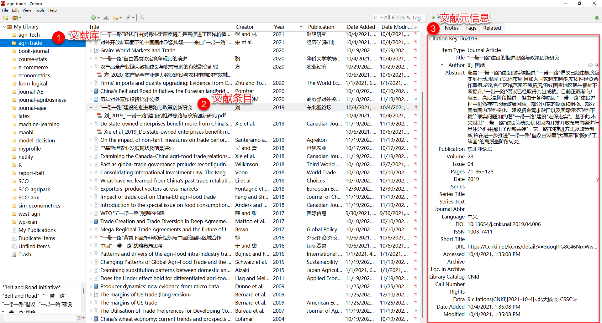
```

---

### 示例：Zotero的文献管理和使用2

```{r, out.height=450}
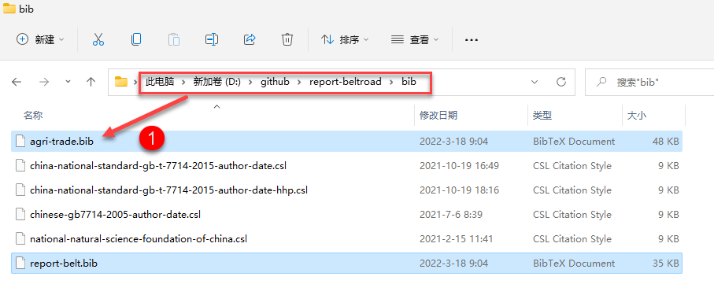
```

---

### 示例：Zotero的文献管理和使用3

```{r, out.height=550}
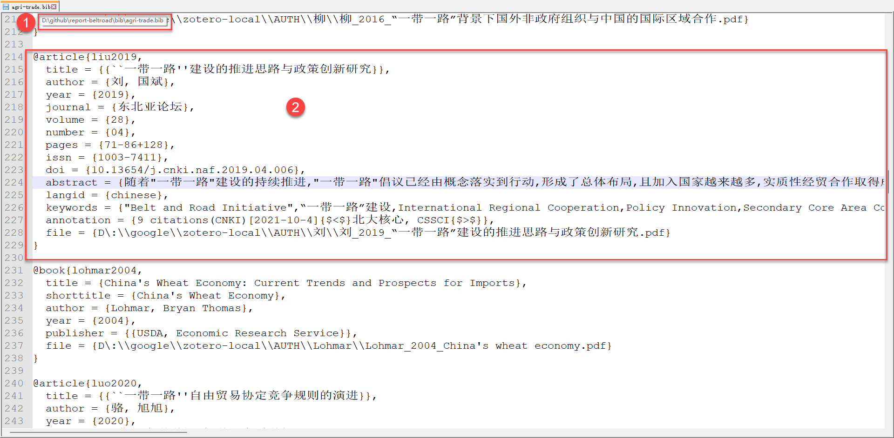
```


---

### 示例：Zotero的文献管理和使用4

```{r, out.height=550}
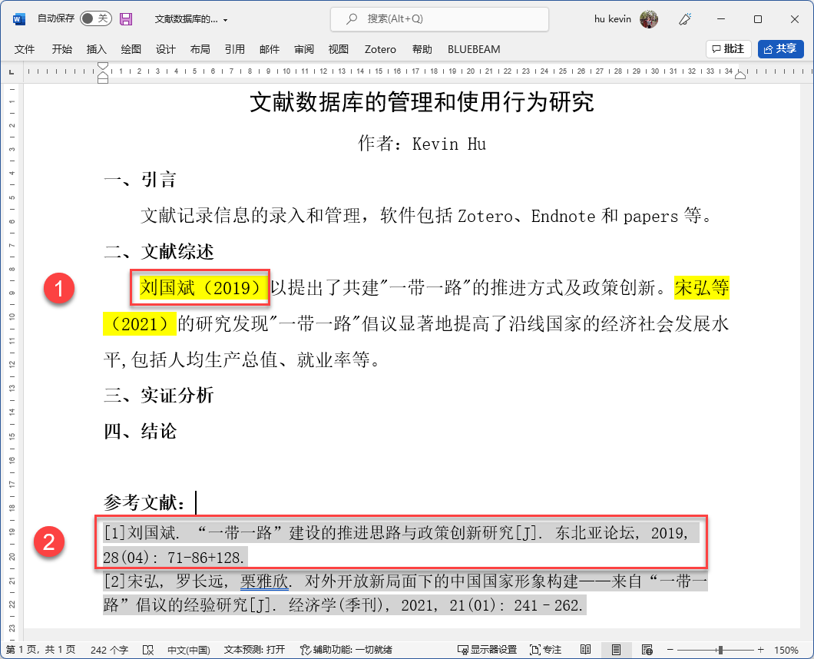
```


---

## E.痕迹数据的数据库化（简要）

**痕迹数据**的数据库化，无论是Map-Reduce的产出，还是网页爬取的数据的整理、清理时的产出，都是**基于变量**的数据，还没有把变量数据串起来，变成**基于样本**的数据。

样本在变量上的变异是分析工作的基础，数据库化需要做的工作就是把变量数据串起来，变成类似于样本数据的数据。串起来的方法很多，技术性也很强，基本上依靠**脚本**来完成。

如果从大数据中抽取数据，由于无需数据录入，故数据库化只有两个步骤可做：

1. **编码**。通常原有的数据就已经有编码了，这个手续要做的就是要么确认使用原来的编码，要么呢，因为特殊的原因，需要重新编码，何去何从，完全取决于计算的需要。

2. **清理**。与其他调查数据的清理不同，这里主要是在确认编码以后，确认数据的可计算性，也就是格式化、结构化在转化中没有发生问题，以及是否可以直接运用于分布式并行计算或者单机计算。

---

### 示例：数据爬虫下的自动化日志记录1

```{r, out.height=300}
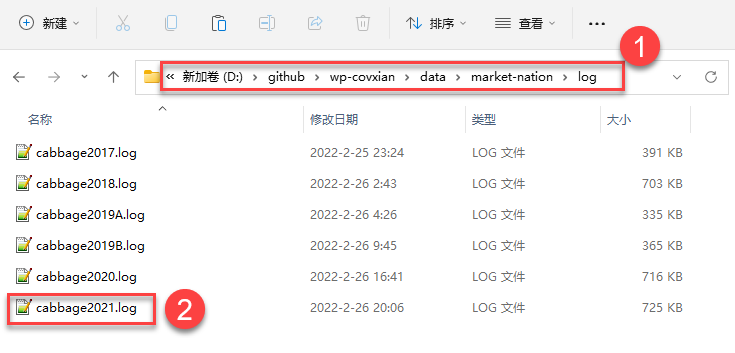
```

---

### 示例：数据爬虫下的自动化日志记录

```{r, out.height=550}
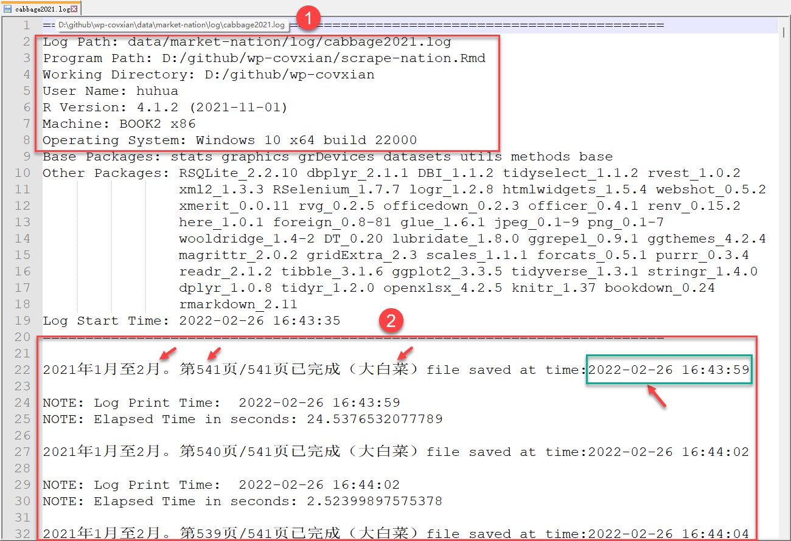
```

???

my project `D:\github\wp-covxian\data\market-nation\log`

---
name:case-proj

## 二手数据的数据库化（实例分享）


**研究议题**：**旱区农业科技资源配置情况研究**。具体**研究内容**如下：

.pull-left[

- 2.1 科技装备
    - 2.1.1 农业机械动力
    - 2.1.2 农用拖拉机
    - 2.1.3 农用灌溉机械
    - 2.1.4 农用收获机械
    - 2.1.5 农业化学要素
    
- 2.2 科技投入
    - 2.2.1 公共财政投入
    - 2.2.2 RD研发投入
]

.pull-right[

- 2.3 科技计划
    - 2.3.1 重大基础类科技计划
    - 2.3.2 国家自然科学基金
    - 2.3.3 农业综合开发投入
    
- 2.4 科技条件
    - 2.4.1 国家工程技术研究中心
    - 2.4.2 国家重点实验室
    
- 2.5 科技服务
    - 2.5.1 国家农业科技园区
    - 2.5.2 技术示范转移机构
    - 2.5.3 高技术产业和科技企业
]

---

## 资料和数据

```{r}
levels_dry <- c('北京','天津','河北','山西','内蒙古','辽宁','吉林','黑龙江','山东','河南','西藏','陕西','甘肃','青海','宁夏','新疆')
levels_province<-c('全国','北京','天津','河北','山西','内蒙古','辽宁','吉林','黑龙江','上海','江苏','浙江','安徽','福建','江西','山东','河南','湖北','湖南','广东','广西','海南','重庆','四川','贵州','云南','西藏','陕西','甘肃','青海','宁夏','新疆')
```


**研究对象**：旱区16个省份——`r str_c(levels_dry, collapse = '、')`

**文本资料**：政府公开资料、公共信息、图书、文献...

**数据资料**：统计年鉴、网页数据、商业数据库信息...


---

## 资料整理

**文件夹管理**：

1 **文献资料**文件（material）：收集到的各种相关资料（.xlsx、.word、.pdf、.html、.png等）

--

2 **粗制**的数据文件（raw data）：摘录、数值化（.xlsx）

--

3 **提取**的数据文件（extract data）：整合、合并（.xlsx）

--

4 **加工**的数据文件（process data）：更新、维护（.xlsx）

--

5 **分析**的数据文件（analysis data）：调用、子集化（.xlsx）

---

### 0. 文献资料1

.pull-left[

- 囊括了研究涉及的全部材料

- 分门别类在各个文件夹下

- 形成**目录树**

- 文件以原始状态存放

- 格式各种各样

]

.pull-right[


```{r,fig.cap="文献资料文件夹"}
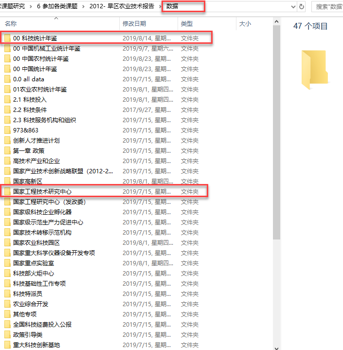
```

]

---

### 0. 文献资料1-1

.pull-left[

- 历年的《中国科技统计年鉴》

- 数据来源：[人大经济论坛](http://www.pinggu.org/bbs/index.asp)；中国知网-[统计年鉴数据库](http://nianjian.cnki.net/)

- 部分年鉴**数值化**（.xls）

- 部分年鉴仅是**数字化**（.caj）

- 每本年鉴都有**目录**

- 年鉴中仅部分内容跟研究相关

]

.pull-right[


```{r, fig.cap= "子文件夹"}
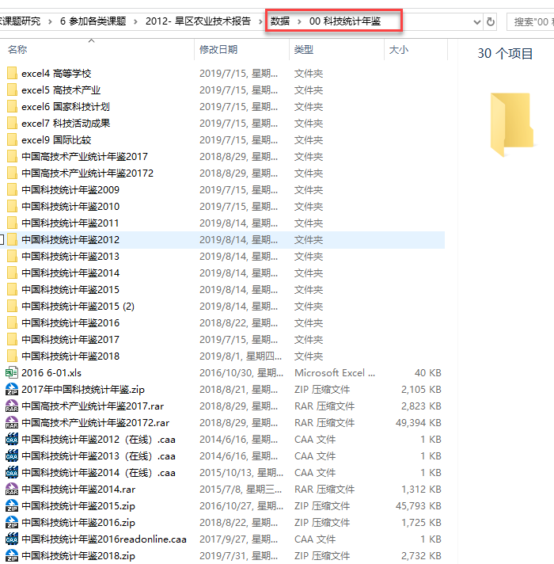
```

]

---

### 0. 文献资料1-2


.pull-left[

- 历年《国家工程技术研究中心》资料

- 数据来源：[科技部网站](http://www.most.gov.cn/mostinfo/)

- 部分资料以**年度报告**呈现（.pdf）

- 部分资料以**公开网页**呈现（.html、.doc）

- 资料发布时间不确定

- 资料非标准化，需手工收集整理


]

.pull-right[


```{r, fig.cap= "文献《国家工程技术研究中心》"}
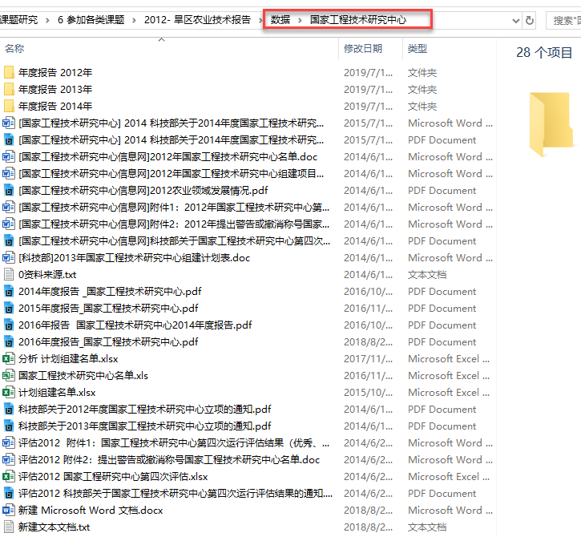
```

]

---

### 0. 文献资料1-1-1

.pull-left[

- 《中国科技统计年鉴2018》

- 数据来源：[人大经济论坛](http://www.pinggu.org/bbs/index.asp)

- 该年鉴已**数值化**（.xls）

- 年鉴统计资料依次以.xls格式呈现

- 具体文件含义可以查看**目录**

- 年鉴中仅部分.xls跟研究相关，需要提取出来

]


.pull-right[

```{r,fig.cap="文献《中国科技统计年鉴》"}
include_graphics("../pic/data-clean/data-material-dir5-file.png")
```

]


---

### 0. 文献资料1-1-1-1

.pull-left[

- 《中国科技统计年鉴2018》

- 数据来源：[人大经济论坛](http://www.pinggu.org/bbs/index.asp)

- **“表1-7 2017年中国RD支出类型”**

- 原始表格有**各种“烦人状况”**!
    
    - 看**行**：空行？字符有空格？意外字符？
    - 看**列**：列变量？中英文？跨多行？
    - 看**单元格**：数值（number）还是文字（character）？

]


.pull-right[

```{r, fig.cap= "文献-中国科技统计年鉴2018<br>-表1-7 RD支出类型"}
include_graphics("../pic/data-clean/data-material-dir6-file-excel.png")
```

]


---

### A. 粗制数据（raw data）1

.pull-left[

- 《中国科技统计年鉴2010-2018》

- 数据来源：[人大经济论坛](http://www.pinggu.org/bbs/index.asp)

- 各年年鉴**整合**

- 不按**年份**，而按**内容**来管理文件夹

- 文件夹命名坚持用**英文**！


]


.pull-right[

```{r, fig.cap= "重新整理后的科技统计年鉴文件夹"}
include_graphics("../pic/data-clean/data-raw-dir1-children2.png")
```

]

---

### A. 粗制数据（raw data）2

.pull-left[

- 《中国科技统计年鉴2010-2018》

- 数据来源：[人大经济论坛](http://www.pinggu.org/bbs/index.asp)

- **表 中国RD支出类型”**（.xls）

- 取你所需！

    - 每年的表格来自每年的**年鉴**
    - 每年的表格**单独命名**
    - 文件命名要有**规则**
    - 确保每个文件的行列数据**保持一致**！

]


.pull-right[

```{r, fig.cap= "历年的RD支出类型（2010-2017）"}
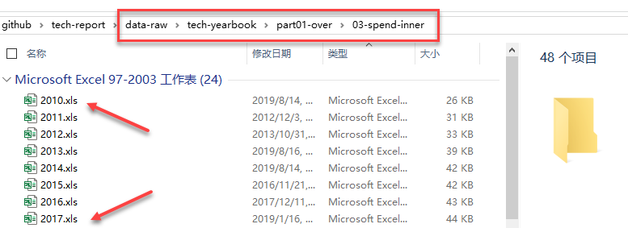
```

]


---

### B. 精制数据（extract data）1

.pull-left[

- 《中国科技统计年鉴2010-2018》

- **表 RD支出类型（2010-2017）**

- 数据来源：[人大经济论坛](http://www.pinggu.org/bbs/index.asp)

- 依次读取整合每一年的**表 中国RD支出类型.xls”**

    - 统一**变量命名**
    - 分别写入**年份**信息
    - **行合并**年度文件数据
    - 确保数据是**正确读取**的！

]


.pull-right[

```{r, fig.cap= "提取整合后的RD支出类型（2010-2017）"}
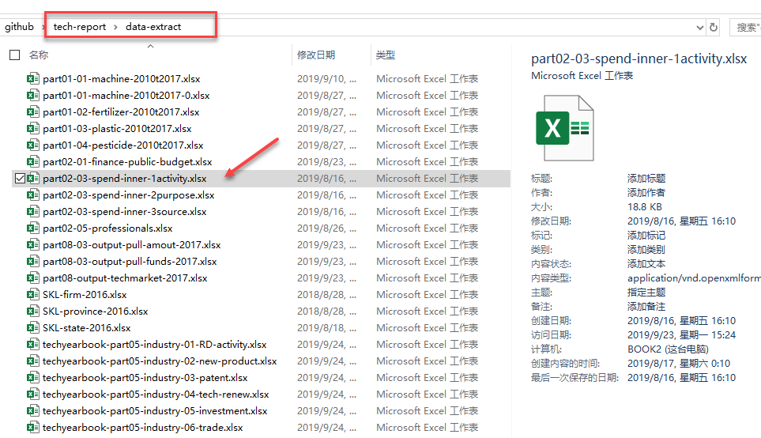
```

]

---

### B. 精制数据（extract data）2

.pull-left[

- 《中国科技统计年鉴2010-2018》

- **表 RD支出类型（2010-2017）**

- 数据来源：[人大经济论坛](http://www.pinggu.org/bbs/index.asp)

- 基本保持原来的数据形态：

    - 看**行**(257行)：无空行、地区字符正确标准
    - 看**列**：列变量统一命名
    - 看**单元格**：全部是数值（number）

]


.pull-right[

```{r, fig.cap= "提取整合后的RD支出类型（2010-2017）"}
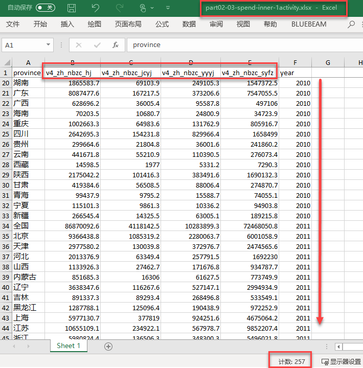
```

]


---

### C. 加工数据（process data）1

.pull-left[

- 《中国科技统计年鉴2010-2018》

- **表 RD支出类型（2010-2017）**

- 数据来源：[人大经济论坛](http://www.pinggu.org/bbs/index.asp)

- 需要继续对数据形态加工变形

- 目标是**标准化**的数据集！！？

]


.pull-right[

```{r, fig.cap= "加工变形后的RD支出类型<br>（2010-2017）"}
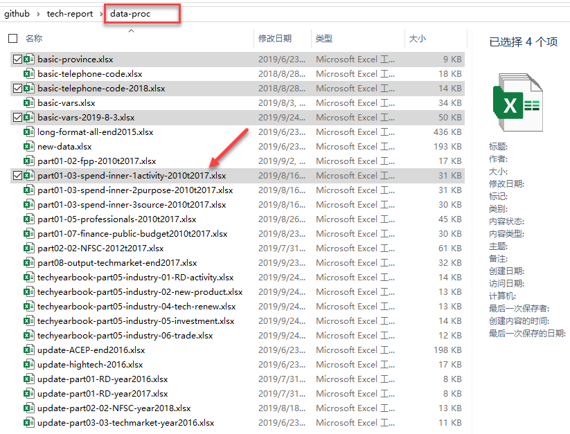
```

]

---

### C. 加工数据（process data）2

.pull-left[

- 《中国科技统计年鉴2010-2018》

- **表 RD支出类型（2010-2017）**

- 数据来源：[人大经济论坛](http://www.pinggu.org/bbs/index.asp)

- 这是一份**标准化**的数据集！！！
  - 看**行**(1025行)：按年度(year)、按省份(province)
  - 看**列**：4个**变量**被折叠对方为1列(variables)！
  - 看**单元格**：全部**数值**被折叠对方为1列(value)！

]


.pull-right[

```{r, fig.cap= "加工变形后的RD支出类型（2010-2017）"}
include_graphics("../pic/data-clean/data-proc-dir2-excel.png")
```

]

---

### D. 分析数据（analysis data）1

.pull-left[

- 《中国科技统计年鉴2010-2018》

- **完整的RD数据集**(part01-over-2010t2017.xlsx)

- 数据来源：[人大经济论坛](http://www.pinggu.org/bbs/index.asp)

- 每一个数据子集被加工完成后，需要继续进行整合

- 目标是一个**标准化**的完整数据集！！？

]


.pull-right[

```{r, fig.cap= "聚合各个子数据集为一个完整RD数据集（2010-2017）"}
include_graphics("../pic/data-clean/data-analysis-dir1-whole.png")
```

]

---

### D. 分析数据（analysis data）2

.pull-left[

- 《中国科技统计年鉴2010-2018》

- **完整的RD数据集**(part01-over-2010t2017.xlsx)

- 数据来源：[人大经济论坛](http://www.pinggu.org/bbs/index.asp)

- 这是一份**完整的**、**标准化**的数据集！！！
    - 看**行**(3329行)：按年度(year)、按省份(province)
    - 看**列**：全部**变量**被折叠对方为1列(variables)！
    - 看**单元格**：全部**数值**被折叠对方为1列(value)！

]


.pull-right[

```{r, fig.cap= "聚合各个子数据集为一个完整RD数据集（2010-2017）"}
include_graphics("../pic/data-clean/data-analysis-dir2-excel.png",dpi = 150)
```

]

---

### 数据和变量关联与管理


```{r, fig.cap="变量命名是一门学问！"}
include_graphics("../pic/data-clean/basic-variables.png",dpi = 150)
```

---

### 数据和变量关联与管理

```{r}
# source R script
source("../R/get.vars.R")

# read vars set
dir_variables <- "../data/basic-vars-2019-8-3.xlsx"
basic_vars <- read.xlsx(dir_variables) %>%
    mutate(variables= str_c(block1, block2, block3, block4, sep = "_"))

block <- list(block1="科技", block2 ="综合", 
               block3 =c( "内部支出"), 
               block4 = c("合计", "基础研究", "应用研究", "试验发展"))
# get variable names
names_var <- get.vars(data = basic_vars, block = block, what = "variables")
names_chn <- get.vars(data = basic_vars, block = block, what = "short_chn")
names_eng <- get.vars(data = basic_vars, block = block, what = "short_eng")

```


- 原始文件没有变量？

- 变量形式与其含义？

    - **唯一识别变量名**(variable)：`r str_c(names_var, collapse='、')`
    - **中文变量名**(short_chn)：`r str_c(names_chn, collapse='、')`
    - **英文变量名**(short_eng)：`r str_c(names_eng, collapse='、')`

- 变量命名如何动态调整？
    - 备注变量系统的**版本号**(flag)：`r basic_vars %>% select(flag) %>% distinct(flag) %>% extract2("flag") %>%str_c(collapse = '、')`


---
layout:false
background-image: url("../pic/thank-you-gif-funny-gentle.gif")
class: inverse,center
# 本节结束
