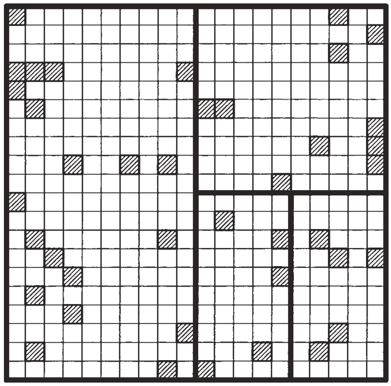
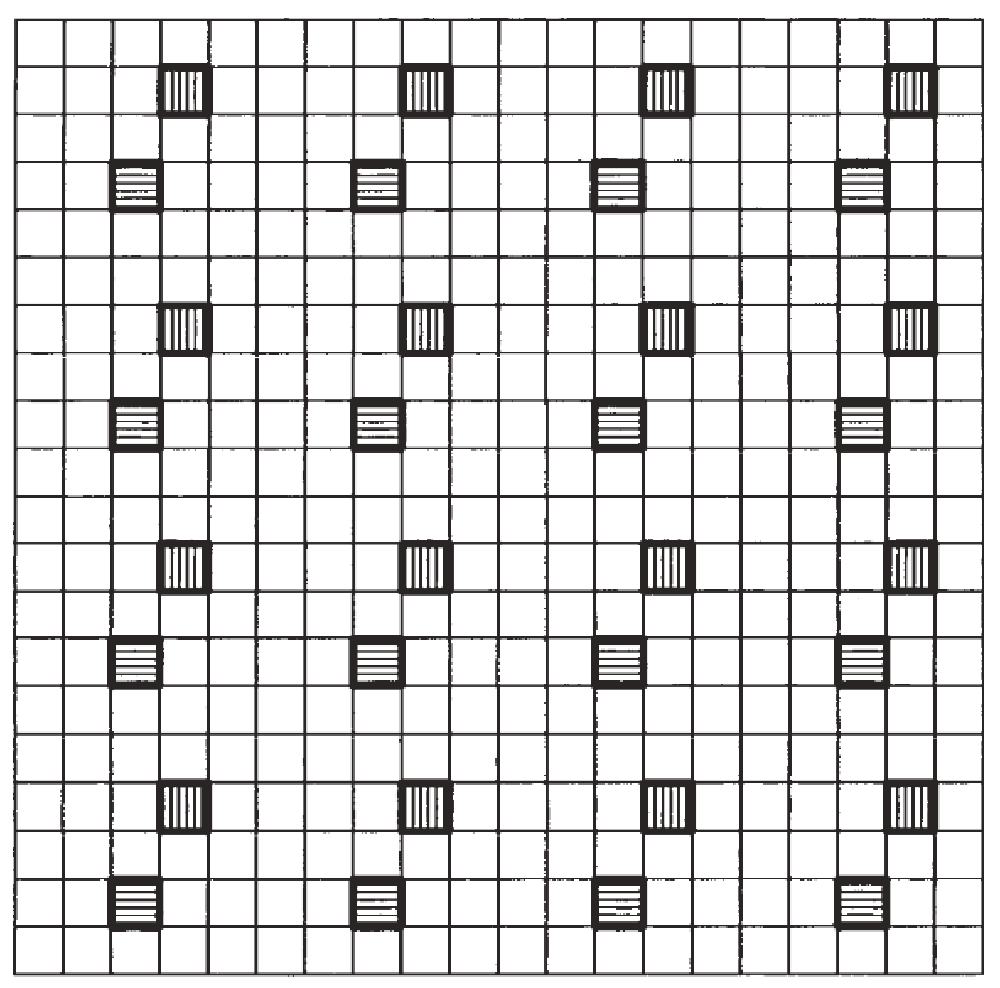
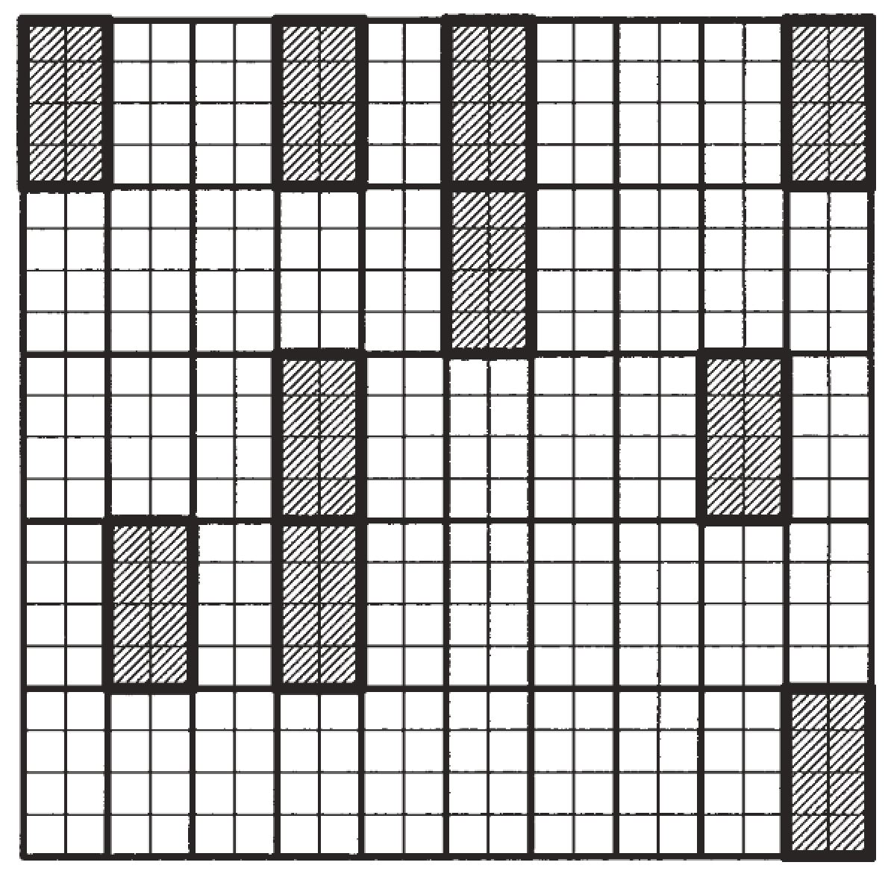
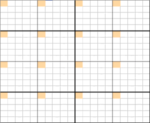
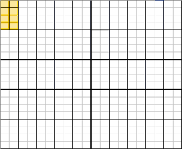
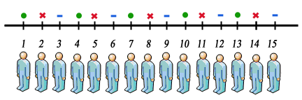
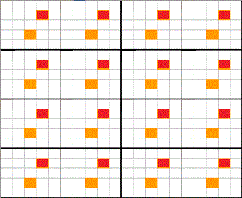
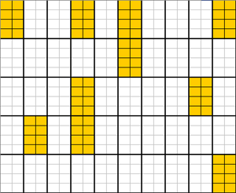
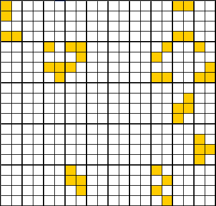
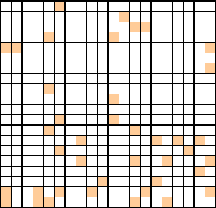

---
params:
  hideslide: FALSE
output:
  xaringan::moon_reader:
    seal: false
    lib_dir: libs
    css:
      - default
      - ../mycss/my-theme.css 
      - ../mycss/my-font.css
      - ../mycss/my-custom-for-video-roomy.css
      - ../mycss/text-box.css
      - duke-blue
      - hygge-duke
    nature:
      highlightStyle: github
      highlightLines: true
      countIncrementalSlides: false
      ratio: "16:9"
---
background-image: url("../pic/slide-front-page.jpg")
class: center,middle
exclude: `r params$hideslide`

# 统计学原理(Statistic)

<!---    chakra: libs/remark-latest.min.js --->

### 胡华平

### 西北农林科技大学

### 经济管理学院数量经济教研室

### huhuaping01@hotmail.com

### `r Sys.Date()`

```{r , echo=F,message=FALSE,warning=F}
source("../R/set-global.R")
options(width = 70)
#source("../R/xaringan-chromote-print.R")
```


```{r }
source("../R/external-math-equation.R")
```


```{r , echo=FALSE}
require('xaringanExtra')

xaringanExtra::use_tachyons()

xaringanExtra::use_panelset()

xaringanExtra::use_logo(
  image_url = "../pic/logo/nwafu-logo-circle-wb.png",
  height = '70px',
  position = xaringanExtra::css_position(top='0.2em',left="1em")
)
```

---
class: center, middle, duke-orange,hide_logo
name: chapter02
exclude: `r params$hideslide`

# 第二章 数据收集、整理和清洗

.pull-left[

### [2.1 数据目标](#target)

### [2.2 数据收集](#collection)

### [2.3 资料整理和数据清洗](#tidy)

### [2.4 数据的数据库化](#database)

]

.pull-right[

### .[2.5 数据质量](#quality)

### [2.6 抽样设计](#sampling)

### white[[2.7 抽样分布和抽样误差](#error)]

### [2.8 问卷设计技术](#question)

]


---
layout: false
class: center, middle, duke-softblue,hide_logo
name: error

# 2.7 抽样分布和抽样误差

### [离散和连续随机变量](#random)

### [总体和样本特征](#portraits)

### [抽样误差计算](#calc)

---
layout: true

<div class="my-header-h2"></div>

<div class="watermark1"></div>

<div class="watermark2"></div>

<div class="watermark3"></div>

<div class="my-footer"><span>huhuaping@  &emsp;&emsp; <a href="#chapter02"> 第02章 数据收集、整理和清洗 </a>
&emsp;&emsp;&emsp;&emsp;&emsp;&emsp;&emsp;&emsp;&emsp;&emsp;&emsp;&emsp;&emsp;&emsp;&emsp;&emsp;&emsp;&emsp;&emsp;&emsp;&emsp;
<a href="#error"> 2.7 抽样分布和抽样误差 </a> </span></div> 

---
name:random

## 离散随机变量：离散事件

六点骰子的样本空间（sample space）为：
$\{1,2,3,4,5,6\}$ ，随机摇一次骰子结果可能是：

```{r, echo = T, eval = T} 
sample(1:6, 1) 
```

```{r pdist, echo=FALSE, purl=FALSE}
pdfdata <- rbind("骰子结果"=as.character(1:6), "概率"=c("1/6","1/6","1/6","1/6","1/6","1/6"), "累积概率"=c("1/6","2/6","3/6","4/6","5/6","1"))

knitr::kable(pdfdata, caption = "打六点骰子的PDF和CDF")
```


---

## 离散随机变量：概率分布

.pull-left[

```{r, out.height='500px'} 
# generate the vector of probabilities 
probability <- rep(1/6, 6) 

# plot the probabilities 
plot(probability,
     xlab = "骰子结果",
     ylab = "概率p",
     main = "六点骰子的概率分布pd") 
``` 

]

.pull-right[

```{r, out.height='500px'} 
# generate the vector of cumulative probabilities 
cum_probability <- cumsum(probability) 

# plot the probabilites 
plot(cum_probability, 
     xlab = "骰子结果",
     ylab = "概率p",
     main = "六点骰子的累积概率分布") 
```

]

---

## 离散随机变量：伯努利事件（概率分布）

抛硬币事件
$k$有两种可能结果：
$H$ （头像）和
$T$ （花案）。我们随机抛一次硬币的结果可能是：

```{r, echo = T} 
sample(c("H", "T"), 1) 
```


对于连续
$n$次抛硬币，事件
$k$ 服从伯努利 
$k \sim B(n,p)$ 分布，其概率为：

$$f(k)=P(k)=\begin{pmatrix}n\\ k \end{pmatrix} \cdot p^k \cdot
(1-p)^{n-k}=\frac{n!}{k!(n-k)!} \cdot p^k \cdot (1-p)^{n-k}$$

---

## 离散随机变量：伯努利事件（概率分布）

.pull-left[

例如，连续抛10次硬币且其中5次为头像朝上的伯努利概率记为
$P(k=5\vert n = 10, p = 0.5)$，具体计算R函数及其结果为：


```{r, echo = T} 
p_k5 <- dbinom(x = 5,size = 10, prob = 0.5) 
p_k5
```


连续抛10次硬币（
$n=10$）且其中5次为头像朝上（
$k=5$）的伯努利事件（
$p=0.5$）出现的概率为`r scales::percent(p_k5,accuracy = 0.01)`。

]

.pull-right[

例如，连续抛10次硬币且其中头像朝上次数在
$4 \sim 7$次之间的伯努利概率记为
$P(4 \leq k \leq 7) = P(k \leq 7) - P(k\leq3 )$，具体计算R函数及其结果为：

```{r, echo=T}
p_k47 <- pbinom(size = 10, prob = 0.5, q = 7) - pbinom(size = 10, prob = 0.5, q = 3) 
p_k47
```

连续抛10次硬币（
$n=10$）且其中头像朝上次数（
$4 \le k \le 7$）的伯努利事件（
$p=0.5$）出现的概率为`r scales::percent(p_k47,accuracy = 0.01)`。

]


---

## 离散随机变量：伯努利事件（概率分布）

.pull-left[

```{r, out.height='500px'}
# set up vector of possible outcomes
k <- 0:10
# assign the probabilities
p_k0_t_10 <- dbinom(x = k, size = 10, prob = 0.5)

plot(x = k, 
     y = p_k0_t_10,
     ylab= '概率p',
     xlab = '头像朝上出现次数k',
     main = "不同头像朝上出现次数的概率(n=10)") 

```

]


.pull-right[

```{r, out.height='500px'} 
# compute cumulative probabilities
prob <- pbinom(q = k, 
               size = 10, 
               prob = 0.5)

# plot the cumulative probabilities
plot(x = k, 
     y = prob,
     ylab= '概率p',
     xlab = '头像朝上出现次数k',
     main = "头像朝上出现次数的累积概率(n=10)") 
```

]

---

## 连续随机变量：概率、期望和方差

对于一个连续分布事件
$X$，给定其概率密度函数（PDF）为
$f_X(x)$，那么：

- 其累积概率密度函数（CDF）：
$P(a \leq X \leq b) = \int_a^b f_X(x) \mathrm{d}x$

- 而且有完全概率密度为：
$P(-\infty \leq X \leq \infty) = \int_{-\infty}^{\infty} f_X(x) \mathrm{d}x = 1$。

- 进一步，其期望为：
$E(X) =  \mu_X = \int X f_X(x) \mathrm{d}x$。

- 其方差为：
$\text{Var}(X) =  \sigma_X^2 = \int (X - \mu_X)^2 f_X(x) \mathrm{d}x$

---

## 连续随机变量：正态分布（PDF、CDF）

一个变量
$X$若服从正态分布，则由两个参数来确定，一个是期望
$\mu$，另一个是方差 
$\sigma^2$，并记为：
$Y \sim \mathcal{N}(\mu,\sigma^2)$。正态分布的分布密度函数（PDF）的理论表达式为：

$$\begin{align}
f(X) = \frac{1}{\sqrt{2 \pi} \sigma} \exp{[-(X - \mu)^2/(2 \sigma^2)]}.
\end{align}$$

其中，标准正态分布属于一种特殊形式的正态分布，其期望为0，方差为1，一般记为：
$X \sim Z(0,1)$，其概率密度函数（PDF）一般记为
$\phi$，其累积概率密度函数（CDF）一般记为
$\Phi$，也即有：

$$ \phi(c) = \Phi'(c) \ \ , \ \ \Phi(c) = P(Z \leq c) \ \ , \ \ Z \sim \mathcal{N}(0,1).$$ 
而且还有：若
$Y \sim \mathcal{N}(\mu, \sigma^2)$，则
$Y^{\ast} = \frac{Y -\mu}{\sigma} \sim {Z}(0,1)$。


---

## 连续随机变量：正态分布（PDF、CDF）

.pull-left[

```{r, out.height='500px'} 
# draw a plot of the N(0,1) PDF
curve(dnorm(x),
      xlim = c(-3.5, 3.5),
      ylab= '概率p',
      xlab = 'X',
      main = "标准正态分布的PDF") 
```

]

.pull-right[

```{r, out.height='500px'}
# plot the standard normal CDF
curve(pnorm(x), 
      xlim = c(-3.5, 3.5), 
      ylab= '概率p',
      xlab = 'X',
      main = "标准正态分布的CDF")
```

]


---

## 连续随机变量：正态分布（二元联合正态）

```{r,eval=FALSE}
url_plotly<-"https://plot.ly/~mca_unidue/22.embed?width=550&height=550?showlink=false" 

knitr::include_url(url_plotly, height = "530px")
```

```{r}
knitr::include_graphics("../pic/chpt02-bi-normal-statpng.png", dpi=150)
```


---

layout: false

<center>
<iframe height="880" width="770" frameborder="0" scrolling="0" src="bivariatenormalv4.html"></iframe>
</center>

???
联合正态分布的特性：
$E(Y\vert X) = E(Y) + \rho \frac{\sigma_Y}{\sigma_X} (X - E(X)).$

---
layout: true

<div class="my-header-h2"></div>

<div class="watermark1"></div>

<div class="watermark2"></div>

<div class="watermark3"></div>

<div class="my-footer"><span>huhuaping@  &emsp;&emsp; <a href="#chapter02"> 第02章 数据收集、整理和清洗 </a>
&emsp;&emsp;&emsp;&emsp;&emsp;&emsp;&emsp;&emsp;&emsp;&emsp;&emsp;&emsp;&emsp;&emsp;&emsp;&emsp;&emsp;&emsp;&emsp;&emsp;&emsp;
<a href="#error"> 2.4 抽样分布和抽样误差 </a> </span></div> 

---

## 连续随机变量：卡方分布（PDF、CDF）

$$\begin{align}
if, \ \ & Z_m \overset{i.i.d.}{\sim} \mathcal{N}(0,1) \\
then, \ \ & Z_1^2 + \dots + Z_M^2 = \sum_{m=1}^M Z_m^2 \sim \chi^2(M) \ \ 
\end{align}$$


---

## 连续随机变量：卡方分布（PDF、CDF）


```{r, out.height= '550px'} 
# plot the PDF
curve(dchisq(x, df = 3), 
      xlim = c(0, 10), 
      ylim = c(0, 1), 
      col = "blue",
      ylab = "p",
      main = "卡方分布的PDF和CDF（M = 3）")

# add the CDF to the plot
curve(pchisq(x, df = 3), 
      xlim = c(0, 10), 
      add = TRUE, 
      col = "red")

# add a legend to the plot
legend("topleft", 
       c("PDF", "CDF"), 
       col = c("blue", "red"), 
       lty = c(1, 1))
```

---

## 连续随机变量：卡方分布（PDF、CDF）

```{r, out.height='550px'} 
# plot the density for M=1
curve(dchisq(x, df = 1), 
      xlim = c(0, 15), 
      xlab = "x", 
      ylab = "p", 
      main = "不同自由度df下卡方分布的概率密度函数")

# add densities for M=2,...,7 to the plot using a 'for()' loop 
for (M in 2:7) {
  curve(dchisq(x, df = M),
        xlim = c(0, 15), 
        add = T, 
        col = M)
}

# add a legend
legend("topright", 
       as.character(1:7), 
       col = 1:7 , 
       lty = 1, 
       title = "自由度df")
```

---

## 连续随机变量：t分布（PDF、CDF）

假定随机变量
$Z \sim \mathcal{N}(0,1)$服从标准正态分布，随机变量
$W \sim \chi^2(m)$卡方分布，而且二者互相独立，那么可以构造出一个如下的新随机变量
$T$，它将服从t分布：

$$T= \frac{Z}{\sqrt{W/m}} \sim t(m) $$

---

## 连续随机变量：t分布（PDF、CDF）

```{r, out.height='550px'} 
# plot the standard normal density
curve(dnorm(x), 
      xlim = c(-4, 4), 
      xlab = "x", 
      lty = 2, 
      ylab = "p", 
      main = "不同自由度下t分布的概率密度")

# plot the t density for M=2
curve(dt(x, df = 2), 
      xlim = c(-4, 4), 
      col = 2, 
      add = T)

# plot the t density for M=4
curve(dt(x, df = 4), 
      xlim = c(-4, 4), 
      col = 3, 
      add = T)

# plot the t density for M=25
curve(dt(x, df = 25), 
      xlim = c(-4, 4), 
      col = 4, 
      add = T)

# add a legend
legend("topright", 
       c("N(0, 1)", "m=2", "m=4", "m=25"), 
       col = 1:4, 
       lty = c(2, 1, 1, 1))
```

---
name:portraits

## 总体的特征：总体期望和总体方差

随机变量
$Y$有6种可能取值
$\{ 1,2,3,4,5,6\}$，那么每种可能取值的概率分别为：

```{r}
pdfdata <- rbind("事件Y_i"=as.character(1:6), "概率p"=c("1/6","1/6","1/6","1/6","1/6","1/6"), "累积概率"=c("1/6","2/6","3/6","4/6","5/6","1"))

exp_y <- mean(1:6)
var_y <- (sd(1:6))^2*10/9
pdfdata %>%
  head(2) %>%
  knitr::kable()
```

总体期望
$\mu_Y$和总体方差
$\sigma^2_Y$：

$$\begin{align}
E(Y) & \equiv \mu_Y= \sum_1^6{(Y_i\cdot p(Y_i))} = \frac{1}{6}\sum_1^6{Y_i} = \frac{1}{6} \times 21 = `r formatC(exp_y, 2, format='f')` \\
Var(Y)& \equiv \sigma^2_Y= E\left(Y_i - E(Y)\right)^2=E\left(Y_i - \mu \right)^2 
= \sum_1^6{\left((Y_i-\mu)p(Y_i)\right)}\\
& = \frac{1}{6}\left[(1-3.5)^2+ (2-3.5)^2+ \cdots + (6-3.5)^2\right] \\
& = `r formatC(var_y, 2, format='f')`
\end{align}$$

---

## 样本的特征：样本均值和样本方差

```{r}
set.seed(8321)
demo <- sample(1:6, 8, replace = T)

bar_y <- mean(demo)
s2_y <- (sd(demo))^2

```
从上述总体中**有放回**地随机抽选8次，得到1份样本容量
$n=8$的如下样本数据：

```{r}
demo
```

样本均值
$\bar{y}$和样本方差
$s^2_y$分别表达并计算为：


$$\begin{align}
\bar{y} &=\frac{1}{n} \sum_{i=1}^{n} y_{i} 
= \frac{1}{8}\left[5+1+\cdots +3 \right] 
= `r formatC(bar_y, 3, format='f')` \\
s^{2}_y &=\frac{\sum_{i=1}^{n}\left(y_{i}-\bar{y}\right)^{2}}{n-1} \\
&= \frac{1}{8-1} \times \left[(5- 4.125)^2 + (1-4.125)^2 + \cdots + (3-4.125)^2\right] \\
& = `r formatC(s2_y, 4, format='f')`
\end{align}$$

---

## 样本的特征：样本均值和样本方差

因此，我们可以不断从前述总体
$Y \in \{1,2,3,4,5,6\}$中进行有放回的随机抽样。下表展示了10份随机样本
$y$，每份样本的容量都相同
$n=8$。每份样本的均值
$\bar{y}$见列`bar_y`，样本方差
$s^2_y$见列`s2_y`。

```{r}
set.seed(7321)

demo_more <- tibble(sample =1:10) %>%
  mutate(y = map(sample, .f = function(x){sample(1:6, 8, replace = T)})) %>%
  mutate(bar_y = map_dbl(y, mean),
         s2_y = map_dbl(y, .f = function(x){(sd(x))^2})) %>%
  janitor::adorn_totals()

demo_more %>%
  datatable(options = list(dom = "tip", pageLength =  6)) %>%
  formatRound(3:4, c(2, 4))
```

---

## 总体和样本特征的关系

根据**中心极限定理**和**大数定理**，我们可以推导得到总体与样本特征的如下关系：

$$\begin{align}
E(\bar{y}) &= \mu_Y  \tag{eq.1} \\
Var(\bar{y}) & = \frac{\sigma^2_Y}{n} \tag{eq.2} \\
E\left(Var(\bar{y}) \right) &= \widehat{Var}(\bar{y}) \equiv \frac{s^2}{n} \tag{eq.3}
\end{align}$$

其中，
$s^2 =\frac{\sum_1^n{(y_i - \bar{y})^2}}{n-1}$表示随机样本的样本标准差。以上方程蕴含着如下结论：

- 方程1表明：随机变量
$\bar{y}$的**期望**是随机变量
$Y$的**期望**的**无偏估计量**（unbiased estimator）。

- 方程2表明：随机变量
$\bar{y}$的**方差**与随机变量
$Y$的**方差**存在以上关系。

- 方程3表明：随机变量
$\bar{y}$的**方差**的无偏估计量可以通过样本数据计算得到，其结果为
$\widehat{Var}(\bar{y}) \equiv \frac{s^2}{n}$。

---

## 抽样分布：骰子游戏

**随机样本（random sampling）**是从总体中随机抽取个体的集合。

六点骰子的可能结果为
$\{1,2,3,4,5,6\}$，如果随机投掷2次，可以得到2次结果的数值加总：

```{r, echo=T}
set.seed(520)
toll_2 <- sample(1:6, 2, replace = T)
toll_2
sum(toll_2)
```

---

## 抽样分布：骰子游戏

.pull-left[

随机投掷2次的所有可能结果共有
$6^2=36$种可能：

$$\begin{align*}
  &(1,1)	(1,2)	(1,3)	(1,4)	(1,5)	(1,6) \\ 
  &(2,1)	(2,2)	(2,3)	(2,4)	(2,5)	(2,6) \\ 
  &(3,1)	(3,2)	(3,3)	(3,4)	(3,5)	(3,6) \\ 
  &(4,1)	(4,2)	(4,3)	(4,4)	(4,5)	(4,6) \\ 
  &(5,1)	(5,2)	(5,3)	(5,4)	(5,5)	(5,6) \\ 
  &(6,1)	(6,2)	(6,3)	(6,4)	(6,5)	(6,6)
\end{align*}$$

]

.pull-right[

以上的全部组合，共有11种加总结果
$S = \left\{2,3,4,5,6,7,8,9,10,11,12 \right\}$，每种加总结果的概率分别是：


$$\begin{align}
  P(S) = 
  \begin{cases} 
    1/36, \ & S = 2 \\ 
    2/36, \ & S = 3 \\
    3/36, \ & S = 4 \\
    4/36, \ & S = 5 \\
    5/36, \ & S = 6 \\
    6/36, \ & S = 7 \\
    5/36, \ & S = 8 \\
    4/36, \ & S = 9 \\
    3/36, \ & S = 10 \\
    2/36, \ & S = 11 \\
    1/36, \ & S = 12
  \end{cases}
\end{align}$$

]

---

## 抽样分布：骰子游戏

```{r, out.height='550px'}
# Vector of outcomes
S <- 2:12

# Vector of probabilities
PS <- c(1:6, 5:1) / 36

# plot the distribution of S
barplot(PS, 
        ylim = c(0, 0.2), 
        names.arg=2:12,
        xlab = "投掷2次的结果加总S", 
        ylab = "p", 
        col = "steelblue", 
        space = 0, 
        main = "投掷2次的频率分布")


```

---

## 抽样分布：骰子游戏

```{r, out.height='550px'}
# set sample size and number of samples
n <- 10
reps <- 10000

# perform random sampling
samples <- replicate(reps, rnorm(n)) # 10 x 10000 sample matrix

# compute sample means
sample.avgs <- colMeans(samples)


# Plot the density histogram
hist(sample.avgs, 
     ylim = c(0, 1.4), 
     col = "steelblue" , 
     freq = F, 
     breaks = 20,
     xlab = '抽样均值',
     main = "10000份随机样本（每份样本n=10）均值的直方图")

# overlay the theoretical distribution of sample averages on top of the histogram
curve(dnorm(x, sd = 1/sqrt(n)), 
      col = "red", 
      lwd = "2", 
      add = T)

```

---

## 抽样分布：骰子游戏

```{r, out.height='550px'}
# number of repetitions
reps <- 10000

# set degrees of freedom of a chi-Square Distribution
DF <- 3 

# sample 10000 column vectors à 3 N(0,1) R.V.S
Z <- replicate(reps, rnorm(DF)) 

# column sums of squares
X <- colSums(Z^2)

# histogram of column sums of squares
hist(X, 
     freq = F, 
     col = "steelblue", 
     breaks = 40, 
     ylab = "Density", 
     main = "10000份随机样本（每份样本n=3）平方和的直方图")

# add theoretical density
curve(dchisq(x, df = DF), 
      type = 'l', 
      lwd = 2, 
      col = "red", 
      add = T)
```

---
name:calc

## 抽样误差：均值和方差

假定随机样本
${y_1,\dots,y_n}$是独立随机抽取自正态分布总体
$Y \sim \mathcal{N}(\mu_Y,\sigma_Y^2)$，那么前述随机样本数据的均值
$\overline{y}$将服从如下正态分布：

$$\overline{y} \sim \mathcal{N}(\mu_Y, \sigma_Y^2/n) \tag{2.4} $$

其中：

$$E(\overline{y}) \equiv \mu_{\bar{y}} = E\left(\frac{1}{n} \sum_{i=1}^n y_i \right) = \frac{1}{n} E\left(\sum_{i=1}^n y_i\right) = \frac{1}{n} \sum_{i=1}^n E\left(y_i\right) = \frac{1}{n} \cdot n \cdot \mu_Y = \mu_Y$$

$$\begin{align*}
  \text{Var}(\overline{y}) 
  & \equiv \sigma^2_{\bar{y}} 
  = \text{Var}\left(\frac{1}{n} \sum_{i=1}^n y_i \right) \\
  &= \frac{1}{n^2} \sum_{i=1}^n \text{Var}(y_i) + \frac{1}{n^2} \sum_{i=1}^n \sum_{j=1, j\neq i}^n \text{cov}(y_i,y_j) 
  = \frac{\sigma^2_Y}{n}
\end{align*}$$

---

## 抽样误差：中心极限定理

> 然而，实际中我们往往并不知道总体方差
$\sigma^2_Y$。此时，上述方差公式是不能够计算的。

**有限总体中心极限定理**（The finite population Central Limit Theorem）对于随机变量
$\bar{y}$的意义在于：我们可以用样本方差
$s^2_y$来近似替代总体方差
$\sigma^2_Y$。也即：

$$\begin{align*}
  \text{Var}(\overline{y}) 
  & \equiv \sigma^2_{\bar{y}}
  =  \frac{\sigma^2_Y}{n} \\
  \widehat{Var}(\overline{y}) 
  & \equiv \hat{\sigma}_{\bar{y}}
  =  \frac{s^2_y}{n}
\end{align*}$$

---

## 抽样误差：中心极限定理

如果样本容量
$n$很小，随机变量
$\bar{y}$的可能分布会是多种多样的。**有限总体中心极限定理**表明，随着样本容量
$n$的不断增大，随机变量
$\bar{y}$的分布会越来越稳定，并趋向于**正态分布**（normal distribution），从而有：

$$\begin{align}
  \bar{y} & \sim \mathcal{N}(\mu_{\bar{y}}, \sigma^2_{\bar{y}}) \\
  \frac{\bar{y} - \mu_{\bar{y}}}{\sigma_{\bar{y}}} 
  = \frac{\bar{y} - \mu_{\bar{y}}}{\sqrt{Var({\bar{y}})}} 
  & \sim \mathcal{Z}(0,1) 
\end{align}$$


---

## 抽样误差：置信区间

如果随机变量
$\bar{y}$的总体方差
${Var}(\bar{y})$未知，则无法使用上述正态分布
$\mathcal{N}$或者标准正态
$\mathcal{Z}$分布，进行有关置信区间的样本推断。幸运的是，我们可以构造出如下服从t分布的随机变量：

$$\begin{align}
  \frac{\bar{y} - \mu_{\bar{y}}}{\hat{\sigma}_{\bar{y}}} 
  = \frac{\bar{y} - \mu_{\bar{y}}}{\sqrt{\widehat{Var}(\bar{y})}} 
  = \frac{\bar{y} - \mu_{\bar{y}}}{s_{y}/\sqrt{n}}
  & \sim t(n-1)
\end{align}$$

因此可以进一步得到参数
$\mu_{\bar{y}}$的
$1-\alpha$置信区间：

$$\begin{align}
\bar{y} - t_{1-\alpha / 2} \sqrt{\widehat{Var}(\bar{y})} 
\leq  
\mu_{\bar{y}} 
\leq 
\bar{y} + t_{1-\alpha / 2} \sqrt{\widehat{Var}(\bar{y})}
\end{align}$$


对于有放回的简单随机抽样，参数
$\mu_{\bar{y}}$的
$1-\alpha$置信区间具体为：

$$\begin{align}
\bar{y} - t_{\alpha / 2} \sqrt{\left(\frac{N-n}{N}\right)\left(\frac{s^{2}}{n}\right)}
\leq  
\mu_{\bar{y}}
\leq 
\bar{y} + t_{\alpha / 2} \sqrt{\left(\frac{N-n}{N}\right)\left(\frac{s^{2}}{n}\right)}
\end{align}$$


---

## 抽样误差：简单随机抽样

对于**无放回**的简单随机抽样方案，采用**无偏估计法**（unbiased estimator）下的均值
$\bar{y}_{\mathrm{st}}$和方差
$\widehat{\operatorname{var}}\left(\bar{y}_{\mathrm{st}}\right)$分别为：

$$\begin{align}
\hat{\mu}
&=\frac{1}{n} \sum_{i=1}^{n} {y_i} =\bar{y} \\
\widehat{\operatorname{Var}}\left(\hat{\mu}\right)
&=\frac{N-n}{N} \cdot \frac{s_y^{2}}{n}
\end{align}$$


```{block, type = 'note' , echo=T}

上述方差公式中，
$s^2_y = \frac{\sum_{i=1}^{n}{(y_i - \bar{y})^2}}{n-1}$。而
$\frac{N-n}{N}$又被称为**有限总体校正比值**（finite population correction）：

- 如果采用**有放回**的简单随机抽样，则上述方差公式需要去掉**有限总体校正比值**。

- 如果采用**无放回**的简单随机抽样，但是n相对于N非常小，则上述方差公式中**有限总体校正比值**会接近于1，因此也可以忽略。

```

???

证明过程参看：Thompson S K.  2012. Sampling[M]. 第3ed版., Wiley,Hoboken, N.J.. 第2.6节


---

exclude: true

## case：田野甲虫数量案例

```{r}
size <- c(234, 256, 128, 245,211, 240, 202,267)

set.seed(2121)
index_sample <- sample(1:100, size = 8)

beetles <- tibble(field = index_sample,
                     beetles = size)

N <- 100
n <- 8
mu <- mean(beetles$beetles)
s2 <- (sd(beetles$beetles))^2
var_mu <- (N-n)/(N*n)*s2

tao <- N*mu
var_tao <- N^2*var_mu
t_tbl <- qt(0.975, n-1)

```

---

### （示例）田野甲虫数量案例

.pull-left[

**案例说明**：为估计出一片农地中甲虫的总数。研究人员将农地细分为100个大小相等的区块。

研究者决定采用**简单随机抽样**方案，随机抽选了其中的8个区块（编号见列`field`），并分别统计出其中的甲虫数量（见列`beetles`）。最终抽样统计表见右：

]

.pull-right[

```{r}
beetles %>%
  kable(caption = "简单随机抽样结果")
```


]

---

### （示例）简单随机抽样下估计期望和方差：计算结果

根据案例，容易计算得到：全部区块数量
$N= `r N`$；抽选区块数量
$n = `r n`$。抽选区块下甲虫数量的样本方差为
$s^2_y = \frac{\sum_{i=1}^{n}{(y_i - \bar{y})^2}}{n-1}=`r formatC(s2, 2, format ='f')`$。

因此根据简单随机抽样**无偏估计法**下的计算公式，分别可以计算得到估计的均值
$\hat{\mu}$和方差
$\widehat{var}(\hat{\mu})$分别为：

$$\begin{align}
\hat{\mu}
&=\frac{1}{n} \sum_{i=1}^{n} {y_i} =\bar{y} 
=`r formatC(mu, 2, format = 'f')` \\
\widehat{\operatorname{Var}}\left(\hat{\mu}\right)
&=\frac{N-n}{N} \cdot \frac{s_y^{2}}{n} \\
& =\frac{100-8}{100} \cdot \frac{`r formatC(s2, 2, format = 'f')`}{8} 
= `r formatC(var_mu, 4, format = 'f')`
\end{align}$$

---

### （示例）简单随机抽样下估计期望和方差：计算结果

根据上述计算，给定
$\alpha = 0.05$下，平均每个区块甲虫数
$\mu_{\bar{y}}$的置信区间计算结果为：

$$\begin{align}
\hat{\mu} - t_{1-\alpha / 2} \sqrt{\widehat{Var}(\hat{\mu})} 
\leq  
& \mu_{\bar{y}} 
\leq 
\hat{\mu}  + t_{1-\alpha / 2} \sqrt{\widehat{Var}(\hat{\mu})} \\
`r formatC(mu, 2, format='f')` - `r formatC(t_tbl, 2, format='f')` \times \sqrt{`r formatC(var_mu, 4, format='f')`}
\leq
& \mu_{\bar{y}} 
\leq
`r formatC(mu, 2, format='f')` + `r formatC(t_tbl, 2, format='f')` \times \sqrt{`r formatC(var_mu, 4, format='f')`}\\
`r formatC(mu-t_tbl*sqrt(var_mu), 2, format='f')`
\leq
& \mu_{\bar{y}} 
\leq
`r formatC(mu+t_tbl*sqrt(var_mu), 2, format='f')`
\end{align}$$


> .red[**思考提问**]：全部地块的甲虫数量和置信区间是多少？


.footnote[
.red[**说明**]：此时，t查表值为
$t_{1-\alpha/2}(n-1) = t_{0.975}(8-1)= `r formatC(t_tbl, 2, format='f')`$。

]

???

---

## 必要样本数

> 不管采用哪种抽样方法，在哪一层抽样，在哪个阶段抽样，
到底要抽多少样本合适啊？

假定
$\hat{\sigma}$是参数
$\sigma$的无偏、正态估计量。则有

$$\begin{align}
\frac{\hat{\theta}-\theta}{\sqrt{\operatorname{Var}(\hat{\theta})}} & \sim \mathcal{Z}(0,1) \\
P\left(\frac{|\hat{\theta}-\theta|}{\sqrt{\operatorname{Var}(\hat{\theta})}}>\mathcal{Z}_{1-\alpha / 2}\right) & =\alpha \\
P\left(|\hat{\theta}-\theta|>\mathcal{Z}_{1-\alpha / 2} \cdot \sqrt{\operatorname{Var}(\hat{\theta})}\right) &=\alpha 
\end{align}$$

---

## 必要样本数

令
$d=|\bar{y} - \mu|$为**抽样极限误差**，则**简单随机抽样**（不放回）方案下**必要样本数**的计算公式为：

$$\begin{align}
P\left(|\bar{y}-\mu_{\bar{y}}|>\mathcal{Z}_{1-\alpha / 2} \cdot \sqrt{\frac{N-n}{N} \cdot \frac{\sigma^{2}}{n}}\right) & =\alpha \\
\mathcal{Z}_{1-\alpha / 2} \sqrt{\frac{N-n}{N} \cdot \frac{\sigma^{2}}{n}} & \equiv d \\
n &=\frac{1}{\frac{d^{2}}{\mathcal{Z}_{1-\alpha / 2}^{2} \cdot \sigma^{2}}+\frac{1}{N}}
\end{align}$$

---

### （示例）简单随机抽样方案下必要样本数的计算

```{r}
z_tbl <- qnorm(0.975,mean = 0,sd = 1)
d <- 1000
N <- 100

obs_needed <- function(N, d, z, s2){
  n <- 1/(d^2/(N^2*z^2*s2) +1/N)
}
n_needed <-  obs_needed(N =N, d =d, z = z_tbl, s2 =s2)

```


在前述甲虫数量案例中，给定
$\alpha = 0.05$下，且抽样极限误差不超过1000只，请计算简单随机抽样方案下的必要样本数？

**解答**：根据案例已知
$N=100$，抽样极限误差为
$d =1000$，给定
$\alpha = 0.05$下
$\mathcal{Z}_{1-\alpha/2}=\mathcal{Z}_{0.975}=`r formatC(z_tbl, 2, format ='f')`$。

因为我们不知道总体方差
$\sigma^2_{\bar{y}}$，但是可以使用样本方差
$s^2_{\bar{y}}=`r formatC(s2, 2, format ='f')`$进行替代

$$\begin{align}
n &=\frac{1}{\frac{d^{2}}{N^{2} \cdot \mathcal{Z}_{1-\alpha / 2}^{2} \cdot \sigma^{2}}+\frac{1}{N}} 
=\frac{1}{\frac{d^{2}}{N^{2} \cdot \mathcal{Z}_{1-\alpha / 2}^{2} \cdot s^{2}_{\bar{y}}}+\frac{1}{N}} \\
& =\frac{1}{\frac{(1000)^{2}}{(100)^{2} \cdot(1.96)^{2} \cdot 1932.70}+\frac{1}{100}}= `r formatC(n_needed, 2, format ='f')` 
\doteq `r ceiling(n_needed)`
\end{align}$$

---

## 抽样误差：分层抽样

.pull-left[

```{r, out.height= '300px'}

```

]

.pull-right[

- 分层数量：
$L=4$；各个分层的单位数：
$N_1=200, N_2=100,N_3=N_4=50$；全体单位总数
$N=\sum_{h=1}^L{N_h}=200+100+50+50=400$。

- 各个分层的抽样单位数：
$n_1=20, n_2=10,n_3=n_4=5$；全部抽样总数
$n=\sum_{h=1}^h{n_L}=20+10+5+5=40$。

]


---

## 抽样误差：分层抽样

分层抽样的均值
$\hat{\mu}_{\mathrm{st}}$和方差
$\widehat{\operatorname{Var}}\left(\hat{\mu}_{\mathrm{st}}\right)$分别为：

$$\begin{align}
\hat{\mu}_{\mathrm{st}}
&=\frac{1}{N} \sum_{h=1}^{L} N_{h} \bar{y}_{h} \\
\widehat{\operatorname{var}}\left(\hat{\mu}_{\mathrm{st}}\right)
&=\sum_{h=1}^{L}\left(\frac{N_{h}}{N}\right)^{2}\left(\frac{N_{h}-n_{h}}{N_{h}}\right) \frac{s_{h}^{2}}{n_{h}}
\end{align}$$

其中：

- 
$L$分层数量；
$N_h$表示第
$h$个分层的所有单位数，其中
$h \in \{ 1, 2, \cdots, L\}$；
$N=N_1 +N_2 + \cdots+N_L$为所有单位数。
$n_h$表示第
$h$个分层的抽样数；
$n=n_1 +n_2 + \cdots+n_L$为所有抽样单位总数。

- 各个分层的样本方差为：
$s_{h}^{2}=\frac{1}{n_{h}-1} \sum_{i=1}^{n_{h}}\left(y_{h i}-\bar{y}_{h}\right)^{2}$；
$\bar{y}_{h}$表示各个分层的样本均值。

---

exclude: true

## case：家庭观看电视时长案例

```{r, message=FALSE}
TVhour<- read_table2('../data/TVhour.txt',col_names = T,
                     col_types = cols(Hour=col_double())) %>%
  mutate(Stratification = mgsub::mgsub(Area, 1:3, c("Town A", "Town B", "Rural Area C"))) 

Nh <- c(155, 62, 93)
N <- sum(Nh)

smry_df <- TVhour %>%
  select(-Area) %>%
  group_by(Stratification) %>%
  nest() %>%
  mutate(n_h = map_dbl(data, nrow),
         mean_h =map_dbl(data, .f = function(x){mean(x$Hour)}),
         sd_h = map_dbl(data, .f = function(x){sd(x$Hour)})) %>%
  rename( "sampling"="data") %>%
  add_column(N_h = Nh, .before = "mean_h") %>%
  ungroup() %>%
  mutate(var_p1 = (N_h/N)^2,
         var_p2 = (N_h - n_h)/N_h,
         var_p3 = sd_h^2/n_h,
         var_all = var_p1*var_p2 *var_p3,
         mean_all = N_h*mean_h)
  
var_st <- sum(smry_df$var_all)
y_st <- sum(smry_df$mean_all)/N

```

---

### （示例）家庭观看电视时长案例

**案例说明**：一家广告公司为了有针对性地在某个县投放电视广告，公司决定进行抽样调查，以估计该县家庭每周观看电视的平均小时数。该县有两个镇区A和镇区B，还有农村区域C。A区建在一家工厂周围，大多数家庭都有带学龄儿童的工厂工人。B区主要是退休人员，C区主要是农民。A区有155户，B区有62户，C区有93户。公司决定从A区抽选20户，B区抽选8户，C区抽选12户。具体抽样结果如下：

```{r}
# show sampling data
smry_df %>%
  select(1:4) %>%
  kable()
```

---

### （示例）分层抽样下的抽样误差：计算结果

各分层的计算表如下：

```{r TV_calc}
# show sampling data
smry_df %>%
  select(-sampling) %>%
  datatable(options = list(dom = 't', pageLength =3,
                           scrollX =T)) %>%
  formatRound(4:10,2)
  
```

根据该分层抽样，估计的总体均值（该县住户平均收看电视时间）结果为：

$$\begin{aligned}
\hat{\mu}_{s t} &=\frac{1}{N}\left(N_{1} \bar{y}_{1}+N_{2} \bar{y}_{2}+N_{3} \bar{y}_{3}\right) \\
&=\frac{1}{155+62+93}[(155 \times 33.9)+(62 \times 25.12)+(93 \times 19.0)] \\
&=27.7
\end{aligned}$$

---

### （示例）分层抽样下的抽样误差：计算结果

各分层的计算表如下：

```{r, ref.label='TV_calc'}

```


根据该分层抽样，上述关于的总体均值估计（住户平均收看电视时间）的方差为：

$$\begin{align}
\widehat{Var} \left(\hat{\mu}_{s t}\right) 
=\sum_{h=1}^{3}\left(\frac{N_{h}}{N}\right)^{2}\left(\frac{N_{h}-n_{h}}{N_{h}}\right) \frac{s_{h}^{2}}{n_{h}}
=\frac{1}{(310)^{2}}\left[\left((155)^{2} \cdot \frac{(155-20)}{155} \cdot \frac{(5.95)^{2}}{20}\right) \\ + \left((62)^{2} \cdot \frac{(62-8)}{62} \cdot \frac{(15.25)^{2}}{8}\right)\right. \left.+\left((93)^{2} \cdot \frac{(93-12)}{93} \cdot \frac{(9.36)^{2}}{12}\right)\right]
=1.97
\end{align}$$

---

### （示例）分层抽样下的抽样误差：计算结果

各分层的计算表如下：

```{r, ref.label='TV_calc'}

```

```{r}
n <- 40
df <- n-1
alpha <- 0.05
t <- qt(p = (1-alpha/2), df = df)
```


根据该分层抽样，上述关于的总体均值估计（住户平均收看电视时间）的95%置信区间为（t查表值为
$t_{1-0.05/2}(`r df`)=`r formatC(t,2, format='f')`$）<sup>*</sup>：

$$\begin{aligned}
& \hat{\mu}_{s t} \pm t_{1-\alpha/2}(df) \cdot \sqrt{\widehat{Var} \left(\hat{\mu}_{st}\right)} \\
=& 27.7 \pm `r formatC(t,2, format='f')` \times \sqrt{1.97} 
= 27.7 \pm `r formatC(t*sqrt(1.97),2, format='f')`
\end{aligned}$$

.footnote[说明： <sup>*</sup> 如果不是等比例分层抽取，那么自由度的确定需要用到一个计算公式]

???

$$\begin{align}
\qquad d=\left(\sum_{h=1}^{L} a_{h} s_{h}^{2}\right)^{2} / \sum_{h=1}^{L} \frac{\left(a_{h} s_{h}^{2}\right)^{2}}{\left(n_{h}-1\right)} 
\text {, and, } a_{h}=\frac{N_{h}\left(N_{h}-n_{h}\right)}{n_{h}}
\end{align}$$


---

exclude: true

## 测试原ppt案例

```{r}
check <- readxl::read_xlsx('../data/check.xlsx') 

N <- sum(check$N_h)

smry_df <- check %>%
  mutate(var_p1 = (N_h/N)^2,
         var_p2 = (N_h - n_h)/N_h,
         var_p3 = sd_h^2/n_h,
         var_all = var_p1*var_p2 *var_p3,
         mean_all = N_h*mean_h)
  
var_st <- sum(smry_df$var_all)
y_st <- sum(smry_df$mean_all)/N

var_st^0.5
```

---

## 抽样误差：系统抽样和整群抽样的关系

.pull-left[

```{r, out.height= '250px', fig.cap="系统抽样示例"}

```

]

.pull-right[
```{r, out.height= '250px', fig.cap="整群抽样示例"}

```
]


从表面上看，**系统抽样（systematic sampling）**和**整群抽样（cluster sampling）**非常不同。实际上，这两种方式具有相同的抽样结构：

- 利用**主要抽样单位（PSU）**划分群组，而每个主要抽样单位又是由**次要抽样单位（SSU）**组成。
- 如果主要抽样单位（PSU）被随机抽中，则其所有次要单位（SSU）的
$y$值将都会被抽中。

---

## 抽样误差：系统抽样和整群抽样的关系

.pull-left[

```{r, out.height= '250px', fig.cap="系统抽样示例"}

```

- 该案例共有25个主要抽样单位（PSU）：每个5*5中型方框都有25个小格。

- 着色色区块是一次典型的随机抽取的**系统抽样**结果，共抽取样本数
$n=16$。

- 只有1个主要抽样单位（PSU）被随机抽中：每个5*5中型方框的第1个小格都被抽中，共16个。

]

.pull-right[
```{r, out.height= '250px', fig.cap="整群抽样示例"}

```

- 该案例共有50个主要抽样单位（PSU）：共有50个2*4型方框。

- 着色色区块是一次典型的随机抽取的**整群抽样**结果，共抽取样本数
$n=8$。

- 只有1个主要抽样单位（PSU）被随机抽中：第1个2*4型方框的全部小格都被抽中，共8个。

]


---

### （示例）系统抽样和整群抽样的关系

**案例说明**：下面展示的是“三采一”的系统采样：我们从前三个主要抽样单元（PSU）中随机选择一个，然后再连续地每隔三个选择一个。

```{r}



```


从主要抽样单位PSU {1,2,3}中随机选择一个值。例如，如果选择2，那么我们将选择上图中所有的红叉个体的{2，5，8，8，11 14}。

- 抽样得到的样本数据{2、5、8、11、14}，只是我们随机选定了1个主要抽样单位（PSU）红叉，因而所有具有该主要抽样单位的全部个体都被抽中（全部红叉）。
- 实际上，只抽选1个主要抽样单位（PSU）的情况并不少见，例如以上“三采一”的系统样本。我们只采样3个主要抽样单位（分别是绿点、红叉、蓝短线）的1个而已。

---

## 抽样误差：系统抽样和整群抽样（记号表达）


我们约定系统抽样和整群抽样的记号表达体系如下：

- 
$N$表示总体中的主要抽样单元（PSU）的数量；
$n$表示样本中的主要抽样单元（PSU）的数量；
$M_i$表示第
$i$个主要抽样单元（PSU）中.red[次要抽样单元]（SSU）的数量；
$M=\sum_{i=1}^N M_i$表示总体中的所有次要抽样单元（SSU）的数量；

- $y_{ij}$表示第
$i$个主要抽样单元（PSU）中第
$j$次要抽样单元（SSU）的个体的变量值。
$y_i = \sum_{j=1}^{M_i} y_{ij}$表示第
$i$个主要抽样单元（PSU）下所有个体的变量值之和。

- 主要抽样单元（PSU）的均值记为
$\mu_1$，次要抽样单元（SSU）的均值记为
$\mu$，二者的计算公式分别为：


$$\begin{align}
\mu_1 &= \frac{1}{N} \sum_{i=1}^{N} \sum_{j=1}^{M_{i}} y_{i j}=\frac{1}{N} \sum_{i=1}^{N} y_{i} \\
\mu &= \frac{1}{M} \sum_{i=1}^{N} \sum_{j=1}^{M_{i}} y_{i j}=\frac{1}{M} \sum_{i=1}^{N} y_{i}
\end{align}$$

---

### （示例）系统抽样的记号表达

.pull-left[

```{r, out.height= '400px', fig.cap="系统抽样示例"}

```

]

.pull-right[
- 总体的主要抽样单元（PSU）的数量
$N=25$：每个5*5中型方框的全部小格， 共25个。

- 样本中的主要抽样单元（PSU）的数量
$n=2$：每个5*5中型方框的都抽中了2个着色小格。

- 每个主要抽样单元（PSU）中.red[次要抽样单元]（SSU）的数量
$M_i=16$：所有5*5中型方框，共有16个。

]

---

### （示例）整群抽样的记号表达

.pull-left[
```{r, out.height= '400px', fig.cap="整群抽样示例"}

```

]

.pull-right[

- 总体的主要抽样单元（PSU）的数量
$N=50$：每个2*4中型方框， 共50个。

- 样本中的主要抽样单元（PSU）的数量
$n=10$：随机抽中的2\*4中型方框，共抽中10个2\*4中型着色方框。

- 每个主要抽样单元（PSU）中.red[次要抽样单元]（SSU）的数量
$M_i=8$：每个2*4中型方框中的8个小格。

]

---

## 抽样误差：系统抽样的抽样误差计算

在“1-in-n”系统抽样方案下，估计**次要抽样单元（SSU）**的均值
$\hat{\mu}_{sy}$和方差
$\widehat{Var}\left(\hat{\mu}_{sy}\right)$分别为：

$$\begin{align}
\hat{\mu}_{sy} &=\bar{y}_{sy}=\frac{1}{n}\sum_{i=1}^{n} \bar{y}_{i}
\end{align}$$

$$\begin{align}
\widehat{Var}(\hat{\mu}_{sy}) &=\frac{M-n \cdot \bar{M}}{M\cdot n} \cdot \frac{1}{(n-1)} \cdot \sum_{i=1}^{n}\left(\bar{y}_{i}-\hat{\mu}\right)^{2} \\
&= \frac{M-n \cdot \bar{M}}{M\cdot n} \cdot s^2_{\bar{y}_i}
\end{align}$$

其中：
- 
$\bar{y}_{i}=\frac{y_{i}}{M_{i}}=\frac{\sum_{j=1}^{M_{i}} y_{i j}}{M_{i}}; i \in 1,2, \ldots, n$
- $\bar{M}=M_{1}=M_{2}=\ldots=M_{n}$

- 主要抽样单位（PSU）数量为
$N$；样本中的主要抽样单位（PSU）数量为
$n$；第
$i$个主要抽样单位下的次要抽样单位的数量为
$M_i(i \in 1,2,\cdots, N)$；总体的全部次要抽样单位（SSU）数量
$M = \sum_{i =1}^{50} M_i$

---

exclude: true

## case：渡船汽车载客量案例

```{r, warning=FALSE}
set.seed(56304)
person <- ceiling(rnorm(400, 4, 1.5))
ferry <- tibble(id = 1:length(person),
                persons = person)
#table(ferry$persons)

Mi <- 8
N <- 50
n <- 10
M <- Mi*N

set.seed(1210)
random_start<- sample(x = 1:50, size = 10)

df_systematic <- sapply(random_start,FUN =  function(x){seq(from =x, by =50, length.out =8)}) %>%
  as_tibble() %>%
  add_column(element =str_c("E", 1:8), .before = "V1") %>%
  gather(key = "select", value = "id",V1:V10) %>%
  mutate(select = str_replace(select, "V", "sample_")) %>%
  left_join(., ferry, by="id") %>%
  select(select, element, everything())

calc_systematic <- df_systematic %>%
  mutate(out = str_c(id,"(",persons, ")")) %>%
  nest(-select) %>%
  mutate(out = map(data,.f = function(x){x$out})) %>%
  mutate(mean = map_dbl(data,.f = function(x){mean(x$persons)}))

mu_sy <- mean(calc_systematic$mean)
s2_bar_y <- (sd(calc_systematic$mean))^2
var_sy <- (M-n*Mi)/(M*n) *s2_bar_y

```

---

### （示例）渡船汽车载客量案例

.pull-left[

**案例说明**：载有汽车横渡海湾的渡轮是按载客量而不是按人收取费用的。轮渡公司希望估算8月份每辆车的平均载人数。该公司知道去年有400辆车乘坐轮渡（见右表）。

```{r,echo=F}
table(ferry$persons)
```


公司想对其中80辆车进行采样，为了便于估计系统样本的方差，研究人员决定选择使用**系统抽样**方法，反复抽取10份样本，每份样本都包含8量汽车的记录数据。

]

.pull-right[

```{r}
ferry %>%
  #select(-data) %>%
  DT::datatable(options = list(dom ="tip", pageLength =8))
```

]


---

### （示例）系统抽样下估计期望和方差：抽样结果

公司决定采用
$1-in-50(400 / 8)$的系统抽样方案，也即：

- 从1到50的序号中，不重复随机选择10个序号：`r paste0(random_start,collapse = "、")`；
- 然后分别以这10个序号作为起始点，每隔50个抽取1个单位，每份样本都会抽取得到8个单位；
- 最终共获得10份系统抽样样本（每份样本含8个个体）。抽样结果如下（括号内为车内人数）：

```{r}
calc_systematic %>%
  select(-data) %>%
  DT::datatable(options = list(dom ="tip", pageLength =5)) %>%
  formatRound(3, 2)
```

---

### （示例）系统抽样下估计期望和方差：计算结果

根据案例，容易计算得到：主要抽样单位（PSU）数量
$N= `r N`$；样本中的主要抽样单位（PSU）数量
$n = `r n`$；第
$i$个主要抽样单位下的次要抽样单位的数量
$M_i = 8(i \in 1,2,\cdots, 50)$；总体的全部次要抽样单位（SSU）数量
$M = \sum_{i =1}^{50} M_i =8 \times 50 =400$

$$\begin{align}
\hat{\mu}_{sy} &=\frac{1}{n}\sum_{i=1}^{n} \bar{y}_{i}=`r formatC(mu_sy,digits =2, format='f' )` \\
\end{align}$$

$$\begin{align}
\widehat{Var}(\hat{\mu}_{sy}) &=\frac{M-n \cdot \bar{M}}{M\cdot n} \cdot \frac{1}{(n-1)} \cdot \sum_{i=1}^{n}\left(\bar{y}_{i}-\hat{\mu}\right)^{2} 
= \frac{M-n \cdot \bar{M}}{M\cdot n} \cdot s^2_{\bar{y}_i} \\
&=\frac{400-10 \times 8}{400 \times 10} \cdot  `r formatC(s2_bar_y, digits =4, format='f')`
= `r formatC(var_sy, digits =4, format='f')`
\end{align}$$


- 其中：
$\bar{y}_{i}=\frac{y_{i}}{M_{i}}=\frac{\sum_{j=1}^{M_{i}} y_{i j}}{M_{i}}; i \in 1,2, \ldots, n$；以及
$\bar{M}=M_{1}=M_{2}=\ldots=M_{n}$


---

## 抽样误差：整群抽样的抽样误差计算方法1

为了次要抽样单元（SSU）均值和方差，我们可以采用**无偏估计法**（unbiased estimator）：

$$\begin{align}
\hat{\mu} &=  \frac{N}{M} \cdot \frac{\sum_{i=1}^{n} y_{i}}{n} \\
\widehat{Var}(\hat{\mu}) &=\frac{N(N-n) }{M^2} \cdot \frac{s_{u}^{2}}{n}
\end{align}$$

- $s_{u}^{2}=\frac{1}{n-1} \sum_{i=1}^{n}\left(y_{i}-\bar{y}\right)^{2}$
- 
$N$表示总体中的主要抽样单元（PSU）的数量；
$n$表示样本中的主要抽样单元（PSU）的数量；
$M_i$表示第
$i$个主要抽样单元（PSU）中.red[次要抽样单元]（SSU）的数量；
$M$表示总体中的所有次要抽样单元（SSU）的数量；
- $y_{ij}$表示第
$i$个主要抽样单元（PSU）中第
$j$次要抽样单元（SSU）的个体的变量值。
$y_i = \sum_{j=1}^{M_i} y_{ij}$表示第
$i$个主要抽样单元（PSU）下所有个体的变量值之和。

???
- 主要抽样单元（PSU）均值和方差：

$$\begin{align}
\bar{y} &=\frac{\sum_{i=1}^{n} y_{i}}{n} \\
\operatorname{Var}(\bar{y}) &=\frac{(N-n) }{N} \cdot \frac{s_{u}^{2}}{n}
\end{align}$$


---

## 抽样误差：整群抽样的抽样误差计算方法2

此外，当群组变量值总和与群组单位数呈正相关关系时，使用**比率估计法**（ratio estimator）比使用无偏估计更好。此时，估计的**次要抽样单元（SSU）**均值
$\hat{\mu}_{r}$和方差
$\widehat{Var}\left(\hat{\mu}_{r}\right)$分别为：


$$\begin{align}
\hat{\mu}_{r}& =r =\frac{\sum_{i=1}^n {y_i}}{M} = \frac{\sum_{i=1}^n {y_i}}{\sum_{i=1}^n{M_i}}\\
\widehat{Var}\left(\hat{\mu}_{r}\right) &=\frac{N(N-n)}{n(n-1)} \cdot \frac{1}{M^{2}} \sum_{i=1}^{n}\left(y_{i}-r M_{i}\right)^{2}
\end{align}$$

- 
$N$表示总体中的主要抽样单元（PSU）的数量；
$n$表示样本中的主要抽样单元（PSU）的数量；
$M_i$表示第
$i$个主要抽样单元（PSU）中.red[次要抽样单元]（SSU）的数量；
$M$表示总体中的所有次要抽样单元（SSU）的数量；
- $y_{ij}$表示第
$i$个主要抽样单元（PSU）中第
$j$次要抽样单元（SSU）的个体的变量值。
$y_i = \sum_{j=1}^{M_i} y_{ij}$表示第
$i$个主要抽样单元（PSU）下所有个体的变量值之和。


---

exclude: true

## case：家庭休假支出案例

```{r}
cluster_id <- sample(1:400, size = 24)
vocation <- read_table2("../data/Vacation.txt") %>%
  rename_all( ~c("number.households", "total.budget")) %>%
  add_column(cluster = cluster_id, .before = "number.households")

sum_y <- sum(vocation$total.budget)
sum_m <- sum(vocation$number.households)
r <- sum_y /sum_m

vocation_r <- vocation %>%
  mutate(r_Mi = r*number.households,
    part_sqr = (total.budget -r_Mi)^2)

M <- 3100
N <- 400
n <- 24
sum_sqr <- sum(vocation_r$part_sqr)

var_r <- N*(N-n)/(n*M^2*(n-1)) *sum_sqr

mu <- mean(vocation$total.budget)*N/M
s_u <- sd(vocation$total.budget)
var_mu <- (N*(N-n)/(M^2*n))*(s_u)^2


```

---

### （示例）家庭休假支出案例


.pull-left[

**案例说明**：社会学家想要估计某个城市中每个家庭的平均年休假预算。据统计，这个城市有3100户。

社会学家将整个城市划分为400个街区，并将其视为400个集群。然后，他随机抽样了24个集群，采访了该集群中的每个家庭。

整群抽样的结果见右边数据表：

]

.pull-right[

```{r}
vocation %>%
  janitor::adorn_totals(where = "row") %>%
  #select(-part_sqr) %>%
  DT::datatable(options = list(dom = "tip", pageLength = 8))
```

]

---

### （示例）整群抽样下的抽样误差：相关性分析

初步分析抽样的各群组我们可以发现，主要抽样单元（PSU）的**变量总值**
$y_i$（各群组内全部家庭的旅游支出总和）与主要抽样单元（PSU）的**单位规模**
$M_i$（各群组的家庭数）存在高度正相关关系。

```{r, out.height= "400px"}
vocation %>%
  ggplot(aes(x= number.households, y = total.budget)) +
  geom_point( color= "blue") +
  scale_x_continuous(breaks = seq(2,16, 2)) +
  scale_y_continuous(breaks = seq(4000,28000, 4000))
```

---

### （示例）整群抽样下的抽样误差：回归分析

利用`R`软件进行回归分析，可以进一步发现二者呈现显著线性关系。

```{r, results='asis', eval=TRUE}
mod <- formula(total.budget ~ number.households)
out_lx <- xmerit::lx.est(lm.mod =  mod, lm.dt = vocation, style = 'srm',opt = c('s','t','p'))

```

---

### （示例）整群抽样下的抽样误差：比率估计法

根据整群抽样数据，我们可以计算得到次要抽样单元（SSU）的均值为：

$$\begin{align}
\hat{\mu}_{r}=r=\frac{\sum_{i=1}^{n} y_{i}}{\sum_{i=1}^{n} M_{i}}=\frac{259240}{169}=1533.96 \\
\widehat{Var}\left(\hat{\mu}_{r}\right)=\frac{N(N-n)}{n \cdot M^{2}} \cdot \frac{1}{n-1} \sum_{i=1}^{n}\left(y_{i}-r M_{i}\right)^{2}
\end{align}$$

因为已知：
$M=`r M`;N=`r N`;n=`r n`$，次要抽样单元（SSU）的方差计算结果为：

$$\begin{align}
\widehat{Var}\left(\hat{\mu}_{r}\right)&=\frac{N(N-n)}{n \cdot M^{2}} \cdot \frac{1}{n-1} \sum_{i=1}^{n}\left(y_{i}-r M_{i}\right)^{2} \\
&=\frac{`r N`\times(`r N`-`r n`)}{`r n` \times `r M^2`} \times \frac{1}{`r n`-1} \times `r sum_sqr` \\
&= \frac{`r N*(N-n)`}{`r n*M^2`} \times \frac{1}{`r n-1` } \times `r sum_sqr` 
= `r var_r`
\end{align}$$

---

### （示例）整群抽样下的抽样误差：比率估计法

前述**比率估计法**需要用到的计算表如下所示：

```{r}
vocation_r %>%
  janitor::adorn_totals(where = "row") %>%
  DT::datatable(options = list(dom = "tip", pageLength = 9)) %>%
  formatRound(c(4:5), digits = c(2,2))
```


---

### （示例）整群抽样下的抽样误差：无偏估计法

作为对比，下面我们再采用**无偏估计法**公示进行计算。

容易计算：
$M=`r M`;N=`r N`;n=`r n`$，以及
$s_{u}^{2}=\frac{1}{n-1} \sum_{i=1}^{n}\left(y_{i}-\bar{y}\right)^{2}=`r (sd(vocation$total.budget))^2`$。因此，次要抽样单元（SSU）的均值和方差计算结果分别为：

$$\begin{align}
\hat{\mu} &=\frac{N}{M}\cdot  \frac{\sum_{i=1}^{n} y_{i}}{n}  = \frac{400}{3100} \cdot \frac{259240}{24}  
=1393.81
\end{align}$$

$$\begin{align}
\widehat{Var}(\hat{\mu}) &=\frac{N(N-n)}{M^{2} \cdot n} \cdot \frac{1}{n-1} \sum_{i=1}^{n}\left(y_{i}-\bar{y}\right)^{2} \\
&=\frac{400(400-24)}{(3100)^{2} \cdot 24} \cdot s_{u}^{2} 
=\frac{400(400-24)}{(3100)^{2} \cdot 24}\times `r s_u^2` 
= `r var_mu`
\end{align}$$

---

## 抽样误差：整群抽样两个误差估计方法的比较

- 当群组变量值总和与群组单位数大小成正比时，使用比率估计比使用无偏估计更好。因为无偏估计法的方差会非常大，估计结果非常不满意。

> 我们可以简单使用的随机抽样的公式来计算方差吗？——抱歉不行！

- 如果采用简单随机抽样，那么就应该相对应使用简单随机抽样公式计算方差，而且必须通过简单随机抽样收集数据。注意：如果不按照抽样方案计算方差，这会是一个很大的错误！

---

exclude: true

```{r}
vocation %>%
  janitor::adorn_totals(where = "row") %>%
  #select(-sum_sqr) %>%
  DT::datatable(options = list(dom = "tip", pageLength = 9))
```


---

## 抽样误差：整群抽样的抽样误差计算方法3

有时候，群组被抽中的概率
$p_i$就等于群组单位数占总体单位数的比率，也即
$p_{i}=M_{i} /M$。我们一般称的这种情形为**主要抽样单元**（PSU）满足**比例概率条件**（probabilities proportional to size, pps）。那么，在满足pps条件下进行的整群抽样，估计**次要抽样单元（SSU）**的均值
$\hat{\mu}_{p}$和方差
$\widehat{Var}\left(\hat{\mu}_{p}\right)$分别为：

$$\begin{align}
\hat{\mu}_{p} &=\frac{1}{n} \sum_{i=1}^{n}\left(\frac{y_{i}}{M_{i}}\right) \\
\widehat{Var}\left(\hat{\mu}_{p}\right) &=\frac{1}{n(n-1)} \sum_{i=1}^{n}\left(\bar{y}_{i}-\hat{\mu}_{p}\right)^{2}
\end{align}$$

- 
$\bar{y}_{i}=\frac{y_{i}}{M_{i}}$表示第
$i$个群组的抽样均值。
$n$表示样本中的主要抽样单元（PSU）的数量；
$M_i$表示第
$i$个主要抽样单元（PSU）中.red[次要抽样单元]（SSU）的数量；
$M$表示总体中的所有次要抽样单元（SSU）的数量。

- $y_{ij}$表示第
$i$个主要抽样单元（PSU）中第
$j$次要抽样单元（SSU）的个体的变量值。
$y_i = \sum_{j=1}^{M_i} y_{ij}$表示第
$i$个主要抽样单元（PSU）下所有个体的变量值之和。

---
exclude: true

## case：请求计算机援助案例

```{r}
num_employees <- c(1000, 650, 2100, 860, 2840,
                   1910, 390, 3200, 1500,1200)

set.seed(54332)
par_ratio <- runif(10, 0.6,0.7)

num_requires <- ceiling(par_ratio*num_employees)

computer <- tibble(cluster =1 :10,
                  employees = num_employees,
                  requires = num_requires)
n <- 3
set.seed(1233)
sample_computer <- computer %>%
  sample_n(size = 3, replace = T) %>%
  arrange(cluster) 


calc_computer <- sample_computer %>%
  mutate(ratio = requires / employees)

mu_p <- mean(calc_computer$ratio) 

calc_computer <- calc_computer %>%
  mutate(minus = ratio - mu_p,
         sqr = minus^2)

var_p <- (1/n)*(sd(calc_computer$ratio))^2

```

---

### （示例）请求计算机援助案例


**案例说明**：一家大型公司共有10个部门，每个部门的员工人数各不相同（见下左表）。IT部门主管计划对该公司的3个部门进行随机抽样，以估计该公司平均每个部门的计算机帮助请求数。然后，他采用**可重复抽样**的比例概率整群抽样法（pps），随机抽取了三个部门的样本数据（见下右表）：

.pull-left[

```{r}
computer %>%
  #select(-ratio) %>%
  janitor::adorn_totals(where = "row") %>%
  DT::datatable(options = list(dom = "tip", pageLength = 6))
```

]

.pull-right[

```{r}
sample_computer %>%
  #select(-ratio) %>%
  DT::datatable(options = list(dom = "t", pageLength = 6))
```

]

---

### （示例）整群抽样下的抽样误差：计算结果


```{r}
calc_computer %>%
  janitor::adorn_totals(where = "row") %>%
  DT::datatable(options = list(dom = "t", pageLength = 6)) %>%
  formatRound(c(4:6), digits = c(4,4,6))
```

依据抽样数据，我们知道
$n =`r n`$，容易计算得到
$\bar{y}_i = \frac{y_i}{M_i}$，并进一步计算得到估计的均值
$\hat{\mu}_{p}$，然后再计算出方差
$\widehat{Var}(\hat{\mu}_{p})$：


$$\begin{align}
\hat{\mu}_{p} &=\frac{1}{n} \sum_{i=1}^{n} \frac{y_{i}}{M_{i}} = mean(\bar{y}_i) =\bar{\bar{y}_i}=`r formatC(mu_p, digits =4, format='f')` \\
\widehat{Var}\left(\hat{\mu}_{p}\right) &=\frac{1}{n(n-1)} \cdot \sum_{i=1}^{n}\left(\bar{y}_{i}-\hat{\mu}_{p}\right)^{2}
= \frac{1}{n} \cdot s^2(\bar{y}_i) 
=`r formatC(var_p, digits =6, format='f')`
\end{align}$$


---

## 抽样误差：多阶段抽样


```{r, out.height= '450px', fig.cap="两阶段抽样示例1：10个PSU，4个SSU/PSU"}

```


---

## 抽样误差：多阶段抽样

```{r, out.height= '450px', fig.cap="两阶段抽样示例2：20个PSU，2个SSU/PSU"}

```


---

## 抽样误差：多阶段抽样的符号约定

多阶段抽样下，一些重要的符号约定如下：

- 
$N$表示总体中的全部群组数量；
$n$表示随机抽样后抽选得到的群组数量；
$M_i$表示总体中，第
$i$个群组中的单位数量；
$m_i$表示随机抽中的第
$i$个群组中的单位数量；
$M=\sum_{i=1}^N {M_i}$表示总体中的所有单位数量；

- 
$y_{ij}$表示随机抽中的第
$i$个群组中的第
$j$个单位的变量值；
$\bar{y}_i = \frac{1}{m_i}\sum_{j=1}^{m_i}y_{jij}$表示被抽中的第
$i$个群组的样本均值。 
$\hat{y}_{i}=M_{i} \frac{\sum_{j=1}^{m_{i}} y_{i j}}{m_{i}}=M_{i} \bar{y}_{i}$表示对总体中第
$i$个群组的变量总值的估计值。

---

## 抽样误差：多阶段抽样下的抽样误差计算方法1

多阶段抽样下，**次要抽样单元（SSU）**均值
$\hat{\mu}$和方差
$\widehat{Var}\left(\hat{\mu}\right)$的**无偏估计法**（unbiased estimator）计算公式分别为：

$$\begin{align}
\hat{\mu}=\frac{N}{M} \cdot \frac{\sum_{i=1}^{n} \hat{y}_{i}}{n}
=\frac{N}{M} \cdot \frac{\sum_{i=1}^{n} M_{i} \bar{y}_{i}}{n}
\end{align}$$


$$\begin{align}
\widehat{Var}(\hat{\mu})=\frac{N(N-n)}{M^2} \cdot \frac{s_{u}^{2}}{n}+\frac{N}{nM^2} \sum_{i=1}^{n} M_{i}\left(M_{i}-m_{i}\right) \frac{s_{i}^{2}}{m_{i}}
\end{align}$$

两个样本方差，其中
$s_{u}^{2}$表示主要抽样单位（PSU）的样本方差；而
$s_i^2$表示被抽中的第
$i$个群组的样本方差。

$$\begin{align}
s_{u}^{2}&=\frac{1}{n-1} \sum_{i=1}^{n}\left(\hat{y}_{i}-\frac{\sum_{i=1}^{n} \hat{y}_{i}}{n}\right)^{2}\\ s_{i}^{2}&=\frac{1}{m_{i}-1} \sum_{j=1}^{m_{i}}\left(y_{i j}-\bar{y}_{i}\right)^{2}
\end{align}$$

]

---

## 抽样误差：多阶段抽样下的抽样误差计算方法2

> 对于两阶段抽样方案：第一阶段和第二阶段都采用简单随机抽样。
- 如果总体的次要抽样单元（SSU）总数
$M$不可知，则不能使用前述的**无偏估计法**。
- 此外，如果群组的变量加总值（sum value）与群组的个体数量（element size）与呈比率关系，则应该采用下述**比率估计法**。

对于这样的多阶段抽样方案，**次要抽样单元（SSU）**均值
$\hat{\mu}_r$和方差
$\widehat{Var}\left(\hat{\mu}_r\right)$的**比率估计法**（ratio estimator）计算公式分别为：


$$\begin{align}
\hat{\mu}_{r} &= \hat{r}= \frac{\sum_{i=1}^{n} \hat{y}_{i}}{\sum_{i=1}^{n} M_{i}} = \frac{\sum_{i=1}^{n} M_{i} \bar{y}_{i}}{\sum_{i=1}^{n} M_{i}}
\end{align}$$

$$\begin{align}
\widehat{Var}\left(\hat{\mu}_{r}\right) &=\frac{N(N-n)}{n M^2} \cdot \frac{1}{n-1} \sum_{i=1}^{n}\left(\hat{y}_{i}-M_{i} \hat{r}\right)^{2}+\frac{N}{n M^2} \sum_{i=1}^{n} M_{i}\left(M_{i}-m_{i}\right) \frac{s_{i}^{2}}{m_{i}}
\end{align}$$

---

exclude: true

## case：连锁餐厅满意度案例


```{r}

employees <- c(54, 48, 68, 70,52, 62, 41,53,64, 43)
pct <- 0.2

set.seed(2121)
index_sample <- sample(1:120, size = 10)

set.seed(013)
#set.seed(01321)
restaurant <- tibble(tot_worker = employees) %>%
  add_column(id = index_sample, .before = "tot_worker") %>%
  mutate(sel_worker = ceiling(tot_worker*pct)) %>%
  mutate(satisfaction = sapply(sel_worker, FUN =  function(x){sample(3:7, size=x, replace = T)})) 

calc_restaurant <-  restaurant  %>%
  mutate(mean = map_dbl(satisfaction, mean),
         variance = map_dbl(satisfaction,.f =  function(x){(sd(x))^2})) %>%
  mutate(y_hat = tot_worker*mean)

bar_hat_y <- mean(calc_restaurant$y_hat)

s2_u <- (sd(calc_restaurant$y_hat))^2

N <- 120
n <- 10
M <- 6860

mu_ms <- N/M*mean(calc_restaurant$y_hat)
sum_y_hat <- sum(calc_restaurant$y_hat)
sum_Mi_n <- sum(calc_restaurant$tot_worker)
mu_r <- sum_y_hat/sum_Mi_n

calc_restaurant <-  calc_restaurant %>%
  mutate(sum_right = tot_worker*(tot_worker - sel_worker)/sel_worker*variance) %>%
  mutate(sum1_yi_sqr =( y_hat-tot_worker*mu_r)^2,
         sum2_si_sqr =  sum_right)
# calc var_mu
tot_sum <- sum(calc_restaurant$sum_right)
var_ms <- N*(N-n)/(n*M^2)*s2_u +N/(n*M^2)*tot_sum

# calc var_r
tot_sum1 <- sum(calc_restaurant$sum1_yi_sqr)
tot_sum2 <- sum(calc_restaurant$sum2_si_sqr)
var_r <- N*(N-n)/(n*M^2*(n-1))*tot_sum1 +N/(n*M^2)*tot_sum2

```

---

### （示例）连锁餐厅满意度案例

**案例说明**：一家餐饮连锁店想估计员工对工作的平均满意度（ 里克特量表1-7分制）。该连锁店共有120家餐厅，连锁店的全体员工总数为6860人。
研究人员决定使用**两阶段随机抽样**方案，第一阶段采用简单随机抽样来采样10家餐厅（被抽中的序号见列`id`，餐厅总员工数见列`tot_worker`）。然后，第二阶段也使用简单随机抽样对这些餐厅中约20％的员工（被抽中的员工数量见列`sel_worker`）进行抽样和工作满意度采访（见列`satisfaction`）。最终抽样数据结果如下：

```{r}
restaurant %>%
  datatable(options = list(dom = "tip", pageLength =5))
```


---

### （示例）多阶段抽样的抽样误差：基本计算量

根据案例数据，容易得到：

.pull-left[

- 所有餐厅数量为
$N =120$。

- 简单随机抽样选中的餐厅数量为
$n = 10$。

- 第
$i$个餐厅的总员工数为
$M_i =$ `total_worker`列。

- 随机抽中的第
$i$个餐厅中的被抽中的员工数量为
$m_i=$ `sel_worker`列。

- 连锁店全体员工的总人数为
$M=\sum_{i=1}^N {M_i}=6860$。

]

.pull-right[

- 随机抽中的第
$i$个餐厅中的平均工作满意度评分为
$\bar{y}_i=$ `mean`列，工作满意度的样本方差
$s^2_i=$ `variance`列。

- 估计得到的第
$i$个酒店的加总满意度评分为
$\hat{y}_i=$ `y_hat`列，10家被抽中酒店估计的平均加总满意度评分为
$\bar{\hat{y}}=\frac{\sum_{i=1}^{n} \hat{y}_{i}}{n}= `r formatC(bar_hat_y, 2, format ='f')`$。

]

---

### （示例）多阶段抽样的抽样误差：无偏估计法的计算量1

我们可以根据**无偏估计法**的相关理论公式，得到如下的计算表：

```{r}
calc_restaurant %>%
  #rename("$M_i$"= "tot_worker") %>%
  select(-sum1_yi_sqr, -sum2_si_sqr) %>%
  datatable(options = list(dom = "tip", 
                           pageLength =8,
                           autoWidth = TRUE,
                           scrollX = TRUE)) %>%
  formatRound(c(5:8), digits = c(2,2,1,1))
```

---

### （示例）多阶段抽样的抽样误差：无偏估计法的计算量2

从而容易计算得到到如下两个**无偏估计法**需要用到的样本方差：

$$\begin{align}
s_{u}^{2}&=\frac{1}{n-1} \sum_{i=1}^{n}\left(\hat{y}_{i}-\frac{\sum_{i=1}^{n} \hat{y}_{i}}{n}\right)^{2} =\frac{1}{n-1} \sum_{i=1}^{n}\left(\hat{y}_{i}-\bar{\hat{y}}\right)^{2}=`r formatC(s2_u, 2, format ='f')`\\ 
s_{i}^{2}&=\frac{1}{m_{i}-1} \sum_{j=1}^{m_{i}}\left(y_{i j}-\bar{y}_{i}\right)^{2}=\text{variance}
\end{align}$$

> 上述
$s_{i}^{2}$计算结果见前页ppt的计算表中的`variance`列。

---

### （示例）多阶段抽样的抽样误差：无偏估计法的结果

因此，采用**无偏估计法**估计得到的酒店满意度的均值和方差分别为：

$$\begin{align}
\hat{\mu}=\frac{N}{M} \cdot \frac{\sum_{i=1}^{n} \hat{y}_{i}}{n}
=\frac{N}{M} \cdot \bar{\hat{y}} = \frac{`r N`}{`r M`} \times `r round(bar_hat_y,2)`=`r formatC(mu_ms, 2,format= 'f')`
\end{align}$$


$$\begin{align}
\widehat{Var}(\hat{\mu}) &=\frac{N(N-n)}{M^2} \cdot \frac{s_{u}^{2}}{n}+\frac{N}{nM^2} \sum_{i=1}^{n} M_{i}\left(M_{i}-m_{i}\right) \frac{s_{i}^{2}}{m_{i}} \\
& = \frac{120(120-10)}{10\times 6860^2} \times `r formatC(s2_u, 2,format='f')`+\frac{120}{10\times 6860 ^2} \times `r formatC(tot_sum,2, format='f')` \\
&= `r formatC(var_ms,4, format='f')`
\end{align}$$

上述求和项内部个值计算结果见前页ppt的计算表，其中：
- 
$M_{i}\left(M_{i}-m_{i}\right) \frac{s_{i}^{2}}{m_{i}}$见计算表中的`sum_right`列；

---

### （示例）多阶段抽样的抽样误差：比率估计法的计算量1

我们可以根据**比率估计法**的相关理论公式，得到如下的计算表：

```{r}
calc_restaurant %>%
  #rename("$M_i$"= "tot_worker") %>%
  select(-sum_right) %>%
  datatable(options = list(dom = "tip", 
                           pageLength =8,
                           autoWidth = TRUE,
                           scrollX = TRUE)) %>%
  formatRound(c(5:9), digits = c(2,2,1,1,1))
```


---

### （示例）多阶段抽样的抽样误差：比率估计法的计算量2

容易计算得到到如下**比率估计法**需要用到的样本方差：

$$\begin{align}
s_{i}^{2}&=\frac{1}{m_{i}-1} \sum_{j=1}^{m_{i}}\left(y_{i j}-\bar{y}_{i}\right)^{2}=\text{variance}
\end{align}$$

> 上述
$s_{i}^{2}$计算结果见前页ppt的计算表中的`variance`列。

---

### （示例）多阶段抽样的抽样误差：比率估计法的结果

因此，采用**比率估计法**估计得到的酒店满意度的均值和方差分别为：


$$\begin{align}
\hat{\mu}_{r} = \hat{r}
= \frac{\sum_{i=1}^{n} \hat{y}_{i}}{\sum_{i=1}^{n} M_{i}}
= \frac{`r formatC(sum_y_hat, 2, format="f")`}{`r sum_Mi_n`} 
=`r formatC(mu_r, 2 , format='f')`
\end{align}$$

$$\begin{align}
\widehat{Var}\left(\hat{\mu}_{r}\right) &=\frac{N(N-n)}{n M^2} \cdot \frac{1}{n-1} \sum_{i=1}^{n}\left(\hat{y}_{i}-M_{i} \hat{r}\right)^{2}+\frac{N}{n M^2} \sum_{i=1}^{n} M_{i}\left(M_{i}-m_{i}\right) \frac{s_{i}^{2}}{m_{i}} \\
&=  \frac{120(120-10)}{10\times 6860^2} \times \frac{1}{10-1} \times `r formatC(tot_sum1, 2,format='f')`+\frac{120}{10\times 6860 ^2} \times `r formatC(tot_sum2,2, format='f')` \\
&= `r formatC(var_r,4, format='f')`
\end{align}$$

> 上述两个求和项内部个值计算结果见前页ppt的计算表，其中：
- 
$\left(\hat{y}_{i}-M_{i} \hat{r}\right)^{2}$见计算表中的`sum1_yi_sqr`列；
- 
$M_{i}\left(M_{i}-m_{i}\right) \frac{s_{i}^{2}}{m_{i}}$见计算表中的`sum2_si_sqr`列。

---

## 抽样误差：多阶段抽样下的抽样误差计算方法3

> 对于两阶段抽样方案：第一阶段采用比例概率抽样法（PPS），第二阶段采用简单随机抽样法：
- 那么抽样误差计算应该使用**比例概率估计法**（pps估计法，具体为.red[Hansen-Hurwitz estimator]）。

对于这样的多阶段抽样方案，**次要抽样单元（SSU）**均值
$\hat{\mu}_p$和方差
$\widehat{Var}\left(\hat{\mu}_p\right)$的**比例概率估计法**（pps estimator）计算公式分别为：

$$\begin{align}
\hat{\mu}_{p} =  \frac{1}{n} \cdot \sum_{i=1}^{n} {\frac{\hat{y}_{i}}{M_i}} 
=\frac{1}{n} \cdot \sum_{i=1}^{n} {\frac{\bar{y}_{i}*M_i}{M_i}} = \frac{1}{n} \cdot \sum_{i=1}^{n} {\bar{y}_i}
\end{align}$$

$$\begin{align}
\widehat{Var}\left(\hat{\mu}_{p}\right) &=\frac{1}{n(n-1)} \cdot  \sum_{i=1}^{n}\left(\bar{y}_{i}-\hat{\mu}_{p} \right)^{2}
\end{align}$$

---

exclude: true

## case：学生书本支出案例

```{r}
N <- 36
n <- 4

set.seed(2121)
index_sample <- sample(1:N, size = n)

textbook <- tibble(major = index_sample,
                   tot_students = c(10, 20, 30, 15),
                   sel_students = c(4, 8, 12, 6),
                   expenses = list(c(326,400,423,443),
                                   c(278,312,450,350,227,438,512,403),
                                   c(512,256,332,402,512,309,411,610,422,630,550,470),
                                   c(426,312,512,440,342,533)))

calc_textbook <-  textbook  %>%
  mutate(mean = map_dbl(expenses, mean),
         variance = map_dbl(expenses,.f =  function(x){(sd(x))^2})) %>%
  mutate(y_hat = tot_students*mean)

# calc mu_p
mu_p <- mean(calc_textbook$mean)

calc_textbook <-  calc_textbook %>%
  mutate(sum_sqr = ( mean-mu_p)^2)

# calc var_p
s2_bar_yi <-( sd(calc_textbook$mean))^2
tot_sum <- sum(calc_textbook$sum_sqr)
var_p <- 1/(n*(n-1))*tot_sum

```

---

### （示例）学生书本支出案例

**案例说明**：一个学院共有36个专业（`major`）。研究者想估算出上学期学生在教科书上花费（`expenses`）的平均金额。由于每个专业的规模差异很大，因此采用的两阶段抽样方案，其中第一阶段采用的是pps抽样，第二阶段是简单随机抽样。最终抽样数据结果如下：

```{r}
textbook %>%
  datatable(options = list(dom = "t", pageLength =5))
```

---

### （示例）多阶段抽样的抽样误差：PPS估计法的计算表

我们可以根据**比例概率估计法**的相关理论公式，得到如下的计算表：

```{r}
calc_textbook %>%
  #rename("$M_i$"= "tot_worker") %>%
  #select(-sum_right) %>%
  datatable(options = list(dom = "t", 
                           pageLength =8,
                           autoWidth = TRUE,
                           scrollX = TRUE)) %>%
  formatRound(c(5:8), digits = 2)
```

.footnote[
建议使用html浏览本课件，此表可以往右拉动，可以查看更多计算列。
]

---

### （示例）多阶段抽样的抽样误差：PPS估计法的结果

因此，采用**比例概率估计法**估计得到学生书本支出的均值和方差分别为：

$$\begin{align}
\hat{\mu}_{p} =  \frac{1}{n} \cdot \sum_{i=1}^{n} {\frac{\hat{y}_{i}}{M_i}} 
=\frac{1}{n} \cdot \sum_{i=1}^{n} {\frac{\bar{y}_{i}*M_i}{M_i}} = \frac{1}{n} \cdot \sum_{i=1}^{n} {\bar{y}_i} 
= \bar{\bar{y_i}}
= `r formatC(mu_p, 2, format ='f')`
\end{align}$$

$$\begin{align}
\widehat{Var}\left(\hat{\mu}_{p}\right) =\frac{1}{n(n-1)} \cdot  \sum_{i=1}^{n}\left(\bar{y}_{i}-\hat{\mu}_{p} \right)^{2}
&= \frac{1}{n} \cdot s^2_{\bar{y_i}} \\
& = \frac{1}{4} \times `r formatC(s2_bar_yi, 4, format ='f')`
= `r formatC(var_p, 4, format ='f')`
\end{align}$$


> 上述计算结果的中间步骤计算值见前页ppt的计算表。
其中：
- 
$\bar{y}_i$见计算表中的`mean`列；
- 
$\hat{y}_i$见计算表中的`y_hat`列。


---

exclude: true

## 必要样本数

本学期稍后学习！

（千呼万唤、望穿秋水你们的《概率论与数理统计》啊！！！）

???

从简单随机抽样开始，同学们可能一直都憋着一个问题： 老师不管采用哪种抽样方法，在哪一层抽样，在哪个阶段抽样，
到底要抽多少样本合适啊？ 坦率地说在我的教学生涯中这个问题是在讨论抽样设计和抽样方法的时候，
被问到的最多的一个问题，当然也不是可以简单回答的问题。
对初学者而言， 大家做类似于CFPS，CGSS这样一类大型的调查抽样设计
机会不多，是因为这一类的调查要花很多的钱。
委托方投资方要把这笔钱给你，心里可能不太放心。作为初学者
开始接触大多数是比较简单的抽样，即使如此 我们还是要理解无论是大型调查还是小规模总体的抽样，
样本量始终是一个问题。还记得我们在讨论简单随机抽样时关于收入的估计？
样本量的大小直接影响到估计误差对吗？ 那么是不是样本量越大误差就越小呢？不一定。
我们考虑了异质性同样还要考虑同质性，还要考虑我们有多少资源。
因此与样本量相关的因素就非常重要。
对与样本量的大小确定除了要素在研究变量上的异质性以外，
主要受到以下因素的影响。第一个因素是对估计精度的要求， 以及估计精度的影响因素。
对估计精度的要求来自两方面。
一是所采用的分析方法，一是对总体推论的误差。
假设所有的操作都没有问题，误差的主要来源就是缺失值。
比如说我做淘宝店主研究时候，发了六万份问卷， 只回收到了2%的应答，这事儿听起来就不大靠谱，
可幸运的是淘宝店主是一类同质性很高的总体，
如果抑制性稍高一些调查也就失败了。第二个影响因素呢是总体规模的大小。
通常小规模总体样本量的大小对估计误差的 影响比较大，会倾向于让样本量要大一些，
大规模的总体呐，样本量的大小对估计误差的影响不大， 通常会运用多种方法尽量采用合理的样本量。
第三个影响因素是应答率，应答率的多少直接影响到 获得数据样本的多少，进而影响到测量效率，
应答率高通常就会采用合理的样本量，应达率低呐通常要增大样本量。
第四个因素还有可用资源的多少。
可用资源多为了保守起见，通常会对样本量做保守估计， 既尽可能增大样本量，反之亦然。
在这些条件约束下到底抽多少样本才能使得代表性又好又经济呢？
我们先依据简单的随机抽样来看，假设估计值为总体均值，
且可接受的误差水平为α，那么均值的
置信区间就是这样的，在这个公式里， X为总体均值，这一值是标准的正态分布值，
也是置信度的临界值，又叫可靠性系数，可以查正态分布表。
之所以用二分之α，是假设误差为双边分布，既可能是正向分布也可能是负向分布。
σ为总体标准物，n为样本量， 用可接受的误差水平的标准正态分布
乘以后面除得的结果就是可接受的误差值， 也就是抽样误差，在这样的条件下简单随机抽样的样本量就是这样的。
其中我们知道分子有两个数，一个呢是可接受的误差水平的
双边Z值的平方，一个呢是总体均值的方差就又叫总体均方差， 分母呢就是抽样误差的平方，
如果不是总体均值而是总体比例，那么抽样误差就是这样的。
样本量呢就是这样的。我强调一遍SRS是最差的抽样方法，
底线的方法，当然也是最简单的抽样方法，也是其他
抽样方法计算样本量的基础。在遇到复杂抽样的时候比如说多阶段抽样，多层抽样
通常会在简单随机抽样的基础上还要考虑设计效率的影响。
样本量就等于设计效应乘上 简单随机抽样条件下的样本量，记住这个就行了，待会儿再讲设计效应。
如果是愈抽样本还要进一步考率应达率的影响。欲抽的样本量等于理论上要抽的样本量除上- 应答率，
抽到的样本量比理论样本量要大，
又叫扩大抽样。到底抽多少样本是一个既经济又准确的抽样呢？
从前面的讨论中我们了解到总体方差，允许误差，可靠性系数都会影响到对样本量的要求，
总体方差越大需要的样本量就越大，反之亦然。允许误差越小，
需要的样本量就越大，反之亦然。可靠性系数越大， 需要的样本量也会越大，反之也亦然。
这样到底抽多少样本量就不是一个简单的科学问题了， 还取决于研究变量与研究对象之间的关系。
对大规模的社会调查与研究而言， 研究变量不是一个而是很多个，如果同质性强，样本量小也可以，
举个例子，在做谁在开网店的研究时， 我只用了2%的应答样本，所以我这里讲的是应答样本。
除了应答样本以外，我还从两百万个合约店家中抽取了六万个店家，
如果仅仅是2%的应答样本对估计而言我是没有把握的，但是有了六万个店家的数据呢，
估计起来就有信心了。如果内部的异质性很大，
那就需要做复杂的考量了。对于小规模的研究而言一般经验上样本量最小的为三十个，
统计上如果n大于三十就被称之为大样本了。
影响样本量需求大小的还有一个因素就是抽样效率， 在等误差要求的条件下，抽样效率越高，
样本量需求就越小，反之如果抽样效率越低呢， 样本量的需求也就越大。
那么什么是抽样效率呢？抽奖效率指
指在等样本量条件下两种抽样方案的抽样方差之比。
假设有a抽样方案和b抽样方案， 如果a方案比b方案的估计量方差大，
那么就认为b方案的抽样效率高。抽样效率的评价是比较得来的，
不过如果估计量是有偏估计就会遇到问题， 这个时候还要考虑到偏差因素，
不能用估计量方差来比较而需要用均方误来比较。
在复杂抽样中与样本量有关的还有设计效应因素。
在讲复杂抽样样本量时候已经讲到了这个概念。
设计效应指的是某种抽样设计估计量方差与等量样本无回访 简单随机抽样方差的比值，
分子是某种抽样方案的估计量方差，分母就是简单随机抽样估计量的方差，
经验上设计效应在二左右就已经是很好的方案了。粗暴的说，如果是二，
表示用现在的抽样方案抽两个样本等于运用简单随机抽样方案抽一个样本，
有同学说那是不是还不如简单随机抽样呢？可问题是简单随机抽样方案
在复杂条件下根本就没有办法应用，到底哪个好哪个差？ 更何况这里还没有将抽样效率纳入考量。
这一节的内容相当的丰富，同学们需要花一定的时间来消化， 建议同学们给自己一些耐心，我们做一个小结。
第一使用等概率原理的概率抽样一般有多种方法， 其中简单随机抽样方法是基础，同时也是底线。
在这个基础上还有系统抽样，整群抽样， 这些都是一次性抽样或者末端抽样所使用的方法。
如果是复杂抽样通常要使用与规模成比例的概率抽样方法 或者分层抽样方法或者多阶段的混合抽样方法，
这些方法通常都是在末端抽样之前的方法。
多阶段抽样通常混合了不同类型的概率抽样方法， 抽样无论是抽象设计还是抽样过程
都是用样本估计总体使得误差来源之一， 尽量的降低由抽样带来的误差，
需要在可用资源与期待结果之间进行策略性的安排需要创造性。
不管怎么抽，样本量是抽样的一个重要考量， 影响样本量的因素主要是总体的异质性程度，
可接受的误差和可靠性系数，抽样效率，设计效应 还有应答率。
如果有同学确实对样本量问题有兴趣可以参考由科学出版社出版的，耿修林的著作
《社会调查中样本容量的确定》。
概率抽样这一节就讲到这里，谢谢大家。


---
layout:false
background-image: url("../pic/thank-you-gif-funny-gentle.gif")
class: inverse,center
# 本节结束
