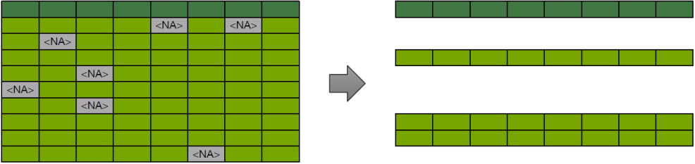

---
output:
  xaringan::moon_reader:
    seal: false
    lib_dir: libs
    css: 
      - default
      - default-fonts
      - duke-blue
      - hygge-duke
      - ../mycss/my-custom-for-video.css
    nature:
      highlightStyle: github
      highlightLines: true
      countIncrementalSlides: false
      ratio: "16:9"
---
background-image: url("../pic/slide-front-page.jpg")
class: center,middle

# 统计学原理(Statistic)

<!---    chakra: libs/remark-latest.min.js --->

### 胡华平

### 西北农林科技大学

### 经济管理学院数量经济教研室

### huhuaping01@hotmail.com

### `r Sys.Date()`

```{r global_options, echo=F,message=FALSE,warning=F}
source("../R/set-global.R")

```


```{r ex-math-eq}
source("../R/external-math-equation.R")
```


---
class: inverse, center, middle
# 第三章 数据的图表展示


[3.1 数据的预处理](#prepare)

[3.2 品质数据的整理与显示](#quality)

[3.3 数值型数据的整理与显示](#quantity)

[3.4 合理使用图表](#nice)


---
layout: false
class: inverse, center, middle, duke-softblue
name: prepare

# 3.1 数据的预处理

数据清洗（data cleaning ）

数据变换（data transformation）

数据子集(data subset)


---
layout: true

<div class="my-header-h2"></div>

<div class="watermark1"></div>

<div class="watermark2"></div>

<div class="watermark3"></div>

<div class="my-footer"><span>huhuaping@  &emsp;&emsp; <a href="#chapter02"> 第03章 数据的图表展示 </a>
&emsp;&emsp;&emsp;&emsp;&emsp;&emsp;&emsp;&emsp;&emsp;&emsp;&emsp;&emsp;&emsp;&emsp;&emsp;&emsp;&emsp;&emsp;&emsp;&emsp;&emsp;
<a href="#prepare"> 3.1 数据的预处理 </a> </span></div> 

---

### 数据清洗：清单

以**调查问卷数据**的清洗为例：

- 真实性的清洗：要确认数据来自于受访者。 

- 完整性的清洗：主要看样本无应答，也就是一整份问卷没有应答。以及选项无应答，也就是应该应答的访题没有应答。 

- 可用性的清洗：主要是看编码是否完成，权数是否可行，以及缺失值如何标记和处理。

- 错误性的清洗：主要是清洗调查环节的错误，比如样本错误、应答人错误、应答方式错误。

---

### 数据清洗：案例（变量视图）


```{r}
customer_data<- readRDS("../data-analysis/custdata.RDS") %>%
  as_tibble() %>%
  add_column(id = 1:nrow(.), .before = "custid")
N <- nrow(customer_data)
names_eng <- names(customer_data)
names_chn <-c("样本编号","客户编号", "性别", "雇佣情况", "收入","婚姻状况","医保情况",
              "住房情况", "迁徙情况","机动车数量", "年龄", "所在州","油费")
vars_list<- tibble(`序号`= 1:length(names_chn),`变量名`=names_eng, `变量含义` = names_chn)
```

```{r}
vars_list %>% 
  datatable(caption = str_c("变量数k=", nrow(.)),
    options = list(pageLength = 6, dom = "tip"))
```

---

### 数据清洗：案例（数据视图）


```{r}

customer_data %>% 
  select(-custid) %>%
  head(500) %>%
  arrange(id) %>%
  datatable(caption = str_c("样本数n=", nrow(customer_data)),
            options = list(pageLength = 5, dom = "tip"))
```

---

### 数据清洗：案例（问题——编码混乱）

`gas_usage`变量表示用油支出。数据编码存在两个问题：

- 混合了数值和字符：
    - 1表示包含在电子支付中；2表示包含在出租或分户中；3表示没有用油
    - 004-999表示用油支出数（美元）

- 有缺失值
    - NA表示缺失

```{r }
summary(customer_data$gas_usage)
```

---

### 数据清洗：案例（办法——构建新变量）

```{r}
# Treating the gas_usage variable
customer_data <- customer_data %>%
  mutate(gas_with_rent = (gas_usage == 1),
         gas_with_electricity = (gas_usage == 2),
         no_gas_bill = (gas_usage == 3) ) %>%
  mutate(gas_usage_new = ifelse(gas_usage < 4, NA, gas_usage))

list_sel <- c("id", "gas_usage", "gas_usage_new","gas_with_rent", "gas_with_electricity","no_gas_bill")
customer_data %>%
  select(one_of(list_sel)) %>%
  head(500) %>%
  datatable(options = list(pageLength = 5, dom = "tip"))
```

---

### 数据清洗：案例（问题——数据范围失常）

- age 年龄。存在取值为0，或大于100的情形
- income 收入。存在取值<=0。


```{r}
summary(customer_data[,c("age", "income")])
```

---

### 数据清洗：案例（办法：处理异常值数据范围失常）

- age取值为0，则转换为缺失值NA
- income取值为0，则转换为缺失值NA

```{r}
# Treating the age and income variables
customer_data <- customer_data %>%
   mutate(age_new = na_if(age, 0),
          income_new = ifelse(income < 0.001, NA, income))

list_sel <- c("id", "age", "age_new","income","income_new")
customer_data %>%
  select(one_of(list_sel)) %>%
  filter(age==0 ,income <0.001) %>%
  #sample_n(500) %>%
  datatable(options = list(pageLength = 5, dom = "tip"))
```

---

### 数据清洗：案例（办法1：处理缺失值）

处理缺失值最简单粗暴的办法就是直接删除行或列，但是这样也会直接去掉很多样本信息：

- 行删除(row delete)
- 列删除(column delete)

```{r}

```


---

### 数据清洗：案例（办法2：给缺失值加标签）

对于分类变量的缺失值，可以直接加一个特定标签（level）

```{r}
include_graphics("../pic/chpt03-missingCats.png", dpi= 100)
```

---

### 数据清洗：案例（办法3：给缺失值补值）

对于数值型变量的缺失值，可以给缺失值进行**补值**：

- 用均值代替
- 使用各种插值办法

---

### 数据清洗：案例（办法3：给缺失值补值）

```{r}
include_graphics("../pic/chpt03-addIsBad.png",dpi=100)
```

> 补值后，一定要记得新增加1个变量，指明哪些样本进行了补值操作！

---

### 数据清洗：案例（办法3：缺失值补值工具）

采用`R`包`vtreat`，最数据集进行自动补值处理：

```{r}
varlist <- setdiff(colnames(customer_data), c("custid", "health_ins"))

# Creating and applying a treatment plan
#install.packages("vtreat")
require("vtreat")
treatment_plan <- design_missingness_treatment(customer_data, varlist = varlist)
training_prepared <- prepare(treatment_plan, customer_data)

```

.pull-left[

处理前数据集`customer_data`的变量：

.scroll-box-14[
```{r}
names(customer_data)
```
]
]

.pull-right[

处理后`training_prepared`的变量：

.scroll-box-14[

```{r}
names(training_prepared)
```

]

]

---

### 数据清洗：案例（办法3：缺失值补值工具）

补值工具**处理前**的数据缺失情况：

```{r}
htmissing <- which(is.na(customer_data$housing_type))
                                        
columns_to_look_at <- c("id", "is_employed", "num_vehicles",
                           "housing_type", "health_ins")
                                        
customer_data[htmissing, columns_to_look_at] %>% 
  head() %>%
  datatable()

 
```

---

### 数据清洗：案例（办法3：缺失值补值工具）

补值工具**处理后**的数据补齐情况：

```{r}
columns_to_look_at <- c("id", "is_employed", "is_employed_isBAD",
                       "num_vehicles","num_vehicles_isBAD",
                       "housing_type", "health_ins")
                                        
training_prepared[htmissing, columns_to_look_at] %>%  
  head() %>%
  datatable() %>%
  formatRound(columns = c(2,4), digits = 2)
```


---

### 数据变换：清单

数据变换主要目的是为让数据能更适合于建模分析（modeling）。主要变换操作包括：

- 中位数/均值变换

- 对数化变换
$ln(X_i)$：

- 标准化变换
$\frac{(X_i -\bar{X})}{S_{X}}$

- 把**连续变量**转换为**离散变量**


---

### 数据变换：案例（收入变量：原始数据）

假设各个州的**收入的中位数**数据集如下：

```{r}
median_income_table <- read_rds("../data-analysis/median_income.RDS")
median_income_table %>%
  datatable(options = list(pageLength = 5, dom = "tip"))

```

---

### 数据变换A：案例（收入变量：中位数变换后）

把收入的州数据集（`median_income_table`）与前面的案例数据集（`training_prepared`）组合起来，并对收入进行中位数变换
$income\_normalized  =\frac{income_i}{median\_income}$：

```{r}

training_prepared <-  training_prepared %>%
  left_join(., median_income_table, by="state_of_res") %>%
  mutate(income_normalized = income/median_income) 

vars_sel <- c("id","income", "median_income", "income_normalized")

training_prepared %>%
  select(one_of(vars_sel)) %>%
  head(500) %>%
  datatable(options = list(pageLength = 5 , dom = "tip")) %>%
  formatRound(columns = c(4), digits =4)

```

---

### 数据变换A：案例（收入变量：中位数变换前后）

- 变换前收入变量(`income`)的情况

```{r}

summary(training_prepared$income)
```

- 中位数变换后收入变量(`income_normalized`)的情况

```{r}
summary(training_prepared$income_normalized)
```

---

### 数据变换A：案例（年龄变量：均值变换前后）

```{r, message=F, error=FALSE,warning=F}
mean_age <- round(mean(training_prepared$age, na.rm = T),2)
sd_age <- round(sd(training_prepared$age, na.rm = T),2)
```


同理，我们也可以用均值来处理变换操作。例如
$age\_normalized = \frac{age_i}{\overline{age}}$，其中年龄的均值
$\overline{age}=$ `r mean_age`岁。

```{r, message=F, error=FALSE,warning=F}
training_prepared <- training_prepared %>%
  mutate(age_normalized = age/mean_age,
         age_scaled = (age- mean_age)/sd_age,
         Ln_income =log10(income))

vars_sel <- c("id","age",  "age_normalized")
training_prepared %>%
  select(one_of(vars_sel)) %>%
  head(500) %>%
  datatable(options = list(pageLength = 5 , dom = "tip")) %>%
  formatRound(columns = c(3), digits =4)


```

---

### 数据变换A：案例（年龄变量：均值变换前后）

- 变换前年龄变量(`age`)的情况

```{r}

summary(training_prepared$age)
```

- **均值**变换后年龄变量(`age_normalized`)的情况

```{r}
summary(training_prepared$age_normalized)
```

---

### 数据变换B：案例（年龄变量：标准化变换）

下面我们进一步用标准化操作，对年龄变量进行变换
$age\_scaled= \frac{age_i - \overline{age}}{sd_{age}}$，其中年龄的均值
$\overline{age}=$ `r mean_age`岁；年龄的标准差
$sd_{age}=$ `r sd_age`岁。

```{r}
vars_sel <- c("id","age",  "age_scaled")
training_prepared %>%
  select(one_of(vars_sel)) %>%
  head(500) %>%
  datatable(options = list(pageLength = 5 , dom = "tip")) %>%
  formatRound(columns = c(3), digits =4)
```

---

### 数据变换B：案例（年龄变量：标准化变换前后）

- 变换前年龄变量(`age`)的情况

```{r}

summary(training_prepared$age)
```

- **标准化**变换后年龄变量(`age_scaled`)的情况

```{r}
summary(training_prepared$age_scaled)
```

---

### 数据变换B：案例（标准化变换：批量处理）

对于数据集的数值型变量(age,income,num_veicles,gas_usage)，我们可以同时进行**标准化**变换。从而为下一步建模分析做准备：

```{r}
dataf <- training_prepared[, c("age", "income", "num_vehicles", "gas_usage")]

dataf_scaled <- scale(dataf, center=TRUE, scale=TRUE)
                                        
means <- attr(dataf_scaled, 'scaled:center')

sds <- attr(dataf_scaled, 'scaled:scale')


dataf_scaled %>%
  as_tibble() %>%
  head(500) %>%
  add_column(id = 1:nrow(.), .before = "age") %>%
  datatable(options = list(pageLength = 5 , dom = "tip")) %>%
  formatRound(columns = c(2:5), digits =4)
```

---

### 数据变换C：案例（收入变量：对数化变换）

下面我们进一步用**对数化**操作，对收入变量进行变换
$Ln\_income= log_{10}{(income_i)}$。

```{r}
vars_sel <- c("id","income",  "Ln_income")
training_prepared %>%
  select(one_of(vars_sel)) %>%
  head(500) %>%
  datatable(options = list(pageLength = 5 , dom = "tip")) %>%
  formatRound(columns = c(3), digits =4)
```

---

### 数据变换C：案例（收入变量：对数化变换前后）

- 变换前收入变量(`income`)的情况

```{r}

summary(training_prepared$income)
```

- **对数化**变换后收入变量(`Ln_income`)的情况

```{r}
summary(training_prepared$Ln_income)
```

---

### 数据变换C：案例（收入变量：对数化变换前的分布）

变换前收入变量(`income`)的分布情况：

```{r}
training_prepared %>%
  ggplot(aes(x= income)) +
  geom_density() +
  labs(x="income（年收入）", y= "密度")
  
```

---

### 数据变换C：案例（收入变量：对数化变换后的分布）

**对数化**变换后收入变量(`Ln_income`)的分布情况：

```{r, warning=FALSE, message=FALSE}

training_prepared %>%
  ggplot(aes(x= Ln_income)) +
  geom_density() +
  labs(x="Ln_income（年收入）", y= "密度")

```

---

### 数据变换D：案例（年龄连续变量：变换为分类变量）

我们可以把年龄(age)**连续变量**，变换为**分类变量**(age_range和age_cat)。其中分割依据为`brks <- c(0, 18,45, 65, Inf)`。

```{r}
brks <- c(0, 18,45, 65, Inf)

training_prepared <- training_prepared %>%
  mutate(age_range = cut(age, breaks = brks, include.lowest = T),
         age_cat = cut(age, breaks = brks, include.lowest = T, labels = FALSE))

vars_sel <- c("id","age",  "age_range", "age_cat")
training_prepared %>%
  select(one_of(vars_sel)) %>%
  head(500) %>%
  datatable(options = list(pageLength = 5 , dom = "tip")) 

```


---

### 数据子集：清单

**数据子集**（data subset）是对数据集进行抽样（sampling）的过程，形成的数据子集一般用于后续的建模分析。

- 训练集（training subset）：主要用于参数估计，得到一个最终的估计模型。

- 测试集（test subset）：主要用于对估计模型的预测准确性进行评估。

---

### 数据子集：训练集和测试集

```{r}
include_graphics("../pic/chpt03-test_train_split.png",dpi =90)
```

---

### 数据子集：案例（设置样本数量）

```{r}
set.seed(25643)
customer_data <- customer_data %>%
  mutate(gp =round(runif(nrow(.)),2))
pct <- 0.1

customer_test <- subset(customer_data, gp <= pct)
customer_train <- subset(customer_data, gp > pct)

n_all <- nrow(customer_data)
n_test <- nrow(customer_test)

n_train <- nrow(customer_train)

```

对全部数据集`custom_data`（样本数n=`r n_all`），我们可以生成名为`gp`的新列，采用[0,1]的**均匀随机分布**（uniform distribution），对应的R函数为`runif(n)`


假定我们希望数据子集的容量分别为：

- **训练集**样本数
$n_{train} =$ `r percent(1-pct)` X `r n_all` =`r n_train`个。

- **测试集**样本数
$n_{train} =$ `r percent(pct)` X `r n_all` =`r n_test`个。


---

### 数据子集：案例（全部数据）

这是全部数据集：

```{r}
vars_sel <- c("id","gp","age", "income", "num_vehicles", "gas_usage")
customer_data %>%
  select(one_of(vars_sel)) %>%
  head(500) %>%
  datatable(caption = str_c("全部数据样本量n=", n_all),
            options = list(pageLength = 5 , dom = "tip")) 

```

---

### 数据子集：案例（训练集）

这是训练集：

```{r}
vars_sel <- c("id","gp","age", "income", "num_vehicles", "gas_usage")
customer_train %>%
  select(one_of(vars_sel)) %>%
  head(500) %>%
  datatable(caption = str_c("训练集-样本量n=", n_train),
            options = list(pageLength = 5 , dom = "tip")) 

```

---

### 数据子集：案例（测试集）

这是测试集：

```{r}
vars_sel <- c("id","gp","age", "income", "num_vehicles", "gas_usage")
customer_test %>%
  select(one_of(vars_sel)) %>%
  head(500) %>%
  datatable(caption = str_c("测试集-样本量n=", n_test),
            options = list(pageLength = 5 , dom = "tip")) 

```

---

### 数据子集：按所在州等比例随机抽取

下面我们抽取数据集的10%作为子集，其中要求按所在州（`state_of_res`）来等比例分配：

```{r}
vars_sel <- c("id","state_of_res","age", "sex","income")

spl_state <- customer_data %>%
  select(one_of(vars_sel)) %>%
  group_by(state_of_res) %>%
  sample_frac(0.1) %>%
  arrange(id) 

spl_state %>%
  datatable(caption = str_c("数据样本量n=", nrow(.)),
    options = list(pageLength = 5, dom = "tip"))

```

---

### 数据子集：按所在州等比例随机抽取


.pull-left[

**抽取前**的所在州样本分布：

```{r}
  customer_data %>%
  select(one_of(vars_sel)) %>%
  group_by(state_of_res) %>%
   summarize(n=n()) %>%
  datatable(caption = str_c("全部数据-样本量n=", nrow(customer_data)),
    options = list(pageLength = 5, dom = "tip"))
```

]

.pull-right[

按每个州**抽取后**的所在州样本分布：

```{r}
  customer_data %>%
  select(one_of(vars_sel)) %>%
  group_by(state_of_res) %>%
  sample_frac(0.1) %>%
  #head(500) %>%
  arrange(id) %>%
  summarize(n=n()) %>%
  datatable(caption = str_c("抽取后-数据样本量n=", nrow(spl_state)),
    options = list(pageLength = 5, dom = "tip"))
 
```

]


---
layout: false
class: inverse, center, middle, duke-softblue
name: quality

# 3.2 品质数据的整理与展示

分类数据的整理与图示

顺序数据的整理与图示


---
layout: true

<div class="my-header-h2"></div>

<div class="watermark1"></div>

<div class="watermark2"></div>

<div class="watermark3"></div>

<div class="my-footer"><span>huhuaping@  &emsp;&emsp; <a href="#chapter02"> 第03章 数据的图表展示 </a>
&emsp;&emsp;&emsp;&emsp;&emsp;&emsp;&emsp;&emsp;&emsp;&emsp;&emsp;&emsp;&emsp;&emsp;&emsp;&emsp;&emsp;&emsp;&emsp;&emsp;&emsp;
<a href="#quality"> 3.2 品质数据的整理与展示 </a> </span></div> 

---

class: duke-orange, center, middle

### 本节内容ppt上见吧！

---
layout: false
class: inverse, center, middle
name: quantity

# 3.3 数值型数据的整理与展示


数据分组

数值型数据的图示


---
layout: true

<div class="my-header-h2"></div>

<div class="watermark1"></div>

<div class="watermark2"></div>

<div class="watermark3"></div>

<div class="my-footer"><span>huhuaping@  &emsp;&emsp; <a href="#chapter02"> 第03章 数据的图表展示 </a>
&emsp;&emsp;&emsp;&emsp;&emsp;&emsp;&emsp;&emsp;&emsp;&emsp;&emsp;&emsp;&emsp;&emsp;&emsp;&emsp;&emsp;&emsp;&emsp;&emsp;&emsp;
<a href="#quantity"> 3.3 数值型数据的整理与展示 </a> </span></div> 

---

class: duke-orange, center, middle

### 本节内容ppt上见吧！

---
layout: false
class: inverse, center, middle
name: nice

# 3.4 合理使用图表


鉴别图形优劣的准则

统计表的设计

---
layout: true

<div class="my-header-h2"></div>

<div class="watermark1"></div>

<div class="watermark2"></div>

<div class="watermark3"></div>

<div class="my-footer"><span>huhuaping@  &emsp;&emsp; <a href="#chapter02"> 第03章 数据的图表展示 </a>
&emsp;&emsp;&emsp;&emsp;&emsp;&emsp;&emsp;&emsp;&emsp;&emsp;&emsp;&emsp;&emsp;&emsp;&emsp;&emsp;&emsp;&emsp;&emsp;&emsp;&emsp;
<a href="#nice"> 3.4 合理使用图表 </a> </span></div> 

---

class: duke-orange, center, middle

### 本节内容ppt上见吧！

---
layout:false
background-image: url("../pic/thank-you-gif-funny-fan.gif")
class: inverse,center
# 本章结束

