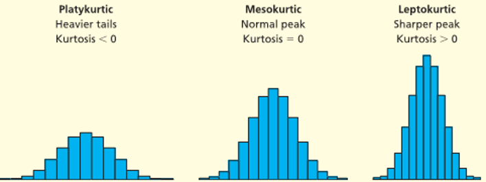

---
output:
  xaringan::moon_reader:
    seal: false
    lib_dir: libs
    css:
      - ../mycss/my-theme.css 
      - ../mycss/my-font.css
      - ../mycss/my-custom-for-video-roomy.css
      - ../mycss/notes-tips.css
      - default
      - duke-blue
      - hygge-duke
    nature:
      highlightStyle: tango
      highlightLines: true
      countIncrementalSlides: false
      ratio: "16:9"

---
background-image: url("../pic/slide-front-page.jpg")
class: center,middle

# 统计学原理(Statistic)

<!---    chakra: libs/remark-latest.min.js --->

### 胡华平

### 西北农林科技大学

### 经济管理学院数量经济教研室

### huhuaping01@hotmail.com

### `r Sys.Date()`

```{r global_options, echo=F,message=FALSE,warning=F}
source("../R/set-global.R")
options(width = 70)
global_size <- 18 # for ggplot2 font size
```


```{r ex-math-eq, eval=FALSE}
source("../R/external-math-equation.R")
```

```{r xaringan-logo, echo=FALSE}
require('xaringanExtra')

xaringanExtra::use_tachyons()

xaringanExtra::use_panelset()

xaringanExtra::use_logo(
  image_url = "../pic/logo/nwafu-logo-circle-wb.png",
  height = '70px',
  position = xaringanExtra::css_position(top='0.2em',left="1em")
)
```

---
class:  center, middle, duke-orange,hide_logo

# 第三章 数据的图表展示


### [3.1 数据的预处理](#prepare)

### [3.2 品质数据的整理与显示](#quality)

### [3.3 数值型数据的整理与显示](#quantity)

### [3.4 合理使用图表](#nice)


---
layout: false
class: center, middle, duke-softblue,hide_logo
name: prepare

# 3.1 数据的预处理

### 数据清洗（data cleaning ）

### 数据变换（data transformation）

### 数据子集(data subset)


---
layout: true

<div class="my-header-h2"></div>

<div class="watermark1"></div>

<div class="watermark2"></div>

<div class="watermark3"></div>

<div class="my-footer"><span>huhuaping@  &emsp;&emsp; <a href="#chapter02"> 第03章 数据的图表展示 </a>
&emsp;&emsp;&emsp;&emsp;&emsp;&emsp;&emsp;&emsp;&emsp;&emsp;&emsp;&emsp;&emsp;&emsp;&emsp;&emsp;&emsp;&emsp;&emsp;&emsp;&emsp;
<a href="#prepare"> 3.1 数据的预处理 </a> </span></div> 

---

## 数据预处理的主要内容

- 数据审核：检查数据中的错误

- 数据筛选：找出符合条件的数据

- 数据排序：升序和降序；寻找数据的基本特征

- 数据透视：按需要汇总

---

## 数据预处理：数据审核

对于**原始数据(raw data)**需要进行：

**完整性审核**：

- 应调查的单位或个体是否有遗漏

- 所有的调查项目或变量是否填写齐全

**准确性审核**：

- 数据是否真实反映实际情况，内容是否符合实际

- 数据是否有错误，计算是否正确等

---

## 数据预处理：数据审核

对于**二手数据(second hand data)**需要进行：

**适用性审核**：

- 弄清楚数据的来源、数据的口径以及有关的背景材料

- 确定数据是否符合自己分析研究的需要

**时效性审核**：

- 尽可能使用最新的数据

- 确认是否有必要做进一步的加工整理

---

## 数据预处理：数据筛选

**数据预处理**：当数据中的错误不能予以纠正，或者有些数据不符合调查的要求而又无法弥补时，需要对数据进行筛选。

数据筛选的内容：

- 将某些不符合要求的数据或有明显错误的数据予以剔除

- 将符合某种特定条件的数据筛选出来，而不符合特定条件的数据予以剔除

---

## 数据预处理：数据排序

数据排序的**作用**：

- 按一定顺序将数据排列，以发现一些明显的特征或趋势，找到解决问题的线索

- 排序有助于对数据检查纠错，以及为重新归类或分组等提供依据

- 在某些场合，排序本身就是分析的目的之一

- 排序可借助于计算机完成

---

## 数据预处理：数据透视表

数据透视表（pivot table）的作用：

- 可以从复杂的数据中提取有用的信息

- 可以对数据表的重要信息按使用者的习惯或分析要求进行汇总和作图

- 形成一个符合需要的交叉表(列联表)

- 在利用数据透视表时，数据源表中的首行必须有列标题

---

## 数据预处理：Excel中的数据透视表

利用`Excel`软件创建数据透视表的主要步骤：

- 第1步：在Excel工作表中建立数据清单

- 第2步：选中数据清单中的任意单元格，并选择【数据】菜单中的【数据透视表和数据透视图】

- 第3步：确定数据源区域

- 第4步：在【向导—3步骤之3】中选择数据透视表的输出位置。然后选择【布局】

- 第5步：在【向导—布局】对话框中，依次将”分类变量“拖至左边的“行”区域，上边的“列”区域，将需要汇总的“变量” 拖至“数据区域”

- 第6步：然后单击【确定】，自动返回【向导—3步骤之3】对话框。然后单击【完成】，即可输出数据透视表 

---

### （演示）Excel数据预处理：数据准备

利用Excel进行数据准备，主要工作包括：

- 读取或导入其他数据格式（例如`.txt`或`.csv`格式）

- 删除说明性内容

- 数据表形式（long data VS wide data）

- 数值表达方式（labels VS values）

- 备注重要信息

---

### （演示）导入其他数据格式：Excel操作

.panelset[
.panel[.panel-name[a.数据菜单]

```{r}
include_graphics("../pic/chpt03-excel-prepare-import-csv1.png", error = FALSE)
```

]

.panel[.panel-name[b.选择文件]

```{r, out.width='80%'}
include_graphics("../pic/chpt03-excel-prepare-import-csv2.png", error = FALSE)
```

]

.panel[.panel-name[c.数据引导]

```{r, out.width='60%'}
include_graphics("../pic/chpt03-excel-prepare-import-csv3.png", error = FALSE)
```

]


]

---

### （演示）删除说明性内容：Excel操作

.left-column[
#### a.删除前
]

.right-column[

```{r, out.height='450px'}
include_graphics("../pic/chpt03-excel-prepare-remove-notation1.png", error = FALSE)
```

]

---

### （演示）删除说明性内容：Excel操作

.left-column[
#### a.删除前

#### b.删除后
]

.right-column[

```{r, out.height='450px'}
include_graphics("../pic/chpt03-excel-prepare-remove-notation2.png", error = FALSE)
```

]


---
exclude: true

### （演示）删除说明性内容：Excel操作

.panelset[
.panel[.panel-name[a.删除前]

```{r, out.height='400px'}
include_graphics("../pic/chpt03-excel-prepare-remove-notation1.png", error = FALSE)
```

]

.panel[.panel-name[b.删除后]

```{r, out.height='400px'}
include_graphics("../pic/chpt03-excel-prepare-remove-notation2.png", error = FALSE)
```

]

]

---

### （演示）数据表现形式：Excel操作

.left-column[
### 1)扁平形式
]

.right-column[


```{r, out.height='420px'}
include_graphics("../pic/chpt03-excel-prepare-format1-wide.png", error = FALSE)
```

- 一个病人的数据，由一行就能够完全进行表达。

]

---

### （演示）数据表现形式：Excel操作

.left-column[
### 1)扁平形式

### 2)窄长形式
]

.pt0[

.right-column[


```{r, out.height='420px'}
include_graphics("../pic/chpt03-excel-prepare-format2-long.png", error = FALSE)
```

- 一个病人的数据，需要多行才能进行完整表达。

]

]


---
exclude: true

### （演示）数据表现形式：Excel操作

.panelset[
.panel[.panel-name[a.扁平形式]

```{r, out.height='40%'}
include_graphics("../pic/chpt03-excel-prepare-format1-wide.png", error = FALSE)
```

> 一个病人的数据，由一行就能够完全进行表达。

]

.panel[.panel-name[b.窄长形式]

```{r, out.height='40%'}
include_graphics("../pic/chpt03-excel-prepare-format2-long.png", error = FALSE)
```

> 一个病人的数据，需要多行才能进行完整表达。

]

]

---

## 数据清洗：Excel常用操作1

- **查找/替换**：

- **提取文本字符**：

    - 从左侧：`=LEFT(text, [num_chars])`
    - 从右侧：`=RIGHT(text, [num_chars])`
    - 从指定位置：`=MID(text,start_num,num_chars)`

- **正确大小写**：

    - 全部小写：`=LOWER(text)`
    - 全部大写：`=UPPER(text)`
    - 首字母大写：`=PROPER(text)`
    - 自定义大小写：`=UPPER(LEFT(A2,1)&LOWER(MID(A2,2,60)`
    
---

## 数据清洗：Excel常用操作2


- **删除重复值**：

- **合并文本内容**：`=[Cell 1]&[Cell 2]`

- **清除空格**：`=TRIM( text )`

- **清除非打印字符**：`=CLEAN( text )`


---

### （演示）Excel数据清洗：查找/替换

```{r, out.height='100%'}
include_graphics("../pic/chpt03-excel-prepare-find-1.png", error = FALSE)
```

---

### （演示）Excel数据清洗：提取文本字符


```{r, out.height='200px'}
include_graphics("../pic/chpt03-excel-prepare-extract-1.png", error = FALSE)
```


```{r, out.height='200px'}
include_graphics("../pic/chpt03-excel-prepare-extract-2.png", error = FALSE)
```

---

## （演示）Excel数据清洗：自定义大小写

```{r, out.height='100%'}
include_graphics("../pic/chpt03-excel-prepare-cap.png", error = FALSE)
```

---

### （演示）Excel数据清洗：删除重复值

```{r, out.height='100%'}
include_graphics("../pic/chpt03-excel-prepare-duplicate.png", error = FALSE)
```


---

### （演示）Excel数据审核：

```{r}
img_pct <- "450px"
```


.panelset[
.panel[.panel-name[a.选择区域]

```{r, out.height=img_pct}
include_graphics("../pic/chpt03-excel-prepare-check-1.png", error = FALSE)
```

]

.panel[.panel-name[b.设定类型]

```{r, out.height=img_pct}
include_graphics("../pic/chpt03-excel-prepare-check-2.png", error = FALSE)
```

]

.panel[.panel-name[c.设置范围]

```{r, out.height=img_pct}
include_graphics("../pic/chpt03-excel-prepare-check-3.png", error = FALSE)
```

]

.panel[.panel-name[d.设置提示]

```{r, out.height=img_pct}
include_graphics("../pic/chpt03-excel-prepare-check-4.png", error = FALSE)
```

]

]


---

exclude: true

### 数据清洗：清单

以**调查问卷数据**的清洗为例：

- 真实性的清洗：要确认数据来自于受访者。 

- 完整性的清洗：主要看样本无应答，也就是一整份问卷没有应答。以及选项无应答，也就是应该应答的访题没有应答。 

- 可用性的清洗：主要是看编码是否完成，权数是否可行，以及缺失值如何标记和处理。

- 错误性的清洗：主要是清洗调查环节的错误，比如样本错误、应答人错误、应答方式错误。

---
exclude: true

### 案例：家庭税收情况


```{r}
customer_data<- readRDS("../data-analysis/custdata.RDS") %>%
  as_tibble() %>%
  add_column(id = 1:nrow(.), .before = "custid")
N <- nrow(customer_data)
names_eng <- names(customer_data)
names_chn <-c("样本编号","客户编号", "性别", "雇佣情况", "收入","婚姻状况","医保情况",
              "住房情况", "迁徙情况","机动车数量", "年龄", "所在州","油费")
vars_list<- tibble(`序号`= 1:length(names_chn),`变量名`=names_eng, `变量含义` = names_chn)
```


---

### 案例：家庭税收情况

**案例说明**：一项家庭税收情况调查，一共收集了样本数
$n=`r str_c("", nrow(customer_data))`$个家庭在`r  ncol(customer_data)`个变量上的基本情况。

.scroll-output[

```{r}
glimpse(customer_data)
```

]


---

### （税收案例）变量视图

```{r}
vars_list %>% 
  datatable(options = list(pageLength = 10, dom = "tip"))
```

---

### （税收案例）数据视图

数据包含的样本数
$n=`r str_c("", nrow(customer_data))`$，下表展示了前500行。

```{r}
customer_data %>% 
  select(-custid,-housing_type) %>%
  head(500) %>%
  arrange(id) %>%
  datatable(options = list(pageLength = 8, 
                           dom = "tip",
                           scrollX=TRUE,
                           scrollY=TRUE))

```

---

### （税收案例）数据清洗问题——存在混合编码


.panelset[
.panel[.panel-name[a.变量取值]

`gas_usage`变量表示用油支出，样本数据中的分布情况如下：


```{r}
table(customer_data$gas_usage,useNA ="always"  )
```

]

.panel[.panel-name[b.编码问题]

根据“数据集说明”，我们容易发现`gas_usage`变量数据存在混合编码问题：

- 混合了数值（number）和字符（string）：
    - 1表示包含在电子支付中；2表示包含在出租或分户中；3表示没有用油；
    - 004-999表示用油支出数（美元）。

- 有缺失值：
    - `NA`表示缺失。

]

.panel[.panel-name[c.处理办法]

我们需要把原来的变量`gass_usage`提取构建为4个新变量：`gas_usage_new`、`gas_with_rent`、 `gas_with_electricity`、`no_gas_bill`。

```{r}
# Treating the gas_usage variable
customer_data <- customer_data %>%
  mutate(gas_with_rent = (gas_usage == 1),
         gas_with_electricity = (gas_usage == 2),
         no_gas_bill = (gas_usage == 3) ) %>%
  mutate(gas_usage_new = ifelse(gas_usage < 4, NA, gas_usage))

list_sel <- c("id", "gas_usage", "gas_usage_new","gas_with_rent", "gas_with_electricity","no_gas_bill")
customer_data %>%
  select(one_of(list_sel)) %>%
  head(500) %>%
  datatable(options = list(pageLength = 5, 
                           dom = "tip",
                           scrollX =TRUE))
```

]

]

---

### （税收案例）数据清洗问题——数据范围失常

.panelset[
.panel[.panel-name[a.年龄范围]

 我们容易发现，年龄变量`age`存在取值为0，或大于100的情形。
 
```{r}
table(customer_data[,c("age")], useNA = "always")
```

]

.panel[.panel-name[b.收入范围]

此外，我们还发现收入变量`income`存在取值小于0的情形。

.scroll-box-14[

```{r}
table(customer_data[,c("income")], useNA = "always")
```

]

]

.panel[.panel-name[c.处理办法]

- age取值等于0，则转换为缺失值`NA`
- income取值小于0，则转换为缺失值`NA`

```{r}
# Treating the age and income variables
customer_data <- customer_data %>%
   mutate(age_new = na_if(age, 0),
          income_new = ifelse(income < 0.001, "NA", income) ,
          age_new = ifelse(age_new==0, "NA", age_new))

list_sel <- c("id", "age", "age_new","income","income_new")
customer_data %>%
  select(one_of(list_sel)) %>%
  filter(age==0 ,income <0.001) %>%
  #sample_n(500) %>%
  datatable(options = list(pageLength = 5, dom = "tip"))
```

]

]


---

### （税收案例）数据清洗问题——存在缺失值

.panelset[
.panel[.panel-name[a.简单删除法]

处理缺失值最简单粗暴的办法就是直接删除行或列，但是这样也会直接去掉很多样本信息：

- 行删除(row delete)
- 列删除(column delete)


```{r}
include_graphics("../pic/chpt03-removingNAs.png")
```

]


.panel[.panel-name[b.填加标签法]

.pull-left[

对于**分类变量**的缺失值，可以直接加一个特定标签（level）。
]

.pull-right[

```{r, out.height='400px'}

```

]


]

.panel[.panel-name[c.数值替换法]

.pull-left[

对于**数值型变量**的缺失值，可以给缺失值进行**补值**：

- 用均值代替

- 使用各种插值办法


补值后，一定要记得新增加1个变量，指明哪些样本进行了补值操作！

]

.pull-right[

```{r, out.height='400px'}

```

]


]

]


---

### （税收案例）数据清洗问题——R补值工具


```{r}
varlist <- setdiff(colnames(customer_data), c("custid", "health_ins"))

# Creating and applying a treatment plan
#install.packages("vtreat")
require("vtreat")
treatment_plan <- design_missingness_treatment(customer_data, varlist = varlist)
training_prepared <- prepare(treatment_plan, customer_data)

```

.panelset[
.panel[.panel-name[a.处理前变量]

处理前数据集`customer_data`的变量：


```{r}
names(customer_data)
```

]


.panel[.panel-name[b.处理后变量]

采用`R`包`vtreat`进行自动补值后新数据集`training_prepared`的变量：

.scroll-box-10[
```{r}
names(training_prepared)
```

]


] <!---end panel 3--->

.panel[.panel-name[c.处理前数据]

**处理前**的数据缺失情况（4个变量，前6行）：

```{r}
htmissing <- which(is.na(customer_data$housing_type))
                                        
columns_to_look_at <- c("id", "is_employed", "num_vehicles",
                           "housing_type", "health_ins")
                                        
customer_data[htmissing, columns_to_look_at] %>% 
  head() %>%
  datatable(options = list(scrollX =TRUE))

```

]


.panel[.panel-name[d.处理后数据]

补值工具**处理后**的数据补齐情况（前6行）：

```{r}
columns_to_look_at <- c("id", "is_employed", "is_employed_isBAD",
                       "num_vehicles","num_vehicles_isBAD",
                       "housing_type", "health_ins")
                                        
training_prepared[htmissing, columns_to_look_at] %>%  
  head() %>%
  datatable(options = list(scrollX =TRUE)) %>%
  formatRound(columns = c(2,4), digits = 2)
```

]

]


---

### （税收案例）数据变换

数据变换主要目的是为让数据能更适合于建模分析（modeling）。

主要变换操作包括：

- 中位数（median）变换

- 均值（mean）变换

- 对数化（log）变换
$ln(X_i)$：

- 标准化（sd）变换
$\frac{(X_i -\bar{X})}{S_{X}}$

- 把**连续变量**转换为**离散变量**


---

### （税收案例）数据变换：原始收入变量

假设我们还有51个州的**收入的中位数**数据集（`median_income_table`）：

```{r}
median_income_table <- read_rds("../data-analysis/median_income.RDS")
median_income_table %>%
  datatable(options = list(pageLength = 8, dom = "tip"))

```

---

### （税收案例）数据变换：收入变量的中位数变换

.panelset[
.panel[.panel-name[a.变换公式]

现在我们可以，通过如下步骤进行收入的**中位数**变换：

- 把收入的州数据集（`median_income_table`）与前面的案例数据集（`training_prepared`）匹配起来

- 对收入进行中位数变换
$income\_normalized  =\frac{income_i}{median\_income}$。

]

.panel[.panel-name[b.R计算过程]

下面展示的是用`R`软件进行前述的匹配和计算过程：

```{r, echo=TRUE, comment=">"}

mean_income <- round(mean(training_prepared$income, na.rm = T),2)
sd_income <- round(sd(training_prepared$income, na.rm = T),2)

training_prepared <-  training_prepared %>%
  left_join(., median_income_table, by="state_of_res") %>% #<<
  mutate(income_byMedian = income/median_income, #<<
         income_byMean = income/mean_income,
         income_bySd = (income- mean_income)/sd_income,
         income_byLog10 =log10(income))

```

]

.panel[.panel-name[c.变换结果]

最终得到收入的**中位数**变换结果：

```{r}
vars_sel <- c("id","income", "median_income", "income_byMedian")
training_prepared %>%
  select(one_of(vars_sel)) %>%
  head(500) %>%
  datatable(options = list(pageLength = 5 , dom = "tip")) %>%
  formatRound(columns = c(3), digits =4)
```

]

]

---

### （税收案例）数据变换：收入变量的均值变换

.panelset[
.panel[.panel-name[a.变换公式]

现在我们可以，通过如下步骤进行收入的均值变换：

- 对收入进行中位数变换
$income\_byMean  =\frac{income_i}{\overline{income}}$。

]

.panel[.panel-name[b.R计算过程]

下面展示的是用`R`计算过程：

```{r, echo=TRUE, comment=">", eval=FALSE}

mean_income <- round(mean(training_prepared$income, na.rm = T),2)
sd_income <- round(sd(training_prepared$income, na.rm = T),2)

training_prepared <-  training_prepared %>%
  left_join(., median_income_table, by="state_of_res") %>% 
  mutate(income_byMedian = income/median_income, 
         income_byMean = income/mean_income, #<<
         income_bySd = (income- mean_income)/sd_income,
         income_byLog10 =log10(income))

```

]

.panel[.panel-name[c.变换结果]

最终得到收入的**均值变换**结果：

```{r}
vars_sel <- c("id","income", "income_byMedian", "income_byMean")
training_prepared %>%
  select(one_of(vars_sel)) %>%
  head(500) %>%
  datatable(options = list(pageLength = 5 , dom = "tip")) %>%
  formatRound(columns = c(3:4), digits =4)
```

]

]


---

### （税收案例）数据变换：收入变量的标准化变换

.panelset[
.panel[.panel-name[a.变换公式]

现在我们可以，通过如下步骤进行收入的**标准化**变换：

- 对收入进行标准化变换
$income\_bySd  =\frac{income_i-\overline{income}}{sd\_income}$。

]

.panel[.panel-name[b.R计算过程]

下面展示的是用`R`计算过程：

```{r, echo=TRUE, comment=">", eval=FALSE}

mean_income <- round(mean(training_prepared$income, na.rm = T),2)
sd_income <- round(sd(training_prepared$income, na.rm = T),2)

training_prepared <-  training_prepared %>%
  left_join(., median_income_table, by="state_of_res") %>% 
  mutate(income_byMedian = income/median_income, 
         income_byMean = income/mean_income, 
         income_bySd = (income- mean_income)/sd_income, #<<
         income_byLog10 =log10(income))

```

]

.panel[.panel-name[c.变换结果]

最终得到收入的**标准化**变换结果：

```{r}
vars_sel <- c("id","income", "income_byMedian", "income_byMean", "income_bySd")
training_prepared %>%
  select(one_of(vars_sel)) %>%
  head(500) %>%
  datatable(options = list(pageLength = 5 , dom = "tip")) %>%
  formatRound(columns = c(3:5), digits =4)
```

]

]

---

### （税收案例）数据变换：收入变量的对数化变换

.panelset[
.panel[.panel-name[a.变换公式]

现在我们可以，通过如下步骤进行收入的**对数化**变换：

- 对收入进行**对数化**变换
$income\_byLog10  =log_{10}^{(income_i)}$。

]

.panel[.panel-name[b.R计算过程]

下面展示的是用`R`计算过程：

```{r, echo=TRUE, comment=">", eval=FALSE}

mean_income <- round(mean(training_prepared$income, na.rm = T),2)
sd_income <- round(sd(training_prepared$income, na.rm = T),2)

training_prepared <-  training_prepared %>%
  left_join(., median_income_table, by="state_of_res") %>% 
  mutate(income_byMedian = income/median_income, 
         income_byMean = income/mean_income, 
         income_bySd = (income- mean_income)/sd_income, 
         income_byLog10 =log10(income)) #<<

```

]

.panel[.panel-name[c.变换结果]

最终得到收入的**对数化**变换结果：

```{r}
vars_sel <- c("id","income", "income_byMedian", "income_byMean", "income_bySd", "income_byLog10")
training_prepared %>%
  select(one_of(vars_sel)) %>%
  head(500) %>%
  datatable(options = list(pageLength = 5 , dom = "tip")) %>%
  formatRound(columns = c(3:6), digits =4)
```

]

]


---

### （税收案例）数据变换：收入变换前后分布的比较

.panelset[
.panel[.panel-name[a.原变量]

```{r, fig.cap= "年收入的直方图",warning=FALSE, message=FALSE}

training_prepared %>%
  ggplot(aes(x=income))+
  geom_histogram(bins = 30, fill = "blue") +
  labs(x="变换前的变量income", y= "频数")

```

]

.panel[.panel-name[b.中位数变换]

```{r, warning=FALSE, message=FALSE}
training_prepared %>%
  ggplot(aes(x=income_byMedian))+
  geom_histogram(bins = 30, fill = "blue") +
  labs(x="变换后的变量income_byMedian", y= "频数")

```

]

.panel[.panel-name[c.均值变换]

```{r, warning=FALSE, message=FALSE}
training_prepared %>%
  ggplot(aes(x=income_byMean))+
  geom_histogram(bins = 30, fill = "blue") +
  labs(x="变换后的变量income_byMean", y= "频数")

```

]

.panel[.panel-name[d.标准化]

```{r, warning=FALSE, message=FALSE}
training_prepared %>%
  ggplot(aes(x=income_bySd))+
  geom_histogram(bins = 30, fill = "blue") +
  labs(x="变换后的变量income_bySd", y= "频数")

```

]

.panel[.panel-name[e.对数化]

```{r, warning=FALSE, message=FALSE}
training_prepared %>%
  ggplot(aes(x=income_byLog10))+
  geom_histogram(bins = 30, fill = "blue") +
  labs(x="变换后的变量income_byLog10", y= "频数")

```

]

]


---

### （税收案例）数据变换：批量标准化处理

.panelset[
.panel[.panel-name[a.编写R代码]

对于数据集的数值型变量（`age`,`income`,`num_veicles`,`gas_usage`），我们可以同时进行批量**标准化**变换。从而为下一步建模分析做准备。

如下是利用`R`软件函数`scale()`进行批量标准化处理的代码：

```{r, echo=T}
dataf <- training_prepared[, c("age", "income", "num_vehicles", "gas_usage")]

dataf_scaled <- scale(dataf, center=TRUE, scale=TRUE) #<<
```

]

.panel[.panel-name[b.原数据集]

```{r}
dataf %>%
  as_tibble() %>%
  head(500) %>%
  add_column(id = 1:nrow(.), .before = "age") %>%
  datatable(options = list(pageLength = 5 , dom = "tip")) 
```

]

.panel[.panel-name[c.批处理后数据集]


```{r}
dataf_scaled %>%
  as_tibble() %>%
  head(500) %>%
  add_column(id = 1:nrow(.), .before = "age") %>%
  datatable(options = list(pageLength = 5 , dom = "tip")) %>%
  formatRound(columns = c(2:5), digits =2)
```

]

]

---

### （税收案例）数据变换：批量变换为分类变量

.panelset[

.panel[.panel-name[a.编写R代码]

我们还可以把**连续变量**年龄(`age`)，变换为**分类变量**(`age_range`和`age_cat`)。其中分割依据为`brks <- c(0, 18, 45, 65, Inf)`。

```{r, echo=TRUE}
brks <- c(0, 18,45, 65, Inf) #<<

training_prepared <- training_prepared %>%
  select(id, age) %>%
  filter(!is.na(age)) %>%
  mutate(age_range = cut(age, breaks = brks,  #<<
                         include.lowest = T),
         age_cat = cut(age, breaks = brks,  #<<
                       include.lowest = T, labels = FALSE))

```

]

.panel[.panel-name[b.变换结果]

```{r}
vars_sel <- c("id","age",  "age_range", 
              "age_cat")
training_prepared %>%
  select(one_of(vars_sel)) %>%
  head(500) %>%
  mutate(age_range = str_replace(age_range,"]", "\U298C")) %>%
  datatable(options = list(pageLength = 5 , 
                           dom = "tip"))
 
```

]

]


---

### 数据子集：概念

**数据子集**（data subset）是对数据集进行抽样（sampling）的过程，形成的数据子集一般用于后续的建模分析。

- 训练集（training subset）：主要用于参数估计，得到一个最终估计模型。

- 测试集（test subset）：主要用于对估计模型的预测准确性进行评估。

---

### 数据子集：训练集和测试集

```{r}
include_graphics("../pic/chpt03-test_train_split.png",dpi =90)
```

---

### （税收案例）数据子集：设置子集样本数量

```{r chunk-random}
set.seed(25643)
customer_data <- customer_data %>%
  mutate(gp =round(runif(nrow(.)),2)) #<<
pct <- 0.1

customer_test <- subset(customer_data, gp <= pct)
customer_train <- subset(customer_data, gp > pct)

n_all <- nrow(customer_data)
n_test <- nrow(customer_test)

n_train <- nrow(customer_train)

```


.panelset[

.panel[.panel-name[a.子集样本数]

对全部数据集`custom_data`（样本数n=`r n_all`），我们可以生成名为`gp`的新列，采用[0,1]的**均匀随机分布**（uniform distribution），对应的R函数为`runif(n)`


假定我们希望数据子集的容量分别为：

- **训练集**样本数
$n_{train} =$ `r percent(1-pct)` X `r n_all` =`r n_train`个。

- **测试集**样本数
$n_{test} =$ `r percent(pct)` X `r n_all` =`r n_test`个。

]

.panel[.panel-name[b.编写R代码]

```{r, echo=T}
set.seed(25643)
customer_data <- customer_data %>%
  mutate(gp =round(runif(nrow(.)),2)) #<<
pct <- 0.1

customer_test <- subset(customer_data, gp <= pct)
customer_train <- subset(customer_data, gp > pct)

n_all <- nrow(customer_data)
n_test <- nrow(customer_test)

n_train <- nrow(customer_train)
```

]

]


---

### （税收案例）数据子集：比较三个数据集

.panelset[
.panel[.panel-name[a.全部数据集]

```{r}
vars_sel <- c("id","gp","age", "income", "num_vehicles", "gas_usage")
customer_data %>%
  select(one_of(vars_sel)) %>%
  head(500) %>%
  datatable(caption = str_c("全部数据样本量n=", n_all),
            options = list(pageLength = 5 , dom = "tip")) 

```

]

.panel[.panel-name[b.训练数据集]

```{r}
vars_sel <- c("id","gp","age", "income", "num_vehicles", "gas_usage")
customer_train %>%
  select(one_of(vars_sel)) %>%
  head(500) %>%
  datatable(caption = str_c("训练集-样本量n=", n_train),
            options = list(pageLength = 5 , dom = "tip")) 

```

]

.panel[.panel-name[c.测试数据集]

```{r}
vars_sel <- c("id","gp","age", "income", "num_vehicles", "gas_usage")
customer_test %>%
  select(one_of(vars_sel)) %>%
  head(500) %>%
  datatable(caption = str_c("测试集-样本量n=", n_test),
            options = list(pageLength = 5 , dom = "tip")) 

```

]

]

---

### （税收案例）数据子集：等比例随机抽取

.panelset[
.panel[.panel-name[a.抽取规则]

下面我们随机抽取数据集的10%作为子集，其中要求按所在州（`state_of_res`）来等比例分配：

```{r, echo=TRUE}
vars_sel <- c("id","state_of_res","age", "sex","income")

spl_state <- customer_data %>%
  select(one_of(vars_sel)) %>%
  group_by(state_of_res) %>% #<<
  sample_frac(0.1) %>% #<<
  arrange(id) 
```

]

.panel[.panel-name[b.抽取结果]

```{r}
spl_state %>%
  datatable(caption = str_c("数据样本量n=", nrow(.)),
    options = list(pageLength = 5, dom = "tip"))
```

]

.panel[.panel-name[c.按州**抽取**前]

```{r}
  customer_data %>%
  select(one_of(vars_sel)) %>%
  group_by(state_of_res) %>%
  summarize(n=n()) %>%
  add_column(index = 1:nrow(.), .before = "state_of_res") %>%
  datatable(caption = str_c("抽取前各州样本数量n=", nrow(customer_data)),
    options = list(pageLength = 5, dom = "tip"))
```

]

.panel[.panel-name[d.按州**抽取**后]

```{r}
  customer_data %>%
  select(one_of(vars_sel)) %>%
  group_by(state_of_res) %>%
  sample_frac(0.1) %>%
  #head(500) %>%
  arrange(id) %>%
  summarize(n=n()) %>%
  add_column(index = 1:nrow(.), .before = "state_of_res") %>%
  datatable(caption = str_c("抽取后各州样本数量n=", nrow(spl_state)),
    options = list(pageLength = 5, dom = "tip"))
 
```

]

]


---
layout: false
class: center, middle, duke-softblue,hide_logo
name: quality

# 3.2 品质数据的整理与展示

### 分类数据的整理与图示

### 顺序数据的整理与图示


---
layout: true

<div class="my-header-h2"></div>

<div class="watermark1"></div>

<div class="watermark2"></div>

<div class="watermark3"></div>

<div class="my-footer"><span>huhuaping@  &emsp;&emsp; <a href="#chapter02"> 第03章 数据的图表展示 </a>
&emsp;&emsp;&emsp;&emsp;&emsp;&emsp;&emsp;&emsp;&emsp;&emsp;&emsp;&emsp;&emsp;&emsp;&emsp;&emsp;&emsp;&emsp;&emsp;&emsp;&emsp;
<a href="#quality"> 3.2 品质数据的整理与展示 </a> </span></div> 

---

## 分类数据：整理与图示的基本过程


- 列出各类别

- 分类数据的整理与图示

- 制作频数分布表

- 用图形显示数据

---

## 分类数据：计算统计量并制表

- 频数(frequency) ：落在各类别中的数据个数

- 比例(proportion)：某一类别数据个数占全部数据个数的比值

- 百分比(percentage) ：将对比的基数作为100而计算的比值

- 比率(ratio) ：不同类别数值个数的比值

---
exclude: true

## 案例：饮料销售

```{r}
drink <- read.xlsx("../data/textbook/example/case-3-3-drink.xlsx") %>%
  as_tibble() %>%
  add_column(index = 1:nrow(.), .before = "gender")

smry_type <- drink %>%
  group_by(brand) %>%
  summarise(n = n())

smry_v2 <- drink %>%
  group_by(gender,brand) %>%
  summarise(n = n()) 
```


---

### （案例）饮料销售

.panelset[
.panel[.panel-name[a.案例说明]

**案例**：一家市场调查公司为研究不同品牌饮料的市场占有率，对随机抽取的一家超市进行了调查。

调查员在某天对50名顾客购买饮料的品牌进行了记录，如果一个顾客购买某一品牌的饮料，就将这一饮料的品牌名字记录一次。

]

.panel[.panel-name[b.原始数据]

下边就是记录的原始数据：

```{r}
drink %>%
  datatable(options = list(pageLength = 6,
                           dom = "tip"))
```

]

]


---

### （案例）饮料销售：单变量制表（饮料类别）

.panelset[
.panel[.panel-name[a.类别分组]

根据原始数据，我们可以整理并列出所有饮料类别：

```{r}
  drink %>%
  janitor::tabyl(brand) %>%
  #janitor::adorn_totals(where = c("row")) %>%
  #janitor::adorn_pct_formatting()%>%
  select(-percent,-n) %>%
  datatable(options = list(dom = "t"))
```

]

.panel[.panel-name[b.频次表]

统计得到各饮料类别的购买人数（频次）：

```{r}
  drink %>%
  janitor::tabyl(brand) %>%
  janitor::adorn_totals(where = c("row")) %>%
  #janitor::adorn_pct_formatting()%>%
  select(-percent) %>%
  datatable(options = list(dom = "t"))
```

]

.panel[.panel-name[c.频率表]

进一步统计得到各饮料类别的购买人数占比（频率）：

```{r}
  drink %>%
  janitor::tabyl(brand) %>%
  janitor::adorn_totals(where = c("row")) %>%
  janitor::adorn_pct_formatting()%>%
  #select(-percent,-n) %>%
  datatable(options = list(dom = "t"))
```

]

]

---

### （案例）饮料销售：双变量制表（饮料类别VS性别）

.panelset[
.panel[.panel-name[a.交叉分组]

根据原始数据，我们可以对饮料类别和性别进行交叉分组：

```{r}
  drink %>%
  janitor::tabyl(brand, gender) %>%
  mutate_if(., is.numeric, ~NA ) %>%
  datatable(options = list(dom = "t"))

```

]

.panel[.panel-name[b.频次表]

统计得到交叉分组下的购买人数（频次）：

```{r}
drink %>%
  janitor::tabyl(brand, gender) %>%
  #mutate_if(., is.numeric, ~NA ) %>%
  janitor::adorn_totals(where = c("row", "col")) %>%
  datatable(options = list(dom = "t"))

```

]

.panel[.panel-name[c1.列频率表]

进一步统计得到交叉分组下购买人数占比（频率）及其**列合计**：

```{r}

drink %>%
  janitor::tabyl(brand, gender) %>%
  #mutate_if(., is.numeric, ~NA ) %>%
  janitor::adorn_totals(where = c("row", "col")) %>%
  janitor::adorn_percentages(c( "col")) %>%
  janitor::adorn_pct_formatting() %>%
  #janitor::adorn_ns() %>%
  datatable(options = list(dom = "t"))

```

]

.panel[.panel-name[c2.行频率表]

同时，也可统计得到交叉分组下购买人数占比（频率）及其**行合计**：

```{r}

drink %>%
  janitor::tabyl(brand, gender) %>%
  #mutate_if(., is.numeric, ~NA ) %>%
  janitor::adorn_totals(where = c("row", "col")) %>%
  janitor::adorn_percentages(c( "row")) %>%
  janitor::adorn_pct_formatting() %>%
  #janitor::adorn_ns() %>%
  datatable(options = list(dom = "t"))

```

]

.panel[.panel-name[d.复合表]

最后，还可以同时统计交叉分组的人数和占比（列合计）：

```{r}
drink %>%
  janitor::tabyl(brand, gender) %>%
  #mutate_if(., is.numeric, ~NA ) %>%
  janitor::adorn_totals(where = c("row", "col")) %>%
  janitor::adorn_percentages(c( "col")) %>%
  janitor::adorn_pct_formatting() %>%
  janitor::adorn_ns() %>%
  datatable(options = list(dom = "t"))

```

]

]

---

## 分类数据：统计制图1（条形/柱状图）

**条形/柱状图**：用宽度相同的条形的高度或长短来表示各类别数据的图形。

- 各类别可以放在纵轴，称为**条形图**(bar Chart)

- 各类别也可以放在横轴，称为**柱形图**(column chart)


**作用**：主要用于反映分类数据的频数分布。


**形式**：单式条形图/复式条形图。


.footnote[复式条形图主要用于：
- 分类变量在不同时间或不同空间上有多个取值
- 对比分类变量的取值在不同时间或不同空间上的差异或变化趋势]

---

### （案例）饮料销售：单变量柱状图/条形图

.left-column[
#### a.柱状图
]

.right-column[

根据饮料类型购买次数的数据表，我们可以绘制出如下**柱状图**：

```{r}
p <- smry_type %>%
  ggplot(aes(x=reorder(brand, -n),n , fill=brand)) +
  geom_bar(stat = "identity") +
  geom_text(aes(label=n, y=n/2)) +
  labs(x= "饮料类型", y = '频次n') +
  theme(text=element_text(size=global_size),
        axis.title.y = element_text(margin = margin(t = 0, r = 15, b = 0, l = 0)),
        axis.title.x = element_text(margin = margin(t = 15, r = 0, b = 0, l = 0)))

p
```


]

---

### （案例）饮料销售：单变量柱状图/条形图

.left-column[
#### a.柱状图

#### b.条形图
]

.right-column[


根据饮料类型购买次数的数据表，还可以绘制出如下**条形图**：

```{r}
p +
  coord_flip()
```

]


---

### （案例）饮料销售：多变量柱状图/条形图

.left-column[
#### a.双变量柱状图
]

.right-column[


根据饮料类型（brand）和性别（gender）交叉分组下的购买次数表，可以绘制出如下**柱状图**：


```{r}
p <- smry_v2 %>%
  ggplot(aes(x=reorder(brand, -n),n , fill=gender)) +
  geom_bar(stat = "identity",
           position = position_dodge(width = 0.9)) +
  geom_text(aes(y=n/2,label=n),position = position_dodge(0.9)) +
  labs(x= "饮料类型", y = '频次n') +
  scale_y_continuous(breaks = seq(1, 10, by = 2) ,
                     limits = c(0, 10)) +
  theme(text=element_text(size=global_size),
        axis.title.y = element_text(margin = margin(t = 0, r = 15, b = 0, l = 0)),
        axis.title.x = element_text(margin = margin(t = 15, r = 0, b = 0, l = 0)))

p
```

]


---

### （案例）饮料销售：多变量柱状图/条形图

.left-column[
#### a.双变量柱状图

#### b.双变量条形图
]

.right-column[

根据饮料类型（brand）和性别（gender）交叉分组下的购买次数表，可以绘制出如下**条形图**：

```{r}
p +
  coord_flip()

```

]


---

## 分类数据：统计制图1（条形/柱状图）

思考：什么时候适合使用柱状图？什么时候适合使用条形图？

```{block, type='notes', echo=T}

待完成：找到新数据，绘制一张条形图，但其不适合制作柱状图。

```

---

## 分类数据：统计制图2（饼图）


**饼图**（pie Chart）：也称圆形图，是用圆形及圆内扇形的角度来表示数值大小的图形。

**用途**：用于表示样本或总体中各组成部分所占的比例，用于研究结构性问题。

**绘制要点**：

- 样本或总体中各部分所占的频次/百分比用圆内的各个扇形角度表示。

- 扇形块的中心角度，进行**极坐标变换**（按各部分数据占比乘以3600确定）。

- 排列顺序、标签值显示。

---

### （案例）饮料销售：绘制饼图（频次1）


```{r}
df_pie <- smry_type %>%
  arrange(desc(n)) %>%
  mutate(brand = factor(brand, rev(as.character(brand)))) %>%
  mutate(prop = n / sum(.$n) *100) %>%
  mutate(ypos = cumsum(n)- 0.5*n )  


```

.left-column[
#### a.次数饼图1
]

.right-column[

根据分配数据表，我们可以绘制出如下**次数**饼图：

```{r, fig.cap="图a.饮料销售量分布（有图例）"}
df_pie %>%
  ggplot(aes(x='',y=n, fill=reorder(brand, n))) +
  geom_bar(stat="identity", width=1) +
  coord_polar("y", start=0) +
  theme_void() +
  #theme(legend.position="none") +
  geom_text(aes(label = paste0(round(n), " ")), 
           position = position_stack(vjust = 0.5),
            size=6) +
  scale_fill_brewer(palette="Set1") +
  guides(fill = guide_legend(reverse = TRUE, title = "饮料类别"))  +
  theme(text=element_text(size=global_size)) 
```

]

---

### （案例）饮料销售：绘制饼图（频次2）

.left-column[
#### a.次数饼图1

#### b.次数饼图2

]

.right-column[

可以进一步调整**次数**饼图的图例和标签数值显示：

```{r, fig.cap="图b.饮料销售量分布（无图例）"}

df_pie %>%
  ggplot( aes(1, n, fill =reorder(brand, -prop))) +
  geom_col(color = 'black', 
           position = position_stack(reverse = TRUE), 
           show.legend = F) +
  geom_text_repel(aes(x = 1.4, y = ypos, 
                      label = glue::glue("{brand},{n}")), 
                  nudge_x = -.3, 
                  segment.size = 0,
                  segment.alpha =0,
                  show.legend = FALSE,
                  size = 7) +
  coord_polar('y') +
  theme_void() +
  theme(text=element_text(size=global_size))
```

]

---

### （案例）饮料销售：绘制饼图（占比）

.left-column[
#### a.次数饼图1

#### b.次数饼图2

#### c.占比饼图1

]

.right-column[

可以进一步调整**占比**饼图的图例和标签数值显示：

```{r, fig.cap="图c.饮料销售占比（有图例）"}
df_pie %>%
  ggplot(aes(x='',y=n, fill=brand)) +
  geom_bar(stat="identity", width=1) +
  coord_polar("y", start=0) +
  theme_void() +
  #theme(legend.position="none") +
  geom_text(aes(label = paste0(round(prop), "%")), 
           position = position_stack(vjust = 0.5),
            size=6) +
  scale_fill_brewer(palette="Set1") +
  guides(fill = guide_legend(reverse = TRUE, title = "饮料类别"))  +
  theme(text=element_text(size=global_size))
```

]

---

### （案例）饮料销售：绘制饼图（占比2）

.left-column[
#### a.次数饼图1

#### b.次数饼图2

#### c.占比饼图1

#### d.占比饼图2

]

.right-column[

根据分配数据表，我们可以绘制出如下**次数**饼图：

```{r, fig.cap="图d.饮料销售占比（无图例）"}

df_pie %>%
  ggplot( aes(1, n, fill = reorder(brand, -prop))) +
  geom_col(color = 'black', 
           position = position_stack(reverse = TRUE), 
           show.legend = F) +
  geom_text_repel(aes(x = 1.4, y = ypos, 
                      label = glue::glue("{brand},{prop}%")), 
                  nudge_x = -.25, 
                  segment.size = 0,
                  segment.alpha =0,
                  show.legend = FALSE,
                  size = 7) +
  coord_polar('y') +
  theme_void() +
  theme(text=element_text(size=global_size))
```

]


---

## 顺序数据：统计量和图表

对于顺序型分组（上小下大）数据，主要的统计指标包括：

- **累积频数**（cumulative frequencies）：各类别频数的逐级累加。

- **累积频率**（cumulative percentages）：各类别频率(百分比)的逐级累加。

对于以上累积统计指标，又分别包括：

- **较小制累积**（频数/频率）：又称为向上累积或以下累积，本组及以下次数/频率的逐级累加。

- **较大制累积**（频数/频率）：又称为向下累积或以上累积，本组及以上次数/频率的逐级累加。

制表和绘图分别有：

- 累积频数/频率表等

- 累积频数/频率图、环形图等

---

exclude: true

### （案例）住房满意度：原始数据

```{r}
char <-c("非常不满意","不满意","一般","满意","非常满意")
reps <- c(24L, 108L,93L, 45L,30L) 

sat_list <- rep(char, reps)

sat <- data.frame(satisfication = sat_list,
                  row.names=NULL) %>%
  mutate(satisfication = factor(satisfication, levels = char))

cum_calc <- sat %>%
  janitor::tabyl(satisfication) %>%
  mutate(min_cum_n = cumsum(n),
         min_cum_p = cumsum(percent),
         max_cum_n =rev( cumsum(rev(n))),
         max_cum_p =rev( cumsum(rev(percent)))) 
  
cum_format<-  cum_calc %>%
  mutate(min_cum_p = percent(min_cum_p,accuracy = 0.1),
         max_cum_p = percent(max_cum_p,accuracy = 0.1)) %>%
  janitor::adorn_totals(.,where = "row",fill = "-",na.rm = TRUE, 
                        name = "Total", all_of(c("n","percent"))) %>%
  janitor::adorn_pct_formatting(.,digits = 1,
                                rounding ="half to even",
                                affix_sign = TRUE,
                                all_of(c("percent"))) 

# two cities
reps2 <- c(21L, 99L,78L, 64L,38L) 
sat_list2 <- rep(char, reps2)

city_list <-rep(c("甲城市", "乙城市"), each = c(sum(reps), sum(reps2)))

sat2 <- data.frame(city= city_list,
                   satisfication = c(sat_list,sat_list2),
                   row.names=NULL) %>%
  mutate(satisfication = factor(satisfication, levels = char))

cum_calc2 <- sat2 %>%
  group_by(city,satisfication) %>%
  summarise(n= n()) %>%
  group_by(city) %>%
  mutate(percent = n/sum(n)) %>%
  #ungroup() %>%
  mutate(min_cum_n = cumsum(n),
         min_cum_p = cumsum(percent),
         max_cum_n =rev( cumsum(rev(n))),
         max_cum_p =rev( cumsum(rev(percent)))) 
```

---

### （案例）住房满意度：案例数据

.panelset[

.panel[.panel-name[1)案例说明]


**案例说明**：在一项城市住房满意度问题的研究中，研究人员在甲城市抽样调查`r length(sat_list)`家庭户，其中的一个问题是：

.large[

```
您对您家庭目前的住房状况是否满意？

1.非常不满意；2.不满意；3.一般；4.满意；5.非常满意

```

]

]

.panel[.panel-name[2)案例数据表]

下边就是收集到的不同满意度评价水平的频次和频率数据表：


```{r}
cum_format %>%
  select(1:3) %>%
  add_column(groups= c(LETTERS[1:5],"-"),.before = "satisfication" ) %>%
  datatable(options = list(dom="t"))

```
]

]

---

### （案例）住房满意度：计算统计量并制表

.panelset[

.panel[.panel-name[1)较小制累积表]

我们可以计算得到**较小制**下的累积频次和频率，并制表：


```{r}
cum_format %>%
  select(1:5) %>%
  add_column(groups= c(LETTERS[1:5],"-"),.before = "satisfication" ) %>%
  datatable(options = list(dom="t")) 
  

```
]

.panel[.panel-name[2)较大制累积表]

我们也可以计算得到**较大制**下的累积频次和频率，并制表：


```{r}
cum_format %>%
  select(1:3,6,7) %>%
  add_column(groups= c(LETTERS[1:5],"-"),.before = "satisfication" ) %>%
  datatable(options = list(dom="t"))

```
]

.panel[.panel-name[3)较小制和较大制对比]

我们可以对比观测**较小制**和**较大制**下的累积频次和频率：


```{r}
cum_format %>%
  #select(1:5) %>%
  add_column(groups= c(LETTERS[1:5],"-"),.before = "satisfication" ) %>%
  datatable(options = list(dom="t",
                           scrollX=TRUE))

```
]

]

---

### （案例）住房满意度：绘制累计频次/频率图

.panelset[

.panel[.panel-name[1)较小累积频次]

```{r}
cum_calc %>%
  ggplot(aes(x=satisfication, y= min_cum_n, group=1)) +
  geom_line(color = "blue") +
  geom_point(color = "red") + 
  geom_text(aes(label = glue::glue("{min_cum_n}")),
                  size = 4, vjust=-1)  +
  lims(y=c(0,350)) +
  theme(axis.text.x = element_text(angle=45, hjust = 1),
        text=element_text(size=global_size)) +
  labs(x = "满意度satisfaction", y = "累积人数（较小制）")
  
```

]

.panel[.panel-name[2)较小累积频率]

```{r}
cum_calc %>%
  ggplot(aes(x=satisfication, y= min_cum_p, group=1)) +
  geom_line(color = "blue") +
  geom_point(color = "red") + 
  geom_text(aes(label = glue::glue("{100*min_cum_p}%")),
                  size = 4, vjust=-0.8)  +
  #lims(y=c(0,350)) +
  scale_y_continuous(limits = c(0,1.1),
                     breaks = seq(0, 1.1, 0.2),
    labels = scales::percent_format(accuracy = 1)) +
  theme(axis.text.x = element_text(angle=45, hjust = 1),
        text=element_text(size=global_size)) +
  labs(x = "满意度satisfaction", y = "累积频率（较小制）")
  
```

]

.panel[.panel-name[3)较大累积频次]

```{r}
cum_calc %>%
  ggplot(aes(x=satisfication, y= max_cum_n, group=1)) +
  geom_line(color = "blue") +
  geom_point(color = "red") + 
  geom_text(aes(label = glue::glue("{max_cum_n}")),
                  size = 4, vjust=-1)  +
  lims(y=c(0,350)) +
  theme(axis.text.x = element_text(angle=45, hjust = 1),
        text=element_text(size=global_size)) +
  labs(x = "满意度satisfaction", y = "累积人数（较大制）")
  
```

]

.panel[.panel-name[4)较大累积频率]

```{r}
cum_calc %>%
  ggplot(aes(x=satisfication, y= max_cum_p, group=1)) +
  geom_line(color = "blue") +
  geom_point(color = "red") + 
  geom_text(aes(label = glue::glue("{100*max_cum_p}%")),
                  size = 4, vjust=-0.8)  +
  #lims(y=c(0,150)) +
  scale_y_continuous(limits=c(0,1.1),
                     breaks = seq(0,1.1, 0.2),
                     labels = scales::percent_format(accuracy = 1)) +
  theme(axis.text.x = element_text(angle=45, hjust = 1),
        text=element_text(size=global_size)) +
  labs(x = "满意度satisfaction", y = "累积频率（较大制）")
  
```

]

]

---
exclude: true 

### my ggplot theme

参考：

- [Changing fonts in ggplot2](https://stackoverflow.com/questions/34522732/changing-fonts-in-ggplot2)

- `extrafont` pkg [on github](https://github.com/wch/extrafont)

```{r, eval=F}
#install.packages("extrafont")
library("extrafont")
#font_import()
#font_import() # run once, just import fonts families locally
# windowsFonts()
# load all fonts families
loadfonts(device = "win", quiet = TRUE) 

# Vector of font family names
#fonts_abeled<- as_tibble(fonts())

# Show entire table
#fonttable()

```

```{r, eval=F}
# https://cran.rstudio.com/web/packages/showtext/vignettes/introduction.html
#install.packages("showtext")
library("showtext")
# https://fonts.google.com/featured/Superfamilies
font_add_google("Noto Serif SC", "Noto Serif SC")
font_add_google("Ma Shan Zheng", "Ma Shan Zheng")

# CJK Fonts
#font_install(source_han_serif(lang = "CN"))
font_families()
```


```{r}
theme_fonts <- function(){
  #theme_gray()+
  theme(text = element_text(family = "KaiTi"),
        axis.text = element_text(size = 14),
        axis.title.x = 
          element_text(size = 16),
        axis.title.y = 
          element_text(size = 16)
        )
}


```

---
exclude: true

### test chart


```{r,message=F, warning=F}
cum_calc %>%
  ggplot(aes(x=satisfication, y= max_cum_p, group=1)) +
  geom_line(color = "blue") +
  geom_point(color = "red") + 
  geom_text(aes(label = glue::glue("{100*max_cum_p}%")),
                  size = 4, vjust=-0.8)  +
  #lims(y=c(0,150)) +
  scale_y_continuous(limits=c(0,1.1),
                     breaks = seq(0,1.1, 0.2),
                     labels = scales::percent_format(accuracy = 1)) +
  theme(axis.text.x = element_text(angle=45, hjust = 1.1)) + 
  #theme_fonts() +
  labs(x = "满意度satisfaction", y = "累积频率（较大制）") 
  
  
```

---

### （案例）住房满意度：绘制环形图

**环形图**(doughnut chart)：环形图中间有一个“空洞”，样本或总体中的每一部分数据用环中的一段表示。

**用途**：用于结构比较研究；用于展示分类和顺序数据。

与饼图的联系与区别：

- 饼图只能显示一个总体各部分所占的比例。

- 环形图则可以同时绘制多个样本或总体的数据系列，每一个样本或总体的数据系列为一个环。

---

### （案例）住房满意度：绘制环形图

```{block, type='notes', echo=F}

待完成：提供一张环形图。

绘制要点在于：

- geom_rect 或者geom_col

- aes()

- geom_text()

```

.panelset[

.panel[.panel-name[1)补充数据]

**案例说明**：继续前述甲城市满意度的研究，为了综合比较城市家庭满意度。研究者继续收集并获得了乙城市家庭的满意度评价数据。甲乙两个城市的家庭住户满意度数据如下表所示：


```{r}
cum_calc2 %>% 
  select(city:percent) %>%
  mutate(percent = scales::percent(percent, accuracy = 0.1)) %>%
  datatable(options = list(dom = "tip",
                           pageLength = "5"))
```

]


.panel[.panel-name[2)甲城市]


```{r, fig.cap="图a.甲城市评价分布",out.height='90%'}
df_nut <- cum_calc %>%
  mutate(ymin = c(0, min_cum_p[-nrow(.)]))  # label position 

df_nut %>%
  ggplot( aes(ymax=min_cum_p, ymin=ymin, xmax=4, xmin=3, 
              fill =satisfication)) +
  geom_rect() +
  xlim(c(2, 4)) +
  geom_text(aes(x = 3.5, y = (ymin+ min_cum_p)/2 , 
                      label = glue::glue("{100*percent}%")),
            size = 5) +
  coord_polar(theta="y") + # Try to remove that to understand how the chart is built initially
  theme_void() +
  labs(x=NULL, y=NULL) +
  theme(text=element_text(size=global_size),
        plot.margin = unit(c(0, 0.5, 0, 0.5), "line"))

```

]

.panel[.panel-name[3)乙城市]


```{r, fig.cap="图b.乙城市评价分布",out.height='90%'}

df_nut <- cum_calc2 %>%
  filter(city =="乙城市") %>%
  mutate(ymin = c(0, min_cum_p[-nrow(.)]))  # label position 

df_nut %>%
  ggplot( aes(ymax=min_cum_p, ymin=ymin, xmax=4, xmin=3, 
              fill =satisfication)) +
  geom_rect() +
  xlim(c(2, 4)) +
  geom_text(aes(x = 3.5, y = (ymin+ min_cum_p)/2 , 
                      label = glue::glue("{scales::percent(percent, accuracy=0.1)}")),
            size = 5) +
  coord_polar(theta="y") + # Try to remove that to understand how the chart is built initially
  theme_void()+ 
  labs(x=NULL, y=NULL) +
  theme(text=element_text(size=global_size),
        plot.margin = unit(c(0, 0.5, 0, 0.5), "line"))

```

]


.panel[.panel-name[4)两个城市]

<!---我们可以将甲乙两个城市进行综合对比，绘制环形图：--->

```{r, fig.cap="图c.两个城市评价分布对比",out.height='90%'}
df_nut2 <- cum_calc2 %>%
  group_by(city) %>%
  mutate(city = factor(city, levels = unique(city)),
    ymin = dplyr::lead(max_cum_p, n=1,default = 0)) %>%
  ungroup() %>%
  arrange(city, satisfication)

df_nut2 %>%
  ggplot(aes(x = city, y = percent,
             fill = satisfication, color = city)) +
  geom_col() +
  scale_color_manual(values=c("red", "blue")) +
  scale_fill_viridis_d() +
  geom_text_repel(aes( y =0.5* (ymin+ max_cum_p) , 
                      label = glue::glue("{scales::percent(percent, accuracy = 0.1)}")),
            size = 6,
            nudge_x = 0.2) +
  coord_polar("y") +
  theme_void() +
  labs(x=NULL, y=NULL) +
  theme(text=element_text(size=global_size),
        plot.margin = unit(c(0, 0.5, 0, 0.5), "line"))

```


]

]


???

绘图参考：

- [Creating a multiple pie/donut chart](https://biostats.w.uib.no/creating-a-multiple-pie-donut-chart/)


---
layout: false
class: center, middle, duke-softblue ,hide_logo
name: quantity

# 3.3 数值型数据的整理与展示

### 数据分组的图表展示

### 数据未分组的图表展示

### 统计报表的设计

---
layout: true

<div class="my-header-h2"></div>

<div class="watermark1"></div>

<div class="watermark2"></div>

<div class="watermark3"></div>

<div class="my-footer"><span>huhuaping@  &emsp;&emsp; <a href="#chapter02"> 第03章 数据的图表展示 </a>
&emsp;&emsp;&emsp;&emsp;&emsp;&emsp;&emsp;&emsp;&emsp;&emsp;&emsp;&emsp;&emsp;&emsp;&emsp;&emsp;&emsp;&emsp;&emsp;&emsp;&emsp;
<a href="#quantity"> 3.3 数值型数据的整理与展示 </a> </span></div> 

---

## 数据分组：概念和作用


**数据分组**：把同质总体中的具有不同特点的单位分开，从而正确地认识事物的本质及其规律性。 

**数据分组的作用**：

- 类型分组：揭露社会经济现象的类型，反映各类型的特点。

- 结构分组：说明社会经济现象的内部结构。 

- 分析分组：研究经济现象之间的依存关系。

---

## 数据分组：选择分组标志


选择分组标志的**原则**：

- 科学性

- 完备性 

- 互斥性 

选择分组标志的**方法**：

- 根据研究问题的目的来选择。

- 要选择最能反映被研究现象本质特征的标志。

- 要结合现象所处的具体历史条件或经济条件来选择。

---

## 数据分组：数据分组类型

**A.按分组标志的特征分**：

- 品质标志分组：反映事物属性差异

    - 简单分组：如人口按性别分组。
    - 复杂分组：如人口按职业分组。

- 数量标志分组：反映事物数量差异

    - 单项式数量分组：运用于变量变动幅度小、项目少的分组。
    - 组距式分组：运用于变量变动幅度大、项目多的分组。

**B.按总体所选择标志的个数分**：

- 单一分组：按一个标志对总体进行分组。

- 复合分组：按两个或两个以上标志对同一总体进行分组。

---
exclude: true

## 案例：多种分组

```{r}
set.seed(123456)

bin_cat1 <-tibble("性别"=c("男","女"),
                 "人数"=ceiling(runif(2, 100,150)))

bin_cat2 <-tibble("职业"=c("急诊科医师","乡村医师","急诊护士","手术室护士","护理员","放射线之技术人员","配膳员","卫生检查员","医用气体工","医院炊事","医院勤杂工","清洁工")) %>%
  mutate("人数"=ceiling(runif(nrow(.), 100,150)))

bin_sigle <-tibble("日产量"=sample(10:20,size = 5,
                                replace = FALSE ),
                 "职工人数"=ceiling(runif(5, 100,150))) %>%
  arrange(.[,1])

bin_group <-tibble("年龄"=c("18岁以下", "19-25岁",
                          "26-35岁", "36-45岁","45岁以上"),
                 "职工人数"=ceiling(rnorm(5, 1000,100)))

bin_group_score <- tibble(gl = seq(50,90,10), 
                          gu=seq(60,100,10),
                          "人数"= c(2,7,11,12,8)) %>%
  mutate("成绩"=glue::glue("{gl}-{gu}"))


set.seed(231505)
bin_raw_score <- bin_group_score %>%
  mutate(limits = map2(.x = gl, .y = gu, .f = function(x, y){c(x,y)})) %>%
  mutate(score = map2(.x = limits, .y = `人数`, .f = function(x,y){round(runif(n = y,min = x[1], max = x[2]-0.9),digits = 0)}))
  

bin_compose <- tibble("学科"=rep(c("理科生", "文科生"),each = 4),
       "学历"=rep(c("本科生", "专科生"),times = 4),
       "性别"=rep(c("男生", "女生","男生", "女生"),each = 2),
       "人数" =ceiling(runif(8, 100,150))) 


```

---

### （示例）数据分组类型：按标志特征分组1


.panelset[
.panel[.panel-name[1)品质-简单分组]

```{r one-gender}
bin_cat1 %>%
  mutate("人数"=NA) %>%
  datatable(options = list(dom="t"))

```

]

.panel[.panel-name[2)品质-复杂分组]

```{r}
bin_cat2 %>%
  mutate("人数"=NA) %>%
  datatable(options = list(dom="tip", pageLength=6))
```

]

]

---

### （示例）数据分组类型：按标志特征分组2

.panelset[

.panel[.panel-name[3)数量-单项式分组]

```{r one-single}
bin_sigle %>%
  mutate("职工人数"=NA) %>%
  datatable()
```

]

.panel[.panel-name[4)数量-组距分组]


```{r one-group}
bin_group %>%
  mutate("职工人数"=NA) %>%
  datatable()
```

]

]

---

### （示例）数据分组类型：按标志个数分组


.panelset[
.panel[.panel-name[1)单一分组]

.fl.w-third.pa2[
```{r, ref.label="one-gender"}
```
]

--

.fl.w-third.pa2[
```{r, ref.label="one-single"}
```
]

--

.fl.w-third.pa2[
```{r, ref.label="one-group"}
```
]

]

.panel[.panel-name[2)复合分组]

```{r}
bin_compose %>%
  mutate("人数"=NA) %>%
  datatable()
```


]


]


---

## 分配数列：概念和类型

**分配数列**：统计总体按照某一标志分组以后，用以反映总体各单位分配情况的统计数列，称为分配数列，又可称次数分配或次数分布。

- **品质型分配数列**。

- **数值型分配数列**。根据分组情况，具体又分为：

    - **单项变量数列**：按每个变量值分别列组编制数列。适用于不连续变量或变量能以整数表示，其变动范围不大时。 
    - **组距变量数列**：按组距分组编制数列。适用于连续变量或变量可用小数表示，其变动范围。

---

### （示例）分配数列的类型：数值型分配数列


.panelset[

.panel[.panel-name[1)单项式分配数列]

```{r}
bin_sigle %>%
  #mutate("职工人数"=NA) %>%
  datatable()
```

]

.panel[.panel-name[2)组距式分配数列]


```{r}
bin_group %>%
  #mutate("职工人数"=NA) %>%
  datatable()
```

]

]

---

## 组距式数据分组：类型

根据分组是否开口以及是否等距，组距式分配数列可以分为如下类型：

- 按两端组是否开口分：

    - **开口式分组**：最小组与最大组不封口。

    - **闭口式分组**：所有组都有明确上限和下限。

- 按组距是否为等距分：

    - **等距式分组**：所有分组的组距全部相等。

    - **异距式分组**：各个分组组距不是完全相等。

---

### （示例）组距式分配数列的类型

.panelset[

.panel[.panel-name[1)闭口-等距]

```{r}
bin_group_score %>%
  select(all_of(c("成绩", "人数"))) %>%
  datatable()
```

]

.panel[.panel-name[2)开口-异矩]


```{r}
bin_group %>%
  #mutate("职工人数"=NA) %>%
  datatable()
```

]

]

---

## 组距式数据分组：重要概念

关于组距式分配数列，我们需要掌握如下重要概念：

- **组数（bins）**：数据分组的总组数。

- **组限（limits）**：组距两端的数值。分为上限和下限。 

    a. **下限(lower limit)** ：一个组的最小值。
    
    b. **上限(upper limit)** ：一个组的最大值。

- **组距（width）** ：某组的上限与下限之差。

- **组中值(class midpoint) **：某组的下限与上限之间的中点值

- **全距（range）**：整个分组数列中，最大组**上限**与最小组**下限**之差。

- **最大组/最小组**：整个分组数列中，分组标志数值最大/最小的那一组。


---

## 组距式数据分组：分组步骤

组距式数据分组的主要步骤包括：

- 确定组数：组数的确定应以能够显示数据的分布特征和规律为目的。在实际分组时，组数一般为
$5\leq K \leq 15$。

- 确定组距：组距是一个组的上限与下限之差，可根据全部数据的最大值和最小值及所分的组数来确定。例如，
$组距＝\frac{(最大值 - 最小值)}{组数}$

- 确定组限。对于连续变量分组，各组之间的组限也要连续。对于不连续变量分组，组与组之间的组限往往是间断的。此外，在同一个组距数列中，组限标准保持一致。


- 统计出各组的频数并整理成频数分布表。在登记次数时，应遵守：

    - 上组限不在内：适用于越大越好的变量，如产值。
    - 下组限不在内：适用于越小越好的变量，如成本。

---

## 组距式数据分组：组中值的计算

组中值的计算，需要考虑分组是否开口：

- 闭口式分组的组中值求法：

$$\begin{align}
\text{组中值} = \frac{\text{组上限}+\text{组下限}}{2}
&= 组下限 + \frac{\text{组上限}-\text{组下限}}{2} \\
&= 组上限 - \frac{\text{组上限}-\text{组下限}}{2} 
\end{align}$$


- 开口式分组的组中值求法：

$$\begin{align}
\text{下开口组的组中值} &= 组上限 - \frac{\text{邻组组距}}{2}\\
\text{上开口组的组中值} &= 组下限 + \frac{\text{邻组组距}}{2}
\end{align}$$

---
exclude:true

## （案例）学生考试成绩

```{r}
n <- 40
k <- 5
interval <- 10
set.seed(3)
list_score <- ceiling(runif(n,56,95))
names(list_score) <- glue::glue("s{str_pad(1:n,width = 2, pad = 0)}")
set.seed(52)
list_gender <- sample(c("男生", "女生"),n, replace=T, prob = c(0.4,0.6))

df_raw <- tibble(score = list_score,
                 gender = list_gender) %>%
  mutate(groups = cut(score,breaks = seq(50,100,interval),
                      include.lowest = F)) 
df_nest <- df_raw %>%
  select(-gender) %>%
  nest(data = c(score)) %>%
  mutate(n = map(data, nrow),
         n = as.numeric(n),
         gl= as.numeric(str_extract(groups, "(\\d{2})(?=\\,)")),
         gu= as.numeric(str_extract(groups, "(\\d{1,3})(?=])"))) %>%
  arrange(gl) %>%
  mutate(mid = 0.5*(gu+gl),
         bandwidth = gu-gl) %>%
  # css issue fixed: panel-sets or columns
  # change ] into variant \U298C, and [ into 
  # see [link](http://xahlee.info/comp/unicode_matching_brackets.html)
  mutate(groups = str_replace_all(groups, "]","\U298C" )) 

```

```{r}
df_cum <- df_nest %>%
  select(groups, n) %>%
  as_tibble() %>%
  mutate(#n = as.numeric(n),
         percent = n/sum(n),
         min_cum_n = cumsum(n),
         min_cum_p = cumsum(percent),
         max_cum_n =rev( cumsum(rev(n))),
         max_cum_p =rev( cumsum(rev(percent)))) 

cum_format <- df_cum %>%
  #mutate_at(vars(ends_with("percent|_p")), str_c)
  mutate_at(vars(tidyselect::ends_with(c("_p","cent"))), 
            .funs = function(x){
    scales::percent(x, accuracy = 0.1)})
```

---

### （案例）学生考试成绩：原始数据

**案例说明**：某班级共有`r n`名学生，在《统计学原理》课程考试中成绩如下：

```{r}
#names(list_score) <- glue::glue("s{str_pad(1:n,width = 2, pad = 0)}")
list_score
```


---

### （案例）学生考试成绩：组距式分组操作1

假定采用**等距-闭口**分组方法，且设定分组数量为`r k`，组距为`r interval`。

利用原始数据，进行分组得到如下结果：

```{r, message=FALSE, warning=FALSE}
df_nest %>%
  mutate(score = map(data, str_c),
         # change out look
         score = map(score, .f = function(x){mgsub::mgsub(x, 
                              pattern = c("c\\(","s", " = ", "\\,", "\\)"),
                              replacement = c("", "\\(s", "\\)","; ", ""))})
         ) %>%
  select(groups, score) %>%
  rename("成绩分组"="groups", "学生成绩" = "score") %>%
  datatable()
```


---

### （案例）学生考试成绩：组距式分组操作2


.pull-left[

以前述**考试成绩**案例分组数据为例，相关概念包括（见下表）：

- **组数（bins）**为`r k`

- **组距（width）** 为`r interval`

- **全距（range）**为`r 50`（注意原始数据的全距）

- 最小组和最大组分别为第1组和第5组

- 下限、上限、组距和组中值分别见右表

]

.pull-right[

**分组数据表**：

```{r, message=FALSE, warning=FALSE}
vars_chn <- c("成绩分组", "人数", "下限", "上限","组距", "组中组")
df_nest %>%
  select(groups, n, gl, gu, bandwidth, mid) %>%
  rename_at(vars(names(.)), ~all_of(vars_chn)) %>%
  datatable(options = list(scrollX = T)) 
```

]

---

## 组距式数据分组：异矩情形

在**异矩分组**下，我们需要进一步计算各组的**组密度**以及**标准组距分布**：


$$\begin{align}
\text{次数密度} &= \frac{\text{各组次数}}{各组组距}\\
\text{频率密度} &= \frac{\text{各组频率}}{各组组距}
\end{align}$$


$$\begin{align}
\text{标准组距次数分布} &= \frac{\text{各组次数}}{标准化组距}\\
\text{标准组距频率分布} &= \frac{\text{各组频率}}{标准化组距}
\end{align}$$


---
exclude: true

### （案例）学生考试成绩：异矩分组

```{r}
brks <- c(50,60,80,90,100)
df_raw2 <- tibble(score = list_score) %>%
  mutate(groups = cut(score,breaks = brks,
                      include.lowest = F)) 
df_nest2 <- df_raw2 %>%
  nest(data = c(score)) %>%
  mutate(n = map(data, nrow),
         n = as.numeric(n),
         gl= as.numeric(str_extract(groups, "(\\d{2})(?=\\,)")),
         gu= as.numeric(str_extract(groups, "(\\d{1,3})(?=])"))) %>%
  arrange(gl) %>%
  mutate(mid = 0.5*(gu+gl),
         bandwidth = gu -gl,
         density = n/bandwidth,
         sd_n = n/(bandwidth/interval)) %>%
  # css issue fixed: panel-sets or columns
  # change ] into variant \U298C, and [ into 
  # see [link](http://xahlee.info/comp/unicode_matching_brackets.html)
  mutate(groups = str_replace_all(groups, "]","\U298C" )) 
```

---

### （案例）学生考试成绩：异矩分组情形

继续前述**考试成绩**案例，如果分组时不小心处理成了如下异矩分组：


```{r, message=FALSE, warning=FALSE}
vars_chn <- c("成绩分组", "人数", "下限", "上限","组距", "组中组")
df_nest2 %>%
  select(groups, n, gl, gu, bandwidth, mid) %>%
  rename_at(vars(names(.)), ~all_of(vars_chn)) %>%
  datatable(options = list(scrollX = T)) 
```

---

### （案例）学生考试成绩：异矩分组统计量

在异矩分组情形下，**频次密度**和**标准组距频次**计算如下：

```{r, message=FALSE, warning=FALSE}
vars_chn <- c("成绩分组", "人数", "下限", 
              "上限","组距", "组中组",
              "频次密度","标准组距人数")
df_nest2 %>%
  select(groups, n, gl, gu, bandwidth, mid, density, sd_n) %>%
  rename_at(vars(names(.)), ~all_of(vars_chn)) %>%
  datatable(options = list(scrollX = T)) 
```

---

## 数据分组：统计制表（类型）

对分组数据进行统计制表，也即用统计表来表示次数/频率等统计量在各组的分布情况，主要包括。

.panelset[

.panel[.panel-name[1)制表类型A]

- **频数表**/**百分数表**（已经展示，见前面slide）

]

.panel[.panel-name[2)制表类型B]

**累计次数表**/**累计百分数表**。复习之前的定义，具体为：

- 较小制累计（以下累计、向上累计）：即（上限）以下累计次数，每一组的累计次数表示小于该组上限（变量）值的次数/频率共有多少。

- 较大制累计（以上累计、向下累计）：即（下限）以上累计次数：每一组的累计次数表示大于该组下限（变量）值的次数/频率共有多少。

]

.panel[.panel-name[3)制表类型C]

**交叉分析表**，又称为**交叉列联表**（cross-table），是对复合式分组数列的频数或频率统计，便于对两个或多个分组标志（分组变量）关系的直接观察。

数据交叉形式可以是：

- 品质变量VS品质变量

- 品质变量VS数值变量（较少用*）

- 数值变量VS数值变量（较少用*）


]

]

---

### （案例）学生考试成绩：累积次数/频率表


对于等距式分组情形，我们可以分别计算出较小/较大累计次数/频率：

.panelset[

.panel[.panel-name[1)较小制累积表]

我们可以计算得到**较小制**下的累积频次和频率，并制表：


```{r}
cum_format %>%
  select(1:5) %>%
  datatable(options = list(dom="t")) 
  

```
]

.panel[.panel-name[2)较大制累积表]

我们也可以计算得到**较大制**下的累积频次和频率，并制表：


```{r}
cum_format %>%
  select(1:3,6,7) %>%
  datatable(options = list(dom="t"))

```
]

.panel[.panel-name[3)较小制和较大制对比]

我们可以对比观测**较小制**和**较大制**下的累积频次和频率：


```{r}
cum_format %>%
  datatable(options = list(dom="t",
                           scrollX=TRUE))
```
]

]


---

### （案例）学生考试成绩：等距分组的交叉分析表

.panelset[
.panel[.panel-name[a.性别信息]

对于前述**学生考试成绩**案例，研究者还收集了`r n`名学生的性别信息（见下表）。

```{r with-gender}
df_raw %>%
  mutate(groups = str_replace_all(groups, "]","\U298C" )) %>%
  add_column(ID = glue::glue("s{str_pad(1:n,pad='0', width=2)}"),
             .before = "score") %>%
  datatable(options = list(dom = "tip", pageLength = "6"))
  
```

]

.panel[.panel-name[b.交叉列表]

此时，可以根据需要绘制出性别变量与成绩分组的**交叉分析表**（列联表）：

```{r}
df_raw %>%
  mutate(groups = str_replace_all(groups, "]","\U298C" )) %>%
  janitor::tabyl(groups, gender) %>%
  janitor::adorn_totals(c("row", "col")) %>%
  rename("成绩分组"="groups") %>%
  datatable()
```


]

]

---
exclude: true

### （示例）普森悖论交叉表

**普森悖论**（Simpson's paradox）：在有些情形中，依据从综合的交叉列联表中得出的结论可能与依据未综合数据得出的结论截然相反。这一现象就是著名的辛普森悖论。


```{block, type='notes', echo=T}

待完成：

case of Verdict between Kendall and Luckett. [see link](https://www.britannica.com/topic/Simpsons-paradox)

Simpson’s Paradox: Two HR examples with R code. [see link](https://paulvanderlaken.com/2017/09/27/simpsons-paradox-two-hr-examples-with-r-code/)

```

---

## 数据分组：统计制图

分组数列的图示方法，也即用统计图形来表示频数/频率在各组的分布情况，主要包括的图形类型有：

a. **条形/柱状图**[已讲，见前面slide]

b. **折线图**（line chart）

c. **累积频次/频率图**（cumulative chart）

---

### （案例）学生考试成绩：绘制柱状图/折线图

.panelset[

.panel[.panel-name[1)柱状图]

```{r}
p <- df_nest %>%
  mutate(groups = str_replace_all(groups,"\U298C", "]" )) %>%
  ggplot(aes(x=groups, y = n, fill = groups)) +
  geom_col(show.legend = F) +
  geom_text(aes(label = n), size =6, vjust =-0.5) +
  lims(y = c(0,18)) +
  labs(x = "成绩分组", y = "学生人数") +
  theme(text=element_text(size=global_size),
        axis.title.y = element_text(margin = margin(t = 0, r = 15, b = 0, l = 0)),
        axis.title.x = element_text(margin = margin(t = 15, r = 0, b = 0, l = 0)))

p 
```

]

.panel[.panel-name[2)折线图]


```{r}
df_nest %>%
  mutate(groups = str_replace_all(groups,"\U298C", "]" )) %>%
  ggplot(aes(x=groups, y = n, fill = groups)) +
  geom_col(show.legend = F) +
  geom_line(aes(group =1)) +
  geom_point( show.legend = F) +
  geom_text(aes(label = n), size =6, vjust =-0.5) +
  lims(y = c(0,18)) +
  labs(x = "成绩分组", y = "学生人数") +
  theme(text=element_text(size=global_size),
        axis.title.y = element_text(margin = margin(t = 0, r = 15, b = 0, l = 0)),
        axis.title.x = element_text(margin = margin(t = 15, r = 0, b = 0, l = 0)))
  
```

]

]

---

### （案例）学生考试成绩：绘制累计频次/频率图

.panelset[

.panel[.panel-name[1)较小累积频次]

```{r}
df_cum %>%
  mutate(groups = str_replace_all(groups,"\U298C", "]" )) %>%
  ggplot(aes(x=groups, y= min_cum_n, group=1)) +
  geom_line(color = "blue") +
  geom_point(color = "red") + 
  geom_text(aes(label = glue::glue("{min_cum_n}")),
                  size = 5, vjust=-1)  +
  lims(y=c(0,50)) +
  theme(axis.text.x = element_text(angle=45, hjust = 1),
        text=element_text(size=global_size)) +
  labs(x = "成绩分组", y = "累积人数（较小制）")
  
```

]

.panel[.panel-name[2)较小累积频率]

```{r}
df_cum %>%
  mutate(groups = str_replace_all(groups,"\U298C", "]" )) %>%
  ggplot(aes(x=groups, y= min_cum_p, group=1)) +
  geom_line(color = "blue") +
  geom_point(color = "red") + 
  geom_text(aes(label = glue::glue("{100*min_cum_p}%")),
                  size = 5, vjust=-0.8)  +
  #lims(y=c(0,350)) +
  scale_y_continuous(limits = c(0,1.1),
                     breaks = seq(0, 1.1, 0.2),
    labels = scales::percent_format(accuracy = 1)) +
  theme(axis.text.x = element_text(angle=45, hjust = 1),
        text=element_text(size=global_size)) +
  labs(x = "成绩分组", y = "累积频率（较小制）")
  
```

]

.panel[.panel-name[3)较大累积频次]

```{r}
df_cum %>%
  mutate(groups = str_replace_all(groups,"\U298C", "]" )) %>%
  ggplot(aes(x=groups, y= max_cum_n, group=1)) +
  geom_line(color = "blue") +
  geom_point(color = "red") + 
  geom_text(aes(label = glue::glue("{max_cum_n}")),
                  size = 5, vjust=-1)  +
  lims(y=c(0,50)) +
  theme(axis.text.x = element_text(angle=45, hjust = 1),
        text=element_text(size=global_size)) +
  labs(x = "成绩分组", y = "累积人数（较大制）")
  
```

]

.panel[.panel-name[4)较大累积频率]

```{r}
df_cum %>%
  mutate(groups = str_replace_all(groups,"\U298C", "]" )) %>%
  ggplot(aes(x=groups, y= max_cum_p, group=1)) +
  geom_line(color = "blue") +
  geom_point(color = "red") + 
  geom_text(aes(label = glue::glue("{100*max_cum_p}%")),
                  size = 5, vjust=-0.8)  +
  #lims(y=c(0,150)) +
  scale_y_continuous(limits=c(0,1.1),
                     breaks = seq(0,1.1, 0.2),
                     labels = scales::percent_format(accuracy = 1)) +
  theme(axis.text.x = element_text(angle=45, hjust = 1),
        text=element_text(size=global_size)) +
  labs(x = "成绩分组", y = "累积频率（较大制）")
  
```

]

]


---

## 数据未分组：统计制图1（茎叶图）

**茎叶图（stem and leaf diagrams）**：用于显示未分组的原始数据的分布。
由“茎”和“叶”两部分构成，其图形是由数字组成的，以该组数据的高位数值作树茎，低位数字作树叶，树叶上只保留最后一位数字。

茎叶图与**横直方图**的区别*：

- 直方图可观察一组数据的分布状况，但没有给出具体的数值。

- 茎叶图既能给出数据的分布状况，又能给出每一个原始数值，保留了原始数据的信息。

- 直方图适用于大批量数据，茎叶图适用于小批量数据。


.footnote[注释：\* 茎叶图曾经的优势（简单、可手工绘制）在今天这个计算机时代也显得并不突出，因此，除非特殊情况，建议主要使用直方图作为密度函数估计工具。[see link](https://msg-book.netlify.app/gallery.html#section-11)]


---

### （案例）学生考试成绩：绘制茎叶图

.panelset[

.panel[.panel-name[1)原始成绩单]

继续考虑之前的**学生考试成绩案例**。`r n`名学生课程考试成绩如下：

```{r}
list_score
```

]

.panel[.panel-name[2)按成绩排序]
我们先按成绩由低到高进行排序：

```{r}
sort(list_score)
```

]

.panel[.panel-name[3)制作茎叶图]


```{r}
stem(df_raw$score,scale = 0.5)
```

]

]

???

```{block, type='notes', echo=T}

待完成：提供示例数据，并绘制茎叶图。

Basic R Guide for NSC Statistics. [see link](https://bookdown.org/dli/rguide/stem-and-leaf-plot.html)

R – Stem and Leaf Plots. [see link](https://www.geeksforgeeks.org/r-stem-and-leaf-plots/)

```

---

## 数据未分组：统计制图2（箱线图）

**箱线图（box plot）**：用于显示未分组的原始数据的分布。由一组数据的5个特征值绘制而成，它由一个箱子和两条线段组成。箱线图也被称为Median/Quartile/Range箱线图。

绘制方法：

- 首先找出一组数据的5个特征值，即最大值（Max）、最小值（Min）、中位数
$M_e$和两个四分位数（下四分位数
$Q_L$和上四分位数
$Q_U$）。

- 连接两个四分位数画出箱子，再将两个极值点与箱子相连接。

图形分类：

- 单一箱线图

- 多批箱线图

---

### （案例）学生考试成绩：绘制单一箱线图

.panelset[

.panel[.panel-name[1)原始成绩单]

继续考虑之前的**学生考试成绩案例**。`r n`名学生课程考试成绩如下：

```{r}
list_score
```

]

.panel[.panel-name[2)计算统计量]
我们可以先计算出箱线图的五个制表：

- 中位数
$median = `r median(list_score)`$

- 极大值
$median = `r max(list_score)`$

- 极小值
$median = `r min(list_score)`$

- 四分之一位数
$median = `r quantile(list_score, 0.25)`$

- 四分之三位数
$median = `r quantile(list_score, 0.75)`$

]

.panel[.panel-name[3)单一箱线图]


```{r}

df_raw %>%
  ggplot(aes(x="",y = score)) + 
  geom_boxplot(width = 0.5, fill = "orange") + 
  geom_text(aes(x="",y = median(score), label= median(score)),
            vjust = -0.5, size = 6) +
  geom_text(aes(x="",y = max(score), label= max(score)),
            hjust = -0.5, size = 6) +
  geom_text(aes(x="",y = min(score), label= min(score)),
            hjust = -0.5, size = 6) +
  geom_text(aes(x="",y = quantile(score,0.25), 
                label= quantile(score,0.25)),
            hjust = -3, size = 6) +
  geom_text(aes(x="",y = quantile(score,0.75), 
                label= quantile(score,0.75)),
            hjust = -3, size = 6) + 
  geom_text(aes(x="",y = mean(score), 
                label= round(mean(score),2)),
            hjust = 5, size = 6, color = "red") +
  geom_hline(aes(yintercept= mean(score), color = "red"),
             show.legend = FALSE) +
  scale_x_discrete( ) +
  lims(y = c(50,95)) +
  labs(y = "考试成绩", x = "",
       title = glue::glue("a.全班{n}名学生")) +
  theme(plot.title = element_text(hjust = 0.5)) +
  theme(text=element_text(size=global_size),
        axis.title.y = element_text(margin = margin(t = 0, r = 15, b = 0, l = 0)),
        axis.title.x = element_text(margin = margin(t = 15, r = 0, b = 0, l = 0)))
```

]

]

---

### （案例）学生考试成绩：绘制多批箱线图

```{r}
n_male <- sum(df_raw$gender=="男生")
n_female <- sum(df_raw$gender=="女生")
cat_med <- df_raw %>%
  group_by(gender) %>%
  summarize(med = median(score),
            mean = mean(score),
            Q1 = quantile(score,0.25),
            Q3 = quantile(score,0.75),
            max = max(score),
            min = min(score))
```

.panelset[

.panel[.panel-name[1)原始成绩单]

同时考虑学生性别和**考试成绩**。`r n`名学生课程考试信息如下：

```{r}
df_raw %>%
  select(-groups) %>%
  add_column(ID = glue::glue("s{str_pad(1:n,pad='0', width=2)}"),
             .before = "score") %>%
  datatable(options = list(dom = "tip", pageLength = "5"))

```

]

.panel[.panel-name[2)计算统计量]
我们可以根据性别分组，分别计算出箱线图的五个指标：

```{r}
cat_med %>%
  datatable() %>%
  formatRound(c(3),digits = 2)
```


]

.panel[.panel-name[3)多批箱线图]

```{r}
df_raw %>%
  ggplot() + 
  geom_boxplot(aes(x= gender, y = score, fill = gender)) + 
  geom_text(data = cat_med, 
            aes(gender, med, label= med),
            vjust = -0.5, size = 6) +
  scale_x_discrete( ) +
  lims(y = c(55,95)) +
  labs(y = "考试成绩", x= "性别",
       title = glue::glue("b.分组绘图：男生{n_male}名;女生{n_female}名")) +
  theme(plot.title = element_text(hjust = 0.5,vjust=2)) +
  theme(text=element_text(size=global_size),
        axis.title.y = element_text(margin = margin(t = 0, r = 15, b = 0, l = 0)),
        axis.title.x = element_text(margin = margin(t = 15, r = 0, b = 0, l = 0)))
```

]

]


---

## 数据未分组：统计制图3（直方图）

**直方图（histogram）**：用于展示分组数据分布的一种图形，用矩形的宽度和高度来表示频数分布。

- 本质上是用矩形的面积来表示频数分布。

- 在直角坐标中，用横轴表示数据分组，纵轴表示频数或频率，各组与相应的频数就形成了一个矩形。

直方图与柱状图的区别：

- 柱状图是用柱形的高度表示各类别频数的多少，其宽度（表示类别）则是固定的。

- 直方图是用面积表示各组频数的多少，矩形的高度表示每一组的频数或百分比，宽度则表示各组的组距，其高度与宽度均有意义。

- 直方图的各矩形通常是连续排列，柱状图则是分开排列。

- 柱状图主要用于展示分类/分组数据，直方图则主要用于展示数值型数据。

---
exclude: true

## （案例）学生考试成绩：补充数据

```{r}
n2 <- 2000
set.seed(3)
list2_score <- ceiling(c(rnorm(0.6*n2,85,5), 
                       rnorm(0.4*n2,80,2)))

list2_gender <- rep(c("男生", "女生"),times = c(0.4*n2, 0.6*n2))
set.seed(52)
list2_id <- sample(1:2000, n2)
df2_raw <- tibble(ID = glue::glue("s{str_pad(list2_id,width = 4, pad = 0)}"),
                  
                 gender = list2_gender,
                 score = list2_score)  %>%
  mutate(score = if_else(score >99.999, 100, score))

```

---

### （示例）数据未分组的制图：直方图（histogram）

.panelset[

.panel[.panel-name[1)数据表]

**案例说明**：某个学院共有`r n2`名学生参加《统计学原理》课程考试，考试成绩和性别信息如下：

```{r}
df2_raw %>%
  arrange(ID) %>%
  datatable(options = list(dom = "tip",pageLength =5))

```

]

.panel[.panel-name[2)数据概览]

```{r, message=FALSE, warning=FALSE}
#renv::install("psych")
library("psych")
psych::describe(df2_raw[,-1]) %>%
  select(n, mean, median, max, min) %>%
  rownames_to_column(var = "variables") %>%
  filter(variables =="score") %>%
  datatable(caption = "全样本概览") %>%
  formatRound(3, 2)
```

我们再按性别分两类样本数据来看成绩情况：

```{r}
out_dec <- psych::describeBy(df2_raw[,-1],df2_raw$gender)

out_male<- out_dec[[1]] %>% 
  rownames_to_column(var = "variables") %>%
  as_tibble() %>%
  add_column(set ="男生组", .before ="variables")

out_female<- out_dec[[2]] %>% 
  rownames_to_column(var = "variables") %>%
  as_tibble() %>%
  add_column(set ="女生组", .before ="variables")
  
bind_rows(out_male, out_female) %>%
  filter(!str_detect(variables, "gender") ) %>%
  select(set, variables, n, mean, median, max, min) %>%
  datatable(caption = "性别子集概览") %>%
  formatRound(4, 2)
```

]

.panel[.panel-name[3)全体直方图]


```{r}
df2_raw %>%
  ggplot(aes(x = score)) +
  geom_histogram(color="#e9ecef", fill = "#69b3a2" ) +
  labs(y = "人数", x= "考试成绩",
       title = glue::glue("a.全体{n2}名学生名")) +
  theme(plot.title = element_text(hjust = 0.5,vjust=2)) +
  theme(text=element_text(size=global_size),
        axis.title.y = element_text(margin = margin(t = 0, r = 15, b = 0, l = 0)),
        axis.title.x = element_text(margin = margin(t = 15, r = 0, b = 0, l = 0)))
```

]


.panel[.panel-name[4)分组直方图]


```{r}
df2_raw %>%
  ggplot(aes(x = score, fill = gender, group = gender)) +
  geom_histogram( color="#e9ecef", alpha=0.6, position = 'identity') +
    scale_fill_manual(values=c("#69b3a2", "#404080")) +
  labs(y = "人数", x= "考试成绩",
       title = glue::glue("b.分组绘图：男生{0.4*n2}名;女生{0.6*n2}名")) +
  theme(plot.title = element_text(hjust = 0.5,vjust=2)) +
  theme(text=element_text(size=global_size),
        axis.title.y = element_text(margin = margin(t = 0, r = 15, b = 0, l = 0)),
        axis.title.x = element_text(margin = margin(t = 15, r = 0, b = 0, l = 0)))
```

]

]


---

## 数据未分组：统计制图4（线图）

**线图(line plot)**：主要用于表示时间序列数据趋势的图形。

绘制要点：

- 时间一般绘在横轴，数据绘在纵轴。

- 图形的长宽比例大致为`10:7`。

- 一般情况下，纵轴数据下端应从“0”开始，以便于比较。数据与“0”之间的间距过大时，可以采取折断的符号将纵轴折断。

---
exclude: true

## （案例）新冠疫情

```{r, message=FALSE, warning=FALSE}
#renv::install("haven")
library("haven")

# https://rpubs.com/florian1/covid19

#poplink_world <-"https://github.com/partha-deb/COVID-19-outcomes/blob/master/Data/worldpopulation.dta?raw=true"
#pop_world <- read_dta(poplinK_world)
#covidlink_world <-"https://raw.githubusercontent.com/CSSEGISandData/COVID-19/master/csse_covid_19_data/csse_covid_19_time_series/time_series_covid19_deaths_global.csv"
#covid_world <- read.csv(covidlink_world)
#write.csv(covid_world, "../data/worldcovid.csv", row.names = F)

pop_world <- read_dta("../data/worldpopulation.dta")
covid_world <- read.csv( "../data/worldcovid.csv")

ll <- 1

colnames(covid_world) <- tolower(colnames(covid_world))     #Column names start with capital letters.
covid_world2 <- covid_world %>% 
  select(c(country="country.region",
           provincestate="province.state"),
         everything()) %>% 
  gather(5:ncol(covid_world) ,                              # getting the data long
         key="date", 
         value="death") %>% 
  mutate(date=gsub("x","",date)) %>%                        # R put 'x' in front of all dates
  mutate(date=as.Date(as.character(date),"%m.%d.%y")) %>% 
  group_by(country, date) %>%                               # Collapsing and summing deaths
  summarize(deaths = sum(death)) %>% 
  left_join(pop_world, by="country") %>% 
  mutate(deathspc = (deaths / population) * 1000,
         t0 = (deathspc > ll) ) %>% 
  filter(t0==TRUE) %>% 
  mutate(days = as.vector(unlist(lapply(table(country), seq_len))))

world_countries <-c("US","France",#"Belgium",
                    "Norway","Switzerland",
                    "United Kingdom","Germany",
                    "Italy","Spain") 
df_cov19 <- covid_world2 %>% 
  filter(country %in% world_countries ) 

```


```{r}
theme_element <- theme(axis.text=element_text(size=10),
                       strip.text=element_text(size=12),
                       axis.title = element_text(size=12),
                       legend.text=element_text(size=11),
                       legend.key.size = unit(0.5, "cm"),
                       legend.title=element_blank(),
                       legend.position="right",
                       strip.background=element_rect(fill="white"),
                       plot.title = element_blank())
```


---
class: DT

### （案例）全球新冠疫情：数据说明

**案例说明**：研究人员收集了`r length(world_countries)`个国家（`r str_c(world_countries,collapse="、")`），共`r nrow(df_cov19)`条新冠疫情数据（见下表）。


```{r}
df_cov19 %>%
  select(-date) %>%
  add_column(index = 1:nrow(.), .before = "country") %>%
  datatable(options = list(dom = "tip", pageLength = "6")) %>%
  formatRound(5, 2)
```


---

### （案例）全球新冠疫情：死亡率线图

为了比较各国新冠死亡率的变化趋势，绘制得到如下线图：

```{r, message=FALSE, warning=FALSE}

#ylabel <- "Cumulative deaths per million people"
ylabel <- "累积死亡率(每百万人)"
maxdays <- 50 

df_cov19 %>%
  ggplot(aes(x=days,y=deathspc, color=fct_reorder(country, -deathspc)))+
  geom_line()+
  geom_point()+
  theme_bw()+
  labs(title="COVID-19 summary")+
  ylab(ylabel)+
  xlab(paste0("从死亡率达到", ll,"/百万的日期开始"))+
  theme_element+
  scale_color_manual(values=c("deepskyblue4","lightblue2",   
                              "burlywood4","forestgreen",
                              "deeppink","red3","yellow3",
                              "orange3","purple2"))+
  xlim(c(0,maxdays))+
  ylim(c(0,600)) +
  theme(text=element_text(size=global_size),
        axis.title.y = element_text(margin = margin(t = 0, r = 15, b = 0, l = 0)),
        axis.title.x = element_text(margin = margin(t = 15, r = 0, b = 0, l = 0)))
```


---

## 数据未分组：统计制图5（散点图）

**散点图（Scatter plots）**：展示**两个变量**之间的关系。


用横轴代表变量
$X_i$，纵轴代表变量
$Y_i$，每组数据
$(X_i, Y_i)$在坐标系中用一个点表示，
$n$组数据在坐标系中形成的
$n$个点称为散点，由坐标及其散点形成的二维数据图。

---

### （案例）汽车油耗：绘制散点图

.panelset[

.panel[.panel-name[1)数据表]

**案例说明**：研究人员希望了解汽车油耗的情况，收集了汽车车重、轴距、气缸数量等的数据信息（见下表）：

```{r}
mtcars %>%
  add_column(index = 1:nrow(.), .before = "mpg") %>%
  datatable(options = list(dom = "tip",pageLength =5))

```

]

.panel[.panel-name[2)散点图1]

```{r}
ggplot(mtcars, aes(x = wt, y = mpg)) +
    geom_point() +
  labs(x = "车重wt", y = "每升油可行驶里程数mpg") +
  theme(text=element_text(size=global_size),
        axis.title.y = element_text(margin = margin(t = 0, r = 15, b = 0, l = 0)),
        axis.title.x = element_text(margin = margin(t = 15, r = 0, b = 0, l = 0)))

```

]

.panel[.panel-name[3)散点图2]

```{r}
ggplot(mtcars, aes(y = mpg, x = wt)) +
    geom_point(aes(color = factor(cyl))) +
  labs(x = "车重wt", y = "每升油可行驶里程数mpg", 
       color = "气缸数cyl") +
  theme(text=element_text(size=global_size),
        axis.title.y = element_text(margin = margin(t = 0, r = 15, b = 0, l = 0)),
        axis.title.x = element_text(margin = margin(t = 15, r = 0, b = 0, l = 0)))

```

]

]


---

## 数据未分组：统计制图6（散点图）

**气泡图（bubble chart）**：显示**三个变量**之间的关系，
图中数据点的大小依赖于第三个变量。

```{r}
#remotes::install_github("jennybc/gapminder")
#remotes::install_github("hrbrmstr/hrbrthemes")
#devtools::install_github("sjmgarnier/viridis")
library(gapminder)
library(hrbrthemes)
library(viridis)

# Most basic bubble plot
data <- gapminder %>% filter(year=="2007") %>% dplyr::select(-year)
```


---

### （案例）人均寿命：绘制气泡图

.panelset[

.panel[.panel-name[1)数据表]

**案例说明**：下表给出了各个地区在2007年的人均寿命、人均GDP等数据。

```{r}
data %>%
  add_column(index = 1:nrow(.), .before = "country") %>%
  datatable(options = list(dom = "tip",pageLength =5)) %>%
  formatRound(6, 2)

```

]


.panel[.panel-name[2)气泡图]

```{r}
data %>%
  arrange(desc(pop)) %>%
  mutate(country = factor(country, country)) %>%
  ggplot(aes(x=gdpPercap, y=lifeExp, size=pop/10^6, color=continent)) +
    geom_point(alpha=0.5) +
    scale_size(range = c(.1, 24), name="人口数 (MM)")  +
  labs(x = "人均GDP", y = "人均寿命lifeExp") +
  theme(text=element_text(size=global_size),
        axis.title.y = element_text(margin = margin(t = 0, r = 15, b = 0, l = 0)),
        axis.title.x = element_text(margin = margin(t = 15, r = 0, b = 0, l = 0)))

```
]
]

---

## 数据未分组：统计制图7（雷达图）

**雷达图（radar chart）**：也称为蜘蛛图（spider chart），显示**多个变量**的图示方法。

**用途**：

- 在显示或对比各变量的数值总和时十分有用。

- 假定各变量的取值具有相同的正负号，总的绝对值与图形所围成的区域成正比。

- 可用于研究多个样本之间的相似程度。


---
exclude: true

## （案例）领域发展评估

```{r}
#install.packages("d:/github/fmsb_0.7.0.zip", repos = NULL, type = "win.binary")
library(fmsb)

# Demo data
exam_scores <- data.frame(
    row.names = c("Student.1", "Student.2", "Student.3"),
      Biology = c(7.9, 3.9, 9.4),
      Physics = c(10, 20, 0),
        Maths = c(3.7, 11.5, 2.5),
        Sport = c(8.7, 20, 4),
      English = c(7.9, 7.2, 12.4),
    Geography = c(6.4, 10.5, 6.5),
          Art = c(2.4, 0.2, 9.8),
  Programming = c(0, 0, 20),
        Music = c(20, 20, 20)
)
# Define the variable ranges: maximum and minimum
max_min <- data.frame(
  Biology = c(20, 0), Physics = c(20, 0), Maths = c(20, 0),
  Sport = c(20, 0), English = c(20, 0), Geography = c(20, 0),
  Art = c(20, 0), Programming = c(20, 0), Music = c(20, 0)
)
rownames(max_min) <- c("Max", "Min")

# Bind the variable ranges to the data
df <- rbind(max_min, exam_scores)
```

```{r}
create_beautiful_radarchart <- function(data, color = "#00AFBB", 
                                        vlabels = colnames(data), vlcex = 0.7,
                                        caxislabels = NULL, title = NULL, ...){
  radarchart(
    data, axistype = 1,
    # Customize the polygon
    pcol = color, pfcol = scales::alpha(color, 0.5), plwd = 2, plty = 1,
    # Customize the grid
    cglcol = "grey", cglty = 1, cglwd = 0.8,
    # Customize the axis
    axislabcol = "grey", 
    # Variable labels
    vlcex = vlcex, vlabels = vlabels,
    caxislabels = caxislabels, title = title, ...
  )
}
```

---

### （案例）领域发展评估：绘制雷达图

.panelset[

.panel[.panel-name[1)数据表]

**案例说明**：下表给出了三个学生在不同领域发展的评分结果。

```{r}
df %>%
  .[3:5,] %>%
  as_tibble() %>%
  add_column(students = glue::glue("S{1:3}"),.before = "Biology"
             ) %>%
  datatable(options = list(scrollX =T)) 
```

]

.panel[.panel-name[2)雷达图1]

```{r}
student1_data <- df[c("Max", "Min", "Student.1"), ]
radarchart(student1_data)
```

]

.panel[.panel-name[3)雷达图2]


```{r}
# Reduce plot margin using par()
op <- par(mar = c(1, 2, 2, 2))
# Create the radar charts
create_beautiful_radarchart(
  data = df, caxislabels = c(0, 5, 10, 15, 20),
  color = c("#00AFBB", "#E7B800", "#FC4E07")
)
# Add an horizontal legend
legend(
  x = "bottom", legend = rownames(df[-c(1,2),]), horiz = TRUE,
  bty = "n", pch = 20 , col = c("#00AFBB", "#E7B800", "#FC4E07"),
  text.col = "black", cex = 1, pt.cex = 1.5
  )
par(op)
```
]

]

---

## 数据分布形态：概述

.pull-left[
典型分布形态：

- 正态分布，也称正态曲线 

- 偏态分布，或称偏态曲线

]

.pull-right[

其他分布形态：

- U型分布

- 双峰分布

- J型分布

- 反J型分布

]

```{block, type='notes', echo=T}

待完成：提供示例图形，给出代表分布类型示例。

```

---

## 数据分布形态：偏度系数

**偏度（Skewness）系数**：分布形态的一个重要衡量标准就是分布偏度。一组数据分布偏度的计算是复杂的，但使用统计软件可以很容易的计算出偏度系数。偏度系数
$SK$的理论计算公式如下：


$$\begin{align}
SK = \frac{n}{(n-1)(n-2)} \sum_1^n{\left(\frac{X_i-\bar{X}}{S_X}\right)^3}
\end{align}$$

> 其中：
$n$表示样本数；
$S_X$表示样本标准差
$S_X =\sqrt{\frac{\sum_1^n{(X_i- \bar{X})^2}}{n-1}}$。

---

## 数据分布形态：偏度系数

- 若偏度系数
$SK = 0$，则数据分布是对称的（无偏的），此时均值
和中位数相等，也即：
$\bar{X} = M_e$。

- 若偏度系数
$SK < 0$，则数据分布是非对称的（左偏的），此时均值小于中位数，也即：
$\bar{X} < M_e$。

- 若偏度系数
$SK > 0$，则数据分布是非对称的（左偏的），此时均值大于中位数，也即：
$\bar{X} > M_e$。

---


### （示例）数据分布形态：常见形态

.panelset[

.panel[.panel-name[1)对称分布]

```{r}

```

]

.panel[.panel-name[2)右偏分布]

```{r}
include_graphics("../pic/chpt03-dis-form2-right.png")
```

]

.panel[.panel-name[3)左偏分布]

```{r}

```

]

]

---


### （示例）数据分布形态：其他形态


.panelset[

.panel[.panel-name[1)U型分布和J型分布]

.pull-left[

```{r}
include_graphics("../pic/chpt03-dis-form-other1-u1.png", error = F)
```

]

.pull-right[

```{r}
include_graphics("../pic/chpt03-dis-form-other1-j2.png", error = F)
```

]

]

.panel[.panel-name[2)M分布和反J分布]

.pull-left[

```{r}
include_graphics("../pic/chpt03-dis-form-other2-m.png", error = F)
```

]

.pull-right[

```{r}

```

]

]

]


---

## 数据分布形态：峰度系数

**峰度（Kurtosis）系数**：峰度刻画数据分布的拖尾长度和集中度。峰度系数
$KT$的理论计算公式如下：


$$\begin{align}
KT = \frac{n(n+1)}{(n-1)(n-2)(n-3)} \frac{\sum_{i=1}^n{(X_i-\bar{X})^4}}{S_X^4} - \frac{3(n-1)^2}{(n-2)(n-3)}
\end{align}$$

> 其中：
$n$表示样本数；
$S_X$表示样本标准差
$S_X =\sqrt{\frac{\sum_1^n{(X_i- \bar{X})^2}}{n-1}}$。

- 若峰度系数
$KT = 0$，则数据分布是**常峰态的**。

- 若峰度系数
$KT < 0$，则数据分布是**低峰态的**。

- 若峰度系数
$KT > 0$，则数据分布是**尖峰态的**。

---


### （示例）数据分布形态：不同的峰态形状

```{r}

```


---

## 统计制表：结构

统计表的结构与内容一般为：

从**形式**上看：统计表由总标题、横行标题、纵栏标题、指标数值构成。


从**内容**上看：统计表由主词和宾词两部分构成。

- 主词：说明总体或总体的分组。

- 宾词：用哪些指标数值来说明总体或总体的分组。 

---

### （示例）统计指标的形式和规范

```{r}

```


---

## 统计制表：特点

统计表的特点

- 开口式

- 上下有基线

- 编号：主词一般按A、B、C…，宾词按1、2、3…

- 有计量单位

- 表中不允许有空格：若不需要此资料则用“-”;暂缺某资料则用“……”


```{block, type='notes', echo=F}

待完成：提供示例数据，介绍统计制表类型及技术。

```


---

## 统计制表：设计准则

统计表的一般设计准则包括：

- 合理安排统计表的结构

- 总标题内容应满足3W要求

- 数据计量单位相同时，可放在表的右上角标明，不同时应放在每个变量后或单列出一列标明

- 表中的上下两条横线一般用粗线，其他线用细线

- 通常情况下，统计表的左右两边不封口

- 表中的数据一般是右对齐，有小数点时应以小数点对齐，而且小数点的位数应统一

- 对于没有数字的表格单元，一般用“—”表示

- 必要时可在表的下方加上注释

???

3W是指标题内容需要表明统计数据的时间（When）、地点（Where）以及何种数据（What）

---
layout: false
class: center, middle, duke-softblue ,hide_logo
name: nice

# 3.4 合理使用图表


### 鉴别图形优劣的准则

---
layout: true

<div class="my-header-h2"></div>

<div class="watermark1"></div>

<div class="watermark2"></div>

<div class="watermark3"></div>

<div class="my-footer"><span>huhuaping@  &emsp;&emsp; <a href="#chapter02"> 第03章 数据的图表展示 </a>
&emsp;&emsp;&emsp;&emsp;&emsp;&emsp;&emsp;&emsp;&emsp;&emsp;&emsp;&emsp;&emsp;&emsp;&emsp;&emsp;&emsp;&emsp;&emsp;&emsp;&emsp;
<a href="#nice"> 3.4 合理使用图表 </a> </span></div> 

---

## 制图体系和要素


---

## （演示）

```{r}
df <- data.frame(
  xval = c(1,3,6,8 ),
  yval=c(3, 5, 6, 9),
  group=c("A","B","A","B")
)
```

```{r}
theme_demo <- function(){
  theme(#text = element_text(family = "KaiTi"),
        axis.text = element_text(size = 14),
        axis.title.x = element_text(size = 16),
        axis.title.y = element_text(size = 16),
        # color system
        # see http://sape.inf.usi.ch/quick-reference/ggplot2/colour
        plot.background = element_rect(fill = "cornsilk"),
        panel.background = element_rect(fill = "lightblue",
                                colour = "lightblue",
                                size = 0.5, linetype = "solid"),
  panel.grid.major = element_line(size = 0.5, linetype = 'solid',
                                colour = "white"), 
  panel.grid.minor = element_line(size = 0.25, linetype = 'solid',
                                colour = "azure3"),
  # margin
  plot.margin = unit(c(1,1,1,1), "cm")
        )
}

theme_clean <- function(){
  theme(
    panel.grid.major =  element_blank(),
    panel.grid.minor = element_blank(),
    axis.text = element_blank(),
    axis.title.x = element_blank(),
    axis.title.y = element_blank(),
    axis.ticks = element_blank()
  )
}
```


```{r}
library("showtext")
#showtext_auto(FALSE)
#font_families()
# https://fonts.google.com/featured/Superfamilies
font_add_google("Noto Serif SC", "Noto Serif SC")
font_add_google("Ma Shan Zheng", "Ma Shan Zheng")

```

---

### 画布

```{r}
showtext.auto()
p1 <- df %>%
  ggplot(aes(x = xval, y=yval)) +
  #geom_point() +
  lims(x = c(0,10), y = c(0, 10)) +
  geom_text(aes(5,y=Inf, label = "画布background"), 
            family = "Ma Shan Zheng",
            vjust =-1) +
  theme_demo() +
  theme_clean()  +
  theme(panel.background = element_blank()) +
  #annotate("text",x = 5, y = 11, label = "background") +
  coord_cartesian(clip = "off")

p1
```


---

### 绘图区


```{r}
p2 <- p1 +
  geom_text(aes(5,5, label = "panel")) +
  #geom_text(aes(x = rep(), label = "panel")) +
  theme_demo() +
  theme_clean() 
p2
```

  
---

### 网格线

```{r}
p3 <-  df %>%
  ggplot(aes(x = xval, y=yval)) +
  lims(x = c(0,10), y = c(0, 10)) +
  theme_demo() +
  theme(
    #axis.ticks.length = unit(-0.3, "lines")
  ) +
  scale_x_continuous(breaks = seq(0,10,2), minor_breaks = seq(0,10,0.5)) +
  scale_y_continuous(breaks = seq(0,10,2), minor_breaks = seq(0,10,0.5)) +
  labs(x ="axis x title", y = "axis y title") 
p3
```


---

## 良好图表应具备的基本特征


- 服务于一个明确的目的

- 显示数据

- 强调数据之间的比较

- 有对图表的统计描述和文字说明

- 让读者把注意力集中在图表的内容上，而不是制作图表的程序上

- 避免歪曲

---

## 鉴别图表优劣的准则

- 表述数据的真实情况

- 使复杂的观点得到简明、确切、高效的阐述

- 精心设计、有助于洞察问题的实质

- 能在最短的时间内以最少的笔墨给读者提供最大量的信息

- 多维度地对问题进行客观反映

---

## 制图常见误区：非零起始点1

```{r}
include_graphics("../pic/chpt03-mis-non-zero.png", error = FALSE)
```

---

## 制图常见误区：非零起始点2

```{r}
include_graphics("../pic/chpt03-mis-non-zero-com.png", error = FALSE)
```

---

## 制图常见误区：图片比例拉伸失调

```{r}
include_graphics("../pic/chpt03-mis-wrong-ratio.png", error = FALSE)
```

---

## 制图常见误区：炫技乱人心

```{r}
include_graphics("../pic/chpt03-mis-dispress.png", error = FALSE)
```

---

## 制图常见误区：视觉误导1

```{r}
include_graphics("../pic/chpt03-mis-vision-distort.png", error = FALSE)
```

---

## 制图常见误区：视觉误导2

```{r}
include_graphics("../pic/chpt03-mis-vision-distort-y.png", error = FALSE)
```

---

## 制图常见误区：目标不明确

```{r}
include_graphics("../pic/chpt03-mis-elements.png", error = FALSE)
```

---

## 图设计要点：饼图VS条形图？

```{r, out.width= '850px'}
include_graphics("../pic/chpt03-graph-pie-or-bar.png", error = FALSE)
```

--

**点评**：一般来讲表述市场份额是100%，所以大家习惯用饼图表述，研究表明人们更习惯从条形图来比较大小，更醒目的看到差异！

---

## 图设计要点：线形图VS柱状图？

```{r, out.width= '850px'}
include_graphics("../pic/chpt03-graph-line-or-bar.png", error = FALSE)
```

--

**点评**：选择下面的最重要的是X轴是时间，时间序列，所以折线图更能够感知的趋势、模式的变化！当然如果你表现的是不同品牌的市场份额，条形图或直方图也是可以的！

---

## 图设计要点：平面图VS立体图？

```{r, out.width= '850px'}
include_graphics("../pic/chpt03-graph-2d-or-3d.png", error = FALSE)
```

--

**点评**：从简约的角度，显然二维图更适合人们观察，三维并不适合观察，因为大部分图表需要打印在平面，所以尽量用二维图，毕竟它是人类视觉空间的最低维度！另时序数据应该采用折线图表述趋势！

---

## 图设计要点：3D VS 2D？

```{r, out.width= '850px'}
include_graphics("../pic/chpt03-graph-2d-or-3d-cont.png", error = FALSE)
```

--

**点评**：我们说了尽量不用用三维图，但是大家是不是会把信息按某个维度作出分散的二维图呢，一定注意要去掉后面图的纵坐标的Lable，否则是四张图，要贴成一张图！

---

## 图设计要点：颜色VS数据？

```{r, out.width= '850px'}
include_graphics("../pic/chpt03-graph-color-or-data.png", error = FALSE)
```

--

**点评**：我们应该选下面的，如果选上面的打印都费墨，坚持简单是最好的；当然如果有艺术细胞的话，背景也是生动的，但是更多是考虑展示结果，如果最终要打印你就要考虑考虑啦！

---

## 图设计要点：选色VS选图？

```{r, out.width= '850px'}
include_graphics("../pic/chpt03-graph-color-pie-and-bar.png", error = FALSE)
```

--

**点评**：比较是展示数据差异的好法子，但是如果你的读者不容易看出差别的话，那么你的比较就毫无意义。确保所有的数据都是呈现在读者面前,选择最合适的比较方法。

---

## 图设计要点：饼图-排序VS分块？

```{r, out.width= '850px'}
include_graphics("../pic/chpt03-graph-pie.png", error = FALSE)
```

--

**点评**：理论上，一个饼图不应该分割超过5块。注意排序，最大一块12点钟开始,顺时针方向旋转。剩余部分再降序排列，顺时针。

---

## 图设计要点：线图-实线VS虚线？

```{r, out.width= '850px'}
include_graphics("../pic/chpt03-graph-line-solid.png", error = FALSE)
```

--

**点评**：虚线容易分散注意力。相反,使用实线和颜色,反而容易区分彼此的区别。

---

## 图设计要点：条形图-排序数据VS名称？

```{r, out.width= '850px'}
include_graphics("../pic/chpt03-graph-bar-order.png", error = FALSE)
```

--

**点评**：你的内容应该以一种合乎逻辑的和直观的方式来引导读者了解数据。所以，记得将数据类别按字母顺序、大小顺序、或数据值进行排序。

---

## 图设计要点：柱状图-宽度VS间距？

```{r, out.width= '850px'}
include_graphics("../pic/chpt03-graph-bar-width.png", error = FALSE)
```

--

**点评**：或许你的报告很有创意，非常精彩，但是记得图表设计水平也要跟上。条形图之间的间隔应该是1/2栏宽度。

---

## 图设计要点：面积图-堆叠VS透明度？

```{r, out.width= '850px'}
include_graphics("../pic/chpt03-graph-area-stacked.png", error = FALSE)
```

--

**点评**：确保没有数据丢失或被设计。例如,使用标准的面积图时，可以添加透明度,确保读者可以看到所有数据。

---

## 图设计要点：散点图-原始VS趋势？

```{r, out.width= '850px'}
include_graphics("../pic/chpt03-graph-scatter-trend.png", error = FALSE)
```

--

**点评**：应该使图表尽可能轻松地帮助读者理解数据。例如,在散点图中添加趋势线来强调的趋势。

---

## 图设计要点：气泡图-形状VS数值？

```{r, out.width= '850px'}
include_graphics("../pic/chpt03-graph-legend.png", error = FALSE)
```

--

**点评**：确保所有可视化方式是准确的。例如，气泡图大小应该根据区域扩展，而不是直径。

---

## 图设计要点：热力图-颜色堆VS颜色系？

```{r, out.width= '850px'}
include_graphics("../pic/chpt03-graph-heathop.png", error = FALSE)
```

--

**点评**：颜色用得太花，会给数据增加不可承受之重，相反，应该采用同一色系，或者类比色。

---

## 表设计要点：交叉表-封闭VS开放？

```{r, out.width= '850px'}
include_graphics("../pic/chpt03-table-close-or-open.png", error = FALSE)
```

--

**点评**：简约就是美，显然下面的更清晰明快！我们习惯采用中国式图表，一般都是封闭边框线的，但是我们如果经常看英文的论文，你会发现很多论文都是下面的图表！

---

## 表设计要点：交叉表-颜色VS线条？

```{r, out.width= '800px'}
include_graphics("../pic/chpt03-table-color-or-line.png", error = FALSE)
```

--

**点评**：我们应该选择上面的，因为网格线会让我们看不清晰。当然颜色也是非常重要的，记住条件格式的应用，要学会使用规则调色；当然细节也是非常重要的，比如字体、数值、对齐等格式问题！


---
layout:false
background-image: url("../pic/thank-you-gif-funny-fan.gif")
class: inverse,center
# 本章结束

