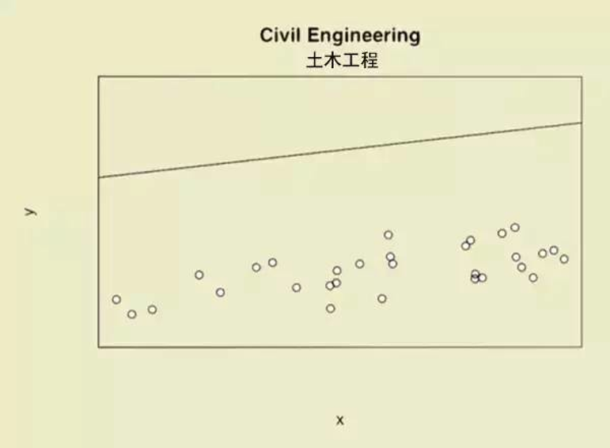
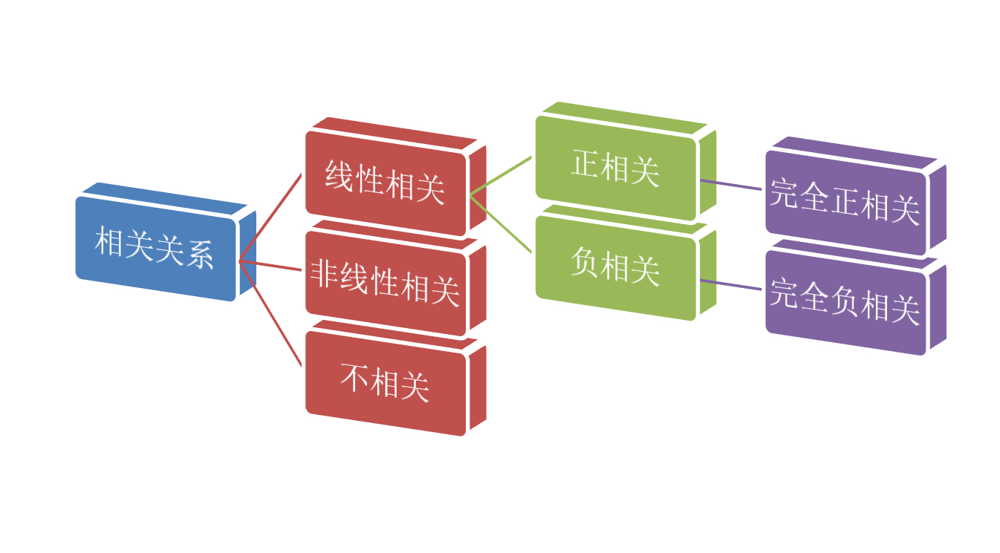
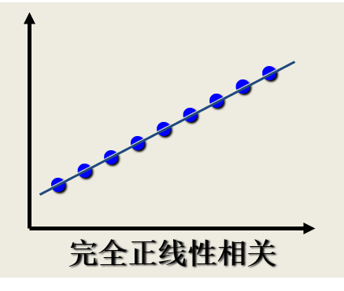
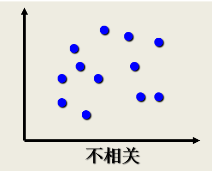
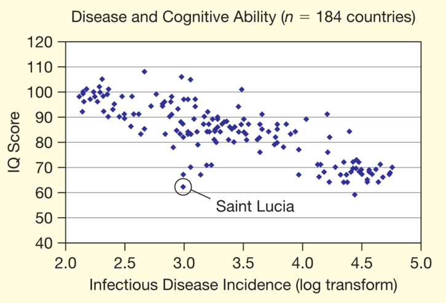
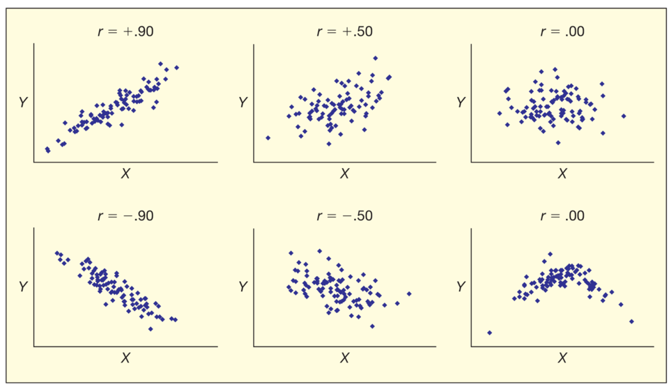

---
params:
  hideslide: FALSE
output:
  xaringan::moon_reader:
    seal: false
    lib_dir: libs
    css:
      - default
      - ../mycss/my-theme.css 
      - ../mycss/my-font.css
      - ../mycss/my-custom-for-video-roomy.css
      - ../mycss/text-box.css
      - duke-blue
      - hygge-duke
    nature:
      highlightStyle: github
      highlightLines: true
      countIncrementalSlides: false
      ratio: "16:9"
---
background-image: url("../pic/slide-front-page.jpg")
class: center,middle
exclude: `r params$hideslide`

# 统计学原理(Statistic)


## 5.1.1 变量间关系的度量


### 西北农林科技大学

### 经济管理学院数量经济教研室

### `r Sys.Date()`

```{r, echo=F,message=FALSE,warning=F, eval=!params$hideslide}
source("../R/set-global.R")
source("../R/xfun.R", encoding = "UTF-8")
source("../R/external-math-equation.R")
options(width = 70)
#source("../R/xaringan-chromote-print.R")
```


```{r , echo=FALSE, eval=!params$hideslide}
require('xaringanExtra')

xaringanExtra::use_tachyons()

xaringanExtra::use_panelset()

xaringanExtra::use_logo(
  image_url = "../pic/logo/nwafu-logo-circle-wb.png",
  height = '70px',
  position = xaringanExtra::css_position(top='0.2em',left="1em")
)
```


---
layout: true

<div class="my-header-h2"></div>

<div class="my-footer"><span> &emsp;&emsp; <a href="#chapter"> 第05章 相关和回归分析 </a> &emsp;&emsp;&emsp;&emsp;&emsp;&emsp;&emsp;&emsp;&emsp;&emsp;&emsp;&emsp;&emsp;&emsp;&emsp;&emsp;&emsp;&emsp;&emsp;&emsp;&emsp;&emsp;&emsp;&emsp;&emsp;&emsp;&emsp;&emsp;<a href="#corl"> 5.1 变量间关系的度量 </a> </span></div> 

---

### 为什么要关心变量间的关系？

希望回答的**现实问题**：

```{block, type= "fyi", echo =T}

- 我们感兴趣的变量之间是否存在关系？

- 如果存在关系，它们之间是什么样的关系？

- 变量之间的关系强度如何？如何表达？

- **样本**所反映的变量之间的关系能否代表变量之间的**总体**关系？

```


为回答上述问题，本节我们的主要学习内容为：

- [变量间关系的类型表达](#corl-vars)

- [相关关系的描述与测度](#corl-measure)

---

### （示例）变量间的关系：经济学专业解读

```{r, out.width= "60%"}
include_graphics("../pic/chpt05-intro-1-econ.png")
```

> “我们数据不少，做了很严格的回归，但异常值略多略多，符合理论的数值反而难找……”

---

### （示例）变量间的关系：金融学专业解读

```{r, out.width= "60%"}
include_graphics("../pic/chpt05-intro-2-fin.png")
```

> “我们的数据多如牛毛，无孔不入。即使做完回归，也会发现异常值和符合理论的数值多得不忍直视。”

---

### （示例）变量间的关系：土木工程专业解读

```{r, out.width= "60%"}

```

> “我们得要设计余量，所以理论设计得远高于实际承受……”


---

### （示例）变量间的关系：环境科学专业解读

```{r, out.width= "60%"}
include_graphics("../pic/chpt05-intro-5-eniron.png")
```

> “我们的理论和数据大致吻合，就是……应用范围仅限于这个小生态...”


---

### （示例）变量间的关系：社会学专业解读

```{r, out.width= "60%"}
include_graphics("../pic/chpt05-intro-8-sociology.png")
```

> “学海无涯苦作舟。那么多数据，那么多理论，慢慢学，恩……”

---

### （示例）变量间的关系：历史学专业解读

```{r, out.width= "60%"}
include_graphics("../pic/chpt05-intro-6-history.png")
```

> “数据虽然很多，可我们能用理论把他们统统连起来！”

---

### （示例）变量间的关系：物理学专业解读

```{r, out.width= "60%"}
include_graphics("../pic/chpt05-intro-4-physics.png")
```

> “我们的理论和数据严丝合缝，bingo！”

---

### （示例）变量间的关系：数学专业解读

```{r, out.width= "60%"}
include_graphics("../pic/chpt05-intro-9-math.png")
```

> “数据很少，但能建立理论～”

---

### （示例）变量间的关系：新闻学专业解读

```{r, out.width= "60%"}
include_graphics("../pic/chpt05-intro-10-journalism.png")
```

> “只有一个数据，也能建立理论……”

---

### （示例）变量间的关系：哲学专业解读

```{r, out.width= "60%"}
include_graphics("../pic/chpt05-intro-11-philosophy.png")
```

> “没有数据，依然建立理论……”


---
name: corl-vars

## 变量间的关系类型：函数关系

两个变量若存在是一一对应的**确定性**关系，则称二者具有**函数关系**。

```{block, type = "notes", echo =T}

设有两个变量
$X$和 
$Y$，变量
$Y$随变量
$X$一起变化，并完全依赖于
$X$，当变量
$X$取某个数值时， 
$Y$依确定的关系取相应的值，则称
$Y$是
$X$的函数，记为
$Y = f(X)$。

```


> 从**几何学**角度来看，数据集各观测点会落在一条理论曲线上。

---

### （示例）函数关系

对于函数关系，常见的例子包括：

```{block, type = "case", echo = T}

- 某种商品的销售额
$Y$与销售量
$X$之间的关系可表示为(
$P$为单价)：

$$Y_i = P_i\cdot X_i$$

- 圆的面积
$S$与半径
$R$之间的关系可表示为：

$$S = \pi R^2$$

- 企业的原材料消耗额
$Y$与产量
$X1$ 、单位产量消耗
$X2$ 、原材料价格
$X3$之间的关系可表示为：

$$Y = X_1 \cdot X_2 \cdot X_3$$

```

---

## 变量间的关系类型：相关关系

两个变量若存在是某种**非确定性**的联系，则称二者具有**相关关系**。

相关分析中的总体假定：

- 两个变量之间是线性关系

- 两个变量都是随机变量

```{r, out.width= "80%", fig.cap="相关关系的类型"}

```


---

### （示例）相关关系

对于相关关系，常见的例子包括：

```{block, type = "case", echo = T}
- 父亲身高
$Y$与子女身高
$X$之间的关系

- 粮食单位面积产量
$Y$与施肥量
$X1$ 、降雨量
$X2$、温度
$X3$之间的关系

- 收入水平
$Y$与受教育程度
$X$之间的关系

- 商品销售额
$Y$与广告费支出
$X$之间的关系

```


---

## 相关关系的类型：正相关

.fl.w-50[

```{r}

```
]

--

.fl.w-50[

```{r}
include_graphics("../pic/chpt05-scatter-p1.png")
```
]

---

## 相关关系的类型：负相关


.fl.w-50[

```{r}
include_graphics("../pic/chpt05-scatter-n0.png")
```

]

--

.fl.w-50[

```{r}
include_graphics("../pic/chpt05-scatter-n1.png")
```

]

---

## 相关关系的类型：非线性相关

.fl.w-50[

```{r}
include_graphics("../pic/chpt05-scatter-nonline.png")
```

]

--

.fl.w-50[

```{r}

```

]

---

## 相关关系的描述与测度：散点图

**散点图**是一种对变量间相关关系进行图形化展示的方法。

- 将两个变量对应的值在坐标系中用点表示出来。

- 根据点的分布规律或离散程度判断变量之间的相关性及其规律。

---

### 散点图示例1：两类油品价格的关系

```{r, out.width="90%"}
include_graphics("../pic/chpt05-scatter-oil-price.png")
```

---

### 散点图示例2：传染病与认知水平的关系

```{r, out.width="80%"}

```

---

### 散点图示例3：多种相关类型的散点图对比

```{r, out.width="90%"}

```

---
name: corl-measure

## 相关关系的描述与测度：相关系数

**相关系数**：是对变量之间**线性关系**强度的测度量。

```{block, type = "notes", echo = T}
根据**计算层次**可分为：

- 根据**样本**抽样数据计算，称为.red[**样本相关系数**]，记为
$r$。

- 根据**总体**全部数据计算，称为**总体相关系数**，记为
$\rho$。

```


.pull-left[

```{block, type = "notes", echo = T}
根据**计算方法**可分为：

- .red[**Pearson相关系数**]

- Spearman相关系数

- Kendall秩相关系数

```
]

.pull-right[

```{block, type = "notes", echo = T}
根据**变量数量**可分为：

- .red[**简单相关系数**]

- 偏相关系数
```

]

> 这里，我们重点学习**Pearson样本简单相关系数**。

---

## 相关关系的描述与测度：Pearson相关系数

这里，我们重点介绍Pearson样本简单相关系数的计算：

.mb1.pa1.bg-light-blue[

$$\begin{align}
r & = \frac{n \sum X_i Y_i -\sum X_i \sum Y_i}{\sqrt{n \sum X_i^{2}-\left(\sum X_i\right)^{2}} \cdot \sqrt{n \sum Y_i^{2}-\left(\sum Y_i\right)^{2}}} \tag{eq01}
\end{align}$$

]

.mb1.pa1.bg-light-blue[

$$\begin{align}
r & = \frac{ \sum{\left( (X_i - \overline{X})(Y_i - \overline{Y})\right ) } }{\sqrt{\sum{(X_i - \overline{X})^2 }\sum{(Y_i - \overline{Y})^2}}} 
= \frac{S S_{XY}}{\sqrt{S S_{XX}} \sqrt{S S_{YY}}}
= \frac{\sum{x_iy_i}}{\sqrt{\sum{x_i^2}\sum{y_i^2}}}
\tag{eq02}
\end{align}$$

]


.mb1.pa1.bg-lightest-blue[

$$\begin{align}
S S_{X X} =\sum_{i=1}^{n}\left(X_{i}-\overline{X}\right)^{2}  ;\quad 
S S_{Y Y} =\sum_{i=1}^{n}\left(Y_{i}-\overline{Y}\right)^{2}  ;\quad 
S S_{X Y}=\sum_{i=1}^{n}\left(X_{i}-\overline{X}\right)\left(Y_{i}-\overline{Y}\right)
\end{align}$$

]

---

## 相关关系的描述与测度：Pearson相关系数

Pearson相关系数具有如下性质：

```{block, type = "notes", echo = T}

**性质1**：
$r$的取值范围是
$[-1,1]$，
$|r|$越趋于1表示相关关系越强；
$|r|$越趋于0表示相关关系越弱。


- 如果
$|r|=1$，为完全相关。其中
$r =1$，为完全正相关；
$r =-1$，为完全负正相关

- 如果
$r = 0$，不存在线性相关关系

- 如果
$-1<r<0$，为负相关；如果
$0<r<1$，为正相关。
```

```{block, type = "notes", echo = T}

**性质2**：r具有对称性。即
$X$与
$Y$之间的相关系数和
$Y$与
$X$之间的相关系数相等，即
$r_{XY}= r_{YX}$。

```


---

## 相关关系的描述与测度：Pearson相关系数

Pearson相关系数具有如下性质：

```{block, type = "notes", echo = T}
**性质3**：
$r$数值大小与
$X$和
$Y$原点及尺度无关，即改变
$X$和
$Y$的数据原点及计量尺度，并不改变
$r$数值大小。
```

```{block, type = "notes", echo = T}
**性质4**：仅仅是
$X$与
$Y$之间线性关系的一个度量，它不能用于描述非线性关系。这意为着，
$r=0$只表示两个变量之间不存在线性相关关系，并不说明变量之间没有任何关系

```

```{block, type = "notes", echo = T}
**性质5**：
$r$虽然是两个变量之间线性关系的一个度量，却不一定意味着
$X$与
$Y$一定有因果关系。
```

---

## 相关关系的描述与测度：Pearson相关系数

下面给出实证研究时，对样本相关系数的经验解释：

```{block, type= "fyi", echo =T}

- 当
$|r|<0.8$时，可视为两个变量之间高度线性相关。

- 当
$0.5<|r|<0.8$时，可视为中度线性相关。

- 当
$0.3<|r|<0.5$时，视为低度线性相关。

- 当
$|r|<0.3$时，认为两个变量之间的相关程度极弱。


```

> 当然，上述解释必须建立在对相关系数的显著性进行统计检验的基础之上。

---
layout:false
background-image: url("../pic/thank-you-gif-funny-little-yellow.gif")
class: inverse,center
# 本节结束
