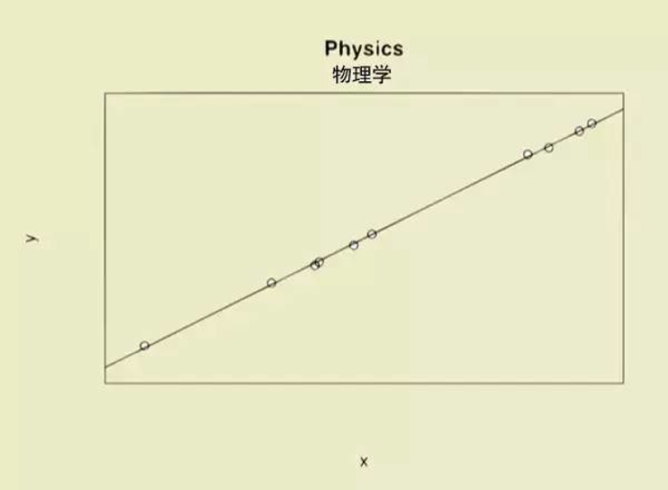
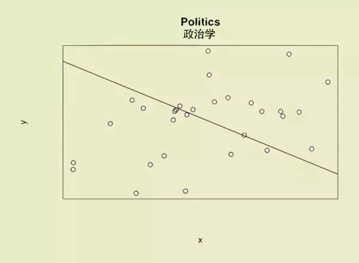
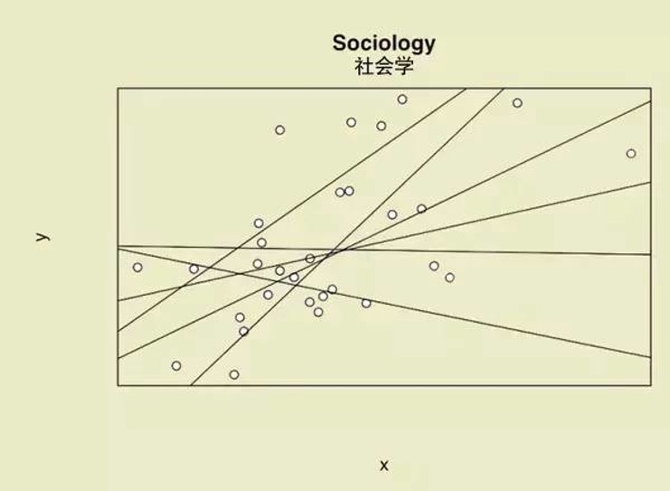
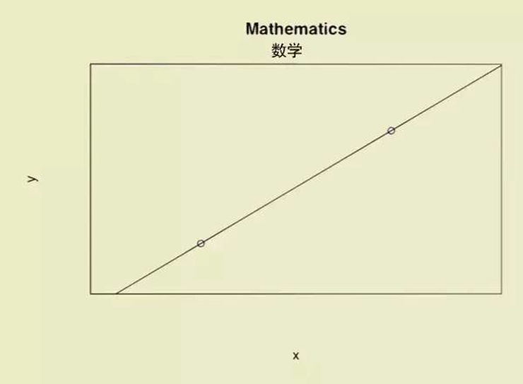
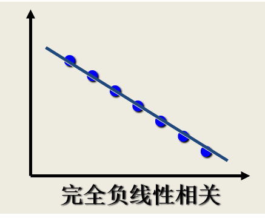
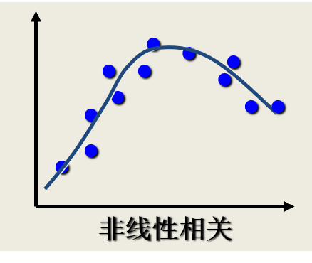

---
params:
  hideslide: FALSE
output:
  xaringan::moon_reader:
    seal: false
    lib_dir: libs
    css:
      - default
      - ../mycss/my-theme.css 
      - ../mycss/my-font.css
      - ../mycss/my-custom-for-video-roomy.css
      - ../mycss/text-box.css
      - duke-blue
      - hygge-duke
    nature:
      highlightStyle: github
      highlightLines: true
      countIncrementalSlides: false
      ratio: "16:9"
---
background-image: url("../pic/slide-front-page.jpg")
class: center,middle
exclude: `r params$hideslide`

# 统计学原理(Statistic)

<!---    chakra: libs/remark-latest.min.js --->

### 胡华平

### 西北农林科技大学

### 经济管理学院数量经济教研室

### huhuaping01@hotmail.com

### `r Sys.Date()`

```{r, echo=F,message=FALSE,warning=F, eval=!params$hideslide}
source("../R/set-global.R")
source("../R/xfun.R", encoding = "UTF-8")
source("../R/external-math-equation.R")
options(width = 70)
#source("../R/xaringan-chromote-print.R")
```


```{r , echo=FALSE, eval=!params$hideslide}
require('xaringanExtra')

xaringanExtra::use_tachyons()

xaringanExtra::use_panelset()

xaringanExtra::use_logo(
  image_url = "../pic/logo/nwafu-logo-circle-wb.png",
  height = '70px',
  position = xaringanExtra::css_position(top='0.2em',left="1em")
)
```

---
class: center, middle, duke-orange,hide_logo
name:chapter
exclude: `r params$hideslide`

# 第五章 相关和回归分析


### [.white[5.1 变量间关系的度量]](#corl)

### [5.2 回归分析的基本思想](#concept)

### [5.3 OLS方法与参数估计](#ols)

### [5.4 假设检验](#hypthesis)

### [5.5 拟合优度与残差分析](#goodness)

### [5.6 回归预测分析](#forecast)

### [5.7 回归报告解读](#report)

---
layout: false
class: center, middle, duke-softblue,hide_logo
name: corl

# 5.1 变量间关系的度量

### [变量间的关系](#corl-vars)

### [相关关系的描述与测度](#corl-measure)

### [相关系数的显著性检验](#corl-test)

---
layout: true

<div class="my-header-h2"></div>

<div class="watermark1"></div>

<div class="watermark2"></div>

<div class="watermark3"></div>

<div class="my-footer"><span>huhuaping@  &emsp;&emsp; <a href="#chapter"> 第05章 相关和回归分析 </a>
&emsp;&emsp;&emsp;&emsp;&emsp;&emsp;&emsp;&emsp;&emsp;&emsp;&emsp;&emsp;&emsp;&emsp;&emsp;&emsp;&emsp;&emsp;&emsp;&emsp;&emsp;
<a href="#corl"> 5.1 变量间关系的度量 </a> </span></div> 

---

### （示例）变量间的关系：经济学专业解读

```{r, out.width= "60%"}
include_graphics("../pic/chpt05-intro-1-econ.png")
```

> “我们数据不少，做了很严格的回归，但异常值略多略多，符合理论的数值反而难找……”

---

### （示例）变量间的关系：金融学专业解读

```{r, out.width= "60%"}
include_graphics("../pic/chpt05-intro-2-fin.png")
```

> “我们的数据多如牛毛，无孔不入。即使做完回归，也会发现异常值和符合理论的数值多得不忍直视。”

---

### （示例）变量间的关系：土木工程专业解读

```{r, out.width= "60%"}
include_graphics("../pic/chpt05-intro-3-engine.png")
```

> “我们得要设计余量，所以理论设计得远高于实际承受……”

---

### （示例）变量间的关系：物理学专业解读

```{r, out.width= "60%"}

```

> “我们的理论和数据严丝合缝，bingo！”

---

### （示例）变量间的关系：环境科学专业解读

```{r, out.width= "60%"}
include_graphics("../pic/chpt05-intro-5-eniron.png")
```

> “我们的理论和数据大致吻合，就是……应用范围有点蛋疼。”

---

### （示例）变量间的关系：历史学专业解读

```{r, out.width= "60%"}
include_graphics("../pic/chpt05-intro-6-history.png")
```

> “数据虽然很多，可我们能用理论把他们统统连起来！”

---

### （示例）变量间的关系：政治学专业解读

```{r, out.width= "60%"}

```

> “世界大势一日三变，尽管我们数据不少，可……我们的理论跟数据趋势是反着来的……”

---

### （示例）变量间的关系：社会学专业解读

```{r, out.width= "60%"}

```

> “学海无涯苦作舟。那么多数据，那么多理论，慢慢学，恩……”

---

### （示例）变量间的关系：数学专业解读

```{r, out.width= "60%"}

```

> “数据很少，但能建立理论～”

---

### （示例）变量间的关系：新闻学专业解读

```{r, out.width= "60%"}
include_graphics("../pic/chpt05-intro-10-journalism.png")
```

> （示例）“只有一个数据，也能建立理论……”

---

### （示例）变量间的关系：哲学专业解读

```{r, out.width= "60%"}
include_graphics("../pic/chpt05-intro-11-philosophy.png")
```

> “没有数据，依然建立理论……”


---

### （示例）变量间的关系：文学批评专业解读

```{r, out.width= "60%"}
include_graphics("../pic/chpt05-intro-12-literary.png")
```

> “如图所示，你懂的……”

---
name: corl-vars

## 变量间的关系：函数关系

两个变量若存在是一一对应的确定关系，则称之为二者具有**函数关系**。

```{block, type = "notes", echo =T}

设有两个变量
$X$和 
$Y$，变量
$Y$随变量
$X$一起变化，并完全依赖于
$X$，当变量
$X$取某个数值时， 
$Y$依确定的关系取相应的值，则称
$Y$是
$X$的函数，记为
$Y = f(X)$，其中
$X$称为自变量，
$Y$称为因变量。

```


> 从**几何学**角度来看，数据集各观测点会落在一条曲线上。

---

### （示例）函数关系

某种商品的销售额
$Y$与销售量
$X$之间的关系可表示为(
$P$为单价)：

$$Y_i = P_i\cdot X_i$$

圆的面积
$S$与半径
$R$之间的关系可表示为：

$$S = \pi R^2$$

企业的原材料消耗额
$Y$与产量
$X1$ 、单位产量消耗
$X2$ 、原材料价格
$X3$之间的关系可表示为：

$$Y = X_1 \cdot X_2 \cdot X_3$$

---

## 变量间的关系：相关关系(correlation)

```{r, out.width= "90%", fig.cap="相关关系的类型"}
include_graphics("../pic/chpt05-measure-rel.png")
```


---

### （示例）相关关系

```{block, type = "case", echo = T}
- 父亲身高
$Y$与子女身高
$X$之间的关系

- 收入水平
$Y$与受教育程度
$X$之间的关系

- 粮食单位面积产量
$Y$与施肥量
$X1$ 、降雨量
$X2$、温度
$X3$之间的关系

- 商品的消费量
$Y$与居民收入
$X$之间的关系

- 商品销售额
$Y$与广告费支出
$X$之间的关系

```


---

## 相关关系的描述与测度：问题与假定

相关分析要解决的问题：

- 变量之间是否存在关系？

- 如果存在关系，它们之间是什么样的关系？

- 变量之间的关系强度如何？

- 样本所反映的变量之间的关系能否代表总体变量之间的关系？

相关分析中的总体假定：

- 两个变量之间是线性关系

- 两个变量都是随机变量

---

## 相关关系的描述与测度：散点图

.fl.w-50[

```{r}
include_graphics("../pic/chpt05-scatter-p0.png")
```
]

--

.fl.w-50[

```{r}
include_graphics("../pic/chpt05-scatter-p1.png")
```
]

---

## 相关关系的描述与测度：散点图


.fl.w-50[

```{r}

```

]

--

.fl.w-50[

```{r}
include_graphics("../pic/chpt05-scatter-n1.png")
```

]

---

## 相关关系的描述与测度：散点图

.fl.w-50[

```{r}

```

]

--

.fl.w-50[

```{r}
include_graphics("../pic/chpt05-scatter-independence.png")
```

]

---

## 相关关系的描述与测度：散点图

```{r, out.width="90%"}
include_graphics("../pic/chpt05-scatter-all-cases.png")
```

---

### （示例）两类油价的散点图

```{r, out.width="90%"}
include_graphics("../pic/chpt05-scatter-oil-price.png")
```

---

### （示例）传染病与认知水平的散点图

```{r, out.width="80%"}
include_graphics("../pic/chpt05-scatter-disease.png")
```

---
name: corl-measure

## 相关关系的描述与测度：相关系数

**相关系数**(correlation coefficient)：是度量变量之间关系强度的一个统计量。

- 它是对两个变量之间线性相关强度的一种度量。

- 一般称为**简单相关系数**，也称为**线性相关系数**(linear correlation coefficient) 。

- 或称为**Pearson相关系数**(Pearson’s correlation coefficient) 。

相关系数记号表达：

- 若相关系数是根据总体全部数据计算的，称为总体相关系数，记为
$\rho$。

- 若是根据样本数据计算的，则称为样本相关系数，简称为相关系数，记为
$r$。


---

## 相关关系的描述与测度：计算公式

.mb1.pa1.bg-light-blue[
简单相关系数的大FF计算公式：

$$\begin{align}
r & = \frac{n \sum X_i Y_i -\sum X_i \sum Y_i}{\sqrt{n \sum X_i^{2}-\left(\sum X_i\right)^{2}} \cdot \sqrt{n \sum Y_i^{2}-\left(\sum Y_i\right)^{2}}} \tag{eq01}
\end{align}$$

]

.mb1.pa1.bg-light-blue[
简单相关系数的小ff计算公式：

$$\begin{align}
r & = \frac{ \sum{\left( (X_i - \overline{X})(Y_i - \overline{Y})\right ) } }{\sqrt{\sum{(X_i - \overline{X})^2 }\sum{(Y_i - \overline{Y})^2}}} 
= \frac{S S_{XY}}{\sqrt{S S_{XX}} \sqrt{S S_{YY}}}
= \frac{\sum{x_iy_i}}{\sqrt{\sum{x_i^2}\sum{y_i^2}}}
\tag{eq02}
\end{align}$$

]


.mb1.pa1.bg-lightest-blue[

$$\begin{align}
S S_{X X} =\sum_{i=1}^{n}\left(X_{i}-\overline{X}\right)^{2}  ;\quad 
S S_{Y Y} =\sum_{i=1}^{n}\left(Y_{i}-\overline{Y}\right)^{2}  ;\quad 
S S_{X Y}=\sum_{i=1}^{n}\left(X_{i}-\overline{X}\right)\left(Y_{i}-\overline{Y}\right)
\end{align}$$

]


---

## 相关关系的描述与测度：特征

简单相关系数的特征：

**性质1**：
$r$的取值范围是
$[-1,1]$，
$|r|$越趋于1表示相关关系越强；
$|r|$越趋于0表示相关关系越弱。


- 如果
$|r|=1$，为完全相关。其中
$r =1$，为完全正相关；
$r =-1$，为完全负正相关

- 如果
$r = 0$，不存在线性相关关系

- 如果
$-1<r<0$，为负相关；如果
$0<r<1$，为正相关。


**性质2**：r具有对称性。即
$X$与
$Y$之间的相关系数和
$Y$与
$X$之间的相关系数相等，即
$r_{XY}= r_{YX}$。

---

## 相关关系的描述与测度：特征

简单相关系数的特征：

**性质3**：
$r$数值大小与
$X$和
$Y$原点及尺度无关，即改变
$X$和
$Y$的数据原点及计量尺度，并不改变
$r$数值大小。

**性质4**：仅仅是
$X$与
$Y$之间线性关系的一个度量，它不能用于描述非线性关系。这意为着，
$r=0$只表示两个变量之间不存在线性相关关系，并不说明变量之间没有任何关系

**性质5**：
$r$虽然是两个变量之间线性关系的一个度量，却不一定意味着
$X$与
$Y$一定有因果关系。

---

## 相关关系的描述与测度：解释


```{block, type= "fyi", echo =T}

下面给出实证研究时，对相关系数的经验解释：

- 当
$|r|<0.8$时，可视为两个变量之间高度相关。

- 当
$0.5<|r|<0.8$时，可视为中度相关。

- 当
$0.3<|r|<0.5$时，视为低度相关。

- 当
$|r|<0.3$时，说明两个变量之间的相关程度极弱，可视为不相关。

而且上述解释必须建立在对相关系数的显著性进行检验的基础之上。

```

---

## 相关关系的描述与测度：简单相关系数


**简单相关系数**（simple correlation coefficient）：

.pull-left[

- 
$Y_i$和
$X_{2i}$之间的相关系数：

$$\begin {align}
r_{12}=\frac{\sum y_{i} x_{2 i}}{\sqrt{\sum y_{i}^{2}} \sqrt{\sum x_{2 i}^{2}}}
\end {align}$$

- 
$Y_i$和
$X_{3i}$之间的相关系数：

$$\begin {align} 
r_{13}=\frac{\sum y_{i} x_{3 i}}{\sqrt{\sum y_{i}^{2}} \sqrt{\sum x_{3 i}^{2}}}
\end {align}$$

]

.pull-right[

- 
$X_{2i}$和
$X_{3i}$之间的相关系数：

$$\begin {align} 
r_{23}=\frac{\sum x_{2 i} x_{3 i}}{\sqrt{\sum x_{2 i}^{2}} \sqrt{\sum x_{3 i}^{2}}}
\end {align}$$

]

---

## 相关关系的描述与测度：偏相关系数


**偏相关系数**（partial correlation coefficient）：
一个不依赖于
$X_{2i}$的，对
$X_{3i}$和
$Y_i$的影响的一种相关系数。

.pull-left[

- 保持
$X_{3i}$不变，
$Y_i$和
$X_{2i}$之间的相关系数：

$$\begin {align} 
r_{12 \cdot 3}=\frac{r_{12}-r_{13} r_{23}}{\sqrt{\left(1-r_{13}^{2}\right)\left(1-r_{23}^{2}\right)}}
\end {align}$$

- 保持
$X_{2i}$不变，
$Y_i$和
$X_{3i}$之间的相关系数：

$$\begin {align} 
r_{13.2}=\frac{r_{13}-r_{12} r_{23}}{\sqrt{\left(1-r_{12}^{2}\right)\left(1-r_{23}^{2}\right)}}
\end {align}$$

]

.pull-right[

- 保持
$Y_i$不变，
$X_{2i}$和
$X_{3i}$之间的相关系数：

$$\begin {align} 
r_{23.1}=\frac{r_{23}-r_{12} r_{13}}{\sqrt{\left(1-r_{12}^{2}\right)\left(1-r_{13}^{2}\right)}}
\end {align}$$

]

---
name: corl-test

## 相关系数的显著性检验

**相关系数的显著性检验**，是指检验两个变量之间是否存在线性相关关系。

相关系数的显著性检验方法包括：

- 等价于对回归斜率系数
$\beta_1$的检验（仅针对一元回归）

- 采用R. A. Fisher提出的t检验

---

## 相关系数的显著性检验

相关系数的显著性检验步骤：

1）提出假设：
$H_0: \rho =0; H_1: \rho \neq 0$

2）计算样本统计量

$$T^{\ast} = |r|\sqrt{\frac{n-2}{1-r^2}} \quad \sim t(n-2)$$

3）给定显著性水平
$\alpha$，确定t理论分布值
$t_{1-\alpha/2}(n-2)$。

4）得到假设检验结论：

- 若
$T^{\ast}> t_{1-\alpha/2}(n-2)$，则拒绝
$H_0$，认为显著存在相关关系；

- 若
$T^{\ast} < t_{1-\alpha/2}(n-2)$，则无法拒绝
$H_0$，认为相关关系不显著。

---

exclude: true

## （案例）银行贷款

```{r}
source("Rscript/case-loan.R", encoding = "UTF-8")
```


---

### （案例）银行贷款：案例数据

**案例说明**：某银行共有`r n`家分行，分行及所在地区的相关变量数据如下表所示。

```{r}
df_loan %>%
  datatable(options = list(dom = "tip", pageLength = 7,
                           scrollX = TRUE)) 
```

.footnote[**说明**：上述变量的含义分别是`r str_compose(names_eng, names_chn)`。]

---

### （案例）银行贷款：不良贷款VS贷款余额的散点图

```{r, fig.cap="不良贷款VS贷款余额散点图"}

df_loan %>%
  ggplot(aes(loan.surplus, loan.bad)) +
  geom_point(size = 4) +
  labs(x = "贷款余额 loan.surplus（亿元）",
       y = "不良贷款 loan.bad（亿元）") +
  theme(text = element_text(size = 16))
  
```


---

### （案例）银行贷款：不良贷款VS贷款余额的相关系数（大FF）


```{r}
df_rel1 %>%
  rename_at(vars(c("loan.bad", "loan.surplus")),
            ~all_of(c("Y" ,"X"))) %>%
  select(1:6) %>%
  janitor::adorn_totals("row") %>%
  datatable(caption = "大FF计算表",
            options = list(dom = "tip", pageLength = 7,
                           scrollX = TRUE)) %>%
  formatRound(c(4:6), digits = 2)
```


---

### （案例）银行贷款：不良贷款VS贷款余额的相关系数（大FF）

相关系数
$r$的大FF计算公式（`eq01`）：


$$\begin{align}
r & = \frac{n \sum X_i Y_i -\sum X_i \sum Y_i}{\sqrt{n \sum X_i^{2}-\left(\sum X_i\right)^{2}} \cdot \sqrt{n \sum Y_i^{2}-\left(\sum Y_i\right)^{2}}} \\
& = \frac{`r n` \times `r tot_XY` - `r tot_X` \times `r tot_Y`}{\sqrt{`r n` \times `r tot_XX`-\left(`r tot_X`\right)^2} \cdot \sqrt{`r n` \times `r tot_YY`-\left( `r tot_Y`\right)^{2}}}  \\
& = `r num_round(r_12)`
\end{align}$$


---

### （案例）银行贷款：不良贷款VS贷款余额的相关系数（小ff）


```{r}
df_rel1 %>%
  rename_at(vars(c("loan.bad", "loan.surplus")),
            ~all_of(c("Y" ,"X"))) %>%
  select(1:3,7:11) %>%
  janitor::adorn_totals("row") %>%
  datatable(caption = "小ff计算表",
            options = list(dom = "tip", pageLength = 7,
                           scrollX = TRUE)) %>%
  formatRound(c(4:8), digits = 2)
```


---

### （案例）银行贷款：不良贷款VS贷款余额的相关系数

相关系数
$r$的小FF计算公式（`eq02`）：

$$\begin{align}
r & = \frac{ \sum{\left( (X_i - \overline{X})(Y_i - \overline{Y})\right ) } }{\sqrt{\sum{(X_i - \overline{X})^2 (Y_i - \overline{Y})^2}}} \\
& = \frac{\sum{x_i y_i}}{\sqrt{\sum{x_i^2}\sum{y_i^2}}} \\
& = \frac{`r sum_xy`}{\sqrt{ `r sum_xx` \times `r sum_yy`}} \\
& = `r num_round(r_12)`
\end{align}$$


---

### （案例）银行贷款：相关系数矩阵表(Pearson)

```{r, echo=TRUE, comment="#` "}
corl_pearson<- round(cor(df_loan[,-1], method = "pearson"),4) 
corl_pearson[upper.tri(corl_pearson)]<- NA
```


```{r, eval=T, warning=FALSE}
# rowname to column
tbl_flex <- corl_pearson %>%  
  as.data.frame() %>%
  rownames_to_column(var = " ") 

# conditions
colormatrix <- ifelse((tbl_flex[, -1] < 0.7), "black", 
                      ifelse((tbl_flex[, -1] < 0.8), "orange",
                             ifelse((tbl_flex[, -1] < 1),"red", "black")))

tbl_flex %>%
  flextable::flextable() %>%
  align(align ='center', part = 'all') %>% 
  colformat_double(j = 2:6, digits =4)%>%
  fontsize(size = 19, part = "all") %>%
  color(j = 2:6, color=colormatrix) %>%
  flextable::set_caption(caption = "Pearson相关系数矩阵") %>%
  autofit()

```

---

### （案例）银行贷款：相关系数矩阵(Spearman)

```{r, echo=TRUE, comment="#` "}
corl_spearman<- round(cor(df_loan[,-1], method = "spearman"),4) 
corl_spearman[upper.tri(corl_spearman)] <- NA
```

```{r, eval=T, warning=FALSE}
# rowname to column
tbl_flex <- corl_spearman %>%  
  as.data.frame() %>%
  rownames_to_column(var = " ") 

tbl_flex %>%
  flextable::flextable() %>%
  align(align ='center', part = 'all') %>% 
  colformat_double(j = 2:6, digits =4)%>%
  fontsize(size = 19, part = "all") %>%
  color(j = 2:6, color=colormatrix) %>%
  flextable::set_caption(caption = "Spearman相关系数矩阵") %>%
  autofit()

```

---

### （案例）银行贷款：相关系数矩阵图

```{r, out.width="99%"}
#remotes::install_github("r-link/corrmorant")
require("corrmorant")
corrmorant::corrmorant(df_loan[,-1], style = "binned")+
  theme_dark() +
  theme(text = element_text(size = 14))

```

???

参考：[Correlation Analysis Different Types of Plots in R](https://finnstats.com/index.php/2021/05/13/correlation-analysis-plot/)

---

### （案例）银行贷款：相关系数矩阵图

```{r, out.width="99%"}
ggcorrm(data = df_loan[,-1]) +
  lotri(geom_point(alpha = 0.5)) +
  lotri(geom_smooth()) +
  utri_heatmap() +
  utri_corrtext() +
  dia_names(y_pos = 0.15, size = 3) +
  dia_histogram(lower = 0.3, fill = "grey80", color = 1) +
  scale_fill_corr() +
  theme(text = element_text(size = 14))
```


---

### （案例）银行贷款：偏相关系数

假定我们认为不良贷款（`loan.bad`）与贷款余额（`loan.surplus`）及贷款项目数（`loan.number`）存在相互关系。


前面我们已经计算出如下的简单相关系数：
$$r_{12} = r_{_{bad},_{sur}}= `r num_round(r_12)`; \quad r_{13} = r_{_{bad},_{num}}= `r num_round(r_13)`; \quad r_{23} = r_{_{num},_{sur}}= `r num_round(r_23)`$$

因此我们可以分别计算出**偏相关系数**

---

### （案例）银行贷款：偏相关系数

- 保持
$X_{3i}$不变，
$Y_i$和
$X_{2i}$之间的相关系数：

$$\begin {align} 
r_{12 \cdot 3}=\frac{r_{12}-r_{13} r_{23}}{\sqrt{\left(1-r_{13}^{2}\right)\left(1-r_{23}^{2}\right)}}
=\frac{`r r_12`-`r r_13`\times `r r_23`}{\sqrt{\left(1-`r r_13`^{2}\right)\left(1-`r r_23`^{2}\right)}}
= `r num_round(r12.3)`
\end {align}$$

- 保持
$X_{2i}$不变，
$Y_i$和
$X_{3i}$之间的相关系数：

$$\begin {align} 
r_{13.2}=\frac{r_{13}-r_{12} r_{23}}{\sqrt{\left(1-r_{12}^{2}\right)\left(1-r_{23}^{2}\right)}} 
=\frac{`r r_13`-`r r_12` \times `r r_23`}{\sqrt{\left(1-`r r_12`^{2}\right)\left(1-`r r_23`^{2}\right)}} 
= `r num_round(r13.2)`
\end {align}$$

- 保持
$Y_i$不变，
$X_{2i}$和
$X_{3i}$之间的相关系数：

$$\begin {align} 
r_{23.1}=\frac{r_{23}-r_{12} r_{13}}{\sqrt{\left(1-r_{12}^{2}\right)\left(1-r_{13}^{2}\right)}}
=\frac{`r r_23`-`r r_12` \times  `r r_13`}{\sqrt{\left(1-`r r_12`^{2}\right)\left(1-`r r_13`^{2}\right)}} 
= `r num_round(r23.1)`
\end {align}$$


---

### （案例）银行贷款：相关系数显著性检验(手算)

对于前述`loan.surplus`与`loan.bad`进行相关系数显著性检验（Pearson）：

- 1）提出假设：
$H_0: \rho =0; H_1: \rho \neq 0$

- 2）计算样本统计量：

$$\begin{align}
T^{\ast} = |r|\sqrt{\frac{n-2}{1-r^2}} 
=`r abs(r_12)` \times \sqrt{\frac{`r n`-2}{1-`r r_12`^2}}
= `r t_r`
\end{align}$$

- 3）给定显著性水平
$\alpha=0.05$，确定t理论分布值
$t_{1-\alpha/2}(n-2)=t_{1-0.05/2}(25-2)=t_{0.975}(`r n-2`)=`r round(qt(0.975,23),2)`$。

- 4）得到假设检验结论：因为t样本统计量大于t理论查表值，也即

$$\left[T^{\ast}= `r t_r`\right] > \left[t_{0.975}(`r n-2`) =`r round(qt(0.975,23),2)`\right]$$

因此拒绝原假设
$H_0$，认为变量`loan.surplus`（贷款余额）与`loan.bad`（不良贷款）显著存在相关关系。


---

### （案例）银行贷款：相关系数显著性检验(R软件)

我们可以使用R软件函数`cor.test()`对上述两个变量进行相关系数显著性检验：

```{r, echo=TRUE}
cor.test(df_rel1$loan.surplus, df_rel1$loan.bad,
         method = "pearson")
```

---
layout:false
background-image: url("../pic/thank-you-gif-funny-little-yellow.gif")
class: inverse,center
# 本节结束
