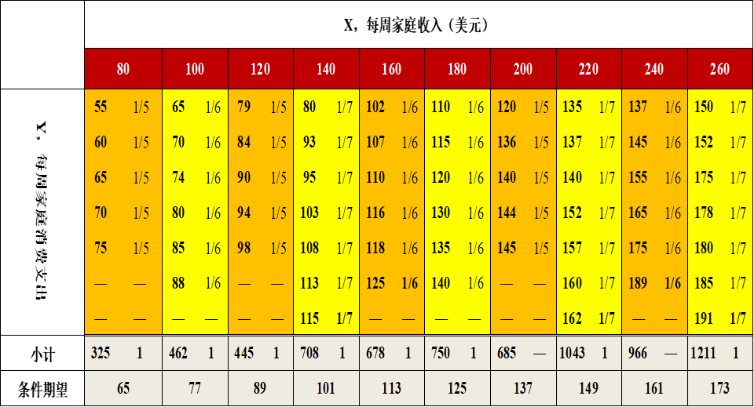

---
params:
  hideslide: FALSE
output:
  xaringan::moon_reader:
    seal: false
    lib_dir: libs
    css:
      - default
      - ../mycss/my-theme.css 
      - ../mycss/my-font.css
      - ../mycss/my-custom-for-video-roomy.css
      - ../mycss/text-box.css
      - duke-blue
      - hygge-duke
    nature:
      highlightStyle: github
      highlightLines: true
      countIncrementalSlides: false
      ratio: "16:9"
---
background-image: url("../pic/slide-front-page.jpg")
class: center,middle
exclude: `r params$hideslide`

# 统计学原理(Statistic)

## 5.2.1 回归分析的基本概念

### 西北农林科技大学

### 经济管理学院数量经济教研室


### `r Sys.Date()`

```{r , echo=F,message=FALSE,warning=F, eval=!params$hideslide}
source("../R/set-global.R")
source("../R/xfun.R", encoding = "UTF-8")
source("../R/external-math-equation.R")
options(width = 70)
#source("../R/xaringan-chromote-print.R")
```


```{r , echo=FALSE, eval=!params$hideslide}
require('xaringanExtra')

xaringanExtra::use_tachyons()

xaringanExtra::use_panelset()

xaringanExtra::use_logo(
  image_url = "../pic/logo/nwafu-logo-circle-wb.png",
  height = '70px',
  position = xaringanExtra::css_position(top='0.2em',left="1em")
)
```


---
layout: true

<div class="my-header-h2"></div>

<div class="my-footer"><span>  &emsp;&emsp; <a href="#chapter"> 第05章 相关和回归分析 </a> &emsp;&emsp;&emsp;&emsp;&emsp;&emsp;&emsp;&emsp;&emsp;&emsp;&emsp;&emsp;&emsp;&emsp;&emsp;&emsp;&emsp;&emsp;&emsp;&emsp;&emsp;&emsp;&emsp;&emsp;&emsp;&emsp;&emsp;&emsp;<a href="#concept"> 5.2.1 回归分析的基本思想 </a> </span></div> 


---

## 回归分析的内涵：历史渊源

皮尔逊和高尔顿的身高数据（1888年）：

```{r}

```
???

相信大家经常听到“回归”这个概念。那么它是有什么来头呢？

这里首先给大家展示一张来自1988年的数据统计表，它是当年由皮尔逊和高尔顿等收集得到的身高数据。

请大家先观察一下这张表格，想一想它会跟“回归”有什么渊源么？

---

## 回归分析的内涵：回归到中等

```{block, type = "notes", echo = T}

高尔顿的发现：给定父母的身高

- 父母高，儿女也高；父母矮，儿女也矮
- 子辈的平均身高趋向于或者“回归”到全体人口的平均身高。
```

```{block, type = "notes", echo = T}
皮尔逊的证实：父亲高的群体VS父亲矮的群体

- 父亲高的群体，子辈平均身高要低于其父辈；
- 父亲矮的群体，子辈平均身高要高于其父辈。

```

> 简言之，群体身高具有“回归到中等”(regression to mediocrity)的趋势，**回归**由此而得名。

---

## 回归分析的内涵：现代解释

使用现代的科学术语，我们认为：

- 简单地，回归分析研究被解释变量（Y）对一个或多个解释变量（X）之间的依赖关系及规律性。


- 正式地，回归分析通过解释变量（抽样样本中）的观测值（X），去估计和（或）预测被解释变量（Y）的**均值**（条件期望）。

???

下面我们将进一步介绍如何准确地表达和理解回归分析的本质。

---
exclude: true

## （案例）微型家庭总体

<!---新数据表--->

```{r}
source("Rscript/case-familiy60.R", 
       encoding = "UTF-8")
X_spc <- 120
Y_spc <- pivot_exp$exp.Y[which(pivot_exp$X==X_spc)]
```


---

## 总体中的回归分析：假想总体示例1


```{r, fig.cap="60个家庭的收入和支出情况：假设的总体"}
include_graphics("../pic/extra/chpt2-1-60families-pop.png",dpi=160)
```

???

首先，我们一起先进入一个假想的微型“总体”世界。

在这个假想的微型“总体”世界，总共有60个家庭，每个家庭都有各自的收入X和对应的支出Y。


---

## 总体中的回归分析：假想总体示例2


```{r}
datatable(fams60, options = list(pageLength =9, dom ="t"), caption = "60个家庭的收入和支出情况：假想的总体")
```

???

通过上面这个标准的表格，我们展示这个假想微型总体的全部信息。

---

## 总体中的回归分析：假想总体示例3

```{r, out.width="90%"}
# the population points
p1<- ggplot() +
  geom_point(data = fams60_long,
             aes(x=X,  y=Y,color= "Y", shape="Y"),size=3) +
  scale_colour_manual(name= "",
                      values =c("blue")) +
  scale_shape_manual(name= "",
                      values =c(1)) +
  scale_x_continuous(breaks=seq(80,260, length=10)) +
  labs(x="家庭收入X", y="家庭支出Y") +
  theme(text = element_text(size=18),
        axis.title.x = element_text(size = 16,
                                margin = margin(t = 15, r = 0, 
                                                b = 0, l = 0)),
        axis.title.y = element_text(size = 16,
                                margin = margin(t = 0, r = 15, 
                                                b = 0, l = 0)))

p1
```

???


通过上面这个绘图，我们可以更直观地展示这个假想微型总体。

那么我们现在的问题是：通过什么方式，才能表达家庭收入X影响家庭支出Y的规律性呢？

换言之，如何才能刻画或表达客观现象背后的规律性？

---

## 总体中的回归分析：条件概率和条件期望

**条件概率**：

- 定义：给定变量
$X_i$的取值条件下，
$Y_i$出现的可能性。

- 记号：离散变量
$P(Y_i|X_i)$；连续变量
$g(Y|X)$


**条件期望**：

- 在给定变量
$X_i$的取值条件下，
$Y_i$的期望值。

- 记号：
$g(Y|X)$表示连续变量的条件概率密度函数（cdf）

$$\begin{align}
E(Y|X_i) &= \sum_1^N{(Y_i|X_i) \cdot P(Y_i|X_i)} &&\text{(离散情形)} \\
E(Y|X_i) &= \int{(Y|X) \cdot g(Y|X)dY} &&\text{(连续情形)} \end{align}$$

???
这里，我们给出一组很重要的概念，统计学家将利用它来作为刻画和表达现象规律性的基本逻辑起点。


---

### （示例）条件概率和条件期望的计算

```{r, out.width="90%",fig.cap="条件概率和条件期望"}

```

???
根据前述条件概率和条件期望的公式，我们很快可以计算得到微型总体世界中，给定家庭收入条件下的平均家庭支出，也即家庭支出条件期望值。

---

### （示例）给定不同X水平下Y条件期望值

```{r, fig.height= 5.5}
# the expect points
p2 <- p1 +
  geom_point(data = pivot_exp, 
             aes(x=X, y=exp.Y,
                 color= "E(Y|X)",shape= "E(Y|X)"), size=3) +
  scale_colour_manual(name= "",
                      values =c("red","blue")) +
  scale_shape_manual(name= "",values =c(19,1)) 

p2
```


```{r}
kable(exp_cond) %>%
  kable_styling(full_width =T)
```

???

我们把上述条件期望值计算结果绘制到图形中，就可以更加直观地看到它的作用。

简单地，上述条件期望值是在给定收入条件下的平均支出水平，表达了特定收入家庭群体的平均支出情况。

也可以说，条件期望值将能很好地“代表”子群体的平均水平。

---

## 总体中的回归分析：总体回归线（PRL）

**总体回归线**(Population Regression Line，PRL)：将所有条件期望值的轨迹连接成一条线。

- 几何：给定X值时Y的条件期望值的轨迹。

- 统计：实质上就是Y对X的回归。


---

### （示例）总体回归线（PRL）

```{r, out.width="90%", fig.cap="总体回归线PRL"}
p_PRL <- p2 +
  geom_line(data = pivot_exp,aes(x=X, y=exp.Y),color="purple", size=0.75)
p_PRL
```

???

例如，在前述微型假想总体案例中，所有家庭支出的条件期望值的轨迹连接起来恰好形成了一条直线。

---

## 总体中的回归分析：总体回归函数（PRF）

**总体回归函数**（Population Regression Function，PRF）：它是对总体回归线(PRL)的数学函数表现形式。

- 如果总体回归线是直线形式，则总体回归函数PRF表达为如下显函数形式：

$$\begin{align}
E(Y|X_i) &= \beta_1 +\beta_2X_i && \text{(PRF_L)}
\end{align}$$


其中：

- 
$\beta_1,\beta_2$称为总体参数或回归参数。

- 我们认为这些总体参数是常数，只是目前是未知的、待求解的。

---

### （示例）总体回归函数（PRF）

```{r, out.width="90%", fig.cap="总体回归线PRL与总体回归函数PRF", warning=FALSE,message=FALSE}
lm_pop<- lm(data = pivot_exp, formula = exp.Y~X)
b1 <- coef(lm_pop)[1]
b0 <- coef(lm_pop)[2]
p_PRF <- p_PRL +
  geom_text(aes(x=120, y=200),
            label=TeX("$PRF:E(Y|X_i)=\\beta_1+\\beta_2X_i$"),
            color="purple", size=5) +
    geom_text(aes(x=120, y=190),
            label=TeX("$E(Y|X_i)=17+0.6X_i$"),
            color="purple", size=5) 
p_PRF
```

???

- 因此，如果能够将未知参数
$\beta_1,\beta_2$求解出来，那么我们则认为：这条求解得到的总体回归直线就将很好地表达了家庭收入如何影响家庭支出的**规律性**。

- 例如，上图中若总体回归函数中的斜率参数为0.6，则意味着家庭收入没增加100元，家庭支出将增加60元。

---

## 总体中的回归分析：总体回归模型（PRM）

**总体回归模型**（Population Regression model, PRM）：把总体回归函数表达成**随机设定**形式。

- 简言之，总体回归模型能够充分表达总体世界中因变量变量
$Y_i$的行为特征及其决定机制。

- 如果总体回归函数为线性函数，则**总体回归模型**记为：

$$\begin{align}
Y_i &=  E(Y|X_i) + u_i \\
    &= \beta_1 +\beta_2X_i + u_i
\end{align}$$

- 其中，
$u_i$被称为**随机干扰项**，它是总体回归函数中忽略掉的但又影响着Y的其他全部变量的替代物。

???

大家可能马上会提出这么一个问题：条件期望是表达家庭平均支出的，那要怎么来表达具体某个家庭的真实支出水平及其决定机制呢？

---

### （示例）随机干扰项的一个图示

```{r, out.width="90%", warning=FALSE,message=FALSE}
Y_spc2 <- min(fams60_long$Y[which(fams60_long$X==X_spc)])

p_PRM_demo<- p_PRF +
  geom_point(aes(x=X_spc,y=Y_spc), shape=2,size=3)+
  geom_point(aes(x=X_spc,y=Y_spc2), shape=1, color="black",size=3)+
  geom_hline(aes(yintercept = Y_spc), lty= "dashed") +
  geom_text(aes(x=X_spc+25,y=Y_spc+4),
             label=paste0("E(Y|",X_spc,")=",Y_spc),size=5) +
  geom_hline(aes(yintercept = Y_spc2), lty= "dashed") +
  geom_text(aes(x=X_spc+25,y=Y_spc2-4),
             label=paste0("(Yi|", X_spc,")=",Y_spc2),size=5) 
  
p_PRM_demo
```

???

例如，上图重点展示了收入水平为
$(X_i=120)$的5个家庭，它们的条件期望支出水平为
$E(Y|120)=89$。

对于其中的一个特定家庭，它的收入水平为
$(X_i=120)$，它的真实支出水平为
$(Y_i=79)$。

那么这个家庭的真实支出水平就等于所有5个家庭的条件期望支出水平加上随机干扰项部分。

---

## 样本中的回归分析：样本回归线(SRL)

**样本回归线**(Sample Regression Line，SRL)：是通过拟合**样本数据**得到的一条曲线（或直线）。

- 简言之，样本回归线是由拟合值的轨迹（记为
$\hat{Y}_i$）连接而成的线。

- 实际上，**拟合方法**有很多，根据不同目的尽可能拟合样本数据。

> 例如，我们可以采用普通最小二乘法对样本数据进行拟合。

???

实际上，我们一般很难拿到全局性的总体信息。我们往往只能拿到局部的、破碎的“样本”数据。

无论如何，借助样本数据，我们也希望能够尽可能地拟合得到类似总体回归线一样的直线。

---

## 样本中的回归分析：样本回归函数（SRF）

**样本回归函数**(Sample Regression Function，SRF)：是样本回归曲线的数学函数形式，可是是线性的或非线性。如果是直线则可以写成：

$$\begin{align}
\hat{Y}_i =\hat{\beta}_1 + \hat{\beta}_2X_i
\end{align}$$

对比总体回归函数（PRF）：

$$\begin{align}
E(Y|X_i) =\beta_1 + \beta_2X_i
\end{align}$$

我们暂且可以认为：

- 样本拟合值
$\hat{Y}_i$是对条件期望值
$E(Y|X_i)$的一个估计。

- 截距系数
$\hat{\beta}_1$是对截距参数
$\beta_1$的一个估计。

- 斜率系数
$\hat{\beta}_2$是对斜率参数
$\beta_2$的一个估计。

---

### （示例）一份随机样本：抽样

```{r}
set.seed("123")
sample1<- fams60_long %>% 
  mutate(group = as.factor(group)) %>%
  group_by(group) %>%
  sample_n(size=1) %>% ungroup() %>% select(-id,-group)

set.seed("124")
sample2<- fams60_long %>% 
  mutate(group = as.factor(group)) %>%
  group_by(group) %>%
  sample_n(size=1) %>% ungroup() %>% select(-id,-group) 

```


```{r, fig.height=5.5}
p_spl1 <- p1 +
  geom_point(data = sample1, 
         aes(x=X, y=Y, shape="sample1", color="sample1"),
         size=3)+
  scale_colour_manual(name= "",
                      values =c("black","blue")) +
  scale_shape_manual(name= "",
                      values =c(15,1))

p_spl1
```

```{r, warning=FALSE,message=FALSE}
old.names <- str_c("V",1:10)
new.names <- str_c("n",1:10)
sample1_t<- sample1 %>% 
  t(.) %>% as_tibble(.) %>% 
  rename_at(vars(old.names), ~ new.names) %>%
  add_column(var=c("X","Y"), .before = "n1") 

kable(sample1_t)
```

???
例如，我们可以从前述假想微观总体中随机抽取10个家庭，并得到这样一份样本数据。

---

### （示例）一份随机样本：数据

```{r, fig.height=5.5}
p_spl_base<- ggplot(sample1, aes(X, Y)) +
  geom_blank() +
  scale_x_continuous(breaks=seq(80,260, length=10)) +
  scale_y_continuous(breaks=seq(50,150, length=3)) +
  labs(x="家庭收入X", y="家庭支出Y") +
  theme(text=element_text(size=16))

p_spl1_alone <- p_spl_base +
  geom_point(aes(shape="sample1"), color="black",size=3)+
  scale_y_continuous(breaks=seq(50,150, length=3)) +
  scale_shape_manual(name= "",
                      values =c(15))

p_spl1_alone
```

```{r}
kable(sample1_t)
```

???

此时，假定我们手头仅仅只有这一份局部的样本数据。那么我们怎么来推测其背后真实的决定规律呢？

---

### （示例）一份随机样本：样本回归线SRL

```{r, warning=F}
mod_spl <- formula("Y~X")
coef_mod1<- fun_lm_coef(lm.mod = mod_spl, lm.dt = sample1)
```


```{r, fig.height=5.5, warning=F}
p_spl1_SRL<- p_spl1_alone +
  geom_abline( intercept = coef_mod1$coef[1], slope= coef_mod1$coef[2], color="black") +
  geom_text(aes(x=120,y=170),
             label=TeX("$\\hat{Y_i}=\\hat{\\beta}_1+\\hat{\\beta}_2X_i$"),size=5) +
  geom_text(aes(x=120,y=160),
             label=TeX("$\\hat{Y}=17.81+0.62X_i$"),size=5) 
p_spl1_SRL  
```

```{r}
kable(sample1_t)
```

???

实际操作中，我们首先会根据手头仅有的样本数据，去尽量拟合出一条样本回归线。

---

### （示例）一份随机样本：样本回归函数SRF

根据随机样本数据，采用普通最小二乘方法拟合得到的**样本回归函数**：

```{r ,results="asis"}
fun_report_eq(lm.mod = mod_spl, lm.dt = sample1,
              lm.simple=TRUE,lm.n = 2)
```

样本数据如下：

```{r}
kable(sample1_t)
```

???

当然，我们可以采用一种叫做普通最小二乘法的估计方法，来估计得到样本回归系数，从而拟合得到前面的那条样本回归线。

例如，估计得到样本回归直线，其截距系数为17.81，其斜率系数为0.62。

尽管不同于真实的总体回归线，但也足够靠近。因为我们前面已知真实总体回归线中的截距参数为17，斜率参数为0.6。

---

## 样本中的回归分析：样本回归模型（SRM）

**样本回归模型**（Sample Regression Model，SRM）：把样本回归函数表现为**“随机”**形式。

- 简言之，样本回归模型是用来刻画真实的样本观测值Y，如何受到X变量和其他因素决定的。

- 如果样本回归函数表现为直线，则样本回归模型可记为：

$$\begin{align}
Y_i &= \hat{\beta}_1 +\hat{\beta}_2X_i +e_i && \text{(SRM_L)}
\end{align}$$

其中，
$e_i$表示残差（Residual），是Y的样本拟合值与Y的样本实际观测值之间的离差。

$$\begin{align}
e_i  &= Y_i - \hat{Y}_i \\
     &= Y_i - (\hat{\beta}_1 +\hat{\beta}_2X_i) 
\end{align}$$

???

同样地，我们会发现，样本拟合得到的Y值往往并不等于真实的样本Y值。

那么，我们又该如何正确地表达样本数据中真实的观测值Y是如何受到X影响的呢？

---

## 回归分析：总体回归与样本回归的关系

```{r}
include_graphics("../pic/extra/chpt2-1-PRL-SRL.png", dpi=140)
```

关系总结1：

- PRF无法直接观测，只能用SRF近似替代

- 估计值与观测值之间存在偏差

???

自此，我们系统地介绍了回归分析的本质和一些重要概念。现在我们可以做一个全面的总结。

上面的图中，我们绘制出了总体回归线。同时，我们也绘制出样本数据下拟合得到的样本回归线，以及一个特殊的样本观测点。

一方面，我们认为总体回归线必定是存在的，它表达了现象背后的规律性。只是我们不知道它的真实参数是多少。它们好比是舞台厚厚帷幕背后的万众期待的巨大“秘密”。

另一方，因为样本数据是可见和可得的，因此样本回归线也是可以很快拟合得到的。因为样本数据来自于总体，因此我们坚信样本回归线也能近似靠近总体回归线。只是这种近似会存在或大或小的偏差。


---

## 回归分析：总体回归与样本回归的关系

.pull-left[

.fl.ma2.pa2.bg-lightest-blue[

总体回归函数PRF:

$$\begin{align}
E(Y|X_i) &= \beta_1 +\beta_2X_i && \text{(PRF)}
\end{align}$$

总体回归模型PRM:

$$\begin{align}
Y_i &=  \beta_1 +\beta_2X_i + u_i && \text{(PRM)}
\end{align}$$

]

]


.pull-right[

.fl.ma2.pa2.bg-light-green[
样本回归函数SRF:

$$\begin{align}
\hat{Y}_i =\hat{\beta}_1 + \hat{\beta}_2X_i && \text{(SRF)}
\end{align}$$

样本回归模型SRM:

$$\begin{align}
Y_i &= \hat{\beta}_1 + \hat{\beta}_2X_i +e_i && \text{(SRM)}
\end{align}$$
]

]


关系总结2：

- 随机抽样数据继承了总体的特征。

- 利用随机样本进行数据拟合是对总体规律的“反向追踪”。

- 样本回归模型中的残差是拟合不完全的产物。

???

最后，我们给出了利用样本数据来近似推测总体参数的最基础术语表达。

---
layout:false
background-image: url("../pic/thank-you-gif-funny-little-yellow.gif")
class: inverse,center
## 本节结束

???

本次教学内容到此结束，谢谢！
