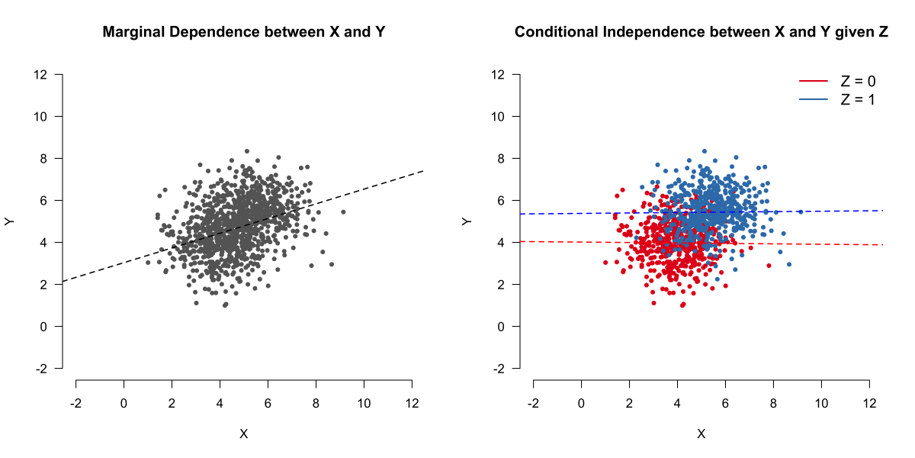
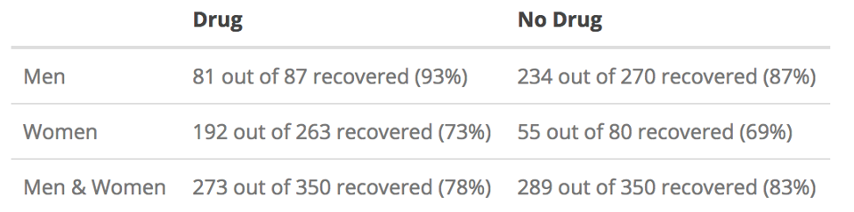
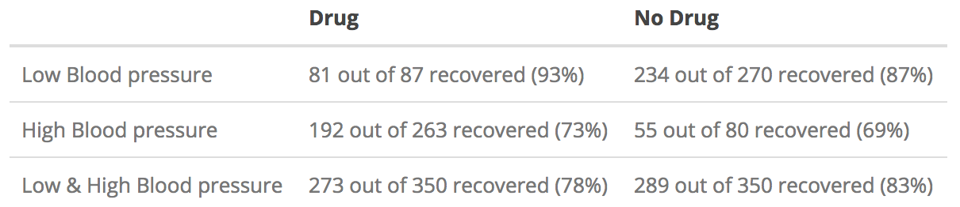
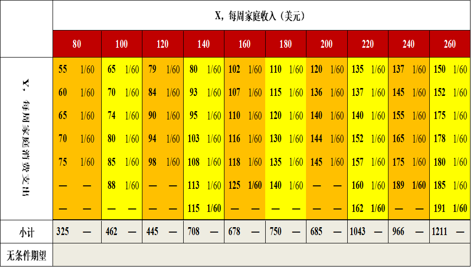

---
params:
  hideslide: TRUE
output:
  xaringan::moon_reader:
    seal: false
    lib_dir: libs
    css:
      - default
      - ../mycss/my-theme.css 
      - ../mycss/my-font.css
      - ../mycss/my-custom-for-video-roomy.css
      - ../mycss/text-box.css
      - duke-blue
      - hygge-duke
    nature:
      highlightStyle: github
      highlightLines: true
      countIncrementalSlides: false
      ratio: "16:9"
---
background-image: url("../pic/slide-front-page.jpg")
class: center,middle
exclude: `r params$hideslide`

# 统计学原理(Statistic)

<!---    chakra: libs/remark-latest.min.js --->

### 胡华平

### 西北农林科技大学

### 经济管理学院数量经济教研室

### huhuaping01@hotmail.com

### `r Sys.Date()`

```{r , echo=F,message=FALSE,warning=F, eval=!params$hideslide}
source("../R/set-global.R")
source("../R/xfun.R", encoding = "UTF-8")
source("../R/external-math-equation.R")
options(width = 70)
#source("../R/xaringan-chromote-print.R")
```


```{r , echo=FALSE, eval=!params$hideslide}
require('xaringanExtra')

xaringanExtra::use_tachyons()

xaringanExtra::use_panelset()

xaringanExtra::use_logo(
  image_url = "../pic/logo/nwafu-logo-circle-wb.png",
  height = '70px',
  position = xaringanExtra::css_position(top='0.2em',left="1em")
)
```

---
class: center, middle, duke-orange,hide_logo
name: chapter
exclude: `r params$hideslide`

# 第五章 相关和回归分析


### [5.1 变量间关系的度量](#corl)

### [5.2 回归分析的基本思想](#concept)

### [5.3 OLS方法与参数估计](#ols)

### [5.4 假设检验](#hypthesis)

### [5.5 拟合优度与残差分析](#goodness)

### [5.6 回归预测分析](#forecast)

### [5.7 回归报告解读](#report)

---
layout: false
class: center, middle, duke-softblue,hide_logo
name: concept

# 5.2 回归分析的基本思想

### [相关关系VS因果关系](#basic-vs)

### [重要概念](#basic-important)


---
layout: true

<div class="my-header-h2"></div>

<div class="watermark1"></div>

<div class="watermark2"></div>

<div class="watermark3"></div>

<div class="my-footer"><span>huhuaping@  &emsp;&emsp; <a href="#chapter"> 第05章 相关和回归分析 </a>
&emsp;&emsp;&emsp;&emsp;&emsp;&emsp;&emsp;&emsp;&emsp;&emsp;&emsp;&emsp;&emsp;&emsp;&emsp;&emsp;&emsp;&emsp;&emsp;&emsp;&emsp;
<a href="#concept"> 5.2 回归分析的基本思想 </a> </span></div> 

---

## 线性回归分析

从一组样本数据出发，确定变量之间的数学关系式。

对这些关系式的可信程度进行各种统计检验，并从影响某一特定变量的诸多变量中找出哪些变量的影响显著，哪些不显著。

利用所求的关系式，根据一个或几个变量的取值来预测或控制另一个特定变量的取值，并给出这种预测或控制的精确程度。


---

name: basic-vs

## 相关关系：边际相关与条件相关1

```{r, out.width= "90%", fig.cap="边际相关但是条件独立"}

```

---

## 相关关系：边际相关与条件相关2

```{r, out.width= "90%", fig.cap="边际独立但是条件相关"}
include_graphics("../pic/chpt05-causality-margin-2.png")
```

---

## 相关关系VS因果关系


```{r, out.width= "60%", fig.cap="巧克力消费量与诺贝尔奖数量"}
include_graphics("../pic/chpt05-causality-chocolate.png")
```

---

## 相关关系VS因果关系：性别的作用

```{r, out.width= "95%", fig.cap="治疗康复表"}

```

```{r, out.width= "60%", fig.cap="因果关系图"}
include_graphics("../pic/chpt05-causality-drug-gender-graph1.png")
```

---

## 相关关系VS因果关系：血压的作用

```{r, out.width= "100%", fig.cap="治疗康复表"}

```

```{r, out.width= "60%", fig.cap="因果关系图"}
include_graphics("../pic/chpt05-causality-drug-pressure-graph.png")
```

---
exclude: true

## （案例）微型家庭总体

<!---新数据表--->

```{r}
source("Rscript/case-familiy60.R", 
       encoding = "UTF-8")
```


---

### （案例）假想总体：60个家庭的收支数据（直观列表）


```{r, fig.cap="60个家庭的收入和支出情况：假设的总体"}
include_graphics("../pic/extra/chpt2-1-60families-pop.png",dpi=150)
```

???
提问：

- 总体是什么？

- 有多少总体单位？

---

### （案例）假想总体：60个家庭的收支数据（扁数据形态）


```{r}
datatable(fams60, options = list(pageLength =9, dom ="t"), caption = "60个家庭的收入和支出情况：假设的总体")
```
???
**扁数据形态**：“非标准”数据形态（但很直观）

---

### （案例）假想总体：60个家庭的收支数据（长数据形态）

```{r}
datatable(fams60_long, options = list(pageLength =8, dom ="tip"), caption = "60个家庭的收入和支出情况：假设的总体")
```
???
**长数据形态**：标准数据形态（但不直观）。

---
name: basic-important

## 重要概念：无条件概率和无条件期望

**无条件概率**：

- 定义：不受
$X_i$变量取值影响下，
$Y_i$出现的可能性。

- 记号：离散变量
$P(Y_i)$；连续变量
$g(Y)$

**无条件期望**：

- 定义：不受
$X_i$变量取值影响下，变量
$Y_i$的期望值。

- 记号：
$g(Y_i)$表示连续变量的概率密度函数（cdf）

$$\begin{align}
E(Y) &= \sum_1^N{Y_i \cdot P(Y_i)} &&\text{(discrete vars)} \\
E(Y) &= \int{Y_i \cdot g(Y_i)dY} &&\text{(continue vars)} 
\end{align}$$

---

### （示例）无条件概率和无条件期望的示例计算


```{r, out.width="90%", fig.cap="无条件概率和无条件期望"}

```

---

### （示例）无条件期望的计算过程

$$\begin{align}
E(Y) &= \sum_1^N{Y_i \cdot P(Y_i)} \\
     &= \sum_1^{60}\left( 55*\frac{1}{60} + 60*\frac{1}{60} + \cdots + 191*\frac{1}{60} \right) \\
     &=\frac{1}{60}\sum_1^{60}Y_i\\
     &=\frac{7272}{60}\\
     &=121.2
\end{align}$$

---

## 重要概念：条件概率和条件期望

**条件概率**：

- 定义：给定变量
$X_i$的取值条件下，
$Y_i$出现的可能性。

- 记号：离散变量
$P(Y_i|X_i)$；连续变量
$g(Y|X)$


**条件期望**：

- 在给定变量
$X_i$的取值条件下，
$Y_i$的期望值。

- 记号：
$g(Y|X)$表示连续变量的条件概率密度函数（cdf）

$$\begin{align}
E(Y|X_i) &= \sum_1^N{(Y_i|X_i) \cdot P(Y_i|X_i)} &&\text{(discrete vars)} \\
E(Y|X_i) &= \int{(Y|X) \cdot g(Y|X)dY} &&\text{(continue vars)} \end{align}$$

---

### （示例）条件概率和条件期望的计算

```{r, out.width="90%",fig.cap="条件概率和条件期望"}
include_graphics("../pic/extra/chpt2-1-60fams-conditional-mean.png")
```

---

### （示例）条件期望的计算过程

$$\begin{align}
E(Y|80) &= \sum_1^N{Y_i \cdot P(Y_i|X=80)} \\
     &= \sum_1^{5}\left( 55*\frac{1}{5} + 60*\frac{1}{5} + \cdots + 75*\frac{1}{5} \right) \\
     &=\frac{1}{5}\sum_1^{5}Y_i\\
     &=\frac{325}{5}\\
     &=65
\end{align}$$

---

### （示例）假想总体的全部数据展示


```{r, out.width="90%"}
# the population points
p1<- ggplot() +
  geom_point(data = fams60_long,
             aes(x=X,  y=Y,color= "Y", shape="Y"),size=3) +
  scale_colour_manual(name= "",
                      values =c("blue")) +
  scale_shape_manual(name= "",
                      values =c(1)) +
  scale_x_continuous(breaks=seq(80,260, length=10)) +
  labs(x="家庭收入X", y="家庭支出Y") +
  theme(text = element_text(size=18),
        axis.title.x = element_text(size = 16,
                                margin = margin(t = 15, r = 0, 
                                                b = 0, l = 0)),
        axis.title.y = element_text(size = 16,
                                margin = margin(t = 0, r = 15, 
                                                b = 0, l = 0)))

p1
```


---

### （示例）给定不同X水平下Y条件期望值

```{r, fig.height= 5.5}
# the expect points
p2 <- p1 +
  geom_point(data = pivot_exp, 
             aes(x=X, y=exp.Y,
                 color= "E(Y|X)",shape= "E(Y|X)"), size=3) +
  scale_colour_manual(name= "",
                      values =c("red","blue")) +
  scale_shape_manual(name= "",values =c(19,1)) 

p2
```


```{r}
kable(exp_cond) %>%
  kable_styling(full_width =T)
```

---

### （示例）给定不同X水平下Y条件期望值

```{r, out.width="90%" , warning=FALSE,message=FALSE}
# the specified point
require("latex2exp")
X_spc <- 120
Y_spc <- pivot_exp$exp.Y[which(pivot_exp$X==X_spc)]
p2_1 <- p2 +
  geom_vline(aes(xintercept = X_spc), lty="dashed")+
  geom_hline(aes(yintercept = Y_spc), lty="dashed")+
  geom_text(aes(x=X_spc-22, y=Y_spc+10), label=TeX("$(X_i,E(Y|X_i))=(120,89)$"),
            color="red",size=5)

p2_1
```

给定
$X=120$水平下
$Y$条件期望值
$E(Y|X_i=120)$= `r pivot_exp$exp.Y[which(pivot_exp$X==X_spc)]`

---

### （示例）X均值和Y的无条件期望值

```{r, out.width="90%", warning=FALSE,message=FALSE}
# the center point
X_bar <- mean(fams60_long$X)
Y_bar <- mean(fams60_long$Y)
p3 <- p2 +
  geom_vline(aes(xintercept = X_bar), lty="dashed")+
  geom_hline(aes(yintercept = Y_bar), lty="dashed")+
  geom_text(aes(x=X_bar-20, y=Y_bar+10), label=TeX("$(\\bar{X},\\bar{Y})=(174, 121)$"),color="orange",size=5)+
  #geom_text(aes(x=15, y=mean(fams60_long$Y)+5), label=TeX("$E(Y)=\\bar{Y}$"))+
  geom_point(aes(x=X_bar, y=Y_bar,
                 color="center", shape="center"),size=3) +
  scale_colour_manual(name= "",
                      values =c("E(Y|X)"="red", "Y"="blue", "center" ="orange")) +
  scale_shape_manual(name= "",
                      values =c("E(Y|X)"=19,"Y"=1,"center" =17)) 
p3
```

X的均值
$\bar{X}$
=`r formatC(X_bar, format="f", digits =2)`和Y的无条件期望值
$E(Y)=$
`r formatC(Y_bar, format ="f", digits = 2)`

---

## 重要概念：总体回归线（PRL）

- 几何：给定X值时Y的条件期望值的轨迹。

- 统计：实质上就是Y对X的回归。

总体回归曲线(Population Regression Curve，PRC)：条件期望值的轨迹表现为一条曲线(Curve)。

总体回归线(Population Regression Line，PRL)：条件期望值的轨迹表现为一条直线(Line)。

---

## 重要概念：总体回归线（PRL）

```{r, out.width="90%", fig.cap="总体回归线PRL"}
p_PRL <- p2 +
  geom_line(data = pivot_exp,aes(x=X, y=exp.Y),color="purple", size=0.75)
p_PRL
```

---

## 重要概念：总体回归函数（PRF）

总体回归函数（Population Regression Function，PRF）：它是对总体回归曲线(PRC)的数学函数表现形式。

如果不知道总体回归曲线的具体形式，则总体回归函数PRF表达为如下隐函数形式（PRF）：

$$\begin{align}
E(Y|X_i) & = f(X_i)  && \text{(PRF)}
\end{align}$$

如果总体回归曲线是直线形式，则总体回归函数PRF表达为如下显函数形式（PRF_L）：

$$\begin{align}
E(Y|X_i) &= \beta_1 +\beta_2X_i && \text{(PRF_L)}
\end{align}$$

- 
$\beta_1,\beta_2$分别称为截距(intercept)和斜率系数(slope coefficient)。

- 
$\beta_1,\beta_2$称为总体参数或回归系数(regression coefficients)。

- 
$\beta_1,\beta_2$为未知但却是固定的参数。

---

## 重要概念：总体回归函数（PRF）

```{r, out.width="90%", fig.cap="总体回归线PRL与总体回归函数PRF", warning=FALSE,message=FALSE}
lm_pop<- lm(data = pivot_exp, formula = exp.Y~X)
b1 <- coef(lm_pop)[1]
b0 <- coef(lm_pop)[2]
p_PRF <- p_PRL +
  geom_text(aes(x=120, y=200),
            label=TeX("$PRF:E(Y|X_i)=\\beta_1+\\beta_2X_i$"),
            color="purple", size=5) +
    geom_text(aes(x=120, y=190),
            label=TeX("$E(Y|X_i)=17+0.6X_i$"),
            color="purple", size=5) 
p_PRF
```

---

## 重要概念：总体回归模型（PRM）

**总体回归模型**（Population Regression model, PRM）：把总体回归函数表达成**随机设定**形式。

如果总体回归函数为隐函数，则**总体回归模型**记为：

$$\begin{align}
Y_i &=  E(Y|X_i) + u_i \\
    &=  f(X_i) +u_i
\end{align}$$

如果总体回归函数为线性函数，则**总体回归模型**记为：

$$\begin{align}
Y_i &=  E(Y|X_i) + u_i \\
    &= \beta_1 +\beta_2X_i + u_i
\end{align}$$

- 总体回归模型（PRM）属于**计量经济学模型**，而总体回归函数（PRF）是**数量经济学模型**（或数学模型）。

- 总体回归模型（PRM）能充分表达的是现实世界中
$Y_i$变量的行为特征。


---

## 重要概念：随机干扰项

总体回归模型（PRM）设定下，
$Y_i$将由两个部分组成。

- 特定家庭的支出（
$Y_i$） = 系统性部分（
$E(Y|X_i)$ + 随机部分（
$u_i$）

- 特定家庭的支出（
$Y_i$） = 系统性部分（
$\beta_1+\beta_2X_i$） + 随机部分（
$u_i$）


**随机干扰项**：

- 也被称为随机误差项(stochastic error term)：总体回归函数中忽略掉的但又影响着Y的全部变量的替代物，它是
$Y_i$与条件期望（
$E(Y|X_i)$）的离差。

$$\begin{align}
u_i &= Y_i - E(Y|X_i) 
\end{align}$$

---

## 重要概念：随机干扰项

随机干扰项的来源：

- 理论的含糊：除了主变量之外，还有其它变量的影响，但不清楚，只能用𝜇_𝑖代替它们。（家庭收入以外？）

- 数据的不充分：可能知道被忽略的变量，但不能得到这些变量的数量信息。（如家庭财富数据不可得）

- 核心变量与其它变量：其它变量全部或其中一些合起来影响还是很小的。（如子女、教育、性别、宗教等）

- 人类行为的内在随机性。（客观存在、固有的）

- 变量被“移花接木”而产生测量误差（如弗里德曼的持久收入和消费）

- 节省原则：为了保持一个尽可能简单的回归模型

- 错误的函数形式：有时根据数据及经验无法确定一个正确的函数形式 （多元回归尤其如此）

---

## 重要概念：随机干扰项


.pull-left[
为何是“随机的”？

- 测不准？（误差）

- 测错了？（误导）

- 免不了!（内在性）

]

.pull-right[

拥抱随机世界

- 风筝：
$Y_i$

- 风筝线：
$E(Y|X_i)$

- 风：
$u_i$

]


---

## 重要概念：理解PRM和PRF的关系

```{r, out.width="90%", warning=FALSE,message=FALSE}
Y_spc2 <- min(fams60_long$Y[which(fams60_long$X==X_spc)])

p_PRM_demo<- p_PRF +
  geom_point(aes(x=X_spc,y=Y_spc), shape=2,size=3)+
  geom_point(aes(x=X_spc,y=Y_spc2), shape=1, color="black",size=3)+
  geom_hline(aes(yintercept = Y_spc), lty= "dashed") +
  geom_text(aes(x=X_spc+25,y=Y_spc+4),
             label=paste0("E(Y|",X_spc,")=",Y_spc),size=5) +
  geom_hline(aes(yintercept = Y_spc2), lty= "dashed") +
  geom_text(aes(x=X_spc+25,y=Y_spc2-4),
             label=paste0("(Yi|", X_spc,")=",Y_spc2),size=5) 
  
p_PRM_demo
```

若给定一个特定家庭
$(X_i=120, Y_i=79)$，则条件期望为
$E(Y|120)=89$


---

## 重要概念：理解PRM和PRF的关系

若给定
$X_i=`r X_spc`$，则5个家庭的真实消费支出分别为：

$$\begin{align}
(Y_1|X=120) = 79 &= \beta_1 + \beta_2 \cdot 120 +u_1\\
(Y_2|X=120) = 84 &= \beta_1 + \beta_2 \cdot 120 +u_2\\
(Y_3|X=120) = 90 &= \beta_1 + \beta_2 \cdot 120 +u_3\\
(Y_4|X=120) = 94 &= \beta_1 + \beta_2 \cdot 120 +u_4\\
(Y_5|X=120) = 98 &= \beta_1 + \beta_2 \cdot 120 +u_5
\end{align}$$


---

## 重要概念：理解PRM和PRF的关系

主要结论：

- 总体期望刻画总体的“趋势”，总体回归线让“趋势”直观化。

- 个体随机性是不可避免的，总会“游离”于“趋势”之外。

- 随机干扰项
$u_i$𝑖携带了随机个体的“游离”信息。

- 总体回归模型既“提取”了趋势和规律性，又“维系”着个体随机性，从而更好地表达了“真实世界”。

课后思考：

- 如果是无限总体，总体的规律性在理论上也是可以被严格表达出来么？

- 如果不告诉你总体，你怎么知道“触碰”到的是“真实的”趋势/规律？

- 从假想的60个家庭的微型总体中，“随便”抽取10个家庭的数据，你还能看到“直线”趋势么？


---

## 重要概念：“线性”的含义

“线性回归模型”中“线性”一词的含义

- **变量“线性”模型**：因变量对于自变量是线性的。

- **参数“线性”模型**：因变量对于参数是线性的。

---

### （测试题）“线性”的含义

下列模型分别属于哪一类？请指出来：

$$\begin{align}
Y_i &= \beta_1 + \beta_2 X_i +u_i && \text{(mod1)}
\end{align}$$

$$\begin{align}
Y_i &= \beta_1 + \beta_2 X_i + \beta_3 X_i^2 +u_i && \text{(mod2)}
\end{align}$$

$$\begin{align}
Y_i &= \beta_1 + \beta_2 X_i + \beta_3 X_i^2 + \beta_4 X_i^3 +u_i && \text{(mod3)}
\end{align}$$

$$\begin{align}
Y_i &= \beta_1 + \beta_2 \frac{1}{X_i} +u_i && \text{(mod4)}
\end{align}$$


$$\begin{align}
Y_i &= \beta_1 + \beta_2 ln(X_i) +u_i && \text{(mod5)} \\
\end{align}$$


$$\begin{align}
ln(Y_i) &= \beta_1 + \beta_2 X_i +u_i && \text{(mod6)}
\end{align}$$

---

### （测试题）“线性”的含义

下列模型分别属于哪一类？请指出来：

$$\begin{align}
ln(Y_i) &= \beta_1 - \beta_2 \frac{1}{X_i} +u_i && \text{(mod7)} 
\end{align}$$


$$\begin{align}
ln(Y_i) &= ln(\beta_1) + \beta_2 ln(X_i) +u_i && \text{(mod8)} 
\end{align}$$


$$\begin{align}
Y_i &= \frac{1}{1+e^{(\beta_1 + \beta_2 X_{2i}  +u_i) }} && \text{(mod9)}
\end{align}$$


$$\begin{align}
Y_i &= \beta_1 +(0.75-\beta_1)e^{-\beta_2(X_i-2)} +u_i && \text{(mod10)}
\end{align}$$


$$\begin{align}
Y_i &= \beta_1 + \beta_2^3 X_i +u_i && \text{(mod11)} 
\end{align}$$

---

## 重要概念：样本回归线(SRL)

**样本(Sample)**：

- 从总体中随机抽取得到的数据。

**样本回归线**(Sample Regression Line，SRL)：

- 是通过拟合**样本数据**得到的一条曲线（或直线）。换言之，这条线由拟合值
$\hat{Y}_i$连接而成。

- 
$\hat{Y}_i$是对条件期望值
$Y|X_i$的拟合。

- 拟合方法有很多，例如采用OLS方法对样本数据进行拟合。

    - 尽可能拟合数据
    - 用什么方法拟合？
    - 曲线是什么形态？


---

## 重要概念：样本回归函数(SRF)

**样本回归函数**(Sample Regression Function，SRF)：是样本回归曲线的数学函数形式，可是是线性的或非线性。如果是直线则可以写成：

$$\begin{align}
\hat{Y}_i =\hat{\beta}_1 + \hat{\beta}_2X_i
\end{align}$$

对比总体回归函数（PRF）：

$$\begin{align}
E(Y|X_i) =\beta_1 + \beta_2X_i
\end{align}$$

可以认为：

- 
$\hat{Y}_i$是对
$E(Y|X_i)$的估计量。

- 
$\hat{\beta}_1$是对
$\beta_1$的估计量。

- 
$\hat{\beta}_2$是对
$\beta_2$的估计量。

---

### （示例）第一份随机样本：抽样

```{r}
set.seed("123")
sample1<- fams60_long %>% 
  mutate(group = as.factor(group)) %>%
  group_by(group) %>%
  sample_n(size=1) %>% ungroup() %>% select(-id,-group)

set.seed("124")
sample2<- fams60_long %>% 
  mutate(group = as.factor(group)) %>%
  group_by(group) %>%
  sample_n(size=1) %>% ungroup() %>% select(-id,-group) 

```


```{r, fig.height=6}
p_spl1 <- p1 +
  geom_point(data = sample1, 
         aes(x=X, y=Y, shape="sample1", color="sample1"),
         size=3)+
  scale_colour_manual(name= "",
                      values =c("black","blue")) +
  scale_shape_manual(name= "",
                      values =c(15,1))

p_spl1
```

```{r, warning=FALSE,message=FALSE}
old.names <- str_c("V",1:10)
new.names <- str_c("n",1:10)
sample1_t<- sample1 %>% 
  t(.) %>% as_tibble(.) %>% 
  rename_at(vars(old.names), ~ new.names) %>%
  add_column(var=c("X","Y"), .before = "n1") 

kable(sample1_t)
```

---

### （示例）第一份随机样本：数据

```{r, fig.height=6}
p_spl_base<- ggplot(sample1, aes(X, Y)) +
  geom_blank() +
  scale_x_continuous(breaks=seq(80,260, length=10)) +
  scale_y_continuous(breaks=seq(50,150, length=3)) +
  labs(x="家庭收入X", y="家庭支出Y") +
  theme(text=element_text(size=16))

p_spl1_alone <- p_spl_base +
  geom_point(aes(shape="sample1"), color="black",size=3)+
  scale_y_continuous(breaks=seq(50,150, length=3)) +
  scale_shape_manual(name= "",
                      values =c(15))

p_spl1_alone
```

```{r}
kable(sample1_t)
```

---

### （示例）第一份随机样本：SRL

```{r, warning=F}
mod_spl <- formula("Y~X")
coef_mod1<- fun_lm_coef(lm.mod = mod_spl, lm.dt = sample1)
```


```{r, fig.height=6, warning=F}
p_spl1_SRL<- p_spl1_alone +
  geom_abline( intercept = coef_mod1$coef[1], slope= coef_mod1$coef[2], color="black") +
  geom_text(aes(x=120,y=170),
             label=TeX("$\\hat{Y_i}=\\hat{\\beta}_1+\\hat{\\beta}_2X_i$"),size=5) +
  geom_text(aes(x=120,y=160),
             label=TeX("$\\hat{Y}=17.81+0.62X_i$"),size=5) 
p_spl1_SRL  
```

```{r}
kable(sample1_t)
```

---

### （示例）第一份随机样本：SRF

根据第一份随机样本拟合得到的**样本回归函数**SRF：

```{r ,results="asis"}
fun_report_eq(lm.mod = mod_spl, lm.dt = sample1,
              lm.simple=TRUE,lm.n = 2)
```

样本数据如下：

```{r}
kable(sample1_t)
```


---

### （示例）第二份随机样本：抽样

```{r, warning=FALSE,message=FALSE}
sample2_t<- sample2 %>% 
  t(.) %>% as_tibble(.) %>% 
  rename_at(vars(old.names), ~ new.names) %>%
  add_column(var=c("X","Y"), .before = "n1")
```

```{r, fig.height=6}
p_spl2 <- p1 +
  geom_point(data = sample2, 
         aes(x=X, y=Y, shape="sample2", color="sample2"),size=3)+
  scale_colour_manual(name= "",
                      values =c("purple","blue")) +
  scale_shape_manual(name= "",
                      values =c(17,1))

p_spl2
```

```{r}
kable(sample2_t)
```


---

### （示例）第二份随机样本：数据


```{r, fig.height=6}
p_spl2_alone <- p_spl_base +
geom_point(data=sample2,aes(shape="sample2"), color="purple",size=3)+
  scale_y_continuous(breaks=seq(50,150, length=3)) +
  scale_shape_manual(name= "",
                      values =c(17))

p_spl2_alone
```

```{r}
kable(sample2_t)
```

---

### （示例）第二份随机样本：SRL

```{r, warning=F}
coef_mod2<- fun_lm_coef(lm.mod = mod_spl, lm.dt = sample2)
```


```{r, fig.height=6, warning=F}
p_spl2_SRL<- p_spl2_alone +
  geom_abline( intercept = coef_mod2$coef[1], slope= coef_mod2$coef[2], color="purple") +
  geom_text(aes(x=120,y=170),
             label=TeX("$\\hat{Y_i}=\\hat{\\beta}_1+\\hat{\\beta}_2X_i$"),size=5) +
  geom_text(aes(x=120,y=160),
             label=TeX("$\\hat{Y}=7.12+0.65X_i$"),size=5) 
p_spl2_SRL  
```

```{r}
kable(sample2_t)
```

---

### （示例）第二份随机样本：SRF

根据第二份随机样本拟合得到的**样本回归函数**SRF：


```{r, results="asis"}
fun_report_eq(lm.mod = mod_spl, lm.dt = sample2,
              lm.simple = TRUE)
```


样本数据如下：

```{r}
kable(sample2_t)
```

---

### （示例）两份样本同时出现：

```{r,warning=FALSE}
sample_all<- rbind(sample1, sample2) %>%
  add_column(cat= rep(c("sample1", "sample2"), c(10,10)),
             .before = "X")
```

```{r, fig.height=6,warning=FALSE}
p_sample_all<- p2 + 
  geom_point(data = sample1, 
             aes(x=X, y=Y),color="black", shape=15)+
  geom_point(data = sample2, 
             aes(x=X, y=Y),color="purple", shape=17)+
  geom_abline( intercept = coef_mod1$coef[1], slope= coef_mod1$coef[2], color="black",lty="dashed") +
  geom_abline( intercept = coef_mod2$coef[1], slope= coef_mod2$coef[2], color="red",lty="dashed") +
  geom_abline( intercept = 17, slope= 0.6, color="purple") +
  geom_text(aes(x=120,y=180),
             label=TeX("$SRL1:\\hat{Y}=17.81+0.62X_i$"), color="black",size=5)+
  geom_text(aes(x=120,y=170),
             label=TeX("$SRL2:\\hat{Y}=7.12+0.65X_i$"), color="purple",size=5) +
  geom_text(aes(x=120,y=160),
             label=TeX("$PRL:\\hat{Y}=17+0.6X_i$"), color="red",size=5) 
  
  
p_sample_all
```


---

## 重要概念：样本回归模型（SRM）

样本回归模型（Sample Regression Model，SRM）：把样本回归函数表现为**“随机”**形式。

- 如果样本回归函数为隐函数，则样本回归模型可记为：

$$\begin{align}
Y_i &= g(X_i) +e_i 
\end{align}$$

- 如果样本回归函数表现为直线，则样本回归模型可记为：

$$\begin{align}
Y_i &= \hat{\beta}_1 +\hat{\beta}_2X_i +e_i && \text{(SRM_L)}
\end{align}$$

其中，
$e_i$表示残差（Residual）

---

## 重要概念：残差

残差（Residual）：

- 定义：是样本回归函数与Y的样本观测值之间的离差。

- 记号：

$$\begin{align}
e_i  &= Y_i - \hat{Y}_i \\
     &= Y_i - (\hat{\beta}_1 +\hat{\beta}_2X_i) 
\end{align}$$

---

## 重要概念：理解SRF和SRM的关系

```{r, warning=FALSE, message=FALSE}
x_spc_spl2 <- 240
Y_spc_spl2 <- sample2$Y[which(sample2$X==x_spc_spl2)]
lm.spl2 <- lm(formula = mod_spl, data = sample2)
Y_spc_fit <- round(lm.spl2$fitted.values[which(sample2$X==x_spc_spl2)],1)

p_SRL_SRF <- p_spl2_SRL +
  geom_vline(aes(xintercept = x_spc_spl2), lty="dashed") +
  geom_hline(aes(yintercept = Y_spc_spl2), lty="dashed")+
  geom_hline(aes(yintercept = Y_spc_fit), lty="dashed") +
  geom_point(aes(x=x_spc_spl2, y= Y_spc_fit), shape=1, size=3,color="red") +
  geom_text(aes(x=x_spc_spl2+15, y=Y_spc_spl2-5), 
            label=  paste0("(",x_spc_spl2,"," ,Y_spc_spl2-5,")"),size=5)+
  geom_text(aes(x=x_spc_spl2+15, y=Y_spc_fit, 
            label= paste0("(",x_spc_spl2,"," ,Y_spc_fit,")")),size=5)

p_SRL_SRF 

```

给定
$x_i=`r x_spc_spl2`$，样本2的观测值
$Y_i=`r x_spc_spl2`$ ；拟合值
$\hat{Y}_i=$ `r Y_spc_fit`；残差
$e_i=Y_i- \hat{Y}_i=$ `r Y_spc_spl2 -Y_spc_fit`。

---

## 重要概念：样本回归与总体回归的比较

```{r}
include_graphics("../pic/extra/chpt2-1-PRL-SRL.png", dpi=120)
```

--

为何不同？继承性和变异性


---

## 重要概念：样本回归与总体回归的比较

.pull-left[
总体回归函数PRF:

$$\begin{align}
E(Y|X_i) &= \beta_1 +\beta_2X_i && \text{(PRF)}
\end{align}$$

总体回归模型PRM:

$$\begin{align}
Y_i &=  \beta_1 +\beta_2X_i + u_i && \text{(PRM)}
\end{align}$$

]


.pull-right[
样本回归函数SRF:

$$\begin{align}
\hat{Y}_i =\hat{\beta}_1 + \hat{\beta}_2X_i && \text{(SRF)}
\end{align}$$

样本回归模型SRM:

$$\begin{align}
Y_i &= \hat{\beta}_1 + \hat{\beta}_2X_i +e_i && \text{(SRM)}
\end{align}$$

]

--

思考：

- PRF无法直接观测，只能用SRF近似替代

- 估计值与观测值之间存在偏差

- SRF又是怎样决定的呢?


---

## 重要概念：样本回归与总体回归的比较


总结：

- 随机抽样数据继承了总体的特征。

- 利用随机样本进行数据拟合是对总体规律的“反向追踪”。

- 样本回归模型中的残差是拟合不完全的产物。

--

思考：

- 怎样来判定对随机样本的一次数据拟合是更优的？

- 存不存在一种“最优”的拟合方法？

--

课后作业：

- 请把162名同学的拟合线进行平均化处理（截距和斜率取均值），绘制得到一条“回归线”。

- 你认为是这根平均化的“回归线”与真相更逼近么？

---
layout:false
background-image: url("../pic/thank-you-gif-funny-fan.gif")
class: inverse,center
# 本节结束
