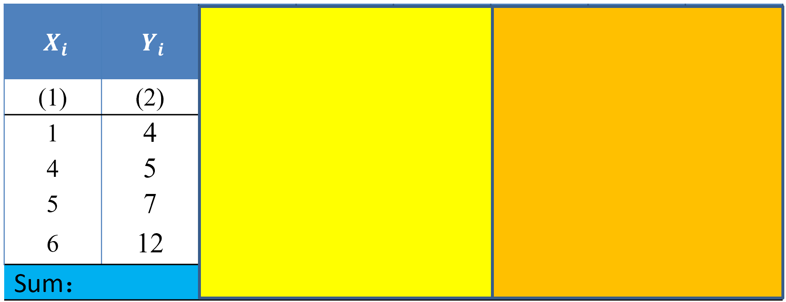

---
params:
  hideslide: TRUE
output:
  xaringan::moon_reader:
    seal: false
    lib_dir: libs
    css:
      - default
      - ../mycss/my-theme.css 
      - ../mycss/my-font.css
      - ../mycss/my-custom-for-video-roomy.css
      - ../mycss/text-box.css
      - duke-blue
      - hygge-duke
    nature:
      highlightStyle: github
      highlightLines: true
      countIncrementalSlides: false
      ratio: "16:9"
---
background-image: url("../pic/slide-front-page.jpg")
class: center,middle
exclude: `r params$hideslide`

# 统计学原理(Statistic)

### 胡华平

### 西北农林科技大学

### 经济管理学院数量经济教研室

### huhuaping01@hotmail.com

### `r Sys.Date()`

```{r , echo=F,message=FALSE,warning=F, eval=!as.logical(params$hideslide)}
source("../R/set-global.R")
source("../R/xfun.R", encoding = "UTF-8")
source("../R/external-math-equation.R")
options(width = 70)
#source("../R/xaringan-chromote-print.R")
```


```{r , echo=FALSE, eval=!as.logical(params$hideslide)}
require('xaringanExtra')

xaringanExtra::use_tachyons()

xaringanExtra::use_panelset()

xaringanExtra::use_logo(
  image_url = "../pic/logo/nwafu-logo-circle-wb.png",
  height = '70px',
  position = xaringanExtra::css_position(top='0.2em',left="1em")
)
```

---
class: center, middle, duke-orange,hide_logo
name:chapter
exclude: `r params$hideslide`

# 第五章 相关和回归分析


### [5.1 变量间关系的度量](#corl)

### [5.2 回归分析的基本思想](#oncept)

### [.white[5.3 OLS方法与参数估计]](#ols)

### [5.4 假设检验](#hypthesis)

### [5.5 拟合优度与残差分析](#goodness)

### [5.6 回归预测分析](#forecast)

### [5.7 回归报告解读](#report)


---
layout: false
class: center, middle, duke-softblue,hide_logo
name: ols

# 5.3 OLS方法与参数估计

### [普通最小二乘法（OLS）](#ols-method)

### [参数估计](#ols-estimate)

### [估计精度](#ols-sd)

### [区间估计](#ols-interval)

---
layout: true

<div class="my-header-h2"></div>

<div class="watermark1"></div>

<div class="watermark2"></div>

<div class="watermark3"></div>

<div class="my-footer"><span>huhuaping@  &emsp;&emsp; <a href="#chapter"> 第05章 相关和回归分析 </a>
&emsp;&emsp;&emsp;&emsp;&emsp;&emsp;&emsp;&emsp;&emsp;&emsp;&emsp;&emsp;&emsp;&emsp;&emsp;&emsp;&emsp;&emsp;&emsp;&emsp;&emsp;
<a href="#ols"> 5.3 OLS方法与参数估计 </a> </span></div> 

---
name: ols-method

## 普通最小二乘法（OLS）：引子

我们如何估计回归函数中的系数？

.pull-left[

总体回归：
$$\begin{cases}
  \begin{align}
  E(Y|X_i) &= \beta_1 +\beta_2X_i && \text{(PRF)} \\
  Y_i &=  \beta_1 +\beta_2X_i + u_i && \text{(PRM)}
  \end{align}
\end{cases}$$

]

.pull-right[
样本回归：
$$\begin{cases}
  \begin{align}
  \hat{Y}_i & =\hat{\beta}_1 + \hat{\beta}_2X_i && \text{(SRF)} \\
  Y_i &= \hat{\beta}_1 + \hat{\beta}_2X_i +e_i && \text{(SRM)}
  \end{align}
\end{cases}$$

]


首先需要回答的问题是，我们该如何估计得出样本回归函数中的系数？事实上，方法有多种多样：

- 图解法：比较粗糙，但提供了基本的视觉认知

- 最小二乘法(order lease squares, OLS)：最常用的方法

- 最大似然法(maximum likelihood, ML)

- 矩估计方法(Moment method, MM)

---

## 普通最小二乘法（OLS）：回顾和比较

.pull-left[
.pa2.bg-lightest-blue[
总体回归函数PRF:

$$\begin{align}
E(Y|X_i) &= \beta_1 +\beta_2X_i 
\end{align}$$

总体回归模型PRM:

$$\begin{align}
Y_i &=  \beta_1 +\beta_2X_i + u_i 
\end{align}$$
]

]

.pull-right[

.pa2.bg-light-blue[
样本回归函数SRF:

$$\begin{align}
\hat{Y}_i =\hat{\beta}_1 + \hat{\beta}_2X_i 
\end{align}$$

样本回归模型SRM:

$$\begin{align}
Y_i &= \hat{\beta}_1 + \hat{\beta}_2X_i +e_i 
\end{align}$$

]

]

--

思考：

- PRF无法直接观测，只能用SRF近似替代

- 估计值与观测值之间存在偏差

- SRF又是怎样决定的呢?

---

## 普通最小二乘法（OLS）：原理

认识普通最小二乘法的原理：一个图示

```{r, fig.cap="最小二乘法的原理"}
include_graphics("../pic/extra/chpt3-OLS-demo.png",dpi=270)
```

---

## 普通最小二乘法（OLS）：原理

OLS的基本原理：残差平方和最小化。

$$\begin{align}
e_i  &= Y_i - \hat{Y}_i \\
     &= Y_i - (\hat{\beta}_1 +\hat{\beta}_2X_i) 
\end{align}$$


$$\begin{align}
Q  &= \sum{e_i^2} \\
   &= \sum{(Y_i - \hat{Y}_i)^2} \\
   &= \sum{\left( Y_i - (\hat{\beta}_1 +\hat{\beta}_2X_i) \right)^2} \\
   &\equiv f(\hat{\beta}_1,\hat{\beta}_2)
\end{align}$$


$$\begin{align}
Min(Q)  &= Min \left ( f(\hat{\beta}_1,\hat{\beta}_2) \right)
\end{align}$$

---

### （示例） 普通最小二乘法（OLS）的一个数值试验

假设存在下面所示的4组观测值
$(X_i, Y_i)$：

```{r, fig.cap="数值试验：数据"}

```

---

### （示例） 普通最小二乘法（OLS）的一个数值试验

假设猜想两个SRF，完成下表计算，并分析哪个SRF给出的
$(\hat{\beta}_1, \hat{\beta}_2)$要更好？

$$\begin{align}
SRF1：\hat{Y}_{1i} & = \hat{\beta}_1 +\hat{\beta}_2X_i = 1.572 + 1.357X_i \\
SRF2：\hat{Y}_{2i} & = \hat{\beta}_1 +\hat{\beta}_2X_i = 3.0 + 1.0X_i 
\end{align}$$


```{r, fig.cap="数值试验：计算"}
include_graphics("../pic/extra/chpt3-OLS-compare2.png", dpi = 220)
```

---
name: ols-estimate

## 参数估计：回归参数的OLS点估计

- 最小化求解：

$$\begin{align}
Min(Q)  &= Min \left ( f(\hat{\beta}_1,\hat{\beta}_2) \right)\\
 &= Min\left(\sum{\left( Y_i - (\hat{\beta}_1 +\hat{\beta}_2X_i) \right)^2} \right) \\
  &= Min \sum{\left( Y_i - \hat{\beta}_1 - \hat{\beta}_2X_i \right)^2}
\end{align}$$

- 方程组变形，得到**正规方程组**：

$$\begin{align}
\left \{
  \begin{split}
   \sum{\left[ \hat{\beta}_1 - (Y_i -\hat{\beta}_2X_i) \right]}  &=0 \\
   \sum{\left[ X_i^2\hat{\beta}_2 - (Y_i-\hat{\beta}_1 )X_i \right ] }&=0 
   \end{split}
\right. 
\end{align}$$

$$\begin{align}
\left \{
  \begin{split}
   \sum{Y_i} - n\hat{\beta}_1- (\sum{X_i})\hat{\beta}_2 &=0 \\
   \sum{X_iY_i}-(\sum{X_i})\hat{\beta}_1 -  (\sum{X_i^2})\hat{\beta}_2 &=0 
   \end{split}
\right.
\end{align}$$

---

## 参数估计：回归参数的OLS点估计

进而得到回归系数的计算公式1（Favorite Five，FF）：

$$\begin{align}
  \left \{
  \begin{split}
  \hat{\beta}_2 &=\frac{n\sum{X_iY_i}-\sum{X_i}\sum{Y_i}}{n\sum{X_i^2}-\left ( \sum{X_i} \right)^2}\\
  \hat{\beta}_1 &=\frac{n\sum{X_i^2Y_i}-\sum{X_i}\sum{X_iY_i}}{n\sum{X_i^2}-\left ( \sum{X_i} \right)^2}
  \end{split} 
  \right.
  &&\text{(FF solution)}
\end{align}$$

---

## 参数估计：回归参数的OLS点估计

此外我们也可以得到如下的离差公式(favorite five，ff)

$$\begin{align}
\left \{
  \begin{split}
  \hat{\beta}_2 &=\frac{\sum{x_iy_i}}{\sum{x_i^2}}\\
  \hat{\beta}_1 &=\bar{Y}_i-\hat{\beta}_2\bar{X}_i
  \end{split} 
\right.  
  && \text{(ff solution)}
\end{align}$$

其中离差计算
$x_i=X_i-\bar{X};\  y_i=Y_i - \bar{Y}$。

---

### （测试题）

以下式子为什么是等价的？你能推导出来么？

$$\begin{align}
\left\{
  \begin{split}
    \sum{x_iy_i} &= \sum{\left[ (X_i-\bar{X})(Y_i-\bar{Y})\right]} 
    &&= \sum{X_iY_i} - \frac{1}{n}\sum{X_i}\sum{Y_i} \\
    \sum{x_i^2} &= \sum{(X_i- \bar{X})^2} 
    &&= \sum{X_i^2} -\frac{1}{n} \left( \sum{X_i} \right)^2
  \end{split}
\right.
\end{align}$$

---

## 参数估计：随机干扰项参数的OLS点估计

PRM公式变形：

$$\begin{alignedat}{2}
&\left.
  \begin{split}
   Y_i &&= \beta_1 - &&\beta_2X_i +u_i  \ && \text{(PRM)} \Rightarrow \\
   \hat{Y} &&= \beta_1 - &&\beta_2\bar{X} +\bar{u} && \\   
  \end{split}
\right \} \Rightarrow \\
 & y_i = \beta_2x_i +(u_i- \bar{u})  
\end{alignedat}$$

残差公式变形：

$$\begin{alignedat}{2}
 &\left. 
  \begin{split}
    & e_i = y_i - \hat{\beta}_2x_i \\
    & e_i = \beta_2x_i +(u_i- \bar{u}) -\hat{\beta}_2x_i 
  \end{split}
\right \}  \Rightarrow \\
& e_i =-(\hat{\beta}_2- \beta_2)x_i + (u_i- \hat{u})
\end{alignedat}$$

---

## 参数估计：随机干扰项参数的OLS点估计

求解残差平方和：

$$\begin{alignedat}{2}
  & \sum{e_i^2} && = (\hat{\beta}_2 - \beta_2)^2\sum{x_i^2} + \sum{(u-\bar{u})^2} - 2(\hat{\beta}_2 - \beta_2)\sum{x_i(u-\bar{u})}  
\end{alignedat}$$

求残差平方和的期望：

$$\begin{align}
E(\sum{e_i^2}) &= 
 \sum{x_i^2 E \left[ (\hat{\beta}_2 - \beta_2)^2 \right ]}+ E\left[ \sum{(u-\bar{u})^2} \right ]\\
&+ 2E \left[ (\hat{\beta}_2 - \beta_2)\sum{x_i(u-\bar{u})} \right ] \\
& \equiv   A + B + C \\
& = \sigma^2 + (n-1)\sigma^2 -2\sigma^2 \\
& = (n-2)\sigma^2 
\end{align}$$

---

## 参数估计：随机干扰项参数的OLS点估计

**回归误差方差**（Deviation of Regression Error）：

- 采用OLS方法下，总体回归模型PRM中随机干扰项
$u_i$的总体方差的无偏估计量，记为
$E(\sigma^2) \equiv \hat{\sigma}^2$，简单地记为
$\hat{\sigma}^2$。

$$\begin{align}
\hat{\sigma}^2=\frac{\sum{e_i^2}}{n-2}
\end{align}$$

--

**回归误差标准差**（Standard Deviation of Regression Error）：有时候也记为**se**。

$$\begin{align}
\hat{\sigma}=\sqrt{\frac{\sum{e_i^2}}{n-2}}
\end{align}$$

???
- 采用OLS方法下，总体回归模型PRM中随机干扰项
$u_i$的总体标准差的无偏估计量，记为
$E(\sigma) \equiv \hat{\sigma}$，代数表达式一般简单地记为
$\hat{\sigma}$

---

### （附录）A过程证明

$$\begin{align}
A & = \sum{x_i^2 E \left[ (\hat{\beta}_2 - \beta_2)^2 \right ]} \\
  & = \sum{ \left[ x_i^2 \cdot var(\hat{\beta}_2) \right] } \\
  & = var(\hat{\beta}_2) \cdot \sum{x_i^2}  \\
  & = \frac{\sigma^2}{\sum{ x_i^2}} \cdot \sum{ x_i^2}  \\
  & = \sigma^2
\end{align}$$

---

### （附录）B过程证明

$$\begin{align}
B  = E \left[ \sum{(u-\bar{u})^2} \right ] 
  & = E(\sum{u_i^2}) - 2E \left[ \sum{(u_i\bar{u})} \right] +nE(\bar{u}^2) \\
  & = n \cdot Var(u_i) - 2E \left[ \sum{(u_i \cdot \frac{\sum{u_i}}{n} )}  \right]  + nE(\frac{\sum{u_i}}{n})^2 \\
  & = n \sigma^2 - 2E \left[ \frac{\sum{u_i}}{n} \sum{u_i} \right] + E\left[ \frac{(\sum{u_i})^2}{n} \right]\\
  & = n \sigma^2- E\left[ (\sum{u_i})^2/{n} \right] 
  = n \sigma^2  -  \frac{E(u_i^2) + E(u_2^2) + \cdots +  E(u_n^2) )}{n} \\
  & =  n \sigma^2 -  \frac{nVar{u_i}}{n} 
   =  n \sigma^2 -  \sigma^2 =  (n-1) \sigma^2
\end{align}$$

---

### （附录）C过程证明

$$\begin{align}
C &= - 2E \left[ (\hat{\beta}_2 - \beta_2)\sum{x_i(u_i-\bar{u})} \right ] \\
  &= - 2E \left[ \frac{\sum{x_iu_i}}{\sum{x_i^2}} \left( \sum{x_iu_i}-\bar{u}\sum{x_i} \right) \right ] \\
  &= - 2E \left[ \frac{ \left( \sum{x_iu_i} \right)^2}{\sum{x_i^2}}  \right ]  \\
  &= -2E \left[(\hat{\beta}_2 - \beta_2)^2 \right] = -2\sigma^2
\end{align}$$

--

- 其中：

$$\begin{align}
\hat{\beta}_2 & = \sum{k_iY_i} = \sum{k_i(\beta_1 +\beta_2X_i +u_i)}   = \beta_1\sum{k_i} +\beta_2 \sum{k_iX_i}+\sum{k_iu_i}  
= \beta_2 +\sum{k_iu_i} \\
\hat{\beta}_2 - \beta_2 & = \sum{k_iu_i} = \frac{ \sum{x_iu_i} }{\sum{x_i^2}}
\end{align}$$

---
exclude:true

## （案例）教育程度与时均工资

```{r}
source("Rscript/case-edu-wage.R", encoding = "UTF-8")
```

```{r}


```


---

### （案例）计算表FF和ff

```{r, warning=F, message=FALSE}
show_tbl %>%
  select(1:11) %>%
  mutate_if(is.numeric, ~formatC(., digits = 2, format = "f")) %>%
  kable(align = "c")  %>%
  kable_styling(full_width = T, font_size= 22)%>%
  row_spec(row = 14, color = "red", bold = T )
```

---

### （案例）计算回归系数

公式1: （Favorite Five，FF形式）

```{r, results= "asis"}
cat(
  "$$\\begin{align}",
  "\\hat{\\beta}_2 &=\\frac{n\\sum{X_iY_i}-\\sum{X_i}\\sum{Y_i}}{n\\sum{X_i^2}-\\left ( \\sum{X_i} \\right)^2}\\\\",
str_c(
  "&=\\frac{",n,"\\ast",FF_ff$FF_XY,"-",FF_ff$X, "\\ast",FF_ff$Y,"}{",n,"\\ast",FF_ff$FF_X_sqr,"-",FF_ff$X,"^2}",
  "=",round(b2,4)
  ),
"\\end{align}$$",
sep="\n"
)
```


```{r, results= "asis"}
cat(
  "$$\\begin{align}",
  "\\hat{\\beta_1} &= \\bar{Y} - \\hat{\\beta}_2 \\bar{X}",
  str_c(
    "=",round(mean_Y,4),"-",round(b2,4),"\\ast",mean_X,
    "=",round(b1,4)),
  "\\end{align}$$",
  sep="\n"
)
```

---

### （案例）计算回归系数

公式2：（离差形式，favorite five，ff形式）


```{r, results= "asis"}
cat(
  "$$\\begin{align}",
  "\\hat{\\beta}_2 =\\frac{\\sum{x_iy_i}}{\\sum{x_i^2}}",
str_c(
  "=\\frac{",FF_ff$ff_xy,
  "}{",FF_ff$ff_x_sqr,"}",
  "=",round(b2,4)
  ),
"\\end{align}$$",
sep="\n"
)
```


```{r, results= "asis"}
cat(
  "$$\\begin{align}",
   
  "\\hat{\\beta_1} = \\bar{Y} - \\hat{\\beta}_2 \\bar{X}",
  str_c(
    "=",round(mean_Y,4),"-",round(b2,4),"\\ast",mean_X,
    "=",round(b1,4)),
  "\\end{align}$$",
  sep="\n"
)
```

---

### （案例）样本回归方程SRF

```{r, results="asis"}
cat(
  "$$\\begin{align}",
  "\\hat{Y}_i= \\hat{\\beta}_1 + \\hat{\\beta}_2 X_i",
  str_c(
    "=", round(b1,4),"+",round(b2,4),"X_i"
  ),
  "\\end{align}$$",
  sep = "\n"
)
```

---

### （案例）样本回归线SRL

```{r, warning=FALSE,message=FALSE, out.width="95%"}

p0 <- ggplot(data=data_wage, aes(X, Y)) +
  geom_point(color= "blue", shape=1, size=3) +
  labs(x= "教育年数X", y = "时均工资Y") +
  scale_x_continuous(breaks=seq(0,20, by=6), limits = c(0,20)) +
  scale_y_continuous(breaks=seq(0,15, by=3), limits = c(0,15)) +
  theme(text = element_text(size=16)) 
  
p0
```

---

### （案例）样本回归线SRL

```{r, warning=FALSE,message=FALSE, out.width="95%"}

text1 <- TeX("$\\hat{Y_i}=\\hat{\\beta}_1+\\hat{\\beta}_2X_i$")
text2 <- TeX(str_c("$\\hat{Y}=", round(b1,4), 
                   "+", round(b2,4),"X_i$"))
p1 <- ggplot(data=data_wage, aes(X, Y)) +
  geom_point(color= "blue", shape=1, size=3) +
  labs(x= "教育年数X", y = "时均工资Y") +
  scale_x_continuous(breaks=seq(0,20, by=6), limits = c(0,20)) +
  scale_y_continuous(breaks=seq(0,15, by=3), limits = c(0,15))  +
  #stat_smooth(method = "lm", se=FALSE)
  geom_abline(intercept = b1, slope = b2,color="green") +
  geom_text(aes(x=5,y=14),label=text1,size=5) +
  geom_text(aes(x=5,y=12),label=text2,size=5) +
  theme(text = element_text(size=16)) 

p1

```


---

### （案例）计算得到拟合值和残差

.pull-left[

```{r}
show_tbl %>%
  select(c(1:3,12:13)) %>%
  #mutate_if(is.numeric, funs(formatC(., digits = 4, format = "f"))) %>%
  kable(digits =c(0,0,4,4,4) ) %>%  
  kable_styling(font_size=20) %>%
  row_spec(row = 14, color = "red", bold = T)
```

]

.pull-right[

根据以上样本回归方程，可以计算得到
$Y_i$的回归拟合值
$\hat{Y}_i$，以及回归残差
$e_i$。

$$\begin{align}
\hat{Y}_i &=\hat{\beta}_1 +\hat{\beta}_2X_i\\
e_i &= Y_i - \hat{Y}_i
\end{align}$$
]


---

### （案例）计算回归误差方差和标准差

回归误差方差
$\hat{\sigma}^2$

```{r, results="asis"}
cat(
  "$$\\begin{align}",
  "\\hat{\\sigma}^2= \\frac{\\sum{e_i^2}} {(n-2)}",
  str_c(
    "=\\frac{", FF_ff$e_i_sqr,"}{",n-2,"}",
    "=", round(dev,4)
  ),
  "\\end{align}$$",
  sep = "\n"
)

```

回归误差标准差
$\hat{\sigma}$：

```{r, results="asis"}
cat(
  "$$\\begin{align}",
  "\\hat{\\sigma}=\\sqrt{\\frac{\\sum{e_i^2}}{(n-2)}}",
  str_c(
    "=\\sqrt{", round(dev,4),"}",
    "=", round(sqrt(dev),4)
  ),
  "\\end{align}$$",
  sep = "\n"
)

```


---

## 参数估计：“估计值”与“估计量”

理解OLS方法下的“估计值”与“估计量”

回归系数的计算公式1（Favorite Five，FF）：

$$\begin{align}
  \left \{
  \begin{split}
  \hat{\beta}_2 &=\frac{n\sum{X_iY_i}-\sum{X_i}\sum{Y_i}}{n\sum{X_i^2}-\left ( \sum{X_i} \right)^2}\\
  \hat{\beta_1} &=\frac{n\sum{X_i^2Y_i}-\sum{X_i}\sum{X_iY_i}}{n\sum{X_i^2}-\left ( \sum{X_i} \right)^2}
  \end{split} 
  \right.
  &&\text{(FF solution)}
\end{align}$$


- 如果给出的参数估计结果是由一个具体样本资料计算出来的，它是一个“估计值”，或者“点估计”，是参数估计量的一个具体数值；

- 如果把上式看成参数估计的一个表达式，那么，则它是
$(X_i,Y_i)$的函数，而
$Y_i$是随机变量，所以参数估计也是随机变量，在这个角度上，称之为“估计量”。

---

## 参数估计：SRF和SRM的特征

OLS估计量是纯粹由可观测的(即样本)量(指X和Y)表达的，因此它们很容易计算。

它们是点估计量(point estimators)，即对于给定样本，每个估计量仅提供有关总体参数的一个(点)值<sup>*</sup>。

一旦从样本数据得到OLS估计值，便容易画出样本回归线。

.footnote[注：我们以后还将考虑区间估计量(interval Estimators)]

---

## 参数估计：SRF和SRM的特征

- 特征1：样本回归线一定会经过样本均值点
$(\bar{X}, \bar{Y})$：

$$\begin{align}
\bar{Y} = \hat{\beta}_1 +\hat{\beta}_2\bar{X}
\end{align}$$

- 特征2：
$Y_i$的**估计值**(
$\hat{Y}_i$)的均值(
$\bar{\hat{Y_i}}$)等于Y的样本均值(
$\bar{Y}$)

$$\begin{align}
\hat{Y_i} &= \hat{\beta}_1 +\hat{\beta}_2\bar{X} \\
& =(\bar{Y} - \hat{\beta}_2\bar{X}) + \hat{\beta_2}X_i \\
& = \bar{Y} - \hat{\beta}_2(X_i - \bar{X}) 
\end{align}$$

$$\begin{align}
&\Rightarrow  1/n\sum{\hat{Y_i}} =  1/n\sum{\bar{Y} - \hat{\beta}_2(X_i - \bar{X})} \\
&\Rightarrow  \bar{\hat{Y_i}}  = \bar{Y}
\end{align}$$

---

## 参数估计：SRF和SRM的特征

- 特征3：残差的均值(
$\bar{e_i}$)为零：

$$\begin{align}
\sum{\left[ \hat{\beta}_1 - (Y_i -\hat{\beta}_2X_i) \right]}  &=0 \\
\sum{\left[ Y_i- \hat{\beta}_1 - \hat{\beta}_2X_i) \right]}  &=0 \\
\sum{( Y_i- \hat{Y}_i )} &=0 \\
\sum{e_i}  &=0 \\
\bar{e_i} &=0
\end{align}$$

---

## 参数估计：SRF和SRM的特征

- 特征4：SRM和SRF可以写成离差形式：

$$\begin{align}
& \left.
  \begin{split}
  Y_i && = \hat{\beta}_1 + \hat{\beta}_2X_i + e_i \\
  \bar{Y} &&= \hat{\beta}_1 + \hat{\beta}_2\bar{X}
  \end{split}
\right \} \Rightarrow \\
& Y_i - \bar{Y} =\hat{\beta_2}(X_i - \bar{X}) + e_i \Rightarrow  \\
& y_i=\hat{\beta_2}x_i +e_i \  &&\text{(SRM-dev)}
\end{align}$$

$$\begin{align}
& \left.
  \begin{split}
  \hat{Y}_i && = \hat{\beta}_1 + \hat{\beta}_2X_i\\
  \bar{Y} &&= \hat{\beta}_1 + \hat{\beta}_2\bar{X}
  \end{split}
\right \} \Rightarrow \\
& \hat{Y}_i - \bar{Y} =\hat{\beta_2}(X_i - \bar{X})  \Rightarrow  \\
& \hat{y}_i=\hat{\beta_2}x_i \  &&\text{(SRF-dev)} 
\end{align}$$

---

## 参数估计：SRF和SRM的特征

- 特征5：残差(
$e_i$)和
$Y_i$的拟合值(
$\hat{Y_i}$)不相关

$$\begin{align}
Cov(e_i, \hat{Y_i}) &= E \left[ \left( e_i-E(e_i)\right )\cdot \left( \hat{Y_i}-E(\hat{Y_i})\right ) \right]
= E(e_i \cdot \hat{y_i}) \\
& = \sum(e_i \cdot \hat{\beta_2}x_i) \\
& = \sum{ \left[ (y_i-\hat{\beta_2}x_i) \cdot \hat{\beta_2}x_i \right]} \\
& = \hat{\beta_2}\sum \left[ (y_i-\hat{\beta_2}x_i)\cdot x_i \right]\\
& = \hat{\beta_2}\sum \left[ (y_ix_i-\hat{\beta_2}x_i^2)  \right]\\
& = \hat{\beta_2}\sum{x_iy_i}-\hat{\beta}_2^2\sum{x_i^2}  && \Leftarrow \hat{\beta_2} = \frac{\sum{x_iy_i}}{x_i^2} \\
& = \hat{\beta}_2^2\sum{x_i^2}-  \hat{\beta_2}^2\sum{x_i^2}   = 0
\end{align}$$


- 特征6：残差(
$e_i$)和自变量(
$X_i$)不相关

---

## 参数估计：离差公式

- 离差定义与符号：

$$\begin{align}
x_i &= X_i - \bar{X} \\
y_i &= Y_i - \bar{Y} \\
\hat{y}_i &= \hat{Y}_i - \bar{\hat{Y}}_i = \hat{Y}_i - \bar{Y}
\end{align}$$

- PRM及其离差形式：

$$\begin{align}
& \left.
  \begin{split}
  Y_i && = \beta_1 + \beta_2X_i + u_i \\
  \bar{Y} &&= \beta_1 + \beta_2\bar{X} + \bar{u}
  \end{split}
\right \} \Rightarrow \\
& Y_i - \bar{Y} =\beta_2x_i + (u_i- \bar{u}) \Rightarrow  \\
& y_i=\hat{\beta_2}x_i + (u_i- \bar{u})  \  &&\text{(PRM-dev)}
\end{align}$$

---

## 参数估计：离差公式

--
.pull-left[
- SRM及其离差形式：
$$\begin{align}
& \left.
  \begin{split}
  Y_i && = \hat{\beta}_1 + \hat{\beta}_2X_i + e_i \\
  \bar{Y} &&= \hat{\beta}_1 + \hat{\beta}_2\bar{X}
  \end{split}
\right \} \Rightarrow \\
& Y_i - \bar{Y} =\hat{\beta_2}(X_i - \bar{X}) + e_i \Rightarrow  \\
& y_i=\hat{\beta_2}x_i +e_i 
\end{align}$$
]

--
.pull-right[
- SRF及其离差形式：

$$\begin{align}
& \left.
  \begin{split}
  \hat{Y}_i && = \hat{\beta}_1 + \hat{\beta}_2X_i\\
  \bar{Y} &&= \hat{\beta}_1 + \hat{\beta}_2\bar{X}
  \end{split}
\right \} \Rightarrow \\
& \hat{Y}_i - \bar{Y} =\hat{\beta_2}(X_i - \bar{X})  \Rightarrow  \\
& \hat{y}_i=\hat{\beta_2}x_i \   
\end{align}$$
]

--

- 残差的离差形式：

$$\begin{align}
 y_i=\hat{\beta_2}x_i +e_i  &&\text{(SRM-dev)} \ \Rightarrow  \\
 e_i =y_i - \hat{\beta_2}x_i \  &&\text{(residual-dev)}
\end{align}$$


---

## 参数估计：思考与讨论

**内容小结**：

- 普通最小二乘方法（OLS）采用“铅垂线距离平方和最小化”的思想，来拟合一条样本回归线，进而求解出模型参数估计量。

- 大家需要很熟练地记住OLS参数估计量公式，以及它们的几大重要特征！

**思考讨论**：

- OLS采用的“铅垂线距离平方和最小化”这一方案，凭什么它被奉为计量分析的经典方法？你觉得还有其他可行替代方案么？

- 回归标准误差
$se$的现实含义是什么？回归参数估计与随机干扰项的方差估计有什么内在联系么？

- OLS方法的几个特征，是不是使它“天生丽质”、“娘胎里生下来就含着金钥匙”？为什么能这么说？

???
可以是“垂线距离平方和最小化”么？如果是距离的3次方或4次方之和，又会怎样？距离的绝对值之和可以么？对于这些方案，你有什么想法？

---
name: ols-sd

## 估计精度：引子

我们已经使用OLS方法分别得到总体回归模型(PRM)的3个重要参数（实际不止3个）的点估计量：

$$\begin{align}
Y_i &=  \beta_1 +\beta_2X_i + u_i  \\
\hat{\beta}_2 &=\frac{\sum{x_iy_i}}{\sum{x_i^2}} ; \quad
\hat{\beta}_1 =\bar{Y}_i-\hat{\beta}_2\bar{X}_i ; \quad
\hat{\sigma}^2 =\frac{\sum{e_i^2}}{n-2}
\end{align}$$

>问题是：我们如何知道OLS方法点估计量是否可靠？OLS方法的点估计量是否稳定？ OLS方法的点估计量是否可信？

因此，我们需要找到一种表达OLS方法估计稳定性或估计精度的指标！

- 点估计量的**方差**（variance）和**标准差**（standard deviation）就是衡量估计稳定性或估计精度的一类重要指标！

---

## 估计精度：斜率系数的方差和样本方差

.pull-left[

.fl.pa2.bg-lightest-blue[
斜率系数(
$\hat{\beta}_2$)的**总体方差**(
$\sigma^2_{\hat{\beta}_2}$)和**总体标准差**(
$\sigma_{\hat{\beta}_2}$)：

$$\begin{align}
Var(\hat{\beta}_2) \equiv \sigma_{\hat{\beta}_2}^2  & =\frac{\sigma^2}{\sum{x_i^2}} \\
\sigma_{\hat{\beta}_2} &=\sqrt{\frac{\sigma^2}{\sum{x_i^2}}} 
\end{align}$$

- 其中，
$Var(u_i) \equiv \sigma^2$表示随机干扰项
$u_i$的总体方差。
]

]

.pull-right[
.fl.pa2.bg-light-green[
斜率系数(
$\hat{\beta}_2$)的**样本方差**(
$S^2_{\hat{\beta}_2}$)和**样本标准差**(
$S_{\hat{\beta}_2}$)：

$$\begin{align}
S_{\hat{\beta}_2}^2 &=\frac{\hat{\sigma}^2}{\sum{x_i^2}} \\
S_{\hat{\beta}_2} &=\sqrt{\frac{\hat{\sigma}^2}{\sum{x_i^2}}}
\end{align}$$

- 其中，
$E(\sigma^2) = \hat{\sigma}^2 = \frac{\sum{e_i^2}}{n-2}$表示对随机干扰项（
$u_i$）的总体方差的**无偏估计量**。
]
]

---

### （附录）证明过程1

**步骤1**
$\hat{\beta}_2$的变形：

$$\begin{align}
\hat{\beta}_2 &=\frac{\sum{x_iy_i}}{\sum{x_i^2}}= \frac{\sum{\left[ x_i (Y_i -\bar{Y}) \right]} }{\sum{x_i^2}}  \\
& = \frac{\sum{ x_iY_i}- \sum{ x_i \bar{Y} } }{\sum{x_i^2}}    \\
& = \frac{\sum{x_iY_i}- \bar{Y}\sum{x_i} }{\sum{x_i^2}}  && \leftarrow \left[ \sum{x_i}=\sum{(X_i -\bar{X})} = 0 \right]  \\
& = \sum{ \left(\frac{x_i}{\sum{x_i^2}} \cdot Y_i \right) }   && \leftarrow  \left[ k_i \equiv \frac{x_i}{\sum{x_i^2}} \right]\\
& = \sum{k_iY_i}
\end{align}$$

> - 其中，
$k_i \equiv \frac{x_i}{\sum{x_i^2}}$。

---

### （附录）证明过程2

**步骤2**：计算
$\hat{\beta}_2$的**总体方差**（
$\sigma^2_{\hat{\beta}_2}$）：

$$\begin{align}
\sigma^2_{\hat{\beta}_2} & \equiv Var(\hat{\beta}_2) 
 = Var(\sum{k_iY_i} ) \\
& = \sum{\left( k_i^2Var(Y_i) \right)} \\
& = \sum{\left( k_i^2Var(\beta_1 +\beta_2X_i +u_i) \right)} \\
& = \sum{ \left( k_i^2Var(u_i) \right)}  && \leftarrow \left[ k_i  \equiv \frac{x_i}{\sum{x_i^2}} \right]\\
& = \sum{ \left( \left(\frac{x_i}{\sum{x_i^2}} 
                 \right)^2 \cdot \sigma^2 
          \right)} \\
& = \frac{\sigma^2}{\sum{x_i^2}}
\end{align}$$

> 其中，
$Var(u_i) \equiv \sigma^2$表示随机干扰项
$u_i$的总体方差。

---

## 估计精度：截距系数的方差和样本方差

.pull-left[
.fl.pa2.bg-lightest-blue[
截距系数(
$\hat{\beta}_1$)的**总体方差**(
$\sigma^2_{\hat{\beta}_1}$)和**总体标准差**(
$\sigma_{\hat{\beta}_1}$)：


$$\begin{align}
Var(\hat{\beta}_1) \equiv \sigma_{\hat{\beta}_1}^2  &=\frac{\sum{X_i^2}}{n} \cdot \frac{\sigma^2}{\sum{x_i^2}} \\
\sigma_{\hat{\beta}_1} & =\sqrt{\frac{\sum{X_i^2}}{n} \cdot \frac{\sigma^2}{\sum{x_i^2}}}
\end{align}$$


- 其中，
$Var(u_i) \equiv \sigma^2$表示随机干扰项
$(u_i)$的总体方差。
]
]

.pull-right[
.fl.pa2.bg-light-green[
截距系数
$(\hat{\beta}_1)$的**样本方差**
$(S^2_{\hat{\beta}_1})$和**样本标准差**
$(S_{\hat{\beta}_1})$：

$$\begin{align}
S_{\hat{\beta}_1}^2 &=\frac{\sum{X^2_i}}{n} \cdot \frac{\hat{\sigma}^2}{\sum{x_i^2}} \\
S_{\hat{\beta}_1} &=\sqrt{\frac{\sum{X^2_i}}{n} \cdot \frac{\hat{\sigma}^2}{\sum{x_i^2}}}
\end{align}$$

- 其中，
$E(\sigma^2) = \hat{\sigma}^2 = \frac{\sum{e_i^2}}{n-2}$表示对随机干扰项
$(u_i)$的总体方差的**无偏估计量**。
]
]

---

### （附录）证明过程1

**步骤1**
$\hat{\beta}_1$的变形：

$$\begin{align}
\hat{\beta_1} & = \bar{Y}_i-\hat{\beta}_2\bar{X}_i && \leftarrow \left[ \hat{\beta}_2= \sum{k_iY_i} \right] \\
& = \frac{1}{n} \sum{Y_i} - \sum{\left( k_iY_i \cdot \bar{X} \right)} \\
& = \sum{\left( (\frac{1}{n} - k_i\bar{X}) \cdot Y_i  \right)}   && \leftarrow \left[ w_i \equiv \frac{1}{n} - k_i\bar{X} \right]\\     
& = \sum{w_iY_i}
\end{align}$$

> - 其中：令
$w_i \equiv \frac{1}{n} - k_i\bar{X}$

---

### （附录）证明过程2

**步骤2**计算
$\hat{\beta}_1$的**总体方差**（
$\sigma^2_{\hat{\beta}_1}$）：

$$\begin{align}
\sigma^2_{\hat{\beta}_1} & \equiv  Var(\hat{\beta_1})  = Var(\sum{w_iY_i}) \\
& = \sum{\left( w_i^2Var(\beta_1 +\beta_2X_i + u_i) \right)} && \leftarrow \left[w_i \equiv \frac{1}{n} - k_i\bar{X} \right]\\
& = \sum{\left( 
            \left( \frac{1}{n} - k_i\bar{X} \right)^2Var(u_i) 
         \right)} \\
& = \sigma^2 \cdot \sum{ \left( \frac{1}{n^2} - \frac{2 \bar{X} k_i}{n} + k_i^2 \bar{X}^2 \right) }  && \leftarrow \left[ \sum{k_i} = \sum{\left( \frac{x_i}{\sum{x_i^2}} \right)= \frac{\sum{x_i}} {\sum{x_i^2}}}=0 \right] \\
& = \sigma^2 \cdot \left( \frac{1}{n} + \bar{X}^2\sum{k_i^2} \right)  && \leftarrow \left[ k_i \equiv \frac{x_i}{\sum{x_i^2}} \right]\\
& = \sigma^2 \cdot \left( \frac{1}{n} + \bar{X}^2\sum{ \left( \frac{x_i}{\sum{x_i^2}} \right) ^2} \right) 
\end{align}$$

---

### （附录）证明过程2（续）


**步骤2**计算
$\hat{\beta}_1$的**总体方差**（
$\sigma^2_{\hat{\beta}_1}$）（续前）：

$$\begin{align}
& = \sigma^2 \cdot \left( \frac{1}{n} + \bar{X}^2  \frac{\sum{x_i^2}}{\left( \sum{x_i^2} \right)^2}  \right) \\
& = \sigma^2 \cdot \left( \frac{1}{n} +   \frac{ \bar{X}^2 } { \sum{x_i^2} }  \right) \\
& =  \frac{\sum{x_i^2} + n\bar{X}^2} {n\sum{x_i^2}} \cdot \sigma^2 && \leftarrow  \left[ \sum{x_i^2} + n\bar{X}^2 = \sum{(X_i-\bar{X})^2} + n\bar{X}^2 = \sum{X_i^2}\right]\\
& = \frac{\sum{X_i^2}}{n} \cdot \frac{\sigma^2}{\sum{x_i^2}}
\end{align}$$

---

## 估计精度：小结与思考

现在做一个**内容小结**：

- 为了衡量OLS方法的点估计量是否稳定或是否可信，我们一般采用方差和标准差指标来表达。

- 大家应熟记**斜率**和**截距**估计量的**总体方差**和**样本方差**最终公式。

请大家**思考**如下问题：


- 总体方差和样本方差都是确定的数么？

- 二者分别受那些因素的影响？二者又有什么联系？

- 证明过程中，约定的
$k_i$和
$w_i$，有什么特征？

--

.pull-left[

$$\begin{cases}
  \begin{align}
  \sum{k_i}  & =0 \\
   \sum{k_iX_i} & = 1
  \end{align}
\end{cases}$$

]

.pull-right[

$$\begin{cases}
  \begin{align}
  \sum{w_i}  & =1 \\
   \sum{w_iX_i} & = 0
  \end{align}
\end{cases}$$

]

---

###（案例）计算回归系数的样本方差

对于“教育程度案例”，利用FF-ff计算表，以及我们已算出的如下计算量：

- 回归误差方差：
$\hat{\sigma}^2=$ `r formatC(dev,4, format="f")`。

则可以进一步计算出，回归系数的样本方差的标准差分别为：

```{r, results="asis"}
cat(
  "$$\\begin{align}",
  "S^2_{\\hat{\\beta}_2} &= \\frac{\\hat{\\sigma}^2} {\\sum{x_i^2}}",
  str_c(
    "=\\frac{", round(dev,4),"}{",FF_ff$ff_x_sqr,"}",
    "=", round(dev_b2,4),"\\\\"),
  "S_{\\hat{\\beta}_2} &= \\sqrt{\\frac{\\hat{\\sigma}^2} {\\sum{x_i^2}}}", 
  str_c("=","\\sqrt{",round(dev_b2,4),"}",
  "=", round(sqrt(dev_b2),4)
  ),
  "\\end{align}$$",
  sep = "\n"
)
```

```{r, results="asis"}
cat(
  "$$\\begin{align}",
  "S^2_{\\hat{\\beta}_1} &= \\frac{\\sum{X_i^2}} {n} \\frac{\\hat{\\sigma}^2} {\\sum{x_i^2}}",
  str_c(
    "=\\frac{",FF_ff$FF_X_sqr, "}{", n,"}",
    "\\frac{", round(dev,4),"}{",FF_ff$ff_x_sqr,"}",
    "=", round(dev_b1,4),"\\\\"),
  "S_{\\hat{\\beta}_1} &= \\sqrt{\\frac{\\sum{X_i^2}}{n}\\frac{\\hat{\\sigma}^2} {\\sum{x_i^2}}}", 
  str_c("=","\\sqrt{",round(dev_b1,4),"}",
  "=", round(sqrt(dev_b1),4)
  ),
  "\\end{align}$$",
  sep = "\n"
)
```


---
name: ols-interval

## 区间估计：斜率系数

$$\begin{align}
\hat{\beta}_2 & \sim N(\mu_{\hat{\beta}_2}, \sigma^2_{\hat{\beta}_2})
&& \leftarrow \left[ \mu_{\hat{\beta}_2}= \beta_2; \quad
\sigma^2_{\hat{\beta}_2} = \frac{\sigma^{2}}{\sum x_{i}^{2}} \right]
\end{align}$$

$$\begin {align} 
&Z=\frac{\left(\hat{\beta}_{2}-\beta_{2}\right)}{\sqrt{\operatorname{var}\left(\hat{\beta}_{2}\right)}}
=\frac{\left(\hat{\beta}_{2}-\beta_{2}\right)}{\sqrt{\sigma_{\beta_{2}}^{2}}}
=\frac{\hat{\beta}_{2}-\beta_{2}}{\sigma_{\hat{\beta}_{2}}}
=\frac{\left(\hat{\beta}_{2}-\beta_{2}\right)}{\sqrt{\frac{\sigma^{2}}{\sum x_{i}^{2}}}} && \leftarrow Z \sim N(0, 1)
\end {align}$$


$$\begin{align} 
T&=\frac{\left(\hat{\beta}_{2}-\beta_{2}\right)}{\sqrt{S_{\beta_{2}}^{2}}}
=\frac{\hat{\beta}_{2}-\beta_{2}}{\sqrt{S_{\beta_{2}}^{2}}}
=\frac{\hat{\beta}_{2}-\beta_{2}}{S_{\hat{\beta}_{2}}}
&& \leftarrow T \sim t(n-2)
 \end{align}$$

$$\begin{align} 
S^2_{\hat{\beta}_2} =\frac{\hat{\sigma}^{2}}{\sum x_{i}^{2}}
; \quad
\hat{\sigma}^{2}=\frac{\sum e_{i}^{2}}{n-2}
 \end{align}$$
 
$$\begin{align} 
\operatorname{Pr}\left[-t_{\alpha / 2,(n-2)} \leq \mathrm{T} \leq t_{\alpha / 2,(n-2)}\right]=1-\alpha
 \end{align}$$
 

---

## 区间估计：斜率系数


$$\begin {align} 
\operatorname{Pr}\left[-t_{\alpha / 2,(n-2)} \leq \frac{\hat{\beta}_{2}-\beta_{2}}{S_{\hat{\beta}_{2}}} \leq t_{\alpha / 2 ,(n-2)}\right]=1-\alpha
 \end {align}$$
 
$$\begin {align} 
\operatorname{Pr}\left[\hat{\beta}_{2}-t_{\alpha / 2,(n-2)} \cdot S_{\hat{\beta}_{2}} \leq \beta_{2} \leq \hat{\beta}_{2}+t_{\alpha / 2,(n-2)} \cdot S_{\hat{\beta}_{2}}\right]=1-\alpha
 \end {align}$$

因此，
$\beta_2$的
$100(1-\alpha)\%$置信上限和下限分别为：

$$\hat{\beta}_{2} \pm t_{\alpha / 2} \cdot S_{\hat{\beta}_{2}}$$

$\beta_2$的
$100(1-\alpha)\%$置信区间为：

$$\left[ \hat{\beta}_{2} - t_{\alpha / 2} \cdot S_{\hat{\beta}_{2}}, \quad \hat{\beta}_{2} + t_{\alpha / 2} \cdot S_{\hat{\beta}_{2}} \right]$$


---

## 区间估计：截距系数

$$\begin{align}
\hat{\beta}_1 & \sim N(\mu_{\hat{\beta}_1}, \sigma^2_{\hat{\beta}_1})
&& \leftarrow \left[ \mu_{\hat{\beta}_1}= \beta_1; \quad
\sigma^2_{\hat{\beta}_1} = \frac{\sum{X_i^2}}{n} \frac{\sigma^{2}}{\sum x_{i}^{2}} \right]
\end{align}$$

$$\begin {align} 
&Z=\frac{\left(\hat{\beta}_{1}-\beta_{1}\right)}{\sqrt{\operatorname{var}\left(\hat{\beta}_{1}\right)}}
=\frac{\left(\hat{\beta}_{1}-\beta_{1}\right)}{\sqrt{\sigma_{\beta_{1}}^{2}}}
=\frac{\hat{\beta}_{1}-\beta_{1}}{\sigma_{\hat{\beta}_{1}}}
=\frac{\left(\hat{\beta}_{1}-\beta_{1}\right)}{\sqrt{\frac{\sum{X^2_i}}{n} \cdot \frac{\sigma^{2}}{\sum x_{i}^{2}}}} && \leftarrow Z \sim N(0, 1)
\end {align}$$

$$\begin{align} 
T&=\frac{\left(\hat{\beta}_{1}-\beta_{1}\right)}{S^2_{\hat{\beta}_1}}
=\frac{\hat{\beta}_{1}-\beta_{1}}{\sqrt{S_{\beta_{1}}^{2}}}
=\frac{\hat{\beta}_{1}-\beta_{1}}{S_{\hat{\beta}_{1}}}
&& \leftarrow T \sim t(n-2)
 \end{align}$$
 
$$\begin{align} 
S^2_{\hat{\beta}_1} =\frac{\sum{X_i^2}}{n} \cdot \frac{\hat{\sigma}^{2}}{\sum x_{i}^{2}}
; \quad 
\hat{\sigma}^{2}=\frac{\sum e_{i}^{2}}{n-2}
 \end{align}$$
 
$$\begin{align} 
\operatorname{Pr}\left[-t_{\alpha / 2,(n-2)} \leq \mathrm{T} \leq t_{\alpha / 2,(n-2)}\right]=1-\alpha
 \end{align}$$
 

---

## 区间估计：截距系数

$$\begin {align} 
\operatorname{Pr}\left[-t_{\alpha / 2,(n-2)} \leq \frac{\hat{\beta}_{1}-\beta_{1}}{S_{\hat{\beta}_{1}}} \leq t_{\alpha / 2 ,(n-2)}\right]=1-\alpha
 \end {align}$$
 
$$\begin {align} 
\operatorname{Pr}\left[\hat{\beta}_{1}-t_{\alpha / 2,(n-2)} \cdot S_{\hat{\beta}_{1}} \leq \beta_{1} \leq \hat{\beta}_{1}+t_{\alpha / 2,(n-2)} \cdot S_{\hat{\beta}_{1}}\right]=1-\alpha
 \end {align}$$

因此，
$\beta_1$的
$100(1-\alpha)\%$置信上限和下限分别为：

$$\hat{\beta}_{1} \pm t_{\alpha / 2} \cdot S_{\hat{\beta}_{1}}$$

$\beta_1$的
$100(1-\alpha)\%$置信区间为：

$$\left[ \hat{\beta}_{1} - t_{\alpha / 2} \cdot S_{\hat{\beta}_{1}}, \quad \hat{\beta}_{1} + t_{\alpha / 2} \cdot S_{\hat{\beta}_{1}} \right]$$

---

## 区间估计：随机干扰项的方差

$$\begin {align} 
\chi^{2} & =(n-2) \frac{\hat{\sigma}^{2}}{\sigma^{2}}
&&\leftarrow \quad \chi^{2} \sim \chi^{2}(n-2)
 \end {align}$$

$$\begin {align} 
\operatorname{Pr}\left(\chi_{\alpha / 2}^{2} \leq \chi^{2} \leq \chi_{\alpha / 2}^{2}\right)=1-\alpha
\end {align}$$

$$\begin {align} 
\operatorname{Pr}\left(\chi_{\alpha / 2}^{2} \leq 
(n-2) \frac{\hat{\sigma}^{2}}{\sigma^{2}} \leq \chi_{1-\alpha / 2}^{2}\right)=1-\alpha
\end {align}$$


$$\begin {align} 
\operatorname{Pr}\left[(n-2) \frac{\hat{\sigma}^{2}}{\chi_{1-\alpha/2}^{2}} \leq \sigma^{2} \leq (n-2) \frac{\hat{\sigma}^{2}}{\chi_{\alpha / 2}^{2}}\right]=1-\alpha
 \end {align}$$
 
因此，
$\sigma^2$的
$100(1-\alpha)\%$为：

$$\left[ (n-2) \frac{\hat{\sigma}^{2}}{\chi_{1-\alpha/2}^{2}}, \quad (n-2) \frac{\hat{\sigma}^{2}}{\chi_{\alpha / 2}^{2}}\right]$$

---

### （案例）主模型

我们继续利用样本数据对**教育和工资案例**进行分析。

> **教育和工资案例**的总体回归模型（PRM）如下：

$$\begin{align}
Wage_i & = \beta_1 + \beta_2 Edu_i +u_i \\
Y_i & = \beta_1 + \beta_2 X_i +u_i \\
\end{align}$$

> **教育和工资案例**的总体回归模型（SRM）如下：

$$\begin{align}
\widehat{Wage}_i & = \hat{\beta}_1 + \hat{\beta}_2 Edu_i +e_i \\
\hat{Y}_i & = \hat{\beta}_1 + \hat{\beta}_2 X_i + e_i \\
\end{align}$$

---

### （案例）相关计算量


我们之前已算出“教育程度案例”中的如下计算量：

- 回归系数：
$\hat{\beta}_1 =$ `r formatC(b1,4, format="f")`；
$\hat{\beta}_2 =$ `r formatC(b2,4, format="f")`；
$\hat{\sigma}^2=$ `r formatC(dev,4, format="f")` 。

- 回归误差方差：
$\hat{\sigma}^2=$ `r formatC(dev,4, format="f")`。


- 回归系数的样本方差:
$S^2_{\hat{\beta}_1} = \frac{\sum{X_i^2}}{n} \cdot \frac{\hat{\sigma}^2} {\sum{x_i^2}}=$ `r formatC(dev_b1, 4, format="f")`；
$S^2_{\hat{\beta}_2} = \frac{\hat{\sigma}^2} {\sum{x_i^2}}=$ `r formatC(dev_b2, 4, format="f")`;

- 回归系数的样本标准差:
$S_{\hat{\beta}_1} =$ `r formatC(S_b1, 4, format="f")`；
$S_{\hat{\beta}_2} =$ `r formatC(S_b2, 4, format="f")`。


给定
$\alpha=0.05,\quad (1-\alpha) 100 \%=95 \%$，我们可以查t分布表得到理论参照值：
$t_{\alpha / 2}(n-2)=t_{0.05 / 2}(11)=$ `r formatC(t_0.975,4, format="f")`


---

### （案例）回归系数的区间估计

下面我们进一步计算回归系数的置信区间：

那么，截距参数
$\beta_1$的95%置信区间为：

```{r, results= "asis"}
cat(
"$$\\begin{align}",
"\\hat{\\beta}_{1} - t_{\\alpha / 2} \\cdot S_{\\hat{\\beta}_{1}} \\quad \\leq & \\beta_1 \\leq \\quad \\hat{\\beta}_{1} + t_{\\alpha / 2} \\cdot S_{\\hat{\\beta}_{1}} \\\\",
str_c(round(b1, 4), "-", round(t_0.975,4), "\\ast", round(S_b1,4),
      "\\quad \\leq & \\beta_1 \\quad \\leq",
      round(b1, 4), "+", round(t_0.975,4), "\\ast", round(S_b1,4),
      "\\\\"),
str_c(round(b1 - t_0.975*S_b1,4),
      "\\quad \\leq & \\beta_1 \\quad \\leq",
      round(b1 + t_0.975*S_b1, 4), "\\\\"),
"\\end{align}$$",
sep="\n"
)
```

那么，斜率参数
$\beta_2$的95%置信区间为：

```{r, results= "asis"}
cat(
"$$\\begin{align}",
"\\hat{\\beta}_{2} - t_{\\alpha / 2} \\cdot S_{\\hat{\\beta}_{2}} \\quad \\leq & \\beta_2 \\leq \\quad \\hat{\\beta}_{2} + t_{\\alpha / 2} \\cdot S_{\\hat{\\beta}_{2}} \\\\",
str_c(round(b2, 4), "-", round(t_0.975,4), "\\ast", round(S_b2,4),
      "\\quad \\leq & \\beta_2 \\quad \\leq",
      round(b2, 4), "+", round(t_0.975,4), "\\ast", round(S_b2,4),
      "\\\\"),
str_c(round(b2 - t_0.975*S_b2,4),
      "\\quad \\leq & \\beta_2 \\quad \\leq",
      round(b2 + t_0.975*S_b2, 4), "\\\\"),
"\\end{align}$$",
sep="\n"
)
```


 
---

### （案例）随机干扰项方差的区间估计

- 给定
$\alpha=0.05,\quad (1-\alpha) 100 \%=95 \%$

- 查卡方分布表可知：

    - $\chi^2_{\alpha / 2}(n-2)=\chi^2_{0.05 / 2}(11)=\chi^2_{0.025}(11)=$ `r formatC(chisq_0.025,4, format="f")`

    - $\chi^2_{1-\alpha / 2}(n-2)=\chi^2_{1-0.05 / 2}(11)=\chi^2_{0.975}(11)=$ `r formatC(chisq_0.975,4, format="f")`


们之前已算出回归误差方差
$\hat{\sigma}^2=\frac{\sum{e_i^2}}{n-2}=$ `r formatC(dev, 4, format="f")`
。因此可以算出
$\sigma^2$的95%置信区间为：


```{r, results="asis"}
cat(
  "$$\\begin {align}\\\\", 
"(n-2) \\frac{\\hat{\\sigma}^{2}}{\\chi_{\\alpha}^{2}} \\leq \\sigma^{2} \\leq(n-2) \\frac{\\hat{\\sigma}^{2}}{\\chi_{1-\\alpha / 2}^{2}}\\\\",
  str_c((n-2), "\\ast \\frac{",round(dev,4), "}{",round(chisq_0.975,4), "} \\leq \\sigma^2 \\leq", (n-2), "\\ast \\frac{",round(dev,4), "}{",round(chisq_0.025,4), "}\\\\"),
  str_c(round((n-2)*dev/chisq_0.975,4), "\\leq \\sigma^2 \\leq",round((n-2)*dev/chisq_0.025,4),"\\\\"),
 "\\end {align}$$",
sep="\n"
)
```


---
layout:false
background-image: url("../pic/thank-you-gif-funny-little-yellow.gif")
class: inverse,center
# 本节结束

