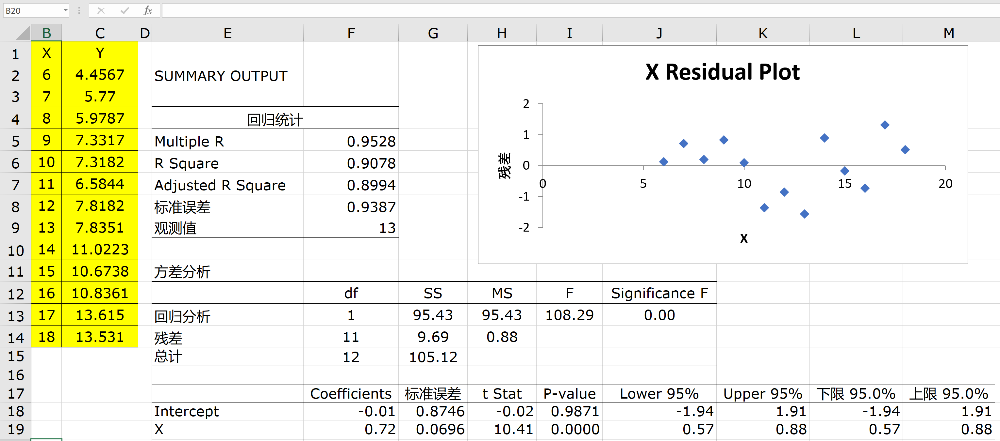
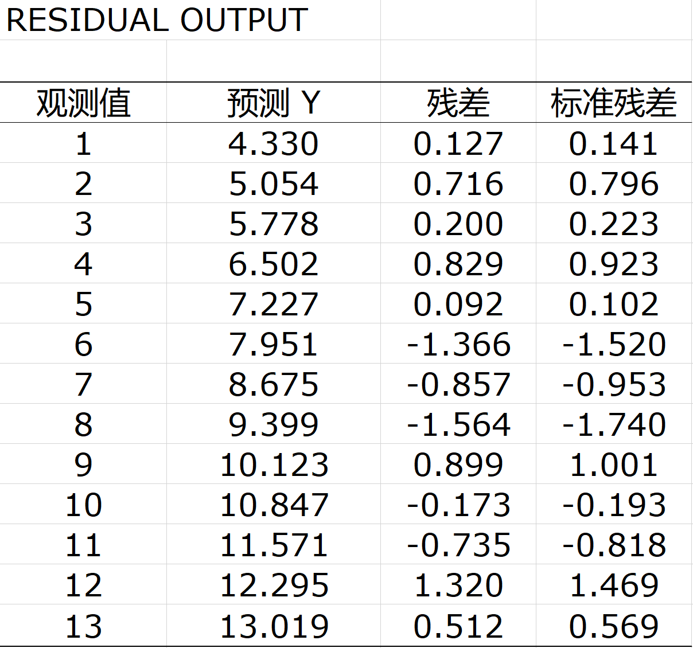

---
params:
  hideslide: TRUE
output:
  xaringan::moon_reader:
    seal: false
    lib_dir: libs
    css:
      - default
      - ../mycss/my-theme.css 
      - ../mycss/my-font.css
      - ../mycss/my-custom-for-video-roomy.css
      - ../mycss/text-box.css
      - duke-blue
      - hygge-duke
    nature:
      highlightStyle: github
      highlightLines: true
      countIncrementalSlides: false
      ratio: "16:9"
---
background-image: url("../pic/slide-front-page.jpg")
class: center,middle
exclude: `r params$hideslide`

# 统计学原理(Statistic)

<!---    chakra: libs/remark-latest.min.js --->

### 胡华平

### 西北农林科技大学

### 经济管理学院数量经济教研室

### huhuaping01@hotmail.com

### `r Sys.Date()`

```{r , echo=F,message=FALSE,warning=F, eval=!params$hideslide}
source("../R/set-global.R")
source("../R/xfun.R", encoding = "UTF-8")
source("../R/external-math-equation.R")
options(width = 70)
#source("../R/xaringan-chromote-print.R")
```


```{r , echo=FALSE, eval=!params$hideslide}
require('xaringanExtra')

xaringanExtra::use_tachyons()

xaringanExtra::use_panelset()

xaringanExtra::use_logo(
  image_url = "../pic/logo/nwafu-logo-circle-wb.png",
  height = '70px',
  position = xaringanExtra::css_position(top='0.2em',left="1em")
)
```

---
class: center, middle, duke-orange,hide_logo
name: chapter
exclude: `r params$hideslide`

# 第五章 相关和回归分析


### [5.1 变量间关系的度量](#corl)

### [5.2 回归分析的基本思想](#concept)

### [5.3 OLS方法与参数估计](#ols)

### [5.4 假设检验](#hypthesis)

### [5.5 拟合优度与残差分析](#goodness)

### [5.6 回归预测分析](#forecast)

### [5.7 回归报告解读](#report)

---
layout: false
class: center, middle, duke-softblue,hide_logo
name: hypothesis

# 5.4 假设检验

### 两种检验方法

### 回归系数t检验

### 方差分解（ANOVA）

### 模型整体显著性F检验

---
layout: true

<div class="my-header-h2"></div>

<div class="watermark1"></div>

<div class="watermark2"></div>

<div class="watermark3"></div>

<div class="my-footer"><span>huhuaping@  &emsp;&emsp; <a href="#chapter"> 第05章 相关和回归分析 </a>
&emsp;&emsp;&emsp;&emsp;&emsp;&emsp;&emsp;&emsp;&emsp;&emsp;&emsp;&emsp;&emsp;&emsp;&emsp;&emsp;&emsp;&emsp;&emsp;&emsp;&emsp;
<a href="#hypothesis"> 5.4 假设检验 </a> </span></div> 

---

## 假设检验：原理和思路

**假设检验**（Hypothesis Testing）：某一给定的观测或发现与某声称的假设是否相符？进行统计假设检验，就是要制定一套步骤和规则，以使决定接受或拒绝一个虚拟假设（原假设）。

.pull-left[
**虚拟假设**(null hypothesis) ——
$H_0$

- 指定或声称的假设，如
$H_0:  \beta_2 = 0$

- 它是一个等待被挑战的.red[**“靶子”**]！.red[**“稻草人”**]！
]

.pull-right[
**备择假设**(alternative hypothesis) ——
$H_1$

- 简单的（simple）备择假设，如
$H_1:  \beta_2 = 1.5$

- 复合的（composite）备择假设，如
$H_1:  \beta_2 \neq 1.5$
]

假设检验的具体方法：

- **置信区间检验**（confidence interval）

- **显著性检验**（test of significance）

--

**课堂讨论**：参数的置信区间检验和显著性检验有什么区别和联系？

---

## 假设检验：置信区间检验法（双侧检验）

**双侧或双尾检验**（Two-sided or Two-Tail Test）

$$H_0: \beta_2 =0; \quad H_1: \beta_2 \neq 0$$

- 假设检验目的：估计的是否与上述相容?

- 决策规则：

    - 构造一个
    $\beta_2$的
    $100(1-\alpha)\%$置信区间。

    - 如果
    $\beta_2$在
    $H_0$假设下落入此区间，就不拒绝
    $H_0$。
    
    - 如果它落在此区间之外，就要拒绝
    $H_0$。

---
exclude:true

## （示例）教育程度与时均工资

```{r}
source("Rscript/case-edu-wage.R", encoding = "UTF-8")
```


---

### （示例）教育程度与时均工资回归

对于**斜率参数**
$\beta_2$的置信区间检验法。

- **步骤1**：给出模型，并提出假设：

$$Y_i = \beta_1 + \beta_2X_i +u_i$$

$$H_0: \beta_2 =0.5; \quad H_1: \beta_2 \neq 0.5$$

- **步骤2**：给定
$\alpha=0.05,\quad (1-\alpha) 100 \%=95 \%$

- **步骤3**：根据前述计算结果，计算斜率参数
$\beta_2$的95%置信区间为：

```{r, results= "asis"}
cat(
"$$\\begin{align}",
"\\hat{\\beta}_{2} - t_{\\alpha / 2} \\cdot S_{\\hat{\\beta}_{2}} \\quad \\leq & \\beta_2 \\leq \\quad \\hat{\\beta}_{2} + t_{\\alpha / 2} \\cdot S_{\\hat{\\beta}_{2}} \\\\",
str_c(round(b2 - t_0.975*S_b2,4),
      "\\quad \\leq & \\beta_2 \\quad \\leq",
      round(b2 + t_0.975*S_b2, 4), "\\\\"),
"\\end{align}$$",
sep="\n"
)
```

- **步骤4**：那么我们可以对斜率参数
$\beta_2$做出如下检验判断：拒绝原假设
$H_0$，接受
$H_1$。认为，长期来看很多个区间 `r str_c("[",round(b2 - t_0.975*S_b2,4),",",round(b2 + t_0.975*S_b2, 4), "]")` 有95%的可能性不包含0.5（
$\beta_2 \neq 0.5$）。

---

### （示例）教育程度与时均工资回归

对于**截距参数**
$\beta_1$的置信区间检验法。

- **步骤1**：给出模型，并提出假设：

$$Y_i = \beta_1 + \beta_2X_i +u_i$$

$$H_0: \beta_1 =0; \quad H_1: \beta_1 \neq 0$$

- **步骤2**：给定
$\alpha=0.05,\quad (1-\alpha) 100 \%=95 \%$

- **步骤3**：根据前述计算结果，计算截距参数
$\beta_1$的95%置信区间为：

```{r, results= "asis"}
cat(
"$$\\begin{align}",
"\\hat{\\beta}_{1} - t_{\\alpha / 2} \\cdot S_{\\hat{\\beta}_{1}} \\quad \\leq & \\beta_1 \\leq \\quad \\hat{\\beta}_{1} + t_{\\alpha / 2} \\cdot S_{\\hat{\\beta}_{1}} \\\\",
str_c(round(b1 - t_0.975*S_b1,4),
      "\\quad \\leq & \\beta_1 \\quad \\leq",
      round(b1 + t_0.975*S_b1, 4), "\\\\"),
"\\end{align}$$",
sep="\n"
)
```

- **步骤4**：那么我们可以对截距参数
$\beta_1$做出如下检验判断：

    - 不能拒绝原假设
    $H_0$，暂时接受
    $H_0$。认为，长期来看很多个区间`r str_c("[",round(b1 - t_0.975*S_b1,4),",",round(b1 + t_0.975*S_b1, 4), "]")` 有95%的可能性包含0（
    $\beta_1=0$）。

---

## 假设检验：显著性检验法

**显著性检验方法**( test-of-significance approach)：是一种用样本结果来证实
$H_0$真伪的检验程序。

**关键思路**：

- 找到一个适合的检验统计量(test statistic) 。例如t统计量
$\chi^2$统计量、F统计量等。

- 知道该统计量在
$H_0$下的抽样分布(pdf)。往往与待检验参数有关系。

- 计算样本统计量的值。也即能用样本数据快速计算出来，例如
$t^{\ast}_{\hat{\beta_2}}=\frac{\hat{\beta}_2}{S_{\hat{\beta}_2}}$。


- 查表找出给定显著性水平
$\alpha$下的**理论统计量**的.red[**临界值**]。例如 $t_{1-\alpha/2}(n-2)=t_{0.975}(11)=$
`r formatC(t_0.975, 4, format="f")`

- 比较样本统计量值和该临界值的大小。例如，比较
$t^{\ast}_{\hat{\beta_2}}$与
$t_{0.975}(11)$


- 做出拒绝还是接受
$H_0$的判断。

---

## 假设检验：截距参数的t检验

对于截距参数
$\beta_1$的显著性检验（t检验）。

- **步骤1**：给出模型，并提出假设：

$$Y_i = \beta_1 + \beta_2X_i +u_i$$

$$H_0: \beta_1 =0; \quad H_1: \beta_1 \neq 0$$

- **步骤2**：构造合适的检验统计量

$$\begin{align} 
T&=\frac{\hat{\beta}_{1}-\beta_{1}}{S_{\hat{\beta}_{1}}}
&& \leftarrow T \sim t(n-2)
 \end{align}$$

---

## 假设检验：截距参数的t检验

- **步骤3**：基于原假设
$H_0$计算出样本统计量。

```{r, results="asis"}
cat(
  "$$\\begin{align} \\\\", 
"T&=\\frac{\\hat{\\beta}_{1}-\\beta_{1}}{S_{\\hat{\\beta}_{1}}} && \\leftarrow T \\sim t(n-2) \\\\",
"t^{\\ast}_{\\hat{\\beta}_1}&=\\frac{\\hat{\\beta}_{1}}{S_{\\hat{\\beta}_{1}}} && \\leftarrow H_0: \\beta_1 = 0 \\\\",
str_c("t^{\\ast}_{\\hat{\\beta}_1}&= \\frac{",round(b1,4), "}{", round(S_b1,4),"}=",round(b1/S_b1,4)),
 "\\end{align}$$",
  sep="\n"
)
```


- **步骤4**：给定显著性水平
$\alpha=0.05$下，查出统计量的**理论分布值**。

> 
$t_{1-\alpha/2}(n-2)=t_{1-0.05/2}(13-2)=t_{0.975}(11)=$
`r formatC(qt(0.975, n-2), 4, format="f")`

---

## 假设检验：截距参数的t检验

- **步骤5**：得到显著性检验的判断结论。

    - 若
    $|t^{\ast}_{\hat{\beta}_1}| > t_{1-\alpha/2}(n-2)$，则
    $\beta_1$的t检验结果**显著**。换言之，在显著性水平
    $\alpha=0.05$下，应**显著**地拒绝原假设
    $H_0$，接受备择假设
    $H_1$，认为截距参数
    $\beta_1 \neq 0$。
    
    - 若
    $|t^{\ast}_{\hat{\beta}_1}| < t_{1-\alpha/2}(n-2)$，则
    $\beta_1$的t检验结果**不显著**。换言之，在显著性水平
    $\alpha=0.05$下，不能**显著**地拒绝原假设
    $H_0$，只能暂时接受原假设
    $H_0$，认为截距参数
    $\beta_1 = 0$。

本例中，
 $|t^{\ast}_{\hat{\beta}_1}|=$
`r formatC(abs(t_b1), 4, format="f")` .red[**小于**]
$t_{0.975}(11)=$
`r formatC(qt(0.975, n-2), 4, format="f")`。因此，认为
$\beta_1$的t检验结果**不显著**。

换言之，在显著性水平
$\alpha=0.05$下，不能**显著**地拒绝原假设
$H_0$，只能暂时接受原假设
$H_0$，认为截距参数
$\beta_1 = 0$。

---

## 假设检验：斜率参数的t检验

对于斜率参数
$\beta_2$的显著性检验（t检验）。

- **步骤1**：给出模型，并提出假设：

$$Y_i = \beta_1 + \beta_2X_i +u_i$$

$$H_0: \beta_2 =0; \quad H_1: \beta_2 \neq 0$$

- **步骤2**：构造合适的检验统计量

$$\begin{align} 
T&=\frac{\hat{\beta}_{2}-\beta_{2}}{{S_{\beta_{2}}}}
&& \leftarrow T \sim t(n-2)
 \end{align}$$

---

## 假设检验：斜率参数的t检验

- **步骤3**：基于原假设
$H_0$计算出样本统计量。

```{r, results="asis"}
cat(
  "$$\\begin{align} \\\\", 
"T&=\\frac{\\hat{\\beta}_{2}-\\beta_{2}}{S_{\\hat{\\beta}_{2}}} && \\leftarrow T \\sim t(n-2) \\\\",
"t^{\\ast}_{\\hat{\\beta}_2}&=\\frac{\\hat{\\beta}_{2}}{S_{\\hat{\\beta}_{2}}} && \\leftarrow H_0: \\beta_2 = 0 \\\\",
str_c("t^{\\ast}_{\\hat{\\beta}_2}&= \\frac{",round(b2,4), "}{", round(S_b2,4),"}=",round(b2/S_b2,4)),
 "\\end{align}$$",
  sep="\n"
)
```


- **步骤4**：给定显著性水平
$\alpha=0.05$下，查出统计量的**理论分布值**。

> 
$t_{1-\alpha/2}(n-2)=t_{1-0.05/2}(13-2)=t_{0.975}(11)=$
`r formatC(qt(0.975, n-2), 4, format="f")`

---

## 假设检验：斜率参数的t检验

- **步骤5**：得到显著性检验的判断结论。

    - 若
    $|t^{\ast}_{\hat{\beta}_2}| > t_{1-\alpha/2}(n-2)$，则
    $\beta_2$的t检验结果**显著**。换言之，在显著性水平
    $\alpha=0.05$下，应**显著**地拒绝原假设
    $H_0$，接受备择假设
    $H_1$，认为斜率参数
    $\beta_2 \neq 0$。
    
    - 若
    $|t^{\ast}_{\hat{\beta}_2}| < t_{1-\alpha/2}(n-2)$，则
    $\beta_2$的t检验结果**不显著**。换言之，在显著性水平
    $\alpha=0.05$下，不能**显著**地拒绝原假设
    $H_0$，只能暂时接受原假设
    $H_0$，认为斜率参数
    $\beta_2 = 0$。

本例中，
 $|t^{\ast}_{\hat{\beta}_2}|=$
`r formatC(abs(t_b2), 4, format="f")` .red[**大于**]
$t_{0.975}(11)=$
`r formatC(qt(0.975, n-2), 4, format="f")`。因此，认为
$\beta_2$的t检验结果**显著**。

换言之，在显著性水平
$\alpha=0.05$下，应**显著**地拒绝原假设
$H_0$，接受备择假设
$H_1$，认为斜率参数
$\beta_2 \neq 0$。

---

## 假设检验：显著性水平VS显著性概率

我们可以回顾犯错误类型：

- 第I类错误：弃真错误
$\alpha = P(Z > Z_0|H_0=True)$

- 第II类错误：取伪错误
$\beta = P(Z \leq Z_0|H_1=True)$

- [给定样本容量时]如果我们要减少犯第I 类错误， 第II类错误就要增加；反之亦然。

为什么选择显著性水平
$\alpha$通常固定在0.01、0.05、0.1水平上？

- 约定而已，并非神圣不可改变！

- 如何改变？？

---

## 假设检验：显著性水平VS显著性概率

精确的显著性概率水平p值：

- 对给定的样本算出一个检验统计量(如t统计量)，查到与之对应的概率：p值(p value)或概率值(probability value)

- 不约定
$\alpha$，而是直接求出犯错误概率p值，由读者自己去评判犯错误的可能性和代价！！因人而异！！


---

## 假设检验：实际操作中的若干问题

关于**统计显著性**与**实际显著性**。

- 不能一味追求统计显著性，有时候还需要考虑“实际显著性”的现实意义。

- 举例说明：

    - 边际消费倾向(MPC)是指GDP每增加1美元带来消费的增加数；宏观理论表明收入乘数为：1/(1-MPC)。
    
    - 若MPC的95%置信区间为(0.7129,0.7306)，当样本表明MPC的估计值为
    $\widehat{MPC}=0.74$（此时，即乘数为3.84），你怎样抉择！！！
    

关于**置信区间方法**和**显著性检验方法**的选择。

- 一般来说，置信区间方法优于显著性检验方法！

- 例如：假设MPC
$H_0: \beta_2 =0$显然荒谬的！


---

## 方差分解（ANOVA）：Y变异的分解

```{r, out.width="65%"}
include_graphics("../pic/extra/chpt2-1-PRL-SRL.png")
```


$$\begin{alignedat}{2}
&&(Y_i - \bar{Y}) &&= (\hat{Y}_i - \bar{Y}) &&+ (Y_i - \hat{Y}_i ) \\
&&y_i &&= \hat{y}_i &&+ e_i 
\end{alignedat}$$

---

## 方差分解（ANOVA）：平方和分解

$$\begin{alignedat}{2}
&&(Y_i - \bar{Y}) &&= (\hat{Y}_i - \bar{Y}) &&+ (Y_i - \hat{Y}_i ) \\
&&y_i &&= \hat{y}_i &&+ e_i \\
&&\sum{y_i^2} &&= \sum{\hat{y}_i^2} &&+ \sum{e_i^2} \\
&&TSS &&=ESS &&+RSS
\end{alignedat}$$

- 其中：
$TSS$表示**总离差平方和**;
$ESS$表示**回归平方和**;
$RSS$表示**残差差平方和**


---

### （附录）：平方和分解证明过程

$$\begin{align}
\sum{y_i^2} &= \sum{(\hat{y}_i e_i)^2} \\
&= \sum{(\hat{y}_i^2 +2\hat{y}_ie_i +e_i^2)}\\
&= \sum{\hat{y}_i^2 } +2\sum{\hat{y}_ie_i} + \sum{e_i^2}\\
&= \sum{\hat{y}_i^2 } +2\sum{\left( \hat{(\beta_2}x_i)e_i \right)} + \sum{e_i^2}\\
&= \sum{\hat{y}_i^2 } +2\hat{\beta_2}\sum{\left( x_ie_i \right)} + \sum{e_i^2} && \leftarrow \left[ \sum{x_ie_i} =0 \right]\\ 
&= \sum{\hat{y}_i^2} + \sum{e_i^2}
\end{align}$$

---

## 方差分解（ANOVA）：双变量分解表

```{r}
anova_tab <- tribble(
  ~`变异来源`, ~`平方和符号SS`, ~`平方和计算公式`, ~`自由度df`,  ~`均方和符号MSS`, ~`均方和计算公式`, 
  "回归平方和", "ESS","\\(\\sum{(\\hat{Y}_i-\\bar{Y}_i)^2}=\\sum{\\hat{y}_i^2}\\)","1", "\\(MSS_{ESS}\\)", "\\(ESS/df_{ESS}=\\hat{\\beta}_2^2\\sum{x_i^2}\\)",
  "残差平方和", "RSS","\\(\\sum{(Y_i-\\hat{Y}_i)^2}=\\sum{e_i^2}\\)","n-2", "\\(MSS_{RSS}\\)", "\\(RSS/df_{RSS}=\\frac{\\sum{e_i^2}}{n-2}\\)",
  "总平方和", "TSS","\\(\\sum{(Y_i-\\bar{Y}_i)^2}=\\sum{y_i^2}\\)","n-1", "\\(MSS_{TSS}\\)", "\\(TSS/df_{TSS}=\\frac{\\sum{y_i^2}}{n-1}\\)"
)
```

```{r}
kable(anova_tab, align ="c") %>%
 kable_styling(full_width = T, font_size =20)
```


---

## 模型整体显著性检验：F检验

- **步骤1**：给出模型，并提出假设：

一元回归模型下：

$$Y_i = \beta_1 + \beta_2X_i +u_i$$

$$H_0: \beta_2 =0; \quad H_1: \beta_2 \neq 0$$

多元回归模型下：

$$Y_i = \beta_1 + \beta_2X_{2i} + \beta_3X_{3i}+ \cdots + \beta_kX_{ki}+ u_i$$

$$H_0: \beta_2 = \beta_3 =\cdots= \beta_k= 0; \quad H_1: \text{not all} \quad \beta_j = 0, \quad j \in 2, 3, \cdots, k$$

---

## 模型整体显著性检验：F检验

- **步骤2**：构造合适的检验统计量

$$\begin {align} 
\chi^2_1 &= \left( \frac{\hat{\beta}_{2}-\beta_{2} }{\sigma_{\hat{\beta_2}}}\right)^2
= \left( \frac{\hat{\beta}_{2}-\beta_{2} }{\sqrt{\sigma^{2}/\sum x_{i}^{2}}}\right)^2=\frac{\left(\hat{\beta}_{2}-\beta_{2}\right)^{2} \sum x_{i}^{2}}{\sigma^{2}} &&\leftarrow \chi^2_1 \sim \chi^2(1)
 \end {align}$$

$$\begin {align} 
\chi^2_{2}&=(n-2) \frac{\hat{\sigma}^{2}}{\sigma^{2}}=\frac{\sum e_{i}^{2}}{\sigma^{2}} && \leftarrow \chi^2_2 \sim \chi^2(n-2)
 \end {align}$$

$$\begin {align} 
F &= \frac{\chi^2_1/1}{\chi^2_2/n-2} 
= \left( \frac{\left(\hat{\beta}_{2}-\beta_{2}\right)^{2} \sum x_{i}^{2}}{\sigma^{2}} \right ) / \left( \frac{\sum e_{i}^{2}}{(n-2)\sigma^{2}} \right) 
=\frac{\left(\hat{\beta}_{2}-\beta_{2}\right)^{2} \sum x_{i}^{2}}{\sum e_{i}^{2} /(n-2)}\\
F & \sim F(1,n-2)
\end {align}$$

---

## 模型整体显著性检验：F检验

- **步骤3**：基于原假设
$H_0$计算出样本统计量。

$$\begin {align} 
F^{\ast} &= \frac{\left(\hat{\beta}_{2}-\beta_{2}\right)^{2} \sum x_{i}^{2}}{\sum e_{i}^{2} /(n-2)} &&\leftarrow H_0: \beta_2=0 \\
& = \frac{\hat{\beta}_{2}^{2} \sum x_{i}^{2}}{\sum e_{i}^{2} /(n-2)}\\
& = \frac{ESS / df_{ESS}}{RSS / df_{RSS}}
=\frac{MSS_{ESS}}{MSS_{RSS}}
=\frac{\hat{\beta}_{2}^{2} \sum x_{i}^{2}}{\hat{\sigma}^{2}}
\end {align}$$


---

## 模型整体显著性检验：F检验

- **步骤4**：给定显著性水平
$\alpha=0.05$下，查出统计量的**理论分布值**。
$F_{1-\alpha}(1,n-2)$

- **步骤5**：得到显著性检验的判断结论。

    - 若
    $F^{\ast} > F_{1-\alpha}(1,n-2)$，则
    模型整体显著性的F检验结果**显著**。换言之，在显著性水平
    $\alpha=0.05$下，应**显著**地拒绝原假设
    $H_0$，接受备择假设
    $H_1$，认为斜率参数
    $\beta_2 \neq 0$。
    
    - 若
    $F^{\ast} < F_{1-\alpha}(1,n-2)$，则
    模型整体显著性的F检验结果**不显著**。换言之，在显著性水平
    $\alpha=0.05$下，不能**显著**地拒绝原假设
    $H_0$，只能暂时接受原假设
    $H_0$，认为斜率参数
    $\beta_2 = 0$。

---

## 模型整体显著性检验：比较

F检验与t检验的**联系**：

- 在一元回归模型中，t检验与F检验的结论总是一致的。

- 对于检验斜率参数
$\beta_2$的显著性，两者可相互替代！在一元回归分析中，若假设
$H_0:\beta_2=0$，则
$F^{\ast} \simeq (t^{\ast})^2$

F检验与t检验的**不同**：

- 检验目的不同。F检验是检验模型的整体显著性；t检验是检验各个回归参数的显著性。

- 假设的提出不同：
    
    - F检验：斜率系数联合假设
    $H_0: \beta_2 =0; \quad H_1: \beta_2 \neq 0$
    
    - t检验：回归系数分别假设
    $H_0: \beta_i =0; \quad H_1: \beta_i \neq 0; \quad i \in 1,2$

- 检验原理的不同：F检验需要构造F统计量；t检验需要构造t统计量

---

### （案例）教育程度与时均工资：计算ANOVA表

```{r}
anova_value <- tribble(
  ~`变异来源`, ~`平方和SS`,  ~`自由度df`,  ~`均方和MSS`, 
  "回归平方和ESS", ESS, 1,  ESS/f_ESS, 
  "残差平方和RSS", RSS, n-2, RSS/f_RSS,
  "总平方和TSS", TSS, n-1, TSS/n-1
)

kable(anova_value, align= "c",digits=3,caption = "教育程度与时均工资案例的ANOVA分析表")
```

---

### （案例）教育程度与时均工资：F检验

- **步骤1**：给出模型
$Y_i = \beta_1 + \beta_2X_i +u_i$，提出假设：
$H_0: \beta_2 =0; \quad H_1: \beta_2 \neq 0$

- **步骤2**：构造合适检验的分布：

$$\begin {align} 
F &= \frac{\left(\hat{\beta}_{2}-\beta_{2}\right)^{2} \sum x_{i}^{2}}{\sum e_{i}^{2} /(n-2)} 
&& \leftarrow F \sim F(1,n-2)
\end {align}$$

- **步骤3**：基于原假设
$H_0: \beta_2=0$，可以计算出样本统计量。

```{r, results="asis"}
cat(
"$$\\begin {align}",
"F^{\\ast} = \\frac{\\hat{\\beta}_{2}^{2} \\sum x_{i}^{2}}{\\sum e_{i}^{2} /(n-2)}",
"= \\frac{ESS / df_{ESS}}{RSS / df_{RSS}}",
"=\\frac{MSS_{ESS}}{MSS_{RSS}}",
str_c("=\\frac{", round(ESS/f_ESS, 4),"}{",round(RSS/f_RSS, 4), "}=", round(f_test,4)),
"\\end {align}$$",
  sep="\n"
)
```

- **步骤4**：给定
$\alpha=0.05$下，查出F**理论值**
$F_{1-\alpha}(1,n-2)=F_{0.95}(1,11)=$ `r formatC(f_0.95, 4, format="f")`

- **步骤5**：得到显著性检验的判断结论。因为
$F^{\ast}=$ `r formatC(f_test,4, format="f")` .red[**大于**] $F_{0.95}(1,11)=$ `r formatC(f_0.95, 4, format="f")`，所以模型整体显著性的F检验结果**显著**。换言之，在显著性水平
$\alpha=0.05$下，应**显著**地拒绝原假设
$H_0$，接受备择假设
$H_1$，认为斜率参数
$\beta_2 \neq 0$。

---
layout: false
class: center, middle, duke-softblue,hide_logo
name: goodness

# 5.5 拟合优度与残存分析

### 拟合优度

### 残存分析

---
layout: true

<div class="my-header-h2"></div>

<div class="watermark1"></div>

<div class="watermark2"></div>

<div class="watermark3"></div>

<div class="my-footer"><span>huhuaping@  &emsp;&emsp; <a href="#chapter"> 第05章 相关和回归分析 </a>
&emsp;&emsp;&emsp;&emsp;&emsp;&emsp;&emsp;&emsp;&emsp;&emsp;&emsp;&emsp;&emsp;&emsp;&emsp;&emsp;&emsp;&emsp;&emsp;&emsp;&emsp;
<a href="#goodness"> 5.5 拟合优度与残存分析 </a> </span></div> 

---

## 拟合优度：引子

怎么来判定OLS方法对特定样本数据拟合的好坏？

请大家思考如下几个**问题**：

- 样本数据不完全落在拟合的直线（或曲线）上，是经常发生的么？

- 怎么来表达或测量这种对样本数据拟合的不完全性？

- 在OLS方法和CLRM假设“双剑合璧”下，对特定样本数据的拟合不是已经证明最好的么（BLUE）？为什么还要说“拟合”有“好坏之分”？


---

## 拟合优度：测量指标


**拟合优度**（Goodness of fit）：判断样本回归线对一组数据拟合优劣水平的度量。

**判定系数**（coefficient of determination）：一种利用平方和分解，考察样本回归线对数据拟合效果的总度量。一元回归中，一般记为
$r^2$；多元回归中，一般记为
$R^2$。

```{r, fig.cap="维恩图看拟合优度"}
include_graphics("../pic/extra/chpt3-fitness-venn.png", dpi =100)
```

---

## 拟合优度：测量指标

```{r, fig.cap="平方和分解看拟合优度"}
include_graphics("../pic/extra/chpt2-1-PRL-SRL.png", dpi=120)
```

---

## 拟合优度：判定系数

判定系数
$r^2$计算公式1：

$$\begin{align}
r^2 &=\frac{ESS}{TSS} = \frac{\sum{(\hat{Y}_i - \bar{Y})^2}}{\sum{(Y_i - \bar{Y})^2}} 
\end{align}$$

判定系数
$r^2$计算公式2：

$$\begin{align}
r^2 &=1- \frac{RSS}{TSS} = 1- \frac{\sum{e_i^2}}{\sum{(Y_i - \bar{Y})^2}} \\
\end{align}$$

---

## 拟合优度：判定系数

判定系数
$r^2$计算公式3：

$$\begin{align}
r^2 &=\frac{ESS}{TSS} 
= \frac{\sum{\hat{y}_i^2}}{\sum{y_i^2}} 
= \frac{\sum{(\hat{\beta}_2x_i)^2}}{\sum{y_i^2}} 
= \hat{\beta}_2^2\frac{\sum{x_i^2}}{\sum{y_i^2}} 
= \hat{\beta}_2^2 \frac{S_{X_i}^2}{S_{Y_i}^2}
\end{align}$$

判定系数
$r^2$计算公式4：

$$\begin{align}
r^2 &= \hat{\beta}_2^2 \cdot \frac{\sum{x_i^2}}{\sum{y_i^2}} 
= \left( \frac{\sum{x_iy_i}}{\sum{x_i^2}} \right)^2 \cdot \left( \frac{\sum{x_i^2}}{\sum{y_i^2}} \right)
= \frac{(\sum{x_iy_i})^2}{\sum{x_i^2 }\sum{y_i^2}}
\end{align}$$

课堂讨论：

- 讨论1： 
$r^2$是一个非负量。为什么？

- 讨论2：
$0 \leq r^2 \leq 1$，两个端值分别意味什么？

---

## 拟合优度：判定系数VS简单相关系数

判定系数与简单相关系数有什么区别与联系？

**总体相关系数**：是变量
$X_i$与变量
$Y_i$总体相关关系的参数，一般记为
$\rho$。

$$\begin{align}
\rho &=\frac{Cov(X,Y)}{\sqrt{Var(X_i)Var(Y_i)}}
=\frac{E(X_i-EX)(Y_i-EY)}{\sqrt{E(X_i-EX)^2E(Y_i-EY)^2}}
\end{align}$$

**样本相关系数**：是从总体中抽取随机样本，获得变量
$X_i$与变量
$Y_i$样本相关关系的统计量度量，一般记为
$r$。

$$\begin{align}
r &=\frac{S_{XY}^2}{S_X\ast S_Y}
=\frac{\sum{(X_i-\bar{X})(Y_i-\bar{Y})}}{\sqrt{\sum{(X_i-\bar{X}})^2\sum{(Y_i-\bar{Y})^2}}}
= \frac{\sum{x_iy_i}}{\sqrt{\sum{x_i^2 }\sum{y_i^2}}}
\end{align}$$

---

## 拟合优度：判定系数VS简单相关系数

判定系数和简单相关系数的联系:

- 在一元回归中，判定系数
$r^2$等于样本相关系数
$r$的平方。

判定系数和简单相关系数的区别：

- 判定系数
$r^2$表明因变量变异由解释变量所解释的比例，而相关系数
$r$只能表明变量间的线性关联强度。

- 在多元回归中，这种区别会更加凸显！因为那时的相关系数r出现了偏相关的情形(交互关联)！

---

### （案例）计算相关系数和判定系数

对于“教育程度与时均工资案例”，根据FF-ff计算表和方差分解ANOVA表，可以分别计算得到样本相关系数和模型判定系数。

样本相关系数
$r$：

```{r, results="asis"}
cat(
  "$$\\begin{align}",
  str_c("r =\\frac{S_{XY}^2}{S_X\\ast S_Y}=","\\frac{",round(cov_XY,4),"}{",round(S_X,4),"\\ast",round(S_Y,4),"} =",round(r,4),"\\\\"),
  "\\end{align}$$",
  sep = "\n"
)
```

回归方程的判定系数
$r^2$：

```{r, results="asis"}
cat(
  "$$\\begin{align}",
  str_c("r^2 &= 1- \\frac{RSS}{TSS}=",1,"-\\frac{",round(RSS,4),"}{",round(TSS,4),"} =",round(r2,4),"\\\\"),
  "\\end{align}$$",
  sep = "\n"
)
```

二者关系

---

## 拟合优度：小结与思考

**内容小结**：

- 即使采用OLS方法，它对样本数据的拟合也是不完全的。意味着实际数据点在样本回归线附近，而不是在样本回归线上。我们可以把样本点行为的“变异”，划分为“回归”能解释的部分和“随机”的部分。并进一步获得变异平方和的分解。

- 判定系数
$R^2$是对OLS拟合程度的测量，它使用了变异平方和分解的思想。在一元线性回归（含截距）中，判定系数与相关系数存在如下关系
$R^2 = r^2_{(X_i,Y_i)}$。注意，在多元回归中则不存在这种关系。

**问题思考**：

- OLS方法的参数估计量，在CLRM假设满足情况下，就是最优线性无偏估计量（BLUE），为什么还要用**判定系数**来判断“拟合好还是不好？”。对此，你的回答是什么？

- 还有没有其他指标，来反映估计方法对样本数据的拟合好坏程度？请说出一两个。

???
参考答案：还可以有**均方误差和**（MSE）
$MSE=RSS/n= 1/n\sum{(Y_i - \hat{Y}_i})^2$，以及**均方误差根**（RMSE）等。

---

## 残差分析：定义和作用

**残差**(residual)：是因变量的观测值与根据估计的回归方程求出的估计值之差，用
$e_i$表示。

$$e_i = Y_i - \hat{Y_i}$$

对模型的残差进行分析，主要目的包括：

- 反映用估计的回归方程去预测而引起的误差。

- 可用于确定有关随机干扰项
$\mu_i$的假定是否成立。

- 用于检测有影响的观测值。

---

## 残差分析：皮尔逊标准化残差

**标准化残差**(standardized residual)：是对残差进行某种标准化变换。具体计算方法有**皮尔逊标准化残差**和**学生化标准残差**两种。

最常用的皮尔逊标准化残差（Pearson residual/.red[internally studentized residuals]）的计算公式如下：

$$\begin{align}
e_{i, sd}^{\ast}= \frac{e_i}{s_{e_i}} 
= \frac{(Y_i - \hat{Y_i})}{\sqrt{\frac{\sum{(e_i-\bar{e})^2}}{n-1}}}
\end{align}$$

---

## 残差分析：皮尔逊标准化残差

**学生化标准残差**（Studentized Residuals/.red[externally studentized residual]/deleted Studentized residual/semi-studentized residuals/jackknifed residuals），是对残差的另一种特殊标准化变换（例如考虑到了X的影响力）。

**学生化标准残差**的计算公式有两个<sup>*</sup>：

$$\begin{align}
e_{i,st}^{\ast} &= \frac{e_i}{\sqrt{MSE_{(i)}(1-h_{ii})}} \\
e_{i,st}^{\ast}& = e_{i, sd}^{\ast}\left( \frac{n-m-2}{n-m-1-e_{i, sd}^{\ast 2}}\right)^2
\end{align}$$

> 其中：
$MSE_{(i)}$是指删除第
$i$个观测值进行建模的**均方误差**（MSE）；
$h_{ii}$指删除第
$i$个观测值进行建模的第
$i$个**影响权重**（leverage）。
$m=k-1$为回归元个数。

.footnote[
说明：
1）学生化残差的第一个计算公式计算起来比较麻烦和复杂。需要分别进行(n-1)次线性回归，然后依次计算相关
$MSE_{(i)}$和
$h_ii$。2）学生化残差的第二个计算公式相对简单，只需要利用原来的回归模型及其标准化残差
$e_{i, sd}^{\ast}$。

]

???

理论参看：

- [Studentized Residuals](https://online.stat.psu.edu/stat462/node/247/)

- [Using Leverages to Help Identify Extreme X Values](https://online.stat.psu.edu/stat462/node/171/)

操作参看：
- [Is studentized residuals v/s standardized residuals in lm model](https://stats.stackexchange.com/questions/204708/is-studentized-residuals-v-s-standardized-residuals-in-lm-model)

---

## 残差分析：残差图

**残差图**(residual plot)：用于呈现残差数据
$e_i$的分布情况的统计图图形，主要包括：


- 关于
$X_i$的残差散点图。

- 关于
$Y_i$的残差散点图（或者关于
$\hat{Y_i}$）。

- 关于样本序号的残差散点图或标准化残差散点图。

---

### （示例）残差图的模拟演示


```{r, out.width= "75%"}
include_graphics("../pic/extra/chpt8-diagnose-ei.png")
```

???
残差序列
$e_i$（或者标准化残差序列
$e_i^{\ast}$）与相关变量（包括
$X_i; Y_i;\hat{Y_i}$以及样本序号）之间**散点图**的若干假想分布模式。

---

### （案例）皮尔逊标准化残差

.pull-left[

```{r, eval=T}
show_tbl %>%
  select(c(1:3,12:14)) %>%
  mutate_at(vars(contains("e_")), funs(formatC(., digits = 4, format = "f"))) %>%
  kable( ) %>%  
  kable_styling(font_size=20)
```


]

.pull-right[

- 根据样本回归方程，可以计算得到
$Y_i$的回归拟合值
$\hat{Y}_i$，以及回归残差
$e_i$。

$$\begin{align}
\hat{Y}_i &=\hat{\beta}_1 +\hat{\beta}_2X_i\\
e_i &= Y_i - \hat{Y}_i
\end{align}$$

- 进一步地计算得到**皮尔逊标准化残差**
$e_{i, sd}^{\ast}$：

$$\begin{align}
e_{i, sd}^{\ast}= \frac{e_i}{s_{e_i}} 
= \frac{(Y_i - \hat{Y_i})}{\sqrt{\frac{\sum{(e_i-\bar{e})^2}}{n-1}}}
\end{align}$$

]


---

### （案例）学生化标准残差

.pull-left[

```{r, eval=T}
show_tbl %>%
  select(c(1:3,12:15)) %>%
  mutate_at(vars(contains("e_")), funs(formatC(., digits = 4, format = "f"))) %>%
  kable() %>%  
  kable_styling(font_size=20)

```


]

.pull-right[

- 根据样本回归方程，可以计算得到
$Y_i$的回归拟合值
$\hat{Y}_i$，以及回归残差
$e_i$，以及前述的**皮尔逊标准化残差**
$e_{i, sd}^{\ast}$。

- 进而可以使用如下公式计算得到**学生化标准残差**
$e_{i,st}^{\ast}$：

$$\begin{align}
e_{i,st}^{\ast}& = e_{i, sd}^{\ast}\left( \frac{n-k-2}{n-k-1-e_{i, sd}^{\ast 2}}\right)^2
\end{align}$$

]

---

### （案例）皮尔逊标准化残差散点图

```{r}
resid_tbl <- calc_tbl %>%
  select(all_of(c("obs", "X", "Y")), all_of(contains("e_i")))

resid_tbl %>%
  ggplot(aes(X, e_i)) +
  geom_point() +
  #labs(x = ) +
  theme(text = element_text(size=18),
        axis.title.x = element_text(size = 16,
                                margin = margin(t = 15, r = 0, 
                                                b = 0, l = 0)),
        axis.title.y = element_text(size = 16,
                                margin = margin(t = 0, r = 15, 
                                                b = 0, l = 0)))
```


---
layout: false
class: center, middle, duke-softblue,hide_logo
name: forecast

# 5.6 回归预测分析

### 均值预测

### 个值预测

### 置信带

---
layout: true

<div class="my-header-h2"></div>

<div class="watermark1"></div>

<div class="watermark2"></div>

<div class="watermark3"></div>

<div class="my-footer"><span>huhuaping@  &emsp;&emsp; <a href="#chapter"> 第05章 相关和回归分析 </a>
&emsp;&emsp;&emsp;&emsp;&emsp;&emsp;&emsp;&emsp;&emsp;&emsp;&emsp;&emsp;&emsp;&emsp;&emsp;&emsp;&emsp;&emsp;&emsp;&emsp;&emsp;
<a href="#forecast"> 5.6 回归预测分析 </a> </span></div> 

---

## 回归预测：引子

预测未来事件的一些惯常说法

- 算命术士：

    - “客官印堂发黑，明日必有凶象!”

- 天气预报播报词：

    - 预测西安明天是小雨，概率为95%。
    
    - 预测西安明天是小雨转阴，概率为95%。
    
    - 预测西安明天是天晴或阴天或雨天，概率为100%！

- 简要解析：
    
    - 人们在预测什么事件？
    
    - 预测多少个事件？它们发生的关系？
    
    - 预测如何令人信服？

---

## 回归预测：两类预测

一元回归模型下：

$$Y_i = \beta_1 + \beta_2X_i +u_i$$

预测什么？

**均值预测**(mean prediction)：

- 给定
$X_0$，预测Y的条件均值
$E(Y|X=X_0)$


**个值预测**(individual prediction)：

- 给定
$X_0$，预测对应于
$X0$的Y的个别值
$(Y_0|X_0)$

---

### （示例）样本内预测

```{r}
dpi_pred <-  220
include_graphics("../pic/extra/chpt4-forecast-demo-01-insample.png", dpi= dpi_pred)
```

---

### （示例）样本外预测

```{r}
include_graphics("../pic/extra/chpt4-forecast-demo-02-outsample.png" , dpi= dpi_pred)
```


---

### （示例）均值预测

```{r}
include_graphics("../pic/extra/chpt4-forecast-demo-03-exp.png", dpi= dpi_pred)
```

---

### （示例）个值预测

```{r}
include_graphics("../pic/extra/chpt4-forecast-demo-04-ind.png", dpi= dpi_pred)
```

---

## 回归预测：预测分析的关键

拿什么来预测？——样本数据？样本回归线？样本拟合值？

样本外拟合值
$\hat{Y}_0|X=X_0$：

- 可以证明：样本外拟合值
  $\hat{Y}_0|X=X_0$是**均值**
  $E(Y|X=X_0)$的一个.blue[**BLUE**]

- 也可以证明：样本外拟合值
  $\hat{Y}_0|X=X_0$是**个值**
  $(Y_0|X=X_0)$的一个.blue[**BLUE**]

工资案例中，给定
$X_0=$ `r X_0`，则可以得到样本外拟合值：

```{r, results="asis"}
cat(
  "\\begin{align}",
  "\\hat{Y}_{0}=\\hat{\\beta}_{1}+\\hat{\\beta}_{2} X_{0}",
  str_c("=",round(b1,4),"+",round(b2,4),"\\ast",X_0),
  str_c("=",round(Y_0_hat, 4)),
  "\\end{align}",
  sep="\n"
  )
```


---

## 回归预测：预测分析的关键

```{r}
include_graphics("../pic/extra/chpt4-forecast-demo-05-fitted.png", dpi= dpi_pred)
```

---

## 均值预测

在**N-CLRM**假设和**OLS**方法下，可以证明（证明过程略）给定
$X_0$下的拟合值
$\hat{Y}_0$服从如下正态分布：

$$\begin {align} 
\hat{Y}_{0} \sim \mathrm{N}\left(\mu_{\hat{Y}_{0}}, \sigma_{\hat{Y}_{0}}^{2}\right)
\end {align}$$

$$\begin {align} 
\mu_{\hat{Y}_{0}}=E\left(\hat{Y}_{0}\right)=E\left(\hat{\beta}_{1}+\hat{\beta}_{2} X_{0}\right)=\beta_{1}+\beta_{2} X_{0}=E(Y | X_{0})
\end {align}$$

$$\begin {align} 
\operatorname{var}\left(\hat{Y}_{0}\right)=\sigma_{\hat{Y}_{0}}^{2}=\sigma^{2}\left[\frac{1}{n}+\frac{\left(X_{0}-\overline{X}\right)^{2}}{\sum x_{i}^{2}}\right]
 \end {align}$$

$$\begin {align} 
\hat{Y}_{0} \sim N\left(E(Y | X_{0}), \sigma^{2}\left[\frac{1}{n}+\frac{\left(X_{0}-\overline{X}\right)^{2}}{\sum x_{i}^{2}}\right]\right)
\end {align}$$

---

## 均值预测

对
$\hat{Y}_{0}$构造**t统计量**：

$$\begin {align} 
T &=\frac{\hat{Y}_{0}-\mathrm{E}(\mathrm{Y} | \mathrm{X}_{0})}{S_{\hat{Y}_{0}}} \sim t(n-2)
&& \Leftarrow S_{\hat{Y}_{0}}=\sqrt{\hat{\sigma}^{2}\left[\frac{1}{n}+\frac{\left(X_{0}-\overline{X}\right)^{2}}{\sum x_{i}^{2}}\right]}
\end {align}$$

得到**均值**
$E(Y|X=X_0)$置信区间为：

$$\begin {align} 
\operatorname{Pr}\left[\hat{Y}_{0}-t_{1-\alpha / 2}(n-2) \cdot S_{\hat{Y}_{0}} \leq E(Y | X_{0}) \leq \hat{Y}_{0}+t_{1-\alpha / 2}(n-2) \cdot S_{\hat{Y}_{0}}\right]=1-\alpha
\end {align}$$
 
$$\begin {align} 
\operatorname{Pr}\left[\hat{\beta}+\hat{\beta}_{2} X_{0}-t_{1-\alpha / 2}(n-2) \cdot S_{\hat{Y}_{0}} \leq E(Y | X_{0}) \leq \hat{\beta}+\hat{\beta}_{2} X_{0}+t_{1- \alpha / 2}(n-2) \cdot S_{\hat{Y}_{0}}\right]=1-\alpha
\end {align}$$

---

### （案例）教育程度和时均工资：均值预测

给定
$X_0=$ `r X_0`时，根据早前计算结果：
$\hat{\sigma}^2=$ `r formatC(dev, 4, format="f")`；
$\bar{X}=$ `r formatC(mean_X, 4, format="f")`；
$\sum{x_i^2}=$ `r formatC(FF_ff$ff_x_sqr, 4, format="f")`。因此可以得到：

```{r, results="asis"}
cat(
  "\\begin{align}",
  "S^2_{\\hat{Y}_{0}} &=\\hat{\\sigma}^{2}\\left[\\frac{1}{n}+\\frac{\\left(X_{0}-\\overline{X}\\right)^{2}}{\\sum x_{i}^{2}}\\right] ",
  str_c("=",round(dev,4), "\\left( \\frac{1}{",n,"}+","\\frac{(",round(X_0,4),"-",round(mean_X,4),")^2}{",round(FF_ff$ff_x_sqr,4), "}", "\\right)"),
  str_c("=",round(S2_Y0h,4), "; \\quad"),
  str_c("S_{\\hat{Y}_{0}} = \\sqrt{S^2_{\\hat{Y}_{0}}}=",
        round(sqrt(S2_Y0h),4)
        ),
  "\\end{align}",
  sep="\n"
)
```


```{r, results="asis"}
cat(
  "\\begin{align}",
  "\\hat{Y}_{0}=\\hat{\\beta}_{1}+\\hat{\\beta}_{2} X_{0}",
  str_c("=",round(b1,4),"+",round(b2,4),"\\ast",X_0),
  str_c("=",round(Y_0_hat, 4)),
  "\\end{align}",
  sep="\n"
  )
```

因此，可以计算得到**均值**
$E(Y|X=20)$置信区间为：

```{r, results="asis"}
cat(
  "\\begin{align}",
  "\\hat{\\beta}+\\hat{\\beta}_{2} X_{0}-t_{1-\\alpha / 2}(n-2) \\cdot S_{\\hat{Y}_{0}} \\leq  & E(Y | X_{0}) \\leq \\hat{\\beta}+\\hat{\\beta}_{2} X_{0}+t_{1- \\alpha / 2}(n-2) \\cdot S_{\\hat{Y}_{0}} \\\\",
  str_c(round(Y_0_hat,4),"-",round(t_0.95, 4),"\\ast",round(sqrt(S2_Y0h),4), 
        "\\leq & E(Y|X_0=",X_0,")\\leq", 
        round(Y_0_hat,4),"+",round(t_0.95, 4),"\\ast",round(sqrt(S2_Y0h),4)
        ),"\\\\",
  str_c(round(Y_exp_lft,4), 
        "\\leq & E(Y|X_0=",X_0,")\\leq", 
        round(Y_exp_rht,4)
        ),
  "\\end{align}",
  sep="\n"
)
```

---

### （案例）教育程度和时均工资：均值预测

```{r}
include_graphics("../pic/extra/chpt4-forecast-demo-06-interval-exp.png", dpi= dpi_pred)
```

---

## 个值预测

在**N-CLRM**假设和**OLS**方法下，可以证明（证明过程略）给定
$X_0$下的个别值
$Y_0=\beta_1+\beta_2X_0 +u_0$服从如下正态分布：

$$\begin {align} 
Y_{0} &\sim \mathrm{N}\left(\mu_{Y_{0}}, \sigma_{Y_{0}}^{2}\right) \\
\mu_{Y_{0}}&=E\left(Y_{0}\right)=E\left(\beta_{1}+\beta_{2} X_{0}\right)=\beta_{1}+\beta_{2} X_{0} \\
Var(Y_{0}) &=Var{(u_0)}=\sigma^{2}
\end {align}$$


$$\begin {align} 
Y_{0} \sim N\left(\beta_{1}+\beta_{2} X_{0}, \sigma^{2} \right)
\end {align}$$

---

## 个值预测

进一步可以构造新的随机变量
$(Y_0-\hat{Y}_0)$，其将服从如下正态分布：

$$\begin {align} 
Y_{0} & \sim N\left(\beta_{1}+\beta_{2} X_{0}, \sigma^{2} \right)\\
\hat{Y}_{0} & \sim N\left( \beta_{1}+\beta_{2} X_{0}, \sigma^{2}\left[\frac{1}{n}+\frac{\left(X_{0}-\overline{X}\right)^{2}}{\sum x_{i}^{2}}\right]\right) 
\end {align}$$

$$\begin {align} 
Y_{0} - \hat{Y}_{0} & \sim N\left( 0, \sigma^{2}\left[1 + \frac{1}{n}+\frac{\left(X_{0}-\overline{X}\right)^{2}}{\sum x_{i}^{2}}\right]\right) \\
Y_{0} - \hat{Y}_{0} & \sim N\left( 0, \sigma^{2}_{Y_{0} - \hat{Y}_{0}} \right)
\end {align}$$


---

## 个值预测

对
$Y_{0} - \hat{Y}_{0}$构造**t统计量**：

$$\begin {align} 
T &=\frac{(Y_{0} - \hat{Y}_{0})}{S_{(Y_{0} - \hat{Y}_{0})}} \sim t(n-2)
&& \Leftarrow S_{(Y_{0} - \hat{Y}_{0})}
=\sqrt{\hat{\sigma}^{2}\left[1+\frac{1}{n}+\frac{\left(X_{0}-\overline{X}\right)^{2}}{\sum x_{i}^{2}}\right]}
\end {align}$$

得到**个值**
$Y_{0}$置信区间为：

$$\begin {align} 
\operatorname{Pr}\left[\hat{Y}_{0}-t_{1-\alpha / 2}(n-2) \cdot S_{(Y_{0} - \hat{Y}_{0})} \leq Y_{0} \leq \hat{Y}_{0}+t_{1-\alpha / 2}(n-2) \cdot S_{(Y_{0} - \hat{Y}_{0})}\right]=1-\alpha
\end {align}$$
 
$$\begin {align} 
\operatorname{Pr}\left[\hat{\beta}+\hat{\beta}_{2} X_{0}-t_{1-\alpha / 2}(n-2) \cdot S_{(Y_{0} - \hat{Y}_{0})} 
\leq Y_{0} \leq 
\hat{\beta}+\hat{\beta}_{2} X_{0}+t_{1- \alpha / 2}(n-2) \cdot S_{(Y_{0} - \hat{Y}_{0})}\right]=1-\alpha
\end {align}$$


---

### （案例）教育程度和时均工资：个值预测

给定
$X_0=$ `r X_0`时，根据早前计算结果：
$\hat{\sigma}^2=$ `r formatC(dev, 4, format="f")`；
$\bar{X}=$ `r formatC(mean_X, 4, format="f")`；
$\sum{x_i^2}=$ `r formatC(FF_ff$ff_x_sqr, 4, format="f")`。因此可以得到：

```{r, results="asis"}
cat(
  "\\begin{align}",
  "S^2_{(Y_{0} - \\hat{Y}_{0})} &=\\hat{\\sigma}^{2}\\left[1+\\frac{1}{n}+\\frac{\\left(X_{0}-\\overline{X}\\right)^{2}}{\\sum x_{i}^{2}}\\right] ",
  str_c("=",round(dev,4), "\\left( 1+ \\frac{1}{",n,"}+","\\frac{(",round(X_0,4),"-",round(mean_X,4),")^2}{",round(FF_ff$ff_x_sqr,4), "}", "\\right)"),
  str_c("=",round(S2_Y0h_mns,4)),"\\\\",
  str_c("S_{\\hat{Y}_{0}} &= \\sqrt{S^2_{\\hat{Y}_{0}}}=",
        round(sqrt(S2_Y0h_mns),4)
        ),
  "\\end{align}",
  sep="\n"
)
```


```{r, results="asis"}
cat(
  "\\begin{align}",
  "\\hat{Y}_{0}=\\hat{\\beta}_{1}+\\hat{\\beta}_{2} X_{0}",
  str_c("=",round(b1,4),"+",round(b2,4),"\\ast",X_0),
  str_c("=",round(Y_0_hat, 4)),
  "\\end{align}",
  sep="\n"
  )
```

因此，可以计算得到**个值**
$(Y_0|X=20)$置信区间为：

```{r, results="asis"}
cat(
  "\\begin{align}",
  "\\hat{\\beta}+\\hat{\\beta}_{2} X_{0}-t_{1-\\alpha / 2}(n-2) \\cdot S_{(Y_{0} - \\hat{Y}_{0})} \\leq  & Y_0 | X=X_0) \\leq \\hat{\\beta}+\\hat{\\beta}_{2} X_{0}+t_{1- \\alpha / 2}(n-2) \\cdot S_{(Y_{0} - \\hat{Y}_{0})} \\\\",
  str_c(round(Y_0_hat,4),"-",round(t_0.95, 4),"\\ast",round(sqrt(S2_Y0h_mns),4), 
        "\\leq & Y_0|X_0=",X_0,")\\leq", 
        round(Y_0_hat,4),"+",round(t_0.95, 4),"\\ast",round(sqrt(S2_Y0h_mns),4)
        ),"\\\\",
  str_c(round(Y_ind_lft,4), 
        "\\leq & Y_0|X_0=",X_0,")\\leq", 
        round(Y_ind_rht,4)
        ),
  "\\end{align}",
  sep="\n"
)
```

---

### （案例）教育程度和时均工资：个值预测

```{r}
include_graphics("../pic/extra/chpt4-forecast-demo-09-interval-ind.png", dpi= dpi_pred)
```

---

## 置信带

**置信带**(confidence interval)：对所有的X值，分别进行**均值**和**个值**分别进行预测，就能得到：

- 均值预测的置信带——总体回归函数的置信带

- 个值预测的置信带

- 预测如何可信？
    
    - 均值预测置信区间
    
    - 均值预测置信带

- 样本内置信带。——检验可靠性

- 样本外置信带。——预测未来值范围


---

## 置信带

```{r}
include_graphics("../pic/extra/chpt4-forecast-demo-08-band-exp.png", dpi= dpi_pred)
```

---

## 置信带

```{r}
include_graphics("../pic/extra/chpt4-forecast-demo-10-band-ind.png", dpi= dpi_pred)
```

---

## 置信带

如何理解置信带？

- 谁更宽？——均值预测更准确

- 何处最窄？—— 中心点
$(\bar{X}, \bar{Y})=$ `r str_c("(",mean_X,",", formatC(mean_Y,2,format="f"),")")`是历史信息的集中代表。

---

## 回归预测：总结与思考

**内容总结**：

- 回归预测基于一套坚实严密的“底座”：OLS估计方法、CLRM假设、BLUE估计性质

- 均值预测置信带和个值预测置信带，是对预测可信度的形象表达。

- （同等条件下）均值预测比个值预测更准确（置信带宽窄）


**课堂思考**：

- 同样是95%置信度区间，两个人的认识是一样的么？

**课后作业**：工资与教育案例扩展

- 请计算置信度
$100(1−\alpha)=95\%$下，
$X_0=20$时均值的置信区间。
与
$100(1−\alpha)=90\%$时相比，有什么差异？

- 99%更值得可信么？

---
layout: false
class: center, middle, duke-softblue,hide_logo
name: report

# 5.7 回归报告解读

### 方程表达式

### 表格表达式

### 统计软件

---
layout: true

<div class="my-header-h2"></div>

<div class="watermark1"></div>

<div class="watermark2"></div>

<div class="watermark3"></div>

<div class="my-footer"><span>huhuaping@  &emsp;&emsp; <a href="#chapter"> 第05章 相关和回归分析 </a>
&emsp;&emsp;&emsp;&emsp;&emsp;&emsp;&emsp;&emsp;&emsp;&emsp;&emsp;&emsp;&emsp;&emsp;&emsp;&emsp;&emsp;&emsp;&emsp;&emsp;&emsp;
<a href="#report"> 5.7 回归报告解读 </a> </span></div>

---

## 回归分析的形式

**课程要求**：会熟练、正确阅读统计软件给出的各类分析报告，理解其中的关键信息和内涵。这些分析报告包括：传统的多元回归分析报告；以及各种计量检验的辅助分析报告（如异方差white检验报告）等。

根据统计软件的不同（`stata`；`Eview`；`R`；`Excel` ……），各种分析报告呈现形式略有差异，但基本要素和信息都大抵一致。

给定如下一元回归模型：

$$Y_i = \beta_1 + \beta_2X_i +u_i$$

---

## 回归分析的形式（多行方程表达法）

**形式1：多行方程表达法**（整理好的**精炼报告**）：根据统计软件的原始报告，往往是选取最关键的信息，经过整理并以多行**样本回归方程**（SRF）的形式呈现，**精炼报告**的形式一般为：

```{r, results="asis"}
mod_wage <- "Y~X"
fun_report_eq(lm.mod = mod_wage, lm.dt = data_wage,
              lm.n = 3)
```

--

- 第1行表示样本回归函数（回归系数）

- 第2行(t)表示回归系数对应的**样本t统计量**（
$t^{\ast}_{\hat{\beta}_i},i \in 1,2,\cdots, k$）

- 第3行(se)表示回归系数对应的**样本标准误差**（
$S_{\hat{\beta}_i},i \in 1,2,\cdots, k$）

- 第4行(fitness)表示回归模型**拟合情况**和**统计检验**的简要信息，其中
$R^2$表示**判定系数**，
$\bar{R}^2$表示**调整判定系数**，F表示模型整体显著性检验中的**样本F统计量值**（
$F^{\ast}$）,p表示样本F统计量值对应的概率值。

---

## 回归分析的形式（表格列示法）

**形式2：表格列示法**（整理好的**精炼报告**）：根据统计软件的原始报告，往往是选取最关键的信息，经过整理以表格形式呈现，**表格列示法**的形式呈现为：

```{r demo-kable}
require("broom")
out_lm <- summary(lm(mod_wage,data_wage))
kable(broom::tidy(lm(mod_wage,data_wage)), align= "c")
```

--

- **第1列**：`term`表示回归模型中包含的变量，也即
$X_{2i},X_{3i},\cdots,X_{ki}$，其中**截距项**默认为`(Intercept)`。

- **第2列**：`estimate`表示回归系数的估计值，也即
$\hat{\beta}_1,\hat{\beta}_2, \cdots, \hat{\beta}_k$。

- **第3列**：`std.error`表示回归系数对应的**样本标准误差**，也即
$S_{\hat{\beta}_i},i \in 1,2,\cdots, k$。

- **第4列**：`statistic`表示回归系数对应的**样本t统计量**，也即
$t^{\ast}_{\hat{\beta}_i},i \in 1,2,\cdots, k$

- **第5列**：`p.value`表示回归系数**样本t统计量**对应的概率值，也即
$Pr(t = t^{\ast}_{\hat{\beta}_i})=p$

---

### （示例）Excel软件原始报告：全貌

**形式3：原始报告**：分析软件如`EViews`、`R`、`STATA`、`Excel`等直接自动生成的多元回归分析报告。`Excel`软件原始分析报告形式如下：

```{r}

```

---

### （示例）Excel软件原始报告：参数估计

```{r}
include_graphics("../pic/chpt05-reg-excel-report-estimate.png")
```

---

### （示例）Excel软件原始报告：拟合优度

```{r}
include_graphics("../pic/chpt05-reg-excel-report-goodness.png")
```

---

### （示例）Excel软件原始报告：方差分解

```{r}
include_graphics("../pic/chpt05-reg-excel-report-anova.png")
```

---

### （示例）Excel软件原始报告：残差表

```{r}

```

---

### （示例）Excel软件原始报告：残差图

```{r}
include_graphics("../pic/chpt05-reg-excel-residual.png")
```


---

### 回归分析的形式（EViews软件原始报告）

**形式3：原始报告**：分析软件如`EViews`、`R`、`STATA`等直接自动生成的多元回归分析报告。`EViews`软件原始分析报告形式如下：**抬头区域**

.pull-left[
```{r}
include_graphics("../pic/extra/chpt4-eq-report-EViews.png")
```
]

--

.pull-right[

- `Dependent Variable: Y`：因变量

- `Method: Least Squares`：分析方法

- `Date: 03/09/19  Time: 10:55`：分析的时间

- `Sample: 1 13`：样本范围

- `Included observations: 13`：样本数n

]

---

### 回归分析的形式（EViews软件原始报告）

**形式3：原始报告**：分析软件如`EViews`、`R`、`STATA`等直接自动生成的多元回归分析报告。`EViews`软件原始分析报告形式如下：**三线表区域**

.pull-left[
```{r}
include_graphics("../pic/extra/chpt4-eq-report-EViews.png")
```
]

--

.pull-right[

- **第1列**：`Variable`表示模型包含的变量，
$X_{2i},X_{3i},\cdots,X_{ki}$，其中**截距项**默认为`C`。

- **第2列**：`Coefficient`回归系数，也即
$\hat{\beta}_1,\hat{\beta}_2, \cdots, \hat{\beta}_k$；

- **第3列**：`Std. Error`回归系数的样本标准误差，也即也即
$S_{\hat{\beta}_i},i \in 1,2,\cdots, k$。

- **第4列**：`t-Statistic`表示回归系数对应的**样本t统计量**，也即
$t^{\ast}_{\hat{\beta}_i},i \in 1,2,\cdots, k$；

- **第5列**：`Prob.`表示回归系数**样本t统计量**对应的概率值，也即
$Pr(t = t^{\ast}_{\hat{\beta}_i})=p$

]

---

### 回归分析的形式（EViews软件原始报告）

**形式3：原始报告**：分析软件如`EViews`、`R`、`STATA`等直接自动生成的多元回归分析报告。`EViews`软件原始分析报告形式如下：**指标值区域（左）**

.pull-left[
```{r}
include_graphics("../pic/extra/chpt4-eq-report-EViews.png")
```
]

--

.pull-right[

- `R-squared`：回归模型**判定系数**
$R^2$。

- `Adjusted R-squared`：回归模型**调整判定系数**
$\bar{R}^2$。

- `S.E. of regression`：回归模型的**回归误差标准差**
$\hat{\sigma}$。

- `Sum squared resid`：回归模型的**残差平方和RSS**
$RSS=\sum{e_i^2}$。

- `Log likelihood`：回归模型的**对数似然值**。

- `F-statistic`：回归模型整体显著性的**样本F统计量**
$F^{\ast}$。

- `Prob(F-statistic)`：回归模型整体显著性的样本F统计量对应的**概率值p**。

]

---

### 回归分析的形式（EViews软件原始报告）

**形式3：原始报告**：分析软件如`EViews`、`R`、`STATA`等直接自动生成的多元回归分析报告。`EViews`软件原始分析报告形式如下：**指标值区域（右）**

.pull-left[
```{r}
include_graphics("../pic/extra/chpt4-eq-report-EViews.png")
```
]

--

.pull-right[

- `Mean dependent var`：Y的**均值**
$\bar{Y}$。

- `S.D. dependent var`：Y的**样本标准差**
$S_{Y}$。

- `Akaike info criterion`：回归模型的**AIC信息准则**。

- `Schwarz criterion`：回归模型的**Schwarz准则**。

- `Hannan-Quinn criter.	`：回归模型的**Hannan-Quinn准则**。

- `Durbin-Watson stat`：回归模型的**德宾沃森统计量d**。

]

---

## 回归分析的形式（R软件原始报告）

**形式4：原始报告**：分析软件如`EViews`、`R`、`STATA`等直接自动生成的多元回归分析报告。`R`软件原始分析报告形式如下：

```{r, comment=""}
out_lm

```


---
layout:false
background-image: url("../pic/thank-you-gif-funny-fan.gif")
class: inverse,center
# 本节结束

