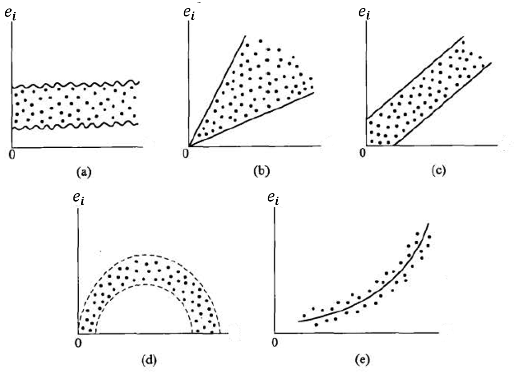

---
params:
  hideslide: TRUE
output:
  xaringan::moon_reader:
    seal: false
    lib_dir: libs
    css:
      - default
      - ../mycss/my-theme.css 
      - ../mycss/my-font.css
      - ../mycss/my-custom-for-video-roomy.css
      - ../mycss/text-box.css
      - duke-blue
      - hygge-duke
    nature:
      highlightStyle: github
      highlightLines: true
      countIncrementalSlides: false
      ratio: "16:9"
---
background-image: url("../pic/slide-front-page.jpg")
class: center,middle
exclude: `r params$hideslide`

# 统计学原理(Statistic)

<!---    chakra: libs/remark-latest.min.js --->

### 胡华平

### 西北农林科技大学

### 经济管理学院数量经济教研室

### huhuaping01@hotmail.com

### `r Sys.Date()`

```{r , echo=F,message=FALSE,warning=F, eval=!params$hideslide}
source("../R/set-global.R")
source("../R/xfun.R", encoding = "UTF-8")
source("../R/external-math-equation.R")
options(width = 70)
#source("../R/xaringan-chromote-print.R")
```


```{r , echo=FALSE, eval=!params$hideslide}
require('xaringanExtra')

xaringanExtra::use_tachyons()

xaringanExtra::use_panelset()

xaringanExtra::use_logo(
  image_url = "../pic/logo/nwafu-logo-circle-wb.png",
  height = '70px',
  position = xaringanExtra::css_position(top='0.2em',left="1em")
)
```

---

class: center, middle, duke-orange,hide_logo
name: chapter
exclude: `r params$hideslide`

# 第五章 相关和回归分析


### [5.1 变量间关系的度量](#corl)

### [5.2 回归分析的基本思想](#concept)

### [5.3 OLS方法与参数估计](#ols)

### [5.4 假设检验](#hypothesis)

### [.white[5.5 拟合优度与残差分析]](#goodness)

### [5.6 回归预测分析](#forecast)

### [5.7 回归报告解读](#report)

---

layout: false
class: center, middle, duke-softblue,hide_logo
name: goodness

# 5.5 拟合优度与残差分析

### [拟合优度](#goodness-r2)

### [残差分析](#goodness-ei)

---

layout: true

<div class="my-header-h2"></div>

<div class="watermark1"></div>

<div class="watermark2"></div>

<div class="watermark3"></div>

<div class="my-footer"><span>huhuaping@  &emsp;&emsp; <a href="#chapter"> 第05章 相关和回归分析 </a>
&emsp;&emsp;&emsp;&emsp;&emsp;&emsp;&emsp;&emsp;&emsp;&emsp;&emsp;&emsp;&emsp;&emsp;&emsp;&emsp;&emsp;&emsp;&emsp;&emsp;&emsp;
<a href="#goodness"> 5.5 拟合优度与残差分析 </a> </span></div> 

---
name: goodness-r2

## 拟合优度：引子

怎么来判定OLS方法对特定样本数据拟合的好坏？

请大家思考如下几个**问题**：

- 样本数据不完全落在拟合的直线（或曲线）上，是经常发生的么？

- 怎么来表达或测量这种对样本数据拟合的不完全性？

- 在OLS方法和CLRM假设“双剑合璧”下，对特定样本数据的拟合不是已经证明最好的么（BLUE）？为什么还要说“拟合”有“好坏之分”？


---

## 拟合优度：测量指标


**拟合优度**（Goodness of fit）：度量样本回归线对一组数据拟合优劣水平。

**判定系数**（coefficient of determination）：一种利用平方和分解，考察样本回归线对数据拟合效果的总度量。

- 一元回归中，一般记为
$r^2$；

- 多元回归中，一般记为
$R^2$。

---

## （示例）拟合优度的直观理解

```{r, fig.cap="维恩图看拟合优度", out.width= "95%"}

```


---

## 拟合优度：测量指标

```{r, fig.cap="平方和分解看拟合优度", out.width= "80%"}
include_graphics("../pic/extra/chpt2-1-PRL-SRL.png")
```

---

## 拟合优度：判定系数

基于前述的方差分解ANOVA表，我们可以用如下公式计算**判定系数**。

判定系数
$r^2$计算公式1：

$$\begin{align}
r^2 &=\frac{ESS}{TSS} = \frac{\sum{(\hat{Y}_i - \bar{Y})^2}}{\sum{(Y_i - \bar{Y})^2}} 
\end{align}$$

判定系数
$r^2$计算公式2：

$$\begin{align}
r^2 &=1- \frac{RSS}{TSS} = 1- \frac{\sum{e_i^2}}{\sum{(Y_i - \bar{Y})^2}} \\
\end{align}$$

---

## 拟合优度：判定系数

判定系数
$r^2$计算公式3：

$$\begin{align}
r^2 &=\frac{ESS}{TSS} 
= \frac{\sum{\hat{y}_i^2}}{\sum{y_i^2}} 
= \frac{\sum{(\hat{\beta}_2x_i)^2}}{\sum{y_i^2}} 
= \hat{\beta}_2^2\frac{\sum{x_i^2}}{\sum{y_i^2}} 
= \hat{\beta}_2^2 \frac{S_{X_i}^2}{S_{Y_i}^2}
\end{align}$$

判定系数
$r^2$计算公式4：

$$\begin{align}
r^2 &= \hat{\beta}_2^2 \cdot \frac{\sum{x_i^2}}{\sum{y_i^2}} 
= \left( \frac{\sum{x_iy_i}}{\sum{x_i^2}} \right)^2 \cdot \left( \frac{\sum{x_i^2}}{\sum{y_i^2}} \right)
= \frac{(\sum{x_iy_i})^2}{\sum{x_i^2 }\sum{y_i^2}}
\end{align}$$

课堂讨论：

- 讨论1： 
$r^2$是一个非负量。为什么？

- 讨论2：
$0 \leq r^2 \leq 1$，两个端值分别意味什么？

---

## 拟合优度：判定系数VS简单相关系数

判定系数与简单相关系数有什么区别与联系？

**总体相关系数**：是变量
$X_i$与变量
$Y_i$总体相关关系的参数，一般记为
$\rho$。

$$\begin{align}
\rho &=\frac{Cov(X,Y)}{\sqrt{Var(X_i)Var(Y_i)}}
=\frac{E(X_i-EX)(Y_i-EY)}{\sqrt{E(X_i-EX)^2E(Y_i-EY)^2}}
\end{align}$$

**样本相关系数**：是从总体中抽取随机样本，获得变量
$X_i$与变量
$Y_i$样本相关关系的统计量度量，一般记为
$r$。

$$\begin{align}
r &=\frac{S_{XY}^2}{S_X\ast S_Y}
=\frac{\sum{(X_i-\bar{X})(Y_i-\bar{Y})}}{\sqrt{\sum{(X_i-\bar{X}})^2\sum{(Y_i-\bar{Y})^2}}}
= \frac{\sum{x_iy_i}}{\sqrt{\sum{x_i^2 }\sum{y_i^2}}}
\end{align}$$

---

## 拟合优度：判定系数VS简单相关系数

判定系数和简单相关系数的联系:

- 在一元回归中，判定系数
$r^2$等于样本相关系数
$r$的平方。

判定系数和简单相关系数的区别：

- 判定系数
$r^2$表明因变量变异由解释变量所解释的比例，而相关系数
$r$只能表明变量间的线性关联强度。

- 在多元回归中，这种区别会更加凸显！因为那时的相关系数r出现了偏相关的情形(交互关联)！

---
exclude:true

## （案例）教育程度与时均工资

```{r}
source("Rscript/case-edu-wage.R", encoding = "UTF-8")
```

---

### （案例）计算相关系数和判定系数

对于“教育程度与时均工资案例”，根据FF-ff计算表和方差分解ANOVA表，可以分别计算得到样本相关系数和模型判定系数。

样本相关系数
$r$：

```{r, results="asis"}
cat(
  "$$\\begin{align}",
  str_c("r =\\frac{S_{XY}^2}{S_X\\ast S_Y}=","\\frac{",round(cov_XY,4),"}{",round(S_X,4),"\\ast",round(S_Y,4),"} =",round(r,4),"\\\\"),
  "\\end{align}$$",
  sep = "\n"
)
```

回归方程的判定系数
$r^2$：

```{r, results="asis"}
cat(
  "$$\\begin{align}",
  str_c("r^2 &= 1- \\frac{RSS}{TSS}=",1,"-\\frac{",round(RSS,4),"}{",round(TSS,4),"} =",round(r2,4),"\\\\"),
  "\\end{align}$$",
  sep = "\n"
)
```

二者关系

---

## 拟合优度：小结与思考

**内容小结**：

- 即使采用OLS方法，它对样本数据的拟合也是不完全的。意味着实际数据点在样本回归线附近，而不是在样本回归线上。我们可以把样本点行为的“变异”，划分为“回归”能解释的部分和“随机”的部分。并进一步获得变异平方和的分解。

- 判定系数
$R^2$是对OLS拟合程度的测量，它使用了变异平方和分解的思想。在一元线性回归（含截距）中，判定系数与相关系数存在如下关系
$R^2 = r^2_{(X_i,Y_i)}$。注意，在多元回归中则不存在这种关系。

**问题思考**：

- OLS方法的参数估计量，在CLRM假设满足情况下，就是最优线性无偏估计量（BLUE），为什么还要用**判定系数**来判断“拟合好还是不好？”。对此，你的回答是什么？

- 还有没有其他指标，来反映估计方法对样本数据的拟合好坏程度？请说出一两个。

???
参考答案：还可以有**均方误差和**（MSE）
$MSE=RSS/n= 1/n\sum{(Y_i - \hat{Y}_i})^2$，以及**均方误差根**（RMSE）等。

---
name: goodness-ei

## 残差分析：定义和作用

**残差**(residual)：是因变量的观测值与根据估计的回归方程求出的估计值之差，用
$e_i$表示。

$$e_i = Y_i - \hat{Y_i}$$

对模型的残差进行分析，主要目的包括：

- 反映用估计的回归方程去预测而引起的误差。

- 可用于确定有关随机干扰项
$\mu_i$的假定是否成立。

- 用于检测有影响的观测值。

---

## 残差分析：皮尔逊标准化残差

**标准化残差**(standardized residual)：是对残差进行某种标准化变换。具体计算方法有**皮尔逊标准化残差**和**学生化标准残差**两种。

最常用的皮尔逊标准化残差（Pearson residual/.red[internally studentized residuals]）的计算公式如下：

$$\begin{align}
e_{i, sd}^{\ast}= \frac{e_i}{s_{e_i}} 
= \frac{(Y_i - \hat{Y_i})}{\sqrt{\frac{\sum{(e_i-\bar{e})^2}}{n-1}}}
\end{align}$$

---

## 残差分析：学生化标准化残差

**学生化标准残差**（Studentized Residuals/.red[externally studentized residual]/deleted Studentized residual/semi-studentized residuals/jackknifed residuals），是对残差的另一种特殊标准化变换（例如考虑到了X的影响力）。

---

## 残差分析：学生化标准化残差

**学生化标准残差**的计算公式有两个<sup>*</sup>：

$$\begin{align}
e_{i,st}^{\ast} &= \frac{e_i}{\sqrt{MSE_{(i)}(1-h_{ii})}} \tag{eq.01}\\
e_{i,st}^{\ast}& = e_{i, sd}^{\ast}\left( \frac{n-m-2}{n-m-1-e_{i, sd}^{\ast 2}}\right)^2
\tag{eq.02}
\end{align}$$

> 其中：
$MSE_{(i)}$是指删除第
$i$个观测值进行建模的**均方误差**（MSE）；
$h_{ii}$指删除第
$i$个观测值进行建模的第
$i$个**影响权重**（leverage）。
$m=k-1$为回归元个数。

.footnote[
说明：
1）学生化残差的第一个计算公式计算起来比较麻烦和复杂。需要分别进行(n-1)次线性回归，然后依次计算相关
$MSE_{(i)}$和
$h_ii$。2）学生化残差的第二个计算公式相对简单，只需要利用原来的回归模型及其标准化残差
$e_{i, sd}^{\ast}$。

]

???

理论参看：

- [Studentized Residuals](https://online.stat.psu.edu/stat462/node/247/)

- [Using Leverages to Help Identify Extreme X Values](https://online.stat.psu.edu/stat462/node/171/)

操作参看：
- [Is studentized residuals v/s standardized residuals in lm model](https://stats.stackexchange.com/questions/204708/is-studentized-residuals-v-s-standardized-residuals-in-lm-model)

---

## 残差分析：残差图

**残差图**(residual plot)：用于呈现残差数据
$e_i$的分布情况的统计图图形，主要包括：


- 关于
$X_i$的残差散点图。

- 关于
$Y_i$的残差散点图（或者关于
$\hat{Y_i}$）。

- 关于样本序号的残差散点图或标准化残差散点图。

---

### （示例）残差图的模拟演示


```{r, out.width= "75%"}

```

???
残差序列
$e_i$（或者标准化残差序列
$e_i^{\ast}$）与相关变量（包括
$X_i; Y_i;\hat{Y_i}$以及样本序号）之间**散点图**的若干假想分布模式。

---

### （案例）皮尔逊标准化残差

.pull-left[

```{r, eval=T}
show_tbl %>%
  select(c(1:3,12:14)) %>%
  mutate_at(vars(contains("e_")), funs(formatC(., digits = 4, format = "f"))) %>%
  kable( ) %>%  
  kable_styling(font_size=20)
```


]

.pull-right[

- 根据样本回归方程，可以计算得到
$Y_i$的回归拟合值
$\hat{Y}_i$，以及回归残差
$e_i$。

$$\begin{align}
\hat{Y}_i &=\hat{\beta}_1 +\hat{\beta}_2X_i\\
e_i &= Y_i - \hat{Y}_i
\end{align}$$

- 进一步地计算得到**皮尔逊标准化残差**
$e_{i, sd}^{\ast}$：

$$\begin{align}
e_{i, sd}^{\ast}= \frac{e_i}{s_{e_i}} 
= \frac{(Y_i - \hat{Y_i})}{\sqrt{\frac{\sum{(e_i-\bar{e})^2}}{n-1}}}
\end{align}$$

]


---

### （案例）学生化标准残差

.pull-left[

```{r, eval=T}
show_tbl %>%
  select(c(1:3,12:15)) %>%
  mutate_at(vars(contains("e_")), funs(formatC(., digits = 4, format = "f"))) %>%
  kable() %>%  
  kable_styling(font_size=22) %>%
  row_spec(row = 14, color = "red", bold = T)

```


]

.pull-right[

- 根据样本回归方程，可以计算得到
$Y_i$的回归拟合值
$\hat{Y}_i$，以及回归残差
$e_i$，以及前述**皮尔逊标准化残差**
$e_{i, sd}^{\ast}$。

- 进而可以使用如下公式计算得到**学生化标准残差**
$e_{i,st}^{\ast}$：

$$\begin{align}
e_{i,st}^{\ast}& = e_{i, sd}^{\ast}\left( \frac{n-m-2}{n-m-1-e_{i, sd}^{\ast 2}}\right)^2
\end{align}$$

]

---

### （案例）皮尔逊标准化残差散点图1

```{r, out.width="90%", fig.cap="残差对样本编号作图"}
resid_tbl <- calc_tbl %>%
  select(all_of(c("obs", "X", "Y")), all_of(contains("e_i"))) %>%
  filter(obs!="sum") %>%
  mutate(obs = as.numeric(obs))

resid_tbl %>%
  ggplot(aes(obs, e_i)) +
  geom_point(size=2, color = "blue") +
   scale_x_continuous(breaks = 1:13) +
  theme(text = element_text(size=18),
        axis.title.x = element_text(size = 16,
                                margin = margin(t = 15, r = 0, 
                                                b = 0, l = 0)),
        axis.title.y = element_text(size = 16,
                                margin = margin(t = 0, r = 15, 
                                                b = 0, l = 0)))
```

---

### （案例）皮尔逊标准化残差散点图2

```{r, out.width="90%", fig.cap="残差对自变量X作图"}
resid_tbl %>%
  ggplot(aes(X, e_i)) +
  geom_point(size=2, color = "blue") +
  scale_x_continuous(breaks = 5:19) +
  theme(text = element_text(size=18),
        axis.title.x = element_text(size = 16,
                                margin = margin(t = 15, r = 0, 
                                                b = 0, l = 0)),
        axis.title.y = element_text(size = 16,
                                margin = margin(t = 0, r = 15, 
                                                b = 0, l = 0)))
```

---

### （案例）皮尔逊标准化残差散点图3

```{r, out.width="90%", fig.cap="残差对因变量Y作图"}
resid_tbl %>%
  ggplot(aes(Y, e_i)) +
  geom_point(size=2, color = "blue") +
  #labs(x = ) +
  theme(text = element_text(size=18),
        axis.title.x = element_text(size = 16,
                                margin = margin(t = 15, r = 0, 
                                                b = 0, l = 0)),
        axis.title.y = element_text(size = 16,
                                margin = margin(t = 0, r = 15, 
                                                b = 0, l = 0)))

```

---

### （案例）皮尔逊标准化残差散点图4

```{r, out.width="90%", fig.cap="标准化残差对样本编号作图"}

resid_tbl %>%
  ggplot(aes(x = obs)) +
  geom_point(aes(y = e_i, shape = "ei",color = "ei"),size=2) +
   geom_point(aes(y = e_i_star, shape = "ei_star", color = "ei_star"),size=2) +
  scale_x_continuous(breaks = 1:13) +
  theme(text = element_text(size=18),
        axis.title.x = element_text(size = 16,
                                margin = margin(t = 15, r = 0, 
                                                b = 0, l = 0)),
        axis.title.y = element_text(size = 16,
                                margin = margin(t = 0, r = 15, 
                                                b = 0, l = 0))) +
  labs(y = "",color = "", shape ="") +
  scale_color_manual(values = c("ei" = 'blue','ei_star' = 'red')) + 
scale_shape_manual(values = c('ei' = 17, 'ei_star' = 16))
```

---
layout:false
background-image: url("../pic/thank-you-gif-funny-little-yellow.gif")
class: inverse,center
# 本节结束

