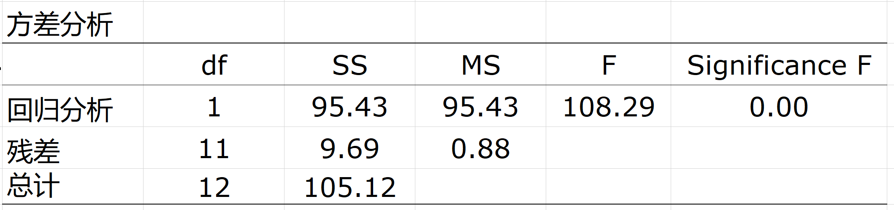

---
params:
  hideslide: TRUE
output:
  xaringan::moon_reader:
    seal: false
    lib_dir: libs
    css:
      - default
      - ../mycss/my-theme.css 
      - ../mycss/my-font.css
      - ../mycss/my-custom-for-video-roomy.css
      - ../mycss/text-box.css
      - duke-blue
      - hygge-duke
    nature:
      highlightStyle: github
      highlightLines: true
      countIncrementalSlides: false
      ratio: "16:9"
---
background-image: url("../pic/slide-front-page.jpg")
class: center,middle
exclude: `r params$hideslide`

# 统计学原理(Statistic)

<!---    chakra: libs/remark-latest.min.js --->

### 胡华平

### 西北农林科技大学

### 经济管理学院数量经济教研室

### huhuaping01@hotmail.com

### `r Sys.Date()`

```{r , echo=F,message=FALSE,warning=F, eval=!params$hideslide}
source("../R/set-global.R")
source("../R/xfun.R", encoding = "UTF-8")
source("../R/external-math-equation.R")
options(width = 70)
#source("../R/xaringan-chromote-print.R")
```


```{r , echo=FALSE, eval=!params$hideslide}
require('xaringanExtra')

xaringanExtra::use_tachyons()

xaringanExtra::use_panelset()

xaringanExtra::use_logo(
  image_url = "../pic/logo/nwafu-logo-circle-wb.png",
  height = '70px',
  position = xaringanExtra::css_position(top='0.2em',left="1em")
)
```

---

class: center, middle, duke-orange,hide_logo
name: chapter
exclude: `r params$hideslide`

# 第五章 相关和回归分析


### [5.1 变量间关系的度量](#corl)

### [5.2 回归分析的基本思想](#concept)

### [5.3 OLS方法与参数估计](#ols)

### [5.4 假设检验](#hypothesis)

### [5.5 拟合优度与残差分析](#goodness)

### [5.6 回归预测分析](#forecast)

### [.white[5.7 回归报告解读]](#report)

---
layout: false
class: center, middle, duke-softblue,hide_logo
name: report

# 5.7 回归报告解读

### 方程表达式

### 表格表达式

### 统计软件

---
layout: true

<div class="my-header-h2"></div>

<div class="watermark1"></div>

<div class="watermark2"></div>

<div class="watermark3"></div>

<div class="my-footer"><span>huhuaping@  &emsp;&emsp; <a href="#chapter"> 第05章 相关和回归分析 </a>
&emsp;&emsp;&emsp;&emsp;&emsp;&emsp;&emsp;&emsp;&emsp;&emsp;&emsp;&emsp;&emsp;&emsp;&emsp;&emsp;&emsp;&emsp;&emsp;&emsp;&emsp;
<a href="#report"> 5.7 回归报告解读 </a> </span></div>

---
exclude:true

## （案例）教育程度与时均工资

```{r}
source("Rscript/case-edu-wage.R", encoding = "UTF-8")
```

---

## 回归分析的形式

**课程要求**：会熟练、正确阅读统计软件给出的各类分析报告，理解其中的关键信息和内涵。这些分析报告包括：传统的多元回归分析报告；以及各种计量检验的辅助分析报告（如异方差white检验报告）等。

根据统计软件的不同（`stata`；`Eview`；`R`；`Excel` ……），各种分析报告呈现形式略有差异，但基本要素和信息都大抵一致。

给定如下一元回归模型：

$$Y_i = \beta_1 + \beta_2X_i +u_i$$

---

## 回归分析的形式（多行方程表达法）

**形式1：多行方程表达法**（整理好的**精炼报告**）：根据统计软件的原始报告，选取最关键的信息，经过整理并以多行**样本回归方程**（SRF）的形式呈现。例如：

```{r, results="asis"}
fun_report_eq(lm.mod = mod_wage, lm.dt = data_wage,
              lm.n = 3)
```

--

- 第1行表示样本回归函数（回归系数）

- 第2行(t)表示回归系数对应的**样本t统计量**（
$t^{\ast}_{\hat{\beta}_i},i \in 1,2,\cdots, k$）

- 第3行(se)表示回归系数对应的**样本标准误差**（
$S_{\hat{\beta}_i},i \in 1,2,\cdots, k$）

---

## 回归分析的形式（多行方程表达法）

**形式1：多行方程表达法**（整理好的**精炼报告**）：根据统计软件的原始报告，选取最关键的信息，经过整理并以多行**样本回归方程**（SRF）的形式呈现。例如：

```{r, results="asis"}
fun_report_eq(lm.mod = mod_wage, lm.dt = data_wage,
              lm.n = 3)
```

- 第4行(fitness)表示回归模型**拟合情况**和**统计检验**的简要信息，其中
$R^2$表示**判定系数**，
$\bar{R}^2$表示**调整判定系数**，F表示模型整体显著性检验中的**样本F统计量值**（
$F^{\ast}$）,p表示样本F统计量值对应的概率值。

---

## 回归分析的形式（表格列示法）

**形式2：表格列示法**（整理好的**精炼报告**）：根据统计软件的原始报告，往往是选取最关键的信息，经过整理以表格形式呈现，**表格列示法**的形式呈现为：

```{r }
require("broom")
out_lm <- summary(lm(mod_wage,data_wage))
kable(broom::tidy(lm(mod_wage,data_wage)),
      caption = "表格列示法",
      align= "c")
```

--

- **第1列**：`term`表示回归模型中包含的变量，也即
$X_{2i},X_{3i},\cdots,X_{ki}$，其中**截距项**默认为`(Intercept)`。

- **第2列**：`estimate`表示回归系数的估计值，也即
$\hat{\beta}_1,\hat{\beta}_2, \cdots, \hat{\beta}_k$。

- **第3列**：`std.error`表示回归系数对应的**样本标准误差**，也即
$S_{\hat{\beta}_i},i \in 1,2,\cdots, k$。

- **第4列**：`statistic`表示回归系数对应的**样本t统计量**，也即
$t^{\ast}_{\hat{\beta}_i},i \in 1,2,\cdots, k$

- **第5列**：`p.value`表示回归系数**样本t统计量**对应的概率值，也即
$Pr(t = t^{\ast}_{\hat{\beta}_i})=p$

---

### （示例）Excel软件原始报告：全貌

**形式3：原始报告**：分析软件如`EViews`、`R`、`STATA`、`Excel`等直接自动生成的多元回归分析报告。`Excel`软件原始分析报告形式如下：

```{r}
include_graphics("../pic/chpt05-reg-excel-report-view.png")
```


---

### （示例）Excel软件原始报告：参数估计

```{r, fig.height= 8, fig.cap="Excel回归分析的参数估计结果"}
include_graphics("../pic/chpt05-reg-excel-report-estimate.png")
```

---

### （示例）Excel软件原始报告：拟合优度

```{r, out.width="80%", fig.cap="Excel回归分析的拟合优度"}
include_graphics("../pic/chpt05-reg-excel-report-goodness.png")
```

---

### （示例）Excel软件原始报告：方差分解

```{r, fig.cap="Excel回归分析的ANOVA表结果"}

```

---

### （示例）Excel软件原始报告：残差表

```{r, out.width= "50%",fig.cap="Excel回归分析的预测和残差结果"}
include_graphics("../pic/chpt05-reg-excel-report-ei.png")
```

---

### （示例）Excel软件原始报告：残差图

```{r, fig.cap="Excel回归分析的残差图"}
include_graphics("../pic/chpt05-reg-excel-residual.png")
```

---

### （示例）Excel软件操作步骤：配置数据分析模块

```{r,out.width="80%",fig.cap="Excel“数据分析”模块的配置"}

```

---

### （示例）Excel软件操作步骤：回归分析的操作步骤

```{r,out.width="99%",fig.cap="Excel“回归分析”的操作步骤"}

```

---

### 回归分析的形式（EViews软件原始报告）

**形式3：原始报告**：分析软件如`EViews`、`R`、`STATA`等直接自动生成的多元回归分析报告。`EViews`软件原始分析报告形式如下：**抬头区域**

.pull-left[
```{r}
include_graphics("../pic/extra/chpt4-eq-report-EViews.png")
```
]

--

.pull-right[

- `Dependent Variable: Y`：因变量

- `Method: Least Squares`：分析方法

- `Date: 03/09/19  Time: 10:55`：分析的时间

- `Sample: 1 13`：样本范围

- `Included observations: 13`：样本数n

]

---

### 回归分析的形式（EViews软件原始报告）

**形式3：原始报告**：分析软件如`EViews`、`R`、`STATA`等直接自动生成的多元回归分析报告。`EViews`软件原始分析报告形式如下：**三线表区域**

.pull-left[
```{r}
include_graphics("../pic/extra/chpt4-eq-report-EViews.png")
```
]

--

.pull-right[

- **第1列**：`Variable`表示模型包含的变量，
$X_{2i},X_{3i},\cdots,X_{ki}$，其中**截距项**默认为`C`。

- **第2列**：`Coefficient`回归系数，也即
$\hat{\beta}_1,\hat{\beta}_2, \cdots, \hat{\beta}_k$；

- **第3列**：`Std. Error`回归系数的样本标准误差，也即也即
$S_{\hat{\beta}_i},i \in 1,2,\cdots, k$。

- **第4列**：`t-Statistic`表示回归系数对应的**样本t统计量**，也即
$t^{\ast}_{\hat{\beta}_i},i \in 1,2,\cdots, k$；

- **第5列**：`Prob.`表示回归系数**样本t统计量**对应的概率值，也即
$Pr(t = t^{\ast}_{\hat{\beta}_i})=p$

]

---

### 回归分析的形式（EViews软件原始报告）

**形式3：原始报告**：分析软件如`EViews`、`R`、`STATA`等直接自动生成的多元回归分析报告。`EViews`软件原始分析报告形式如下：**指标值区域（左）**

.pull-left[
```{r}
include_graphics("../pic/extra/chpt4-eq-report-EViews.png")
```
]

--

.pull-right[

- `R-squared`：回归模型**判定系数**
$R^2$。

- `Adjusted R-squared`：回归模型**调整判定系数**
$\bar{R}^2$。

- `S.E. of regression`：回归模型的**回归误差标准差**
$\hat{\sigma}$。

- `Sum squared resid`：回归模型的**残差平方和RSS**
$RSS=\sum{e_i^2}$。

- `Log likelihood`：回归模型的**对数似然值**。

- `F-statistic`：回归模型整体显著性的**样本F统计量**
$F^{\ast}$。

- `Prob(F-statistic)`：回归模型整体显著性的样本F统计量对应的**概率值p**。

]

---

### 回归分析的形式（EViews软件原始报告）

**形式3：原始报告**：分析软件如`EViews`、`R`、`STATA`等直接自动生成的多元回归分析报告。`EViews`软件原始分析报告形式如下：**指标值区域（右）**

.pull-left[
```{r}
include_graphics("../pic/extra/chpt4-eq-report-EViews.png")
```
]

--

.pull-right[

- `Mean dependent var`：Y的**均值**
$\bar{Y}$。

- `S.D. dependent var`：Y的**样本标准差**
$S_{Y}$。

- `Akaike info criterion`：回归模型的**AIC信息准则**。

- `Schwarz criterion`：回归模型的**Schwarz准则**。

- `Hannan-Quinn criter.	`：回归模型的**Hannan-Quinn准则**。

- `Durbin-Watson stat`：回归模型的**德宾沃森统计量d**。

]

---

## 回归分析的形式（R软件原始报告）

**形式4：原始报告**：分析软件如`EViews`、`R`、`STATA`等直接自动生成的多元回归分析报告。`R`软件原始分析报告形式如下：

```{r, comment=""}
out_lm

```


---
layout:false
background-image: url("../pic/thank-you-gif-funny-little-yellow.gif")
class: inverse,center
# 本节结束

