---
output:
  xaringan::moon_reader:
    seal: false
    lib_dir: libs
    css:
      - default
      - ../mycss/my-theme.css 
      - ../mycss/my-font.css
      - ../mycss/my-custom-for-video-roomy.css
      - ../mycss/text-box.css
      - duke-blue
      - hygge-duke
    nature:
      highlightStyle: github
      highlightLines: true
      countIncrementalSlides: false
      ratio: "16:9"
---
background-image: url("../pic/slide-front-page.jpg")
class: center,middle

# 统计学原理(Statistic)

<!---    chakra: libs/remark-latest.min.js --->

### 胡华平

### 西北农林科技大学

### 经济管理学院数量经济教研室

### huhuaping01@hotmail.com

### `r Sys.Date()`

```{r global_options, echo=F,message=FALSE,warning=F}
source("../R/set-global.R")
source("../R/external-math-equation.R")
options(width = 70)
#source("../R/xaringan-chromote-print.R")
```


```{r ex-math-eq}
source("../R/external-math-equation.R")
```


```{r xaringan-logo, echo=FALSE}
require('xaringanExtra')

xaringanExtra::use_tachyons()

xaringanExtra::use_panelset()

xaringanExtra::use_logo(
  image_url = "../pic/logo/nwafu-logo-circle-wb.png",
  height = '70px',
  position = xaringanExtra::css_position(top='0.2em',left="1em")
)
```

---
class: center, middle, duke-orange,hide_logo
name:chapter

# 第五章 相关和回归分析


### [5.1 变量间关系的度量](#corl)

### [5.2 回归分析的基本思想](#oncept)

### [5.3 OLS方法与参数估计](#ols)

### [5.4 假设检验](#hypthesis)

### [5.5 拟合优度与残差分析](#goodness)

### [5.6 回归预测分析](#forecast)

### [5.7 回归报告解读](#report)

---
layout: false
class: center, middle, duke-softblue,hide_logo
name: corl

# 5.1 变量间关系的度量

### 变量间的关系

### 相关关系的描述与测度

### 相关系数的显著性检验

---
layout: true

<div class="my-header-h2"></div>

<div class="watermark1"></div>

<div class="watermark2"></div>

<div class="watermark3"></div>

<div class="my-footer"><span>huhuaping@  &emsp;&emsp; <a href="#chapter"> 第05章 相关和回归分析 </a>
&emsp;&emsp;&emsp;&emsp;&emsp;&emsp;&emsp;&emsp;&emsp;&emsp;&emsp;&emsp;&emsp;&emsp;&emsp;&emsp;&emsp;&emsp;&emsp;&emsp;&emsp;
<a href="#corl"> 5.1 变量间关系的度量 </a> </span></div> 

---

### （示例）变量间的关系：经济学专业解读

```{r, out.width= "60%"}
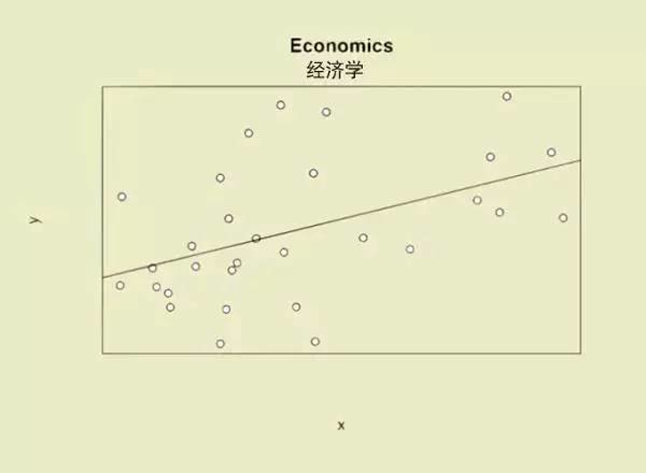
```

> “我们数据不少，做了很严格的回归，但异常值略多略多，符合理论的数值反而难找……”

---

### （示例）变量间的关系：金融学专业解读

```{r, out.width= "60%"}
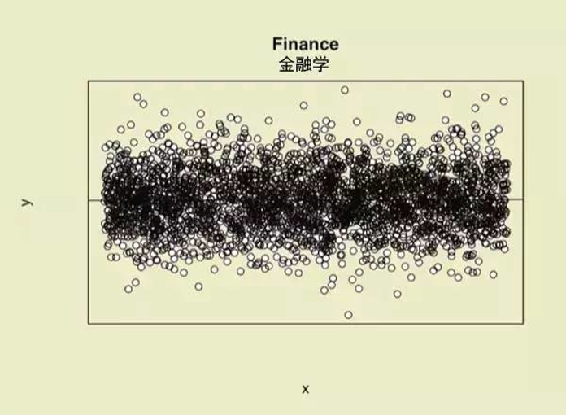
```

> “我们的数据多如牛毛，无孔不入。即使做完回归，也会发现异常值和符合理论的数值多得不忍直视。”

---

### （示例）变量间的关系：土木工程专业解读

```{r, out.width= "60%"}
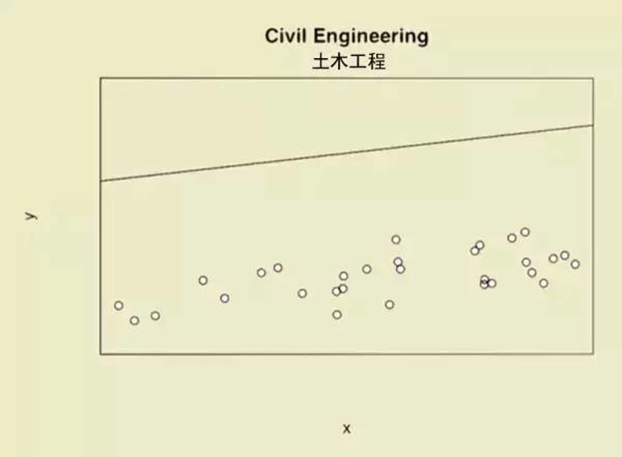
```

> “我们得要设计余量，所以理论设计得远高于实际承受……”

---

### （示例）变量间的关系：物理学专业解读

```{r, out.width= "60%"}
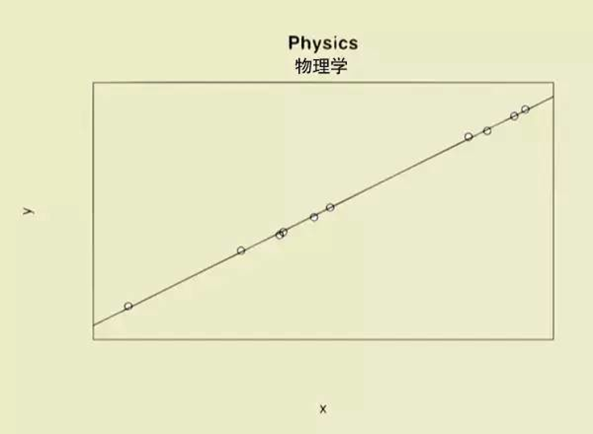
```

> “我们的理论和数据严丝合缝，bingo！”

---

### （示例）变量间的关系：环境科学专业解读

```{r, out.width= "60%"}
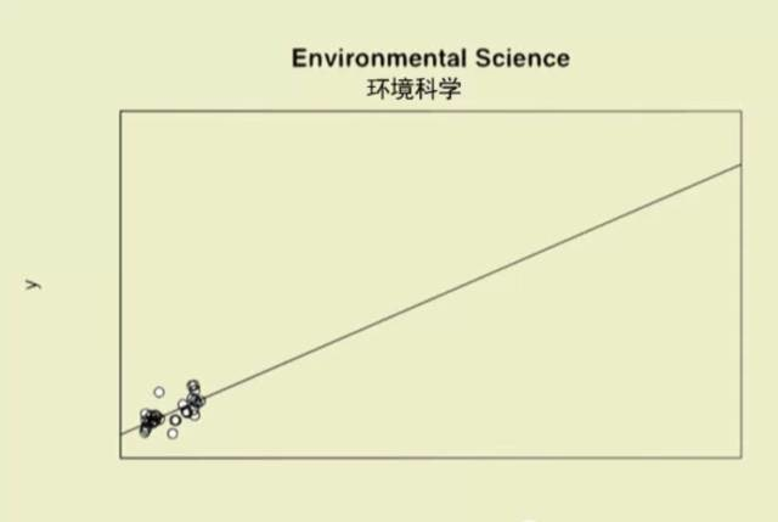
```

> “我们的理论和数据大致吻合，就是……应用范围有点蛋疼。”

---

### （示例）变量间的关系：历史学专业解读

```{r, out.width= "60%"}
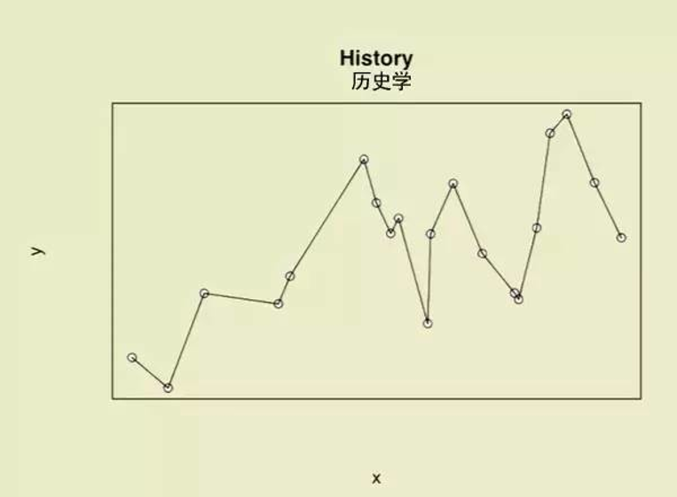
```

> “数据虽然很多，可我们能用理论把他们统统连起来！”

---

### （示例）变量间的关系：政治学专业解读

```{r, out.width= "60%"}
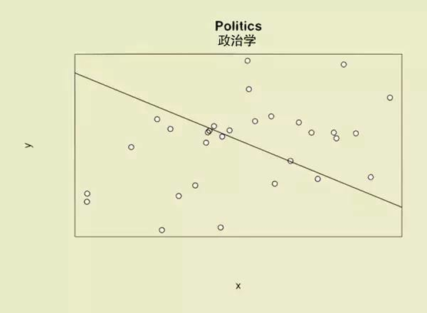
```

> “世界大势一日三变，尽管我们数据不少，可……我们的理论跟数据趋势是反着来的……”

---

### （示例）变量间的关系：社会学专业解读

```{r, out.width= "60%"}
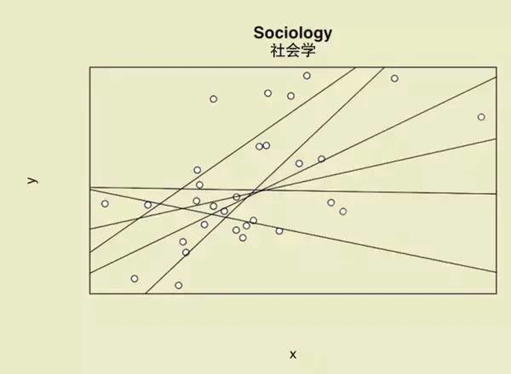
```

> “学海无涯苦作舟。那么多数据，那么多理论，慢慢学，恩……”

---

### （示例）变量间的关系：数学专业解读

```{r, out.width= "60%"}
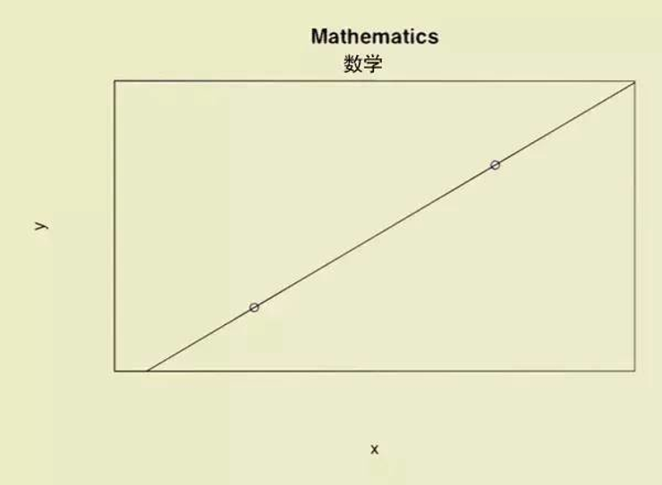
```

> “数据很少，但能建立理论～”

---

### （示例）变量间的关系：新闻学专业解读

```{r, out.width= "60%"}

```

> （示例）“只有一个数据，也能建立理论……”

---

### （示例）变量间的关系：哲学专业解读

```{r, out.width= "60%"}
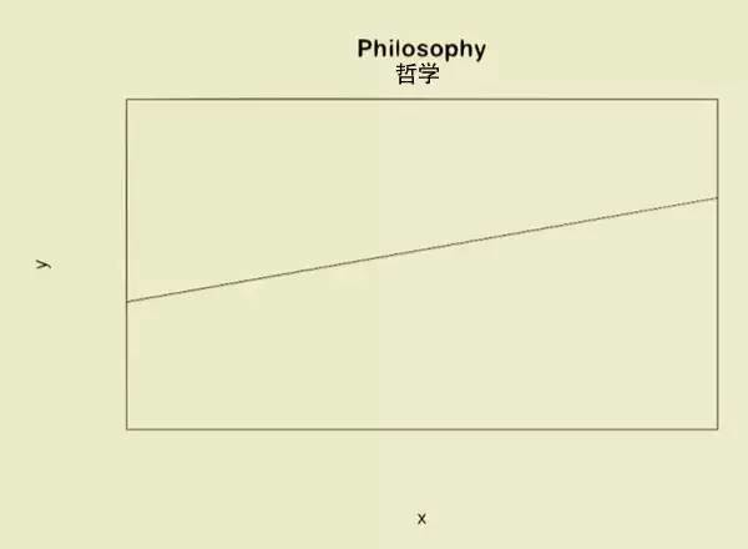
```

> “没有数据，依然建立理论……”


---

### （示例）变量间的关系：文学批评专业解读

```{r, out.width= "60%"}

```

> “如图所示，你懂的……”

---

## 变量间的关系：函数关系

两个变量若存在是一一对应的确定关系，则称之为二者具有**函数关系**。

```{block, type = "notes", echo =T}

设有两个变量
$X$和 
$Y$，变量
$Y$随变量
$X$一起变化，并完全依赖于
$X$，当变量
$X$取某个数值时， 
$Y$依确定的关系取相应的值，则称
$Y$是
$X$的函数，记为
$Y = f(X)$，其中
$X$称为自变量，
$Y$称为因变量。

```


> 从**几何学**角度来看，数据集各观测点会落在一条曲线上。

---

### （示例）函数关系

某种商品的销售额
$Y$与销售量
$X$之间的关系可表示为(
$P$为单价)：

$$Y_i = P_i\cdot X_i$$

圆的面积
$S$与半径
$R$之间的关系可表示为：

$$S = \pi R^2$$

企业的原材料消耗额
$Y$与产量
$X1$ 、单位产量消耗
$X2$ 、原材料价格
$X3$之间的关系可表示为：

$$Y = X_1 \cdot X_2 \cdot X_3$$

---

## 变量间的关系：相关关系(correlation)

```{r, out.width= "90%", fig.cap="相关关系的类型"}
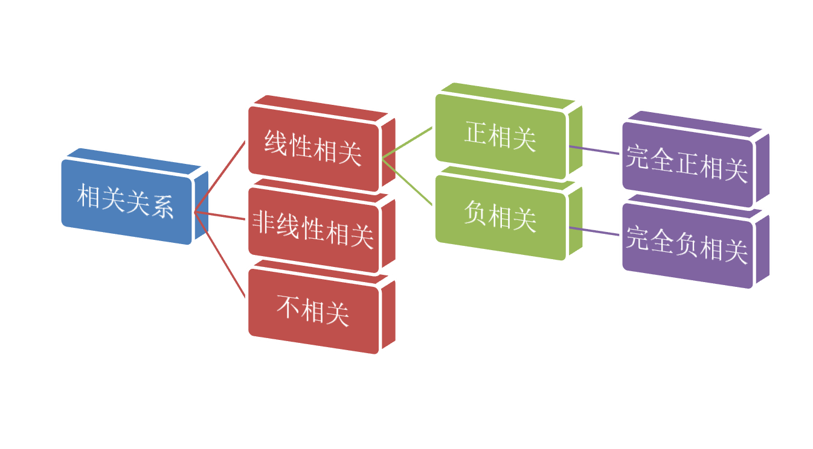
```


---

### （示例）相关关系

```{block, type = "case", echo = T}
- 父亲身高
$Y$与子女身高
$X$之间的关系

- 收入水平
$Y$与受教育程度
$X$之间的关系

- 粮食单位面积产量
$Y$与施肥量
$X1$ 、降雨量
$X2$、温度
$X3$之间的关系

- 商品的消费量
$Y$与居民收入
$X$之间的关系

- 商品销售额
$Y$与广告费支出
$X$之间的关系

```


---

## 相关关系的描述与测度：问题与假定

相关分析要解决的问题：

- 变量之间是否存在关系？

- 如果存在关系，它们之间是什么样的关系？

- 变量之间的关系强度如何？

- 样本所反映的变量之间的关系能否代表总体变量之间的关系？

相关分析中的总体假定：

- 两个变量之间是线性关系

- 两个变量都是随机变量

---

## 相关关系的描述与测度：散点图

.fl.w-50[

```{r}
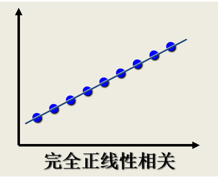
```
]

--

.fl.w-50[

```{r}
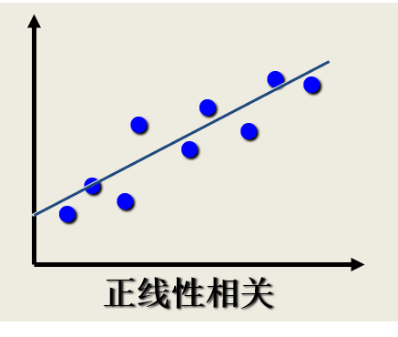
```
]

---

## 相关关系的描述与测度：散点图


.fl.w-50[

```{r}
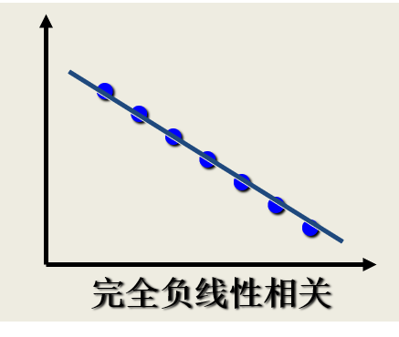
```

]

--

.fl.w-50[

```{r}
include_graphics("../pic/chpt05-scatter-n1.png")
```

]

---

## 相关关系的描述与测度：散点图

.fl.w-50[

```{r}
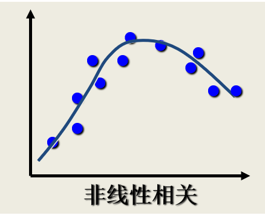
```

]

--

.fl.w-50[

```{r}
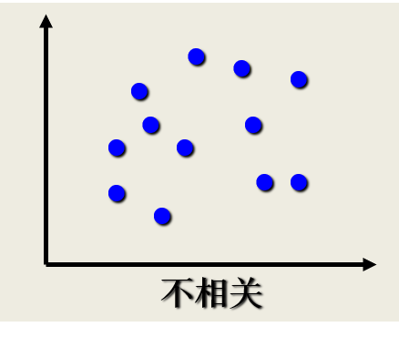
```

]

---

## 相关关系的描述与测度：散点图

```{r, out.width="90%"}
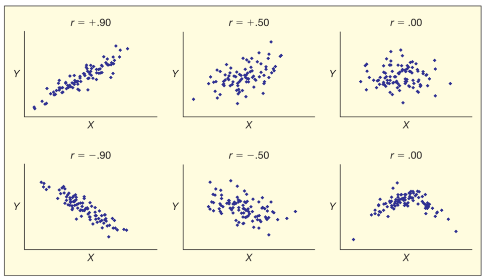
```

---

### （示例）两类油价的散点图

```{r, out.width="90%"}
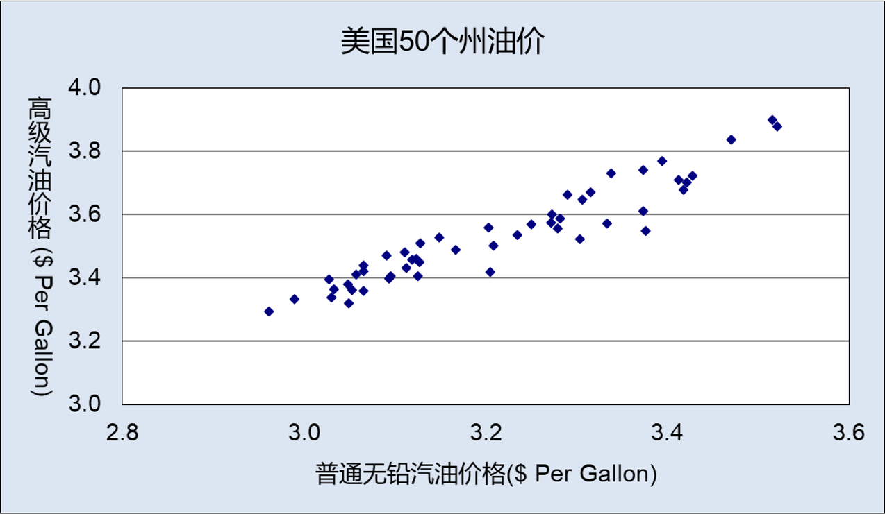
```

---

### （示例）传染病与认知水平的散点图

```{r, out.width="80%"}
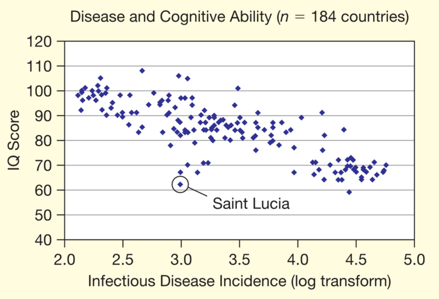
```

---

## 相关关系的描述与测度：相关系数

**相关系数**(correlation coefficient)：是度量变量之间关系强度的一个统计量。

- 它是对两个变量之间线性相关强度的一种度量。

- 一般称为**简单相关系数**，也称为**线性相关系数**(linear correlation coefficient) 。

- 或称为**Pearson相关系数**(Pearson’s correlation coefficient) 。

相关系数记号表达：

- 若相关系数是根据总体全部数据计算的，称为总体相关系数，记为
$\rho$。

- 若是根据样本数据计算的，则称为样本相关系数，简称为相关系数，记为
$r$。


---

## 相关关系的描述与测度：计算公式

.mb1.bg-light-blue[
简单相关系数的大FF计算公式：

$$\begin{align}
r & = \frac{n \sum X_i Y_i -\sum X_i \sum Y_i}{\sqrt{n \sum X_i^{2}-\left(\sum X_i\right)^{2}} \cdot \sqrt{n \sum Y_i^{2}-\left(\sum Y_i\right)^{2}}}
\end{align}$$

]

.mb1.bg-light-blue[
简单相关系数的小ff计算公式：

$$\begin{align}
r & = \frac{ \sum{\left( (X_i - \overline{X})(Y_i - \overline{Y})\right ) } }{\sqrt{\sum{(X_i - \overline{X})^2 }\sum{(Y_i - \overline{Y})^2}}} 
= \frac{S S_{XY}}{\sqrt{S S_{XX}} \sqrt{S S_{YY}}}
= \frac{\sum{x_iy_i}}{\sqrt{\sum{x_i^2}\sum{y_i^2}}}

\end{align}$$

]


.mb1.bg-lightest-blue[

其中：

$$\begin{align}
S S_{X X} =\sum_{i=1}^{n}\left(X_{i}-\overline{X}\right)^{2}  ;\quad 
S S_{Y Y} =\sum_{i=1}^{n}\left(Y_{i}-\overline{Y}\right)^{2}  ;\quad 
S S_{X Y}=\sum_{i=1}^{n}\left(X_{i}-\overline{X}\right)\left(Y_{i}-\overline{Y}\right)
\end{align}$$

]


---

## 相关关系的描述与测度：特征

简单相关系数的特征：

**性质1**：
$r$的取值范围是
$[-1,1]$，
$|r|$越趋于1表示相关关系越强；
$|r|$越趋于0表示相关关系越弱。


- 如果
$|r|=1$，为完全相关。其中
$r =1$，为完全正相关；
$r =-1$，为完全负正相关

- 如果
$r = 0$，不存在线性相关关系

- 如果
$-1<r<0$，为负相关；如果
$0<r<1$，为正相关。


**性质2**：r具有对称性。即
$X$与
$Y$之间的相关系数和
$Y$与
$X$之间的相关系数相等，即
$r_{XY}= r_{YX}$。

---

## 相关关系的描述与测度：特征

简单相关系数的特征：

**性质3**：
$r$数值大小与
$X$和
$Y$原点及尺度无关，即改变
$X$和
$Y$的数据原点及计量尺度，并不改变
$r$数值大小。

**性质4**：仅仅是
$X$与
$Y$之间线性关系的一个度量，它不能用于描述非线性关系。这意为着，
$r=0$只表示两个变量之间不存在线性相关关系，并不说明变量之间没有任何关系

**性质5**：
$r$虽然是两个变量之间线性关系的一个度量，却不一定意味着
$X$与
$Y$一定有因果关系。

---

## 相关关系的描述与测度：解释


```{block, type= "fyi", echo =T}

下面给出实证研究时，对相关系数的经验解释：

- 当
$|r|<0.8$时，可视为两个变量之间高度相关。

- 当
$0.5<|r|<0.8$时，可视为中度相关。

- 当
$0.3<|r|<0.5$时，视为低度相关。

- 当
$|r|<0.3$时，说明两个变量之间的相关程度极弱，可视为不相关。

而且上述解释必须建立在对相关系数的显著性进行检验的基础之上。

```


---

## 偏相关系数


**偏相关系数**（partial correlation coefficient）：
一个不依赖于
$X_{2i}$的，对
$X_{3i}$和
$Y_i$的影响的一种相关系数。

- 保持
$X_{3i}$不变，
$Y_i$和
$X_{2i}$之间的相关系数：

$$\begin {align} 
r_{12 \cdot 3}=\frac{r_{12}-r_{13} r_{23}}{\sqrt{\left(1-r_{13}^{2}\right)\left(1-r_{23}^{2}\right)}}
\end {align}$$

- 保持
$X_{2i}$不变，
$Y_i$和
$X_{3i}$之间的相关系数：

$$\begin {align} 
r_{13.2}=\frac{r_{13}-r_{12} r_{23}}{\sqrt{\left(1-r_{12}^{2}\right)\left(1-r_{23}^{2}\right)}}
\end {align}$$

- 保持
$Y_i$不变，
$X_{2i}$和
$X_{3i}$之间的相关系数：

$$\begin {align} 
r_{23.1}=\frac{r_{23}-r_{12} r_{13}}{\sqrt{\left(1-r_{12}^{2}\right)\left(1-r_{13}^{2}\right)}}
\end {align}$$

---

## 简单相关系数


**简单相关系数**（simple correlation coefficient）：


- 
$Y_i$和
$X_{2i}$之间的相关系数：

$$\begin {align} 
r_{12}=\frac{\sum y_{i} x_{2 i}}{\sqrt{\sum y_{i}^{2}} \sqrt{\sum x_{2 i}^{2}}}
\end {align}$$

- 
$Y_i$和
$X_{3i}$之间的相关系数：

$$\begin {align} 
r_{13}=\frac{\sum y_{i} x_{3 i}}{\sqrt{\sum y_{i}^{2}} \sqrt{\sum x_{3 i}^{2}}}
\end {align}$$

- 
$X_{2i}$和
$X_{3i}$之间的相关系数：

$$\begin {align} 
r_{23}=\frac{\sum x_{2 i} x_{3 i}}{\sqrt{\sum x_{2 i}^{2}} \sqrt{\sum x_{3 i}^{2}}}
\end {align}$$

---

## 相关系数的显著性检验

**相关系数的显著性检验**，是指检验两个变量之间是否存在线性相关关系。

相关系数的显著性检验方法包括：

- 等价于对回归斜率系数
$\beta_1$的检验（仅针对一元回归）

- 采用R. A. Fisher提出的t检验

---

## 相关系数的显著性检验

相关系数的显著性检验步骤：

1）提出假设：
$H_0: \rho =0; H_1: \rho \neq 0$

2）计算样本统计量

$$T^{\ast} = |r|\sqrt{\frac{n-2}{1-r^2}} \quad \sim t(n-2)$$

3）给定显著性水平
$\alpha$，确定t理论分布值
$t_{1-\alpha/2}(n-2)$。

4）得到假设检验结论：

- 若
$T^{\ast}> t_{1-\alpha/2}(n-2)$，则拒绝
$H_0$，认为显著存在相关关系；

- 若
$T^{\ast} < t_{1-\alpha/2}(n-2)$，则无法拒绝
$H_0$，认为相关关系不显著。

---

exclude: true

## （案例）银行贷款

```{r}
str_compose <- function(vec1, vec2,
                        decorate = c("（", "）"),
                        clps = "、"){
  if (length(vec1) != length(vec2)) {
    "length of the two vectors not equal"
  }
  out <- str_c(str_c(vec1,decorate[1]),
               str_c(vec2,decorate[2]), 
               collapse = clps )
  out
}
```


```{r}
df_loan <- openxlsx::read.xlsx("../data/textbook/example/case-11-6-loan.xlsx",startRow = 2)

names_chn <- c("分行编号",	"不良贷款",	"各项贷款余额
"	,"本年累计应收贷款"	,"贷款项目个数",	"本年固定资产投资额")
names_eng <- names(df_loan)
n <- nrow(df_loan)

```

```{r}
avr_X <- mean(df_loan$loan.surplus)
avr_Y <- mean(df_loan$loan.bad)

df_rel1 <- df_loan %>%
  select(1:3) %>%
  mutate(XY = loan.bad *loan.surplus,
         X_sqr = loan.surplus^2,
         Y_sqr = loan.bad^2,
         x = loan.surplus - avr_X,
         y = loan.bad - avr_Y,
         x_sqr = x^2,
         y_sqr = y^2,
         xy = x*y)


tot_Y <- sum(df_rel1$loan.bad)
tot_X <- sum(df_rel1$loan.surplus)
tot_XX <- sum(df_rel1$X_sqr)
tot_YY <- sum(df_rel1$Y_sqr)
tot_XY <- sum(df_rel1$XY)

sum_x <- sum(df_rel1$x)
sum_y <- sum(df_rel1$y)
sum_xx <- sum(df_rel1$x_sqr)
sum_yy <- sum(df_rel1$y_sqr)
sum_xy <- sum(df_rel1$xy)

r <- round(cor(df_rel1$loan.surplus,df_rel1$loan.bad),4)
t_r <- round(abs(r)*sqrt((n-2)/(1-r^2)),4)

```


---

### （案例）银行贷款：案例数据

**案例说明**：某银行共有`r n`家分行，分行及所在地区的相关变量数据如下表所示。

```{r}
df_loan %>%
  datatable(options = list(dom = "tip", pageLength = 7,
                           scrollX = TRUE)) 
```

.footnote[**说明**：上述变量的含义分别是`r str_compose(names_eng, names_chn)`。]

---

### （案例）银行贷款：不良贷款VS贷款余额的散点图

```{r, fig.cap="不良贷款VS贷款余额散点图"}

df_loan %>%
  ggplot(aes(loan.surplus, loan.bad)) +
  geom_point(size = 4) +
  labs(x = "贷款余额 loan.surplus（亿元）",
       y = "不良贷款 loan.bad（亿元）") +
  theme(text = element_text(size = 16))
  
```


---

### （案例）银行贷款：不良贷款VS贷款余额的相关系数（大FF）

.left-column[

#### 1)大FF计算表

]

.right-column[

```{r}
df_rel1 %>%
  rename_at(vars(c("loan.bad", "loan.surplus")),
            ~all_of(c("Y" ,"X"))) %>%
  select(1:6) %>%
  janitor::adorn_totals("row") %>%
  datatable(caption = "大FF计算表",
            options = list(dom = "tip", pageLength = 7,
                           scrollX = TRUE)) %>%
  formatRound(c(4:6), digits = 2)
```

]

---

### （案例）银行贷款：不良贷款VS贷款余额的相关系数（大FF）

.left-column[

#### 1)大FF计算表

#### 2)r计算式1

]

.right-column[

$$\begin{align}
r & = \frac{n \sum X_i Y_i -\sum X_i \sum Y_i}{\sqrt{n \sum X_i^{2}-\left(\sum X_i\right)^{2}} \cdot \sqrt{n \sum Y_i^{2}-\left(\sum Y_i\right)^{2}}} \\
& = \frac{`r n` \times `r tot_XY` - `r tot_X` \times `r tot_Y`}{\sqrt{`r n` \times `r tot_XX`-\left(`r tot_X`\right)^2} \cdot \sqrt{`r n` \times `r tot_YY`-\left( `r tot_Y`\right)^{2}}}  \\
& = `r formatC(r, format = 'f', digits=4)`
\end{align}$$

]

---

### （案例）银行贷款：不良贷款VS贷款余额的相关系数（小ff）

.left-column[

#### 1)小ff计算表

]

.right-column[

```{r}
df_rel1 %>%
  rename_at(vars(c("loan.bad", "loan.surplus")),
            ~all_of(c("Y" ,"X"))) %>%
  select(1:3,7:11) %>%
  janitor::adorn_totals("row") %>%
  datatable(caption = "小ff计算表",
            options = list(dom = "tip", pageLength = 7,
                           scrollX = TRUE)) %>%
  formatRound(c(4:8), digits = 2)
```

]

---

### （案例）银行贷款：不良贷款VS贷款余额的相关系数

.left-column[

#### 1)小ff计算表

#### 2)r计算式2

]

.right-column[

$$\begin{align}
r & = \frac{ \sum{\left( (X_i - \overline{X})(Y_i - \overline{Y})\right ) } }{\sqrt{\sum{(X_i - \overline{X})^2 (Y_i - \overline{Y})^2}}} \\
& = \frac{\sum{x_i y_i}}{\sqrt{\sum{x_i^2}\sum{y_i^2}}} \\
& = \frac{`r sum_xy`}{\sqrt{ `r sum_xx` \times `r sum_yy`}} \\
& = `r formatC(r, format = 'f', digits=4)`
\end{align}$$

]

---

### （案例）银行贷款：相关系数矩阵(Pearson)

```{r, echo=TRUE, comment="#` "}
corl_pearson<- round(cor(df_loan[,-1], method = "pearson"),4) 
corl_pearson[upper.tri(corl_pearson)]<- NA
```


```{r, eval=T, warning=FALSE}
# rowname to column
tbl_flex <- corl_pearson %>%  
  as.data.frame() %>%
  rownames_to_column(var = " ") 

# conditions
colormatrix <- ifelse((tbl_flex[, -1] < 0.7), "black", 
                      ifelse((tbl_flex[, -1] < 0.8), "orange",
                             ifelse((tbl_flex[, -1] < 1),"red", "black")))

tbl_flex %>%
  flextable::flextable() %>%
  align(align ='center', part = 'all') %>% 
  colformat_double(j = 2:6, digits =4)%>%
  fontsize(size = 19, part = "all") %>%
  color(j = 2:6, color=colormatrix) %>%
  flextable::set_caption(caption = "Pearson相关系数矩阵") %>%
  autofit()

```

---

### （案例）银行贷款：相关系数矩阵(Spearman)

```{r, echo=TRUE, comment="#` "}
corl_spearman<- round(cor(df_loan[,-1], method = "spearman"),4) 
corl_spearman[upper.tri(corl_spearman)] <- NA
```

```{r, eval=T, warning=FALSE}
# rowname to column
tbl_flex <- corl_spearman %>%  
  as.data.frame() %>%
  rownames_to_column(var = " ") 

tbl_flex %>%
  flextable::flextable() %>%
  align(align ='center', part = 'all') %>% 
  colformat_double(j = 2:6, digits =4)%>%
  fontsize(size = 19, part = "all") %>%
  color(j = 2:6, color=colormatrix) %>%
  flextable::set_caption(caption = "Spearman相关系数矩阵") %>%
  autofit()

```

---

### （案例）银行贷款：相关系数显著性检验(手算)

对于前述`loan.surplus`与`loan.bad`进行相关系数显著性检验（Pearson）：

- 1）提出假设：
$H_0: \rho =0; H_1: \rho \neq 0$

- 2）计算样本统计量：

$$\begin{align}
T^{\ast} = |r|\sqrt{\frac{n-2}{1-r^2}} 
=`r abs(r)` \times \sqrt{\frac{`r n`-2}{1-`r r`^2}}
= `r t_r`
\end{align}$$

- 3）给定显著性水平
$\alpha=0.05$，确定t理论分布值
$t_{1-\alpha/2}(n-2)=t_{1-0.05/2}(25-2)=t_{0.975}(`r n-2`)=`r round(qt(0.975,23),2)`$。

- 4）得到假设检验结论：因为t样本统计量大于t理论查表值，也即

$$\left[T^{\ast}= `r t_r`\right] > \left[t_{0.975}(`r n-2`) =`r round(qt(0.975,23),2)`\right]$$

因此拒绝原假设
$H_0$，认为变量`loan.surplus`（贷款余额）与`loan.bad`（不良贷款）显著存在相关关系。


---

### （案例）银行贷款：相关系数显著性检验(R软件)

我们可以使用R软件函数`cor.test()`对上述两个变量进行相关系数显著性检验：

```{r, echo=TRUE}
cor.test(df_rel1$loan.surplus, df_rel1$loan.bad,
         method = "pearson")
```


---
layout: false
class: center, middle, duke-softblue,hide_logo
name: concept

# 5.2 回归分析的基本思想

### 相关关系VS因果关系

### 重要概念

---
layout: true

<div class="my-header-h2"></div>

<div class="watermark1"></div>

<div class="watermark2"></div>

<div class="watermark3"></div>

<div class="my-footer"><span>huhuaping@  &emsp;&emsp; <a href="#chapter"> 第05章 相关和回归分析 </a>
&emsp;&emsp;&emsp;&emsp;&emsp;&emsp;&emsp;&emsp;&emsp;&emsp;&emsp;&emsp;&emsp;&emsp;&emsp;&emsp;&emsp;&emsp;&emsp;&emsp;&emsp;
<a href="#concept"> 5.2 回归分析的基本思想 </a> </span></div> 

---

## 线性回归分析

从一组样本数据出发，确定变量之间的数学关系式。

对这些关系式的可信程度进行各种统计检验，并从影响某一特定变量的诸多变量中找出哪些变量的影响显著，哪些不显著。

利用所求的关系式，根据一个或几个变量的取值来预测或控制另一个特定变量的取值，并给出这种预测或控制的精确程度。


---

## 相关关系：边际相关与条件相关1

```{r, out.width= "90%", fig.cap="边际相关但是条件独立"}
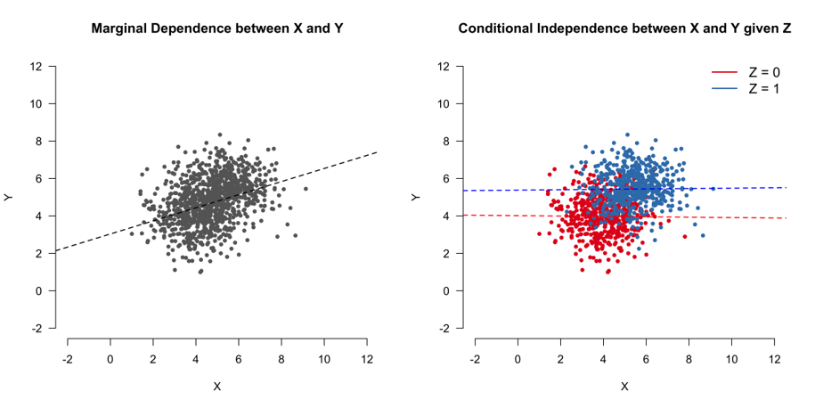
```

---

## 相关关系：边际相关与条件相关2

```{r, out.width= "90%", fig.cap="边际独立但是条件相关"}
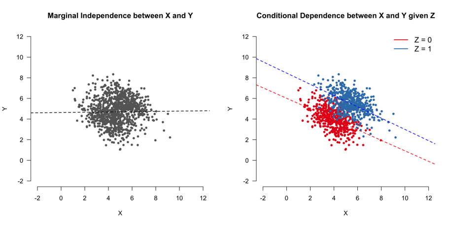
```

---

## 相关关系VS因果关系


```{r, out.width= "60%", fig.cap="巧克力消费量与诺贝尔奖数量"}
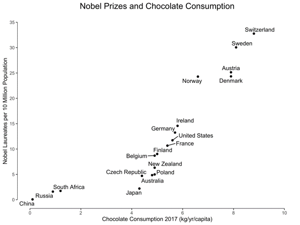
```

---

## 相关关系VS因果关系：性别的作用

```{r, out.width= "95%", fig.cap="治疗康复表"}
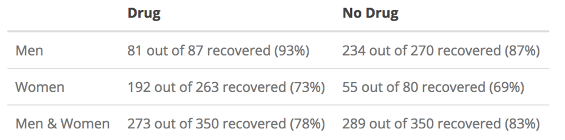
```

```{r, out.width= "60%", fig.cap="因果关系图"}
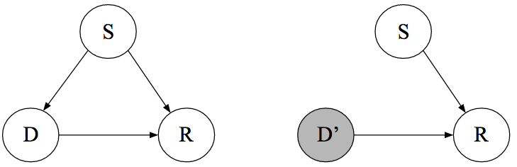
```

---

## 相关关系VS因果关系：血压的作用

```{r, out.width= "100%", fig.cap="治疗康复表"}
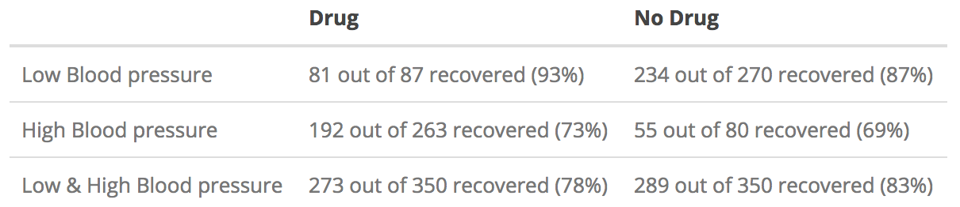
```

```{r, out.width= "60%", fig.cap="因果关系图"}
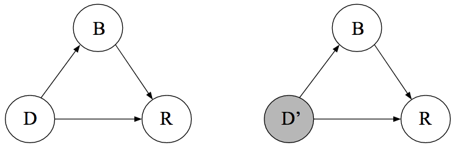
```

---

## （案例）微型家庭总体

<!---新数据表--->

```{r}
fams60<- as_tibble(read.xlsx("../data/extra/Table-2-1-60families-new.xlsx",shee = 1))

fams60_long <- as_tibble(read.xlsx("../data/extra/Table-2-1-60families-new.xlsx", sheet =2))

```

---

### （案例）假想总体：60个家庭的收支数据（直观列表）


```{r, fig.cap="60个家庭的收入和支出情况：假设的总体"}
include_graphics("../pic/extra/chpt2-1-60families-pop.png",dpi=150)
```

???
提问：

- 总体是什么？

- 有多少总体单位？

---

### （案例）假想总体：60个家庭的收支数据（扁数据形态）


```{r}
datatable(fams60, options = list(pageLength =9, dom ="t"), caption = "60个家庭的收入和支出情况：假设的总体")
```
???
**扁数据形态**：“非标准”数据形态（但很直观）

---

### （案例）假想总体：60个家庭的收支数据（长数据形态）

```{r}
datatable(fams60_long, options = list(pageLength =8, dom ="tip"), caption = "60个家庭的收入和支出情况：假设的总体")
```
???
**长数据形态**：标准数据形态（但不直观）。

---

## 重要概念：无条件概率和无条件期望

**无条件概率**：

- 定义：不受
$X_i$变量取值影响下，
$Y_i$出现的可能性。

- 记号：离散变量
$P(Y_i)$；连续变量
$g(Y)$

**无条件期望**：

- 定义：不受
$X_i$变量取值影响下，变量
$Y_i$的期望值。

- 记号：
$g(Y_i)$表示连续变量的概率密度函数（cdf）

$$\begin{align}
E(Y) &= \sum_1^N{Y_i \cdot P(Y_i)} &&\text{(discrete vars)} \\
E(Y) &= \int{Y_i \cdot g(Y_i)dY} &&\text{(continue vars)} 
\end{align}$$

---

### （示例）无条件概率和无条件期望的示例计算


```{r, out.width="90%", fig.cap="无条件概率和无条件期望"}
include_graphics("../pic/extra/chpt2-1-60fams-unconditional-mean.png")
```

---

### （示例）无条件期望的计算过程

$$\begin{align}
E(Y) &= \sum_1^N{Y_i \cdot P(Y_i)} \\
     &= \sum_1^{60}\left( 55*\frac{1}{60} + 60*\frac{1}{60} + \cdots + 191*\frac{1}{60} \right) \\
     &=\frac{1}{60}\sum_1^{60}Y_i\\
     &=\frac{7272}{60}\\
     &=121.2
\end{align}$$

---

## 重要概念：条件概率和条件期望

**条件概率**：

- 定义：给定变量
$X_i$的取值条件下，
$Y_i$出现的可能性。

- 记号：离散变量
$P(Y_i|X_i)$；连续变量
$g(Y|X)$


**条件期望**：

- 在给定变量
$X_i$的取值条件下，
$Y_i$的期望值。

- 记号：
$g(Y|X)$表示连续变量的条件概率密度函数（cdf）

$$\begin{align}
E(Y|X_i) &= \sum_1^N{(Y_i|X_i) \cdot P(Y_i|X_i)} &&\text{(discrete vars)} \\
E(Y|X_i) &= \int{(Y|X) \cdot g(Y|X)dY} &&\text{(continue vars)} \end{align}$$

---

### （示例）条件概率和条件期望的计算

```{r, out.width="90%",fig.cap="条件概率和条件期望"}
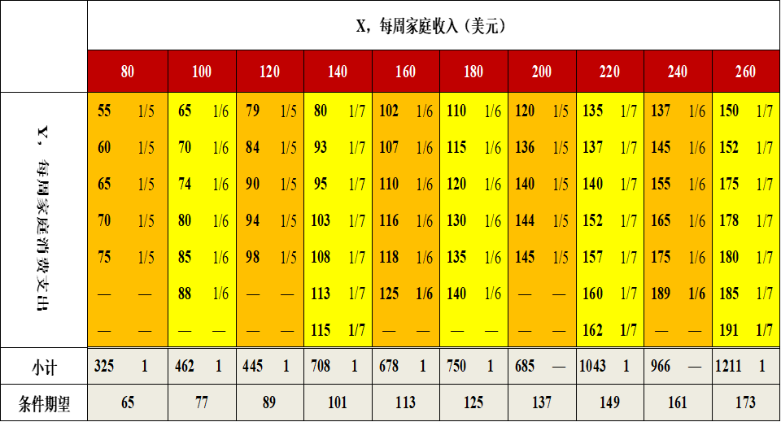
```

---

### （示例）条件期望的计算过程

$$\begin{align}
E(Y|80) &= \sum_1^N{Y_i \cdot P(Y_i|X=80)} \\
     &= \sum_1^{5}\left( 55*\frac{1}{5} + 60*\frac{1}{5} + \cdots + 75*\frac{1}{5} \right) \\
     &=\frac{1}{5}\sum_1^{5}Y_i\\
     &=\frac{325}{5}\\
     &=65
\end{align}$$

---

### （示例）假想总体的全部数据展示

```{r, warning=F}
exp_cond <- fams60 %>%
  filter(Mark!="X") %>%
  select(-Mark) %>%
  colMeans(.,na.rm = T) %>%
  rbind(fams60[1,-1], .) %>%
  add_column(var = c("X","E(Y|X)"), .before = "G1")

pivot_exp <- as_tibble(t(exp_cond))[-1,] %>%
  dplyr::rename( X=V1,exp.Y="V2") %>%
  type_convert(cols(X=col_double(),
                    exp.Y= col_double()))
```


```{r, out.width="90%"}
# the population points
p1<- ggplot() +
  geom_point(data = fams60_long,
             aes(x=X,  y=Y,color= "Y", shape="Y"),size=3) +
  scale_colour_manual(name= "",
                      values =c("blue")) +
  scale_shape_manual(name= "",
                      values =c(1)) +
  scale_x_continuous(breaks=seq(80,260, length=10)) +
  labs(x="家庭收入X", y="家庭支出Y") +
  theme(text = element_text(size=18),
        axis.title.x = element_text(size = 16,
                                margin = margin(t = 15, r = 0, 
                                                b = 0, l = 0)),
        axis.title.y = element_text(size = 16,
                                margin = margin(t = 0, r = 15, 
                                                b = 0, l = 0)))

p1
```


---

### （示例）给定不同X水平下Y条件期望值

```{r, fig.height= 5.5}
# the expect points
p2 <- p1 +
  geom_point(data = pivot_exp, 
             aes(x=X, y=exp.Y,
                 color= "E(Y|X)",shape= "E(Y|X)"), size=3) +
  scale_colour_manual(name= "",
                      values =c("red","blue")) +
  scale_shape_manual(name= "",values =c(19,1)) 

p2
```


```{r}
kable(exp_cond) %>%
  kable_styling(full_width =T)
```

---

### （示例）给定不同X水平下Y条件期望值

```{r, out.width="90%" , warning=FALSE,message=FALSE}
# the specified point
require("latex2exp")
X_spc <- 120
Y_spc <- pivot_exp$exp.Y[which(pivot_exp$X==X_spc)]
p2_1 <- p2 +
  geom_vline(aes(xintercept = X_spc), lty="dashed")+
  geom_hline(aes(yintercept = Y_spc), lty="dashed")+
  geom_text(aes(x=X_spc-22, y=Y_spc+10), label=TeX("$(X_i,E(Y|X_i))=(120,89)$"),
            color="red",size=5)

p2_1
```

给定
$X=120$水平下
$Y$条件期望值
$E(Y|X_i=120)$= `r pivot_exp$exp.Y[which(pivot_exp$X==X_spc)]`

---

### （示例）X均值和Y的无条件期望值

```{r, out.width="90%", warning=FALSE,message=FALSE}
# the center point
X_bar <- mean(fams60_long$X)
Y_bar <- mean(fams60_long$Y)
p3 <- p2 +
  geom_vline(aes(xintercept = X_bar), lty="dashed")+
  geom_hline(aes(yintercept = Y_bar), lty="dashed")+
  geom_text(aes(x=X_bar-20, y=Y_bar+10), label=TeX("$(\\bar{X},\\bar{Y})=(174, 121)$"),color="orange",size=5)+
  #geom_text(aes(x=15, y=mean(fams60_long$Y)+5), label=TeX("$E(Y)=\\bar{Y}$"))+
  geom_point(aes(x=X_bar, y=Y_bar,
                 color="center", shape="center"),size=3) +
  scale_colour_manual(name= "",
                      values =c("E(Y|X)"="red", "Y"="blue", "center" ="orange")) +
  scale_shape_manual(name= "",
                      values =c("E(Y|X)"=19,"Y"=1,"center" =17)) 
p3
```

X的均值
$\bar{X}$
=`r formatC(X_bar, format="f", digits =2)`和Y的无条件期望值
$E(Y)=$
`r formatC(Y_bar, format ="f", digits = 2)`

---

## 重要概念：总体回归线（PRL）

- 几何：给定X值时Y的条件期望值的轨迹。

- 统计：实质上就是Y对X的回归。

总体回归曲线(Population Regression Curve，PRC)：条件期望值的轨迹表现为一条曲线(Curve)。

总体回归线(Population Regression Line，PRL)：条件期望值的轨迹表现为一条直线(Line)。

---

## 重要概念：总体回归线（PRL）

```{r, out.width="90%", fig.cap="总体回归线PRL"}
p_PRL <- p2 +
  geom_line(data = pivot_exp,aes(x=X, y=exp.Y),color="purple", size=0.75)
p_PRL
```

---

## 重要概念：总体回归函数（PRF）

总体回归函数（Population Regression Function，PRF）：它是对总体回归曲线(PRC)的数学函数表现形式。

如果不知道总体回归曲线的具体形式，则总体回归函数PRF表达为如下隐函数形式（PRF）：

$$\begin{align}
E(Y|X_i) & = f(X_i)  && \text{(PRF)}
\end{align}$$

如果总体回归曲线是直线形式，则总体回归函数PRF表达为如下显函数形式（PRF_L）：

$$\begin{align}
E(Y|X_i) &= \beta_1 +\beta_2X_i && \text{(PRF_L)}
\end{align}$$

- 
$\beta_1,\beta_2$分别称为截距(intercept)和斜率系数(slope coefficient)。

- 
$\beta_1,\beta_2$称为总体参数或回归系数(regression coefficients)。

- 
$\beta_1,\beta_2$为未知但却是固定的参数。

---

## 重要概念：总体回归函数（PRF）

```{r, out.width="90%", fig.cap="总体回归线PRL与总体回归函数PRF", warning=FALSE,message=FALSE}
lm_pop<- lm(data = pivot_exp, formula = exp.Y~X)
b1 <- coef(lm_pop)[1]
b0 <- coef(lm_pop)[2]
p_PRF <- p_PRL +
  geom_text(aes(x=120, y=200),
            label=TeX("$PRF:E(Y|X_i)=\\beta_1+\\beta_2X_i$"),
            color="purple", size=5) +
    geom_text(aes(x=120, y=190),
            label=TeX("$E(Y|X_i)=17+0.6X_i$"),
            color="purple", size=5) 
p_PRF
```

---

## 重要概念：总体回归模型（PRM）

**总体回归模型**（Population Regression model, PRM）：把总体回归函数表达成**随机设定**形式。

如果总体回归函数为隐函数，则**总体回归模型**记为：

$$\begin{align}
Y_i &=  E(Y|X_i) + u_i \\
    &=  f(X_i) +u_i
\end{align}$$

如果总体回归函数为线性函数，则**总体回归模型**记为：

$$\begin{align}
Y_i &=  E(Y|X_i) + u_i \\
    &= \beta_1 +\beta_2X_i + u_i
\end{align}$$

- 总体回归模型（PRM）属于**计量经济学模型**，而总体回归函数（PRF）是**数量经济学模型**（或数学模型）。

- 总体回归模型（PRM）能充分表达的是现实世界中
$Y_i$变量的行为特征。


---

## 重要概念：随机干扰项

总体回归模型（PRM）设定下，
$Y_i$将由两个部分组成。

- 特定家庭的支出（
$Y_i$） = 系统性部分（
$E(Y|X_i)$ + 随机部分（
$u_i$）

- 特定家庭的支出（
$Y_i$） = 系统性部分（
$\beta_1+\beta_2X_i$） + 随机部分（
$u_i$）


**随机干扰项**：

- 也被称为随机误差项(stochastic error term)：总体回归函数中忽略掉的但又影响着Y的全部变量的替代物，它是
$Y_i$与条件期望（
$E(Y|X_i)$）的离差。

$$\begin{align}
u_i &= Y_i - E(Y|X_i) 
\end{align}$$

---

## 重要概念：随机干扰项

随机干扰项的来源：

- 理论的含糊：除了主变量之外，还有其它变量的影响，但不清楚，只能用𝜇_𝑖代替它们。（家庭收入以外？）

- 数据的不充分：可能知道被忽略的变量，但不能得到这些变量的数量信息。（如家庭财富数据不可得）

- 核心变量与其它变量：其它变量全部或其中一些合起来影响还是很小的。（如子女、教育、性别、宗教等）

- 人类行为的内在随机性。（客观存在、固有的）

- 变量被“移花接木”而产生测量误差（如弗里德曼的持久收入和消费）

- 节省原则：为了保持一个尽可能简单的回归模型

- 错误的函数形式：有时根据数据及经验无法确定一个正确的函数形式 （多元回归尤其如此）

---

## 重要概念：随机干扰项


.pull-left[
为何是“随机的”？

- 测不准？（误差）

- 测错了？（误导）

- 免不了!（内在性）

]

.pull-right[

拥抱随机世界

- 风筝：
$Y_i$

- 风筝线：
$E(Y|X_i)$

- 风：
$u_i$

]


---

## 重要概念：理解PRM和PRF的关系

```{r, out.width="90%", warning=FALSE,message=FALSE}
Y_spc2 <- min(fams60_long$Y[which(fams60_long$X==X_spc)])

p_PRM_demo<- p_PRF +
  geom_point(aes(x=X_spc,y=Y_spc), shape=2,size=3)+
  geom_point(aes(x=X_spc,y=Y_spc2), shape=1, color="black",size=3)+
  geom_hline(aes(yintercept = Y_spc), lty= "dashed") +
  geom_text(aes(x=X_spc+25,y=Y_spc+4),
             label=paste0("E(Y|",X_spc,")=",Y_spc),size=5) +
  geom_hline(aes(yintercept = Y_spc2), lty= "dashed") +
  geom_text(aes(x=X_spc+25,y=Y_spc2-4),
             label=paste0("(Yi|", X_spc,")=",Y_spc2),size=5) 
  
p_PRM_demo
```

若给定一个特定家庭
$(X_i=120, Y_i=79)$，则条件期望为
$E(Y|120)=89$


---

## 重要概念：理解PRM和PRF的关系

若给定
$X_i=$ `r X_spc` ，则5个家庭的真实消费支出分别为：

$$\begin{align}
(Y_1|X=120) = 79 &= \beta_1 + \beta_2 \cdot 120 +u_1\\
(Y_2|X=120) = 84 &= \beta_1 + \beta_2 \cdot 120 +u_2\\
(Y_3|X=120) = 90 &= \beta_1 + \beta_2 \cdot 120 +u_3\\
(Y_4|X=120) = 94 &= \beta_1 + \beta_2 \cdot 120 +u_4\\
(Y_5|X=120) = 98 &= \beta_1 + \beta_2 \cdot 120 +u_5
\end{align}$$


---

## 重要概念：理解PRM和PRF的关系

主要结论：

- 总体期望刻画总体的“趋势”，总体回归线让“趋势”直观化。

- 个体随机性是不可避免的，总会“游离”于“趋势”之外。

- 随机干扰项
$u_i$𝑖携带了随机个体的“游离”信息。

- 总体回归模型既“提取”了趋势和规律性，又“维系”着个体随机性，从而更好地表达了“真实世界”。

课后思考：

- 如果是无限总体，总体的规律性在理论上也是可以被严格表达出来么？

- 如果不告诉你总体，你怎么知道“触碰”到的是“真实的”趋势/规律？

- 从假想的60个家庭的微型总体中，“随便”抽取10个家庭的数据，你还能看到“直线”趋势么？


---

## 重要概念：“线性”的含义

“线性回归模型”中“线性”一词的含义

- **变量“线性”模型**：因变量对于自变量是线性的。

- **参数“线性”模型**：因变量对于参数是线性的。

---

### （测试题）“线性”的含义

下列模型分别属于哪一类？请指出来：

$$\begin{align}
Y_i &= \beta_1 + \beta_2 X_i +u_i && \text{(mod1)}
\end{align}$$

$$\begin{align}
Y_i &= \beta_1 + \beta_2 X_i + \beta_3 X_i^2 +u_i && \text{(mod2)}
\end{align}$$

$$\begin{align}
Y_i &= \beta_1 + \beta_2 X_i + \beta_3 X_i^2 + \beta_4 X_i^3 +u_i && \text{(mod3)}
\end{align}$$

$$\begin{align}
Y_i &= \beta_1 + \beta_2 \frac{1}{X_i} +u_i && \text{(mod4)}
\end{align}$$


$$\begin{align}
Y_i &= \beta_1 + \beta_2 ln(X_i) +u_i && \text{(mod5)} \\
\end{align}$$


$$\begin{align}
ln(Y_i) &= \beta_1 + \beta_2 X_i +u_i && \text{(mod6)}
\end{align}$$

---

### （测试题）“线性”的含义

下列模型分别属于哪一类？请指出来：

$$\begin{align}
ln(Y_i) &= \beta_1 - \beta_2 \frac{1}{X_i} +u_i && \text{(mod7)} 
\end{align}$$


$$\begin{align}
ln(Y_i) &= ln(\beta_1) + \beta_2 ln(X_i) +u_i && \text{(mod8)} 
\end{align}$$


$$\begin{align}
Y_i &= \frac{1}{1+e^{(\beta_1 + \beta_2 X_{2i}  +u_i) }} && \text{(mod9)}
\end{align}$$


$$\begin{align}
Y_i &= \beta_1 +(0.75-\beta_1)e^{-\beta_2(X_i-2)} +u_i && \text{(mod10)}
\end{align}$$


$$\begin{align}
Y_i &= \beta_1 + \beta_2^3 X_i +u_i && \text{(mod11)} 
\end{align}$$

---

## 重要概念：样本回归线(SRL)

**样本(Sample)**：

- 从总体中随机抽取得到的数据。

**样本回归线**(Sample Regression Line，SRL)：

- 是通过拟合**样本数据**得到的一条曲线（或直线）。换言之，这条线由拟合值
$\hat{Y}_i$连接而成。

- 
$\hat{Y}_i$是对条件期望值
$Y|X_i$的拟合。

- 拟合方法有很多，例如采用OLS方法对样本数据进行拟合。

    - 尽可能拟合数据
    - 用什么方法拟合？
    - 曲线是什么形态？


---

## 重要概念：样本回归函数(SRF)

**样本回归函数**(Sample Regression Function，SRF)：是样本回归曲线的数学函数形式，可是是线性的或非线性。如果是直线则可以写成：

$$\begin{align}
\hat{Y}_i =\hat{\beta}_1 + \hat{\beta}_2X_i
\end{align}$$

对比总体回归函数（PRF）：

$$\begin{align}
E(Y|X_i) =\beta_1 + \beta_2X_i
\end{align}$$

可以认为：

- 
$\hat{Y}_i$是对
$E(Y|X_i)$的估计量。

- 
$\hat{\beta}_1$是对
$\beta_1$的估计量。

- 
$\hat{\beta}_2$是对
$\beta_2$的估计量。

---

### （示例）第一份随机样本：抽样

```{r}
set.seed("123")
sample1<- fams60_long %>% 
  mutate(group = as.factor(group)) %>%
  group_by(group) %>%
  sample_n(size=1) %>% ungroup() %>% select(-id,-group)

set.seed("124")
sample2<- fams60_long %>% 
  mutate(group = as.factor(group)) %>%
  group_by(group) %>%
  sample_n(size=1) %>% ungroup() %>% select(-id,-group) 

```


```{r, fig.height=6}
p_spl1 <- p1 +
  geom_point(data = sample1, 
         aes(x=X, y=Y, shape="sample1", color="sample1"),
         size=3)+
  scale_colour_manual(name= "",
                      values =c("black","blue")) +
  scale_shape_manual(name= "",
                      values =c(15,1))

p_spl1
```

```{r, warning=FALSE,message=FALSE}
old.names <- str_c("V",1:10)
new.names <- str_c("n",1:10)
sample1_t<- sample1 %>% 
  t(.) %>% as_tibble(.) %>% 
  rename_at(vars(old.names), ~ new.names) %>%
  add_column(var=c("X","Y"), .before = "n1") 

kable(sample1_t)
```

---

### （示例）第一份随机样本：数据

```{r, fig.height=6}
p_spl_base<- ggplot(sample1, aes(X, Y)) +
  geom_blank() +
  scale_x_continuous(breaks=seq(80,260, length=10)) +
  scale_y_continuous(breaks=seq(50,150, length=3)) +
  labs(x="家庭收入X", y="家庭支出Y") +
  theme(text=element_text(size=16))

p_spl1_alone <- p_spl_base +
  geom_point(aes(shape="sample1"), color="black",size=3)+
  scale_y_continuous(breaks=seq(50,150, length=3)) +
  scale_shape_manual(name= "",
                      values =c(15))

p_spl1_alone
```

```{r}
kable(sample1_t)
```

---

### （示例）第一份随机样本：SRL

```{r, warning=F}
mod_spl <- formula("Y~X")
coef_mod1<- fun_lm_coef(lm.mod = mod_spl, lm.dt = sample1)
```


```{r, fig.height=6, warning=F}
p_spl1_SRL<- p_spl1_alone +
  geom_abline( intercept = coef_mod1$coef[1], slope= coef_mod1$coef[2], color="black") +
  geom_text(aes(x=120,y=170),
             label=TeX("$\\hat{Y_i}=\\hat{\\beta}_1+\\hat{\\beta}_2X_i$"),size=5) +
  geom_text(aes(x=120,y=160),
             label=TeX("$\\hat{Y}=17.81+0.62X_i$"),size=5) 
p_spl1_SRL  
```

```{r}
kable(sample1_t)
```

---

### （示例）第一份随机样本：SRF

根据第一份随机样本拟合得到的**样本回归函数**SRF：

```{r ,results="asis"}
fun_report_eq(lm.mod = mod_spl, lm.dt = sample1,
              lm.simple=TRUE,lm.n = 2)
```

样本数据如下：

```{r}
kable(sample1_t)
```


---

### （示例）第二份随机样本：抽样

```{r, warning=FALSE,message=FALSE}
sample2_t<- sample2 %>% 
  t(.) %>% as_tibble(.) %>% 
  rename_at(vars(old.names), ~ new.names) %>%
  add_column(var=c("X","Y"), .before = "n1")
```

```{r, fig.height=6}
p_spl2 <- p1 +
  geom_point(data = sample2, 
         aes(x=X, y=Y, shape="sample2", color="sample2"),size=3)+
  scale_colour_manual(name= "",
                      values =c("purple","blue")) +
  scale_shape_manual(name= "",
                      values =c(17,1))

p_spl2
```

```{r}
kable(sample2_t)
```


---

### （示例）第二份随机样本：数据


```{r, fig.height=6}
p_spl2_alone <- p_spl_base +
geom_point(data=sample2,aes(shape="sample2"), color="purple",size=3)+
  scale_y_continuous(breaks=seq(50,150, length=3)) +
  scale_shape_manual(name= "",
                      values =c(17))

p_spl2_alone
```

```{r}
kable(sample2_t)
```

---

### （示例）第二份随机样本：SRL

```{r, warning=F}
coef_mod2<- fun_lm_coef(lm.mod = mod_spl, lm.dt = sample2)
```


```{r, fig.height=6, warning=F}
p_spl2_SRL<- p_spl2_alone +
  geom_abline( intercept = coef_mod2$coef[1], slope= coef_mod2$coef[2], color="purple") +
  geom_text(aes(x=120,y=170),
             label=TeX("$\\hat{Y_i}=\\hat{\\beta}_1+\\hat{\\beta}_2X_i$"),size=5) +
  geom_text(aes(x=120,y=160),
             label=TeX("$\\hat{Y}=7.12+0.65X_i$"),size=5) 
p_spl2_SRL  
```

```{r}
kable(sample2_t)
```

---

### （示例）第二份随机样本：SRF

根据第二份随机样本拟合得到的**样本回归函数**SRF：


```{r, results="asis"}
fun_report_eq(lm.mod = mod_spl, lm.dt = sample2,
              lm.simple = TRUE)
```


样本数据如下：

```{r}
kable(sample2_t)
```

---

### （示例）两份样本同时出现：

```{r,warning=FALSE}
sample_all<- rbind(sample1, sample2) %>%
  add_column(cat= rep(c("sample1", "sample2"), c(10,10)),
             .before = "X")
```

```{r, fig.height=6,warning=FALSE}
p_sample_all<- p2 + 
  geom_point(data = sample1, 
             aes(x=X, y=Y),color="black", shape=15)+
  geom_point(data = sample2, 
             aes(x=X, y=Y),color="purple", shape=17)+
  geom_abline( intercept = coef_mod1$coef[1], slope= coef_mod1$coef[2], color="black",lty="dashed") +
  geom_abline( intercept = coef_mod2$coef[1], slope= coef_mod2$coef[2], color="red",lty="dashed") +
  geom_abline( intercept = 17, slope= 0.6, color="purple") +
  geom_text(aes(x=120,y=180),
             label=TeX("$SRL1:\\hat{Y}=17.81+0.62X_i$"), color="black",size=5)+
  geom_text(aes(x=120,y=170),
             label=TeX("$SRL2:\\hat{Y}=7.12+0.65X_i$"), color="purple",size=5) +
  geom_text(aes(x=120,y=160),
             label=TeX("$PRL:\\hat{Y}=17+0.6X_i$"), color="red",size=5) 
  
  
p_sample_all
```


---

## 重要概念：样本回归模型（SRM）

样本回归模型（Sample Regression Model，SRM）：把样本回归函数表现为**“随机”**形式。

- 如果样本回归函数为隐函数，则样本回归模型可记为：

$$\begin{align}
Y_i &= g(X_i) +e_i 
\end{align}$$

- 如果样本回归函数表现为直线，则样本回归模型可记为：

$$\begin{align}
Y_i &= \hat{\beta}_1 +\hat{\beta}_2X_i +e_i && \text{(SRM_L)}
\end{align}$$

其中，
$e_i$表示残差（Residual）

---

## 重要概念：残差

残差（Residual）：

- 定义：是样本回归函数与Y的样本观测值之间的离差。

- 记号：

$$\begin{align}
e_i  &= Y_i - \hat{Y}_i \\
     &= Y_i - (\hat{\beta}_1 +\hat{\beta}_2X_i) 
\end{align}$$

---

## 重要概念：理解SRF和SRM的关系

```{r, warning=FALSE, message=FALSE}
x_spc_spl2 <- 240
Y_spc_spl2 <- sample2$Y[which(sample2$X==x_spc_spl2)]
lm.spl2 <- lm(formula = mod_spl, data = sample2)
Y_spc_fit <- round(lm.spl2$fitted.values[which(sample2$X==x_spc_spl2)],1)

p_SRL_SRF <- p_spl2_SRL +
  geom_vline(aes(xintercept = x_spc_spl2), lty="dashed") +
  geom_hline(aes(yintercept = Y_spc_spl2), lty="dashed")+
  geom_hline(aes(yintercept = Y_spc_fit), lty="dashed") +
  geom_point(aes(x=x_spc_spl2, y= Y_spc_fit), shape=1, size=3,color="red") +
  geom_text(aes(x=x_spc_spl2+15, y=Y_spc_spl2-5), 
            label=  paste0("(",x_spc_spl2,"," ,Y_spc_spl2-5,")"),size=5)+
  geom_text(aes(x=x_spc_spl2+15, y=Y_spc_fit, 
            label= paste0("(",x_spc_spl2,"," ,Y_spc_fit,")")),size=5)

p_SRL_SRF 

```

给定
$x_i=$ `r x_spc_spl2`，样本2的观测值
$Y_i=$ `r x_spc_spl2`；拟合值
$\hat{Y}_i=$ `r Y_spc_fit`；残差
$e_i=Y_i- \hat{Y}_i=$ `r Y_spc_spl2 -Y_spc_fit`。

---

## 重要概念：样本回归与总体回归的比较

```{r}
include_graphics("../pic/extra/chpt2-1-PRL-SRL.png", dpi=120)
```

--

为何不同？继承性和变异性


---

## 重要概念：样本回归与总体回归的比较

.pull-left[
总体回归函数PRF:

$$\begin{align}
E(Y|X_i) &= \beta_1 +\beta_2X_i && \text{(PRF)}
\end{align}$$

总体回归模型PRM:

$$\begin{align}
Y_i &=  \beta_1 +\beta_2X_i + u_i && \text{(PRM)}
\end{align}$$

]


.pull-right[
样本回归函数SRF:

$$\begin{align}
\hat{Y}_i =\hat{\beta}_1 + \hat{\beta}_2X_i && \text{(SRF)}
\end{align}$$

样本回归模型SRM:

$$\begin{align}
Y_i &= \hat{\beta}_1 + \hat{\beta}_2X_i +e_i && \text{(SRM)}
\end{align}$$

]

--

思考：

- PRF无法直接观测，只能用SRF近似替代

- 估计值与观测值之间存在偏差

- SRF又是怎样决定的呢?


---

## 重要概念：样本回归与总体回归的比较


总结：

- 随机抽样数据继承了总体的特征。

- 利用随机样本进行数据拟合是对总体规律的“反向追踪”。

- 样本回归模型中的残差是拟合不完全的产物。

--

思考：

- 怎样来判定对随机样本的一次数据拟合是更优的？

- 存不存在一种“最优”的拟合方法？

--

课后作业：

- 请把162名同学的拟合线进行平均化处理（截距和斜率取均值），绘制得到一条“回归线”。

- 你认为是这根平均化的“回归线”与真相更逼近么？

---
layout: false
class: center, middle, duke-softblue,hide_logo
name: ols

# 5.3 OLS方法与参数估计

### 普通最小二乘法（OLS）

### 参数估计

### 估计精度

### 区间估计

---
layout: true

<div class="my-header-h2"></div>

<div class="watermark1"></div>

<div class="watermark2"></div>

<div class="watermark3"></div>

<div class="my-footer"><span>huhuaping@  &emsp;&emsp; <a href="#chapter"> 第05章 相关和回归分析 </a>
&emsp;&emsp;&emsp;&emsp;&emsp;&emsp;&emsp;&emsp;&emsp;&emsp;&emsp;&emsp;&emsp;&emsp;&emsp;&emsp;&emsp;&emsp;&emsp;&emsp;&emsp;
<a href="#ols"> 5.3 OLS方法与参数估计 </a> </span></div> 

---

## 普通最小二乘法（OLS）：引子

我们如何估计回归函数中的系数？

.pull-left[

总体回归：
$$\begin{cases}
  \begin{align}
  E(Y|X_i) &= \beta_1 +\beta_2X_i && \text{(PRF)} \\
  Y_i &=  \beta_1 +\beta_2X_i + u_i && \text{(PRM)}
  \end{align}
\end{cases}$$

]

.pull-right[
样本回归：
$$\begin{cases}
  \begin{align}
  \hat{Y}_i & =\hat{\beta}_1 + \hat{\beta}_2X_i && \text{(SRF)} \\
  Y_i &= \hat{\beta}_1 + \hat{\beta}_2X_i +e_i && \text{(SRM)}
  \end{align}
\end{cases}$$

]


首先需要回答的问题是，我们该如何估计得出样本回归函数中的系数？事实上，方法有多种多样：

- 图解法：比较粗糙，但提供了基本的视觉认知

- 最小二乘法(order lease squares, OLS)：最常用的方法

- 最大似然法(maximum likelihood, ML)

- 矩估计方法(Moment method, MM)

---

## 普通最小二乘法（OLS）：回顾和比较

.pull-left[
.pa2.bg-lightest-blue[
总体回归函数PRF:

$$\begin{align}
E(Y|X_i) &= \beta_1 +\beta_2X_i 
\end{align}$$

总体回归模型PRM:

$$\begin{align}
Y_i &=  \beta_1 +\beta_2X_i + u_i 
\end{align}$$
]

]

.pull-right[

.pa2.bg-light-blue[
样本回归函数SRF:

$$\begin{align}
\hat{Y}_i =\hat{\beta}_1 + \hat{\beta}_2X_i 
\end{align}$$

样本回归模型SRM:

$$\begin{align}
Y_i &= \hat{\beta}_1 + \hat{\beta}_2X_i +e_i 
\end{align}$$

]

]

--

思考：

- PRF无法直接观测，只能用SRF近似替代

- 估计值与观测值之间存在偏差

- SRF又是怎样决定的呢?

---

## 普通最小二乘法（OLS）：原理

认识普通最小二乘法的原理：一个图示

```{r, fig.cap="最小二乘法的原理"}
include_graphics("../pic/extra/chpt3-OLS-demo.png",dpi=270)
```

---

## 普通最小二乘法（OLS）：原理

OLS的基本原理：残差平方和最小化。

$$\begin{align}
e_i  &= Y_i - \hat{Y}_i \\
     &= Y_i - (\hat{\beta}_1 +\hat{\beta}_2X_i) 
\end{align}$$


$$\begin{align}
Q  &= \sum{e_i^2} \\
   &= \sum{(Y_i - \hat{Y}_i)^2} \\
   &= \sum{\left( Y_i - (\hat{\beta}_1 +\hat{\beta}_2X_i) \right)^2} \\
   &\equiv f(\hat{\beta}_1,\hat{\beta}_2)
\end{align}$$


$$\begin{align}
Min(Q)  &= Min \left ( f(\hat{\beta}_1,\hat{\beta}_2) \right)
\end{align}$$

---

### （示例） 普通最小二乘法（OLS）的一个数值试验

假设存在下面所示的4组观测值
$(X_i, Y_i)$：

```{r, fig.cap="数值试验：数据"}
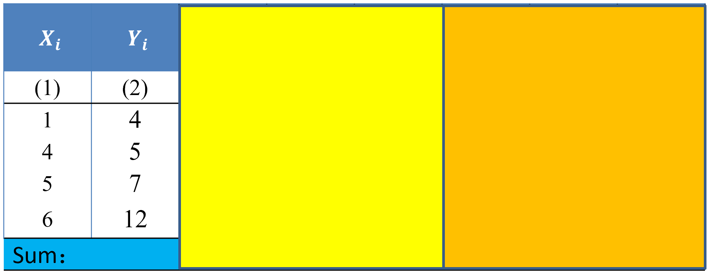
```

---

### （示例） 普通最小二乘法（OLS）的一个数值试验

假设随便猜想了如下两个SRF，完成下表计算，并分析哪个SRF给出的
$(\hat{\beta}_1, \hat{\beta}_2)$要更好？

$$\begin{align}
SRF1：\hat{Y}_{1i} & = \hat{\beta}_1 +\hat{\beta}_2X_i = 1.572 + 1.357X_i \\
SRF2：\hat{Y}_{2i} & = \hat{\beta}_1 +\hat{\beta}_2X_i = 3.0 + 1.0X_i 
\end{align}$$


```{r, fig.cap="数值试验：计算"}
include_graphics("../pic/extra/chpt3-OLS-compare2.png", dpi = 220)
```

---

## 参数估计：回归参数的OLS点估计

最小化求解：

$$\begin{align}
Min(Q)  &= Min \left ( f(\hat{\beta}_1,\hat{\beta}_2) \right)\\
 &= Min\left(\sum{\left( Y_i - (\hat{\beta}_1 +\hat{\beta}_2X_i) \right)^2} \right) \\
  &= Min \sum{\left( Y_i - \hat{\beta}_1 - \hat{\beta}_2X_i \right)^2}
\end{align}$$


方程组变形，得到**正规方程组**：

$$\begin{align}
\left \{
  \begin{split}
   \sum{\left[ \hat{\beta}_1 - (Y_i -\hat{\beta}_2X_i) \right]}  &=0 \\
   \sum{\left[ X_i^2\hat{\beta}_2 - (Y_i-\hat{\beta}_1 )X_i \right ] }&=0 
   \end{split}
\right. 
\end{align}$$

$$\begin{align}
\left \{
  \begin{split}
   \sum{Y_i} - n\hat{\beta}_1- (\sum{X_i})\hat{\beta}_2 &=0 \\
   \sum{X_iY_i}-(\sum{X_i})\hat{\beta}_1 -  (\sum{X_i^2})\hat{\beta}_2 &=0 
   \end{split}
\right.
\end{align}$$

---

## 参数估计：回归参数的OLS点估计

进而得到回归系数的计算公式1（Favorite Five，FF）：

$$\begin{align}
  \left \{
  \begin{split}
  \hat{\beta}_2 &=\frac{n\sum{X_iY_i}-\sum{X_i}\sum{Y_i}}{n\sum{X_i^2}-\left ( \sum{X_i} \right)^2}\\
  \hat{\beta}_1 &=\frac{n\sum{X_i^2Y_i}-\sum{X_i}\sum{X_iY_i}}{n\sum{X_i^2}-\left ( \sum{X_i} \right)^2}
  \end{split} 
  \right.
  &&\text{(FF solution)}
\end{align}$$

---

## 参数估计：回归参数的OLS点估计

此外我们也可以得到如下的离差公式(favorite five，ff)

$$\begin{align}
\left \{
  \begin{split}
  \hat{\beta}_2 &=\frac{\sum{x_iy_i}}{\sum{x_i^2}}\\
  \hat{\beta}_1 &=\bar{Y}_i-\hat{\beta}_2\bar{X}_i
  \end{split} 
\right.  
  && \text{(ff solution)}
\end{align}$$

其中离差计算
$x_i=X_i-\bar{X};\  y_i=Y_i - \bar{Y}$。

---

### （测试题）

以下式子为什么是等价的？你能推导出来么？

$$\begin{align}
\left\{
  \begin{split}
    \sum{x_iy_i} &= \sum{\left[ (X_i-\bar{X})(Y_i-\bar{Y})\right]} 
    &&= \sum{X_iY_i} - \frac{1}{n}\sum{X_i}\sum{Y_i} \\
    \sum{x_i^2} &= \sum{(X_i- \bar{X})^2} 
    &&= \sum{X_i^2} -\frac{1}{n} \left( \sum{X_i} \right)^2
  \end{split}
\right.
\end{align}$$

---

## 参数估计：随机干扰项参数的OLS点估计

PRM公式变形：

$$\begin{alignedat}{2}
&\left.
  \begin{split}
   Y_i &&= \beta_1 - &&\beta_2X_i +u_i  \ && \text{(PRM)} \Rightarrow \\
   \hat{Y} &&= \beta_1 - &&\beta_2\bar{X} +\bar{u} && \\   
  \end{split}
\right \} \Rightarrow \\
 & y_i = \beta_2x_i +(u_i- \bar{u})  
\end{alignedat}$$

残差公式变形：

$$\begin{alignedat}{2}
 &\left. 
  \begin{split}
    & e_i = y_i - \hat{\beta}_2x_i \\
    & e_i = \beta_2x_i +(u_i- \bar{u}) -\hat{\beta}_2x_i 
  \end{split}
\right \}  \Rightarrow \\
& e_i =-(\hat{\beta}_2- \beta_2)x_i + (u_i- \hat{u})
\end{alignedat}$$

---

## 参数估计：随机干扰项参数的OLS点估计

求解残差平方和：

$$\begin{alignedat}{2}
  & \sum{e_i^2} && = (\hat{\beta}_2 - \beta_2)^2\sum{x_i^2} + \sum{(u-\bar{u})^2} - 2(\hat{\beta}_2 - \beta_2)\sum{x_i(u-\bar{u})}  
\end{alignedat}$$

求残差平方和的期望：

$$\begin{align}
E(\sum{e_i^2}) &= 
 \sum{x_i^2 E \left[ (\hat{\beta}_2 - \beta_2)^2 \right ]}+ E\left[ \sum{(u-\bar{u})^2} \right ]\\
&+ 2E \left[ (\hat{\beta}_2 - \beta_2)\sum{x_i(u-\bar{u})} \right ] \\
& \equiv   A + B + C \\
& = \sigma^2 + (n-1)\sigma^2 -2\sigma^2 \\
& = (n-2)\sigma^2 
\end{align}$$

---

## 参数估计：随机干扰项参数的OLS点估计

**回归误差方差**（Deviation of Regression Error）：

- 采用OLS方法下，总体回归模型PRM中随机干扰项
$u_i$的总体方差的无偏估计量，记为
$E(\sigma^2) \equiv \hat{\sigma}^2$，简单地记为
$\hat{\sigma}^2$。

$$\begin{align}
\hat{\sigma}^2=\frac{\sum{e_i^2}}{n-2}
\end{align}$$

--

**回归误差标准差**（Standard Deviation of Regression Error）：有时候也记为**se**。

$$\begin{align}
\hat{\sigma}=\sqrt{\frac{\sum{e_i^2}}{n-2}}
\end{align}$$

???
- 采用OLS方法下，总体回归模型PRM中随机干扰项
$u_i$的总体标准差的无偏估计量，记为
$E(\sigma) \equiv \hat{\sigma}$，代数表达式一般简单地记为
$\hat{\sigma}$

---

### （附录）A过程证明

$$\begin{align}
A & = \sum{x_i^2 E \left[ (\hat{\beta}_2 - \beta_2)^2 \right ]} \\
  & = \sum{ \left[ x_i^2 \cdot var(\hat{\beta}_2) \right] } \\
  & = var(\hat{\beta}_2) \cdot \sum{x_i^2}  \\
  & = \frac{\sigma^2}{\sum{ x_i^2}} \cdot \sum{ x_i^2}  \\
  & = \sigma^2
\end{align}$$

---

### （附录）B过程证明

$$\begin{align}
B  = E \left[ \sum{(u-\bar{u})^2} \right ] 
  & = E(\sum{u_i^2}) - 2E \left[ \sum{(u_i\bar{u})} \right] +nE(\bar{u}^2) \\
  & = n \cdot Var(u_i) - 2E \left[ \sum{(u_i \cdot \frac{\sum{u_i}}{n} )}  \right]  + nE(\frac{\sum{u_i}}{n})^2 \\
  & = n \sigma^2 - 2E \left[ \frac{\sum{u_i}}{n} \sum{u_i} \right] + E\left[ \frac{(\sum{u_i})^2}{n} \right]\\
  & = n \sigma^2- E\left[ (\sum{u_i})^2/{n} \right] 
  = n \sigma^2  -  \frac{E(u_i^2) + E(u_2^2) + \cdots +  E(u_n^2) )}{n} \\
  & =  n \sigma^2 -  \frac{nVar{u_i}}{n} 
   =  n \sigma^2 -  \sigma^2 =  (n-1) \sigma^2
\end{align}$$

---

### （附录）C过程证明

$$\begin{align}
C &= - 2E \left[ (\hat{\beta}_2 - \beta_2)\sum{x_i(u_i-\bar{u})} \right ] \\
  &= - 2E \left[ \frac{\sum{x_iu_i}}{\sum{x_i^2}} \left( \sum{x_iu_i}-\bar{u}\sum{x_i} \right) \right ] \\
  &= - 2E \left[ \frac{ \left( \sum{x_iu_i} \right)^2}{\sum{x_i^2}}  \right ]  \\
  &= -2E \left[(\hat{\beta}_2 - \beta_2)^2 \right] = -2\sigma^2
\end{align}$$

--

- 其中：

$$\begin{align}
\hat{\beta}_2 & = \sum{k_iY_i} = \sum{k_i(\beta_1 +\beta_2X_i +u_i)}   = \beta_1\sum{k_i} +\beta_2 \sum{k_iX_i}+\sum{k_iu_i}  
= \beta_2 +\sum{k_iu_i} \\
\hat{\beta}_2 - \beta_2 & = \sum{k_iu_i} = \frac{ \sum{x_iu_i} }{\sum{x_i^2}}
\end{align}$$

---
exclude:true

## （案例）教育程度与时均工资

```{r, message=FALSE, warning=FALSE}
data_wage <- as_tibble(read.xlsx("../data/extra/Table-3-2-edu-wage.xlsx", sheet = 1))
n <- dim(data_wage)[1]

lm.wage <- lm(formula = "Y~X", data_wage)


calc_tbl <- data_wage %>%
  mutate(FF_XY = X*Y, FF_X_sqr = X^2, FF_Y_sqr = Y^2,
         ff_x = X-mean(X), ff_y = Y-mean(Y),
         ff_xy=ff_x*ff_y, ff_x_sqr=ff_x^2, ff_y_sqr=ff_y^2, 
         Y_hat= fitted(lm.wage),
         e_i = residuals(lm.wage), 
         e_i_star =e_i/sd(e_i),
         e_i_star_st = MASS::studres(lm.wage),
         e_i_sqr = e_i^2)  %>%
  rbind(colSums(.)) %>%  
  mutate(obs=replace(obs, obs==91, "sum")) 

k <- dim(calc_tbl)[2]

FF_ff <- calc_tbl %>%
  filter(obs=="sum") %>%
  mutate_if(is.numeric, funs(round(., digits = 3)))

b2 <- lm.wage$coefficients[2]
b1 <- lm.wage$coefficients[1]
mean_X <- (FF_ff$X)/n
mean_Y <- (FF_ff$Y)/n
dev <- (FF_ff$e_i_sqr)/(n-2)
dev_b2 <- dev/FF_ff$ff_x_sqr
dev_b1 <- dev_b2*(FF_ff$FF_X_sqr/n)
S_b1 <- sqrt(dev_b1)
S_b2 <- sqrt(dev_b2)
TSS <- sum((data_wage$Y -mean(data_wage$Y))^2)
RSS <- FF_ff$e_i_sqr
ESS <- TSS -RSS
r2  <- ESS/TSS
r <- cor(data_wage$X, data_wage$Y)
cov_XY <- cov(data_wage$X, data_wage$Y)
S_X <- sd(data_wage$X)
S_Y <- sd(data_wage$Y)
t_0.975 <- qt(0.975, n-2)
chisq_0.025 <- qchisq(0.025,n-2)
chisq_0.975 <- qchisq(0.975,n-2)
t_b1 <- b1/S_b1
t_b2 <- b2/S_b2
f_ESS <- 1
f_RSS <- n-2
f_TSS <- n-1
f_0.95 <- qf(0.95,f_ESS,f_RSS)
f_test <- (ESS/f_ESS)/(RSS/f_RSS)
# forecast
X_0 <- 20
Y_0_hat <- b1+b2*X_0
t_0.95 <- qt(0.95,n-2)
S2_Y0h <- dev*(1/n+(X_0-mean_X)^2/(FF_ff$ff_x_sqr))
Y_exp_lft <- Y_0_hat - t_0.95*(sqrt(S2_Y0h))
Y_exp_rht <- Y_0_hat + t_0.95*(sqrt(S2_Y0h))
S2_Y0h_mns <- dev*(1+1/n+(X_0-mean_X)^2/(FF_ff$ff_x_sqr))
Y_ind_lft <- Y_0_hat - t_0.95*(sqrt(S2_Y0h_mns))
Y_ind_rht <- Y_0_hat + t_0.95*(sqrt(S2_Y0h_mns))

```

```{r}
head.name <- c("obs","$X_i$","$Y_i$","$X_iY_i$", "$X_i^2$", "$Y_i^2$", "$x_i$", "$y_i$", "$x_iy_i$","$x_i^2$","$y_i^2$","$\\hat{Y}_i$","$e_i$","$e_{i, sd}^{\\ast}$","$e_{i, st}^{\\ast}$","$e_i^2$")  

show_tbl <- calc_tbl  %>% 
  rename_at(vars(names(.)), ~ head.name)

```


---

### （案例）计算表FF和ff

```{r, warning=F, message=FALSE}
show_tbl %>%
  select(1:11) %>%
  mutate_if(is.numeric, ~formatC(., digits = 2, format = "f")) %>%
  kable(align = "c")  %>%
  kable_styling(full_width = T, font_size= 20)
```

---

### （案例）计算回归系数

公式1: （Favorite Five，FF形式）

```{r, results= "asis"}
cat(
  "$$\\begin{align}",
  "\\hat{\\beta}_2 &=\\frac{n\\sum{X_iY_i}-\\sum{X_i}\\sum{Y_i}}{n\\sum{X_i^2}-\\left ( \\sum{X_i} \\right)^2}\\\\",
str_c(
  "&=\\frac{",n,"\\ast",FF_ff$FF_XY,"-",FF_ff$X, "\\ast",FF_ff$Y,"}{",n,"\\ast",FF_ff$FF_X_sqr,"-",FF_ff$X,"^2}",
  "=",round(b2,4)
  ),
"\\end{align}$$",
sep="\n"
)
```


```{r, results= "asis"}
cat(
  "$$\\begin{align}",
  "\\hat{\\beta_1} &= \\bar{Y} - \\hat{\\beta}_2 \\bar{X}",
  str_c(
    "=",round(mean_Y,4),"-",round(b2,4),"\\ast",mean_X,
    "=",round(b1,4)),
  "\\end{align}$$",
  sep="\n"
)
```

---

### （案例）计算回归系数

公式2：（离差形式，favorite five，ff形式）


```{r, results= "asis"}
cat(
  "$$\\begin{align}",
  "\\hat{\\beta}_2 =\\frac{\\sum{x_iy_i}}{\\sum{x_i^2}}",
str_c(
  "=\\frac{",FF_ff$ff_xy,
  "}{",FF_ff$ff_x_sqr,"}",
  "=",round(b2,4)
  ),
"\\end{align}$$",
sep="\n"
)
```


```{r, results= "asis"}
cat(
  "$$\\begin{align}",
   
  "\\hat{\\beta_1} = \\bar{Y} - \\hat{\\beta}_2 \\bar{X}",
  str_c(
    "=",round(mean_Y,4),"-",round(b2,4),"\\ast",mean_X,
    "=",round(b1,4)),
  "\\end{align}$$",
  sep="\n"
)
```

---

### （案例）样本回归方程SRF

```{r, results="asis"}
cat(
  "$$\\begin{align}",
  "\\hat{Y}_i= \\hat{\\beta}_1 + \\hat{\\beta}_2 X_i",
  str_c(
    "=", round(b1,4),"+",round(b2,4),"X_i"
  ),
  "\\end{align}$$",
  sep = "\n"
)
```

---

### （案例）样本回归线SRL

```{r, warning=FALSE,message=FALSE}

p0 <- ggplot(data=data_wage, aes(X, Y)) +
  geom_point(color= "blue", shape=1, size=3) +
  labs(x= "教育年数X", y = "时均工资Y") +
  scale_x_continuous(breaks=seq(0,20, by=6), limits = c(0,20)) +
  scale_y_continuous(breaks=seq(0,15, by=3), limits = c(0,15)) +
  theme(text = element_text(size=16)) 
  
p0
```

---

### （案例）样本回归线SRL

```{r,  warning=FALSE,message=FALSE}

text1 <- TeX("$\\hat{Y_i}=\\hat{\\beta}_1+\\hat{\\beta}_2X_i$")
text2 <- TeX(str_c("$\\hat{Y}=", round(b1,4), 
                   "+", round(b2,4),"X_i$"))
p1 <- ggplot(data=data_wage, aes(X, Y)) +
  geom_point(color= "blue", shape=1, size=3) +
  labs(x= "教育年数X", y = "时均工资Y") +
  scale_x_continuous(breaks=seq(0,20, by=6), limits = c(0,20)) +
  scale_y_continuous(breaks=seq(0,15, by=3), limits = c(0,15))  +
  #stat_smooth(method = "lm", se=FALSE)
  geom_abline(intercept = b1, slope = b2,color="green") +
  geom_text(aes(x=5,y=14),label=text1,size=5) +
  geom_text(aes(x=5,y=12),label=text2,size=5) +
  theme(text = element_text(size=16)) 

p1

```


---

### （案例）计算得到拟合值和残差

.pull-left[

```{r}
show_tbl %>%
  select(c(1:3,12:13)) %>%
  #mutate_if(is.numeric, funs(formatC(., digits = 4, format = "f"))) %>%
  kable(digits =c(0,0,4,4,4) ) %>%  
  kable_styling(font_size=20)
```

]

.pull-right[

根据以上样本回归方程，可以计算得到
$Y_i$的回归拟合值
$\hat{Y}_i$，以及回归残差
$e_i$。

$$\begin{align}
\hat{Y}_i &=\hat{\beta}_1 +\hat{\beta}_2X_i\\
e_i &= Y_i - \hat{Y}_i
\end{align}$$
]


---

### （案例）计算回归误差方差和标准差

回归误差方差
$\hat{\sigma}^2$

```{r, results="asis"}
cat(
  "$$\\begin{align}",
  "\\hat{\\sigma}^2= \\frac{\\sum{e_i^2}} {(n-2)}",
  str_c(
    "=\\frac{", FF_ff$e_i_sqr,"}{",n-2,"}",
    "=", round(dev,4)
  ),
  "\\end{align}$$",
  sep = "\n"
)

```

回归误差标准差
$\hat{\sigma}$：

```{r, results="asis"}
cat(
  "$$\\begin{align}",
  "\\hat{\\sigma}=\\sqrt{\\frac{\\sum{e_i^2}}{(n-2)}}",
  str_c(
    "=\\sqrt{", round(dev,4),"}",
    "=", round(sqrt(dev),4)
  ),
  "\\end{align}$$",
  sep = "\n"
)

```


---

## OLS参数估计：“估计值”与“估计量”

理解OLS方法下的“估计值”与“估计量”

回归系数的计算公式1（Favorite Five，FF）：

$$\begin{align}
  \left \{
  \begin{split}
  \hat{\beta}_2 &=\frac{n\sum{X_iY_i}-\sum{X_i}\sum{Y_i}}{n\sum{X_i^2}-\left ( \sum{X_i} \right)^2}\\
  \hat{\beta_1} &=\frac{n\sum{X_i^2Y_i}-\sum{X_i}\sum{X_iY_i}}{n\sum{X_i^2}-\left ( \sum{X_i} \right)^2}
  \end{split} 
  \right.
  &&\text{(FF solution)}
\end{align}$$


- 如果给出的参数估计结果是由一个具体样本资料计算出来的，它是一个“估计值”，或者“点估计”，是参数估计量的一个具体数值；

- 如果把上式看成参数估计的一个表达式，那么，则它是
$(X_i,Y_i)$的函数，而
$Y_i$是随机变量，所以参数估计也是随机变量，在这个角度上，称之为“估计量”。

---

## OLS参数估计：SRF和SRM的特征

OLS估计量是纯粹由可观测的(即样本)量(指X和Y)表达的，因此它们很容易计算。

它们是点估计量(point estimators)，即对于给定样本，每个估计量仅提供有关总体参数的一个(点)值<sup>*</sup>。

一旦从样本数据得到OLS估计值，便容易画出样本回归线。

.footnote[注：我们以后还将考虑区间估计量(interval Estimators)]

---

## OLS参数估计：SRF和SRM的特征

- 特征1：样本回归线一定会经过样本均值点
$(\bar{X}, \bar{Y})$：

$$\begin{align}
\bar{Y} = \hat{\beta}_1 +\hat{\beta}_2\bar{X}
\end{align}$$

- 特征2：
$Y_i$的**估计值**(
$\hat{Y}_i$)的均值(
$\bar{\hat{Y_i}}$)等于Y的样本均值(
$\bar{Y}$)

$$\begin{align}
\hat{Y_i} &= \hat{\beta}_1 +\hat{\beta}_2\bar{X} \\
& =(\bar{Y} - \hat{\beta}_2\bar{X}) + \hat{\beta_2}X_i \\
& = \bar{Y} - \hat{\beta}_2(X_i - \bar{X}) 
\end{align}$$

$$\begin{align}
&\Rightarrow  1/n\sum{\hat{Y_i}} =  1/n\sum{\bar{Y} - \hat{\beta}_2(X_i - \bar{X})} \\
&\Rightarrow  \bar{\hat{Y_i}}  = \bar{Y}
\end{align}$$

---

## OLS参数估计：SRF和SRM的特征

- 特征3：残差的均值(
$\bar{e_i}$)为零：

$$\begin{align}
\sum{\left[ \hat{\beta}_1 - (Y_i -\hat{\beta}_2X_i) \right]}  &=0 \\
\sum{\left[ Y_i- \hat{\beta}_1 - \hat{\beta}_2X_i) \right]}  &=0 \\
\sum{( Y_i- \hat{Y}_i )} &=0 \\
\sum{e_i}  &=0 \\
\bar{e_i} &=0
\end{align}$$

---

## OLS参数估计：SRF和SRM的特征

- 特征4：SRM和SRF可以写成离差形式：

$$\begin{align}
& \left.
  \begin{split}
  Y_i && = \hat{\beta}_1 + \hat{\beta}_2X_i + e_i \\
  \bar{Y} &&= \hat{\beta}_1 + \hat{\beta}_2\bar{X}
  \end{split}
\right \} \Rightarrow \\
& Y_i - \bar{Y} =\hat{\beta_2}(X_i - \bar{X}) + e_i \Rightarrow  \\
& y_i=\hat{\beta_2}x_i +e_i \  &&\text{(SRM-dev)}
\end{align}$$

$$\begin{align}
& \left.
  \begin{split}
  \hat{Y}_i && = \hat{\beta}_1 + \hat{\beta}_2X_i\\
  \bar{Y} &&= \hat{\beta}_1 + \hat{\beta}_2\bar{X}
  \end{split}
\right \} \Rightarrow \\
& \hat{Y}_i - \bar{Y} =\hat{\beta_2}(X_i - \bar{X})  \Rightarrow  \\
& \hat{y}_i=\hat{\beta_2}x_i \  &&\text{(SRF-dev)} 
\end{align}$$

---

## OLS参数估计：SRF和SRM的特征

- 特征5：残差(
$e_i$)和
$Y_i$的拟合值(
$\hat{Y_i}$)不相关

$$\begin{align}
Cov(e_i, \hat{Y_i}) &= E \left[ \left( e_i-E(e_i)\right )\cdot \left( \hat{Y_i}-E(\hat{Y_i})\right ) \right]
= E(e_i \cdot \hat{y_i}) \\
& = \sum(e_i \cdot \hat{\beta_2}x_i) \\
& = \sum{ \left[ (y_i-\hat{\beta_2}x_i) \cdot \hat{\beta_2}x_i \right]} \\
& = \hat{\beta_2}\sum \left[ (y_i-\hat{\beta_2}x_i)\cdot x_i \right]\\
& = \hat{\beta_2}\sum \left[ (y_ix_i-\hat{\beta_2}x_i^2)  \right]\\
& = \hat{\beta_2}\sum{x_iy_i}-\hat{\beta}_2^2\sum{x_i^2}  && \Leftarrow \hat{\beta_2} = \frac{\sum{x_iy_i}}{x_i^2} \\
& = \hat{\beta}_2^2\sum{x_i^2}-  \hat{\beta_2}^2\sum{x_i^2}   = 0
\end{align}$$


- 特征6：残差(
$e_i$)和自变量(
$X_i$)不相关

---

## OLS参数估计：离差公式

- 离差定义与符号：

$$\begin{align}
x_i &= X_i - \bar{X} \\
y_i &= Y_i - \bar{Y} \\
\hat{y}_i &= \hat{Y}_i - \bar{\hat{Y}}_i = \hat{Y}_i - \bar{Y}
\end{align}$$

- PRM及其离差形式：

$$\begin{align}
& \left.
  \begin{split}
  Y_i && = \beta_1 + \beta_2X_i + u_i \\
  \bar{Y} &&= \beta_1 + \beta_2\bar{X} + \bar{u}
  \end{split}
\right \} \Rightarrow \\
& Y_i - \bar{Y} =\beta_2x_i + (u_i- \bar{u}) \Rightarrow  \\
& y_i=\hat{\beta_2}x_i + (u_i- \bar{u})  \  &&\text{(PRM-dev)}
\end{align}$$

---

## OLS参数估计：离差公式

--
.pull-left[
- SRM及其离差形式：
$$\begin{align}
& \left.
  \begin{split}
  Y_i && = \hat{\beta}_1 + \hat{\beta}_2X_i + e_i \\
  \bar{Y} &&= \hat{\beta}_1 + \hat{\beta}_2\bar{X}
  \end{split}
\right \} \Rightarrow \\
& Y_i - \bar{Y} =\hat{\beta_2}(X_i - \bar{X}) + e_i \Rightarrow  \\
& y_i=\hat{\beta_2}x_i +e_i 
\end{align}$$
]

--
.pull-right[
- SRF及其离差形式：

$$\begin{align}
& \left.
  \begin{split}
  \hat{Y}_i && = \hat{\beta}_1 + \hat{\beta}_2X_i\\
  \bar{Y} &&= \hat{\beta}_1 + \hat{\beta}_2\bar{X}
  \end{split}
\right \} \Rightarrow \\
& \hat{Y}_i - \bar{Y} =\hat{\beta_2}(X_i - \bar{X})  \Rightarrow  \\
& \hat{y}_i=\hat{\beta_2}x_i \   
\end{align}$$
]

--

- 残差的离差形式：

$$\begin{align}
 y_i=\hat{\beta_2}x_i +e_i  &&\text{(SRM-dev)} \ \Rightarrow  \\
 e_i =y_i - \hat{\beta_2}x_i \  &&\text{(residual-dev)}
\end{align}$$


---

## OLS参数估计：思考与讨论

**内容小结**：

- 普通最小二乘方法（OLS）采用“铅垂线距离平方和最小化”的思想，来拟合一条样本回归线，进而求解出模型参数估计量。

- 大家需要很熟练地记住OLS参数估计量公式，以及它们的几大重要特征！

**思考讨论**：

- OLS采用的“铅垂线距离平方和最小化”这一方案，凭什么它被奉为计量分析的经典方法？你觉得还有其他可行替代方案么？

- 回归标准误差
$se$的现实含义是什么？回归参数估计与随机干扰项的方差估计有什么内在联系么？

- OLS方法的几个特征，是不是使它“天生丽质”、“娘胎里生下来就含着金钥匙”？为什么能这么说？

???
可以是“垂线距离平方和最小化”么？如果是距离的3次方或4次方之和，又会怎样？距离的绝对值之和可以么？对于这些方案，你有什么想法？

---

## 估计精度：引子

我们已经使用OLS方法分别得到总体回归模型(PRM)的3个重要参数（实际不止3个）的点估计量：

$$\begin{align}
Y_i &=  \beta_1 +\beta_2X_i + u_i  \\
\hat{\beta}_2 &=\frac{\sum{x_iy_i}}{\sum{x_i^2}} ; \quad
\hat{\beta}_1 =\bar{Y}_i-\hat{\beta}_2\bar{X}_i ; \quad
\hat{\sigma}^2 =\frac{\sum{e_i^2}}{n-2}
\end{align}$$

>问题是：我们如何知道OLS方法点估计量是否可靠？OLS方法的点估计量是否稳定？ OLS方法的点估计量是否可信？

因此，我们需要找到一种表达OLS方法估计稳定性或估计精度的指标！

- 点估计量的**方差**（variance）和**标准差**（standard deviation）就是衡量估计稳定性或估计精度的一类重要指标！

---

## 估计精度：斜率系数的方差和样本方差

.pull-left[
斜率系数（
$\hat{\beta}_2$）的**总体方差**（
$\sigma^2_{\hat{\beta}_2}$）和**总体标准差**（
$\sigma_{\hat{\beta}_2}$）：

$$\begin{align}
Var(\hat{\beta}_2) \equiv \sigma_{\hat{\beta}_2}^2  & =\frac{\sigma^2}{\sum{x_i^2}} \\
\sigma_{\hat{\beta}_2} &=\sqrt{\frac{\sigma^2}{\sum{x_i^2}}} 
\end{align}$$

- 其中，
$Var(u_i) \equiv \sigma^2$表示随机干扰项
$u_i$的总体方差。

]

.pull-right[
斜率系数（
$\hat{\beta}_2$）的**样本方差**（
$S^2_{\hat{\beta}_2}$）和**样本标准差**（
$S_{\hat{\beta}_2}$）：

$$\begin{align}
S_{\hat{\beta}_2}^2 &=\frac{\hat{\sigma}^2}{\sum{x_i^2}} \\
S_{\hat{\beta}_2} &=\sqrt{\frac{\hat{\sigma}^2}{\sum{x_i^2}}}
\end{align}$$

- 其中，
$E(\sigma^2) = \hat{\sigma}^2 = \frac{\sum{e_i^2}}{n-2}$表示对随机干扰项（
$u_i$）的总体方差的**无偏估计量**。
]

---

### （附录）证明过程1

**步骤1**
$\hat{\beta}_2$的变形：

$$\begin{align}
\hat{\beta}_2 &=\frac{\sum{x_iy_i}}{\sum{x_i^2}}= \frac{\sum{\left[ x_i (Y_i -\bar{Y}) \right]} }{\sum{x_i^2}}  \\
& = \frac{\sum{ x_iY_i}- \sum{ x_i \bar{Y} } }{\sum{x_i^2}}    \\
& = \frac{\sum{x_iY_i}- \bar{Y}\sum{x_i} }{\sum{x_i^2}}  && \leftarrow \left[ \sum{x_i}=\sum{(X_i -\bar{X})} = 0 \right]  \\
& = \sum{ \left(\frac{x_i}{\sum{x_i^2}} \cdot Y_i \right) }   && \leftarrow  \left[ k_i \equiv \frac{x_i}{\sum{x_i^2}} \right]\\
& = \sum{k_iY_i}
\end{align}$$

> - 其中，
$k_i \equiv \frac{x_i}{\sum{x_i^2}}$。

---

### （附录）证明过程2

**步骤2**：计算
$\hat{\beta}_2$的**总体方差**（
$\sigma^2_{\hat{\beta}_2}$）：

$$\begin{align}
\sigma^2_{\hat{\beta}_2} & \equiv Var(\hat{\beta}_2) 
 = Var(\sum{k_iY_i} ) \\
& = \sum{\left( k_i^2Var(Y_i) \right)} \\
& = \sum{\left( k_i^2Var(\beta_1 +\beta_2X_i +u_i) \right)} \\
& = \sum{ \left( k_i^2Var(u_i) \right)}  && \leftarrow \left[ k_i  \equiv \frac{x_i}{\sum{x_i^2}} \right]\\
& = \sum{ \left( \left(\frac{x_i}{\sum{x_i^2}} 
                 \right)^2 \cdot \sigma^2 
          \right)} \\
& = \frac{\sigma^2}{\sum{x_i^2}}
\end{align}$$

> 其中，
$Var(u_i) \equiv \sigma^2$表示随机干扰项
$u_i$的总体方差。

---

## 估计精度：截距系数的方差和样本方差

.pull-left[
截距系数（
$\hat{\beta}_1$）的**总体方差**（
$\sigma^2_{\hat{\beta}_1}$）和**总体标准差**（
$\sigma_{\hat{\beta}_1}$）：


$$\begin{align}
Var(\hat{\beta}_1) \equiv \sigma_{\hat{\beta}_1}^2  &=\frac{\sum{X_i^2}}{n} \cdot \frac{\sigma^2}{\sum{x_i^2}} \\
\sigma_{\hat{\beta}_1} & =\sqrt{\frac{\sum{X_i^2}}{n} \cdot \frac{\sigma^2}{\sum{x_i^2}}}
\end{align}$$


> - 其中，
$Var(u_i) \equiv \sigma^2$表示随机干扰项
$u_i$的总体方差。

]

.pull-right[
截距系数（
$\hat{\beta}_1$）的**样本方差**（
$S^2_{\hat{\beta}_1}$）和**样本标准差**（
$S_{\hat{\beta}_1}$）：

$$\begin{align}
S_{\hat{\beta}_1}^2 &=\frac{\sum{X^2_i}}{n} \cdot \frac{\hat{\sigma}^2}{\sum{x_i^2}} \\
S_{\hat{\beta}_1} &=\sqrt{\frac{\sum{X^2_i}}{n} \cdot \frac{\hat{\sigma}^2}{\sum{x_i^2}}}
\end{align}$$

> - 其中，
$E(\sigma^2) = \hat{\sigma}^2 = \frac{\sum{e_i^2}}{n-2}$表示对随机干扰项（
$u_i$）的总体方差的**无偏估计量**。

]

---

### （附录）证明过程1

**步骤1**
$\hat{\beta}_1$的变形：

$$\begin{align}
\hat{\beta_1} & = \bar{Y}_i-\hat{\beta}_2\bar{X}_i && \leftarrow \left[ \hat{\beta}_2= \sum{k_iY_i} \right] \\
& = \frac{1}{n} \sum{Y_i} - \sum{\left( k_iY_i \cdot \bar{X} \right)} \\
& = \sum{\left( (\frac{1}{n} - k_i\bar{X}) \cdot Y_i  \right)}   && \leftarrow \left[ w_i \equiv \frac{1}{n} - k_i\bar{X} \right]\\     
& = \sum{w_iY_i}
\end{align}$$

> - 其中：令
$w_i \equiv \frac{1}{n} - k_i\bar{X}$

---

### （附录）证明过程2

**步骤2**计算
$\hat{\beta}_1$的**总体方差**（
$\sigma^2_{\hat{\beta}_1}$）：

$$\begin{align}
\sigma^2_{\hat{\beta}_1} & \equiv  Var(\hat{\beta_1})  = Var(\sum{w_iY_i}) \\
& = \sum{\left( w_i^2Var(\beta_1 +\beta_2X_i + u_i) \right)} && \leftarrow \left[w_i \equiv \frac{1}{n} - k_i\bar{X} \right]\\
& = \sum{\left( 
            \left( \frac{1}{n} - k_i\bar{X} \right)^2Var(u_i) 
         \right)} \\
& = \sigma^2 \cdot \sum{ \left( \frac{1}{n^2} - \frac{2 \bar{X} k_i}{n} + k_i^2 \bar{X}^2 \right) }  && \leftarrow \left[ \sum{k_i} = \sum{\left( \frac{x_i}{\sum{x_i^2}} \right)= \frac{\sum{x_i}} {\sum{x_i^2}}}=0 \right] \\
& = \sigma^2 \cdot \left( \frac{1}{n} + \bar{X}^2\sum{k_i^2} \right)  && \leftarrow \left[ k_i \equiv \frac{x_i}{\sum{x_i^2}} \right]\\
& = \sigma^2 \cdot \left( \frac{1}{n} + \bar{X}^2\sum{ \left( \frac{x_i}{\sum{x_i^2}} \right) ^2} \right) 
\end{align}$$

---

### （附录）证明过程2（续）


**步骤2**计算
$\hat{\beta}_1$的**总体方差**（
$\sigma^2_{\hat{\beta}_1}$）（续前）：

$$\begin{align}
& = \sigma^2 \cdot \left( \frac{1}{n} + \bar{X}^2  \frac{\sum{x_i^2}}{\left( \sum{x_i^2} \right)^2}  \right) \\
& = \sigma^2 \cdot \left( \frac{1}{n} +   \frac{ \bar{X}^2 } { \sum{x_i^2} }  \right) \\
& =  \frac{\sum{x_i^2} + n\bar{X}^2} {n\sum{x_i^2}} \cdot \sigma^2 && \leftarrow  \left[ \sum{x_i^2} + n\bar{X}^2 = \sum{(X_i-\bar{X})^2} + n\bar{X}^2 = \sum{X_i^2}\right]\\
& = \frac{\sum{X_i^2}}{n} \cdot \frac{\sigma^2}{\sum{x_i^2}}
\end{align}$$

---

## 估计精度：小结与思考

现在做一个**内容小结**：

- 为了衡量OLS方法的点估计量是否稳定或是否可信，我们一般采用方差和标准差指标来表达。

- 大家应熟记**斜率**和**截距**估计量的**总体方差**和**样本方差**最终公式。

请大家**思考**如下问题：


- 总体方差和样本方差都是确定的数么？

- 二者分别受那些因素的影响？二者又有什么联系？

- 证明过程中，约定的
$k_i$和
$w_i$，有什么特征？

--

.pull-left[

$$\begin{cases}
  \begin{align}
  \sum{k_i}  & =0 \\
   \sum{k_iX_i} & = 1
  \end{align}
\end{cases}$$

]

.pull-right[

$$\begin{cases}
  \begin{align}
  \sum{w_i}  & =1 \\
   \sum{w_iX_i} & = 0
  \end{align}
\end{cases}$$

]

---

###（案例）计算回归系数的样本方差

对于“教育程度案例”，利用FF-ff计算表，以及我们已算出的如下计算量：

- 回归误差方差：
$\hat{\sigma}^2=$ `r formatC(dev,4, format="f")`。

则可以进一步计算出，回归系数的样本方差的标准差分别为：

```{r, results="asis"}
cat(
  "$$\\begin{align}",
  "S^2_{\\hat{\\beta}_2} &= \\frac{\\hat{\\sigma}^2} {\\sum{x_i^2}}",
  str_c(
    "=\\frac{", round(dev,4),"}{",FF_ff$ff_x_sqr,"}",
    "=", round(dev_b2,4),"\\\\"),
  "S_{\\hat{\\beta}_2} &= \\sqrt{\\frac{\\hat{\\sigma}^2} {\\sum{x_i^2}}}", 
  str_c("=","\\sqrt{",round(dev_b2,4),"}",
  "=", round(sqrt(dev_b2),4)
  ),
  "\\end{align}$$",
  sep = "\n"
)
```

```{r, results="asis"}
cat(
  "$$\\begin{align}",
  "S^2_{\\hat{\\beta}_1} &= \\frac{\\sum{X_i^2}} {n} \\frac{\\hat{\\sigma}^2} {\\sum{x_i^2}}",
  str_c(
    "=\\frac{",FF_ff$FF_X_sqr, "}{", n,"}",
    "\\frac{", round(dev,4),"}{",FF_ff$ff_x_sqr,"}",
    "=", round(dev_b1,4),"\\\\"),
  "S_{\\hat{\\beta}_1} &= \\sqrt{\\frac{\\sum{X_i^2}}{n}\\frac{\\hat{\\sigma}^2} {\\sum{x_i^2}}}", 
  str_c("=","\\sqrt{",round(dev_b1,4),"}",
  "=", round(sqrt(dev_b1),4)
  ),
  "\\end{align}$$",
  sep = "\n"
)
```


---

## 区间估计：斜率系数

$$\begin{align}
\hat{\beta}_2 & \sim N(\mu_{\hat{\beta}_2}, \sigma^2_{\hat{\beta}_2})
&& \leftarrow \left[ \mu_{\hat{\beta}_2}= \beta_2; \quad
\sigma^2_{\hat{\beta}_2} = \frac{\sigma^{2}}{\sum x_{i}^{2}} \right]
\end{align}$$

$$\begin {align} 
&Z=\frac{\left(\hat{\beta}_{2}-\beta_{2}\right)}{\sqrt{\operatorname{var}\left(\hat{\beta}_{2}\right)}}
=\frac{\left(\hat{\beta}_{2}-\beta_{2}\right)}{\sqrt{\sigma_{\beta_{2}}^{2}}}
=\frac{\hat{\beta}_{2}-\beta_{2}}{\sigma_{\hat{\beta}_{2}}}
=\frac{\left(\hat{\beta}_{2}-\beta_{2}\right)}{\sqrt{\frac{\sigma^{2}}{\sum x_{i}^{2}}}} && \leftarrow Z \sim N(0, 1)
\end {align}$$


$$\begin{align} 
T&=\frac{\left(\hat{\beta}_{2}-\beta_{2}\right)}{\sqrt{S_{\beta_{2}}^{2}}}
=\frac{\hat{\beta}_{2}-\beta_{2}}{\sqrt{S_{\beta_{2}}^{2}}}
=\frac{\hat{\beta}_{2}-\beta_{2}}{S_{\hat{\beta}_{2}}}
&& \leftarrow T \sim t(n-2)
 \end{align}$$

$$\begin{align} 
S^2_{\hat{\beta}_2} =\frac{\hat{\sigma}^{2}}{\sum x_{i}^{2}}
; \quad
\hat{\sigma}^{2}=\frac{\sum e_{i}^{2}}{n-2}
 \end{align}$$
 
$$\begin{align} 
\operatorname{Pr}\left[-t_{\alpha / 2,(n-2)} \leq \mathrm{T} \leq t_{\alpha / 2,(n-2)}\right]=1-\alpha
 \end{align}$$
 

---

## 区间估计：斜率系数


$$\begin {align} 
\operatorname{Pr}\left[-t_{\alpha / 2,(n-2)} \leq \frac{\hat{\beta}_{2}-\beta_{2}}{S_{\hat{\beta}_{2}}} \leq t_{\alpha / 2 ,(n-2)}\right]=1-\alpha
 \end {align}$$
 
$$\begin {align} 
\operatorname{Pr}\left[\hat{\beta}_{2}-t_{\alpha / 2,(n-2)} \cdot S_{\hat{\beta}_{2}} \leq \beta_{2} \leq \hat{\beta}_{2}+t_{\alpha / 2,(n-2)} \cdot S_{\hat{\beta}_{2}}\right]=1-\alpha
 \end {align}$$

因此，
$\beta_2$的
$100(1-\alpha)\%$置信上限和下限分别为：

$$\hat{\beta}_{2} \pm t_{\alpha / 2} \cdot S_{\hat{\beta}_{2}}$$

$\beta_2$的
$100(1-\alpha)\%$置信区间为：

$$\left[ \hat{\beta}_{2} - t_{\alpha / 2} \cdot S_{\hat{\beta}_{2}}, \quad \hat{\beta}_{2} + t_{\alpha / 2} \cdot S_{\hat{\beta}_{2}} \right]$$


---

## 区间估计：截距系数

$$\begin{align}
\hat{\beta}_1 & \sim N(\mu_{\hat{\beta}_1}, \sigma^2_{\hat{\beta}_1})
&& \leftarrow \left[ \mu_{\hat{\beta}_1}= \beta_1; \quad
\sigma^2_{\hat{\beta}_1} = \frac{\sum{X_i^2}}{n} \frac{\sigma^{2}}{\sum x_{i}^{2}} \right]
\end{align}$$

$$\begin {align} 
&Z=\frac{\left(\hat{\beta}_{1}-\beta_{1}\right)}{\sqrt{\operatorname{var}\left(\hat{\beta}_{1}\right)}}
=\frac{\left(\hat{\beta}_{1}-\beta_{1}\right)}{\sqrt{\sigma_{\beta_{1}}^{2}}}
=\frac{\hat{\beta}_{1}-\beta_{1}}{\sigma_{\hat{\beta}_{1}}}
=\frac{\left(\hat{\beta}_{1}-\beta_{1}\right)}{\sqrt{\frac{\sum{X^2_i}}{n} \cdot \frac{\sigma^{2}}{\sum x_{i}^{2}}}} && \leftarrow Z \sim N(0, 1)
\end {align}$$

$$\begin{align} 
T&=\frac{\left(\hat{\beta}_{1}-\beta_{1}\right)}{S^2_{\hat{\beta}_1}}
=\frac{\hat{\beta}_{1}-\beta_{1}}{\sqrt{S_{\beta_{1}}^{2}}}
=\frac{\hat{\beta}_{1}-\beta_{1}}{S_{\hat{\beta}_{1}}}
&& \leftarrow T \sim t(n-2)
 \end{align}$$
 
$$\begin{align} 
S^2_{\hat{\beta}_1} =\frac{\sum{X_i^2}}{n} \cdot \frac{\hat{\sigma}^{2}}{\sum x_{i}^{2}}
; \quad 
\hat{\sigma}^{2}=\frac{\sum e_{i}^{2}}{n-2}
 \end{align}$$
 
$$\begin{align} 
\operatorname{Pr}\left[-t_{\alpha / 2,(n-2)} \leq \mathrm{T} \leq t_{\alpha / 2,(n-2)}\right]=1-\alpha
 \end{align}$$
 

---

## 区间估计：截距系数

$$\begin {align} 
\operatorname{Pr}\left[-t_{\alpha / 2,(n-2)} \leq \frac{\hat{\beta}_{1}-\beta_{1}}{S_{\hat{\beta}_{1}}} \leq t_{\alpha / 2 ,(n-2)}\right]=1-\alpha
 \end {align}$$
 
$$\begin {align} 
\operatorname{Pr}\left[\hat{\beta}_{1}-t_{\alpha / 2,(n-2)} \cdot S_{\hat{\beta}_{1}} \leq \beta_{1} \leq \hat{\beta}_{1}+t_{\alpha / 2,(n-2)} \cdot S_{\hat{\beta}_{1}}\right]=1-\alpha
 \end {align}$$

因此，
$\beta_1$的
$100(1-\alpha)\%$置信上限和下限分别为：

$$\hat{\beta}_{1} \pm t_{\alpha / 2} \cdot S_{\hat{\beta}_{1}}$$

$\beta_1$的
$100(1-\alpha)\%$置信区间为：

$$\left[ \hat{\beta}_{1} - t_{\alpha / 2} \cdot S_{\hat{\beta}_{1}}, \quad \hat{\beta}_{1} + t_{\alpha / 2} \cdot S_{\hat{\beta}_{1}} \right]$$

---

## 区间估计：随机干扰项的方差

$$\begin {align} 
\chi^{2} & =(n-2) \frac{\hat{\sigma}^{2}}{\sigma^{2}}
&&\leftarrow \quad \chi^{2} \sim \chi^{2}(n-2)
 \end {align}$$

$$\begin {align} 
\operatorname{Pr}\left(\chi_{\alpha / 2}^{2} \leq \chi^{2} \leq \chi_{\alpha / 2}^{2}\right)=1-\alpha
\end {align}$$

$$\begin {align} 
\operatorname{Pr}\left(\chi_{\alpha / 2}^{2} \leq 
(n-2) \frac{\hat{\sigma}^{2}}{\sigma^{2}} \leq \chi_{1-\alpha / 2}^{2}\right)=1-\alpha
\end {align}$$


$$\begin {align} 
\operatorname{Pr}\left[(n-2) \frac{\hat{\sigma}^{2}}{\chi_{1-\alpha/2}^{2}} \leq \sigma^{2} \leq (n-2) \frac{\hat{\sigma}^{2}}{\chi_{\alpha / 2}^{2}}\right]=1-\alpha
 \end {align}$$
 
因此，
$\sigma^2$的
$100(1-\alpha)\%$为：

$$\left[ (n-2) \frac{\hat{\sigma}^{2}}{\chi_{1-\alpha/2}^{2}}, \quad (n-2) \frac{\hat{\sigma}^{2}}{\chi_{\alpha / 2}^{2}}\right]$$

---

### （案例）主模型

我们继续利用样本数据对**教育和工资案例**进行分析。

> **教育和工资案例**的总体回归模型（PRM）如下：

$$\begin{align}
Wage_i & = \beta_1 + \beta_2 Edu_i +u_i \\
Y_i & = \beta_1 + \beta_2 X_i +u_i \\
\end{align}$$

> **教育和工资案例**的总体回归模型（SRM）如下：

$$\begin{align}
\widehat{Wage}_i & = \hat{\beta}_1 + \hat{\beta}_2 Edu_i +e_i \\
\hat{Y}_i & = \hat{\beta}_1 + \hat{\beta}_2 X_i + e_i \\
\end{align}$$

---

### （案例）相关计算量


我们之前已算出“教育程度案例”中的如下计算量：

- 回归系数：
$\hat{\beta}_1 =$ `r formatC(b1,4, format="f")`；
$\hat{\beta}_2 =$ `r formatC(b2,4, format="f")`；
$\hat{\sigma}^2=$ `r formatC(dev,4, format="f")` 。

- 回归误差方差：
$\hat{\sigma}^2=$ `r formatC(dev,4, format="f")`。


- 回归系数的样本方差:
$S^2_{\hat{\beta}_1} = \frac{\sum{X_i^2}}{n} \cdot \frac{\hat{\sigma}^2} {\sum{x_i^2}}=$ `r formatC(dev_b1, 4, format="f")`；
$S^2_{\hat{\beta}_2} = \frac{\hat{\sigma}^2} {\sum{x_i^2}}=$ `r formatC(dev_b2, 4, format="f")`;

- 回归系数的样本标准差:
$S_{\hat{\beta}_1} =$ `r formatC(S_b1, 4, format="f")`；
$S_{\hat{\beta}_2} =$ `r formatC(S_b2, 4, format="f")`。


给定
$\alpha=0.05,\quad (1-\alpha) 100 \%=95 \%$，我们可以查t分布表得到理论参照值：
$t_{\alpha / 2}(n-2)=t_{0.05 / 2}(11)=$ `r formatC(t_0.975,4, format="f")`


---

### （案例）回归系数的区间估计

下面我们进一步计算回归系数的置信区间：

那么，截距参数
$\beta_1$的95%置信区间为：

```{r, results= "asis"}
cat(
"$$\\begin{align}",
"\\hat{\\beta}_{1} - t_{\\alpha / 2} \\cdot S_{\\hat{\\beta}_{1}} \\quad \\leq & \\beta_1 \\leq \\quad \\hat{\\beta}_{1} + t_{\\alpha / 2} \\cdot S_{\\hat{\\beta}_{1}} \\\\",
str_c(round(b1, 4), "-", round(t_0.975,4), "\\ast", round(S_b1,4),
      "\\quad \\leq & \\beta_1 \\quad \\leq",
      round(b1, 4), "+", round(t_0.975,4), "\\ast", round(S_b1,4),
      "\\\\"),
str_c(round(b1 - t_0.975*S_b1,4),
      "\\quad \\leq & \\beta_1 \\quad \\leq",
      round(b1 + t_0.975*S_b1, 4), "\\\\"),
"\\end{align}$$",
sep="\n"
)
```

那么，斜率参数
$\beta_2$的95%置信区间为：

```{r, results= "asis"}
cat(
"$$\\begin{align}",
"\\hat{\\beta}_{2} - t_{\\alpha / 2} \\cdot S_{\\hat{\\beta}_{2}} \\quad \\leq & \\beta_2 \\leq \\quad \\hat{\\beta}_{2} + t_{\\alpha / 2} \\cdot S_{\\hat{\\beta}_{2}} \\\\",
str_c(round(b2, 4), "-", round(t_0.975,4), "\\ast", round(S_b2,4),
      "\\quad \\leq & \\beta_2 \\quad \\leq",
      round(b2, 4), "+", round(t_0.975,4), "\\ast", round(S_b2,4),
      "\\\\"),
str_c(round(b2 - t_0.975*S_b2,4),
      "\\quad \\leq & \\beta_2 \\quad \\leq",
      round(b2 + t_0.975*S_b2, 4), "\\\\"),
"\\end{align}$$",
sep="\n"
)
```


 
---

### （案例）随机干扰项方差的区间估计

- 给定
$\alpha=0.05,\quad (1-\alpha) 100 \%=95 \%$

- 查卡方分布表可知：

    - $\chi^2_{\alpha / 2}(n-2)=\chi^2_{0.05 / 2}(11)=\chi^2_{0.025}(11)=$ `r formatC(chisq_0.025,4, format="f")`

    - $\chi^2_{1-\alpha / 2}(n-2)=\chi^2_{1-0.05 / 2}(11)=\chi^2_{0.975}(11)=$ `r formatC(chisq_0.975,4, format="f")`


们之前已算出回归误差方差
$\hat{\sigma}^2=\frac{\sum{e_i^2}}{n-2}=$ `r formatC(dev, 4, format="f")`
。因此可以算出
$\sigma^2$的95%置信区间为：


```{r, results="asis"}
cat(
  "$$\\begin {align}\\\\", 
"(n-2) \\frac{\\hat{\\sigma}^{2}}{\\chi_{\\alpha}^{2}} \\leq \\sigma^{2} \\leq(n-2) \\frac{\\hat{\\sigma}^{2}}{\\chi_{1-\\alpha / 2}^{2}}\\\\",
  str_c((n-2), "\\ast \\frac{",round(dev,4), "}{",round(chisq_0.975,4), "} \\leq \\sigma^2 \\leq", (n-2), "\\ast \\frac{",round(dev,4), "}{",round(chisq_0.025,4), "}\\\\"),
  str_c(round((n-2)*dev/chisq_0.975,4), "\\leq \\sigma^2 \\leq",round((n-2)*dev/chisq_0.025,4),"\\\\"),
 "\\end {align}$$",
sep="\n"
)
```

---
layout: false
class: center, middle, duke-softblue,hide_logo
name: hypothesis

# 5.4 假设检验

### 两种检验方法

### 回归系数t检验

### 方差分解（ANOVA）

### 模型整体显著性F检验

---
layout: true

<div class="my-header-h2"></div>

<div class="watermark1"></div>

<div class="watermark2"></div>

<div class="watermark3"></div>

<div class="my-footer"><span>huhuaping@  &emsp;&emsp; <a href="#chapter"> 第05章 相关和回归分析 </a>
&emsp;&emsp;&emsp;&emsp;&emsp;&emsp;&emsp;&emsp;&emsp;&emsp;&emsp;&emsp;&emsp;&emsp;&emsp;&emsp;&emsp;&emsp;&emsp;&emsp;&emsp;
<a href="#hypothesis"> 5.4 假设检验 </a> </span></div> 

---

## 假设检验：原理和思路

**假设检验**（Hypothesis Testing）：某一给定的观测或发现与某声称的假设是否相符？进行统计假设检验，就是要制定一套步骤和规则，以使决定接受或拒绝一个虚拟假设（原假设）。

.pull-left[
**虚拟假设**(null hypothesis) ——
$H_0$

- 指定或声称的假设，如
$H_0:  \beta_2 = 0$

- 它是一个等待被挑战的.red[**“靶子”**]！.red[**“稻草人”**]！
]

.pull-right[
**备择假设**(alternative hypothesis) ——
$H_1$

- 简单的（simple）备择假设，如
$H_1:  \beta_2 = 1.5$

- 复合的（composite）备择假设，如
$H_1:  \beta_2 \neq 1.5$
]

假设检验的具体方法：

- **置信区间检验**（confidence interval）

- **显著性检验**（test of significance）

--

**课堂讨论**：参数的置信区间检验和显著性检验有什么区别和联系？

---

## 假设检验：置信区间检验法（双侧检验）

**双侧或双尾检验**（Two-sided or Two-Tail Test）

$$H_0: \beta_2 =0; \quad H_1: \beta_2 \neq 0$$

- 假设检验目的：估计的是否与上述相容?

- 决策规则：

    - 构造一个
    $\beta_2$的
    $100(1-\alpha)\%$置信区间。

    - 如果
    $\beta_2$在
    $H_0$假设下落入此区间，就不拒绝
    $H_0$。
    
    - 如果它落在此区间之外，就要拒绝
    $H_0$。

---

### （示例）教育程度与时均工资回归

对于**斜率参数**
$\beta_2$的置信区间检验法。

- **步骤1**：给出模型，并提出假设：

$$Y_i = \beta_1 + \beta_2X_i +u_i$$

$$H_0: \beta_2 =0.5; \quad H_1: \beta_2 \neq 0.5$$

- **步骤2**：给定
$\alpha=0.05,\quad (1-\alpha) 100 \%=95 \%$

- **步骤3**：根据前述计算结果，计算斜率参数
$\beta_2$的95%置信区间为：

```{r, results= "asis"}
cat(
"$$\\begin{align}",
"\\hat{\\beta}_{2} - t_{\\alpha / 2} \\cdot S_{\\hat{\\beta}_{2}} \\quad \\leq & \\beta_2 \\leq \\quad \\hat{\\beta}_{2} + t_{\\alpha / 2} \\cdot S_{\\hat{\\beta}_{2}} \\\\",
str_c(round(b2 - t_0.975*S_b2,4),
      "\\quad \\leq & \\beta_2 \\quad \\leq",
      round(b2 + t_0.975*S_b2, 4), "\\\\"),
"\\end{align}$$",
sep="\n"
)
```

- **步骤4**：那么我们可以对斜率参数
$\beta_2$做出如下检验判断：拒绝原假设
$H_0$，接受
$H_1$。认为，长期来看很多个区间 `r str_c("[",round(b2 - t_0.975*S_b2,4),",",round(b2 + t_0.975*S_b2, 4), "]")` 有95%的可能性不包含0.5（
$\beta_2 \neq 0.5$）。

---

### （示例）教育程度与时均工资回归

对于**截距参数**
$\beta_1$的置信区间检验法。

- **步骤1**：给出模型，并提出假设：

$$Y_i = \beta_1 + \beta_2X_i +u_i$$

$$H_0: \beta_1 =0; \quad H_1: \beta_1 \neq 0$$

- **步骤2**：给定
$\alpha=0.05,\quad (1-\alpha) 100 \%=95 \%$

- **步骤3**：根据前述计算结果，计算截距参数
$\beta_1$的95%置信区间为：

```{r, results= "asis"}
cat(
"$$\\begin{align}",
"\\hat{\\beta}_{1} - t_{\\alpha / 2} \\cdot S_{\\hat{\\beta}_{1}} \\quad \\leq & \\beta_1 \\leq \\quad \\hat{\\beta}_{1} + t_{\\alpha / 2} \\cdot S_{\\hat{\\beta}_{1}} \\\\",
str_c(round(b1 - t_0.975*S_b1,4),
      "\\quad \\leq & \\beta_1 \\quad \\leq",
      round(b1 + t_0.975*S_b1, 4), "\\\\"),
"\\end{align}$$",
sep="\n"
)
```

- **步骤4**：那么我们可以对截距参数
$\beta_1$做出如下检验判断：

    - 不能拒绝原假设
    $H_0$，暂时接受
    $H_0$。认为，长期来看很多个区间`r str_c("[",round(b1 - t_0.975*S_b1,4),",",round(b1 + t_0.975*S_b1, 4), "]")` 有95%的可能性包含0（
    $\beta_1=0$）。

---

## 假设检验：显著性检验法

**显著性检验方法**( test-of-significance approach)：是一种用样本结果来证实
$H_0$真伪的检验程序。

**关键思路**：

- 找到一个适合的检验统计量(test statistic) 。例如t统计量
$\chi^2$统计量、F统计量等。

- 知道该统计量在
$H_0$下的抽样分布(pdf)。往往与待检验参数有关系。

- 计算样本统计量的值。也即能用样本数据快速计算出来，例如
$t^{\ast}_{\hat{\beta_2}}=\frac{\hat{\beta}_2}{S_{\hat{\beta}_2}}$。


- 查表找出给定显著性水平
$\alpha$下的**理论统计量**的.red[**临界值**]。例如 $t_{1-\alpha/2}(n-2)=t_{0.975}(11)=$
`r formatC(t_0.975, 4, format="f")`

- 比较样本统计量值和该临界值的大小。例如，比较
$t^{\ast}_{\hat{\beta_2}}$与
$t_{0.975}(11)$


- 做出拒绝还是接受
$H_0$的判断。

---

## 假设检验：截距参数的t检验


对于截距参数
$\beta_1$的显著性检验（t检验）。

- **步骤1**：给出模型，并提出假设：

$$Y_i = \beta_1 + \beta_2X_i +u_i$$

$$H_0: \beta_1 =0; \quad H_1: \beta_1 \neq 0$$

- **步骤2**：构造合适的检验统计量

$$\begin{align} 
T&=\frac{\hat{\beta}_{1}-\beta_{1}}{S_{\hat{\beta}_{1}}}
&& \leftarrow T \sim t(n-2)
 \end{align}$$

---

## 假设检验：截距参数的t检验

- **步骤3**：基于原假设
$H_0$计算出样本统计量。

```{r, results="asis"}
cat(
  "$$\\begin{align} \\\\", 
"T&=\\frac{\\hat{\\beta}_{1}-\\beta_{1}}{S_{\\hat{\\beta}_{1}}} && \\leftarrow T \\sim t(n-2) \\\\",
"t^{\\ast}_{\\hat{\\beta}_1}&=\\frac{\\hat{\\beta}_{1}}{S_{\\hat{\\beta}_{1}}} && \\leftarrow H_0: \\beta_1 = 0 \\\\",
str_c("t^{\\ast}_{\\hat{\\beta}_1}&= \\frac{",round(b1,4), "}{", round(S_b1,4),"}=",round(b1/S_b1,4)),
 "\\end{align}$$",
  sep="\n"
)
```


- **步骤4**：给定显著性水平
$\alpha=0.05$下，查出统计量的**理论分布值**。

> 
$t_{1-\alpha/2}(n-2)=t_{1-0.05/2}(13-2)=t_{0.975}(11)=$
`r formatC(qt(0.975, n-2), 4, format="f")`

---

## 假设检验：截距参数的t检验

- **步骤5**：得到显著性检验的判断结论。

    - 若
    $|t^{\ast}_{\hat{\beta}_1}| > t_{1-\alpha/2}(n-2)$，则
    $\beta_1$的t检验结果**显著**。换言之，在显著性水平
    $\alpha=0.05$下，应**显著**地拒绝原假设
    $H_0$，接受备择假设
    $H_1$，认为截距参数
    $\beta_1 \neq 0$。
    
    - 若
    $|t^{\ast}_{\hat{\beta}_1}| < t_{1-\alpha/2}(n-2)$，则
    $\beta_1$的t检验结果**不显著**。换言之，在显著性水平
    $\alpha=0.05$下，不能**显著**地拒绝原假设
    $H_0$，只能暂时接受原假设
    $H_0$，认为截距参数
    $\beta_1 = 0$。

本例中，
 $|t^{\ast}_{\hat{\beta}_1}|=$
`r formatC(abs(t_b1), 4, format="f")` .red[**小于**]
$t_{0.975}(11)=$
`r formatC(qt(0.975, n-2), 4, format="f")`。因此，认为
$\beta_1$的t检验结果**不显著**。

换言之，在显著性水平
$\alpha=0.05$下，不能**显著**地拒绝原假设
$H_0$，只能暂时接受原假设
$H_0$，认为截距参数
$\beta_1 = 0$。

---

## 假设检验：斜率参数的t检验

对于斜率参数
$\beta_2$的显著性检验（t检验）。

- **步骤1**：给出模型，并提出假设：

$$Y_i = \beta_1 + \beta_2X_i +u_i$$

$$H_0: \beta_2 =0; \quad H_1: \beta_2 \neq 0$$

- **步骤2**：构造合适的检验统计量

$$\begin{align} 
T&=\frac{\hat{\beta}_{2}-\beta_{2}}{{S_{\beta_{2}}}}
&& \leftarrow T \sim t(n-2)
 \end{align}$$

---

## 假设检验：斜率参数的t检验

- **步骤3**：基于原假设
$H_0$计算出样本统计量。

```{r, results="asis"}
cat(
  "$$\\begin{align} \\\\", 
"T&=\\frac{\\hat{\\beta}_{2}-\\beta_{2}}{S_{\\hat{\\beta}_{2}}} && \\leftarrow T \\sim t(n-2) \\\\",
"t^{\\ast}_{\\hat{\\beta}_2}&=\\frac{\\hat{\\beta}_{2}}{S_{\\hat{\\beta}_{2}}} && \\leftarrow H_0: \\beta_2 = 0 \\\\",
str_c("t^{\\ast}_{\\hat{\\beta}_2}&= \\frac{",round(b2,4), "}{", round(S_b2,4),"}=",round(b2/S_b2,4)),
 "\\end{align}$$",
  sep="\n"
)
```


- **步骤4**：给定显著性水平
$\alpha=0.05$下，查出统计量的**理论分布值**。

> 
$t_{1-\alpha/2}(n-2)=t_{1-0.05/2}(13-2)=t_{0.975}(11)=$
`r formatC(qt(0.975, n-2), 4, format="f")`

---

## 假设检验：斜率参数的t检验

- **步骤5**：得到显著性检验的判断结论。

    - 若
    $|t^{\ast}_{\hat{\beta}_2}| > t_{1-\alpha/2}(n-2)$，则
    $\beta_2$的t检验结果**显著**。换言之，在显著性水平
    $\alpha=0.05$下，应**显著**地拒绝原假设
    $H_0$，接受备择假设
    $H_1$，认为斜率参数
    $\beta_2 \neq 0$。
    
    - 若
    $|t^{\ast}_{\hat{\beta}_2}| < t_{1-\alpha/2}(n-2)$，则
    $\beta_2$的t检验结果**不显著**。换言之，在显著性水平
    $\alpha=0.05$下，不能**显著**地拒绝原假设
    $H_0$，只能暂时接受原假设
    $H_0$，认为斜率参数
    $\beta_2 = 0$。

本例中，
 $|t^{\ast}_{\hat{\beta}_2}|=$
`r formatC(abs(t_b2), 4, format="f")` .red[**大于**]
$t_{0.975}(11)=$
`r formatC(qt(0.975, n-2), 4, format="f")`。因此，认为
$\beta_2$的t检验结果**显著**。

换言之，在显著性水平
$\alpha=0.05$下，应**显著**地拒绝原假设
$H_0$，接受备择假设
$H_1$，认为斜率参数
$\beta_2 \neq 0$。

---

## 假设检验：显著性水平VS显著性概率

我们可以回顾犯错误类型：

- 第I类错误：弃真错误
$\alpha = P(Z > Z_0|H_0=True)$

- 第II类错误：取伪错误
$\beta = P(Z \leq Z_0|H_1=True)$

- [给定样本容量时]如果我们要减少犯第I 类错误， 第II类错误就要增加；反之亦然。

为什么选择显著性水平
$\alpha$通常固定在0.01、0.05、0.1水平上？

- 约定而已，并非神圣不可改变！

- 如何改变？？

---

## 假设检验：显著性水平VS显著性概率

精确的显著性概率水平p值：

- 对给定的样本算出一个检验统计量(如t统计量)，查到与之对应的概率：p值(p value)或概率值(probability value)

- 不约定
$\alpha$，而是直接求出犯错误概率p值，由读者自己去评判犯错误的可能性和代价！！因人而异！！


---

## 假设检验：实际操作中的若干问题

关于**统计显著性**与**实际显著性**。

- 不能一味追求统计显著性，有时候还需要考虑“实际显著性”的现实意义。

- 举例说明：

    - 边际消费倾向(MPC)是指GDP每增加1美元带来消费的增加数；宏观理论表明收入乘数为：1/(1-MPC)。
    
    - 若MPC的95%置信区间为(0.7129,0.7306)，当样本表明MPC的估计值为
    $\widehat{MPC}=0.74$（此时，即乘数为3.84），你怎样抉择！！！
    

关于**置信区间方法**和**显著性检验方法**的选择。

- 一般来说，置信区间方法优于显著性检验方法！

- 例如：假设MPC
$H_0: \beta_2 =0$显然荒谬的！


---

## 方差分解（ANOVA）：Y变异的分解

```{r, out.width="65%"}
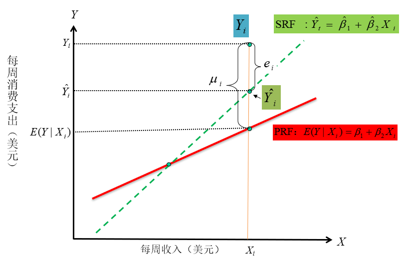
```


$$\begin{alignedat}{2}
&&(Y_i - \bar{Y}) &&= (\hat{Y}_i - \bar{Y}) &&+ (Y_i - \hat{Y}_i ) \\
&&y_i &&= \hat{y}_i &&+ e_i 
\end{alignedat}$$

---

## 方差分解（ANOVA）：平方和分解

$$\begin{alignedat}{2}
&&(Y_i - \bar{Y}) &&= (\hat{Y}_i - \bar{Y}) &&+ (Y_i - \hat{Y}_i ) \\
&&y_i &&= \hat{y}_i &&+ e_i \\
&&\sum{y_i^2} &&= \sum{\hat{y}_i^2} &&+ \sum{e_i^2} \\
&&TSS &&=ESS &&+RSS
\end{alignedat}$$

- 其中：
$TSS$表示**总离差平方和**;
$ESS$表示**回归平方和**;
$RSS$表示**残差差平方和**


---

### （附录）：平方和分解证明过程

$$\begin{align}
\sum{y_i^2} &= \sum{(\hat{y}_i e_i)^2} \\
&= \sum{(\hat{y}_i^2 +2\hat{y}_ie_i +e_i^2)}\\
&= \sum{\hat{y}_i^2 } +2\sum{\hat{y}_ie_i} + \sum{e_i^2}\\
&= \sum{\hat{y}_i^2 } +2\sum{\left( \hat{(\beta_2}x_i)e_i \right)} + \sum{e_i^2}\\
&= \sum{\hat{y}_i^2 } +2\hat{\beta_2}\sum{\left( x_ie_i \right)} + \sum{e_i^2} && \leftarrow \left[ \sum{x_ie_i} =0 \right]\\ 
&= \sum{\hat{y}_i^2} + \sum{e_i^2}
\end{align}$$

---

## 方差分解（ANOVA）：双变量分解表

```{r}
anova_tab <- tribble(
  ~`变异来源`, ~`平方和符号SS`, ~`平方和计算公式`, ~`自由度df`,  ~`均方和符号MSS`, ~`均方和计算公式`, 
  "回归平方和", "ESS","\\(\\sum{(\\hat{Y}_i-\\bar{Y}_i)^2}=\\sum{\\hat{y}_i^2}\\)","1", "\\(MSS_{ESS}\\)", "\\(ESS/df_{ESS}=\\hat{\\beta}_2^2\\sum{x_i^2}\\)",
  "残差平方和", "RSS","\\(\\sum{(Y_i-\\hat{Y}_i)^2}=\\sum{e_i^2}\\)","n-2", "\\(MSS_{RSS}\\)", "\\(RSS/df_{RSS}=\\frac{\\sum{e_i^2}}{n-2}\\)",
  "总平方和", "TSS","\\(\\sum{(Y_i-\\bar{Y}_i)^2}=\\sum{y_i^2}\\)","n-1", "\\(MSS_{TSS}\\)", "\\(TSS/df_{TSS}=\\frac{\\sum{y_i^2}}{n-1}\\)"
)
```

```{r}
kable(anova_tab, align ="c") %>%
 kable_styling(full_width = T, font_size =20)
```


---

## 模型整体显著性检验：F检验

- **步骤1**：给出模型，并提出假设：

一元回归模型下：

$$Y_i = \beta_1 + \beta_2X_i +u_i$$

$$H_0: \beta_2 =0; \quad H_1: \beta_2 \neq 0$$

多元回归模型下：

$$Y_i = \beta_1 + \beta_2X_{2i} + \beta_3X_{3i}+ \cdots + \beta_kX_{ki}+ u_i$$

$$H_0: \beta_2 = \beta_3 =\cdots= \beta_k= 0; \quad H_1: \text{not all} \quad \beta_j = 0, \quad j \in 2, 3, \cdots, k$$

---

## 模型整体显著性检验：F检验

- **步骤2**：构造合适的检验统计量

$$\begin {align} 
\chi^2_1 &= \left( \frac{\hat{\beta}_{2}-\beta_{2} }{\sigma_{\hat{\beta_2}}}\right)^2
= \left( \frac{\hat{\beta}_{2}-\beta_{2} }{\sqrt{\sigma^{2}/\sum x_{i}^{2}}}\right)^2=\frac{\left(\hat{\beta}_{2}-\beta_{2}\right)^{2} \sum x_{i}^{2}}{\sigma^{2}} &&\leftarrow \chi^2_1 \sim \chi^2(1)
 \end {align}$$

$$\begin {align} 
\chi^2_{2}&=(n-2) \frac{\hat{\sigma}^{2}}{\sigma^{2}}=\frac{\sum e_{i}^{2}}{\sigma^{2}} && \leftarrow \chi^2_2 \sim \chi^2(n-2)
 \end {align}$$

$$\begin {align} 
F &= \frac{\chi^2_1/1}{\chi^2_2/n-2} 
= \left( \frac{\left(\hat{\beta}_{2}-\beta_{2}\right)^{2} \sum x_{i}^{2}}{\sigma^{2}} \right ) / \left( \frac{\sum e_{i}^{2}}{(n-2)\sigma^{2}} \right) 
=\frac{\left(\hat{\beta}_{2}-\beta_{2}\right)^{2} \sum x_{i}^{2}}{\sum e_{i}^{2} /(n-2)}\\
F & \sim F(1,n-2)
\end {align}$$

---

## 模型整体显著性检验：F检验

- **步骤3**：基于原假设
$H_0$计算出样本统计量。

$$\begin {align} 
F^{\ast} &= \frac{\left(\hat{\beta}_{2}-\beta_{2}\right)^{2} \sum x_{i}^{2}}{\sum e_{i}^{2} /(n-2)} &&\leftarrow H_0: \beta_2=0 \\
& = \frac{\hat{\beta}_{2}^{2} \sum x_{i}^{2}}{\sum e_{i}^{2} /(n-2)}\\
& = \frac{ESS / df_{ESS}}{RSS / df_{RSS}}
=\frac{MSS_{ESS}}{MSS_{RSS}}
=\frac{\hat{\beta}_{2}^{2} \sum x_{i}^{2}}{\hat{\sigma}^{2}}
\end {align}$$


---

## 模型整体显著性检验：F检验

- **步骤4**：给定显著性水平
$\alpha=0.05$下，查出统计量的**理论分布值**。
$F_{1-\alpha}(1,n-2)$

- **步骤5**：得到显著性检验的判断结论。

    - 若
    $F^{\ast} > F_{1-\alpha}(1,n-2)$，则
    模型整体显著性的F检验结果**显著**。换言之，在显著性水平
    $\alpha=0.05$下，应**显著**地拒绝原假设
    $H_0$，接受备择假设
    $H_1$，认为斜率参数
    $\beta_2 \neq 0$。
    
    - 若
    $F^{\ast} < F_{1-\alpha}(1,n-2)$，则
    模型整体显著性的F检验结果**不显著**。换言之，在显著性水平
    $\alpha=0.05$下，不能**显著**地拒绝原假设
    $H_0$，只能暂时接受原假设
    $H_0$，认为斜率参数
    $\beta_2 = 0$。

---

## 模型整体显著性检验：比较

F检验与t检验的**联系**：

- 在一元回归模型中，t检验与F检验的结论总是一致的。

- 对于检验斜率参数
$\beta_2$的显著性，两者可相互替代！在一元回归分析中，若假设
$H_0:\beta_2=0$，则
$F^{\ast} \simeq (t^{\ast})^2$

F检验与t检验的**不同**：

- 检验目的不同。F检验是检验模型的整体显著性；t检验是检验各个回归参数的显著性。

- 假设的提出不同：
    
    - F检验：斜率系数联合假设
    $H_0: \beta_2 =0; \quad H_1: \beta_2 \neq 0$
    
    - t检验：回归系数分别假设
    $H_0: \beta_i =0; \quad H_1: \beta_i \neq 0; \quad i \in 1,2$

- 检验原理的不同：F检验需要构造F统计量；t检验需要构造t统计量

---

### （案例）教育程度与时均工资：计算ANOVA表

```{r}
anova_value <- tribble(
  ~`变异来源`, ~`平方和SS`,  ~`自由度df`,  ~`均方和MSS`, 
  "回归平方和ESS", ESS, 1,  ESS/f_ESS, 
  "残差平方和RSS", RSS, n-2, RSS/f_RSS,
  "总平方和TSS", TSS, n-1, TSS/n-1
)

kable(anova_value, align= "c",digits=3,caption = "教育程度与时均工资案例的ANOVA分析表")
```

---

### （案例）教育程度与时均工资：F检验

- **步骤1**：给出模型
$Y_i = \beta_1 + \beta_2X_i +u_i$，提出假设：
$H_0: \beta_2 =0; \quad H_1: \beta_2 \neq 0$

- **步骤2**：构造合适检验的分布：

$$\begin {align} 
F &= \frac{\left(\hat{\beta}_{2}-\beta_{2}\right)^{2} \sum x_{i}^{2}}{\sum e_{i}^{2} /(n-2)} 
&& \leftarrow F \sim F(1,n-2)
\end {align}$$

- **步骤3**：基于原假设
$H_0: \beta_2=0$，可以计算出样本统计量。

```{r, results="asis"}
cat(
"$$\\begin {align}",
"F^{\\ast} = \\frac{\\hat{\\beta}_{2}^{2} \\sum x_{i}^{2}}{\\sum e_{i}^{2} /(n-2)}",
"= \\frac{ESS / df_{ESS}}{RSS / df_{RSS}}",
"=\\frac{MSS_{ESS}}{MSS_{RSS}}",
str_c("=\\frac{", round(ESS/f_ESS, 4),"}{",round(RSS/f_RSS, 4), "}=", round(f_test,4)),
"\\end {align}$$",
  sep="\n"
)
```

- **步骤4**：给定
$\alpha=0.05$下，查出F**理论值**
$F_{1-\alpha}(1,n-2)=F_{0.95}(1,11)=$ `r formatC(f_0.95, 4, format="f")`

- **步骤5**：得到显著性检验的判断结论。因为
$F^{\ast}=$ `r formatC(f_test,4, format="f")` .red[**大于**] $F_{0.95}(1,11)=$ `r formatC(f_0.95, 4, format="f")`，所以模型整体显著性的F检验结果**显著**。换言之，在显著性水平
$\alpha=0.05$下，应**显著**地拒绝原假设
$H_0$，接受备择假设
$H_1$，认为斜率参数
$\beta_2 \neq 0$。

---
layout: false
class: center, middle, duke-softblue,hide_logo
name: goodness

# 5.5 拟合优度与残存分析

### 拟合优度

### 残存分析

---
layout: true

<div class="my-header-h2"></div>

<div class="watermark1"></div>

<div class="watermark2"></div>

<div class="watermark3"></div>

<div class="my-footer"><span>huhuaping@  &emsp;&emsp; <a href="#chapter"> 第05章 相关和回归分析 </a>
&emsp;&emsp;&emsp;&emsp;&emsp;&emsp;&emsp;&emsp;&emsp;&emsp;&emsp;&emsp;&emsp;&emsp;&emsp;&emsp;&emsp;&emsp;&emsp;&emsp;&emsp;
<a href="#goodness"> 5.5 拟合优度与残存分析 </a> </span></div> 

---

## 拟合优度：引子

怎么来判定OLS方法对特定样本数据拟合的好坏？

请大家思考如下几个**问题**：

- 样本数据不完全落在拟合的直线（或曲线）上，是经常发生的么？

- 怎么来表达或测量这种对样本数据拟合的不完全性？

- 在OLS方法和CLRM假设“双剑合璧”下，对特定样本数据的拟合不是已经证明最好的么（BLUE）？为什么还要说“拟合”有“好坏之分”？


---

## 拟合优度：测量指标


**拟合优度**（Goodness of fit）：判断样本回归线对一组数据拟合优劣水平的度量。

**判定系数**（coefficient of determination）：一种利用平方和分解，考察样本回归线对数据拟合效果的总度量。一元回归中，一般记为
$r^2$；多元回归中，一般记为
$R^2$。

```{r, fig.cap="维恩图看拟合优度"}
include_graphics("../pic/extra/chpt3-fitness-venn.png", dpi =100)
```

---

## 拟合优度：测量指标

```{r, fig.cap="平方和分解看拟合优度"}
include_graphics("../pic/extra/chpt2-1-PRL-SRL.png", dpi=120)
```

---

## 拟合优度：判定系数

判定系数
$r^2$计算公式1：

$$\begin{align}
r^2 &=\frac{ESS}{TSS} = \frac{\sum{(\hat{Y}_i - \bar{Y})^2}}{\sum{(Y_i - \bar{Y})^2}} 
\end{align}$$

判定系数
$r^2$计算公式2：

$$\begin{align}
r^2 &=1- \frac{RSS}{TSS} = 1- \frac{\sum{e_i^2}}{\sum{(Y_i - \bar{Y})^2}} \\
\end{align}$$

---

## 拟合优度：判定系数

判定系数
$r^2$计算公式3：

$$\begin{align}
r^2 &=\frac{ESS}{TSS} 
= \frac{\sum{\hat{y}_i^2}}{\sum{y_i^2}} 
= \frac{\sum{(\hat{\beta}_2x_i)^2}}{\sum{y_i^2}} 
= \hat{\beta}_2^2\frac{\sum{x_i^2}}{\sum{y_i^2}} 
= \hat{\beta}_2^2 \frac{S_{X_i}^2}{S_{Y_i}^2}
\end{align}$$

判定系数
$r^2$计算公式4：

$$\begin{align}
r^2 &= \hat{\beta}_2^2 \cdot \frac{\sum{x_i^2}}{\sum{y_i^2}} 
= \left( \frac{\sum{x_iy_i}}{\sum{x_i^2}} \right)^2 \cdot \left( \frac{\sum{x_i^2}}{\sum{y_i^2}} \right)
= \frac{(\sum{x_iy_i})^2}{\sum{x_i^2 }\sum{y_i^2}}
\end{align}$$

课堂讨论：

- 讨论1： 
$r^2$是一个非负量。为什么？

- 讨论2：
$0 \leq r^2 \leq 1$，两个端值分别意味什么？

---

## 拟合优度：判定系数VS简单相关系数

判定系数与简单相关系数有什么区别与联系？

**总体相关系数**：是变量
$X_i$与变量
$Y_i$总体相关关系的参数，一般记为
$\rho$。

$$\begin{align}
\rho &=\frac{Cov(X,Y)}{\sqrt{Var(X_i)Var(Y_i)}}
=\frac{E(X_i-EX)(Y_i-EY)}{\sqrt{E(X_i-EX)^2E(Y_i-EY)^2}}
\end{align}$$

**样本相关系数**：是从总体中抽取随机样本，获得变量
$X_i$与变量
$Y_i$样本相关关系的统计量度量，一般记为
$r$。

$$\begin{align}
r &=\frac{S_{XY}^2}{S_X\ast S_Y}
=\frac{\sum{(X_i-\bar{X})(Y_i-\bar{Y})}}{\sqrt{\sum{(X_i-\bar{X}})^2\sum{(Y_i-\bar{Y})^2}}}
= \frac{\sum{x_iy_i}}{\sqrt{\sum{x_i^2 }\sum{y_i^2}}}
\end{align}$$

---

## 拟合优度：判定系数VS简单相关系数

判定系数和简单相关系数的联系:

- 在一元回归中，判定系数
$r^2$等于样本相关系数
$r$的平方。

判定系数和简单相关系数的区别：

- 判定系数
$r^2$表明因变量变异由解释变量所解释的比例，而相关系数
$r$只能表明变量间的线性关联强度。

- 在多元回归中，这种区别会更加凸显！因为那时的相关系数r出现了偏相关的情形(交互关联)！

---

### （案例）计算相关系数和判定系数

对于“教育程度与时均工资案例”，根据FF-ff计算表和方差分解ANOVA表，可以分别计算得到样本相关系数和模型判定系数。

样本相关系数
$r$：

```{r, results="asis"}
cat(
  "$$\\begin{align}",
  str_c("r =\\frac{S_{XY}^2}{S_X\\ast S_Y}=","\\frac{",round(cov_XY,4),"}{",round(S_X,4),"\\ast",round(S_Y,4),"} =",round(r,4),"\\\\"),
  "\\end{align}$$",
  sep = "\n"
)
```

回归方程的判定系数
$r^2$：

```{r, results="asis"}
cat(
  "$$\\begin{align}",
  str_c("r^2 &= 1- \\frac{RSS}{TSS}=",1,"-\\frac{",round(RSS,4),"}{",round(TSS,4),"} =",round(r2,4),"\\\\"),
  "\\end{align}$$",
  sep = "\n"
)
```

二者关系

---

## 拟合优度：小结与思考

**内容小结**：

- 即使采用OLS方法，它对样本数据的拟合也是不完全的。意味着实际数据点在样本回归线附近，而不是在样本回归线上。我们可以把样本点行为的“变异”，划分为“回归”能解释的部分和“随机”的部分。并进一步获得变异平方和的分解。

- 判定系数
$R^2$是对OLS拟合程度的测量，它使用了变异平方和分解的思想。在一元线性回归（含截距）中，判定系数与相关系数存在如下关系
$R^2 = r^2_{(X_i,Y_i)}$。注意，在多元回归中则不存在这种关系。

**问题思考**：

- OLS方法的参数估计量，在CLRM假设满足情况下，就是最优线性无偏估计量（BLUE），为什么还要用**判定系数**来判断“拟合好还是不好？”。对此，你的回答是什么？

- 还有没有其他指标，来反映估计方法对样本数据的拟合好坏程度？请说出一两个。

???
参考答案：还可以有**均方误差和**（MSE）
$MSE=RSS/n= 1/n\sum{(Y_i - \hat{Y}_i})^2$，以及**均方误差根**（RMSE）等。

---

## 残差分析：定义和作用

**残差**(residual)：是因变量的观测值与根据估计的回归方程求出的估计值之差，用
$e_i$表示。

$$e_i = Y_i - \hat{Y_i}$$

对模型的残差进行分析，主要目的包括：

- 反映用估计的回归方程去预测而引起的误差。

- 可用于确定有关随机干扰项
$\mu_i$的假定是否成立。

- 用于检测有影响的观测值。

---

## 残差分析：皮尔逊标准化残差

**标准化残差**(standardized residual)：是对残差进行某种标准化变换。具体计算方法有**皮尔逊标准化残差**和**学生化标准残差**两种。

最常用的皮尔逊标准化残差（Pearson residual/.red[internally studentized residuals]）的计算公式如下：

$$\begin{align}
e_{i, sd}^{\ast}= \frac{e_i}{s_{e_i}} 
= \frac{(Y_i - \hat{Y_i})}{\sqrt{\frac{\sum{(e_i-\bar{e})^2}}{n-1}}}
\end{align}$$

---

## 残差分析：皮尔逊标准化残差

**学生化标准残差**（Studentized Residuals/.red[externally studentized residual]/deleted Studentized residual/semi-studentized residuals/jackknifed residuals），是对残差的另一种特殊标准化变换（例如考虑到了X的影响力）。

**学生化标准残差**的计算公式有两个<sup>*</sup>：

$$\begin{align}
e_{i,st}^{\ast} &= \frac{e_i}{\sqrt{MSE_{(i)}(1-h_{ii})}} \\
e_{i,st}^{\ast}& = e_{i, sd}^{\ast}\left( \frac{n-m-2}{n-m-1-e_{i, sd}^{\ast 2}}\right)^2
\end{align}$$

> 其中：
$MSE_{(i)}$是指删除第
$i$个观测值进行建模的**均方误差**（MSE）；
$h_{ii}$指删除第
$i$个观测值进行建模的第
$i$个**影响权重**（leverage）。
$m=k-1$为回归元个数。

.footnote[
说明：
1）学生化残差的第一个计算公式计算起来比较麻烦和复杂。需要分别进行(n-1)次线性回归，然后依次计算相关
$MSE_{(i)}$和
$h_ii$。2）学生化残差的第二个计算公式相对简单，只需要利用原来的回归模型及其标准化残差
$e_{i, sd}^{\ast}$。

]

???

理论参看：

- [Studentized Residuals](https://online.stat.psu.edu/stat462/node/247/)

- [Using Leverages to Help Identify Extreme X Values](https://online.stat.psu.edu/stat462/node/171/)

操作参看：
- [Is studentized residuals v/s standardized residuals in lm model](https://stats.stackexchange.com/questions/204708/is-studentized-residuals-v-s-standardized-residuals-in-lm-model)

---

## 残差分析：残差图

**残差图**(residual plot)：用于呈现残差数据
$e_i$的分布情况的统计图图形，主要包括：


- 关于
$X_i$的残差散点图。

- 关于
$Y_i$的残差散点图（或者关于
$\hat{Y_i}$）。

- 关于样本序号的残差散点图或标准化残差散点图。

---

### （示例）残差图的模拟演示


```{r, out.width= "75%"}
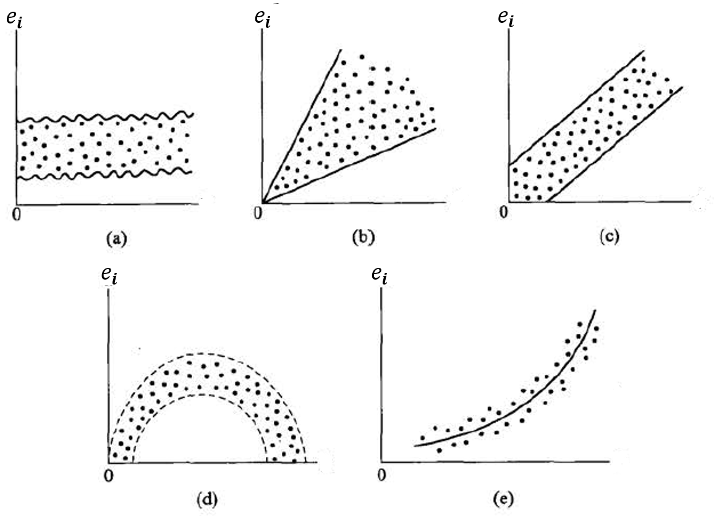
```

???
残差序列
$e_i$（或者标准化残差序列
$e_i^{\ast}$）与相关变量（包括
$X_i; Y_i;\hat{Y_i}$以及样本序号）之间**散点图**的若干假想分布模式。

---

### （案例）皮尔逊标准化残差

.pull-left[

```{r, eval=T}
show_tbl %>%
  select(c(1:3,12:14)) %>%
  mutate_at(vars(contains("e_")), funs(formatC(., digits = 4, format = "f"))) %>%
  kable( ) %>%  
  kable_styling(font_size=20)
```


]

.pull-right[

- 根据样本回归方程，可以计算得到
$Y_i$的回归拟合值
$\hat{Y}_i$，以及回归残差
$e_i$。

$$\begin{align}
\hat{Y}_i &=\hat{\beta}_1 +\hat{\beta}_2X_i\\
e_i &= Y_i - \hat{Y}_i
\end{align}$$

- 进一步地计算得到**皮尔逊标准化残差**
$e_{i, sd}^{\ast}$：

$$\begin{align}
e_{i, sd}^{\ast}= \frac{e_i}{s_{e_i}} 
= \frac{(Y_i - \hat{Y_i})}{\sqrt{\frac{\sum{(e_i-\bar{e})^2}}{n-1}}}
\end{align}$$

]


---

### （案例）学生化标准残差

.pull-left[

```{r, eval=T}
show_tbl %>%
  select(c(1:3,12:15)) %>%
  mutate_at(vars(contains("e_")), funs(formatC(., digits = 4, format = "f"))) %>%
  kable() %>%  
  kable_styling(font_size=20)

```


]

.pull-right[

- 根据样本回归方程，可以计算得到
$Y_i$的回归拟合值
$\hat{Y}_i$，以及回归残差
$e_i$，以及前述的**皮尔逊标准化残差**
$e_{i, sd}^{\ast}$。

- 进而可以使用如下公式计算得到**学生化标准残差**
$e_{i,st}^{\ast}$：

$$\begin{align}
e_{i,st}^{\ast}& = e_{i, sd}^{\ast}\left( \frac{n-k-2}{n-k-1-e_{i, sd}^{\ast 2}}\right)^2
\end{align}$$

]

---

### （案例）皮尔逊标准化残差散点图

```{r}
resid_tbl <- calc_tbl %>%
  select(all_of(c("obs", "X", "Y")), all_of(contains("e_i")))

resid_tbl %>%
  ggplot(aes(X, e_i)) +
  geom_point() +
  #labs(x = ) +
  theme(text = element_text(size=18),
        axis.title.x = element_text(size = 16,
                                margin = margin(t = 15, r = 0, 
                                                b = 0, l = 0)),
        axis.title.y = element_text(size = 16,
                                margin = margin(t = 0, r = 15, 
                                                b = 0, l = 0)))
```


---
layout: false
class: center, middle, duke-softblue,hide_logo
name: forecast

# 5.6 回归预测分析

### 均值预测

### 个值预测

### 置信带

---
layout: true

<div class="my-header-h2"></div>

<div class="watermark1"></div>

<div class="watermark2"></div>

<div class="watermark3"></div>

<div class="my-footer"><span>huhuaping@  &emsp;&emsp; <a href="#chapter"> 第05章 相关和回归分析 </a>
&emsp;&emsp;&emsp;&emsp;&emsp;&emsp;&emsp;&emsp;&emsp;&emsp;&emsp;&emsp;&emsp;&emsp;&emsp;&emsp;&emsp;&emsp;&emsp;&emsp;&emsp;
<a href="#forecast"> 5.6 回归预测分析 </a> </span></div> 

---

## 回归预测：引子

预测未来事件的一些惯常说法

- 算命术士：

    - “客官印堂发黑，明日必有凶象!”

- 天气预报播报词：

    - 预测西安明天是小雨，概率为95%。
    
    - 预测西安明天是小雨转阴，概率为95%。
    
    - 预测西安明天是天晴或阴天或雨天，概率为100%！

- 简要解析：
    
    - 人们在预测什么事件？
    
    - 预测多少个事件？它们发生的关系？
    
    - 预测如何令人信服？

---

## 回归预测：两类预测

一元回归模型下：

$$Y_i = \beta_1 + \beta_2X_i +u_i$$

预测什么？

**均值预测**(mean prediction)：

- 给定
$X_0$，预测Y的条件均值
$E(Y|X=X_0)$


**个值预测**(individual prediction)：

- 给定
$X_0$，预测对应于
$X0$的Y的个别值
$(Y_0|X_0)$

---

### （示例）样本内预测

```{r}
dpi_pred <-  220
include_graphics("../pic/extra/chpt4-forecast-demo-01-insample.png", dpi= dpi_pred)
```

---

### （示例）样本外预测

```{r}
include_graphics("../pic/extra/chpt4-forecast-demo-02-outsample.png" , dpi= dpi_pred)
```


---

### （示例）均值预测

```{r}
include_graphics("../pic/extra/chpt4-forecast-demo-03-exp.png", dpi= dpi_pred)
```

---

### （示例）个值预测

```{r}
include_graphics("../pic/extra/chpt4-forecast-demo-04-ind.png", dpi= dpi_pred)
```

---

## 回归预测：预测分析的关键

拿什么来预测？——样本数据？样本回归线？样本拟合值？

样本外拟合值
$\hat{Y}_0|X=X_0$：

- 可以证明：样本外拟合值
  $\hat{Y}_0|X=X_0$是**均值**
  $E(Y|X=X_0)$的一个.blue[**BLUE**]

- 也可以证明：样本外拟合值
  $\hat{Y}_0|X=X_0$是**个值**
  $(Y_0|X=X_0)$的一个.blue[**BLUE**]

工资案例中，给定
$X_0=$ `r X_0`，则可以得到样本外拟合值：

```{r, results="asis"}
cat(
  "\\begin{align}",
  "\\hat{Y}_{0}=\\hat{\\beta}_{1}+\\hat{\\beta}_{2} X_{0}",
  str_c("=",round(b1,4),"+",round(b2,4),"\\ast",X_0),
  str_c("=",round(Y_0_hat, 4)),
  "\\end{align}",
  sep="\n"
  )
```


---

## 回归预测：预测分析的关键

```{r}
include_graphics("../pic/extra/chpt4-forecast-demo-05-fitted.png", dpi= dpi_pred)
```

---

## 均值预测

在**N-CLRM**假设和**OLS**方法下，可以证明（证明过程略）给定
$X_0$下的拟合值
$\hat{Y}_0$服从如下正态分布：

$$\begin {align} 
\hat{Y}_{0} \sim \mathrm{N}\left(\mu_{\hat{Y}_{0}}, \sigma_{\hat{Y}_{0}}^{2}\right)
\end {align}$$

$$\begin {align} 
\mu_{\hat{Y}_{0}}=E\left(\hat{Y}_{0}\right)=E\left(\hat{\beta}_{1}+\hat{\beta}_{2} X_{0}\right)=\beta_{1}+\beta_{2} X_{0}=E(Y | X_{0})
\end {align}$$

$$\begin {align} 
\operatorname{var}\left(\hat{Y}_{0}\right)=\sigma_{\hat{Y}_{0}}^{2}=\sigma^{2}\left[\frac{1}{n}+\frac{\left(X_{0}-\overline{X}\right)^{2}}{\sum x_{i}^{2}}\right]
 \end {align}$$

$$\begin {align} 
\hat{Y}_{0} \sim N\left(E(Y | X_{0}), \sigma^{2}\left[\frac{1}{n}+\frac{\left(X_{0}-\overline{X}\right)^{2}}{\sum x_{i}^{2}}\right]\right)
\end {align}$$

---

## 均值预测

对
$\hat{Y}_{0}$构造**t统计量**：

$$\begin {align} 
T &=\frac{\hat{Y}_{0}-\mathrm{E}(\mathrm{Y} | \mathrm{X}_{0})}{S_{\hat{Y}_{0}}} \sim t(n-2)
&& \Leftarrow S_{\hat{Y}_{0}}=\sqrt{\hat{\sigma}^{2}\left[\frac{1}{n}+\frac{\left(X_{0}-\overline{X}\right)^{2}}{\sum x_{i}^{2}}\right]}
\end {align}$$

得到**均值**
$E(Y|X=X_0)$置信区间为：

$$\begin {align} 
\operatorname{Pr}\left[\hat{Y}_{0}-t_{1-\alpha / 2}(n-2) \cdot S_{\hat{Y}_{0}} \leq E(Y | X_{0}) \leq \hat{Y}_{0}+t_{1-\alpha / 2}(n-2) \cdot S_{\hat{Y}_{0}}\right]=1-\alpha
\end {align}$$
 
$$\begin {align} 
\operatorname{Pr}\left[\hat{\beta}+\hat{\beta}_{2} X_{0}-t_{1-\alpha / 2}(n-2) \cdot S_{\hat{Y}_{0}} \leq E(Y | X_{0}) \leq \hat{\beta}+\hat{\beta}_{2} X_{0}+t_{1- \alpha / 2}(n-2) \cdot S_{\hat{Y}_{0}}\right]=1-\alpha
\end {align}$$

---

### （案例）教育程度和时均工资：均值预测

给定
$X_0=$ `r X_0`时，根据早前计算结果：
$\hat{\sigma}^2=$ `r formatC(dev, 4, format="f")`；
$\bar{X}=$ `r formatC(mean_X, 4, format="f")`；
$\sum{x_i^2}=$ `r formatC(FF_ff$ff_x_sqr, 4, format="f")`。因此可以得到：

```{r, results="asis"}
cat(
  "\\begin{align}",
  "S^2_{\\hat{Y}_{0}} &=\\hat{\\sigma}^{2}\\left[\\frac{1}{n}+\\frac{\\left(X_{0}-\\overline{X}\\right)^{2}}{\\sum x_{i}^{2}}\\right] ",
  str_c("=",round(dev,4), "\\left( \\frac{1}{",n,"}+","\\frac{(",round(X_0,4),"-",round(mean_X,4),")^2}{",round(FF_ff$ff_x_sqr,4), "}", "\\right)"),
  str_c("=",round(S2_Y0h,4), "; \\quad"),
  str_c("S_{\\hat{Y}_{0}} = \\sqrt{S^2_{\\hat{Y}_{0}}}=",
        round(sqrt(S2_Y0h),4)
        ),
  "\\end{align}",
  sep="\n"
)
```


```{r, results="asis"}
cat(
  "\\begin{align}",
  "\\hat{Y}_{0}=\\hat{\\beta}_{1}+\\hat{\\beta}_{2} X_{0}",
  str_c("=",round(b1,4),"+",round(b2,4),"\\ast",X_0),
  str_c("=",round(Y_0_hat, 4)),
  "\\end{align}",
  sep="\n"
  )
```

因此，可以计算得到**均值**
$E(Y|X=20)$置信区间为：

```{r, results="asis"}
cat(
  "\\begin{align}",
  "\\hat{\\beta}+\\hat{\\beta}_{2} X_{0}-t_{1-\\alpha / 2}(n-2) \\cdot S_{\\hat{Y}_{0}} \\leq  & E(Y | X_{0}) \\leq \\hat{\\beta}+\\hat{\\beta}_{2} X_{0}+t_{1- \\alpha / 2}(n-2) \\cdot S_{\\hat{Y}_{0}} \\\\",
  str_c(round(Y_0_hat,4),"-",round(t_0.95, 4),"\\ast",round(sqrt(S2_Y0h),4), 
        "\\leq & E(Y|X_0=",X_0,")\\leq", 
        round(Y_0_hat,4),"+",round(t_0.95, 4),"\\ast",round(sqrt(S2_Y0h),4)
        ),"\\\\",
  str_c(round(Y_exp_lft,4), 
        "\\leq & E(Y|X_0=",X_0,")\\leq", 
        round(Y_exp_rht,4)
        ),
  "\\end{align}",
  sep="\n"
)
```

---

### （案例）教育程度和时均工资：均值预测

```{r}
include_graphics("../pic/extra/chpt4-forecast-demo-06-interval-exp.png", dpi= dpi_pred)
```

---

## 个值预测

在**N-CLRM**假设和**OLS**方法下，可以证明（证明过程略）给定
$X_0$下的个别值
$Y_0=\beta_1+\beta_2X_0 +u_0$服从如下正态分布：

$$\begin {align} 
Y_{0} &\sim \mathrm{N}\left(\mu_{Y_{0}}, \sigma_{Y_{0}}^{2}\right) \\
\mu_{Y_{0}}&=E\left(Y_{0}\right)=E\left(\beta_{1}+\beta_{2} X_{0}\right)=\beta_{1}+\beta_{2} X_{0} \\
Var(Y_{0}) &=Var{(u_0)}=\sigma^{2}
\end {align}$$


$$\begin {align} 
Y_{0} \sim N\left(\beta_{1}+\beta_{2} X_{0}, \sigma^{2} \right)
\end {align}$$

---

## 个值预测

进一步可以构造新的随机变量
$(Y_0-\hat{Y}_0)$，其将服从如下正态分布：

$$\begin {align} 
Y_{0} & \sim N\left(\beta_{1}+\beta_{2} X_{0}, \sigma^{2} \right)\\
\hat{Y}_{0} & \sim N\left( \beta_{1}+\beta_{2} X_{0}, \sigma^{2}\left[\frac{1}{n}+\frac{\left(X_{0}-\overline{X}\right)^{2}}{\sum x_{i}^{2}}\right]\right) 
\end {align}$$

$$\begin {align} 
Y_{0} - \hat{Y}_{0} & \sim N\left( 0, \sigma^{2}\left[1 + \frac{1}{n}+\frac{\left(X_{0}-\overline{X}\right)^{2}}{\sum x_{i}^{2}}\right]\right) \\
Y_{0} - \hat{Y}_{0} & \sim N\left( 0, \sigma^{2}_{Y_{0} - \hat{Y}_{0}} \right)
\end {align}$$


---

## 个值预测

对
$Y_{0} - \hat{Y}_{0}$构造**t统计量**：

$$\begin {align} 
T &=\frac{(Y_{0} - \hat{Y}_{0})}{S_{(Y_{0} - \hat{Y}_{0})}} \sim t(n-2)
&& \Leftarrow S_{(Y_{0} - \hat{Y}_{0})}
=\sqrt{\hat{\sigma}^{2}\left[1+\frac{1}{n}+\frac{\left(X_{0}-\overline{X}\right)^{2}}{\sum x_{i}^{2}}\right]}
\end {align}$$

得到**个值**
$Y_{0}$置信区间为：

$$\begin {align} 
\operatorname{Pr}\left[\hat{Y}_{0}-t_{1-\alpha / 2}(n-2) \cdot S_{(Y_{0} - \hat{Y}_{0})} \leq Y_{0} \leq \hat{Y}_{0}+t_{1-\alpha / 2}(n-2) \cdot S_{(Y_{0} - \hat{Y}_{0})}\right]=1-\alpha
\end {align}$$
 
$$\begin {align} 
\operatorname{Pr}\left[\hat{\beta}+\hat{\beta}_{2} X_{0}-t_{1-\alpha / 2}(n-2) \cdot S_{(Y_{0} - \hat{Y}_{0})} 
\leq Y_{0} \leq 
\hat{\beta}+\hat{\beta}_{2} X_{0}+t_{1- \alpha / 2}(n-2) \cdot S_{(Y_{0} - \hat{Y}_{0})}\right]=1-\alpha
\end {align}$$


---

### （案例）教育程度和时均工资：个值预测

给定
$X_0=$ `r X_0`时，根据早前计算结果：
$\hat{\sigma}^2=$ `r formatC(dev, 4, format="f")`；
$\bar{X}=$ `r formatC(mean_X, 4, format="f")`；
$\sum{x_i^2}=$ `r formatC(FF_ff$ff_x_sqr, 4, format="f")`。因此可以得到：

```{r, results="asis"}
cat(
  "\\begin{align}",
  "S^2_{(Y_{0} - \\hat{Y}_{0})} &=\\hat{\\sigma}^{2}\\left[1+\\frac{1}{n}+\\frac{\\left(X_{0}-\\overline{X}\\right)^{2}}{\\sum x_{i}^{2}}\\right] ",
  str_c("=",round(dev,4), "\\left( 1+ \\frac{1}{",n,"}+","\\frac{(",round(X_0,4),"-",round(mean_X,4),")^2}{",round(FF_ff$ff_x_sqr,4), "}", "\\right)"),
  str_c("=",round(S2_Y0h_mns,4)),"\\\\",
  str_c("S_{\\hat{Y}_{0}} &= \\sqrt{S^2_{\\hat{Y}_{0}}}=",
        round(sqrt(S2_Y0h_mns),4)
        ),
  "\\end{align}",
  sep="\n"
)
```


```{r, results="asis"}
cat(
  "\\begin{align}",
  "\\hat{Y}_{0}=\\hat{\\beta}_{1}+\\hat{\\beta}_{2} X_{0}",
  str_c("=",round(b1,4),"+",round(b2,4),"\\ast",X_0),
  str_c("=",round(Y_0_hat, 4)),
  "\\end{align}",
  sep="\n"
  )
```

因此，可以计算得到**个值**
$(Y_0|X=20)$置信区间为：

```{r, results="asis"}
cat(
  "\\begin{align}",
  "\\hat{\\beta}+\\hat{\\beta}_{2} X_{0}-t_{1-\\alpha / 2}(n-2) \\cdot S_{(Y_{0} - \\hat{Y}_{0})} \\leq  & Y_0 | X=X_0) \\leq \\hat{\\beta}+\\hat{\\beta}_{2} X_{0}+t_{1- \\alpha / 2}(n-2) \\cdot S_{(Y_{0} - \\hat{Y}_{0})} \\\\",
  str_c(round(Y_0_hat,4),"-",round(t_0.95, 4),"\\ast",round(sqrt(S2_Y0h_mns),4), 
        "\\leq & Y_0|X_0=",X_0,")\\leq", 
        round(Y_0_hat,4),"+",round(t_0.95, 4),"\\ast",round(sqrt(S2_Y0h_mns),4)
        ),"\\\\",
  str_c(round(Y_ind_lft,4), 
        "\\leq & Y_0|X_0=",X_0,")\\leq", 
        round(Y_ind_rht,4)
        ),
  "\\end{align}",
  sep="\n"
)
```

---

### （案例）教育程度和时均工资：个值预测

```{r}
include_graphics("../pic/extra/chpt4-forecast-demo-09-interval-ind.png", dpi= dpi_pred)
```

---

## 置信带

**置信带**(confidence interval)：对所有的X值，分别进行**均值**和**个值**分别进行预测，就能得到：

- 均值预测的置信带——总体回归函数的置信带

- 个值预测的置信带

- 预测如何可信？
    
    - 均值预测置信区间
    
    - 均值预测置信带

- 样本内置信带。——检验可靠性

- 样本外置信带。——预测未来值范围


---

## 置信带

```{r}
include_graphics("../pic/extra/chpt4-forecast-demo-08-band-exp.png", dpi= dpi_pred)
```

---

## 置信带

```{r}
include_graphics("../pic/extra/chpt4-forecast-demo-10-band-ind.png", dpi= dpi_pred)
```

---

## 置信带

如何理解置信带？

- 谁更宽？——均值预测更准确

- 何处最窄？—— 中心点
$(\bar{X}, \bar{Y})=$ `r str_c("(",mean_X,",", formatC(mean_Y,2,format="f"),")")`是历史信息的集中代表。

---

## 回归预测：总结与思考

**内容总结**：

- 回归预测基于一套坚实严密的“底座”：OLS估计方法、CLRM假设、BLUE估计性质

- 均值预测置信带和个值预测置信带，是对预测可信度的形象表达。

- （同等条件下）均值预测比个值预测更准确（置信带宽窄）


**课堂思考**：

- 同样是95%置信度区间，两个人的认识是一样的么？

**课后作业**：工资与教育案例扩展

- 请计算置信度
$100(1−\alpha)=95\%$下，
$X_0=20$时均值的置信区间。
与
$100(1−\alpha)=90\%$时相比，有什么差异？

- 99%更值得可信么？

---
layout: false
class: center, middle, duke-softblue,hide_logo
name: report

# 5.7 回归报告解读

### 方程表达式

### 表格表达式

### 统计软件

---
layout: true

<div class="my-header-h2"></div>

<div class="watermark1"></div>

<div class="watermark2"></div>

<div class="watermark3"></div>

<div class="my-footer"><span>huhuaping@  &emsp;&emsp; <a href="#chapter"> 第05章 相关和回归分析 </a>
&emsp;&emsp;&emsp;&emsp;&emsp;&emsp;&emsp;&emsp;&emsp;&emsp;&emsp;&emsp;&emsp;&emsp;&emsp;&emsp;&emsp;&emsp;&emsp;&emsp;&emsp;
<a href="#report"> 5.7 回归报告解读 </a> </span></div>

---

## 回归分析的形式

**课程要求**：会熟练、正确阅读统计软件给出的各类分析报告，理解其中的关键信息和内涵。这些分析报告包括：传统的多元回归分析报告；以及各种计量检验的辅助分析报告（如异方差white检验报告）等。

根据统计软件的不同（`stata`；`Eview`；`R`；`Excel` ……），各种分析报告呈现形式略有差异，但基本要素和信息都大抵一致。

给定如下一元回归模型：

$$Y_i = \beta_1 + \beta_2X_i +u_i$$

---

## 回归分析的形式（多行方程表达法）

**形式1：多行方程表达法**（整理好的**精炼报告**）：根据统计软件的原始报告，往往是选取最关键的信息，经过整理并以多行**样本回归方程**（SRF）的形式呈现，**精炼报告**的形式一般为：

```{r, results="asis"}
mod_wage <- "Y~X"
fun_report_eq(lm.mod = mod_wage, lm.dt = data_wage,
              lm.n = 3)
```

--

- 第1行表示样本回归函数（回归系数）

- 第2行(t)表示回归系数对应的**样本t统计量**（
$t^{\ast}_{\hat{\beta}_i},i \in 1,2,\cdots, k$）

- 第3行(se)表示回归系数对应的**样本标准误差**（
$S_{\hat{\beta}_i},i \in 1,2,\cdots, k$）

- 第4行(fitness)表示回归模型**拟合情况**和**统计检验**的简要信息，其中
$R^2$表示**判定系数**，
$\bar{R}^2$表示**调整判定系数**，F表示模型整体显著性检验中的**样本F统计量值**（
$F^{\ast}$）,p表示样本F统计量值对应的概率值。

---

## 回归分析的形式（表格列示法）

**形式2：表格列示法**（整理好的**精炼报告**）：根据统计软件的原始报告，往往是选取最关键的信息，经过整理以表格形式呈现，**表格列示法**的形式呈现为：

```{r demo-kable}
require("broom")
out_lm <- summary(lm(mod_wage,data_wage))
kable(broom::tidy(lm(mod_wage,data_wage)), align= "c")
```

--

- **第1列**：`term`表示回归模型中包含的变量，也即
$X_{2i},X_{3i},\cdots,X_{ki}$，其中**截距项**默认为`(Intercept)`。

- **第2列**：`estimate`表示回归系数的估计值，也即
$\hat{\beta}_1,\hat{\beta}_2, \cdots, \hat{\beta}_k$。

- **第3列**：`std.error`表示回归系数对应的**样本标准误差**，也即
$S_{\hat{\beta}_i},i \in 1,2,\cdots, k$。

- **第4列**：`statistic`表示回归系数对应的**样本t统计量**，也即
$t^{\ast}_{\hat{\beta}_i},i \in 1,2,\cdots, k$

- **第5列**：`p.value`表示回归系数**样本t统计量**对应的概率值，也即
$Pr(t = t^{\ast}_{\hat{\beta}_i})=p$

---

### （示例）Excel软件原始报告：全貌

**形式3：原始报告**：分析软件如`EViews`、`R`、`STATA`、`Excel`等直接自动生成的多元回归分析报告。`Excel`软件原始分析报告形式如下：

```{r}
include_graphics("../pic/chpt05-reg-excel-report-view.png")
```

---

### （示例）Excel软件原始报告：参数估计

```{r}
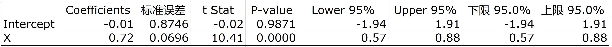
```

---

### （示例）Excel软件原始报告：拟合优度

```{r}
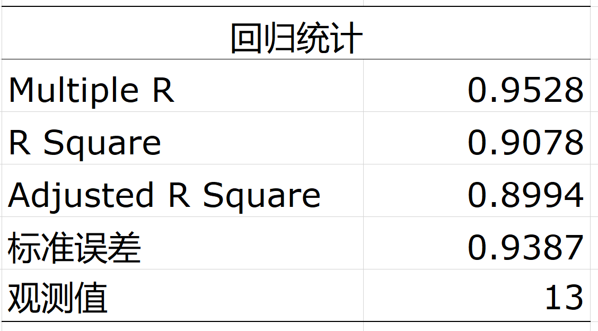
```

---

### （示例）Excel软件原始报告：方差分解

```{r}
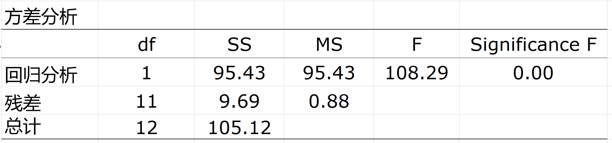
```

---

### （示例）Excel软件原始报告：残差表

```{r}
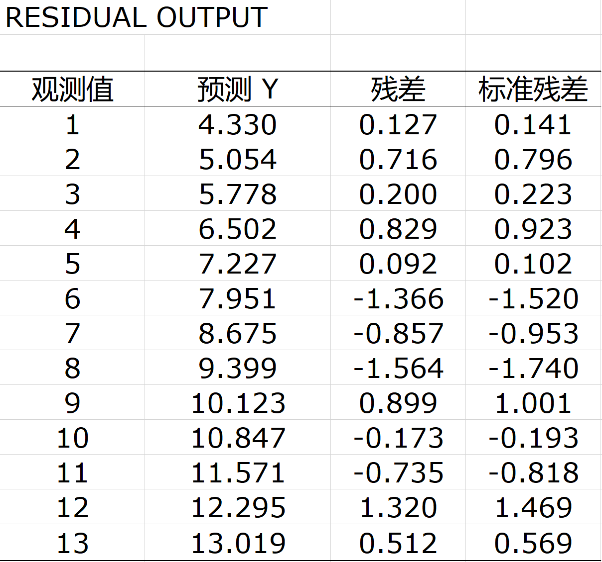
```

---

### （示例）Excel软件原始报告：残差图

```{r}
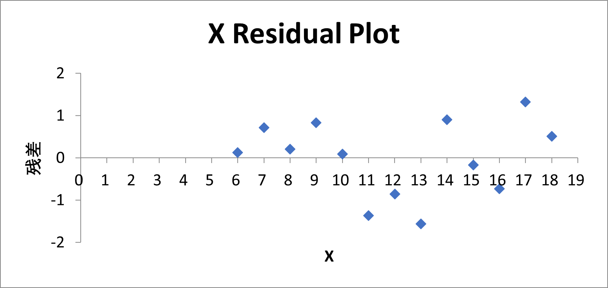
```


---

### 回归分析的形式（EViews软件原始报告）

**形式3：原始报告**：分析软件如`EViews`、`R`、`STATA`等直接自动生成的多元回归分析报告。`EViews`软件原始分析报告形式如下：**抬头区域**

.pull-left[
```{r}
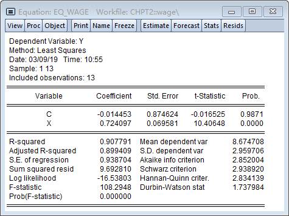
```
]

--

.pull-right[

- `Dependent Variable: Y`：因变量

- `Method: Least Squares`：分析方法

- `Date: 03/09/19  Time: 10:55`：分析的时间

- `Sample: 1 13`：样本范围

- `Included observations: 13`：样本数n

]

---

### 回归分析的形式（EViews软件原始报告）

**形式3：原始报告**：分析软件如`EViews`、`R`、`STATA`等直接自动生成的多元回归分析报告。`EViews`软件原始分析报告形式如下：**三线表区域**

.pull-left[
```{r}

```
]

--

.pull-right[

- **第1列**：`Variable`表示模型包含的变量，
$X_{2i},X_{3i},\cdots,X_{ki}$，其中**截距项**默认为`C`。

- **第2列**：`Coefficient`回归系数，也即
$\hat{\beta}_1,\hat{\beta}_2, \cdots, \hat{\beta}_k$；

- **第3列**：`Std. Error`回归系数的样本标准误差，也即也即
$S_{\hat{\beta}_i},i \in 1,2,\cdots, k$。

- **第4列**：`t-Statistic`表示回归系数对应的**样本t统计量**，也即
$t^{\ast}_{\hat{\beta}_i},i \in 1,2,\cdots, k$；

- **第5列**：`Prob.`表示回归系数**样本t统计量**对应的概率值，也即
$Pr(t = t^{\ast}_{\hat{\beta}_i})=p$

]

---

### 回归分析的形式（EViews软件原始报告）

**形式3：原始报告**：分析软件如`EViews`、`R`、`STATA`等直接自动生成的多元回归分析报告。`EViews`软件原始分析报告形式如下：**指标值区域（左）**

.pull-left[
```{r}

```
]

--

.pull-right[

- `R-squared`：回归模型**判定系数**
$R^2$。

- `Adjusted R-squared`：回归模型**调整判定系数**
$\bar{R}^2$。

- `S.E. of regression`：回归模型的**回归误差标准差**
$\hat{\sigma}$。

- `Sum squared resid`：回归模型的**残差平方和RSS**
$RSS=\sum{e_i^2}$。

- `Log likelihood`：回归模型的**对数似然值**。

- `F-statistic`：回归模型整体显著性的**样本F统计量**
$F^{\ast}$。

- `Prob(F-statistic)`：回归模型整体显著性的样本F统计量对应的**概率值p**。

]

---

### 回归分析的形式（EViews软件原始报告）

**形式3：原始报告**：分析软件如`EViews`、`R`、`STATA`等直接自动生成的多元回归分析报告。`EViews`软件原始分析报告形式如下：**指标值区域（右）**

.pull-left[
```{r}

```
]

--

.pull-right[

- `Mean dependent var`：Y的**均值**
$\bar{Y}$。

- `S.D. dependent var`：Y的**样本标准差**
$S_{Y}$。

- `Akaike info criterion`：回归模型的**AIC信息准则**。

- `Schwarz criterion`：回归模型的**Schwarz准则**。

- `Hannan-Quinn criter.	`：回归模型的**Hannan-Quinn准则**。

- `Durbin-Watson stat`：回归模型的**德宾沃森统计量d**。

]

---

## 回归分析的形式（R软件原始报告）

**形式4：原始报告**：分析软件如`EViews`、`R`、`STATA`等直接自动生成的多元回归分析报告。`R`软件原始分析报告形式如下：

```{r, comment=""}
out_lm

```


---
layout:false
background-image: url("../pic/thank-you-gif-funny-fan.gif")
class: inverse,center
# 本章结束

