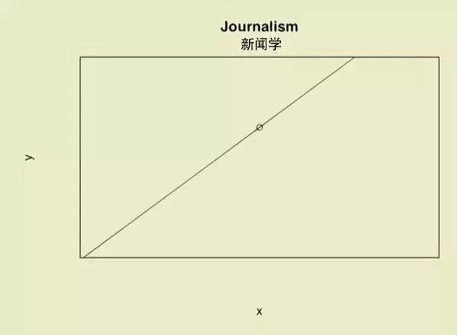
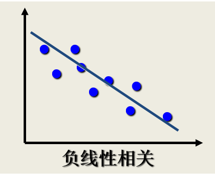

---
output:
  xaringan::moon_reader:
    seal: false
    lib_dir: libs
    css:
      - default
      - ../mycss/my-theme.css 
      - ../mycss/my-font.css
      - ../mycss/my-custom-for-video-roomy.css
      - ../mycss/text-box.css
      - duke-blue
      - hygge-duke
    nature:
      highlightStyle: github
      highlightLines: true
      countIncrementalSlides: false
      ratio: "16:9"
---
background-image: url("../pic/slide-front-page.jpg")
class: center,middle

# 统计学原理(Statistic)

<!---    chakra: libs/remark-latest.min.js --->

### 胡华平

### 西北农林科技大学

### 经济管理学院数量经济教研室

### huhuaping01@hotmail.com

### `r Sys.Date()`

```{r global_options, echo=F,message=FALSE,warning=F}
source("../R/set-global.R")
source("../R/external-math-equation.R")
options(width = 70)
#source("../R/xaringan-chromote-print.R")
```


```{r ex-math-eq}
source("../R/external-math-equation.R")
```


```{r xaringan-logo, echo=FALSE}
require('xaringanExtra')

xaringanExtra::use_tachyons()

xaringanExtra::use_panelset()

xaringanExtra::use_logo(
  image_url = "../pic/logo/nwafu-logo-circle-wb.png",
  height = '70px',
  position = xaringanExtra::css_position(top='0.2em',left="1em")
)
```

---
class: center, middle, duke-orange,hide_logo
name:chapter

# 第五章 相关和回归分析


### [5.1 变量间关系的度量](#measure)

### [5.2 一元线性回归](#regression)

### [5.3 估计和预测](#estimation)

### [5.4 残差分析](#residual)


---
layout: false
class: center, middle, duke-softblue,hide_logo
name: absolute

# 5.1 变量间关系的度量

### 变量间的关系

### 相关关系的描述与测度

### 相关系数的显著性检验

---
layout: true

<div class="my-header-h2"></div>

<div class="watermark1"></div>

<div class="watermark2"></div>

<div class="watermark3"></div>

<div class="my-footer"><span>huhuaping@  &emsp;&emsp; <a href="#chapter"> 第05章 相关和回归分析 </a>
&emsp;&emsp;&emsp;&emsp;&emsp;&emsp;&emsp;&emsp;&emsp;&emsp;&emsp;&emsp;&emsp;&emsp;&emsp;&emsp;&emsp;&emsp;&emsp;&emsp;&emsp;
<a href="#absolute"> 5.1 变量间关系的度量 </a> </span></div> 

---

### （示例）变量间的关系：经济学专业解读

```{r, out.width= "60%"}

```

> “我们数据不少，做了很严格的回归，但异常值略多略多，符合理论的数值反而难找……”

---

### （示例）变量间的关系：金融学专业解读

```{r, out.width= "60%"}
include_graphics("../pic/chpt05-intro-2-fin.png")
```

> “我们的数据多如牛毛，无孔不入。即使做完回归，也会发现异常值和符合理论的数值多得不忍直视。”

---

### （示例）变量间的关系：土木工程专业解读

```{r, out.width= "60%"}
include_graphics("../pic/chpt05-intro-3-engine.png")
```

> “我们得要设计余量，所以理论设计得远高于实际承受……”

---

### （示例）变量间的关系：物理学专业解读

```{r, out.width= "60%"}
include_graphics("../pic/chpt05-intro-4-physics.png")
```

> “我们的理论和数据严丝合缝，bingo！”

---

### （示例）变量间的关系：环境科学专业解读

```{r, out.width= "60%"}
include_graphics("../pic/chpt05-intro-5-eniron.png")
```

> “我们的理论和数据大致吻合，就是……应用范围有点蛋疼。”

---

### （示例）变量间的关系：历史学专业解读

```{r, out.width= "60%"}

```

> “数据虽然很多，可我们能用理论把他们统统连起来！”

---

### （示例）变量间的关系：政治学专业解读

```{r, out.width= "60%"}
include_graphics("../pic/chpt05-intro-7-politics.png")
```

> “世界大势一日三变，尽管我们数据不少，可……我们的理论跟数据趋势是反着来的……”

---

### （示例）变量间的关系：社会学专业解读

```{r, out.width= "60%"}
include_graphics("../pic/chpt05-intro-8-sociology.png")
```

> “学海无涯苦作舟。那么多数据，那么多理论，慢慢学，恩……”

---

### （示例）变量间的关系：数学专业解读

```{r, out.width= "60%"}
include_graphics("../pic/chpt05-intro-9-math.png")
```

> “数据很少，但能建立理论～”

---

### （示例）变量间的关系：新闻学专业解读

```{r, out.width= "60%"}

```

> （示例）“只有一个数据，也能建立理论……”

---

### （示例）变量间的关系：哲学专业解读

```{r, out.width= "60%"}

```

> “没有数据，依然建立理论……”


---

### （示例）变量间的关系：文学批评专业解读

```{r, out.width= "60%"}

```

> “如图所示，你懂的……”

---

## 变量间的关系：函数关系

两个变量若存在是一一对应的确定关系，则称之为二者具有**函数关系**。

```{block, type = "notes", echo =T}

设有两个变量
$X$和 
$Y$，变量
$Y$随变量
$X$一起变化，并完全依赖于
$X$，当变量
$X$取某个数值时， 
$Y$依确定的关系取相应的值，则称
$Y$是
$X$的函数，记为
$Y = f(X)$，其中
$X$称为自变量，
$Y$称为因变量。

```


> 从**几何学**角度来看，数据集各观测点会落在一条曲线上。

---

### （示例）函数关系

某种商品的销售额
$Y$与销售量
$X$之间的关系可表示为(
$P$为单价)：

$$Y_i = P_i\cdot X_i$$

圆的面积
$S$与半径
$R$之间的关系可表示为：

$$S = \pi R^2$$

企业的原材料消耗额
$Y$与产量
$X1$ 、单位产量消耗
$X2$ 、原材料价格
$X3$之间的关系可表示为：

$$Y = X_1 \cdot X_2 \cdot X_3$$

---

## 变量间的关系：相关关系(correlation)

```{r, out.width= "90%", fig.cap="相关关系的类型"}
include_graphics("../pic/chpt05-measure-rel.png")
```


---

### （示例）相关关系

```{block, type = "case", echo = T}
- 父亲身高
$Y$与子女身高
$X$之间的关系

- 收入水平
$Y$与受教育程度
$X$之间的关系

- 粮食单位面积产量
$Y$与施肥量
$X1$ 、降雨量
$X2$、温度
$X3$之间的关系

- 商品的消费量
$Y$与居民收入
$X$之间的关系

- 商品销售额
$Y$与广告费支出
$X$之间的关系

```


---

## 相关关系的描述与测度：问题与假定

相关分析要解决的问题：

- 变量之间是否存在关系？

- 如果存在关系，它们之间是什么样的关系？

- 变量之间的关系强度如何？

- 样本所反映的变量之间的关系能否代表总体变量之间的关系？

相关分析中的总体假定：

- 两个变量之间是线性关系

- 两个变量都是随机变量

---

## 相关关系的描述与测度：散点图

.fl.w-50[

```{r}
include_graphics("../pic/chpt05-scatter-p0.png")
```
]

--

.fl.w-50[

```{r}
include_graphics("../pic/chpt05-scatter-p1.png")
```
]

---

## 相关关系的描述与测度：散点图


.fl.w-50[

```{r}
include_graphics("../pic/chpt05-scatter-n0.png")
```

]

--

.fl.w-50[

```{r}

```

]

---

## 相关关系的描述与测度：散点图

.fl.w-50[

```{r}
include_graphics("../pic/chpt05-scatter-nonline.png")
```

]

--

.fl.w-50[

```{r}
include_graphics("../pic/chpt05-scatter-independence.png")
```

]

---

## 相关关系的描述与测度：散点图

```{r, out.width="90%"}
include_graphics("../pic/chpt05-scatter-all-cases.png")
```

---

### （示例）两类油价的散点图

```{r, out.width="90%"}
include_graphics("../pic/chpt05-scatter-oil-price.png")
```

---

### （示例）传染病与认知水平的散点图

```{r, out.width="80%"}
include_graphics("../pic/chpt05-scatter-disease.png")
```

---

## 相关关系的描述与测度：相关系数

**相关系数**(correlation coefficient)：是度量变量之间关系强度的一个统计量。

- 它是对两个变量之间线性相关强度的一种度量。

- 一般称为**简单相关系数**，也称为**线性相关系数**(linear correlation coefficient) 。

- 或称为**Pearson相关系数**(Pearson’s correlation coefficient) 。

相关系数记号表达：

- 若相关系数是根据总体全部数据计算的，称为总体相关系数，记为
$\rho$。

- 若是根据样本数据计算的，则称为样本相关系数，简称为相关系数，记为
$r$。


---

## 相关关系的描述与测度：计算公式

.mb1.bg-light-blue[
简单相关系数的大FF计算公式：

$$\begin{align}
r & = \frac{n \sum X_i Y_i -\sum X_i \sum Y_i}{\sqrt{n \sum X_i^{2}-\left(\sum X_i\right)^{2}} \cdot \sqrt{n \sum Y_i^{2}-\left(\sum Y_i\right)^{2}}}
\end{align}$$

]

.mb1.bg-light-blue[
简单相关系数的小ff计算公式：

$$\begin{align}
r & = \frac{ \sum{\left( (X_i - \overline{X})(Y_i - \overline{Y})\right ) } }{\sqrt{\sum{(X_i - \overline{X})^2 }\sum{(Y_i - \overline{Y})^2}}} 
= \frac{S S_{XY}}{\sqrt{S S_{XX}} \sqrt{S S_{YY}}}
= \frac{\sum{x_iy_i}}{\sqrt{\sum{x_i^2}\sum{y_i^2}}}

\end{align}$$

]


.mb1.bg-lightest-blue[

其中：

$$\begin{align}
S S_{X X} =\sum_{i=1}^{n}\left(X_{i}-\overline{X}\right)^{2}  ;\quad 
S S_{Y Y} =\sum_{i=1}^{n}\left(Y_{i}-\overline{Y}\right)^{2}  ;\quad 
S S_{X Y}=\sum_{i=1}^{n}\left(X_{i}-\overline{X}\right)\left(Y_{i}-\overline{Y}\right)
\end{align}$$

]


---

## 相关关系的描述与测度：特征

简单相关系数的特征：

**性质1**：
$r$的取值范围是
$[-1,1]$，
$|r|$越趋于1表示相关关系越强；
$|r|$越趋于0表示相关关系越弱。


- 如果
$|r|=1$，为完全相关。其中
$r =1$，为完全正相关；
$r =-1$，为完全负正相关

- 如果
$r = 0$，不存在线性相关关系

- 如果
$-1<r<0$，为负相关；如果
$0<r<1$，为正相关。


**性质2**：r具有对称性。即
$X$与
$Y$之间的相关系数和
$Y$与
$X$之间的相关系数相等，即
$r_{XY}= r_{YX}$。

---

## 相关关系的描述与测度：特征

简单相关系数的特征：

**性质3**：
$r$数值大小与
$X$和
$Y$原点及尺度无关，即改变
$X$和
$Y$的数据原点及计量尺度，并不改变
$r$数值大小。

**性质4**：仅仅是
$X$与
$Y$之间线性关系的一个度量，它不能用于描述非线性关系。这意为着，
$r=0$只表示两个变量之间不存在线性相关关系，并不说明变量之间没有任何关系

**性质5**：
$r$虽然是两个变量之间线性关系的一个度量，却不一定意味着
$X$与
$Y$一定有因果关系。

---

## 相关关系的描述与测度：解释


```{block, type= "fyi", echo =T}

下面给出实证研究时，对相关系数的经验解释：

- 当
$|r|<0.8$时，可视为两个变量之间高度相关。

- 当
$0.5<|r|<0.8$时，可视为中度相关。

- 当
$0.3<|r|<0.5$时，视为低度相关。

- 当
$|r|<0.3$时，说明两个变量之间的相关程度极弱，可视为不相关。

而且上述解释必须建立在对相关系数的显著性进行检验的基础之上。

```


---

## 偏相关系数


**偏相关系数**（partial correlation coefficient）：
一个不依赖于
$X_{2i}$的，对
$X_{3i}$和
$Y_i$的影响的一种相关系数。

- 保持
$X_{3i}$不变，
$Y_i$和
$X_{2i}$之间的相关系数：

$$\begin {align} 
r_{12 \cdot 3}=\frac{r_{12}-r_{13} r_{23}}{\sqrt{\left(1-r_{13}^{2}\right)\left(1-r_{23}^{2}\right)}}
\end {align}$$

- 保持
$X_{2i}$不变，
$Y_i$和
$X_{3i}$之间的相关系数：

$$\begin {align} 
r_{13.2}=\frac{r_{13}-r_{12} r_{23}}{\sqrt{\left(1-r_{12}^{2}\right)\left(1-r_{23}^{2}\right)}}
\end {align}$$

- 保持
$Y_i$不变，
$X_{2i}$和
$X_{3i}$之间的相关系数：

$$\begin {align} 
r_{23.1}=\frac{r_{23}-r_{12} r_{13}}{\sqrt{\left(1-r_{12}^{2}\right)\left(1-r_{13}^{2}\right)}}
\end {align}$$

---

## 简单相关系数


**简单相关系数**（simple correlation coefficient）：


- 
$Y_i$和
$X_{2i}$之间的相关系数：

$$\begin {align} 
r_{12}=\frac{\sum y_{i} x_{2 i}}{\sqrt{\sum y_{i}^{2}} \sqrt{\sum x_{2 i}^{2}}}
\end {align}$$

- 
$Y_i$和
$X_{3i}$之间的相关系数：

$$\begin {align} 
r_{13}=\frac{\sum y_{i} x_{3 i}}{\sqrt{\sum y_{i}^{2}} \sqrt{\sum x_{3 i}^{2}}}
\end {align}$$

- 
$X_{2i}$和
$X_{3i}$之间的相关系数：

$$\begin {align} 
r_{23}=\frac{\sum x_{2 i} x_{3 i}}{\sqrt{\sum x_{2 i}^{2}} \sqrt{\sum x_{3 i}^{2}}}
\end {align}$$

---

## 相关系数的显著性检验

**相关系数的显著性检验**，是指检验两个变量之间是否存在线性相关关系。

相关系数的显著性检验方法包括：

- 等价于对回归斜率系数
$\beta_1$的检验（仅针对一元回归）

- 采用R. A. Fisher提出的t检验

---

## 相关系数的显著性检验

相关系数的显著性检验步骤：

1）提出假设：
$H_0: \rho =0; H_1: \rho \neq 0$

2）计算样本统计量

$$T^{\ast} = |r|\sqrt{\frac{n-2}{1-r^2}} \quad \sim t(n-2)$$

3）给定显著性水平
$\alpha$，确定t理论分布值
$t_{1-\alpha/2}(n-2)$。

4）得到假设检验结论：

- 若
$T^{\ast}> t_{1-\alpha/2}(n-2)$，则拒绝
$H_0$，认为显著存在相关关系；

- 若
$T^{\ast} < t_{1-\alpha/2}(n-2)$，则无法拒绝
$H_0$，认为相关关系不显著。

---

exclude: true

## （案例）银行贷款

```{r}
str_compose <- function(vec1, vec2,
                        decorate = c("（", "）"),
                        clps = "、"){
  if (length(vec1) != length(vec2)) {
    "length of the two vectors not equal"
  }
  out <- str_c(str_c(vec1,decorate[1]),
               str_c(vec2,decorate[2]), 
               collapse = clps )
  out
}
```


```{r}
df_loan <- openxlsx::read.xlsx("../data/textbook/example/case-11-6-loan.xlsx",startRow = 2)

names_chn <- c("分行编号",	"不良贷款",	"各项贷款余额
"	,"本年累计应收贷款"	,"贷款项目个数",	"本年固定资产投资额")
names_eng <- names(df_loan)
n <- nrow(df_loan)

```

```{r}
avr_X <- mean(df_loan$loan.surplus)
avr_Y <- mean(df_loan$loan.bad)

df_rel1 <- df_loan %>%
  select(1:3) %>%
  mutate(XY = loan.bad *loan.surplus,
         X_sqr = loan.surplus^2,
         Y_sqr = loan.bad^2,
         x = loan.surplus - avr_X,
         y = loan.bad - avr_Y,
         x_sqr = x^2,
         y_sqr = y^2,
         xy = x*y)


tot_Y <- sum(df_rel1$loan.bad)
tot_X <- sum(df_rel1$loan.surplus)
tot_XX <- sum(df_rel1$X_sqr)
tot_YY <- sum(df_rel1$Y_sqr)
tot_XY <- sum(df_rel1$XY)

sum_x <- sum(df_rel1$x)
sum_y <- sum(df_rel1$y)
sum_xx <- sum(df_rel1$x_sqr)
sum_yy <- sum(df_rel1$y_sqr)
sum_xy <- sum(df_rel1$xy)

r <- round(cor(df_rel1$loan.surplus,df_rel1$loan.bad),4)
t_r <- round(abs(r)*sqrt((n-2)/(1-r^2)),4)

```


---

### （案例）银行贷款：案例数据

**案例说明**：某银行共有`r n`家分行，分行及所在地区的相关变量数据如下表所示。

```{r}
df_loan %>%
  datatable(options = list(dom = "tip", pageLength = 7,
                           scrollX = TRUE)) 
```

.footnote[**说明**：上述变量的含义分别是`r str_compose(names_eng, names_chn)`。]

---

### （案例）银行贷款：不良贷款VS贷款余额的散点图

```{r, fig.cap="不良贷款VS贷款余额散点图"}

df_loan %>%
  ggplot(aes(loan.surplus, loan.bad)) +
  geom_point(size = 4) +
  labs(x = "贷款余额 loan.surplus（亿元）",
       y = "不良贷款 loan.bad（亿元）") +
  theme(text = element_text(size = 16))
  
```


---

### （案例）银行贷款：不良贷款VS贷款余额的相关系数（大FF）

.left-column[

#### 1)大FF计算表

]

.right-column[

```{r}
df_rel1 %>%
  rename_at(vars(c("loan.bad", "loan.surplus")),
            ~all_of(c("Y" ,"X"))) %>%
  select(1:6) %>%
  janitor::adorn_totals("row") %>%
  datatable(caption = "大FF计算表",
            options = list(dom = "tip", pageLength = 7,
                           scrollX = TRUE)) %>%
  formatRound(c(4:6), digits = 2)
```

]

---

### （案例）银行贷款：不良贷款VS贷款余额的相关系数（大FF）

.left-column[

#### 1)大FF计算表

#### 2)r计算式1

]

.right-column[

$$\begin{align}
r & = \frac{n \sum X_i Y_i -\sum X_i \sum Y_i}{\sqrt{n \sum X_i^{2}-\left(\sum X_i\right)^{2}} \cdot \sqrt{n \sum Y_i^{2}-\left(\sum Y_i\right)^{2}}} \\
& = \frac{`r n` \times `r tot_XY` - `r tot_X` \times `r tot_Y`}{\sqrt{`r n` \times `r tot_XX`-\left(`r tot_X`\right)^2} \cdot \sqrt{`r n` \times `r tot_YY`-\left( `r tot_Y`\right)^{2}}}  \\
& = `r formatC(r, format = 'f', digits=4)`
\end{align}$$

]

---

### （案例）银行贷款：不良贷款VS贷款余额的相关系数（小ff）

.left-column[

#### 1)小ff计算表

]

.right-column[

```{r}
df_rel1 %>%
  rename_at(vars(c("loan.bad", "loan.surplus")),
            ~all_of(c("Y" ,"X"))) %>%
  select(1:3,7:11) %>%
  janitor::adorn_totals("row") %>%
  datatable(caption = "小ff计算表",
            options = list(dom = "tip", pageLength = 7,
                           scrollX = TRUE)) %>%
  formatRound(c(4:8), digits = 2)
```

]

---

### （案例）银行贷款：不良贷款VS贷款余额的相关系数

.left-column[

#### 1)小ff计算表

#### 2)r计算式2

]

.right-column[

$$\begin{align}
r & = \frac{ \sum{\left( (X_i - \overline{X})(Y_i - \overline{Y})\right ) } }{\sqrt{\sum{(X_i - \overline{X})^2 (Y_i - \overline{Y})^2}}} \\
& = \frac{\sum{x_i y_i}}{\sqrt{\sum{x_i^2}\sum{y_i^2}}} \\
& = \frac{`r sum_xy`}{\sqrt{ `r sum_xx` \times `r sum_yy`}} \\
& = `r formatC(r, format = 'f', digits=4)`
\end{align}$$

]

---

### （案例）银行贷款：相关系数矩阵(Pearson)

```{r, echo=TRUE, comment="#` "}
corl_pearson<- round(cor(df_loan[,-1], method = "pearson"),4) 
corl_pearson[upper.tri(corl_pearson)]<- NA
```


```{r, eval=T, warning=FALSE}
# rowname to column
tbl_flex <- corl_pearson %>%  
  as.data.frame() %>%
  rownames_to_column(var = " ") 

# conditions
colormatrix <- ifelse((tbl_flex[, -1] < 0.7), "black", 
                      ifelse((tbl_flex[, -1] < 0.8), "orange",
                             ifelse((tbl_flex[, -1] < 1),"red", "black")))

tbl_flex %>%
  flextable::flextable() %>%
  align(align ='center', part = 'all') %>% 
  colformat_double(j = 2:6, digits =4)%>%
  fontsize(size = 19, part = "all") %>%
  color(j = 2:6, color=colormatrix) %>%
  flextable::set_caption(caption = "Pearson相关系数矩阵") %>%
  autofit()

```

---

### （案例）银行贷款：相关系数矩阵(Spearman)

```{r, echo=TRUE, comment="#` "}
corl_spearman<- round(cor(df_loan[,-1], method = "spearman"),4) 
corl_spearman[upper.tri(corl_spearman)] <- NA
```

```{r, eval=T, warning=FALSE}
# rowname to column
tbl_flex <- corl_spearman %>%  
  as.data.frame() %>%
  rownames_to_column(var = " ") 

tbl_flex %>%
  flextable::flextable() %>%
  align(align ='center', part = 'all') %>% 
  colformat_double(j = 2:6, digits =4)%>%
  fontsize(size = 19, part = "all") %>%
  color(j = 2:6, color=colormatrix) %>%
  flextable::set_caption(caption = "Spearman相关系数矩阵") %>%
  autofit()

```

---

### （案例）银行贷款：相关系数显著性检验(手算)

对于前述`loan.surplus`与`loan.bad`进行相关系数显著性检验（Pearson）：

- 1）提出假设：
$H_0: \rho =0; H_1: \rho \neq 0$

- 2）计算样本统计量：

$$\begin{align}
T^{\ast} = |r|\sqrt{\frac{n-2}{1-r^2}} 
=`r abs(r)` \times \sqrt{\frac{`r n`-2}{1-`r r`^2}}
= `r t_r`
\end{align}$$

- 3）给定显著性水平
$\alpha=0.05$，确定t理论分布值
$t_{1-\alpha/2}(n-2)=t_{1-0.05/2}(25-2)=t_{0.975}(`r n-2`)=`r round(qt(0.975,23),2)`$。

- 4）得到假设检验结论：因为t样本统计量大于t理论查表值，也即

$$\left[T^{\ast}= `r t_r`\right] > \left[t_{0.975}(`r n-2`) =`r round(qt(0.975,23),2)`\right]$$

因此拒绝原假设
$H_0$，认为变量`loan.surplus`（贷款余额）与`loan.bad`（不良贷款）显著存在相关关系。


---

### （案例）银行贷款：相关系数显著性检验(R软件)

我们可以使用R软件函数`cor.test()`对上述两个变量进行相关系数显著性检验：

```{r, echo=TRUE}
cor.test(df_rel1$loan.surplus, df_rel1$loan.bad,
         method = "pearson")
```


---
layout: false
class: center, middle, duke-softblue,hide_logo
name: basic

# 5.2 回归分析的基本思想

### 相关关系VS因果关系

### 若干重要概念

### 回归直线的拟合优度

### 显著性检验

### 利用Excel进行回归分析

---
layout: true

<div class="my-header-h2"></div>

<div class="watermark1"></div>

<div class="watermark2"></div>

<div class="watermark3"></div>

<div class="my-footer"><span>huhuaping@  &emsp;&emsp; <a href="#chapter"> 第05章 相关和回归分析 </a>
&emsp;&emsp;&emsp;&emsp;&emsp;&emsp;&emsp;&emsp;&emsp;&emsp;&emsp;&emsp;&emsp;&emsp;&emsp;&emsp;&emsp;&emsp;&emsp;&emsp;&emsp;
<a href="#basic"> 5.2 回归分析的基本思想 </a> </span></div> 

---

## 线性回归分析

从一组样本数据出发，确定变量之间的数学关系式。

对这些关系式的可信程度进行各种统计检验，并从影响某一特定变量的诸多变量中找出哪些变量的影响显著，哪些不显著。

利用所求的关系式，根据一个或几个变量的取值来预测或控制另一个特定变量的取值，并给出这种预测或控制的精确程度。


---

## 相关关系：边际相关与条件相关1

```{r, out.width= "90%", fig.cap="边际相关但是条件独立"}
include_graphics("../pic/chpt05-causality-margin.png")
```

---

## 相关关系：边际相关与条件相关2

```{r, out.width= "90%", fig.cap="边际独立但是条件相关"}

```

---

## 相关关系VS因果关系


```{r, out.width= "60%", fig.cap="巧克力消费量与诺贝尔奖数量"}
include_graphics("../pic/chpt05-causality-chocolate.png")
```

---

## 相关关系VS因果关系：性别的作用

```{r, out.width= "95%", fig.cap="治疗康复表"}
include_graphics("../pic/chpt05-causality-drug-gender1.png")
```

```{r, out.width= "60%", fig.cap="因果关系图"}

```

---

## 相关关系VS因果关系：血压的作用

```{r, out.width= "100%", fig.cap="治疗康复表"}
include_graphics("../pic/chpt05-causality-drug-pressure-tab.png")
```

```{r, out.width= "60%", fig.cap="因果关系图"}

```

---

## （案例）微型家庭总体

<!---新数据表--->

```{r}
fams60<- as_tibble(read.xlsx("../data/Table-2-1-60families-new.xlsx",shee = 1))

fams60_long <- as_tibble(read.xlsx("../data/Table-2-1-60families-new.xlsx", sheet =2))

```

---

### （案例）假想总体：60个家庭的收支数据（直观列表）


```{r, fig.cap="60个家庭的收入和支出情况：假设的总体"}
include_graphics("../pic/chpt2-1-60families-pop.png",dpi=150)
```

???
提问：

- 总体是什么？

- 有多少总体单位？

---

### （案例）假想总体：60个家庭的收支数据（扁数据形态）


```{r}
datatable(fams60, options = list(pageLength =9, dom ="t"), caption = "60个家庭的收入和支出情况：假设的总体")
```
???
**扁数据形态**：“非标准”数据形态（但很直观）

---

### （案例）假想总体：60个家庭的收支数据（长数据形态）

```{r}
datatable(fams60_long, options = list(pageLength =8, dom ="tip"), caption = "60个家庭的收入和支出情况：假设的总体")
```
???
**长数据形态**：标准数据形态（但不直观）。

---

## 重要概念：无条件概率和无条件期望

**无条件概率**：

- 定义：不受
$X_i$变量取值影响下，
$Y_i$出现的可能性。

- 记号：离散变量
$P(Y_i)$；连续变量
$g(Y)$

**无条件期望**：

- 定义：不受
$X_i$变量取值影响下，变量
$Y_i$的期望值。

- 记号：
$g(Y_i)$表示连续变量的概率密度函数（cdf）

$$\begin{align}
E(Y) &= \sum_1^N{Y_i \cdot P(Y_i)} &&\text{(discrete vars)} \\
E(Y) &= \int{Y_i \cdot g(Y_i)dY} &&\text{(continue vars)} 
\end{align}$$

---

### （示例）无条件概率和无条件期望的示例计算


```{r, out.width="90%", fig.cap="无条件概率和无条件期望"}
include_graphics("../pic/chpt2-1-60fams-unconditional-mean.png")
```

---

### （示例）无条件期望的计算过程

$$\begin{align}
E(Y) &= \sum_1^N{Y_i \cdot P(Y_i)} \\
     &= \sum_1^{60}\left( 55*\frac{1}{60} + 60*\frac{1}{60} + \cdots + 191*\frac{1}{60} \right) \\
     &=\frac{1}{60}\sum_1^{60}Y_i\\
     &=\frac{7272}{60}\\
     &=121.2
\end{align}$$

---

## 重要概念：条件概率和条件期望

**条件概率**：

- 定义：给定变量
$X_i$的取值条件下，
$Y_i$出现的可能性。

- 记号：离散变量
$P(Y_i|X_i)$；连续变量
$g(Y|X)$


**条件期望**：

- 在给定变量
$X_i$的取值条件下，
$Y_i$的期望值。

- 记号：
$g(Y|X)$表示连续变量的条件概率密度函数（cdf）

$$\begin{align}
E(Y|X_i) &= \sum_1^N{(Y_i|X_i) \cdot P(Y_i|X_i)} &&\text{(discrete vars)} \\
E(Y|X_i) &= \int{(Y|X) \cdot g(Y|X)dY} &&\text{(continue vars)} \end{align}$$

---

### （示例）条件概率和条件期望的计算

```{r, out.width="90%",fig.cap="条件概率和条件期望"}
include_graphics("../pic/chpt2-1-60fams-conditional-mean.png")
```

---

### （示例）条件期望的计算过程

$$\begin{align}
E(Y|80) &= \sum_1^N{Y_i \cdot P(Y_i|X=80)} \\
     &= \sum_1^{5}\left( 55*\frac{1}{5} + 60*\frac{1}{5} + \cdots + 75*\frac{1}{5} \right) \\
     &=\frac{1}{5}\sum_1^{5}Y_i\\
     &=\frac{325}{5}\\
     &=65
\end{align}$$

---

### （示例）假想总体的全部数据展示

```{r, warning=F}
exp_cond <- fams60 %>%
  filter(Mark!="X") %>%
  select(-Mark) %>%
  colMeans(.,na.rm = T) %>%
  rbind(fams60[1,-1], .) %>%
  add_column(var = c("X","E(Y|X)"), .before = "G1")

pivot_exp <- as_tibble(t(exp_cond))[-1,] %>%
  dplyr::rename( X=V1,exp.Y="V2") %>%
  type_convert(cols(X=col_double(),
                    exp.Y= col_double()))
```


```{r, out.width="90%"}
# the population points
p1<- ggplot() +
  geom_point(data = fams60_long,
             aes(x=X,  y=Y,color= "Y", shape="Y"),size=3) +
  scale_colour_manual(name= "",
                      values =c("blue")) +
  scale_shape_manual(name= "",
                      values =c(1)) +
  scale_x_continuous(breaks=seq(80,260, length=10)) +
  labs(x="家庭收入X", y="家庭支出Y") +
  theme(text = element_text(size=18),
        axis.title.x = element_text(size = 16,
                                margin = margin(t = 15, r = 0, 
                                                b = 0, l = 0)),
        axis.title.y = element_text(size = 16,
                                margin = margin(t = 0, r = 15, 
                                                b = 0, l = 0)))

p1
```


---

### （示例）给定不同X水平下Y条件期望值

```{r, fig.height= 5.5}
# the expect points
p2 <- p1 +
  geom_point(data = pivot_exp, 
             aes(x=X, y=exp.Y,
                 color= "E(Y|X)",shape= "E(Y|X)"), size=3) +
  scale_colour_manual(name= "",
                      values =c("red","blue")) +
  scale_shape_manual(name= "",values =c(19,1)) 

p2
```


```{r}
kable(exp_cond) %>%
  kable_styling(full_width =T)
```

---

### （示例）给定不同X水平下Y条件期望值

```{r, out.width="90%" , warning=FALSE,message=FALSE}
# the specified point
require("latex2exp")
X_spc <- 120
Y_spc <- pivot_exp$exp.Y[which(pivot_exp$X==X_spc)]
p2_1 <- p2 +
  geom_vline(aes(xintercept = X_spc), lty="dashed")+
  geom_hline(aes(yintercept = Y_spc), lty="dashed")+
  geom_text(aes(x=X_spc-22, y=Y_spc+10), label=TeX("$(X_i,E(Y|X_i))=(120,89)$"),
            color="red",size=5)

p2_1
```

给定
$X=120$水平下
$Y$条件期望值
$E(Y|X_i=120)$= `r pivot_exp$exp.Y[which(pivot_exp$X==X_spc)]`

---

### （示例）X均值和Y的无条件期望值

```{r, out.width="90%", warning=FALSE,message=FALSE}
# the center point
X_bar <- mean(fams60_long$X)
Y_bar <- mean(fams60_long$Y)
p3 <- p2 +
  geom_vline(aes(xintercept = X_bar), lty="dashed")+
  geom_hline(aes(yintercept = Y_bar), lty="dashed")+
  geom_text(aes(x=X_bar-20, y=Y_bar+10), label=TeX("$(\\bar{X},\\bar{Y})=(174, 121)$"),color="orange",size=5)+
  #geom_text(aes(x=15, y=mean(fams60_long$Y)+5), label=TeX("$E(Y)=\\bar{Y}$"))+
  geom_point(aes(x=X_bar, y=Y_bar,
                 color="center", shape="center"),size=3) +
  scale_colour_manual(name= "",
                      values =c("E(Y|X)"="red", "Y"="blue", "center" ="orange")) +
  scale_shape_manual(name= "",
                      values =c("E(Y|X)"=19,"Y"=1,"center" =17)) 
p3
```

X的均值
$\bar{X}$
=`r formatC(X_bar, format="f", digits =2)`和Y的无条件期望值
$E(Y)=$
`r formatC(Y_bar, format ="f", digits = 2)`

---

## 重要概念：总体回归线（PRL）

- 几何：给定X值时Y的条件期望值的轨迹。

- 统计：实质上就是Y对X的回归。

总体回归曲线(Population Regression Curve，PRC)：条件期望值的轨迹表现为一条曲线(Curve)。

总体回归线(Population Regression Line，PRL)：条件期望值的轨迹表现为一条直线(Line)。

---

## 重要概念：总体回归线（PRL）

```{r, out.width="90%", fig.cap="总体回归线PRL"}
p_PRL <- p2 +
  geom_line(data = pivot_exp,aes(x=X, y=exp.Y),color="purple", size=0.75)
p_PRL
```

---

## 重要概念：总体回归函数（PRF）

总体回归函数（Population Regression Function，PRF）：它是对总体回归曲线(PRC)的数学函数表现形式。

如果不知道总体回归曲线的具体形式，则总体回归函数PRF表达为如下隐函数形式（PRF）：

$$\begin{align}
E(Y|X_i) & = f(X_i)  && \text{(PRF)}
\end{align}$$

如果总体回归曲线是直线形式，则总体回归函数PRF表达为如下显函数形式（PRF_L）：

$$\begin{align}
E(Y|X_i) &= \beta_1 +\beta_2X_i && \text{(PRF_L)}
\end{align}$$

- 
$\beta_1,\beta_2$分别称为截距(intercept)和斜率系数(slope coefficient)。

- 
$\beta_1,\beta_2$称为总体参数或回归系数(regression coefficients)。

- 
$\beta_1,\beta_2$为未知但却是固定的参数。

---

## 重要概念：总体回归函数（PRF）

```{r, out.width="90%", fig.cap="总体回归线PRL与总体回归函数PRF", warning=FALSE,message=FALSE}
lm_pop<- lm(data = pivot_exp, formula = exp.Y~X)
b1 <- coef(lm_pop)[1]
b0 <- coef(lm_pop)[2]
p_PRF <- p_PRL +
  geom_text(aes(x=120, y=200),
            label=TeX("$PRF:E(Y|X_i)=\\beta_1+\\beta_2X_i$"),
            color="purple", size=5) +
    geom_text(aes(x=120, y=190),
            label=TeX("$E(Y|X_i)=17+0.6X_i$"),
            color="purple", size=5) 
p_PRF
```

---

## 重要概念：总体回归模型（PRM）

**总体回归模型**（Population Regression model, PRM）：把总体回归函数表达成**随机设定**形式。

如果总体回归函数为隐函数，则**总体回归模型**记为：

$$\begin{align}
Y_i &=  E(Y|X_i) + u_i \\
    &=  f(X_i) +u_i
\end{align}$$

如果总体回归函数为线性函数，则**总体回归模型**记为：

$$\begin{align}
Y_i &=  E(Y|X_i) + u_i \\
    &= \beta_1 +\beta_2X_i + u_i
\end{align}$$

- 总体回归模型（PRM）属于**计量经济学模型**，而总体回归函数（PRF）是**数量经济学模型**（或数学模型）。

- 总体回归模型（PRM）能充分表达的是现实世界中
$Y_i$变量的行为特征。


---

## 重要概念：随机干扰项

总体回归模型（PRM）设定下，
$Y_i$将由两个部分组成。

- 特定家庭的支出（
$Y_i$） = 系统性部分（
$E(Y|X_i)$ + 随机部分（
$u_i$）

- 特定家庭的支出（
$Y_i$） = 系统性部分（
$\beta_1+\beta_2X_i$） + 随机部分（
$u_i$）


**随机干扰项**：

- 也被称为随机误差项(stochastic error term)：总体回归函数中忽略掉的但又影响着Y的全部变量的替代物，它是
$Y_i$与条件期望（
$E(Y|X_i)$）的离差。

$$\begin{align}
u_i &= Y_i - E(Y|X_i) 
\end{align}$$

---

## 重要概念：随机干扰项

随机干扰项的来源：

- 理论的含糊：除了主变量之外，还有其它变量的影响，但不清楚，只能用𝜇_𝑖代替它们。（家庭收入以外？）

- 数据的不充分：可能知道被忽略的变量，但不能得到这些变量的数量信息。（如家庭财富数据不可得）

- 核心变量与其它变量：其它变量全部或其中一些合起来影响还是很小的。（如子女、教育、性别、宗教等）

- 人类行为的内在随机性。（客观存在、固有的）

- 变量被“移花接木”而产生测量误差（如弗里德曼的持久收入和消费）

- 节省原则：为了保持一个尽可能简单的回归模型

- 错误的函数形式：有时根据数据及经验无法确定一个正确的函数形式 （多元回归尤其如此）

---

## 重要概念：随机干扰项


.pull-left[
为何是“随机的”？

- 测不准？（误差）

- 测错了？（误导）

- 免不了!（内在性）

]

.pull-right[

拥抱随机世界

- 风筝：
$Y_i$

- 风筝线：
$E(Y|X_i)$

- 风：
$u_i$

]


---

## 重要概念：理解PRM和PRF的关系

```{r, out.width="90%", warning=FALSE,message=FALSE}
Y_spc2 <- min(fams60_long$Y[which(fams60_long$X==X_spc)])

p_PRM_demo<- p_PRF +
  geom_point(aes(x=X_spc,y=Y_spc), shape=2,size=3)+
  geom_point(aes(x=X_spc,y=Y_spc2), shape=1, color="black",size=3)+
  geom_hline(aes(yintercept = Y_spc), lty= "dashed") +
  geom_text(aes(x=X_spc+25,y=Y_spc+4),
             label=paste0("E(Y|",X_spc,")=",Y_spc),size=5) +
  geom_hline(aes(yintercept = Y_spc2), lty= "dashed") +
  geom_text(aes(x=X_spc+25,y=Y_spc2-4),
             label=paste0("(Yi|", X_spc,")=",Y_spc2),size=5) 
  
p_PRM_demo
```

若给定一个特定家庭
$(X_i=120, Y_i=79)$，则条件期望为
$E(Y|120)=89$


---

## 重要概念：理解PRM和PRF的关系

若给定
$X_i=$ `r X_spc` ，则5个家庭的真实消费支出分别为：

$$\begin{align}
(Y_1|X=120) = 79 &= \beta_1 + \beta_2 \cdot 120 +u_1\\
(Y_2|X=120) = 84 &= \beta_1 + \beta_2 \cdot 120 +u_2\\
(Y_3|X=120) = 90 &= \beta_1 + \beta_2 \cdot 120 +u_3\\
(Y_4|X=120) = 94 &= \beta_1 + \beta_2 \cdot 120 +u_4\\
(Y_5|X=120) = 98 &= \beta_1 + \beta_2 \cdot 120 +u_5
\end{align}$$


---

## 重要概念：理解PRM和PRF的关系

主要结论：

- 总体期望刻画总体的“趋势”，总体回归线让“趋势”直观化。

- 个体随机性是不可避免的，总会“游离”于“趋势”之外。

- 随机干扰项
$u_i$𝑖携带了随机个体的“游离”信息。

- 总体回归模型既“提取”了趋势和规律性，又“维系”着个体随机性，从而更好地表达了“真实世界”。

课后思考：

- 如果是无限总体，总体的规律性在理论上也是可以被严格表达出来么？

- 如果不告诉你总体，你怎么知道“触碰”到的是“真实的”趋势/规律？

- 从假想的60个家庭的微型总体中，“随便”抽取10个家庭的数据，你还能看到“直线”趋势么？


---

## 重要概念：“线性”的含义

“线性回归模型”中“线性”一词的含义

- **变量“线性”模型**：因变量对于自变量是线性的。

- **参数“线性”模型**：因变量对于参数是线性的。

---

### （测试题）“线性”的含义

下列模型分别属于哪一类？请指出来：

$$\begin{align}
Y_i &= \beta_1 + \beta_2 X_i +u_i && \text{(mod1)}
\end{align}$$

$$\begin{align}
Y_i &= \beta_1 + \beta_2 X_i + \beta_3 X_i^2 +u_i && \text{(mod2)}
\end{align}$$

$$\begin{align}
Y_i &= \beta_1 + \beta_2 X_i + \beta_3 X_i^2 + \beta_4 X_i^3 +u_i && \text{(mod3)}
\end{align}$$

$$\begin{align}
Y_i &= \beta_1 + \beta_2 \frac{1}{X_i} +u_i && \text{(mod4)}
\end{align}$$


$$\begin{align}
Y_i &= \beta_1 + \beta_2 ln(X_i) +u_i && \text{(mod5)} \\
\end{align}$$


$$\begin{align}
ln(Y_i) &= \beta_1 + \beta_2 X_i +u_i && \text{(mod6)}
\end{align}$$

---

### （测试题）“线性”的含义

下列模型分别属于哪一类？请指出来：

$$\begin{align}
ln(Y_i) &= \beta_1 - \beta_2 \frac{1}{X_i} +u_i && \text{(mod7)} 
\end{align}$$


$$\begin{align}
ln(Y_i) &= ln(\beta_1) + \beta_2 ln(X_i) +u_i && \text{(mod8)} 
\end{align}$$


$$\begin{align}
Y_i &= \frac{1}{1+e^{(\beta_1 + \beta_2 X_{2i}  +u_i) }} && \text{(mod9)}
\end{align}$$


$$\begin{align}
Y_i &= \beta_1 +(0.75-\beta_1)e^{-\beta_2(X_i-2)} +u_i && \text{(mod10)}
\end{align}$$


$$\begin{align}
Y_i &= \beta_1 + \beta_2^3 X_i +u_i && \text{(mod11)} 
\end{align}$$

---

## 重要概念：样本回归线(SRL)

**样本(Sample)**：

- 从总体中随机抽取得到的数据。

**样本回归线**(Sample Regression Line，SRL)：

- 是通过拟合**样本数据**得到的一条曲线（或直线）。换言之，这条线由拟合值
$\hat{Y}_i$连接而成。

- 
$\hat{Y}_i$是对条件期望值
$Y|X_i$的拟合。

- 拟合方法有很多，例如采用OLS方法对样本数据进行拟合。

    - 尽可能拟合数据
    - 用什么方法拟合？
    - 曲线是什么形态？


---

## 重要概念：样本回归函数(SRF)

**样本回归函数**(Sample Regression Function，SRF)：是样本回归曲线的数学函数形式，可是是线性的或非线性。如果是直线则可以写成：

$$\begin{align}
\hat{Y}_i =\hat{\beta}_1 + \hat{\beta}_2X_i
\end{align}$$

对比总体回归函数（PRF）：

$$\begin{align}
E(Y|X_i) =\beta_1 + \beta_2X_i
\end{align}$$

可以认为：

- 
$\hat{Y}_i$是对
$E(Y|X_i)$的估计量。

- 
$\hat{\beta}_1$是对
$\beta_1$的估计量。

- 
$\hat{\beta}_2$是对
$\beta_2$的估计量。

---

### （示例）第一份随机样本：抽样

```{r}
set.seed("123")
sample1<- fams60_long %>% 
  mutate(group = as.factor(group)) %>%
  group_by(group) %>%
  sample_n(size=1) %>% ungroup() %>% select(-id,-group)

set.seed("124")
sample2<- fams60_long %>% 
  mutate(group = as.factor(group)) %>%
  group_by(group) %>%
  sample_n(size=1) %>% ungroup() %>% select(-id,-group) 

```


```{r, fig.height=6}
p_spl1 <- p1 +
  geom_point(data = sample1, 
         aes(x=X, y=Y, shape="sample1", color="sample1"),
         size=3)+
  scale_colour_manual(name= "",
                      values =c("black","blue")) +
  scale_shape_manual(name= "",
                      values =c(15,1))

p_spl1
```

```{r, warning=FALSE,message=FALSE}
old.names <- str_c("V",1:10)
new.names <- str_c("n",1:10)
sample1_t<- sample1 %>% 
  t(.) %>% as_tibble(.) %>% 
  rename_at(vars(old.names), ~ new.names) %>%
  add_column(var=c("X","Y"), .before = "n1") 

kable(sample1_t)
```

---

### （示例）第一份随机样本：数据

```{r, fig.height=6}
p_spl_base<- ggplot(sample1, aes(X, Y)) +
  geom_blank() +
  scale_x_continuous(breaks=seq(80,260, length=10)) +
  scale_y_continuous(breaks=seq(50,150, length=3)) +
  labs(x="家庭收入X", y="家庭支出Y") +
  theme(text=element_text(size=16))

p_spl1_alone <- p_spl_base +
  geom_point(aes(shape="sample1"), color="black",size=3)+
  scale_y_continuous(breaks=seq(50,150, length=3)) +
  scale_shape_manual(name= "",
                      values =c(15))

p_spl1_alone
```

```{r}
kable(sample1_t)
```

---

### （示例）第一份随机样本：SRL

```{r, warning=F}
mod_spl <- formula("Y~X")
coef_mod1<- fun_lm_coef(lm.mod = mod_spl, lm.dt = sample1)
```


```{r, fig.height=6, warning=F}
p_spl1_SRL<- p_spl1_alone +
  geom_abline( intercept = coef_mod1$coef[1], slope= coef_mod1$coef[2], color="black") +
  geom_text(aes(x=120,y=170),
             label=TeX("$\\hat{Y_i}=\\hat{\\beta}_1+\\hat{\\beta}_2X_i$"),size=5) +
  geom_text(aes(x=120,y=160),
             label=TeX("$\\hat{Y}=17.81+0.62X_i$"),size=5) 
p_spl1_SRL  
```

```{r}
kable(sample1_t)
```

---

### （示例）第一份随机样本：SRF

根据第一份随机样本拟合得到的**样本回归函数**SRF：

```{r ,results="asis"}
fun_report_eq(lm.mod = mod_spl, lm.dt = sample1,
              lm.simple=TRUE,lm.n = 2)
```

样本数据如下：

```{r}
kable(sample1_t)
```


---

### （示例）第二份随机样本：抽样

```{r, warning=FALSE,message=FALSE}
sample2_t<- sample2 %>% 
  t(.) %>% as_tibble(.) %>% 
  rename_at(vars(old.names), ~ new.names) %>%
  add_column(var=c("X","Y"), .before = "n1")
```

```{r, fig.height=6}
p_spl2 <- p1 +
  geom_point(data = sample2, 
         aes(x=X, y=Y, shape="sample2", color="sample2"),size=3)+
  scale_colour_manual(name= "",
                      values =c("purple","blue")) +
  scale_shape_manual(name= "",
                      values =c(17,1))

p_spl2
```

```{r}
kable(sample2_t)
```


---

### （示例）第二份随机样本：数据


```{r, fig.height=6}
p_spl2_alone <- p_spl_base +
geom_point(data=sample2,aes(shape="sample2"), color="purple",size=3)+
  scale_y_continuous(breaks=seq(50,150, length=3)) +
  scale_shape_manual(name= "",
                      values =c(17))

p_spl2_alone
```

```{r}
kable(sample2_t)
```

---

### （示例）第二份随机样本：SRL

```{r, warning=F}
coef_mod2<- fun_lm_coef(lm.mod = mod_spl, lm.dt = sample2)
```


```{r, fig.height=6, warning=F}
p_spl2_SRL<- p_spl2_alone +
  geom_abline( intercept = coef_mod2$coef[1], slope= coef_mod2$coef[2], color="purple") +
  geom_text(aes(x=120,y=170),
             label=TeX("$\\hat{Y_i}=\\hat{\\beta}_1+\\hat{\\beta}_2X_i$"),size=5) +
  geom_text(aes(x=120,y=160),
             label=TeX("$\\hat{Y}=7.12+0.65X_i$"),size=5) 
p_spl2_SRL  
```

```{r}
kable(sample2_t)
```

---

### （示例）第二份随机样本：SRF

根据第二份随机样本拟合得到的**样本回归函数**SRF：


```{r, results="asis"}
fun_report_eq(lm.mod = mod_spl, lm.dt = sample2,
              lm.simple = TRUE)
```


样本数据如下：

```{r}
kable(sample2_t)
```

---

### （示例）两份样本同时出现：

```{r,warning=FALSE}
sample_all<- rbind(sample1, sample2) %>%
  add_column(cat= rep(c("sample1", "sample2"), c(10,10)),
             .before = "X")
```

```{r, fig.height=6,warning=FALSE}
p_sample_all<- p2 + 
  geom_point(data = sample1, 
             aes(x=X, y=Y),color="black", shape=15)+
  geom_point(data = sample2, 
             aes(x=X, y=Y),color="purple", shape=17)+
  geom_abline( intercept = coef_mod1$coef[1], slope= coef_mod1$coef[2], color="black",lty="dashed") +
  geom_abline( intercept = coef_mod2$coef[1], slope= coef_mod2$coef[2], color="red",lty="dashed") +
  geom_abline( intercept = 17, slope= 0.6, color="purple") +
  geom_text(aes(x=120,y=180),
             label=TeX("$SRL1:\\hat{Y}=17.81+0.62X_i$"), color="black",size=5)+
  geom_text(aes(x=120,y=170),
             label=TeX("$SRL2:\\hat{Y}=7.12+0.65X_i$"), color="purple",size=5) +
  geom_text(aes(x=120,y=160),
             label=TeX("$PRL:\\hat{Y}=17+0.6X_i$"), color="red",size=5) 
  
  
p_sample_all
```


---

## 重要概念：样本回归模型（SRM）

样本回归模型（Sample Regression Model，SRM）：把样本回归函数表现为**“随机”**形式。

- 如果样本回归函数为隐函数，则样本回归模型可记为：

$$\begin{align}
Y_i &= g(X_i) +e_i 
\end{align}$$

- 如果样本回归函数表现为直线，则样本回归模型可记为：

$$\begin{align}
Y_i &= \hat{\beta}_1 +\hat{\beta}_2X_i +e_i && \text{(SRM_L)}
\end{align}$$

其中，
$e_i$表示残差（Residual）

---

## 重要概念：残差

残差（Residual）：

- 定义：是样本回归函数与Y的样本观测值之间的离差。

- 记号：

$$\begin{align}
e_i  &= Y_i - \hat{Y}_i \\
     &= Y_i - (\hat{\beta}_1 +\hat{\beta}_2X_i) 
\end{align}$$

---

## 重要概念：理解SRF和SRM的关系

```{r, warning=FALSE, message=FALSE}
x_spc_spl2 <- 240
Y_spc_spl2 <- sample2$Y[which(sample2$X==x_spc_spl2)]
lm.spl2 <- lm(formula = mod_spl, data = sample2)
Y_spc_fit <- round(lm.spl2$fitted.values[which(sample2$X==x_spc_spl2)],1)

p_SRL_SRF <- p_spl2_SRL +
  geom_vline(aes(xintercept = x_spc_spl2), lty="dashed") +
  geom_hline(aes(yintercept = Y_spc_spl2), lty="dashed")+
  geom_hline(aes(yintercept = Y_spc_fit), lty="dashed") +
  geom_point(aes(x=x_spc_spl2, y= Y_spc_fit), shape=1, size=3,color="red") +
  geom_text(aes(x=x_spc_spl2+15, y=Y_spc_spl2-5), 
            label=  paste0("(",x_spc_spl2,"," ,Y_spc_spl2-5,")"),size=5)+
  geom_text(aes(x=x_spc_spl2+15, y=Y_spc_fit, 
            label= paste0("(",x_spc_spl2,"," ,Y_spc_fit,")")),size=5)

p_SRL_SRF 

```

给定
$x_i=$ `r x_spc_spl2`，样本2的观测值
$Y_i=$ `r x_spc_spl2`；拟合值
$\hat{Y}_i=$ `r Y_spc_fit`；残差
$e_i=Y_i- \hat{Y}_i=$ `r Y_spc_spl2 -Y_spc_fit`。

---

## 重要概念：样本回归与总体回归的比较

```{r}
include_graphics("../pic/chpt2-1-PRL-SRL.png", dpi=120)
```

--

为何不同？继承性和变异性


---

## 重要概念：样本回归与总体回归的比较

.pull-left[
总体回归函数PRF:

$$\begin{align}
E(Y|X_i) &= \beta_1 +\beta_2X_i && \text{(PRF)}
\end{align}$$

总体回归模型PRM:

$$\begin{align}
Y_i &=  \beta_1 +\beta_2X_i + u_i && \text{(PRM)}
\end{align}$$

]


.pull-right[
样本回归函数SRF:

$$\begin{align}
\hat{Y}_i =\hat{\beta}_1 + \hat{\beta}_2X_i && \text{(SRF)}
\end{align}$$

样本回归模型SRM:

$$\begin{align}
Y_i &= \hat{\beta}_1 + \hat{\beta}_2X_i +e_i && \text{(SRM)}
\end{align}$$

]

--

思考：

- PRF无法直接观测，只能用SRF近似替代

- 估计值与观测值之间存在偏差

- SRF又是怎样决定的呢?


---

## 重要概念：样本回归与总体回归的比较


总结：

- 随机抽样数据继承了总体的特征。

- 利用随机样本进行数据拟合是对总体规律的“反向追踪”。

- 样本回归模型中的残差是拟合不完全的产物。

--

思考：

- 怎样来判定对随机样本的一次数据拟合是更优的？

- 存不存在一种“最优”的拟合方法？

--

课后作业：

- 请把162名同学的拟合线进行平均化处理（截距和斜率取均值），绘制得到一条“回归线”。

- 你认为是这根平均化的“回归线”与真相更逼近么？


---
layout:false
background-image: url("../pic/thank-you-gif-funny-fan.gif")
class: inverse,center
# 本章结束

