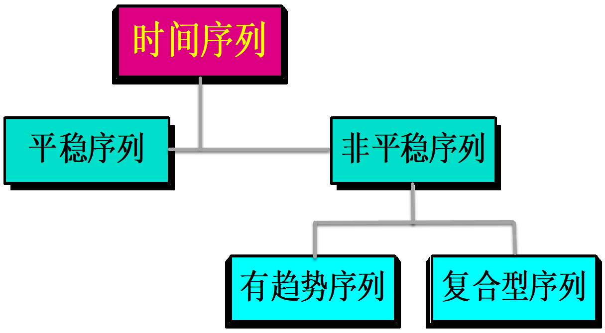
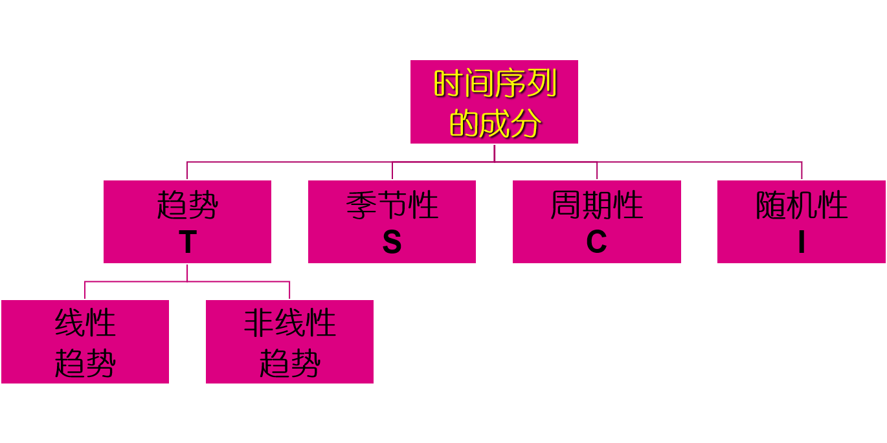
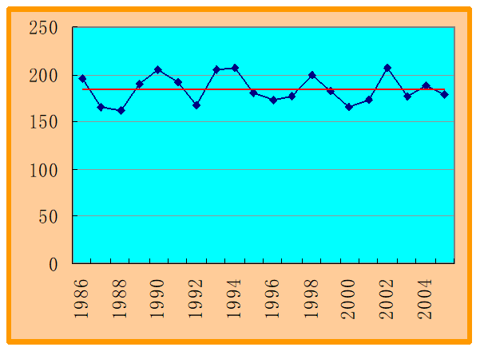
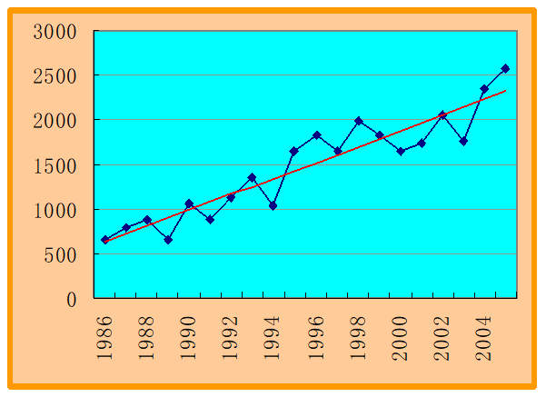
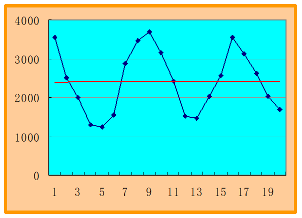
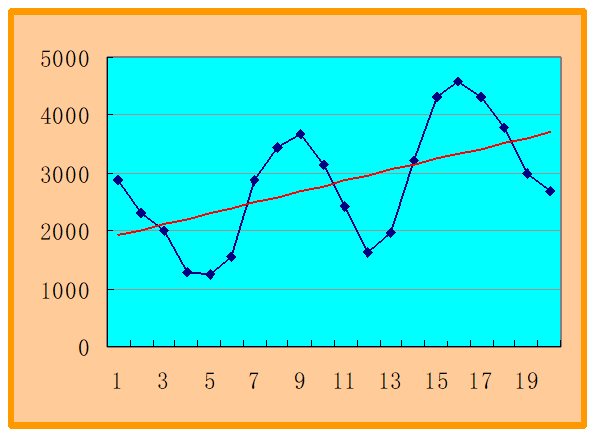
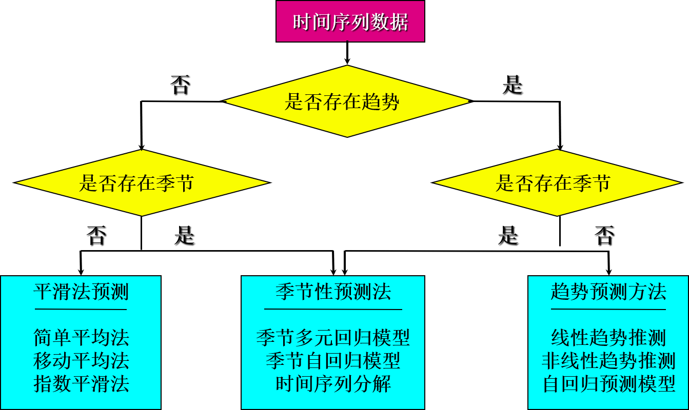

---
params:
  hideslide: FALSE
output:
  xaringan::moon_reader:
    seal: false
    lib_dir: libs
    css:
      - default
      - ../mycss/my-theme.css 
      - ../mycss/my-font.css
      - ../mycss/my-custom-for-video-roomy.css
      - ../mycss/text-box.css
      - duke-blue
      - hygge-duke
    nature:
      highlightStyle: github
      highlightLines: true
      countIncrementalSlides: false
      ratio: "16:9"
---
background-image: url("../pic/slide-front-page.jpg")
class: center,middle
exclude: `r params$hideslide`

# 统计学原理(Statistic)

<!---    chakra: libs/remark-latest.min.js --->

### 胡华平

### 西北农林科技大学

### 经济管理学院数量经济教研室

### huhuaping01@hotmail.com

### `r Sys.Date()`

```{r , echo=F,message=FALSE,warning=F, eval=!params$hideslide}
source("../R/set-global.R")
source("../R/xfun.R", encoding = "UTF-8")
source("../R/external-math-equation.R")
options(width = 70)

# for ggplot theme
source("Rscript/theme-basic.R", encoding = "UTF-8")
```


```{r , echo=FALSE, eval=!params$hideslide}
require('xaringanExtra')

xaringanExtra::use_tachyons()

xaringanExtra::use_panelset()

xaringanExtra::use_logo(
  image_url = "../pic/logo/nwafu-logo-circle-wb.png",
  height = '70px',
  position = xaringanExtra::css_position(top='0.2em',left="1em")
)
```

---

class: center, middle, duke-orange,hide_logo
name: chapter
exclude: `r params$hideslide`

# 第六章 时间序列分析和预测

### [6.1 时间序列及其分解](#decomposition)

### [6.2 时间序列的描述性分析](#explore)

### [6.3 时间序列的预测程序](#process)

### [6.4 平稳序列的预测](#stationary)

### [6.5 趋势型序列的预测](#trend)

### [6.6 复合型序列的分解预测](#composition)


---
layout: false
class: center, middle, duke-softblue,hide_logo
name: decomposition

# 6.1 时间序列及其分解

### 时间序列的构成要素

### 时间序列的分解方法

---
layout: true

<div class="my-header-h2"></div>

<div class="watermark1"></div>

<div class="watermark2"></div>

<div class="watermark3"></div>

<div class="my-footer"><span>huhuaping@  &emsp;&emsp; <a href="#chapter"> 第06章 时间序列分析和预测 </a>
&emsp;&emsp;&emsp;&emsp;&emsp;&emsp;&emsp;&emsp;&emsp;&emsp;&emsp;&emsp;&emsp;&emsp;&emsp;&emsp;&emsp;&emsp;&emsp;&emsp;&emsp;
<a href="#decomposition"> 6.1 时间序列及其分解 </a> </span></div>

---

## 时间序列的概念

**时间序列(times series)**：

- 同一现象在不同时间上的相继观察值排列而成的数列

- 形式上由现象所属的时间和现象在不同时间上的观察值两部分组成

- 排列的时间可以是年份、季度、月份或其他任何时间形式

---

## 时间序列的分类

**平稳序列(stationary series)**：

- 基本上不存在趋势的序列，各观察值基本上在某个固定的水平上波动

- 或虽有波动，但并不存在某种规律，而其波动可以看成是随机的 

**非平稳序列 (non-stationary series)**

- 有趋势的序列，包括线性的或非线性的趋势

- 有趋势、季节性和周期性的复合型序列 

---

## 时间序列的分类

```{r}

```

---

## 时间序列的成分

```{r}

```

---

## 时间序列的成分

- 趋势(trend)：持续向上或持续下降的状态或规律。

- 季节性(seasonality)：也称季节变动(Seasonal fluctuation)，时间序列在一年内重复出现的周期性波动。

- 周期性(cyclity) ：也称循环波动(Cyclical fluctuation) ，围绕长期趋势的一种波浪形或振荡式变动。

- 随机性(random) ：也称不规则波动(Irregular variations) ，除去趋势、周期性和季节性之后的偶然性波动。

---

### 时间序列的成分：平稳

```{r}

```

---

### 时间序列的成分：趋势

```{r}

```

---

### 时间序列的成分：季节

```{r}

```

---

### 时间序列的成分：季节+趋势

```{r}

```

---
layout: false
class: center, middle, duke-softblue,hide_logo
name: explore

# 6.2 时间序列的描述性分析

### 图形描述

###  增长率分析

---
layout: true

<div class="my-header-h2"></div>

<div class="watermark1"></div>

<div class="watermark2"></div>

<div class="watermark3"></div>

<div class="my-footer"><span>huhuaping@  &emsp;&emsp; <a href="#chapter"> 第06章 时间序列分析和预测 </a>
&emsp;&emsp;&emsp;&emsp;&emsp;&emsp;&emsp;&emsp;&emsp;&emsp;&emsp;&emsp;&emsp;&emsp;&emsp;&emsp;&emsp;&emsp;&emsp;&emsp;&emsp;
<a href="#explore"> 6.2 时间序列的描述性分析 </a> </span></div>

---
exclude: true

## （案例）啤酒案例

```{r}
source("Rscript/time-series-case-4-vars.R", encoding = "UTF-8")
```

---

## 图形描述：案例说明

**案例说明**：下表给出了2000-2013年期间我国`r str_compose(names_chn[-1],names(df)[-1],decorate =c("_",""))`。

```{r}
df %>%
  datatable(options = list(pageLength = 6,
                           dom = "tip")) %>%
  formatRound(c(2:5),digits = 1)
  
```

---

### 图形描述：绘制啤酒产量的时序图

```{r, fig.cap="啤酒产量的时序图"}
i <- 2
df %>%
  ggplot(aes(year, beer)) +
  geom_point(color="blue", size = 4) +
  geom_line(color="orange") +
  labs(x = "year年份", 
       y = str_compose(names(df)[i],names_chn[i], 
                       decorate =  c("", ""))) +
  scale_x_continuous(breaks = seq(2000, 2013, 1))+
  theme(axis.text.x = element_text(angle = 45, vjust = 0.1, hjust=0.1)) +
  theme_basic()
```

---

### 图形描述：绘制人均GDP的时序图

```{r, fig.cap="人均GDP的时序图"}
i <- 3
df %>%
  ggplot(aes(year, gdp)) +
  geom_point(color="blue", size = 4) +
  geom_line(color="orange") +
  labs(x = "year年份", 
       y = str_compose(names(df)[i],names_chn[i], 
                       decorate =  c("", ""))) +
  scale_x_continuous(breaks = seq(2000, 2013, 1))+
  theme(axis.text.x = element_text(angle = 45, vjust = 0.1, hjust=0.1)) +
  theme_basic()
```

---

### 图形描述：绘制煤炭消费占比的时序图

```{r, fig.cap="煤炭消费占比的时序图"}
i <- 4
df %>%
  ggplot(aes(year, coal)) +
  geom_point(color="blue", size = 4) +
  geom_line(color="orange") +
  labs(x = "year年份", 
       y = str_compose(names(df)[i],names_chn[i], 
                       decorate =  c("", ""))) +
  scale_x_continuous(breaks = seq(2000, 2013, 1))+
  theme(axis.text.x = element_text(angle = 45, vjust = 0.1, hjust=0.1)) +
  theme_basic()
```

---

### 图形描述：绘制消费价格指数的时序图

```{r, fig.cap="消费价格指数的时序图"}
i <- 5
df %>%
  ggplot(aes(year, cpi)) +
  geom_point(color="blue", size = 4) +
  geom_line(color="orange") +
  labs(x = "year年份", 
       y = str_compose(names(df)[i],names_chn[i], 
                       decorate =  c("", ""))) +
  scale_x_continuous(breaks = seq(2000, 2013, 1))+
  theme(axis.text.x = element_text(angle = 45, vjust = 0.1, hjust=0.1)) +
  theme_basic()
```

---

## 增长率

**增长率(growth rate)**，也称**增长速度**，是报告期观测值与基期观测值之比减1，用百分比\%表示。

- 根据对比的基期不同，增长率可以分为**环比增长率**和**定基增长率**

- 根据计算方法的不同，有一般增长率、平均增长率、年度化增长率

---

## 环比增长率与定基增长率

环比增长率：报告期水平与前一期水平之比减1


定基增长率：报告期水平与某一固定时期水平之比减1


---

## 平均增长率

平均增长率(average rate of increase )：用于描述现象在整个观察期内平均增长变化的程度，是序列中各逐期环比值(也称环比发展速度)的几何平均数减1后的结果。

通常用几何平均法求得。计算公式为：


---

## 增长1%绝对值

增长1%绝对值：增长率每增长一个百分点而增加的绝对量，主要用于弥补增长率分析中的局限性。

计算公式为：

$$产量变化 \Delta =Q_{t_1} - Q_{t_0}$$ 

$$发展速度\% \quad Speed = 100*Q_{t_1} / Q_{t_0}$$

$$增长率\% \quad Ratio  =100*(Q_{t_1} - Q_{t_0})/Q_{t_0}=100*\Delta/Q_{t_0}$$
$$增长1\%的绝对值 = \Delta / Ratio = Q_{t_0}/100$$


---
exclude: true

## （案例）钢产量

```{r}
df<- tibble(period = rep(LETTERS[1:3], each =2) ,
       year = c(1949,1950,1978,1979,1986,1987),
       prod = c(15.8, 61, 3178, 3448, 5220, 5628)) %>%
  group_by(period) %>%
  mutate(prod_l1 = lag(prod),
         increase = prod - prod_l1 ,
         speed = prod/prod_l1,
         ratio = increase/prod_l1,
         Q_one_pct = round(increase/(100*ratio),2 ) )

df_format <-  df %>%
  mutate(speed = scales::percent(speed, accuracy = 0.01),
         ratio = scales::percent(ratio, accuracy = 0.01))
  
```

---

### （案例）钢产量：相对指标与总量指标巧妙结合

.panelset[
.panel[.panel-name[a.案例说明]

**案例数据**：我国三个时期两个年份的钢产量数据如下：

```{r, eval=T}
names_chn <- c("时期", "年份", "钢产量(万吨)", "上1年产量",
               "产量变化", "发展速度%","增长率%",
               "增长1%的绝对值")
df %>%
  rename_at(vars(names(.)), ~ all_of(names_chn)) %>%
  select(1:3) %>%
  datatable(options = list(dom = "t")) 
```


]

.panel[.panel-name[b.计算指标]

根据以上数据，我们可以计算出：

$$产量变化 \Delta =Q_{t_1} - Q_{t_0}$$ 

$$发展速度\% \quad Speed = 100*Q_{t_1} / Q_{t_0}$$

$$增长率\% \quad Ratio  =100*(Q_{t_1} - Q_{t_0})/Q_{t_0}=100*\Delta/Q_{t_0}$$
$$增长1\%的绝对值 = \Delta / Ratio = Q_{t_0}/100$$

]

.panel[.panel-name[c.计算表1]


根据上述指标公式，可以计算得到：

```{r, eval=T}
names_chn <- c("时期", "年份", "钢产量(万吨)", "上1年产量",
               "产量变化", "发展速度%","增长率%",
               "增长1%的绝对值")
df %>%
  rename_at(vars(names(.)), ~ all_of(names_chn)) %>%
  datatable(options = list(dom = "t"))  %>%
  formatRound(columns = c(8),digits = 2) %>%
  formatPercentage(columns = c(6,7), digits = 2)#%>%
  #ungroup() %>%
  #unite(col = date,1:2, sep = "_")# %>%
  #gather()
```

]

.panel[.panel-name[d.计算表2]

前述计算表，也可进一步变形为：

```{r}
level_eng <- c("prod", "increase", "speed", "ratio", "Q_one_pct")
level_chn <- c("钢产量(万吨)", "产量变化", "发展速度%",
               "增长率%","增长1%的绝对值")
df_format %>%
  ungroup() %>%
  unite(col = "Date", period:year, sep = "-" ) %>%
  select(-prod_l1) %>%
  gather(key = "vars", value = "value", -Date) %>%
  spread(key = Date, value = value) %>%
  mutate(vars = mgsub::mgsub(vars, level_eng, level_chn))%>%
  mutate(vars = factor(vars, levels = level_chn )) %>%
  arrange(vars) %>%
  #rename_at(vars(names(.)), ~ all_of(names_chn)) %>%
  datatable(options = list(dom = "t"))
```

]

]


---
layout: false
class: center, middle, duke-softblue,hide_logo
name: process

# 6.3 时间序列预测的程序

### 确定时间序列的成分

### 选择预测方法

### 预测方法的评估

---
layout: true

<div class="my-header-h2"></div>

<div class="watermark1"></div>

<div class="watermark2"></div>

<div class="watermark3"></div>

<div class="my-footer"><span>huhuaping@  &emsp;&emsp; <a href="#chapter"> 第06章 时间序列分析和预测 </a>
&emsp;&emsp;&emsp;&emsp;&emsp;&emsp;&emsp;&emsp;&emsp;&emsp;&emsp;&emsp;&emsp;&emsp;&emsp;&emsp;&emsp;&emsp;&emsp;&emsp;&emsp;
<a href="#process"> 6.3 时间序列预测的程序 </a> </span></div>

---
exclude: true

## （案例）股票价格

```{r}
source("Rscript/time-series-stock.R", encoding = "UTF-8")
names_chn <- c("周次","收盘价格（元）")
```

---

## （案例）股票价格：数据表

**案例说明**：一种股票连续16周的收盘价如下表所示（`r str_compose(names_chn,names(df),decorate =c("_",""))`）。试确定其趋势及其类型。
```{r}
df %>%
  datatable(options = list(pageLength = 6,
                           dom = "tip")) %>%
  formatRound(c(2),digits = 2)
  
```

---

## （案例）股票价格：确定直线趋势方程

```{r, results='asis'}
mod <- formula(price ~ week)
eq <- xmerit::lx.est(mod, df)
```


---

## （案例）股票价格：添加趋势直线

```{r, fig.cap="股价时序图+趋势线"}
i <- 2
df %>%
  ggplot(aes(week, price)) +
  geom_point(color="blue", size = 4) +
  geom_line(color="orange") +
  labs(x = "week 周次", 
       y = str_compose(names(df)[i],names_chn[i], 
                       decorate =  c("", ""))) +
  scale_x_continuous(breaks = seq(1, n, 1))+
  theme(axis.text.x = element_text(angle = 45, vjust = 0.1, hjust=0.1)) +
  theme_basic()
```

---

### 预测方法的选择

```{r}

```

---

### 评估预测方法：计算误差

平均误差ME(mean error)


平均绝对误差MAD(mean absolute deviation)


均方误差MSE(mean square error)

平均百分比误差MPE(mean percentage error)

平均绝对百分比误差MAPE(mean absolute percentage error)


---
layout: false
class: center, middle, duke-softblue,hide_logo
name: stationary

# 6.4 平稳序列的预测

### 简单平均法

### 移动平均法

### 指数平滑法

---
layout: true

<div class="my-header-h2"></div>

<div class="watermark1"></div>

<div class="watermark2"></div>

<div class="watermark3"></div>

<div class="my-footer"><span>huhuaping@  &emsp;&emsp; <a href="#chapter"> 第06章 时间序列分析和预测 </a>
&emsp;&emsp;&emsp;&emsp;&emsp;&emsp;&emsp;&emsp;&emsp;&emsp;&emsp;&emsp;&emsp;&emsp;&emsp;&emsp;&emsp;&emsp;&emsp;&emsp;&emsp;
<a href="#stationary"> 6.4 平稳序列的预测 </a> </span></div>

---

## 简单平均法：过程步骤

步骤1：根据过去已有的
$T$期观察值来预测下一期的数值 
设时间序列已有的其观察值为
$Y_1, Y_2, \cdots Y_T$，则第
$T+1$期的预测值
$F_{T+1}$为:

$$F_{T+1}=\frac{Y_1+ Y_2+ \cdots + Y_T}{T}=\frac{\sum\limits_{t=1}^T{Y_t}}{T}$$

步骤2：有了第
$t+1$的实际值，便可计算出预测误差为

$$e_{t+1}=Y_{t+1} - F_{t+1}$$
步骤3：第
$T+2$期的预测值为:

$$F_{T+2}=\frac{Y_1+ Y_2+ \cdots + Y_T +Y_{T+1}}{T+1}=\frac{\sum\limits_{t=1}^{T+1}{Y_t}}{T+1} $$

---

## 简单平均法：特点


A.适合对较为平稳的时间序列进行预测

B.预测结果可能会不准

- 将远期的数值和近期的数值看作对未来同等重要

- 从预测角度看，近期的数值要比远期的数值对未来有更大的作用

- 当时间序列有趋势或有季节变动时，该方法的预测不够准确

---

## 移动平均法：概念

移动平均法(moving average)：对简单平均法的一种改进方法
，是通过对时间序列逐期递移求得一系列平均数作为预测值(也可作为趋势值) 。


有**简单移动平均法**和**加权移动平均法**两种。

---

## 移动平均法：过程步骤

步骤1：将最近的
$k$期数据平均作为下一期的预测值。

步骤2：设移动间隔为
$k (1<k<T)$，则
$T$期的移动平均值为：

$$\begin{align}
\overline{Y}_{T}=\frac{Y_{T-k+1}+Y_{T-k+2}+\cdots+Y_{T-1}+Y_{T}}{k}
\end{align}$$

步骤3：则认为
$T+1$期的简单移动平均预测值为:

$$\begin{align}
F_{T+1} =
\overline{Y}_{T}=
\frac{Y_{T-k+1}+Y_{T-k+2}+\cdots+Y_{T-1}+Y_{T}}{k}
\end{align}$$

步骤4：预测误差用均方误差(MSE) 来衡量 

$$\begin{align}
MSE =\frac{误差平方和}{误差个数}
=\frac{\sum\limits_{i=1}^n{(Y_i - F_i)^2}}{n}
\end{align}$$

> 其中：
$Y_i$为第
$i$期的实际观测值；$F_i$为第
$i$期的预测值。

---

## 移动平均法：特点

- 将每个观察值都给予相同的权数。

- 只使用最近期的数据，在每次计算移动平均值时，移动的间隔都为
$k$。

- 主要适合对较为平稳的序列进行预测。

- 对于同一个时间序列，采用不同的移动步长预测的准确性是不同的。

- 选择移动步长时，可通过试验的办法，选择一个使均方误差达到最小的移动步长。

---

## 指数平滑平均法

指数平滑法(exponential smoothing)：是加权平均的一种特殊形式，对过去的观察值加权平均进行预测的一种方法。

- 观察值时间越远，其权数也跟着呈现指数的下降，因而称为指数平滑。

- 有一次指数平滑、二次指数平滑、三次指数平滑等。 

- 一次指数平滑法也可用于对时间序列进行修匀，以消除随机波动，找出序列的变化趋势。

---

### 一次指数平滑

一次指数平滑(single exponential smoothing)：

- 只有一个平滑系数

- 观察值离预测时期越久远，权数变得越小 

- 以一段时期的预测值与观察值的线性组合作为第
$T+1$期的预测值，其预测模型为 

$$\begin{align}
F_{T+1}=\alpha Y_{T}+(1-\alpha) F_{T}
\end{align}$$

> 其中：
$Y_T$为第
$T$期的实际观测值；$F_T$为第
$T$期的预测值。

---

### 一次指数平滑：步骤过程

步骤1：在开始计算时，没有第1期的预测值
$F_1$，通常可以设
$F_1$等于第1期的实际观察值，即
$F_1=Y_1$。

步骤2：则第2期的预测值为：

$$\begin{align}
F_{2}=\alpha Y_{1}+(1-\alpha) F_{1}=\alpha Y_{1}+(1-\alpha) Y_{1}=Y_{1}
\end{align}$$

步骤3：同上，则第3期的预测值为：

$$\begin{align}
F_{3}=\alpha Y_{2}+(1-\alpha) F_{2}=\alpha Y_{2}+(1-\alpha) Y_{1}
\end{align}$$

---

### 一次指数平滑：预测误差

预测精度，用误差均方来衡量

$$\begin{align}
F_{T+1} &=\alpha Y_{T}+(1-\alpha) F_{T} \\
&=\alpha Y_{T}+F_{T}-\alpha F_{T} \\
&=F_{T}+\alpha\left(Y_{T}-F_{T}\right)
\end{align}$$

$F_{T+1}$是第
$T$期的预测值
$F_T$加上用
$\alpha$调整的第
$T$期的预测误差
$(Y_T-F_T)$

---

### 一次指数平滑：指数的确定

不同的
$\alpha$会对预测结果产生不同的影响
当时间序列有较大的随机波动时，宜选较大的
$\alpha$，以便能很快跟上近期的变化
当时间序列比较平稳时，宜选较小的
$\alpha$

选择
$\alpha$时，还应考虑预测误差

- 误差均方来衡量预测误差的大小

- 确定
$\alpha$时，可选择几个进行预测，然后找出预测误差最小的作为最后的值

---

### 一次指数平滑：Excel操作

第1步：选择【工具】下拉菜单

第2步：选择【数据分析】，并选择【指数平滑】，然后【确定】

第3步：当对话框出现时，在【输入区域】中输入数据区域在【阻尼系数】（注意：阻尼系数=
$1-\ahpa$）输入的值选择【确定”】


---
layout: false
class: center, middle, duke-softblue,hide_logo
name: trend

# 6.5 趋势型序列的预测

### 线性趋势预测

### 非线性趋势预测

---
layout: true

<div class="my-header-h2"></div>

<div class="watermark1"></div>

<div class="watermark2"></div>

<div class="watermark3"></div>

<div class="my-footer"><span>huhuaping@  &emsp;&emsp; <a href="#chapter"> 第06章 时间序列分析和预测 </a>
&emsp;&emsp;&emsp;&emsp;&emsp;&emsp;&emsp;&emsp;&emsp;&emsp;&emsp;&emsp;&emsp;&emsp;&emsp;&emsp;&emsp;&emsp;&emsp;&emsp;&emsp;
<a href="#trend"> 6.5 趋势型序列的预测 </a> </span></div>

---

## 趋势序列及其预测方法

趋势(trend)：持续向上或持续下降的状态或规律，包括线性趋势和非线性趋势

预测方法主要有：

- 线性趋势预测

- 非线性趋势预测

- 自回归模型预测

---

## 线性趋势预测：

线性趋势(linear trend)：现象随着时间的推移而呈现出稳定增长或下降的线性变化规律。

- 由影响时间序列的基本因素作用形成

- 是时间序列的成分之一

- 主要预测方法可以使用**线性模型法**

---

## 线性趋势预测：线性模型法

$$\begin{align}
Y_t & = \hat{\beta}_1 +\hat{\beta}_2t +e_i \\
\hat{Y}_{t} & = \hat{\beta}_1 +\hat{\beta}_2t 
\end{align}$$

> 其中：
$\hat{Y}_{t}$为时间序列的预测值；
${t}$为时间标号。

预测误差可用回归误差标准差
$s.e=\hat{\sigma}=\sqrt{\frac{RSS}{n-2}}=\sqrt{\frac{\sum{e_i^2}}{n-2}}$来衡量。

---

## 非线性趋势预测：指数曲线法（方法）

指数曲线(exponential curve) ：时间序列以几何级数递增或递减。一般形式为：

$$\begin{align}
{Y}_{t} &=\hat{\beta}_{1} \hat{\beta}_{2}^{t} +e_t\\
\hat{Y}_{t} &=\hat{\beta}_{1} \hat{\beta}_{2}^{t} 
\end{align}$$

> 其中：
$\hat{\beta}_{1}、\hat{\beta}_{2}$为待定系数；
${t}$为时间标号。

- 若
$\hat{\beta}_{2} >1$，增长率随着时间t的增加而增加

- 若
$\hat{\beta}_{2} <1$，增长率随着时间t的增加而降低

- 若
$\hat{\beta}_{1}>0,\hat{\beta}_{2}<1$，则趋势值逐渐降低到以0为极限

---

## 非线性趋势预测：指数曲线法（过程）

**步骤1**：采取“线性化”手段将其化为对数直线形式，并使用OLS方法估计出变换后线性回归模型的参数。

$$\begin{align}
{Y}_{t} &=\hat{\beta}_{1}+ \hat{\beta}_{2}^{t} +e_t\\
ln({Y}_{t}) &=ln(\hat{\beta}_{1}) +ln(\hat{\beta}_{2}^{t}) +v_t\\
ln({Y}_{t}) &=ln(\hat{\beta}_{1}) + ln(\hat{\beta}_{2})\cdot {t} +v_t\\
{Y}_{t}^{\ast} &=\hat{\beta}_{1}^{\ast} + \hat{\beta}_{2}^{\ast}{t} +v_t
\end{align}$$


> 其中：
$\hat{\beta}_{1}^{\ast}、\hat{\beta}_{2}^{\ast}$为待定系数；
${t}$为时间标号。

**步骤2**：利用变换关系，进一步计算出指数模型中的参数（取反对数）：

$$\begin{align}
  \begin{cases}
  \hat{\beta}_{1}^{\ast} = ln(\hat{\beta}_{1}) \\
  \hat{\beta}_{2}^{\ast} = ln(\hat{\beta}_{2}) 
  \end{cases} 
\Rightarrow
  \begin{cases}
   \hat{\beta}_{1}= arcln(\hat{\beta}_{1}^{\ast}) \\
   \hat{\beta}_{2} = arcln( \hat{\beta}_{2}^{\ast}) 
  \end{cases} 
\end{align}$$

---

## 非线性趋势预测：多项式（高阶）曲线

有些现象的变化形态比较复杂，它们不是按照某种固定的形态变化，而是有升有降，在变化过程中可能有几个拐点。这时就需要拟合多项式函数

- 当只有一个拐点时，可以拟合二阶曲线，即抛物线；

- 当有两个拐点时，需要拟合三阶曲线；

- 当有
$k-1$个拐点时，需要拟合
$k$阶曲线 


一般形式的
$k$阶曲线模型形式为：

$$\begin{align}
Y_t &=\hat{\beta}_{0}+\hat{\beta}_{1} t+\hat{\beta}_{2} t^{2}+\cdots+\hat{\beta}_{k} t^{k} + e_t \\
\hat{Y}_{t} &=\hat{\beta}_{0}+\hat{\beta}_{1} t+\hat{\beta}_{2} t^{2}+\cdots+\hat{\beta}_{k} t^{k}
\end{align}$$

采用OLS方法估计出上述待求解参数。

---

## 趋势线的选择

方法1：观察散点图

方法2：根据观察数据本身，按以下标准选择趋势线

- 一次差大体相同，配合直线

- 二次差大体相同，配合二次曲线

- 对数的一次差大体相同，配合指数曲线

- 一次差的环比值大体相同，配合修正指数曲线

- 对数一次差的环比值大体相同，配合Gompertz曲线

- 倒数一次差的环比值大体相同，配合Logistic曲线

方法3：比较估计标准误差

---
layout: false
class: center, middle, duke-softblue,hide_logo
name: composition

# 6.6 复合型序列的分解预测

### 确定并分离季节成分

### 建立预测模型并进行预测

### 计算最后的预测值


---
layout: true

<div class="my-header-h2"></div>

<div class="watermark1"></div>

<div class="watermark2"></div>

<div class="watermark3"></div>

<div class="my-footer"><span>huhuaping@  &emsp;&emsp; <a href="#chapter"> 第06章 时间序列分析和预测 </a>
&emsp;&emsp;&emsp;&emsp;&emsp;&emsp;&emsp;&emsp;&emsp;&emsp;&emsp;&emsp;&emsp;&emsp;&emsp;&emsp;&emsp;&emsp;&emsp;&emsp;&emsp;
<a href="#composition"> 6.6 复合型序列的分解预测 </a> </span></div>

---

## 预测步骤

步骤1：确定并分离季节成分

- 计算季节指数，以确定时间序列中的季节成分

- 将季节成分从时间序列中分离出去，即用每一个观测值除以相应的季节指数，以消除季节性

步骤2：建立预测模型并进行预测

- 对消除季节成分的序列建立适当的预测模型，并根据这一模型进行预测

步骤3：计算出最后的预测值

- 用预测值乘以相应的季节指数，得到最终的预测值 

---

### 确定并分离季节成分：计算季节指数（思路）

刻画序列在一个年度内各月或季的典型季节特征

以其平均数等于100%为条件而构成

反映某一月份或季度的数值占全年平均数值的大小
如果现象的发展没有季节变动，则各期的季节指数应等于100%

季节变动的程度是根据各季节指数与其平均数(100%)的偏差程度来测定

- 如果某一月份或季度有明显的季节变化，则各期的季节指数应大于或小于100%


---

### 确定并分离季节成分：计算季节指数（步骤）

步骤1：计算移动平均值(季度数据采用4项移动平均，月份数据采用12项移动平均)，并将其结果进行“中心化”处理

- 将移动平均的结果再进行一次2项的移动平均，即得出“中心化移动平均值”(CMA)

步骤2：计算移动平均的比值，也称为季节比率

- 将序列的各观察值除以相应的中心化移动平均值，然后再计算出各比值的季度(或月份)平均值，即季节指数

步骤3：季节指数调整

- 各季节指数的平均数应等于1或100%，若根据第2步计算的季节比率的平均值不等于1时，则需要进行调整

- 具体方法是：将第2步计算的每个季节比率的平均值除以它们的总平均值 

---

### 确定并分离季节成分：分离季节因素

将原时间序列除以相应的季节指数

$$\begin{align}
\frac{Y}{S}=\frac{T \times S \times I}{S}=T \times I
\end{align}$$

季节因素分离后的序列反映了在没有季节因素影响的情况下时间序列的变化形态 

---

## 线性趋势模型及预测

步骤1：根据分离季节性因素的序列确定线性趋势方程 

步骤2：根据趋势方程进行预测

- 该预测值不含季节性因素，即在没有季节因素影响情况下的预测值

步骤3：计算最终的预测值

- 将回归预测值乘以相应的季节指数


---
layout:false
background-image: url("../pic/thank-you-gif-funny-little-yellow.gif")
class: inverse,center
# 本节结束

